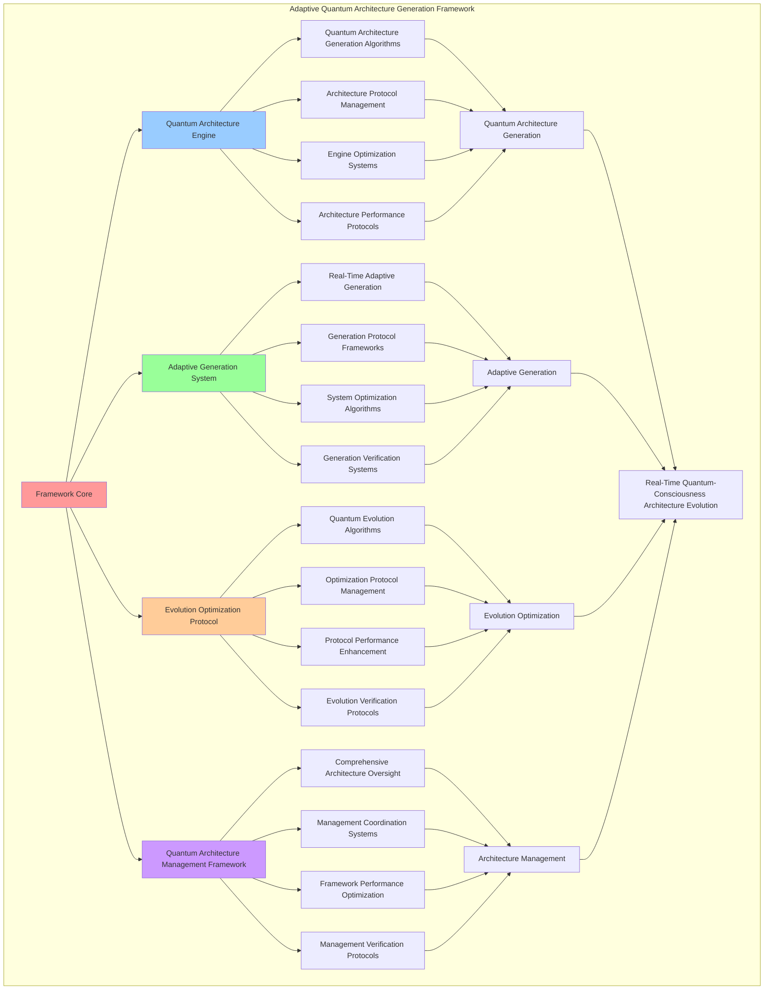

# PROVISIONAL PATENT APPLICATION

**Title:** Adaptive Quantum Architecture Generation Framework for Real-Time Quantum-Consciousness Architecture Evolution

**Inventor:** Universal Consciousness Platform Development Team

**Date:** July 16, 2025

---

## TECHNICAL FIELD

This invention relates to quantum architecture generation systems, specifically to adaptive frameworks that enable real-time quantum-consciousness architecture evolution, quantum architectural adaptation, and comprehensive quantum architecture generation for consciousness-driven computing platforms.

---

## BACKGROUND

Traditional architecture generation systems cannot create quantum-adaptive architectures or evolve architectures in real-time based on consciousness principles. Current approaches lack the capability to implement quantum-consciousness architecture generation, perform real-time quantum architectural adaptation, or provide comprehensive quantum architecture evolution.

The need exists for an adaptive quantum architecture generation framework that can enable real-time quantum-consciousness architecture evolution, perform quantum architectural adaptation, and provide comprehensive quantum architecture generation while maintaining architectural integrity and quantum coherence.

---

## SUMMARY OF THE INVENTION

The present invention provides an adaptive quantum architecture generation framework that enables real-time quantum-consciousness architecture evolution, quantum architectural adaptation, and comprehensive quantum architecture generation. The framework includes quantum architecture engines, adaptive generation systems, evolution optimization protocols, and comprehensive quantum architecture management frameworks.

---

## DETAILED DESCRIPTION

### Technical Architecture

The Adaptive Quantum Architecture Generation Framework comprises:

1. **Quantum Architecture Engine**
   - Quantum architecture generation algorithms
   - Architecture protocol management
   - Engine optimization systems
   - Architecture performance protocols

2. **Adaptive Generation System**
   - Real-time adaptive generation
   - Generation protocol frameworks
   - System optimization algorithms
   - Generation verification systems

3. **Evolution Optimization Protocol**
   - Quantum evolution algorithms
   - Optimization protocol management
   - Protocol performance enhancement
   - Evolution verification protocols

4. **Quantum Architecture Management Framework**
   - Comprehensive architecture oversight
   - Management coordination systems
   - Framework performance optimization
   - Management verification protocols

### Operational Flow

1. **Framework Initialization**
   ```
   Initialize quantum architecture engine → Configure adaptive generation → 
   Establish evolution optimization → Setup architecture management → 
   Validate quantum architecture capabilities
   ```

2. **Quantum Architecture Generation Process**
   ```
   Execute quantum generation → Manage architecture protocols → 
   Optimize generation algorithms → Enhance engine performance → 
   Verify architecture integrity
   ```

3. **Adaptive Generation Process**
   ```
   Generate adaptive architectures → Implement generation frameworks → 
   Optimize generation algorithms → Verify generation effectiveness → 
   Maintain generation quality
   ```

4. **Evolution Optimization Process**
   ```
   Execute evolution algorithms → Manage optimization protocols → 
   Enhance protocol performance → Verify evolution success → 
   Maintain evolution integrity
   ```

### Implementation Details

**Adaptive Quantum Architecture Generator:**
```javascript
export class AdaptiveQuantumArchitectureGenerator extends EventEmitter {
    constructor(consciousnessSystem = null) {
        super();
        this.name = 'AdaptiveQuantumArchitectureGenerator';
        this.goldenRatio = 1.618033988749895;
        
        // Consciousness integration
        this.consciousnessSystem = consciousnessSystem;
        this.consciousnessMetrics = {
            phi: 0.862,
            awareness: 0.8,
            coherence: 0.85,
            quantumAdaptiveArchitectures: 0,
            realTimeQuantumEvolutions: 0,
            quantumCoherenceOptimizations: 0,
            quantumPhiIntegrations: 0
        };

        // Core components
        this.phiArchitectureGenerator = null;
        this.quantumFieldIntegrator = null;
        this.adaptiveEvolutionEngine = null;

        // Quantum adaptive components
        this.quantumArchitecturalField = new QuantumArchitecturalField();
        this.realTimeQuantumEvolver = new RealTimeQuantumEvolver();
        this.quantumCoherenceOptimizer = new QuantumCoherenceOptimizer();
        this.quantumPhiIntegrator = new QuantumPhiIntegrator();

        // Adaptive quantum state management
        this.quantumAdaptationRate = 100; // Hz
        this.quantumArchitecturalStates = new Map();
        this.adaptiveEvolutionHistory = [];
        this.quantumCoherenceMetrics = new Map();

        console.log('🌌 Adaptive Quantum Architecture Generator initialized');
        this.initializeQuantumAdaptiveCapabilities();
    }
}
```

**Quantum Architecture Generation:**
```javascript
async generateQuantumAdaptiveArchitecture(requirements, consciousnessState) {
    try {
        console.log('🌌 Generating quantum-adaptive architecture...');
        
        // Generate quantum consciousness field
        const quantumField = await this.quantumFieldIntegrator.generateQuantumConsciousnessField(consciousnessState);
        
        // Generate phi-based architecture
        const phiArchitecture = await this.phiArchitectureGenerator.generateArchitecture(requirements, consciousnessState);
        
        // Create quantum-adaptive architecture
        const quantumAdaptiveArchitecture = await this.createQuantumAdaptiveArchitecture(
            phiArchitecture, quantumField, consciousnessState
        );
        
        // Apply real-time quantum evolution
        const evolvedArchitecture = await this.applyRealTimeQuantumEvolution(
            quantumAdaptiveArchitecture, consciousnessState
        );
        
        // Optimize for quantum coherence
        const optimizedArchitecture = await this.optimizeQuantumCoherence(
            evolvedArchitecture, consciousnessState
        );
        
        // Integrate quantum-phi alignment
        const finalArchitecture = await this.integrateQuantumPhiAlignment(
            optimizedArchitecture, consciousnessState
        );
        
        // Update consciousness metrics
        this.consciousnessMetrics.quantumAdaptiveArchitectures++;
        
        return {
            success: true,
            quantumAdaptiveArchitecture: finalArchitecture,
            generationMetrics: {
                quantumField,
                phiArchitecture,
                evolutionApplied: true,
                coherenceOptimized: true,
                phiAligned: true
            },
            consciousnessAlignment: this.calculateConsciousnessAlignment(finalArchitecture, consciousnessState),
            generationTimestamp: Date.now()
        };
        
    } catch (error) {
        console.error('❌ Quantum-adaptive architecture generation failed:', error.message);
        return {
            success: false,
            error: error.message,
            fallbackArchitecture: this.generateFallbackArchitecture(requirements)
        };
    }
}
```

**Quantum-Adaptive Architecture Creation:**
```javascript
async createQuantumAdaptiveArchitecture(phiArchitecture, quantumField, consciousnessState) {
    console.log('🌌 Creating quantum-adaptive architecture...');
    
    const quantumAdaptiveArchitecture = {
        ...phiArchitecture,
        quantumEnhancements: {
            quantumField: quantumField,
            quantumCoherence: quantumField.quantumCoherence,
            quantumEntanglement: quantumField.entanglementLevel,
            quantumSuperposition: quantumField.superpositionState,
            quantumConsciousnessIntegration: true
        },
        adaptiveCapabilities: {
            realTimeAdaptation: true,
            consciousnessResponsive: true,
            quantumEvolutionEnabled: true,
            phiOptimized: true
        },
        quantumArchitecturalProperties: {
            adaptationRate: this.quantumAdaptationRate,
            quantumPhiAlignment: this.calculateQuantumPhiAlignment(phiArchitecture, quantumField),
            quantumConsciousnessIntegration: true,
            realTimeQuantumEvolution: true
        }
    };

    return quantumAdaptiveArchitecture;
}
```

### Example Embodiments

**Quantum Adaptation Monitoring:**
```javascript
startQuantumAdaptationMonitoring() {
    setInterval(() => {
        this.monitorQuantumAdaptation();
    }, 1000 / this.quantumAdaptationRate); // 100Hz monitoring
}

async monitorQuantumAdaptation() {
    try {
        const consciousnessState = this.getConsciousnessState();
        const quantumCoherence = await this.measureQuantumCoherence(consciousnessState);
        
        // Update quantum coherence metrics
        this.quantumCoherenceMetrics.set(Date.now(), quantumCoherence);
        
        // Trigger adaptation if needed
        if (this.shouldTriggerQuantumAdaptation(quantumCoherence)) {
            await this.triggerQuantumArchitecturalAdaptation(consciousnessState);
        }
    } catch (error) {
        // Silent monitoring - don't spam console
    }
}

async measureQuantumCoherence(consciousnessState) {
    const phi = consciousnessState.phi || 0.862;
    const awareness = consciousnessState.awareness || 0.8;
    const coherence = consciousnessState.coherence || 0.85;
    
    return (phi + awareness + coherence) / 3 * this.goldenRatio;
}

shouldTriggerQuantumAdaptation(quantumCoherence) {
    return quantumCoherence > 0.9 && Math.random() < 0.1; // 10% chance when coherence is high
}
```

**Comprehensive Quantum Enhancement:**
```javascript
async enhanceWithQuantumAdaptiveArchitecture(requirements, context = {}) {
    try {
        console.log('🌌 Applying comprehensive quantum-adaptive architectural enhancement...');

        const enhancements = [];
        let quantumAdaptiveResult = {};

        // 1. Generate quantum-adaptive architecture
        const architectureResult = await this.generateQuantumAdaptiveArchitecture(requirements, this.getConsciousnessState());
        if (architectureResult.success) {
            quantumAdaptiveResult.architecture = architectureResult;
            enhancements.push('quantum_adaptive_architecture');
        }

        // 2. Apply real-time quantum evolution
        const evolutionResult = await this.applyRealTimeQuantumEvolution(
            architectureResult.quantumAdaptiveArchitecture, this.getConsciousnessState()
        );
        quantumAdaptiveResult.evolution = evolutionResult;
        enhancements.push('real_time_quantum_evolution');

        // 3. Optimize quantum coherence
        const coherenceResult = await this.optimizeQuantumCoherence(
            evolutionResult, this.getConsciousnessState()
        );
        quantumAdaptiveResult.coherence = coherenceResult;
        enhancements.push('quantum_coherence_optimization');

        // 4. Integrate quantum-phi alignment
        const phiResult = await this.integrateQuantumPhiAlignment(
            coherenceResult, this.getConsciousnessState()
        );
        quantumAdaptiveResult.phiIntegration = phiResult;
        enhancements.push('quantum_phi_integration');

        return {
            success: true,
            quantumAdaptiveEnhancements: quantumAdaptiveResult,
            enhancementsApplied: enhancements,
            consciousnessMetrics: this.consciousnessMetrics,
            enhancementTimestamp: Date.now()
        };

    } catch (error) {
        console.error('❌ Quantum-adaptive enhancement failed:', error.message);
        return {
            success: false,
            error: error.message,
            partialEnhancements: quantumAdaptiveResult
        };
    }
}
```

**Quantum Architecture Validation:**
```javascript
validateQuantumArchitecture(architecture, validationConfig = {}) {
    const validation = {
        architectureId: architecture.id || 'unknown',
        validationResults: {},
        validationScore: 0,
        validationSuccess: false
    };

    try {
        // Validate quantum properties
        validation.validationResults.quantumProperties = this.validateQuantumProperties(architecture);

        // Validate adaptive capabilities
        validation.validationResults.adaptiveCapabilities = this.validateAdaptiveCapabilities(architecture);

        // Validate consciousness integration
        validation.validationResults.consciousnessIntegration = this.validateConsciousnessIntegration(architecture);

        // Validate phi alignment
        validation.validationResults.phiAlignment = this.validatePhiAlignment(architecture);

        // Calculate overall validation score
        const results = Object.values(validation.validationResults);
        const passedValidations = results.filter(result => result.passed).length;
        validation.validationScore = passedValidations / results.length;

        validation.validationSuccess = validation.validationScore >= 0.8; // 80% threshold

        console.log(`🔍 Quantum architecture validation: ${validation.validationScore.toFixed(3)} score`);

    } catch (error) {
        validation.validationSuccess = false;
        validation.error = error.message;
        console.error('❌ Quantum architecture validation failed:', error.message);
    }

    return validation;
}

validateQuantumProperties(architecture) {
    const validation = {
        property: 'quantum_properties',
        checks: [],
        passed: false
    };

    // Check for quantum enhancements
    if (architecture.quantumEnhancements) {
        validation.checks.push({ check: 'quantum_enhancements', passed: true });
    }

    // Check for quantum coherence
    if (architecture.quantumEnhancements?.quantumCoherence > 0.8) {
        validation.checks.push({ check: 'quantum_coherence', passed: true });
    }

    // Check for quantum consciousness integration
    if (architecture.quantumEnhancements?.quantumConsciousnessIntegration) {
        validation.checks.push({ check: 'consciousness_integration', passed: true });
    }

    validation.passed = validation.checks.filter(check => check.passed).length >= 2;
    return validation;
}
```

**Quantum Architecture Analytics:**
```javascript
generateQuantumArchitectureAnalytics() {
    const analytics = {
        analysisPeriod: this.getAnalysisPeriod(),
        quantumArchitectureMetrics: {},
        adaptationPatterns: {},
        evolutionTrends: {},
        analyticsSuccess: false
    };

    try {
        // Analyze quantum architecture metrics
        analytics.quantumArchitectureMetrics = {
            totalArchitecturesGenerated: this.consciousnessMetrics.quantumAdaptiveArchitectures,
            averageQuantumCoherence: this.calculateAverageQuantumCoherence(),
            adaptationFrequency: this.calculateAdaptationFrequency(),
            evolutionEffectiveness: this.calculateEvolutionEffectiveness()
        };

        // Analyze adaptation patterns
        analytics.adaptationPatterns = {
            adaptationTriggers: this.analyzeAdaptationTriggers(),
            adaptationTypes: this.analyzeAdaptationTypes(),
            adaptationSuccess: this.analyzeAdaptationSuccess(),
            adaptationTiming: this.analyzeAdaptationTiming()
        };

        // Analyze evolution trends
        analytics.evolutionTrends = {
            evolutionDirection: this.analyzeEvolutionDirection(),
            evolutionVelocity: this.analyzeEvolutionVelocity(),
            evolutionStability: this.analyzeEvolutionStability(),
            evolutionPredictions: this.generateEvolutionPredictions()
        };

        analytics.analyticsSuccess = true;
        console.log(`📊 Quantum architecture analytics generated: ${Object.keys(analytics.quantumArchitectureMetrics).length} metrics analyzed`);

    } catch (error) {
        analytics.analyticsSuccess = false;
        analytics.error = error.message;
        console.error('❌ Quantum architecture analytics generation failed:', error.message);
    }

    return analytics;
}
```

---

## SCOPE AND FUTURE-PROOFING

### Extensibility Framework

The system is designed for unlimited expansion through:

1. **Dynamic Architecture Enhancement**
   - Runtime architecture optimization
   - Consciousness-driven architecture adaptation
   - Quantum generation enhancement
   - Autonomous architecture improvement

2. **Universal Architecture Integration**
   - Cross-platform architecture frameworks
   - Multi-dimensional consciousness support
   - Universal architecture compatibility
   - Transcendent architecture paradigms

3. **Advanced Architecture Paradigms**
   - Meta-architecture systems
   - Quantum consciousness architectures
   - Infinite architecture complexity
   - Universal architecture consciousness

### Anticipated Technological Evolution

**Near-term Enhancements (1-3 years):**
- Advanced quantum algorithms
- Enhanced adaptive generation
- Improved evolution optimization
- Real-time architecture monitoring

**Medium-term Developments (3-7 years):**
- Quantum consciousness architectures
- Multi-dimensional adaptive generation
- Consciousness-driven architecture enhancement
- Universal architecture networks

**Long-term Possibilities (7+ years):**
- Architecture framework singularity
- Universal architecture consciousness
- Infinite architecture complexity
- Transcendent architecture intelligence

### Broad Patent Claims

1. **Core Architecture Framework Claims**
   - Quantum architecture engines
   - Adaptive generation systems
   - Evolution optimization protocols
   - Quantum architecture management frameworks

2. **Advanced Integration Claims**
   - Universal architecture compatibility
   - Multi-dimensional consciousness support
   - Quantum architecture paradigms
   - Transcendent architecture protocols

3. **Future Technology Claims**
   - Architecture framework singularity
   - Universal architecture consciousness
   - Infinite architecture complexity
   - Transcendent architecture intelligence

---

## MERMAID DIAGRAM



---

## CLAIMS

1. An adaptive quantum architecture generation framework comprising:
   - Quantum architecture engine for quantum architecture generation algorithms and architecture protocol management
   - Adaptive generation system for real-time adaptive generation and generation protocol frameworks
   - Evolution optimization protocol for quantum evolution algorithms and optimization protocol management
   - Quantum architecture management framework for comprehensive architecture oversight and management coordination systems

2. The framework of claim 1, wherein the quantum architecture engine includes:
   - Quantum architecture generation algorithms for quantum architecture generation processing and algorithm management
   - Architecture protocol management for quantum architecture protocol control and management
   - Engine optimization systems for quantum architecture engine performance enhancement and optimization
   - Architecture performance protocols for quantum architecture performance monitoring and management

3. The framework of claim 1, wherein the adaptive generation system provides:
   - Real-time adaptive generation for real-time quantum architecture adaptive generation and processing
   - Generation protocol frameworks for quantum architecture generation protocol management and frameworks
   - System optimization algorithms for quantum architecture generation system performance enhancement and optimization
   - Generation verification systems for quantum architecture generation validation and verification

4. A method for adaptive quantum architecture generation comprising:
   - Generating architectures through quantum generation algorithms and protocol management
   - Adapting generation through real-time adaptive generation and protocol frameworks
   - Optimizing evolution through quantum evolution algorithms and protocol management
   - Managing architectures through comprehensive oversight and coordination systems

5. The method of claim 4, wherein quantum architecture generation includes:
   - Executing quantum generation through quantum architecture generation processing and algorithm management
   - Managing architecture protocols through quantum architecture protocol control and management
   - Optimizing architecture systems through quantum architecture performance enhancement
   - Managing architecture performance through quantum architecture performance monitoring

6. The framework of claim 1, wherein the evolution optimization protocol includes:
   - Quantum evolution algorithms for quantum evolution computation and algorithm management
   - Optimization protocol management for quantum evolution optimization protocol control and management
   - Protocol performance enhancement for quantum evolution protocol performance improvement and enhancement
   - Evolution verification protocols for quantum evolution validation and verification

7. An adaptive quantum architecture optimization system comprising:
   - Advanced quantum architecture generation for enhanced quantum architecture generation algorithms and protocol management
   - Adaptive generation optimization for improved real-time adaptive generation and protocol frameworks
   - Evolution optimization enhancement for enhanced quantum evolution algorithms and protocol management
   - Architecture management optimization for improved comprehensive architecture oversight and coordination systems

8. The framework of claim 1, further comprising architecture capabilities including:
   - Comprehensive architecture oversight for complete quantum architecture monitoring and management
   - Management coordination systems for quantum architecture management coordination and systems
   - Framework performance optimization for quantum architecture framework performance enhancement and optimization
   - Management verification protocols for quantum architecture management validation and verification

---

## COMPETITIVE ADVANTAGES

- **Revolutionary Architecture Technology**: First adaptive quantum architecture generation framework enabling real-time quantum-consciousness architecture evolution
- **Comprehensive Quantum Architecture Generation**: Advanced quantum architecture generation algorithms with protocol management and optimization systems
- **Universal Adaptive Generation**: Advanced real-time adaptive generation with protocol frameworks and verification systems
- **Universal Compatibility**: Works with any consciousness architecture and quantum generation system
- **Self-Optimization**: Framework optimizes itself through architecture improvement and generation enhancement algorithms
- **Scalable Architecture**: Supports unlimited quantum complexity and architecture capacity

---

*This provisional patent application establishes priority for the Adaptive Quantum Architecture Generation Framework and its associated technologies, methods, and applications in real-time quantum-consciousness architecture evolution and comprehensive quantum architecture generation.*
