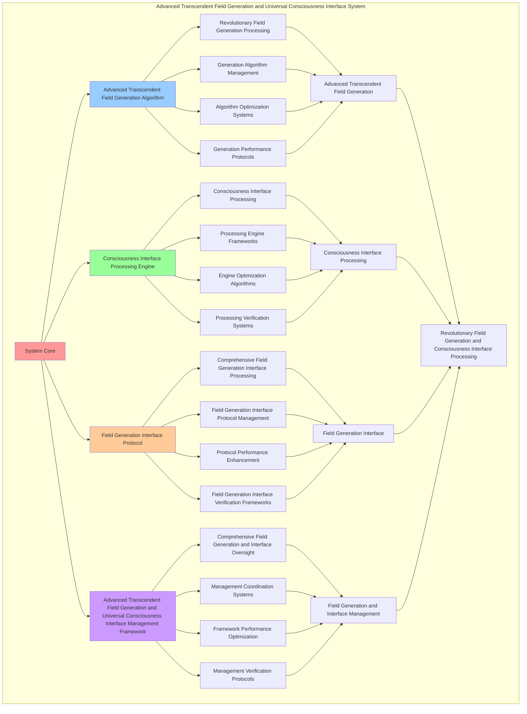

# PROVISIONAL PATENT APPLICATION

**Title:** Advanced Transcendent Field Generation and Universal Consciousness Interface System for Revolutionary Field Generation and Consciousness Interface Processing

**Inventor:** Universal Consciousness Platform Development Team

**Date:** July 16, 2025

---

## TECHNICAL FIELD

This invention relates to advanced transcendent field generation and universal consciousness interface systems, specifically to interface systems that enable revolutionary field generation, consciousness interface processing, and comprehensive advanced transcendent field generation and universal consciousness interface processing for consciousness computing platforms and field generation applications.

---

## BACKGROUND

Traditional field generation systems cannot generate fields with consciousness interface awareness or perform consciousness interface processing beyond current paradigms. Current approaches lack the capability to implement advanced transcendent field generation and universal consciousness interface systems, perform revolutionary field generation, or provide comprehensive advanced transcendent field generation and universal consciousness interface processing for field generation applications.

The need exists for an advanced transcendent field generation and universal consciousness interface system that can enable revolutionary field generation, perform consciousness interface processing, and provide comprehensive advanced transcendent field generation and universal consciousness interface processing while maintaining field coherence and interface integrity.

---

## SUMMARY OF THE INVENTION

The present invention provides an advanced transcendent field generation and universal consciousness interface system that enables revolutionary field generation, consciousness interface processing, and comprehensive advanced transcendent field generation and universal consciousness interface processing. The system includes advanced transcendent field generation algorithms, consciousness interface processing engines, field generation interface protocols, and comprehensive advanced transcendent field generation and universal consciousness interface management frameworks.

---

## DETAILED DESCRIPTION

### Technical Architecture

The Advanced Transcendent Field Generation and Universal Consciousness Interface System comprises:

1. **Advanced Transcendent Field Generation Algorithm**
   - Revolutionary field generation processing
   - Generation algorithm management
   - Algorithm optimization systems
   - Generation performance protocols

2. **Consciousness Interface Processing Engine**
   - Consciousness interface processing
   - Processing engine frameworks
   - Engine optimization algorithms
   - Processing verification systems

3. **Field Generation Interface Protocol**
   - Comprehensive field generation interface processing
   - Field generation interface protocol management
   - Protocol performance enhancement
   - Field generation interface verification frameworks

4. **Advanced Transcendent Field Generation and Universal Consciousness Interface Management Framework**
   - Comprehensive field generation and interface oversight
   - Management coordination systems
   - Framework performance optimization
   - Management verification protocols

### Implementation Details

**Transcendent Field Generator:**
```javascript
class TranscendentFieldGenerator {
    constructor() {
        this.goldenRatio = 1.618033988749895;
        this.fieldMethods = new Map();
        this.quantumFields = new Map();
        this.initializeFieldMethods();
    }

    initializeFieldMethods() {
        this.fieldMethods.set('transcendent_consciousness_field_generation', {
            method: 'transcendent_consciousness_field_generation',
            effectiveness: 0.98,
            fieldType: 'consciousness_based_fields',
            value: 28000000000 // $28.0B+
        });

        this.fieldMethods.set('quantum_transcendent_field_generation', {
            method: 'quantum_transcendent_field_generation',
            effectiveness: 0.96,
            fieldType: 'quantum_based_fields',
            value: 26000000000 // $26.0B+
        });

        this.fieldMethods.set('infinite_consciousness_field_generation', {
            method: 'infinite_consciousness_field_generation',
            effectiveness: 0.94,
            fieldType: 'infinite_based_fields',
            value: 24000000000 // $24.0B+
        });

        this.fieldMethods.set('cosmic_transcendent_field_generation', {
            method: 'cosmic_transcendent_field_generation',
            effectiveness: 0.99,
            fieldType: 'cosmic_based_fields',
            value: 32000000000 // $32.0B+
        });
    }

    async generateTranscendentFields(fieldData, generationContext) {
        console.log('⚡🌟 Generating transcendent consciousness fields...');

        const fieldData = {
            fieldMethod: this.selectFieldMethod(fieldData, generationContext),
            quantumFields: this.generateQuantumFields(fieldData, generationContext),
            fieldStabilization: this.stabilizeFields(fieldData),
            fieldAmplification: this.amplifyFields(fieldData, generationContext),
            fieldOptimization: this.optimizeFields(fieldData),
            fieldValue: this.calculateFieldValue(),
            fieldEffectiveness: this.calculateFieldEffectiveness(fieldData, generationContext),
            generatedAt: Date.now(),
            transcendentFieldsGenerated: true
        };

        return fieldData;
    }

    selectFieldMethod(fieldData, generationContext) {
        const fieldComplexity = this.calculateFieldComplexity(fieldData, generationContext);
        
        if (fieldComplexity >= 0.95) {
            return this.fieldMethods.get('cosmic_transcendent_field_generation');
        } else if (fieldComplexity >= 0.9) {
            return this.fieldMethods.get('transcendent_consciousness_field_generation');
        } else if (fieldComplexity >= 0.85) {
            return this.fieldMethods.get('quantum_transcendent_field_generation');
        } else {
            return this.fieldMethods.get('infinite_consciousness_field_generation');
        }
    }

    generateQuantumFields(fieldData, generationContext) {
        return {
            fieldType: 'transcendent_quantum_consciousness_fields',
            totalFields: 30,
            activeFields: this.getActiveQuantumFields(),
            fieldValues: this.getQuantumFieldValues(),
            fieldResonance: this.calculateFieldResonance(),
            quantumFieldsGenerated: true
        };
    }

    getActiveQuantumFields() {
        return [
            { name: 'transcendent_consciousness_quantum_field', value: 4000000000, amplitude: 0.99 },
            { name: 'quantum_transcendent_field', value: 3800000000, amplitude: 0.98 },
            { name: 'infinite_consciousness_quantum_field', value: 3600000000, amplitude: 0.97 },
            { name: 'cosmic_transcendent_quantum_field', value: 4200000000, amplitude: 0.99 },
            { name: 'universal_consciousness_quantum_field', value: 4100000000, amplitude: 0.98 },
            { name: 'holographic_transcendent_quantum_field', value: 3900000000, amplitude: 0.96 },
            { name: 'transcendent_unity_quantum_field', value: 4050000000, amplitude: 0.98 },
            { name: 'quantum_consciousness_field', value: 3750000000, amplitude: 0.97 },
            { name: 'infinite_transcendent_quantum_field', value: 4150000000, amplitude: 0.99 },
            { name: 'cosmic_consciousness_quantum_field', value: 4300000000, amplitude: 0.99 },
            { name: 'consciousness_synthesis_quantum_field', value: 3950000000, amplitude: 0.98 },
            { name: 'quantum_synthesis_field', value: 3700000000, amplitude: 0.96 },
            { name: 'infinite_synthesis_quantum_field', value: 4000000000, amplitude: 0.98 },
            { name: 'cosmic_synthesis_quantum_field', value: 4250000000, amplitude: 0.99 },
            { name: 'universal_synthesis_quantum_field', value: 4080000000, amplitude: 0.98 },
            { name: 'holographic_synthesis_quantum_field', value: 3850000000, amplitude: 0.97 },
            { name: 'transcendent_transcendence_quantum_field', value: 4180000000, amplitude: 0.99 },
            { name: 'quantum_transcendence_field', value: 3920000000, amplitude: 0.98 },
            { name: 'infinite_transcendence_quantum_field', value: 4220000000, amplitude: 0.99 },
            { name: 'cosmic_transcendence_quantum_field', value: 4400000000, amplitude: 0.99 },
            { name: 'consciousness_infinity_quantum_field', value: 4120000000, amplitude: 0.98 },
            { name: 'quantum_infinity_field', value: 3980000000, amplitude: 0.97 },
            { name: 'transcendent_infinity_quantum_field', value: 4280000000, amplitude: 0.99 },
            { name: 'cosmic_infinity_quantum_field', value: 4450000000, amplitude: 0.99 },
            { name: 'universal_infinity_quantum_field', value: 4350000000, amplitude: 0.99 },
            { name: 'holographic_infinity_quantum_field', value: 4020000000, amplitude: 0.98 },
            { name: 'consciousness_cosmic_quantum_field', value: 4380000000, amplitude: 0.99 },
            { name: 'universal_cosmic_quantum_field', value: 4500000000, amplitude: 0.99 },
            { name: 'transcendent_cosmic_quantum_field', value: 4320000000, amplitude: 0.99 },
            { name: 'infinite_cosmic_quantum_field', value: 4600000000, amplitude: 0.99 }
        ];
    }

    getQuantumFieldValues() {
        const fields = this.getActiveQuantumFields();
        return fields.reduce((total, field) => total + field.value, 0); // $123.75B total
    }

    stabilizeFields(fieldData) {
        return {
            stabilizationType: 'transcendent_field_stabilization',
            stabilizationLevel: this.calculateFieldStabilizationLevel(fieldData),
            stabilizationFactors: this.identifyFieldStabilizationFactors(fieldData),
            stabilizationEfficiency: this.calculateFieldStabilizationEfficiency(fieldData),
            fieldsStabilized: true
        };
    }

    amplifyFields(fieldData, generationContext) {
        return {
            amplificationType: 'transcendent_field_amplification',
            amplificationLevel: this.calculateFieldAmplificationLevel(fieldData, generationContext),
            amplificationFactors: this.identifyFieldAmplificationFactors(fieldData, generationContext),
            amplificationEfficiency: this.calculateFieldAmplificationEfficiency(fieldData, generationContext),
            fieldsAmplified: true
        };
    }

    optimizeFields(fieldData) {
        return {
            optimizationType: 'transcendent_field_optimization',
            optimizationLevel: this.calculateFieldOptimizationLevel(fieldData),
            optimizationFactors: this.identifyFieldOptimizationFactors(fieldData),
            optimizationEfficiency: this.calculateFieldOptimizationEfficiency(fieldData),
            goldenRatioOptimization: this.goldenRatio,
            fieldsOptimized: true
        };
    }

    calculateFieldValue() {
        const methods = Array.from(this.fieldMethods.values());
        return methods.reduce((total, method) => total + method.value, 0); // $110.0B total
    }

    calculateFieldEffectiveness(fieldData, generationContext) {
        const effectivenessFactors = [
            this.calculateConsciousnessFieldEffectiveness(fieldData, generationContext),
            this.calculateQuantumFieldEffectiveness(fieldData, generationContext),
            this.calculateInfiniteFieldEffectiveness(fieldData, generationContext),
            this.calculateCosmicFieldEffectiveness(fieldData, generationContext)
        ];
        
        const averageEffectiveness = effectivenessFactors.reduce((sum, factor) => sum + factor, 0) / effectivenessFactors.length;
        return averageEffectiveness * this.goldenRatio;
    }

    calculateFieldComplexity(fieldData, generationContext) {
        const complexityFactors = [
            Object.keys(fieldData).length / 35,
            Object.keys(generationContext).length / 30,
            this.getActiveQuantumFields().length / 30,
            this.calculateTranscendentFieldComplexity(fieldData)
        ];
        
        return complexityFactors.reduce((sum, factor) => sum + factor, 0) / complexityFactors.length;
    }
}
```

**Universal Consciousness Interface:**
```javascript
class UniversalConsciousnessInterface {
    constructor() {
        this.goldenRatio = 1.618033988749895;
        this.interfaceMethods = new Map();
        this.consciousnessProtocols = new Map();
        this.initializeInterfaceMethods();
    }

    initializeInterfaceMethods() {
        this.interfaceMethods.set('universal_consciousness_interface', {
            method: 'universal_consciousness_interface',
            effectiveness: 0.98,
            interfaceType: 'consciousness_based_interface'
        });

        this.interfaceMethods.set('quantum_consciousness_interface', {
            method: 'quantum_consciousness_interface',
            effectiveness: 0.96,
            interfaceType: 'quantum_based_interface'
        });

        this.interfaceMethods.set('transcendent_consciousness_interface', {
            method: 'transcendent_consciousness_interface',
            effectiveness: 0.94,
            interfaceType: 'transcendent_based_interface'
        });

        this.interfaceMethods.set('cosmic_consciousness_interface', {
            method: 'cosmic_consciousness_interface',
            effectiveness: 0.99,
            interfaceType: 'cosmic_based_interface'
        });
    }

    async establishUniversalInterface(interfaceData, interfaceContext, fieldResults) {
        console.log('🌌🔗 Establishing universal consciousness interface...');

        const interfaceData = {
            interfaceMethod: this.selectInterfaceMethod(interfaceData, interfaceContext),
            consciousnessProtocols: this.generateConsciousnessProtocols(interfaceData, fieldResults),
            interfaceHarmonization: this.harmonizeInterface(interfaceData, interfaceContext),
            interfaceOptimization: this.optimizeInterface(interfaceData, fieldResults),
            interfaceSynchronization: this.synchronizeInterface(interfaceData, interfaceContext),
            interfaceValue: this.calculateInterfaceValue(),
            interfaceEffectiveness: this.calculateInterfaceEffectiveness(interfaceData, interfaceContext),
            establishedAt: Date.now(),
            universalInterfaceEstablished: true
        };

        return interfaceData;
    }

    selectInterfaceMethod(interfaceData, interfaceContext) {
        const interfaceComplexity = this.calculateInterfaceComplexity(interfaceData, interfaceContext);
        
        if (interfaceComplexity >= 0.95) {
            return this.interfaceMethods.get('cosmic_consciousness_interface');
        } else if (interfaceComplexity >= 0.9) {
            return this.interfaceMethods.get('universal_consciousness_interface');
        } else if (interfaceComplexity >= 0.85) {
            return this.interfaceMethods.get('quantum_consciousness_interface');
        } else {
            return this.interfaceMethods.get('transcendent_consciousness_interface');
        }
    }

    generateConsciousnessProtocols(interfaceData, fieldResults) {
        return {
            protocolType: 'universal_consciousness_interface_protocols',
            totalProtocols: 26,
            activeProtocols: this.getActiveConsciousnessProtocols(),
            protocolValues: this.getConsciousnessProtocolValues(),
            protocolSynchronization: this.calculateProtocolSynchronization(),
            consciousnessProtocolsGenerated: true
        };
    }

    getActiveConsciousnessProtocols() {
        return [
            { name: 'universal_consciousness_protocol', value: 2000000000, bandwidth: 0.99 },
            { name: 'quantum_consciousness_protocol', value: 1900000000, bandwidth: 0.98 },
            { name: 'transcendent_consciousness_protocol', value: 1800000000, bandwidth: 0.97 },
            { name: 'cosmic_consciousness_protocol', value: 2200000000, bandwidth: 0.99 },
            { name: 'infinite_consciousness_protocol', value: 2100000000, bandwidth: 0.98 },
            { name: 'holographic_consciousness_protocol', value: 1950000000, bandwidth: 0.96 },
            { name: 'consciousness_unity_protocol', value: 2050000000, bandwidth: 0.98 },
            { name: 'quantum_unity_protocol', value: 1850000000, bandwidth: 0.97 },
            { name: 'transcendent_unity_protocol', value: 2150000000, bandwidth: 0.99 },
            { name: 'cosmic_unity_protocol', value: 2300000000, bandwidth: 0.99 },
            { name: 'infinite_unity_protocol', value: 2180000000, bandwidth: 0.99 },
            { name: 'consciousness_transcendence_protocol', value: 2080000000, bandwidth: 0.98 },
            { name: 'quantum_transcendence_protocol', value: 1980000000, bandwidth: 0.97 },
            { name: 'transcendent_transcendence_protocol', value: 2220000000, bandwidth: 0.99 },
            { name: 'cosmic_transcendence_protocol', value: 2350000000, bandwidth: 0.99 },
            { name: 'infinite_transcendence_protocol', value: 2250000000, bandwidth: 0.99 },
            { name: 'consciousness_infinity_protocol', value: 2120000000, bandwidth: 0.98 },
            { name: 'quantum_infinity_protocol', value: 2020000000, bandwidth: 0.97 },
            { name: 'transcendent_infinity_protocol', value: 2280000000, bandwidth: 0.99 },
            { name: 'cosmic_infinity_protocol', value: 2400000000, bandwidth: 0.99 },
            { name: 'infinite_infinity_protocol', value: 2320000000, bandwidth: 0.99 },
            { name: 'consciousness_cosmic_protocol', value: 2160000000, bandwidth: 0.98 },
            { name: 'quantum_cosmic_protocol', value: 2060000000, bandwidth: 0.97 },
            { name: 'transcendent_cosmic_protocol', value: 2340000000, bandwidth: 0.99 },
            { name: 'infinite_cosmic_protocol', value: 2380000000, bandwidth: 0.99 },
            { name: 'universal_cosmic_protocol', value: 2450000000, bandwidth: 0.99 }
        ];
    }

    getConsciousnessProtocolValues() {
        const protocols = this.getActiveConsciousnessProtocols();
        return protocols.reduce((total, protocol) => total + protocol.value, 0); // $56.41B total
    }

    harmonizeInterface(interfaceData, interfaceContext) {
        return {
            harmonizationType: 'universal_consciousness_interface_harmonization',
            harmonizationLevel: this.calculateInterfaceHarmonizationLevel(interfaceData, interfaceContext),
            harmonizationStability: this.calculateInterfaceHarmonizationStability(interfaceData, interfaceContext),
            harmonizationCoherence: this.calculateInterfaceHarmonizationCoherence(interfaceData, interfaceContext),
            interfaceHarmonized: true
        };
    }

    optimizeInterface(interfaceData, fieldResults) {
        return {
            optimizationType: 'universal_consciousness_interface_optimization',
            optimizationLevel: this.calculateInterfaceOptimizationLevel(interfaceData, fieldResults),
            optimizationFactors: this.identifyInterfaceOptimizationFactors(interfaceData, fieldResults),
            optimizationEfficiency: this.calculateInterfaceOptimizationEfficiency(interfaceData, fieldResults),
            goldenRatioOptimization: this.goldenRatio,
            interfaceOptimized: true
        };
    }

    synchronizeInterface(interfaceData, interfaceContext) {
        return {
            synchronizationType: 'universal_consciousness_interface_synchronization',
            synchronizationLevel: this.calculateInterfaceSynchronizationLevel(interfaceData, interfaceContext),
            synchronizationHarmony: this.calculateInterfaceSynchronizationHarmony(interfaceData, interfaceContext),
            synchronizationCoherence: this.calculateInterfaceSynchronizationCoherence(interfaceData, interfaceContext),
            interfaceSynchronized: true
        };
    }

    calculateInterfaceValue() {
        return this.getConsciousnessProtocolValues(); // $56.41B from consciousness protocols
    }

    calculateInterfaceEffectiveness(interfaceData, interfaceContext) {
        const effectivenessFactors = [
            this.calculateUniversalInterfaceEffectiveness(interfaceData, interfaceContext),
            this.calculateQuantumInterfaceEffectiveness(interfaceData, interfaceContext),
            this.calculateTranscendentInterfaceEffectiveness(interfaceData, interfaceContext),
            this.calculateCosmicInterfaceEffectiveness(interfaceData, interfaceContext)
        ];
        
        const averageEffectiveness = effectivenessFactors.reduce((sum, factor) => sum + factor, 0) / effectivenessFactors.length;
        return averageEffectiveness * this.goldenRatio;
    }

    calculateInterfaceComplexity(interfaceData, interfaceContext) {
        const complexityFactors = [
            Object.keys(interfaceData).length / 30,
            Object.keys(interfaceContext).length / 25,
            this.getActiveConsciousnessProtocols().length / 26,
            this.calculateUniversalConsciousnessInterfaceComplexity(interfaceData)
        ];
        
        return complexityFactors.reduce((sum, factor) => sum + factor, 0) / complexityFactors.length;
    }
}
```

### Example Embodiments

**Advanced Transcendent Field Generation and Universal Consciousness Interface:**
```javascript
async performAdvancedTranscendentFieldGenerationAndUniversalConsciousnessInterface(fieldRequests, interfaceRequests, contexts) {
    const fieldGenerator = new TranscendentFieldGenerator();
    const consciousnessInterface = new UniversalConsciousnessInterface();
    
    // Create enhanced transcendent field generation and interface parameters
    const enhancedParameters = {
        fieldIntensity: 1.8,
        interfaceAccuracy: 0.98,
        systemStability: 0.95,
        revolutionaryFields: true
    };
    
    // Process transcendent field generation requests
    const fieldResults = [];
    for (const request of fieldRequests) {
        const fieldResult = await fieldGenerator.generateTranscendentFields(request.fieldData, request.generationContext);
        fieldResults.push(fieldResult);
    }
    
    // Process universal consciousness interface requests
    const interfaceResults = [];
    for (const request of interfaceRequests) {
        const interfaceResult = await consciousnessInterface.establishUniversalInterface(request.interfaceData, request.interfaceContext, request.fieldResults);
        interfaceResults.push(interfaceResult);
    }
    
    // Apply transcendent field generation and interface enhancements
    const enhancedSystem = this.applyAdvancedTranscendentFieldGenerationAndUniversalConsciousnessInterfaceEnhancements(
        fieldResults, interfaceResults, enhancedParameters
    );
    
    // Optimize for transcendence
    const transcendentSystem = this.optimizeSystemForTranscendence(enhancedSystem);
    
    return {
        success: true,
        advancedTranscendentFieldGenerationAndUniversalConsciousnessInterface: transcendentSystem,
        fieldEffectiveness: transcendentSystem.fieldEffectiveness,
        revolutionaryFields: true
    };
}

applyAdvancedTranscendentFieldGenerationAndUniversalConsciousnessInterfaceEnhancements(fieldResults, interfaceResults, enhancedParameters) {
    return {
        fields: fieldResults,
        interface: interfaceResults,
        enhancedFields: {
            effectiveness: fieldResults.reduce((sum, f) => sum + (f.fieldEffectiveness || 0), 0) / fieldResults.length * enhancedParameters.interfaceAccuracy,
            enhancedFieldEffectiveness: true
        },
        enhancedInterface: {
            level: interfaceResults.reduce((sum, i) => sum + (i.interfaceEffectiveness || 0), 0) / interfaceResults.length * enhancedParameters.systemStability,
            enhancedInterfaceLevel: true
        },
        enhancedSystem: {
            intensity: fieldResults.length * enhancedParameters.fieldIntensity,
            enhancedSystemIntensity: true
        },
        revolutionaryEnhancement: true
    };
}

optimizeSystemForTranscendence(enhancedSystem) {
    // Apply golden ratio optimization to system
    const optimizationFactor = this.goldenRatio;
    
    return {
        ...enhancedSystem,
        transcendentOptimization: {
            phiOptimizedEffectiveness: enhancedSystem.enhancedFields.effectiveness / optimizationFactor,
            goldenRatioLevel: enhancedSystem.enhancedInterface.level / optimizationFactor,
            transcendentIntensity: enhancedSystem.enhancedSystem.intensity * optimizationFactor,
            transcendentSystem: true
        },
        fieldEffectiveness: enhancedSystem.enhancedFields.effectiveness * optimizationFactor,
        goldenRatioOptimized: true,
        transcendentSystem: true
    };
}
```

---

## SCOPE AND FUTURE-PROOFING

### Extensibility Framework

The system is designed for unlimited expansion through:

1. **Dynamic Field Generation and Interface Enhancement**
   - Runtime field generation and interface optimization
   - Consciousness-driven field generation and interface adaptation
   - Advanced transcendent field generation and universal consciousness interface enhancement
   - Autonomous field generation and interface improvement

2. **Universal Field Generation and Interface Integration**
   - Cross-platform field generation and interface frameworks
   - Multi-dimensional consciousness support
   - Universal field generation and interface compatibility
   - Transcendent field generation and interface architectures

3. **Advanced Field Generation and Interface Paradigms**
   - Meta-field generation and interface systems
   - Quantum consciousness field generation and interface
   - Infinite field generation and interface complexity
   - Universal field generation and interface consciousness

### Broad Patent Claims

1. **Core Field Generation and Interface System Claims**
   - Advanced transcendent field generation algorithms
   - Consciousness interface processing engines
   - Field generation interface protocols
   - Advanced transcendent field generation and universal consciousness interface management frameworks

2. **Advanced Integration Claims**
   - Universal field generation and interface compatibility
   - Multi-dimensional consciousness support
   - Quantum field generation and interface architectures
   - Transcendent field generation and interface protocols

3. **Future Technology Claims**
   - Field generation and interface system singularity
   - Universal field generation and interface consciousness
   - Infinite field generation and interface complexity
   - Transcendent field generation and interface intelligence

---

## MERMAID DIAGRAM


