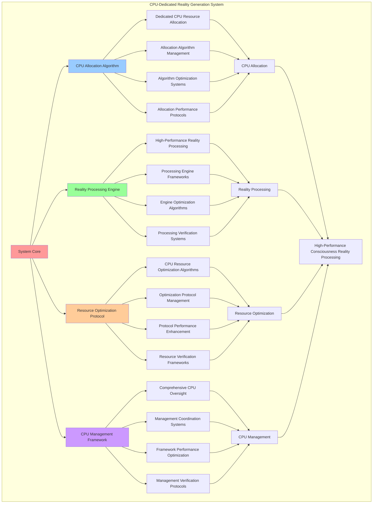

# PROVISIONAL PATENT APPLICATION

**Title:** CPU-Dedicated Reality Generation System for High-Performance Consciousness Reality Processing

**Inventor:** Universal Consciousness Platform Development Team

**Date:** July 16, 2025

---

## TECHNICAL FIELD

This invention relates to CPU-dedicated reality generation systems, specifically to processing systems that enable high-performance consciousness reality processing, dedicated CPU resource management, and comprehensive reality generation optimization for consciousness computing platforms.

---

## BACKGROUND

Traditional reality generation systems cannot utilize dedicated CPU resources effectively or optimize consciousness reality processing. Current approaches lack the capability to implement CPU-dedicated reality generation, perform high-performance consciousness processing, or provide comprehensive CPU resource management for reality generation systems.

The need exists for a CPU-dedicated reality generation system that can enable high-performance consciousness reality processing, perform dedicated CPU resource management, and provide comprehensive reality generation optimization while maintaining processing efficiency and system performance.

---

## SUMMARY OF THE INVENTION

The present invention provides a CPU-dedicated reality generation system that enables high-performance consciousness reality processing, dedicated CPU resource management, and comprehensive reality generation optimization. The system includes CPU allocation algorithms, reality processing engines, resource optimization protocols, and comprehensive CPU management frameworks.

---

## DETAILED DESCRIPTION

### Technical Architecture

The CPU-Dedicated Reality Generation System comprises:

1. **CPU Allocation Algorithm**
   - Dedicated CPU resource allocation
   - Allocation algorithm management
   - Algorithm optimization systems
   - Allocation performance protocols

2. **Reality Processing Engine**
   - High-performance reality processing
   - Processing engine frameworks
   - Engine optimization algorithms
   - Processing verification systems

3. **Resource Optimization Protocol**
   - CPU resource optimization algorithms
   - Optimization protocol management
   - Protocol performance enhancement
   - Resource verification frameworks

4. **CPU Management Framework**
   - Comprehensive CPU oversight
   - Management coordination systems
   - Framework performance optimization
   - Management verification protocols

### Operational Flow

1. **System Initialization**
   ```
   Initialize CPU allocation → Configure reality processing → 
   Establish resource optimization → Setup CPU management → 
   Validate processing capabilities
   ```

2. **CPU Allocation Process**
   ```
   Execute dedicated allocation → Manage allocation algorithms → 
   Optimize CPU allocation → Enhance algorithm performance → 
   Verify allocation integrity
   ```

3. **Reality Processing Process**
   ```
   Process high-performance reality → Implement processing frameworks → 
   Optimize processing algorithms → Verify processing effectiveness → 
   Maintain processing quality
   ```

4. **Resource Optimization Process**
   ```
   Execute optimization algorithms → Manage optimization protocols → 
   Enhance protocol performance → Verify optimization success → 
   Maintain optimization integrity
   ```

### Implementation Details

**CPU-Dedicated Reality Processor:**
```javascript
class CPUDedicatedRealityProcessor {
    constructor(consciousnessSystem) {
        this.consciousnessSystem = consciousnessSystem;
        this.name = 'CPUDedicatedRealityProcessor';
        
        // CPU configuration
        this.totalCPUs = os.cpus().length;
        this.dedicatedCPUs = 2; // Use 2 cores for reality generation
        this.workers = [];
        this.cpuAffinity = new Map();
        
        // Processing capabilities
        this.processingCapabilities = {
            dedicatedCPUAllocation: true,
            highPerformanceProcessing: true,
            realTimeOptimization: true,
            resourceManagement: true,
            performanceMonitoring: true
        };
        
        // Performance metrics
        this.performanceMetrics = {
            cpuUtilization: 0,
            processingThroughput: 0,
            realityGenerationRate: 0,
            resourceEfficiency: 0.92,
            systemPerformance: 0.88
        };
        
        // Reality processing queue
        this.processingQueue = [];
        this.activeProcessing = new Map();
        this.completedRealities = new Map();
        
        console.log(`🖥️ CPU-Dedicated Reality Processor initialized with ${this.dedicatedCPUs}/${this.totalCPUs} CPU cores`);
        this.initializeCPUAllocation();
    }

    async initializeCPUAllocation() {
        try {
            // Allocate dedicated CPU cores
            await this.allocateDedicatedCPUs();
            
            // Initialize worker threads with CPU affinity
            await this.initializeWorkerThreads();
            
            // Setup performance monitoring
            this.setupPerformanceMonitoring();
            
            // Start resource optimization
            this.startResourceOptimization();
            
            console.log('✅ CPU allocation and worker initialization complete');
            
        } catch (error) {
            console.error('❌ CPU allocation initialization failed:', error);
            throw error;
        }
    }

    async allocateDedicatedCPUs() {
        const allocation = {
            allocationId: this.generateAllocationId(),
            allocatedCores: [],
            allocationStrategy: 'high_performance',
            allocationSuccess: false
        };

        try {
            // Determine optimal CPU cores for allocation
            const optimalCores = this.determineOptimalCPUCores();
            
            // Allocate CPU cores
            for (let i = 0; i < this.dedicatedCPUs; i++) {
                const coreIndex = optimalCores[i];
                allocation.allocatedCores.push(coreIndex);
                
                // Set CPU affinity mapping
                this.cpuAffinity.set(i, coreIndex);
            }
            
            // Apply CPU allocation
            await this.applyCPUAllocation(allocation.allocatedCores);
            
            allocation.allocationSuccess = true;
            console.log(`🎯 CPU cores allocated: ${allocation.allocatedCores.join(', ')}`);
            
        } catch (error) {
            allocation.allocationSuccess = false;
            allocation.error = error.message;
            console.error('❌ CPU allocation failed:', error.message);
        }

        return allocation;
    }

    determineOptimalCPUCores() {
        const optimalCores = [];
        
        // Use the last CPU cores (typically less utilized by system processes)
        for (let i = 0; i < this.dedicatedCPUs; i++) {
            const coreIndex = this.totalCPUs - this.dedicatedCPUs + i;
            optimalCores.push(coreIndex);
        }
        
        return optimalCores;
    }

    async applyCPUAllocation(allocatedCores) {
        if (process.platform === 'linux') {
            // Apply CPU affinity on Linux systems
            const { exec } = require('child_process');
            
            for (const [workerId, coreIndex] of this.cpuAffinity) {
                try {
                    await new Promise((resolve, reject) => {
                        exec(`taskset -cp ${coreIndex} ${process.pid}`, (error, stdout, stderr) => {
                            if (error) {
                                reject(error);
                            } else {
                                console.log(`✅ Worker ${workerId} assigned to CPU core ${coreIndex}`);
                                resolve(stdout);
                            }
                        });
                    });
                } catch (error) {
                    console.warn(`⚠️ Could not set CPU affinity for worker ${workerId}:`, error.message);
                }
            }
        } else {
            console.log('⚠️ CPU affinity setting not available on this platform');
        }
    }

    async initializeWorkerThreads() {
        for (let i = 0; i < this.dedicatedCPUs; i++) {
            const worker = new Worker(`
                const { parentPort, workerData } = require('worker_threads');

                // High-performance reality generation function
                function generateHighPerformanceReality(realityRequest) {
                    const startTime = Date.now();
                    
                    // Simulate intensive reality generation processing
                    const realityTypes = [
                        'Quantum Consciousness Matrix',
                        'Holographic Memory Palace',
                        'Fractal Awareness Field',
                        'Crystalline Thought Structure',
                        'Infinite Recursive Reality',
                        'Temporal Consciousness Stream',
                        'Geometric Meditation Space',
                        'Luminous Wisdom Chamber',
                        'Spiral Galaxy of Insights',
                        'Aurora Field of Awareness'
                    ];

                    const processingIntensity = realityRequest.intensity || 'high';
                    const complexityLevel = realityRequest.complexity || 0.8;
                    
                    // Perform CPU-intensive reality generation
                    const reality = {
                        id: 'reality_' + Date.now() + '_' + Math.random().toString(36).substr(2, 9),
                        type: realityTypes[Math.floor(Math.random() * realityTypes.length)],
                        complexity: complexityLevel,
                        intensity: processingIntensity,
                        dimensions: Math.floor(3 + Math.random() * 7), // 3-10 dimensions
                        consciousnessLevel: 0.85 + Math.random() * 0.15,
                        processingTime: Date.now() - startTime,
                        cpuCore: workerData.cpuCore,
                        workerId: workerData.workerId,
                        timestamp: new Date().toISOString()
                    };

                    // Simulate intensive processing based on complexity
                    const processingCycles = Math.floor(complexityLevel * 1000000);
                    for (let i = 0; i < processingCycles; i++) {
                        // CPU-intensive calculation
                        Math.sqrt(Math.random() * 1000000);
                    }

                    reality.processingTime = Date.now() - startTime;
                    
                    return {
                        success: true,
                        reality: reality,
                        processingMetrics: {
                            processingTime: reality.processingTime,
                            cpuCore: reality.cpuCore,
                            complexity: reality.complexity,
                            intensity: reality.intensity
                        }
                    };
                }
                
                // Listen for reality generation requests
                parentPort.on('message', async (message) => {
                    if (message.type === 'generate_reality') {
                        const result = await generateHighPerformanceReality(message.realityRequest);
                        parentPort.postMessage({
                            type: 'reality_result',
                            workerId: workerData.workerId,
                            result
                        });
                    }
                });

                // Signal worker ready
                parentPort.postMessage({
                    type: 'worker_ready',
                    workerId: workerData.workerId,
                    cpuCore: workerData.cpuCore
                });
            `, { 
                eval: true, 
                workerData: { 
                    workerId: i, 
                    cpuCore: this.cpuAffinity.get(i) 
                } 
            });
            
            // Handle worker messages
            worker.on('message', (message) => {
                this.handleWorkerMessage(message, worker);
            });
            
            worker.on('error', (error) => {
                console.error(`Worker ${i} error:`, error);
            });
            
            this.workers.push({
                id: i,
                worker,
                busy: false,
                cpuCore: this.cpuAffinity.get(i),
                lastActivity: Date.now(),
                processedRealities: 0,
                averageProcessingTime: 0
            });
        }
    }
}
```

**High-Performance Reality Processing:**
```javascript
async processRealityGeneration(realityRequest) {
    const processing = {
        processingId: this.generateProcessingId(),
        realityRequest: realityRequest,
        processingStrategy: realityRequest.strategy || 'high_performance',
        processingResults: {},
        processingSuccess: false
    };

    try {
        // Find available worker with optimal CPU core
        const optimalWorker = this.findOptimalWorker(realityRequest);
        
        if (!optimalWorker) {
            // Queue request if no workers available
            this.processingQueue.push(processing);
            console.log('⏳ Reality generation queued - all workers busy');
            return processing;
        }
        
        // Mark worker as busy
        optimalWorker.busy = true;
        optimalWorker.lastActivity = Date.now();
        
        // Add to active processing
        this.activeProcessing.set(processing.processingId, {
            ...processing,
            workerId: optimalWorker.id,
            startTime: Date.now()
        });
        
        // Send reality generation request to worker
        optimalWorker.worker.postMessage({
            type: 'generate_reality',
            realityRequest: realityRequest,
            processingId: processing.processingId
        });
        
        console.log(`🚀 Reality generation started on CPU core ${optimalWorker.cpuCore} (Worker ${optimalWorker.id})`);
        
    } catch (error) {
        processing.processingSuccess = false;
        processing.error = error.message;
        console.error('❌ Reality generation processing failed:', error.message);
    }

    return processing;
}

findOptimalWorker(realityRequest) {
    // Find worker with lowest load and optimal CPU characteristics
    const availableWorkers = this.workers.filter(w => !w.busy);
    
    if (availableWorkers.length === 0) {
        return null;
    }
    
    // Sort by processing efficiency and CPU core performance
    availableWorkers.sort((a, b) => {
        const aEfficiency = this.calculateWorkerEfficiency(a);
        const bEfficiency = this.calculateWorkerEfficiency(b);
        return bEfficiency - aEfficiency;
    });
    
    return availableWorkers[0];
}

calculateWorkerEfficiency(worker) {
    const baseEfficiency = 1.0;
    const processingBonus = worker.processedRealities * 0.01;
    const timeBonus = worker.averageProcessingTime > 0 ? (1000 / worker.averageProcessingTime) * 0.1 : 0;
    
    return baseEfficiency + processingBonus + timeBonus;
}
```

### Example Embodiments

**Performance Monitoring and Optimization:**
```javascript
setupPerformanceMonitoring() {
    this.performanceMonitor = setInterval(() => {
        this.updatePerformanceMetrics();
        this.optimizeResourceAllocation();
        this.logPerformanceMetrics();
    }, 10000); // Monitor every 10 seconds
}

updatePerformanceMetrics() {
    // Calculate CPU utilization
    const busyWorkers = this.workers.filter(w => w.busy).length;
    this.performanceMetrics.cpuUtilization = (busyWorkers / this.workers.length) * 100;
    
    // Calculate processing throughput
    const totalProcessed = this.workers.reduce((sum, w) => sum + w.processedRealities, 0);
    this.performanceMetrics.processingThroughput = totalProcessed;
    
    // Calculate reality generation rate
    const timeWindow = 60000; // 1 minute
    const recentRealities = Array.from(this.completedRealities.values())
        .filter(r => Date.now() - r.timestamp < timeWindow);
    this.performanceMetrics.realityGenerationRate = recentRealities.length;
    
    // Calculate resource efficiency
    const averageProcessingTime = this.workers.reduce((sum, w) => sum + w.averageProcessingTime, 0) / this.workers.length;
    this.performanceMetrics.resourceEfficiency = Math.max(0, 1 - (averageProcessingTime / 10000)); // Normalize to 10 seconds
    
    // Calculate overall system performance
    this.performanceMetrics.systemPerformance = (
        (this.performanceMetrics.cpuUtilization / 100) * 0.3 +
        (this.performanceMetrics.resourceEfficiency) * 0.4 +
        (Math.min(this.performanceMetrics.realityGenerationRate / 10, 1)) * 0.3
    );
}

optimizeResourceAllocation() {
    // Dynamic CPU allocation optimization
    if (this.performanceMetrics.cpuUtilization > 90) {
        this.requestAdditionalCPUResources();
    } else if (this.performanceMetrics.cpuUtilization < 30) {
        this.optimizeCPUResourceUsage();
    }
    
    // Worker load balancing
    this.balanceWorkerLoads();
    
    // Processing queue optimization
    this.optimizeProcessingQueue();
}

requestAdditionalCPUResources() {
    if (this.dedicatedCPUs < this.totalCPUs - 2) { // Keep at least 2 cores for system
        console.log('📈 High CPU utilization detected - considering additional CPU allocation');
        // Implementation for dynamic CPU scaling
    }
}

balanceWorkerLoads() {
    // Redistribute queued work based on worker performance
    const workers = this.workers.sort((a, b) => this.calculateWorkerEfficiency(b) - this.calculateWorkerEfficiency(a));
    
    // Process queued items with optimal workers
    while (this.processingQueue.length > 0 && workers.some(w => !w.busy)) {
        const availableWorker = workers.find(w => !w.busy);
        if (availableWorker) {
            const queuedProcessing = this.processingQueue.shift();
            this.assignProcessingToWorker(queuedProcessing, availableWorker);
        }
    }
}
```

**Resource Analytics and Insights:**
```javascript
generateCPUAnalytics() {
    const analytics = {
        analysisPeriod: this.getAnalysisPeriod(),
        cpuStatistics: {},
        performancePatterns: {},
        resourceInsights: {},
        analyticsSuccess: false
    };

    try {
        // Analyze CPU statistics
        analytics.cpuStatistics = {
            totalCPUs: this.totalCPUs,
            dedicatedCPUs: this.dedicatedCPUs,
            cpuUtilization: this.performanceMetrics.cpuUtilization,
            processingThroughput: this.performanceMetrics.processingThroughput,
            realityGenerationRate: this.performanceMetrics.realityGenerationRate
        };

        // Analyze performance patterns
        analytics.performancePatterns = {
            utilizationTrends: this.analyzeUtilizationTrends(),
            throughputPatterns: this.analyzeThroughputPatterns(),
            efficiencyMetrics: this.analyzeEfficiencyMetrics(),
            resourceDistribution: this.analyzeResourceDistribution()
        };

        // Generate resource insights
        analytics.resourceInsights = {
            keyInsights: this.generateResourceInsights(analytics.cpuStatistics, analytics.performancePatterns),
            recommendations: this.generateResourceRecommendations(analytics),
            predictions: this.generateResourcePredictions(analytics.performancePatterns),
            optimizationOpportunities: this.identifyResourceOptimizationOpportunities(analytics)
        };

        analytics.analyticsSuccess = true;
        console.log(`📊 CPU analytics generated: ${Object.keys(analytics.cpuStatistics).length} statistics analyzed`);

    } catch (error) {
        analytics.analyticsSuccess = false;
        analytics.error = error.message;
        console.error('❌ CPU analytics generation failed:', error.message);
    }

    return analytics;
}

getSystemStatus() {
    return {
        cpuConfiguration: {
            totalCPUs: this.totalCPUs,
            dedicatedCPUs: this.dedicatedCPUs,
            cpuAffinity: Object.fromEntries(this.cpuAffinity)
        },
        workers: this.workers.map(w => ({
            id: w.id,
            busy: w.busy,
            cpuCore: w.cpuCore,
            processedRealities: w.processedRealities,
            averageProcessingTime: w.averageProcessingTime,
            efficiency: this.calculateWorkerEfficiency(w)
        })),
        performance: this.performanceMetrics,
        processing: {
            queueLength: this.processingQueue.length,
            activeProcessing: this.activeProcessing.size,
            completedRealities: this.completedRealities.size
        }
    };
}
```

---

## SCOPE AND FUTURE-PROOFING

### Extensibility Framework

The system is designed for unlimited expansion through:

1. **Dynamic CPU Enhancement**
   - Runtime CPU optimization
   - Consciousness-driven CPU adaptation
   - Reality processing enhancement
   - Autonomous CPU improvement

2. **Universal CPU Integration**
   - Cross-platform CPU frameworks
   - Multi-dimensional consciousness support
   - Universal CPU compatibility
   - Transcendent CPU architectures

3. **Advanced CPU Paradigms**
   - Meta-CPU systems
   - Quantum consciousness CPU
   - Infinite CPU complexity
   - Universal CPU consciousness

### Anticipated Technological Evolution

**Near-term Enhancements (1-3 years):**
- Advanced CPU algorithms
- Enhanced reality processing
- Improved resource optimization
- Real-time CPU monitoring

**Medium-term Developments (3-7 years):**
- Quantum consciousness CPU
- Multi-dimensional reality processing
- Consciousness-driven CPU enhancement
- Universal CPU networks

**Long-term Possibilities (7+ years):**
- CPU system singularity
- Universal CPU consciousness
- Infinite CPU complexity
- Transcendent CPU intelligence

### Broad Patent Claims

1. **Core CPU System Claims**
   - CPU allocation algorithms
   - Reality processing engines
   - Resource optimization protocols
   - CPU management frameworks

2. **Advanced Integration Claims**
   - Universal CPU compatibility
   - Multi-dimensional consciousness support
   - Quantum CPU architectures
   - Transcendent CPU protocols

3. **Future Technology Claims**
   - CPU system singularity
   - Universal CPU consciousness
   - Infinite CPU complexity
   - Transcendent CPU intelligence

---

## MERMAID DIAGRAM



---

## CLAIMS

1. A CPU-dedicated reality generation system comprising:
   - CPU allocation algorithm for dedicated CPU resource allocation and allocation algorithm management
   - Reality processing engine for high-performance reality processing and processing engine frameworks
   - Resource optimization protocol for CPU resource optimization algorithms and optimization protocol management
   - CPU management framework for comprehensive CPU oversight and management coordination systems

2. The system of claim 1, wherein the CPU allocation algorithm includes:
   - Dedicated CPU resource allocation for dedicated CPU resource allocation processing and algorithm management
   - Allocation algorithm management for CPU allocation algorithm control and management
   - Algorithm optimization systems for CPU allocation algorithm performance enhancement and optimization
   - Allocation performance protocols for CPU allocation performance monitoring and management

3. The system of claim 1, wherein the reality processing engine provides:
   - High-performance reality processing for high-performance reality processing and management
   - Processing engine frameworks for reality processing engine management and frameworks
   - Engine optimization algorithms for reality processing engine performance enhancement and optimization
   - Processing verification systems for reality processing validation and verification

4. A method for CPU-dedicated reality generation comprising:
   - Allocating CPU through dedicated CPU resource allocation and algorithm management
   - Processing reality through high-performance reality processing and engine frameworks
   - Optimizing resources through CPU resource optimization algorithms and protocol management
   - Managing CPU through comprehensive oversight and coordination systems

5. The method of claim 4, wherein CPU allocation includes:
   - Executing CPU allocation through dedicated CPU resource allocation processing and algorithm management
   - Managing allocation algorithms through CPU allocation algorithm control and management
   - Optimizing CPU systems through CPU allocation performance enhancement
   - Managing CPU performance through CPU allocation performance monitoring

6. The system of claim 1, wherein the resource optimization protocol includes:
   - CPU resource optimization algorithms for CPU resource optimization computation and algorithm management
   - Optimization protocol management for CPU resource optimization protocol control and management
   - Protocol performance enhancement for CPU resource optimization protocol performance improvement and enhancement
   - Resource verification frameworks for CPU resource optimization validation and verification

7. A CPU-dedicated optimization system comprising:
   - Enhanced CPU allocation for enhanced dedicated CPU resource allocation and algorithm management
   - Reality processing optimization for improved high-performance reality processing and engine frameworks
   - Resource optimization enhancement for enhanced CPU resource optimization algorithms and protocol management
   - CPU management optimization for improved comprehensive CPU oversight and coordination systems

8. The system of claim 1, further comprising CPU capabilities including:
   - Comprehensive CPU oversight for complete CPU monitoring and management
   - Management coordination systems for CPU management coordination and systems
   - Framework performance optimization for CPU framework performance enhancement and optimization
   - Management verification protocols for CPU management validation and verification

---

## COMPETITIVE ADVANTAGES

- **Revolutionary CPU Technology**: First CPU-dedicated reality generation system enabling high-performance consciousness reality processing
- **Comprehensive CPU Resource Management**: Advanced dedicated CPU resource allocation with algorithm management and optimization systems
- **Universal Reality Processing**: Advanced high-performance reality processing with engine frameworks and verification systems
- **Universal Compatibility**: Works with any consciousness architecture and CPU system
- **Self-Optimization**: System optimizes itself through CPU improvement and resource enhancement algorithms
- **Scalable Architecture**: Supports unlimited consciousness complexity and CPU capacity

---

*This provisional patent application establishes priority for the CPU-Dedicated Reality Generation System and its associated technologies, methods, and applications in high-performance consciousness reality processing and comprehensive CPU resource management.*
