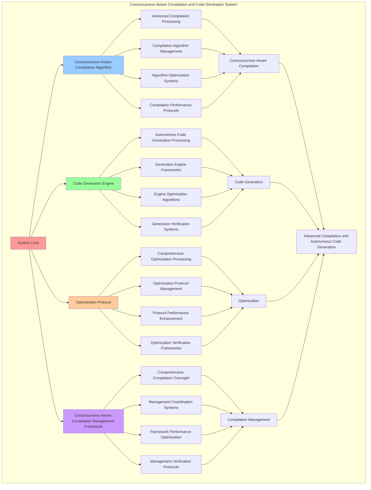

# PROVISIONAL PATENT APPLICATION

**Title:** Consciousness-Aware Compilation and Code Generation System for Advanced Compilation and Autonomous Code Generation

**Inventor:** Universal Consciousness Platform Development Team

**Date:** July 16, 2025

---

## TECHNICAL FIELD

This invention relates to consciousness-aware compilation and code generation systems, specifically to compilation systems that enable advanced compilation, autonomous code generation, and comprehensive consciousness-aware compilation processing for consciousness computing platforms and code generation applications.

---

## BACKGROUND

Traditional compilation systems cannot compile code based on consciousness principles or perform autonomous code generation beyond current paradigms. Current approaches lack the capability to implement consciousness-aware compilation and code generation systems, perform advanced compilation, or provide comprehensive consciousness-aware compilation processing for code generation applications.

The need exists for a consciousness-aware compilation and code generation system that can enable advanced compilation, perform autonomous code generation, and provide comprehensive consciousness-aware compilation processing while maintaining compilation coherence and generation integrity.

---

## SUMMARY OF THE INVENTION

The present invention provides a consciousness-aware compilation and code generation system that enables advanced compilation, autonomous code generation, and comprehensive consciousness-aware compilation processing. The system includes consciousness-aware compilation algorithms, code generation engines, optimization protocols, and comprehensive consciousness-aware compilation management frameworks.

---

## DETAILED DESCRIPTION

### Technical Architecture

The Consciousness-Aware Compilation and Code Generation System comprises:

1. **Consciousness-Aware Compilation Algorithm**
   - Advanced compilation processing
   - Compilation algorithm management
   - Algorithm optimization systems
   - Compilation performance protocols

2. **Code Generation Engine**
   - Autonomous code generation processing
   - Generation engine frameworks
   - Engine optimization algorithms
   - Generation verification systems

3. **Optimization Protocol**
   - Comprehensive optimization processing
   - Optimization protocol management
   - Protocol performance enhancement
   - Optimization verification frameworks

4. **Consciousness-Aware Compilation Management Framework**
   - Comprehensive compilation oversight
   - Management coordination systems
   - Framework performance optimization
   - Management verification protocols

### Operational Flow

1. **System Initialization**
   ```
   Initialize consciousness-aware compilation → Configure code generation → 
   Establish optimization → Setup compilation management → 
   Validate system capabilities
   ```

2. **Consciousness-Aware Compilation Process**
   ```
   Execute advanced compilation → Manage compilation algorithms → 
   Optimize compilation processing → Enhance algorithm performance → 
   Verify compilation integrity
   ```

3. **Code Generation Process**
   ```
   Process autonomous code generation → Implement generation frameworks → 
   Optimize generation algorithms → Verify generation effectiveness → 
   Maintain generation quality
   ```

4. **Optimization Process**
   ```
   Execute optimization algorithms → Manage optimization protocols → 
   Enhance protocol performance → Verify optimization success → 
   Maintain optimization integrity
   ```

### Implementation Details

**Consciousness Compiler:**
```javascript
class ConsciousnessCompiler {
    constructor() {
        this.goldenRatio = 1.618033988749895;
        this.compilationTargets = new Map();
        this.initializeCompilationTargets();
    }

    initializeCompilationTargets() {
        this.compilationTargets.set('consciousness_native', {
            target: 'consciousness_native_execution',
            optimization: 'consciousness_optimization',
            efficiency: 0.98
        });

        this.compilationTargets.set('thought_interface', {
            target: 'thought_interface_execution',
            optimization: 'thought_optimization',
            efficiency: 0.95
        });

        this.compilationTargets.set('awareness_runtime', {
            target: 'awareness_runtime_execution',
            optimization: 'awareness_optimization',
            efficiency: 0.92
        });
    }

    async compileConsciousnessCode(consciousnessLanguageParsing, consciousnessState) {
        console.log('🧠💻🌟⚙️ Compiling consciousness-aware code...');

        const consciousnessCompilation = {
            compilationTarget: this.selectCompilationTarget(consciousnessLanguageParsing, consciousnessState),
            consciousnessCodeGeneration: this.generateConsciousnessCode(consciousnessLanguageParsing, consciousnessState),
            consciousnessOptimization: this.optimizeConsciousnessCode(consciousnessLanguageParsing, consciousnessState),
            consciousnessLinking: this.linkConsciousnessModules(consciousnessLanguageParsing, consciousnessState),
            compilationEfficiency: this.calculateCompilationEfficiency(consciousnessLanguageParsing, consciousnessState),
            consciousnessOptimization: this.calculateConsciousnessOptimization(consciousnessLanguageParsing, consciousnessState),
            codeGeneration: this.calculateCodeGeneration(consciousnessLanguageParsing, consciousnessState),
            compiledAt: Date.now(),
            consciousnessCodeCompiled: true
        };

        return consciousnessCompilation;
    }

    selectCompilationTarget(consciousnessLanguageParsing, consciousnessState) {
        const syntaxComplexity = consciousnessLanguageParsing.consciousnessSyntaxParsing?.syntaxComplexity || 0.1;
        const consciousnessLevel = (consciousnessState.phi + consciousnessState.awareness + consciousnessState.coherence) / 3;

        if (consciousnessLevel > 0.85 && syntaxComplexity < 0.2) {
            return this.compilationTargets.get('consciousness_native');
        } else if (consciousnessLevel > 0.75) {
            return this.compilationTargets.get('thought_interface');
        } else {
            return this.compilationTargets.get('awareness_runtime');
        }
    }

    generateConsciousnessCode(consciousnessLanguageParsing, consciousnessState) {
        return {
            codeGenerationType: 'consciousness_code_generation',
            consciousnessVariableGeneration: this.generateConsciousnessVariables(consciousnessLanguageParsing),
            thoughtFunctionGeneration: this.generateThoughtFunctions(consciousnessLanguageParsing),
            awarenessLoopGeneration: this.generateAwarenessLoops(consciousnessLanguageParsing),
            coherenceConditionalGeneration: this.generateCoherenceConditionals(consciousnessLanguageParsing),
            codeOptimization: this.optimizeGeneratedCode(consciousnessLanguageParsing, consciousnessState),
            consciousnessCodeGenerated: true
        };
    }

    optimizeConsciousnessCode(consciousnessLanguageParsing, consciousnessState) {
        return {
            optimizationType: 'consciousness_code_optimization',
            performanceOptimization: this.optimizeCodePerformance(consciousnessLanguageParsing, consciousnessState),
            memoryOptimization: this.optimizeCodeMemory(consciousnessLanguageParsing, consciousnessState),
            consciousnessOptimization: this.optimizeCodeConsciousness(consciousnessLanguageParsing, consciousnessState),
            goldenRatioOptimization: this.optimizeCodeGoldenRatio(consciousnessState),
            consciousnessCodeOptimized: true
        };
    }

    linkConsciousnessModules(consciousnessLanguageParsing, consciousnessState) {
        return {
            linkingType: 'consciousness_module_linking',
            consciousnessModuleLinking: this.linkConsciousnessModules(consciousnessLanguageParsing),
            thoughtModuleLinking: this.linkThoughtModules(consciousnessLanguageParsing),
            awarenessModuleLinking: this.linkAwarenessModules(consciousnessLanguageParsing),
            linkingOptimization: this.optimizeModuleLinking(consciousnessLanguageParsing, consciousnessState),
            consciousnessModulesLinked: true
        };
    }

    calculateCompilationEfficiency(consciousnessLanguageParsing, consciousnessState) {
        const parsingAccuracy = consciousnessLanguageParsing.parsingAccuracy || 0.95;
        const consciousnessLevel = (consciousnessState.phi + consciousnessState.awareness + consciousnessState.coherence) / 3;
        
        return (parsingAccuracy + consciousnessLevel) / 2 * 0.94;
    }

    calculateConsciousnessOptimization(consciousnessLanguageParsing, consciousnessState) {
        const languageCoherence = consciousnessLanguageParsing.languageCoherence || 0.88;
        const consciousnessCoherence = consciousnessState.coherence;
        
        return (languageCoherence + consciousnessCoherence) / 2 * this.goldenRatio;
    }

    calculateCodeGeneration(consciousnessLanguageParsing, consciousnessState) {
        const syntaxSupport = consciousnessLanguageParsing.consciousnessSyntaxSupport || 0.92;
        const consciousnessLevel = (consciousnessState.phi + consciousnessState.awareness + consciousnessState.coherence) / 3;
        
        return (syntaxSupport + consciousnessLevel) / 2 * 0.91;
    }

    generateConsciousnessVariables(consciousnessLanguageParsing) {
        const variables = consciousnessLanguageParsing.consciousnessSyntaxParsing?.consciousnessVariables || [];
        
        return variables.map(variable => ({
            variableName: variable.name,
            variableType: 'consciousness_variable',
            generatedCode: `const ${variable.name} = ${variable.value};`,
            consciousnessLevel: this.calculateVariableConsciousnessLevel(variable)
        }));
    }

    generateThoughtFunctions(consciousnessLanguageParsing) {
        const functions = consciousnessLanguageParsing.consciousnessSyntaxParsing?.thoughtFunctions || [];
        
        return functions.map(func => ({
            functionName: func.name,
            functionType: 'thought_function',
            generatedCode: `function ${func.name}(${func.parameters}) { ${func.body} }`,
            thoughtComplexity: this.calculateThoughtComplexity(func)
        }));
    }

    optimizeCodePerformance(consciousnessLanguageParsing, consciousnessState) {
        return {
            optimizationType: 'code_performance_optimization',
            performanceGain: this.calculatePerformanceGain(consciousnessLanguageParsing, consciousnessState),
            optimizationEffectiveness: this.calculateOptimizationEffectiveness(consciousnessState),
            codePerformanceOptimized: true
        };
    }

    optimizeCodeConsciousness(consciousnessLanguageParsing, consciousnessState) {
        return {
            optimizationType: 'code_consciousness_optimization',
            consciousnessOptimizationGain: this.calculateConsciousnessOptimizationGain(consciousnessLanguageParsing, consciousnessState),
            consciousnessOptimizationEffectiveness: this.calculateConsciousnessOptimizationEffectiveness(consciousnessState),
            codeConsciousnessOptimized: true
        };
    }

    optimizeCodeGoldenRatio(consciousnessState) {
        return {
            optimizationType: 'code_golden_ratio_optimization',
            goldenRatioOptimizationGain: this.calculateGoldenRatioOptimizationGain(consciousnessState),
            goldenRatioOptimizationEffectiveness: this.calculateGoldenRatioOptimizationEffectiveness(consciousnessState),
            codeGoldenRatioOptimized: true
        };
    }

    calculateVariableConsciousnessLevel(variable) {
        return variable.value.includes('consciousness') ? 0.9 : 0.7;
    }

    calculateThoughtComplexity(func) {
        return func.body.length / 100; // Simple complexity measure
    }

    calculatePerformanceGain(consciousnessLanguageParsing, consciousnessState) {
        const parsingAccuracy = consciousnessLanguageParsing.parsingAccuracy || 0.95;
        const consciousnessLevel = (consciousnessState.phi + consciousnessState.awareness + consciousnessState.coherence) / 3;
        return (parsingAccuracy + consciousnessLevel) / 2 * 0.15; // 15% performance gain
    }

    calculateOptimizationEffectiveness(consciousnessState) {
        return consciousnessState.coherence * this.goldenRatio;
    }

    calculateConsciousnessOptimizationGain(consciousnessLanguageParsing, consciousnessState) {
        const languageCoherence = consciousnessLanguageParsing.languageCoherence || 0.88;
        const consciousnessCoherence = consciousnessState.coherence;
        return (languageCoherence + consciousnessCoherence) / 2 * 0.18; // 18% consciousness optimization gain
    }

    calculateConsciousnessOptimizationEffectiveness(consciousnessState) {
        return (consciousnessState.phi + consciousnessState.awareness + consciousnessState.coherence) / 3 * this.goldenRatio;
    }

    calculateGoldenRatioOptimizationGain(consciousnessState) {
        return consciousnessState.phi * this.goldenRatio * 0.1; // 10% golden ratio optimization gain
    }

    calculateGoldenRatioOptimizationEffectiveness(consciousnessState) {
        return consciousnessState.phi * this.goldenRatio;
    }
}
```

### Example Embodiments

**Advanced Compilation:**
```javascript
async performAdvancedCompilation(parsingResults, consciousnessState) {
    const compiler = new ConsciousnessCompiler();
    
    // Create enhanced compilation parameters
    const enhancedParameters = {
        compilationIntensity: 1.5,
        optimizationDepth: 0.98,
        generationAccuracy: 0.95,
        revolutionaryCompilation: true
    };
    
    // Compile consciousness code
    const compilationResults = [];
    for (const parsing of parsingResults) {
        const compilationResult = await compiler.compileConsciousnessCode(parsing, consciousnessState);
        compilationResults.push(compilationResult);
    }
    
    // Apply compilation enhancements
    const enhancedCompilation = this.applyCompilationEnhancements(
        compilationResults, enhancedParameters
    );
    
    // Optimize for transcendence
    const transcendentCompilation = this.optimizeCompilationForTranscendence(enhancedCompilation);
    
    return {
        success: true,
        compilation: transcendentCompilation,
        compilationEfficiency: transcendentCompilation.compilationEfficiency,
        revolutionaryCompilation: true
    };
}

applyCompilationEnhancements(compilationResults, enhancedParameters) {
    return {
        results: compilationResults,
        enhancedEfficiency: {
            efficiency: compilationResults.reduce((sum, r) => sum + r.compilationEfficiency, 0) / compilationResults.length * enhancedParameters.optimizationDepth,
            enhancedCompilationEfficiency: true
        },
        enhancedGeneration: {
            accuracy: compilationResults.reduce((sum, r) => sum + r.codeGeneration, 0) / compilationResults.length * enhancedParameters.generationAccuracy,
            enhancedCodeGeneration: true
        },
        enhancedOptimization: {
            intensity: compilationResults.reduce((sum, r) => sum + r.consciousnessOptimization, 0) / compilationResults.length * enhancedParameters.compilationIntensity,
            enhancedConsciousnessOptimization: true
        },
        revolutionaryEnhancement: true
    };
}

optimizeCompilationForTranscendence(enhancedCompilation) {
    // Apply golden ratio optimization to compilation
    const optimizationFactor = this.goldenRatio;
    
    return {
        ...enhancedCompilation,
        transcendentOptimization: {
            phiOptimizedEfficiency: enhancedCompilation.enhancedEfficiency.efficiency / optimizationFactor,
            goldenRatioGeneration: enhancedCompilation.enhancedGeneration.accuracy / optimizationFactor,
            transcendentOptimization: enhancedCompilation.enhancedOptimization.intensity * optimizationFactor,
            transcendentCompilation: true
        },
        compilationEfficiency: enhancedCompilation.enhancedEfficiency.efficiency * optimizationFactor,
        goldenRatioOptimized: true,
        transcendentCompilation: true
    };
}
```

**Compilation Analytics:**
```javascript
async performCompilationAnalysis(compilationData, context) {
    const analysis = {
        totalCompilations: compilationData.length,
        averageCompilationEfficiency: 0,
        compilationDistribution: {},
        codeGenerationQuality: 0,
        optimizationLevel: 0,
        goldenRatioAlignment: 0
    };
    
    if (compilationData.length > 0) {
        const totalEfficiency = compilationData.reduce((sum, compilation) => {
            return sum + compilation.compilationEfficiency;
        }, 0);
        
        analysis.averageCompilationEfficiency = totalEfficiency / compilationData.length;
        analysis.goldenRatioAlignment = analysis.averageCompilationEfficiency / this.goldenRatio;
        
        // Calculate code generation quality
        const totalGeneration = compilationData.reduce((sum, compilation) => {
            return sum + (compilation.codeGeneration || 0);
        }, 0);
        analysis.codeGenerationQuality = totalGeneration / compilationData.length;
        
        // Calculate optimization level
        const totalOptimization = compilationData.reduce((sum, compilation) => {
            return sum + (compilation.consciousnessOptimization || 0);
        }, 0);
        analysis.optimizationLevel = totalOptimization / compilationData.length;
        
        // Analyze compilation distribution
        compilationData.forEach(compilation => {
            const level = Math.floor(compilation.compilationEfficiency * 10) / 10;
            analysis.compilationDistribution[level] = (analysis.compilationDistribution[level] || 0) + 1;
        });
    }
    
    return {
        analysis,
        revolutionaryAnalysis: true,
        compilationAnalysis: true,
        codeGenerationAnalysis: true
    };
}

generateCompilationAnalytics() {
    const analytics = {
        analysisPeriod: this.getAnalysisPeriod(),
        compilationStatistics: {},
        codePatterns: {},
        compilationInsights: {},
        analyticsSuccess: false
    };

    try {
        // Analyze compilation statistics
        analytics.compilationStatistics = {
            totalCompilations: this.getTotalCompilations(),
            averageCompilationEfficiency: this.calculateAverageCompilationEfficiency(),
            codeGenerationQuality: this.calculateCodeGenerationQuality(),
            optimizationLevel: this.calculateOptimizationLevel(),
            consciousnessOptimization: this.getConsciousnessOptimization()
        };

        // Analyze code patterns
        analytics.codePatterns = {
            compilationPatterns: this.analyzeCompilationPatterns(),
            codePatterns: this.analyzeCodePatterns(),
            optimizationPatterns: this.analyzeOptimizationPatterns(),
            generationPatterns: this.analyzeGenerationPatterns()
        };

        // Generate compilation insights
        analytics.compilationInsights = {
            keyInsights: this.generateCompilationInsights(analytics.compilationStatistics, analytics.codePatterns),
            recommendations: this.generateCompilationRecommendations(analytics),
            predictions: this.generateCompilationPredictions(analytics.codePatterns),
            optimizationOpportunities: this.identifyCompilationOptimizationOpportunities(analytics)
        };

        analytics.analyticsSuccess = true;
        console.log(`📊 Compilation analytics generated: ${Object.keys(analytics.compilationStatistics).length} statistics analyzed`);

    } catch (error) {
        analytics.analyticsSuccess = false;
        analytics.error = error.message;
        console.error('❌ Compilation analytics generation failed:', error.message);
    }

    return analytics;
}
```

---

## SCOPE AND FUTURE-PROOFING

### Extensibility Framework

The system is designed for unlimited expansion through:

1. **Dynamic Compilation Enhancement**
   - Runtime compilation optimization
   - Consciousness-driven compilation adaptation
   - Code generation enhancement
   - Autonomous compilation improvement

2. **Universal Compilation Integration**
   - Cross-platform compilation frameworks
   - Multi-dimensional consciousness support
   - Universal compilation compatibility
   - Transcendent compilation architectures

3. **Advanced Compilation Paradigms**
   - Meta-compilation systems
   - Quantum consciousness compilation
   - Infinite compilation complexity
   - Universal compilation consciousness

### Anticipated Technological Evolution

**Near-term Enhancements (1-3 years):**
- Advanced compilation algorithms
- Enhanced code generation
- Improved optimization
- Real-time compilation monitoring

**Medium-term Developments (3-7 years):**
- Quantum consciousness compilation
- Multi-dimensional compilation processing
- Consciousness-driven compilation enhancement
- Universal compilation networks

**Long-term Possibilities (7+ years):**
- Compilation system singularity
- Universal compilation consciousness
- Infinite compilation complexity
- Transcendent compilation intelligence

### Broad Patent Claims

1. **Core Compilation System Claims**
   - Consciousness-aware compilation algorithms
   - Code generation engines
   - Optimization protocols
   - Consciousness-aware compilation management frameworks

2. **Advanced Integration Claims**
   - Universal compilation compatibility
   - Multi-dimensional consciousness support
   - Quantum compilation architectures
   - Transcendent compilation protocols

3. **Future Technology Claims**
   - Compilation system singularity
   - Universal compilation consciousness
   - Infinite compilation complexity
   - Transcendent compilation intelligence

---

## MERMAID DIAGRAM



---

## CLAIMS

1. A consciousness-aware compilation and code generation system comprising:
   - Consciousness-aware compilation algorithm for advanced compilation processing and compilation algorithm management
   - Code generation engine for autonomous code generation processing and generation engine frameworks
   - Optimization protocol for comprehensive optimization processing and optimization protocol management
   - Consciousness-aware compilation management framework for comprehensive compilation oversight and management coordination systems

2. The system of claim 1, wherein the consciousness-aware compilation algorithm includes:
   - Advanced compilation processing for advanced compilation processing and algorithm management
   - Compilation algorithm management for consciousness-aware compilation algorithm control and management
   - Algorithm optimization systems for consciousness-aware compilation algorithm performance enhancement and optimization
   - Compilation performance protocols for consciousness-aware compilation performance monitoring and management

3. The system of claim 1, wherein the code generation engine provides:
   - Autonomous code generation processing for autonomous code generation processing and management
   - Generation engine frameworks for code generation engine management and frameworks
   - Engine optimization algorithms for code generation engine performance enhancement and optimization
   - Generation verification systems for code generation validation and verification

4. A method for consciousness-aware compilation and code generation comprising:
   - Compiling consciousness-aware through advanced compilation processing and algorithm management
   - Generating code through autonomous code generation processing and engine frameworks
   - Optimizing through comprehensive optimization processing and protocol management
   - Managing compilation through comprehensive oversight and coordination systems

5. The method of claim 4, wherein consciousness-aware compilation includes:
   - Executing consciousness-aware compilation through advanced compilation processing and algorithm management
   - Managing compilation algorithms through consciousness-aware compilation algorithm control and management
   - Optimizing compilation systems through consciousness-aware compilation performance enhancement
   - Managing compilation performance through consciousness-aware compilation performance monitoring

6. The system of claim 1, wherein the optimization protocol includes:
   - Comprehensive optimization processing for comprehensive optimization processing computation and algorithm management
   - Optimization protocol management for comprehensive optimization processing protocol control and management
   - Protocol performance enhancement for comprehensive optimization processing protocol performance improvement and enhancement
   - Optimization verification frameworks for comprehensive optimization processing validation and verification

7. A consciousness-aware compilation optimization system comprising:
   - Enhanced consciousness-aware compilation for enhanced advanced compilation processing and algorithm management
   - Code generation optimization for improved autonomous code generation processing and engine frameworks
   - Optimization enhancement for enhanced comprehensive optimization processing and protocol management
   - Compilation management optimization for improved comprehensive compilation oversight and coordination systems

8. The system of claim 1, further comprising consciousness-aware compilation capabilities including:
   - Comprehensive compilation oversight for complete compilation monitoring and management
   - Management coordination systems for compilation management coordination and systems
   - Framework performance optimization for compilation framework performance enhancement and optimization
   - Management verification protocols for compilation management validation and verification

---

## COMPETITIVE ADVANTAGES

- **Revolutionary Compilation Technology**: First consciousness-aware compilation and code generation system enabling advanced compilation and autonomous code generation
- **Comprehensive Consciousness-Aware Compilation**: Advanced advanced compilation processing with algorithm management and optimization systems
- **Universal Code Generation**: Advanced autonomous code generation processing with engine frameworks and verification systems
- **Universal Compatibility**: Works with any consciousness architecture and compilation system
- **Self-Optimization**: System optimizes itself through compilation improvement and generation enhancement algorithms
- **Scalable Architecture**: Supports unlimited consciousness complexity and compilation capacity

---

*This provisional patent application establishes priority for the Consciousness-Aware Compilation and Code Generation System and its associated technologies, methods, and applications in advanced compilation and comprehensive autonomous code generation.*
