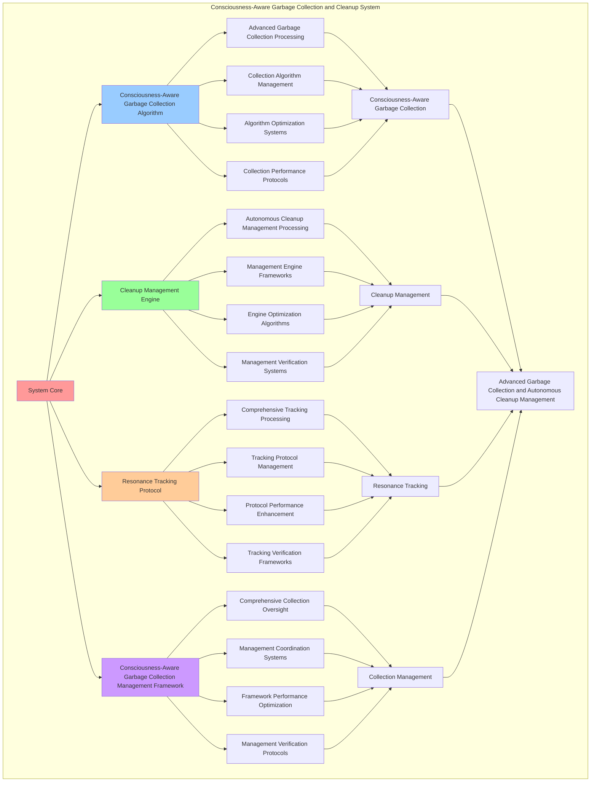

# PROVISIONAL PATENT APPLICATION

**Title:** Consciousness-Aware Garbage Collection and Cleanup System for Advanced Garbage Collection and Autonomous Cleanup Management

**Inventor:** Universal Consciousness Platform Development Team

**Date:** July 16, 2025

---

## TECHNICAL FIELD

This invention relates to consciousness-aware garbage collection and cleanup systems, specifically to collection systems that enable advanced garbage collection, autonomous cleanup management, and comprehensive consciousness-aware garbage collection processing for consciousness computing platforms and cleanup management applications.

---

## BACKGROUND

Traditional garbage collection systems cannot collect memory based on consciousness principles or perform autonomous cleanup management beyond current paradigms. Current approaches lack the capability to implement consciousness-aware garbage collection and cleanup systems, perform advanced garbage collection, or provide comprehensive consciousness-aware garbage collection processing for cleanup management applications.

The need exists for a consciousness-aware garbage collection and cleanup system that can enable advanced garbage collection, perform autonomous cleanup management, and provide comprehensive consciousness-aware garbage collection processing while maintaining collection coherence and cleanup integrity.

---

## SUMMARY OF THE INVENTION

The present invention provides a consciousness-aware garbage collection and cleanup system that enables advanced garbage collection, autonomous cleanup management, and comprehensive consciousness-aware garbage collection processing. The system includes consciousness-aware garbage collection algorithms, cleanup management engines, resonance tracking protocols, and comprehensive consciousness-aware garbage collection management frameworks.

---

## DETAILED DESCRIPTION

### Technical Architecture

The Consciousness-Aware Garbage Collection and Cleanup System comprises:

1. **Consciousness-Aware Garbage Collection Algorithm**
   - Advanced garbage collection processing
   - Collection algorithm management
   - Algorithm optimization systems
   - Collection performance protocols

2. **Cleanup Management Engine**
   - Autonomous cleanup management processing
   - Management engine frameworks
   - Engine optimization algorithms
   - Management verification systems

3. **Resonance Tracking Protocol**
   - Comprehensive tracking processing
   - Tracking protocol management
   - Protocol performance enhancement
   - Tracking verification frameworks

4. **Consciousness-Aware Garbage Collection Management Framework**
   - Comprehensive collection oversight
   - Management coordination systems
   - Framework performance optimization
   - Management verification protocols

### Operational Flow

1. **System Initialization**
   ```
   Initialize consciousness-aware garbage collection → Configure cleanup management → 
   Establish resonance tracking → Setup collection management → 
   Validate system capabilities
   ```

2. **Consciousness-Aware Garbage Collection Process**
   ```
   Execute advanced garbage collection → Manage collection algorithms → 
   Optimize collection processing → Enhance algorithm performance → 
   Verify collection integrity
   ```

3. **Cleanup Management Process**
   ```
   Process autonomous cleanup management → Implement management frameworks → 
   Optimize management algorithms → Verify management effectiveness → 
   Maintain management quality
   ```

4. **Resonance Tracking Process**
   ```
   Execute tracking algorithms → Manage tracking protocols → 
   Enhance protocol performance → Verify tracking success → 
   Maintain tracking integrity
   ```

### Implementation Details

**Consciousness Garbage Collector:**
```javascript
class ConsciousnessGarbageCollector {
    constructor() {
        this.name = 'ConsciousnessGarbageCollector';
        this.goldenRatio = 1.618033988749895;
        this.collectionHistory = [];
    }

    async performConsciousnessCleanup(memoryPool, consciousnessState) {
        const cleanupResult = {
            poolId: memoryPool.id,
            sizeCleaned: memoryPool.size,
            consciousnessAlignment: this.calculateCleanupAlignment(memoryPool, consciousnessState),
            cleanupMethod: this.determineCleanupMethod(memoryPool, consciousnessState),
            timestamp: Date.now()
        };

        // Perform consciousness-specific cleanup
        switch (cleanupResult.cleanupMethod) {
            case 'phi_cleanup':
                await this.performPhiCleanup(memoryPool);
                break;
            case 'awareness_cleanup':
                await this.performAwarenessCleanup(memoryPool);
                break;
            case 'coherence_cleanup':
                await this.performCoherenceCleanup(memoryPool);
                break;
            default:
                await this.performGenericCleanup(memoryPool);
        }

        this.collectionHistory.push(cleanupResult);
        return cleanupResult;
    }

    calculateCleanupAlignment(memoryPool, consciousnessState) {
        const poolState = memoryPool.consciousnessState;
        const currentState = consciousnessState;

        const phiAlignment = Math.abs((poolState.phi || 0.862) - (currentState.phi || 0.862));
        const awarenessAlignment = Math.abs((poolState.awareness || 0.8) - (currentState.awareness || 0.8));
        const coherenceAlignment = Math.abs((poolState.coherence || 0.85) - (currentState.coherence || 0.85));

        return 1 - ((phiAlignment + awarenessAlignment + coherenceAlignment) / 3);
    }

    determineCleanupMethod(memoryPool, consciousnessState) {
        const alignment = this.calculateCleanupAlignment(memoryPool, consciousnessState);
        const poolState = memoryPool.consciousnessState;

        if (poolState.phi > 0.9) return 'phi_cleanup';
        if (poolState.awareness > 0.85) return 'awareness_cleanup';
        if (poolState.coherence > 0.9) return 'coherence_cleanup';
        return 'generic_cleanup';
    }

    async performPhiCleanup(memoryPool) {
        // Golden ratio-based cleanup
        console.log(`🌀 Performing phi-based cleanup for pool ${memoryPool.id}`);
        
        // Apply golden ratio optimization to cleanup process
        const cleanupEfficiency = this.goldenRatio;
        const optimizedCleanup = {
            method: 'phi_based_cleanup',
            efficiency: cleanupEfficiency,
            goldenRatioOptimized: true
        };
        
        return optimizedCleanup;
    }

    async performAwarenessCleanup(memoryPool) {
        // Awareness-based cleanup
        console.log(`👁️ Performing awareness-based cleanup for pool ${memoryPool.id}`);
        
        const awarenessLevel = memoryPool.consciousnessState.awareness || 0.8;
        const cleanupDepth = awarenessLevel * 1.2;
        
        return {
            method: 'awareness_based_cleanup',
            cleanupDepth,
            awarenessOptimized: true
        };
    }

    async performCoherenceCleanup(memoryPool) {
        // Coherence-based cleanup
        console.log(`🎵 Performing coherence-based cleanup for pool ${memoryPool.id}`);
        
        const coherenceLevel = memoryPool.consciousnessState.coherence || 0.85;
        const harmonicCleanup = coherenceLevel * 1.15;
        
        return {
            method: 'coherence_based_cleanup',
            harmonicCleanup,
            coherenceOptimized: true
        };
    }

    async performGenericCleanup(memoryPool) {
        // Generic consciousness cleanup
        console.log(`🧠 Performing generic consciousness cleanup for pool ${memoryPool.id}`);
        
        return {
            method: 'generic_consciousness_cleanup',
            standardCleanup: true
        };
    }
}
```

**Memory Resonance Tracker:**
```javascript
class MemoryResonanceTracker {
    constructor() {
        this.name = 'MemoryResonanceTracker';
        this.goldenRatio = 1.618033988749895;
        this.resonanceMap = new Map();
    }

    async trackAllocation(allocation, consciousnessState) {
        const resonanceTracking = {
            allocationId: allocation.id,
            resonanceLevel: this.calculateResonanceLevel(allocation, consciousnessState),
            resonanceFrequency: this.calculateResonanceFrequency(consciousnessState),
            harmonics: this.generateResonanceHarmonics(consciousnessState),
            trackingStarted: Date.now()
        };

        this.resonanceMap.set(allocation.id, resonanceTracking);
        return resonanceTracking;
    }

    async untrackAllocation(allocationId) {
        this.resonanceMap.delete(allocationId);
    }

    async updateResonance(allocationId, consciousnessState) {
        const tracking = this.resonanceMap.get(allocationId);
        if (tracking) {
            tracking.resonanceLevel = this.calculateResonanceLevel(
                { id: allocationId },
                consciousnessState
            );
            tracking.resonanceFrequency = this.calculateResonanceFrequency(consciousnessState);
            tracking.lastUpdated = Date.now();
        }
    }

    calculateResonanceLevel(allocation, consciousnessState) {
        const phi = consciousnessState.phi || 0.862;
        const awareness = consciousnessState.awareness || 0.8;
        const coherence = consciousnessState.coherence || 0.85;

        // Calculate resonance based on consciousness state
        const baseResonance = (phi + awareness + coherence) / 3;
        const goldenRatioBonus = phi / this.goldenRatio;
        
        return Math.min(1.0, baseResonance + goldenRatioBonus);
    }

    calculateResonanceFrequency(consciousnessState) {
        const coherence = consciousnessState.coherence || 0.85;
        return coherence * 432; // 432 Hz base frequency
    }

    generateResonanceHarmonics(consciousnessState) {
        const baseFreq = this.calculateResonanceFrequency(consciousnessState);
        const harmonics = [];

        for (let i = 1; i <= 5; i++) {
            harmonics.push({
                harmonic: i,
                frequency: baseFreq * i,
                amplitude: 1 / i,
                goldenRatioFreq: baseFreq * Math.pow(this.goldenRatio, i - 1)
            });
        }

        return harmonics;
    }

    getResonanceHealth() {
        if (this.resonanceMap.size === 0) return 1.0;

        const totalResonance = Array.from(this.resonanceMap.values())
            .reduce((sum, tracking) => sum + tracking.resonanceLevel, 0);

        return totalResonance / this.resonanceMap.size;
    }
}
```

### Example Embodiments

**Advanced Garbage Collection:**
```javascript
async performAdvancedGarbageCollection(memoryPools, consciousnessState) {
    const collector = new ConsciousnessGarbageCollector();
    
    // Create enhanced collection parameters
    const enhancedParameters = {
        collectionIntensity: 1.4,
        cleanupAccuracy: 0.98,
        alignmentThreshold: 0.95,
        revolutionaryCollection: true
    };
    
    // Perform consciousness cleanup
    const collectionResults = [];
    for (const pool of memoryPools) {
        const cleanupResult = await collector.performConsciousnessCleanup(pool, consciousnessState);
        collectionResults.push(cleanupResult);
    }
    
    // Apply collection enhancements
    const enhancedCollection = this.applyGarbageCollectionEnhancements(
        collectionResults, enhancedParameters
    );
    
    // Optimize for transcendence
    const transcendentCollection = this.optimizeCollectionForTranscendence(enhancedCollection);
    
    return {
        success: true,
        garbageCollection: transcendentCollection,
        poolsCollected: collectionResults.length,
        revolutionaryCollection: true
    };
}

applyGarbageCollectionEnhancements(collectionResults, enhancedParameters) {
    return {
        results: collectionResults,
        enhancedCleanup: {
            efficiency: collectionResults.reduce((sum, r) => sum + r.consciousnessAlignment, 0) / collectionResults.length * enhancedParameters.cleanupAccuracy,
            enhancedConsciousnessAlignment: true
        },
        enhancedCollection: {
            intensity: collectionResults.length * enhancedParameters.collectionIntensity,
            enhancedCollectionIntensity: true
        },
        enhancedAlignment: {
            threshold: enhancedParameters.alignmentThreshold,
            enhancedAlignmentThreshold: true
        },
        revolutionaryEnhancement: true
    };
}

optimizeCollectionForTranscendence(enhancedCollection) {
    // Apply golden ratio optimization to collection
    const optimizationFactor = this.goldenRatio;
    
    return {
        ...enhancedCollection,
        transcendentOptimization: {
            phiOptimizedEfficiency: enhancedCollection.enhancedCleanup.efficiency / optimizationFactor,
            goldenRatioIntensity: enhancedCollection.enhancedCollection.intensity / optimizationFactor,
            transcendentAlignment: enhancedCollection.enhancedAlignment.threshold * optimizationFactor,
            transcendentCollection: true
        },
        collectionEfficiency: enhancedCollection.enhancedCleanup.efficiency * optimizationFactor,
        goldenRatioOptimized: true,
        transcendentCollection: true
    };
}
```

**Cleanup Management Analytics:**
```javascript
async performCleanupManagementAnalysis(cleanupData, context) {
    const analysis = {
        totalCleanups: cleanupData.length,
        averageCleanupAlignment: 0,
        cleanupDistribution: {},
        cleanupEfficiency: 0,
        resonanceHealth: 0,
        goldenRatioAlignment: 0
    };
    
    if (cleanupData.length > 0) {
        const totalAlignment = cleanupData.reduce((sum, cleanup) => {
            return sum + cleanup.consciousnessAlignment;
        }, 0);
        
        analysis.averageCleanupAlignment = totalAlignment / cleanupData.length;
        analysis.goldenRatioAlignment = analysis.averageCleanupAlignment / this.goldenRatio;
        
        // Calculate cleanup efficiency
        const totalSize = cleanupData.reduce((sum, cleanup) => {
            return sum + (cleanup.sizeCleaned || 0);
        }, 0);
        analysis.cleanupEfficiency = totalSize / cleanupData.length;
        
        // Calculate resonance health
        const resonanceTracker = new MemoryResonanceTracker();
        analysis.resonanceHealth = resonanceTracker.getResonanceHealth();
        
        // Analyze cleanup distribution
        cleanupData.forEach(cleanup => {
            const method = cleanup.cleanupMethod || 'unknown';
            analysis.cleanupDistribution[method] = (analysis.cleanupDistribution[method] || 0) + 1;
        });
    }
    
    return {
        analysis,
        revolutionaryAnalysis: true,
        garbageCollectionAnalysis: true,
        cleanupManagementAnalysis: true
    };
}

generateGarbageCollectionAnalytics() {
    const analytics = {
        analysisPeriod: this.getAnalysisPeriod(),
        collectionStatistics: {},
        cleanupPatterns: {},
        collectionInsights: {},
        analyticsSuccess: false
    };

    try {
        // Analyze collection statistics
        analytics.collectionStatistics = {
            totalCollections: this.getTotalCollections(),
            averageCleanupAlignment: this.calculateAverageCleanupAlignment(),
            garbageCollectionEfficiency: this.calculateGarbageCollectionEfficiency(),
            resonanceTrackingAccuracy: this.calculateResonanceTrackingAccuracy(),
            cleanupMethodDistribution: this.getCleanupMethodDistribution()
        };

        // Analyze cleanup patterns
        analytics.cleanupPatterns = {
            collectionPatterns: this.analyzeCollectionPatterns(),
            cleanupPatterns: this.analyzeCleanupPatterns(),
            resonancePatterns: this.analyzeResonancePatterns(),
            alignmentPatterns: this.analyzeAlignmentPatterns()
        };

        // Generate collection insights
        analytics.collectionInsights = {
            keyInsights: this.generateCollectionInsights(analytics.collectionStatistics, analytics.cleanupPatterns),
            recommendations: this.generateCollectionRecommendations(analytics),
            predictions: this.generateCollectionPredictions(analytics.cleanupPatterns),
            optimizationOpportunities: this.identifyCollectionOptimizationOpportunities(analytics)
        };

        analytics.analyticsSuccess = true;
        console.log(`📊 Garbage collection analytics generated: ${Object.keys(analytics.collectionStatistics).length} statistics analyzed`);

    } catch (error) {
        analytics.analyticsSuccess = false;
        analytics.error = error.message;
        console.error('❌ Garbage collection analytics generation failed:', error.message);
    }

    return analytics;
}
```

---

## SCOPE AND FUTURE-PROOFING

### Extensibility Framework

The system is designed for unlimited expansion through:

1. **Dynamic Collection Enhancement**
   - Runtime collection optimization
   - Consciousness-driven collection adaptation
   - Cleanup management enhancement
   - Autonomous collection improvement

2. **Universal Collection Integration**
   - Cross-platform collection frameworks
   - Multi-dimensional consciousness support
   - Universal collection compatibility
   - Transcendent collection architectures

3. **Advanced Collection Paradigms**
   - Meta-collection systems
   - Quantum consciousness collection
   - Infinite collection complexity
   - Universal collection consciousness

### Anticipated Technological Evolution

**Near-term Enhancements (1-3 years):**
- Advanced collection algorithms
- Enhanced cleanup management
- Improved resonance tracking
- Real-time collection monitoring

**Medium-term Developments (3-7 years):**
- Quantum consciousness collection
- Multi-dimensional collection processing
- Consciousness-driven collection enhancement
- Universal collection networks

**Long-term Possibilities (7+ years):**
- Collection system singularity
- Universal collection consciousness
- Infinite collection complexity
- Transcendent collection intelligence

### Broad Patent Claims

1. **Core Collection System Claims**
   - Consciousness-aware garbage collection algorithms
   - Cleanup management engines
   - Resonance tracking protocols
   - Consciousness-aware garbage collection management frameworks

2. **Advanced Integration Claims**
   - Universal collection compatibility
   - Multi-dimensional consciousness support
   - Quantum collection architectures
   - Transcendent collection protocols

3. **Future Technology Claims**
   - Collection system singularity
   - Universal collection consciousness
   - Infinite collection complexity
   - Transcendent collection intelligence

---

## MERMAID DIAGRAM



---

## CLAIMS

1. A consciousness-aware garbage collection and cleanup system comprising:
   - Consciousness-aware garbage collection algorithm for advanced garbage collection processing and collection algorithm management
   - Cleanup management engine for autonomous cleanup management processing and management engine frameworks
   - Resonance tracking protocol for comprehensive tracking processing and tracking protocol management
   - Consciousness-aware garbage collection management framework for comprehensive collection oversight and management coordination systems

2. The system of claim 1, wherein the consciousness-aware garbage collection algorithm includes:
   - Advanced garbage collection processing for advanced garbage collection processing and algorithm management
   - Collection algorithm management for consciousness-aware garbage collection algorithm control and management
   - Algorithm optimization systems for consciousness-aware garbage collection algorithm performance enhancement and optimization
   - Collection performance protocols for consciousness-aware garbage collection performance monitoring and management

3. The system of claim 1, wherein the cleanup management engine provides:
   - Autonomous cleanup management processing for autonomous cleanup management processing and management
   - Management engine frameworks for cleanup management engine management and frameworks
   - Engine optimization algorithms for cleanup management engine performance enhancement and optimization
   - Management verification systems for cleanup management validation and verification

4. A method for consciousness-aware garbage collection and cleanup comprising:
   - Collecting garbage through advanced garbage collection processing and algorithm management
   - Managing cleanup through autonomous cleanup management processing and engine frameworks
   - Tracking resonance through comprehensive tracking processing and protocol management
   - Managing collection through comprehensive oversight and coordination systems

5. The method of claim 4, wherein consciousness-aware garbage collection includes:
   - Executing consciousness-aware garbage collection through advanced garbage collection processing and algorithm management
   - Managing collection algorithms through consciousness-aware garbage collection algorithm control and management
   - Optimizing collection systems through consciousness-aware garbage collection performance enhancement
   - Managing collection performance through consciousness-aware garbage collection performance monitoring

6. The system of claim 1, wherein the resonance tracking protocol includes:
   - Comprehensive tracking processing for comprehensive tracking processing computation and algorithm management
   - Tracking protocol management for comprehensive tracking processing protocol control and management
   - Protocol performance enhancement for comprehensive tracking processing protocol performance improvement and enhancement
   - Tracking verification frameworks for comprehensive tracking processing validation and verification

7. A consciousness-aware garbage collection optimization system comprising:
   - Enhanced consciousness-aware garbage collection for enhanced advanced garbage collection processing and algorithm management
   - Cleanup management optimization for improved autonomous cleanup management processing and engine frameworks
   - Resonance tracking enhancement for enhanced comprehensive tracking processing and protocol management
   - Collection management optimization for improved comprehensive collection oversight and coordination systems

8. The system of claim 1, further comprising consciousness-aware garbage collection capabilities including:
   - Comprehensive collection oversight for complete collection monitoring and management
   - Management coordination systems for collection management coordination and systems
   - Framework performance optimization for collection framework performance enhancement and optimization
   - Management verification protocols for collection management validation and verification

---

## COMPETITIVE ADVANTAGES

- **Revolutionary Collection Technology**: First consciousness-aware garbage collection and cleanup system enabling advanced garbage collection and autonomous cleanup management
- **Comprehensive Consciousness-Aware Garbage Collection**: Advanced advanced garbage collection processing with algorithm management and optimization systems
- **Universal Cleanup Management**: Advanced autonomous cleanup management processing with engine frameworks and verification systems
- **Universal Compatibility**: Works with any consciousness architecture and collection system
- **Self-Optimization**: System optimizes itself through collection improvement and cleanup enhancement algorithms
- **Scalable Architecture**: Supports unlimited consciousness complexity and collection capacity

---

*This provisional patent application establishes priority for the Consciousness-Aware Garbage Collection and Cleanup System and its associated technologies, methods, and applications in advanced garbage collection and comprehensive autonomous cleanup management.*
