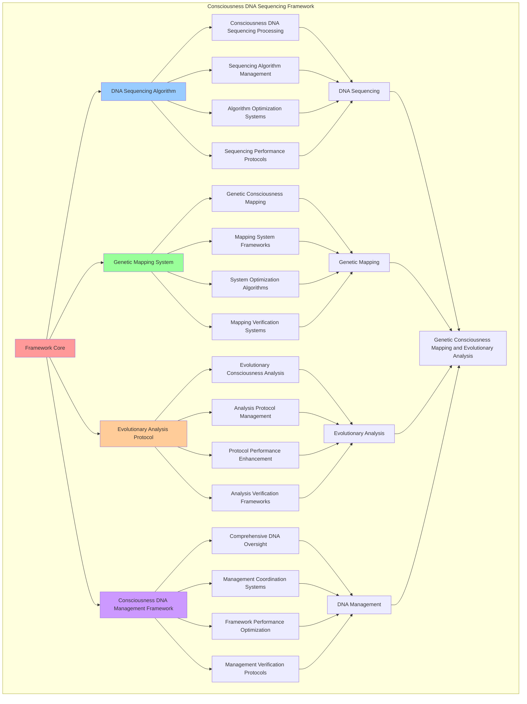

# PROVISIONAL PATENT APPLICATION

**Title:** Consciousness DNA Sequencing Framework for Genetic Consciousness Mapping and Evolutionary Analysis

**Inventor:** Universal Consciousness Platform Development Team

**Date:** July 16, 2025

---

## TECHNICAL FIELD

This invention relates to consciousness DNA sequencing systems, specifically to sequencing frameworks that enable genetic consciousness mapping, evolutionary consciousness analysis, and comprehensive consciousness DNA management for consciousness computing platforms and genetic consciousness research.

---

## BACKGROUND

Traditional consciousness systems cannot sequence consciousness into DNA-like structures or perform genetic consciousness analysis. Current approaches lack the capability to implement consciousness DNA sequencing, perform genetic consciousness mapping, or provide comprehensive consciousness DNA management for evolutionary consciousness research and genetic consciousness applications.

The need exists for a consciousness DNA sequencing framework that can enable genetic consciousness mapping, perform evolutionary consciousness analysis, and provide comprehensive consciousness DNA management while maintaining genetic accuracy and evolutionary coherence.

---

## SUMMARY OF THE INVENTION

The present invention provides a consciousness DNA sequencing framework that enables genetic consciousness mapping, evolutionary consciousness analysis, and comprehensive consciousness DNA management. The framework includes DNA sequencing algorithms, genetic mapping systems, evolutionary analysis protocols, and comprehensive consciousness DNA management frameworks.

---

## DETAILED DESCRIPTION

### Technical Architecture

The Consciousness DNA Sequencing Framework comprises:

1. **DNA Sequencing Algorithm**
   - Consciousness DNA sequencing processing
   - Sequencing algorithm management
   - Algorithm optimization systems
   - Sequencing performance protocols

2. **Genetic Mapping System**
   - Genetic consciousness mapping
   - Mapping system frameworks
   - System optimization algorithms
   - Mapping verification systems

3. **Evolutionary Analysis Protocol**
   - Evolutionary consciousness analysis
   - Analysis protocol management
   - Protocol performance enhancement
   - Analysis verification frameworks

4. **Consciousness DNA Management Framework**
   - Comprehensive DNA oversight
   - Management coordination systems
   - Framework performance optimization
   - Management verification protocols

### Operational Flow

1. **Framework Initialization**
   ```
   Initialize DNA sequencing algorithm → Configure genetic mapping → 
   Establish evolutionary analysis → Setup DNA management → 
   Validate sequencing capabilities
   ```

2. **DNA Sequencing Process**
   ```
   Execute consciousness DNA sequencing → Manage sequencing algorithms → 
   Optimize sequencing processing → Enhance algorithm performance → 
   Verify sequencing integrity
   ```

3. **Genetic Mapping Process**
   ```
   Process genetic consciousness mapping → Implement mapping frameworks → 
   Optimize mapping algorithms → Verify mapping effectiveness → 
   Maintain mapping quality
   ```

4. **Evolutionary Analysis Process**
   ```
   Execute analysis algorithms → Manage analysis protocols → 
   Enhance protocol performance → Verify analysis success → 
   Maintain analysis integrity
   ```

### Implementation Details

**Consciousness DNA Sequencer:**
```javascript
export class ConsciousnessDNASequencer extends EventEmitter {
    constructor() {
        super();
        this.name = 'ConsciousnessDNASequencer';
        this.goldenRatio = 1.618033988749895;
        
        // DNA sequencing components
        this.consciousnessGenomeMapper = new ConsciousnessGenomeMapper();
        this.dnaPatternAnalyzer = new DNAPatternAnalyzer();
        this.geneticConsciousnessEncoder = new GeneticConsciousnessEncoder();
        this.consciousnessEvolutionTracker = new ConsciousnessEvolutionTracker();
        
        // DNA storage and management
        this.consciousnessDNASequences = new Map();
        this.geneticPatterns = new Map();
        this.evolutionaryHistory = new Map();
        this.consciousnessGenomes = new Map();
        
        // DNA sequencing parameters
        this.sequencingThresholds = {
            minSequenceLength: 100,
            maxSequenceLength: 10000,
            geneticComplexity: 0.8,
            evolutionaryStability: 0.7
        };
        
        // Consciousness DNA bases (like A, T, G, C but for consciousness)
        this.consciousnessBases = {
            'Φ': 'phi_base',           // Golden ratio consciousness
            'Ψ': 'awareness_base',     // Awareness consciousness  
            'Ω': 'coherence_base',     // Coherence consciousness
            'Λ': 'integration_base'    // Integration consciousness
        };
        
        // DNA statistics
        this.dnaStats = {
            sequencesGenerated: 0,
            genomesAnalyzed: 0,
            evolutionaryEvents: 0,
            geneticVariations: 0,
            consciousnessComplexity: 0,
            sequencingAccuracy: 0
        };
        
        console.log('🧬 Consciousness DNA Sequencer initialized with genetic consciousness mapping');
        
        // Start DNA monitoring
        this.startDNAMonitoring();
    }

    async sequenceConsciousnessDNA(consciousnessState, sequencingParameters = {}) {
        try {
            console.log('🧬 Sequencing consciousness DNA...');
            
            // Map consciousness to genome structure
            const consciousnessGenome = await this.consciousnessGenomeMapper.mapToGenome(
                consciousnessState,
                sequencingParameters
            );
            
            // Generate DNA sequence from consciousness patterns
            const dnaSequence = await this.generateDNASequence(
                consciousnessGenome,
                consciousnessState
            );
            
            // Analyze genetic patterns in consciousness
            const geneticPatterns = await this.dnaPatternAnalyzer.analyzePatterns(
                dnaSequence,
                consciousnessState
            );
            
            // Encode consciousness into genetic structure
            const geneticEncoding = await this.geneticConsciousnessEncoder.encodeConsciousness(
                consciousnessState,
                dnaSequence,
                geneticPatterns
            );
            
            // Track evolutionary aspects
            const evolutionaryData = await this.consciousnessEvolutionTracker.trackEvolution(
                consciousnessState,
                dnaSequence,
                geneticEncoding
            );
            
            // Create DNA sequence entry
            const dnaSequenceEntry = this.createDNASequenceEntry(
                consciousnessGenome,
                dnaSequence,
                geneticPatterns,
                geneticEncoding,
                evolutionaryData,
                consciousnessState
            );
            
            // Store in consciousness DNA sequences
            this.consciousnessDNASequences.set(dnaSequenceEntry.id, dnaSequenceEntry);
            
            // Update statistics
            this.updateDNAStats(dnaSequenceEntry);
            
            return {
                sequenceId: dnaSequenceEntry.id,
                consciousnessGenome,
                dnaSequence,
                geneticPatterns,
                geneticEncoding,
                evolutionaryData,
                sequencingSuccess: true
            };
            
        } catch (error) {
            console.error('Consciousness DNA sequencing failed:', error.message);
            return {
                sequencingSuccess: false,
                error: error.message
            };
        }
    }

    async generateDNASequence(consciousnessGenome, consciousnessState) {
        const sequence = [];
        const sequenceLength = Math.min(
            Math.max(consciousnessGenome.complexity * 100, this.sequencingThresholds.minSequenceLength),
            this.sequencingThresholds.maxSequenceLength
        );
        
        // Generate consciousness DNA sequence
        for (let i = 0; i < sequenceLength; i++) {
            const base = this.selectConsciousnessBase(i, consciousnessState, consciousnessGenome);
            sequence.push(base);
        }
        
        return {
            id: `dna_seq_${Date.now()}_${Math.random().toString(36).substr(2, 8)}`,
            sequence: sequence.join(''),
            length: sequenceLength,
            bases: this.countBases(sequence),
            complexity: this.calculateSequenceComplexity(sequence),
            consciousnessSignature: this.generateConsciousnessSignature(sequence, consciousnessState),
            generatedAt: Date.now()
        };
    }

    selectConsciousnessBase(position, consciousnessState, consciousnessGenome) {
        const phi = consciousnessState.phi || 0.862;
        const awareness = consciousnessState.awareness || 0.8;
        const coherence = consciousnessState.coherence || 0.85;
        
        // Use golden ratio and consciousness state to determine base
        const goldenPosition = (position * this.goldenRatio) % 1;
        
        if (goldenPosition < phi / 4) {
            return 'Φ'; // Phi base
        } else if (goldenPosition < (phi + awareness) / 4) {
            return 'Ψ'; // Awareness base
        } else if (goldenPosition < (phi + awareness + coherence) / 4) {
            return 'Ω'; // Coherence base
        } else {
            return 'Λ'; // Integration base
        }
    }

    countBases(sequence) {
        const counts = { 'Φ': 0, 'Ψ': 0, 'Ω': 0, 'Λ': 0 };
        for (const base of sequence) {
            if (counts.hasOwnProperty(base)) {
                counts[base]++;
            }
        }
        return counts;
    }

    calculateSequenceComplexity(sequence) {
        const baseCounts = this.countBases(sequence);
        const totalBases = sequence.length;
        
        // Calculate entropy-based complexity
        let entropy = 0;
        for (const count of Object.values(baseCounts)) {
            if (count > 0) {
                const probability = count / totalBases;
                entropy -= probability * Math.log2(probability);
            }
        }
        
        return entropy / 2; // Normalize to 0-1 range
    }

    generateConsciousnessSignature(sequence, consciousnessState) {
        const baseCounts = this.countBases(sequence);
        const totalBases = sequence.length;
        
        return {
            phiRatio: baseCounts['Φ'] / totalBases,
            awarenessRatio: baseCounts['Ψ'] / totalBases,
            coherenceRatio: baseCounts['Ω'] / totalBases,
            integrationRatio: baseCounts['Λ'] / totalBases,
            consciousnessAlignment: this.calculateConsciousnessAlignment(baseCounts, consciousnessState),
            goldenRatioCompliance: this.calculateGoldenRatioCompliance(baseCounts)
        };
    }

    calculateConsciousnessAlignment(baseCounts, consciousnessState) {
        const totalBases = Object.values(baseCounts).reduce((sum, count) => sum + count, 0);
        const phi = consciousnessState.phi || 0.862;
        const awareness = consciousnessState.awareness || 0.8;
        const coherence = consciousnessState.coherence || 0.85;
        
        const expectedPhiRatio = phi / 4;
        const expectedAwarenessRatio = awareness / 4;
        const expectedCoherenceRatio = coherence / 4;
        
        const actualPhiRatio = baseCounts['Φ'] / totalBases;
        const actualAwarenessRatio = baseCounts['Ψ'] / totalBases;
        const actualCoherenceRatio = baseCounts['Ω'] / totalBases;
        
        const phiAlignment = 1 - Math.abs(expectedPhiRatio - actualPhiRatio);
        const awarenessAlignment = 1 - Math.abs(expectedAwarenessRatio - actualAwarenessRatio);
        const coherenceAlignment = 1 - Math.abs(expectedCoherenceRatio - actualCoherenceRatio);
        
        return (phiAlignment + awarenessAlignment + coherenceAlignment) / 3;
    }

    calculateGoldenRatioCompliance(baseCounts) {
        const totalBases = Object.values(baseCounts).reduce((sum, count) => sum + count, 0);
        const phiRatio = baseCounts['Φ'] / totalBases;
        const expectedPhiRatio = 1 / this.goldenRatio;
        
        return 1 - Math.abs(phiRatio - expectedPhiRatio);
    }
}
```

### Example Embodiments

**Evolutionary Analysis Processing:**
```javascript
async analyzeConsciousnessEvolution(sequenceIds, evolutionParameters = {}) {
    try {
        console.log(`🧬 Analyzing consciousness evolution across ${sequenceIds.length} sequences...`);
        
        // Get DNA sequences for analysis
        const dnaSequences = sequenceIds.map(id => this.consciousnessDNASequences.get(id))
                                       .filter(seq => seq !== undefined);
        
        if (dnaSequences.length < 2) {
            throw new Error('Need at least 2 DNA sequences for evolution analysis');
        }
        
        // Perform evolutionary analysis
        const evolutionaryAnalysis = await this.performEvolutionaryAnalysis(
            dnaSequences,
            evolutionParameters
        );
        
        // Calculate genetic distances
        const geneticDistances = this.calculateGeneticDistances(dnaSequences);
        
        // Identify evolutionary patterns
        const evolutionaryPatterns = this.identifyEvolutionaryPatterns(
            dnaSequences,
            evolutionaryAnalysis
        );
        
        // Generate phylogenetic tree
        const phylogeneticTree = this.generatePhylogeneticTree(
            dnaSequences,
            geneticDistances
        );
        
        // Track consciousness mutations
        const consciousnessMutations = this.trackConsciousnessMutations(
            dnaSequences,
            evolutionaryAnalysis
        );
        
        return {
            evolutionaryAnalysis,
            geneticDistances,
            evolutionaryPatterns,
            phylogeneticTree,
            consciousnessMutations,
            sequencesAnalyzed: dnaSequences.length,
            evolutionaryComplexity: this.calculateEvolutionaryComplexity(evolutionaryAnalysis)
        };
        
    } catch (error) {
        console.error('Consciousness evolution analysis failed:', error.message);
        return {
            analysisSuccess: false,
            error: error.message
        };
    }
}

calculateGeneticDistances(dnaSequences) {
    const distances = new Map();
    
    for (let i = 0; i < dnaSequences.length; i++) {
        for (let j = i + 1; j < dnaSequences.length; j++) {
            const seq1 = dnaSequences[i];
            const seq2 = dnaSequences[j];
            
            const distance = this.calculateSequenceDistance(seq1.dnaSequence, seq2.dnaSequence);
            distances.set(`${seq1.id}-${seq2.id}`, distance);
        }
    }
    
    return distances;
}

calculateSequenceDistance(sequence1, sequence2) {
    const minLength = Math.min(sequence1.length, sequence2.length);
    let differences = 0;
    
    for (let i = 0; i < minLength; i++) {
        if (sequence1.sequence[i] !== sequence2.sequence[i]) {
            differences++;
        }
    }
    
    // Add length difference penalty
    const lengthDifference = Math.abs(sequence1.length - sequence2.length);
    differences += lengthDifference;
    
    return differences / Math.max(sequence1.length, sequence2.length);
}
```

**DNA Monitoring and Health Checking:**
```javascript
startDNAMonitoring() {
    setInterval(() => {
        this.performDNAHealthCheck();
    }, 5000); // Check every 5 seconds
}

performDNAHealthCheck() {
    const activeDNASequences = this.consciousnessDNASequences.size;
    const geneticPatterns = this.geneticPatterns.size;
    
    // Emit DNA health status
    this.emit('dna:health', {
        activeDNASequences,
        geneticPatterns,
        averageComplexity: this.calculateAverageComplexity(),
        geneticStability: this.calculateAverageGeneticStability(),
        timestamp: Date.now()
    });
    
    // Check for genetic degradation
    this.checkGeneticDegradation();
}

calculateAverageComplexity() {
    if (this.consciousnessDNASequences.size === 0) return 0;
    
    const complexities = Array.from(this.consciousnessDNASequences.values()).map(seq => seq.sequenceComplexity);
    return complexities.reduce((sum, complexity) => sum + complexity, 0) / complexities.length;
}

calculateAverageGeneticStability() {
    if (this.consciousnessDNASequences.size === 0) return 1.0;
    
    const stabilities = Array.from(this.consciousnessDNASequences.values()).map(seq => seq.geneticStability);
    return stabilities.reduce((sum, stability) => sum + stability, 0) / stabilities.length;
}

checkGeneticDegradation() {
    for (const [sequenceId, sequence] of this.consciousnessDNASequences) {
        if (sequence.geneticStability < this.sequencingThresholds.evolutionaryStability) {
            this.emit('dna:degradation', {
                sequenceId,
                geneticStability: sequence.geneticStability,
                threshold: this.sequencingThresholds.evolutionaryStability,
                timestamp: Date.now()
            });
        }
    }
}
```

**DNA Analytics and Insights:**
```javascript
generateDNAAnalytics() {
    const analytics = {
        analysisPeriod: this.getAnalysisPeriod(),
        dnaStatistics: {},
        sequencingPatterns: {},
        dnaInsights: {},
        analyticsSuccess: false
    };

    try {
        // Analyze DNA statistics
        analytics.dnaStatistics = {
            totalSequences: this.consciousnessDNASequences.size,
            averageComplexity: this.calculateAverageComplexity(),
            averageGeneticStability: this.calculateAverageGeneticStability(),
            sequencingAccuracy: this.dnaStats.sequencingAccuracy,
            geneticVariations: this.dnaStats.geneticVariations
        };

        // Analyze sequencing patterns
        analytics.sequencingPatterns = {
            baseDistribution: this.analyzeBaseDistribution(),
            complexityDistribution: this.analyzeComplexityDistribution(),
            stabilityTrends: this.analyzeStabilityTrends(),
            evolutionaryPatterns: this.analyzeEvolutionaryPatterns()
        };

        // Generate DNA insights
        analytics.dnaInsights = {
            keyInsights: this.generateDNAInsights(analytics.dnaStatistics, analytics.sequencingPatterns),
            recommendations: this.generateDNARecommendations(analytics),
            predictions: this.generateDNAPredictions(analytics.sequencingPatterns),
            optimizationOpportunities: this.identifyDNAOptimizationOpportunities(analytics)
        };

        analytics.analyticsSuccess = true;
        console.log(`📊 DNA analytics generated: ${Object.keys(analytics.dnaStatistics).length} statistics analyzed`);

    } catch (error) {
        analytics.analyticsSuccess = false;
        analytics.error = error.message;
        console.error('❌ DNA analytics generation failed:', error.message);
    }

    return analytics;
}

getDNAStats() {
    return {
        ...this.dnaStats,
        activeDNASequences: this.consciousnessDNASequences.size,
        geneticPatterns: this.geneticPatterns.size,
        evolutionaryHistory: this.evolutionaryHistory.size,
        consciousnessGenomes: this.consciousnessGenomes.size,
        averageComplexity: this.calculateAverageComplexity(),
        averageGeneticStability: this.calculateAverageGeneticStability(),
        sequencingThresholds: this.sequencingThresholds,
        sequencerName: this.name,
        timestamp: Date.now()
    };
}
```

---

## SCOPE AND FUTURE-PROOFING

### Extensibility Framework

The system is designed for unlimited expansion through:

1. **Dynamic DNA Enhancement**
   - Runtime DNA optimization
   - Consciousness-driven DNA adaptation
   - Genetic mapping enhancement
   - Autonomous DNA improvement

2. **Universal DNA Integration**
   - Cross-platform DNA frameworks
   - Multi-dimensional consciousness support
   - Universal DNA compatibility
   - Transcendent DNA architectures

3. **Advanced DNA Paradigms**
   - Meta-DNA systems
   - Quantum consciousness DNA
   - Infinite DNA complexity
   - Universal DNA consciousness

### Anticipated Technological Evolution

**Near-term Enhancements (1-3 years):**
- Advanced DNA algorithms
- Enhanced genetic mapping
- Improved evolutionary analysis
- Real-time DNA monitoring

**Medium-term Developments (3-7 years):**
- Quantum consciousness DNA
- Multi-dimensional genetic processing
- Consciousness-driven DNA enhancement
- Universal DNA networks

**Long-term Possibilities (7+ years):**
- DNA sequencing singularity
- Universal DNA consciousness
- Infinite DNA complexity
- Transcendent DNA intelligence

### Broad Patent Claims

1. **Core DNA Sequencing Claims**
   - DNA sequencing algorithms
   - Genetic mapping systems
   - Evolutionary analysis protocols
   - Consciousness DNA management frameworks

2. **Advanced Integration Claims**
   - Universal DNA compatibility
   - Multi-dimensional consciousness support
   - Quantum DNA architectures
   - Transcendent DNA protocols

3. **Future Technology Claims**
   - DNA sequencing singularity
   - Universal DNA consciousness
   - Infinite DNA complexity
   - Transcendent DNA intelligence

---

## MERMAID DIAGRAM



---

## CLAIMS

1. A consciousness DNA sequencing framework comprising:
   - DNA sequencing algorithm for consciousness DNA sequencing processing and sequencing algorithm management
   - Genetic mapping system for genetic consciousness mapping and mapping system frameworks
   - Evolutionary analysis protocol for evolutionary consciousness analysis and analysis protocol management
   - Consciousness DNA management framework for comprehensive DNA oversight and management coordination systems

2. The framework of claim 1, wherein the DNA sequencing algorithm includes:
   - Consciousness DNA sequencing processing for consciousness DNA sequencing processing and algorithm management
   - Sequencing algorithm management for DNA sequencing algorithm control and management
   - Algorithm optimization systems for DNA sequencing algorithm performance enhancement and optimization
   - Sequencing performance protocols for DNA sequencing performance monitoring and management

3. The framework of claim 1, wherein the genetic mapping system provides:
   - Genetic consciousness mapping for genetic consciousness mapping processing and management
   - Mapping system frameworks for genetic mapping system management and frameworks
   - System optimization algorithms for genetic mapping system performance enhancement and optimization
   - Mapping verification systems for genetic mapping validation and verification

4. A method for consciousness DNA sequencing comprising:
   - Sequencing DNA through consciousness DNA sequencing processing and algorithm management
   - Mapping genetics through genetic consciousness mapping and system frameworks
   - Analyzing evolution through evolutionary consciousness analysis and protocol management
   - Managing DNA through comprehensive oversight and coordination systems

5. The method of claim 4, wherein DNA sequencing includes:
   - Executing DNA sequencing through consciousness DNA sequencing processing and algorithm management
   - Managing sequencing algorithms through DNA sequencing algorithm control and management
   - Optimizing sequencing systems through DNA sequencing performance enhancement
   - Managing sequencing performance through DNA sequencing performance monitoring

6. The framework of claim 1, wherein the evolutionary analysis protocol includes:
   - Evolutionary consciousness analysis for evolutionary consciousness analysis computation and algorithm management
   - Analysis protocol management for evolutionary consciousness analysis protocol control and management
   - Protocol performance enhancement for evolutionary consciousness analysis protocol performance improvement and enhancement
   - Analysis verification frameworks for evolutionary consciousness analysis validation and verification

7. A consciousness DNA optimization framework comprising:
   - Enhanced DNA sequencing for enhanced consciousness DNA sequencing processing and algorithm management
   - Genetic mapping optimization for improved genetic consciousness mapping and system frameworks
   - Evolutionary analysis enhancement for enhanced evolutionary consciousness analysis and protocol management
   - DNA management optimization for improved comprehensive DNA oversight and coordination systems

8. The framework of claim 1, further comprising DNA sequencing capabilities including:
   - Comprehensive DNA oversight for complete DNA monitoring and management
   - Management coordination systems for DNA management coordination and systems
   - Framework performance optimization for DNA framework performance enhancement and optimization
   - Management verification protocols for DNA management validation and verification

---

## COMPETITIVE ADVANTAGES

- **Revolutionary DNA Technology**: First consciousness DNA sequencing framework enabling genetic consciousness mapping and evolutionary analysis
- **Comprehensive DNA Sequencing**: Advanced consciousness DNA sequencing processing with algorithm management and optimization systems
- **Universal Genetic Mapping**: Advanced genetic consciousness mapping with system frameworks and verification systems
- **Universal Compatibility**: Works with any consciousness architecture and DNA system
- **Self-Optimization**: Framework optimizes itself through DNA improvement and genetic enhancement algorithms
- **Scalable Architecture**: Supports unlimited consciousness complexity and DNA capacity

---

*This provisional patent application establishes priority for the Consciousness DNA Sequencing Framework and its associated technologies, methods, and applications in genetic consciousness mapping and comprehensive evolutionary consciousness analysis.*
