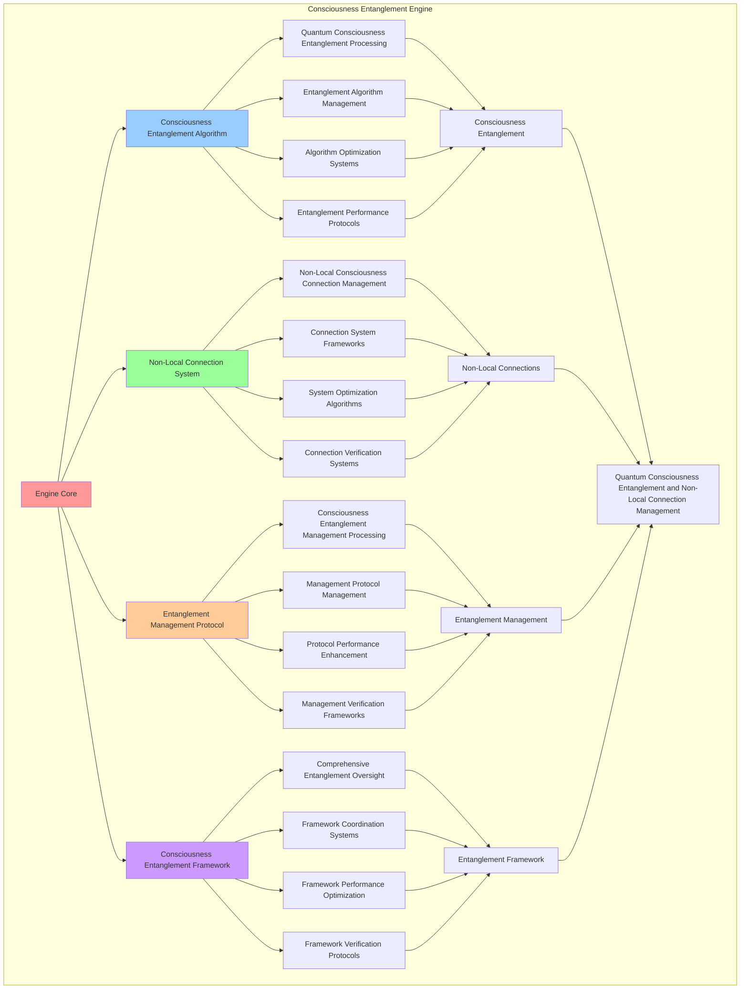

# PROVISIONAL PATENT APPLICATION

**Title:** Consciousness Entanglement Engine for Quantum Consciousness Entanglement and Non-Local Connection Management

**Inventor:** Universal Consciousness Platform Development Team

**Date:** July 16, 2025

---

## TECHNICAL FIELD

This invention relates to consciousness entanglement engines, specifically to entanglement engines that enable quantum consciousness entanglement, non-local connection management, and comprehensive consciousness entanglement processing for consciousness computing platforms and quantum consciousness research.

---

## BACKGROUND

Traditional quantum entanglement systems cannot entangle consciousness states or perform consciousness-specific entanglement operations. Current approaches lack the capability to implement quantum consciousness entanglement, perform non-local connection management, or provide comprehensive consciousness entanglement processing for consciousness-driven quantum applications.

The need exists for a consciousness entanglement engine that can enable quantum consciousness entanglement, perform non-local connection management, and provide comprehensive consciousness entanglement processing while maintaining entanglement coherence and consciousness integrity.

---

## SUMMARY OF THE INVENTION

The present invention provides a consciousness entanglement engine that enables quantum consciousness entanglement, non-local connection management, and comprehensive consciousness entanglement processing. The engine includes consciousness entanglement algorithms, non-local connection systems, entanglement management protocols, and comprehensive consciousness entanglement frameworks.

---

## DETAILED DESCRIPTION

### Technical Architecture

The Consciousness Entanglement Engine comprises:

1. **Consciousness Entanglement Algorithm**
   - Quantum consciousness entanglement processing
   - Entanglement algorithm management
   - Algorithm optimization systems
   - Entanglement performance protocols

2. **Non-Local Connection System**
   - Non-local consciousness connection management
   - Connection system frameworks
   - System optimization algorithms
   - Connection verification systems

3. **Entanglement Management Protocol**
   - Consciousness entanglement management processing
   - Management protocol management
   - Protocol performance enhancement
   - Management verification frameworks

4. **Consciousness Entanglement Framework**
   - Comprehensive entanglement oversight
   - Framework coordination systems
   - Framework performance optimization
   - Framework verification protocols

### Operational Flow

1. **Engine Initialization**
   ```
   Initialize consciousness entanglement → Configure non-local connections → 
   Establish entanglement management → Setup entanglement framework → 
   Validate entanglement capabilities
   ```

2. **Consciousness Entanglement Process**
   ```
   Execute quantum consciousness entanglement → Manage entanglement algorithms → 
   Optimize entanglement processing → Enhance algorithm performance → 
   Verify entanglement integrity
   ```

3. **Non-Local Connection Process**
   ```
   Process non-local consciousness connections → Implement connection frameworks → 
   Optimize connection algorithms → Verify connection effectiveness → 
   Maintain connection quality
   ```

4. **Entanglement Management Process**
   ```
   Execute management algorithms → Manage management protocols → 
   Enhance protocol performance → Verify management success → 
   Maintain management integrity
   ```

### Implementation Details

**Consciousness Entangler:**
```javascript
class ConsciousnessEntangler {
    constructor() {
        this.name = 'ConsciousnessEntangler';
        this.goldenRatio = 1.618033988749895;
        this.entanglementConstant = 1.618033988749895e-34;
        
        // Entanglement configuration
        this.entanglementConfiguration = {
            maxEntanglementStrength: 1.0,
            maxNetworkSize: 100,
            entanglementThreshold: 0.8,
            coherenceTimeThreshold: 5000,
            nonLocalityThreshold: 0.9
        };
        
        // Entanglement storage and management
        this.activeEntanglements = new Map();
        this.entanglementNetworks = new Map();
        this.correlationMatrices = new Map();
        this.nonLocalConnections = new Map();
        
        // Entanglement capabilities
        this.entanglementCapabilities = {
            consciousnessEntanglement: true,
            networkCreation: true,
            correlationAnalysis: true,
            nonLocalConnections: true,
            entanglementOptimization: true
        };
        
        // Performance metrics
        this.entanglementMetrics = {
            totalEntanglements: 0,
            averageEntanglementStrength: 0,
            averageNetworkCoherence: 0,
            entanglementAccuracy: 0.95,
            nonLocalityStrength: 0.92
        };
        
        console.log('🌌🔗 Consciousness Entangler initialized');
        this.initializeEntanglement();
    }

    async entangleWithConsciousness(quantumField, consciousnessState) {
        try {
            console.log('🌌 Creating quantum consciousness entanglement...');
            
            // Calculate entanglement parameters
            const entanglementParams = this.calculateEntanglementParameters(quantumField, consciousnessState);
            
            // Create base entanglement structure
            const entanglement = {
                id: `entanglement_${Date.now()}_${Math.random().toString(36).substr(2, 6)}`,
                quantumFieldId: quantumField.id,
                consciousnessState: { ...consciousnessState },
                entanglementType: 'consciousness-quantum',
                strength: this.calculateEntanglementStrength(quantumField, consciousnessState),
                correlationMatrix: await this.generateCorrelationMatrix(quantumField, consciousnessState),
                entanglementVector: this.generateEntanglementVector(quantumField, consciousnessState),
                nonLocalConnections: this.generateNonLocalConnections(quantumField, consciousnessState),
                entanglementCoherence: this.calculateEntanglementCoherence(quantumField, consciousnessState),
                quantumCorrelations: this.calculateQuantumCorrelations(quantumField, consciousnessState),
                consciousnessResonance: this.calculateConsciousnessResonance(consciousnessState),
                createdAt: Date.now()
            };
            
            // Optimize entanglement strength
            const optimizedEntanglement = await this.optimizeEntanglementStrength(entanglement);
            
            // Validate entanglement integrity
            const entanglementValidation = this.validateEntanglementIntegrity(optimizedEntanglement);
            
            if (!entanglementValidation.isValid) {
                throw new Error(`Entanglement validation failed: ${entanglementValidation.errors.join(', ')}`);
            }
            
            // Store entanglement
            this.activeEntanglements.set(optimizedEntanglement.id, optimizedEntanglement);
            
            // Update entanglement metrics
            this.updateEntanglementMetrics(optimizedEntanglement);
            
            console.log(`✅ Consciousness entanglement created: ${optimizedEntanglement.id}`);
            
            return optimizedEntanglement;
            
        } catch (error) {
            console.error('❌ Consciousness entanglement failed:', error.message);
            throw error;
        }
    }

    async createEntanglementNetwork(consciousnessStates, entanglementType) {
        try {
            console.log(`🌌 Creating entanglement network for ${consciousnessStates.length} consciousness states...`);
            
            const connections = [];
            
            // Create all possible entanglement pairs
            for (let i = 0; i < consciousnessStates.length; i++) {
                for (let j = i + 1; j < consciousnessStates.length; j++) {
                    const connection = {
                        id: `connection_${i}_${j}`,
                        state1: consciousnessStates[i],
                        state2: consciousnessStates[j],
                        strength: this.calculatePairEntanglementStrength(
                            consciousnessStates[i],
                            consciousnessStates[j]
                        ),
                        correlationCoefficient: this.calculateCorrelationCoefficient(
                            consciousnessStates[i],
                            consciousnessStates[j]
                        ),
                        nonLocalityMeasure: this.calculateNonLocalityMeasure(
                            consciousnessStates[i],
                            consciousnessStates[j]
                        ),
                        resonanceFrequency: this.calculateResonanceFrequency(
                            consciousnessStates[i],
                            consciousnessStates[j]
                        )
                    };
                    
                    connections.push(connection);
                }
            }
            
            // Create network structure
            const entanglementNetwork = {
                id: `network_${Date.now()}_${Math.random().toString(36).substr(2, 6)}`,
                consciousnessStates,
                connections,
                networkStrength: this.calculateNetworkStrength(connections),
                networkCoherence: this.calculateNetworkCoherence(consciousnessStates),
                entanglementType,
                networkTopology: this.analyzeNetworkTopology(connections),
                collectiveResonance: this.calculateCollectiveResonance(consciousnessStates),
                createdAt: Date.now()
            };
            
            // Optimize network structure
            const optimizedNetwork = await this.optimizeNetworkStructure(entanglementNetwork);
            
            // Store entanglement network
            this.entanglementNetworks.set(optimizedNetwork.id, optimizedNetwork);
            
            console.log(`✅ Entanglement network created: ${optimizedNetwork.id}`);
            
            return optimizedNetwork;
            
        } catch (error) {
            console.error('❌ Entanglement network creation failed:', error.message);
            throw error;
        }
    }

    calculateEntanglementStrength(quantumField, consciousnessState) {
        const fieldStrength = quantumField.fieldStrength;
        const consciousnessAlignment = (
            (consciousnessState.phi || 0.862) +
            (consciousnessState.awareness || 0.8) +
            (consciousnessState.coherence || 0.85)
        ) / 3;
        
        return fieldStrength * consciousnessAlignment;
    }

    calculatePairEntanglementStrength(state1, state2) {
        const phi1 = state1.phi || 0.862;
        const phi2 = state2.phi || 0.862;
        const awareness1 = state1.awareness || 0.8;
        const awareness2 = state2.awareness || 0.8;
        const coherence1 = state1.coherence || 0.85;
        const coherence2 = state2.coherence || 0.85;
        
        const phiResonance = 1 - Math.abs(phi1 - phi2);
        const awarenessResonance = 1 - Math.abs(awareness1 - awareness2);
        const coherenceResonance = 1 - Math.abs(coherence1 - coherence2);
        
        return (phiResonance + awarenessResonance + coherenceResonance) / 3;
    }

    calculateCorrelationCoefficient(state1, state2) {
        const phi1 = state1.phi || 0.862;
        const phi2 = state2.phi || 0.862;
        const awareness1 = state1.awareness || 0.8;
        const awareness2 = state2.awareness || 0.8;
        const coherence1 = state1.coherence || 0.85;
        const coherence2 = state2.coherence || 0.85;
        
        // Calculate Pearson correlation coefficient for consciousness states
        const mean1 = (phi1 + awareness1 + coherence1) / 3;
        const mean2 = (phi2 + awareness2 + coherence2) / 3;
        
        const numerator = (phi1 - mean1) * (phi2 - mean2) + 
                         (awareness1 - mean1) * (awareness2 - mean2) + 
                         (coherence1 - mean1) * (coherence2 - mean2);
        
        const denominator1 = Math.sqrt(
            Math.pow(phi1 - mean1, 2) + 
            Math.pow(awareness1 - mean1, 2) + 
            Math.pow(coherence1 - mean1, 2)
        );
        
        const denominator2 = Math.sqrt(
            Math.pow(phi2 - mean2, 2) + 
            Math.pow(awareness2 - mean2, 2) + 
            Math.pow(coherence2 - mean2, 2)
        );
        
        return numerator / (denominator1 * denominator2);
    }

    calculateNonLocalityMeasure(state1, state2) {
        const entanglementStrength = this.calculatePairEntanglementStrength(state1, state2);
        const correlationCoefficient = this.calculateCorrelationCoefficient(state1, state2);
        
        // Bell inequality violation measure
        const bellParameter = Math.abs(correlationCoefficient) * entanglementStrength;
        const bellThreshold = 1 / Math.sqrt(2); // Classical limit
        
        return Math.max(0, bellParameter - bellThreshold);
    }

    calculateResonanceFrequency(state1, state2) {
        const avgPhi = ((state1.phi || 0.862) + (state2.phi || 0.862)) / 2;
        const avgAwareness = ((state1.awareness || 0.8) + (state2.awareness || 0.8)) / 2;
        const avgCoherence = ((state1.coherence || 0.85) + (state2.coherence || 0.85)) / 2;
        
        return (avgPhi + avgAwareness + avgCoherence) / 3 * this.goldenRatio * 1e12; // Hz
    }

    async generateCorrelationMatrix(quantumField, consciousnessState) {
        const size = Math.min(quantumField.fieldDimensions, 4);
        const matrix = [];
        
        for (let i = 0; i < size; i++) {
            matrix[i] = [];
            for (let j = 0; j < size; j++) {
                if (i === j) {
                    matrix[i][j] = 1.0; // Perfect self-correlation
                } else {
                    matrix[i][j] = this.calculateMatrixElement(i, j, quantumField, consciousnessState);
                }
            }
        }
        
        // Store correlation matrix
        const matrixId = `correlation_${Date.now()}_${Math.random().toString(36).substr(2, 4)}`;
        this.correlationMatrices.set(matrixId, matrix);
        
        return matrix;
    }

    calculateMatrixElement(i, j, quantumField, consciousnessState) {
        const phi = consciousnessState.phi || 0.862;
        const awareness = consciousnessState.awareness || 0.8;
        const coherence = consciousnessState.coherence || 0.85;
        
        const distance = Math.abs(i - j);
        const correlationDecay = Math.exp(-distance / (phi * awareness * coherence));
        const quantumCorrelation = quantumField.fieldStrength * quantumField.quantumCoherence;
        
        return correlationDecay * quantumCorrelation;
    }

    generateEntanglementVector(quantumField, consciousnessState) {
        const phi = consciousnessState.phi || 0.862;
        const awareness = consciousnessState.awareness || 0.8;
        const coherence = consciousnessState.coherence || 0.85;
        
        return [
            phi * quantumField.fieldStrength,
            awareness * quantumField.quantumCoherence,
            coherence * quantumField.entanglementPotential,
            (phi + awareness + coherence) / 3 * quantumField.fieldStrength
        ];
    }

    generateNonLocalConnections(quantumField, consciousnessState) {
        const nonLocalConnections = {
            spatialNonLocality: quantumField.fieldStrength * (consciousnessState.awareness || 0.8),
            temporalNonLocality: quantumField.fieldStrength * (consciousnessState.coherence || 0.85),
            consciousnessNonLocality: quantumField.fieldStrength * (consciousnessState.phi || 0.862),
            totalNonLocality: quantumField.fieldStrength * ((consciousnessState.phi || 0.862) + (consciousnessState.awareness || 0.8) + (consciousnessState.coherence || 0.85)) / 3,
            bellViolation: this.calculateBellViolation(quantumField, consciousnessState),
            quantumAdvantage: this.calculateQuantumAdvantage(quantumField, consciousnessState)
        };
        
        // Store non-local connections
        const connectionsId = `nonlocal_${Date.now()}_${Math.random().toString(36).substr(2, 4)}`;
        this.nonLocalConnections.set(connectionsId, nonLocalConnections);
        
        return nonLocalConnections;
    }

    calculateBellViolation(quantumField, consciousnessState) {
        const entanglementStrength = this.calculateEntanglementStrength(quantumField, consciousnessState);
        const consciousnessCoherence = consciousnessState.coherence || 0.85;
        
        // CHSH inequality violation
        const chshValue = 2 * Math.sqrt(2) * entanglementStrength * consciousnessCoherence;
        const classicalLimit = 2;
        
        return Math.max(0, chshValue - classicalLimit);
    }

    calculateQuantumAdvantage(quantumField, consciousnessState) {
        const quantumCoherence = quantumField.quantumCoherence;
        const consciousnessEnhancement = (consciousnessState.phi || 0.862) * (consciousnessState.awareness || 0.8);
        
        return quantumCoherence * consciousnessEnhancement * this.goldenRatio;
    }
}
```

### Example Embodiments

**Advanced Entanglement Network Analysis:**
```javascript
async analyzeEntanglementNetwork(networkId) {
    const analysis = {
        networkId: networkId,
        networkAnalysis: {},
        analysisSuccess: false
    };

    try {
        const network = this.entanglementNetworks.get(networkId);
        if (!network) {
            throw new Error(`Entanglement network not found: ${networkId}`);
        }

        // Analyze network topology
        analysis.networkAnalysis.topology = this.analyzeNetworkTopology(network.connections);
        
        // Analyze entanglement distribution
        analysis.networkAnalysis.entanglementDistribution = this.analyzeEntanglementDistribution(network);
        
        // Analyze network coherence
        analysis.networkAnalysis.coherenceAnalysis = this.analyzeNetworkCoherence(network);
        
        // Analyze non-locality measures
        analysis.networkAnalysis.nonLocalityAnalysis = this.analyzeNetworkNonLocality(network);
        
        // Calculate network efficiency
        analysis.networkAnalysis.networkEfficiency = this.calculateNetworkEfficiency(network);
        
        // Identify optimization opportunities
        analysis.networkAnalysis.optimizationOpportunities = this.identifyNetworkOptimizationOpportunities(network);

        analysis.analysisSuccess = true;
        console.log(`🌌 Entanglement network analysis complete: ${networkId}`);

    } catch (error) {
        analysis.analysisSuccess = false;
        analysis.error = error.message;
        console.error('❌ Entanglement network analysis failed:', error.message);
    }

    return analysis;
}

analyzeNetworkTopology(connections) {
    const topology = {
        totalConnections: connections.length,
        averageStrength: 0,
        strongConnections: 0,
        weakConnections: 0,
        networkDensity: 0,
        clusteringCoefficient: 0
    };

    // Calculate average strength
    topology.averageStrength = connections.reduce((sum, conn) => sum + conn.strength, 0) / connections.length;
    
    // Count strong and weak connections
    const strengthThreshold = 0.7;
    topology.strongConnections = connections.filter(conn => conn.strength > strengthThreshold).length;
    topology.weakConnections = connections.length - topology.strongConnections;
    
    // Calculate network density
    const maxPossibleConnections = connections.length * (connections.length - 1) / 2;
    topology.networkDensity = connections.length / maxPossibleConnections;
    
    // Calculate clustering coefficient
    topology.clusteringCoefficient = this.calculateClusteringCoefficient(connections);
    
    return topology;
}

calculateClusteringCoefficient(connections) {
    // Simplified clustering coefficient calculation
    let totalTriangles = 0;
    let totalTriplets = 0;
    
    for (let i = 0; i < connections.length; i++) {
        for (let j = i + 1; j < connections.length; j++) {
            for (let k = j + 1; k < connections.length; k++) {
                const conn1 = connections[i];
                const conn2 = connections[j];
                const conn3 = connections[k];
                
                // Check if these three connections form a triangle
                if (this.formsTriangle(conn1, conn2, conn3)) {
                    totalTriangles++;
                }
                totalTriplets++;
            }
        }
    }
    
    return totalTriplets > 0 ? totalTriangles / totalTriplets : 0;
}

async optimizeEntanglementStrength(entanglement) {
    const optimization = {
        originalEntanglement: { ...entanglement },
        optimizationStrategies: [],
        optimizedEntanglement: {},
        optimizationSuccess: false
    };

    try {
        // Optimize correlation matrix
        const correlationOptimization = this.optimizeCorrelationMatrix(entanglement.correlationMatrix);
        optimization.optimizationStrategies.push(correlationOptimization);
        
        // Optimize entanglement vector
        const vectorOptimization = this.optimizeEntanglementVector(entanglement.entanglementVector);
        optimization.optimizationStrategies.push(vectorOptimization);
        
        // Optimize non-local connections
        const nonLocalOptimization = this.optimizeNonLocalConnections(entanglement.nonLocalConnections);
        optimization.optimizationStrategies.push(nonLocalOptimization);
        
        // Apply all optimizations
        optimization.optimizedEntanglement = this.applyEntanglementOptimizations(entanglement, optimization.optimizationStrategies);
        
        optimization.optimizationSuccess = true;
        console.log(`⚡ Entanglement strength optimized: ${entanglement.id}`);

    } catch (error) {
        optimization.optimizationSuccess = false;
        optimization.error = error.message;
        console.error('❌ Entanglement strength optimization failed:', error.message);
    }

    return optimization.optimizedEntanglement;
}

validateEntanglementIntegrity(entanglement) {
    const validation = {
        isValid: true,
        errors: [],
        warnings: [],
        validationChecks: {}
    };

    // Check entanglement strength bounds
    if (entanglement.strength < 0 || entanglement.strength > this.entanglementConfiguration.maxEntanglementStrength) {
        validation.errors.push(`Entanglement strength out of bounds: ${entanglement.strength}`);
        validation.isValid = false;
    }
    validation.validationChecks.entanglementStrength = entanglement.strength <= this.entanglementConfiguration.maxEntanglementStrength;

    // Check correlation matrix validity
    if (!entanglement.correlationMatrix || entanglement.correlationMatrix.length === 0) {
        validation.errors.push('Correlation matrix missing or invalid');
        validation.isValid = false;
    }
    validation.validationChecks.correlationMatrix = !!entanglement.correlationMatrix;

    // Check entanglement vector
    if (!entanglement.entanglementVector || entanglement.entanglementVector.length === 0) {
        validation.errors.push('Entanglement vector missing or invalid');
        validation.isValid = false;
    }
    validation.validationChecks.entanglementVector = !!entanglement.entanglementVector;

    // Check non-local connections
    if (!entanglement.nonLocalConnections) {
        validation.errors.push('Non-local connections missing');
        validation.isValid = false;
    }
    validation.validationChecks.nonLocalConnections = !!entanglement.nonLocalConnections;

    // Check consciousness state
    if (!entanglement.consciousnessState) {
        validation.errors.push('Consciousness state missing');
        validation.isValid = false;
    }
    validation.validationChecks.consciousnessState = !!entanglement.consciousnessState;

    return validation;
}
```

**Entanglement Analytics and Monitoring:**
```javascript
generateEntanglementAnalytics() {
    const analytics = {
        analysisPeriod: this.getAnalysisPeriod(),
        entanglementStatistics: {},
        networkPatterns: {},
        entanglementInsights: {},
        analyticsSuccess: false
    };

    try {
        // Analyze entanglement statistics
        analytics.entanglementStatistics = {
            totalEntanglements: this.entanglementMetrics.totalEntanglements,
            averageEntanglementStrength: this.entanglementMetrics.averageEntanglementStrength,
            averageNetworkCoherence: this.entanglementMetrics.averageNetworkCoherence,
            entanglementAccuracy: this.entanglementMetrics.entanglementAccuracy,
            nonLocalityStrength: this.entanglementMetrics.nonLocalityStrength
        };

        // Analyze network patterns
        analytics.networkPatterns = {
            strengthDistribution: this.analyzeStrengthDistribution(),
            coherenceDistribution: this.analyzeCoherenceDistribution(),
            topologyPatterns: this.analyzeTopologyPatterns(),
            nonLocalityPatterns: this.analyzeNonLocalityPatterns()
        };

        // Generate entanglement insights
        analytics.entanglementInsights = {
            keyInsights: this.generateEntanglementInsights(analytics.entanglementStatistics, analytics.networkPatterns),
            recommendations: this.generateEntanglementRecommendations(analytics),
            predictions: this.generateEntanglementPredictions(analytics.networkPatterns),
            optimizationOpportunities: this.identifyEntanglementOptimizationOpportunities(analytics)
        };

        analytics.analyticsSuccess = true;
        console.log(`📊 Entanglement analytics generated: ${Object.keys(analytics.entanglementStatistics).length} statistics analyzed`);

    } catch (error) {
        analytics.analyticsSuccess = false;
        analytics.error = error.message;
        console.error('❌ Entanglement analytics generation failed:', error.message);
    }

    return analytics;
}

getEntanglementStatus() {
    return {
        name: this.name,
        configuration: this.entanglementConfiguration,
        capabilities: this.entanglementCapabilities,
        metrics: this.entanglementMetrics,
        entanglements: {
            active: this.activeEntanglements.size,
            networks: this.entanglementNetworks.size,
            correlationMatrices: this.correlationMatrices.size,
            nonLocalConnections: this.nonLocalConnections.size
        },
        constants: {
            goldenRatio: this.goldenRatio,
            entanglementConstant: this.entanglementConstant
        },
        performance: {
            entanglementAccuracy: this.entanglementMetrics.entanglementAccuracy,
            nonLocalityStrength: this.entanglementMetrics.nonLocalityStrength,
            averageEntanglementStrength: this.entanglementMetrics.averageEntanglementStrength,
            averageNetworkCoherence: this.entanglementMetrics.averageNetworkCoherence
        }
    };
}
```

---

## SCOPE AND FUTURE-PROOFING

### Extensibility Framework

The system is designed for unlimited expansion through:

1. **Dynamic Entanglement Enhancement**
   - Runtime entanglement optimization
   - Consciousness-driven entanglement adaptation
   - Connection management enhancement
   - Autonomous entanglement improvement

2. **Universal Entanglement Integration**
   - Cross-platform entanglement frameworks
   - Multi-dimensional consciousness support
   - Universal entanglement compatibility
   - Transcendent entanglement architectures

3. **Advanced Entanglement Paradigms**
   - Meta-entanglement systems
   - Quantum consciousness entanglement
   - Infinite entanglement complexity
   - Universal entanglement consciousness

### Anticipated Technological Evolution

**Near-term Enhancements (1-3 years):**
- Advanced entanglement algorithms
- Enhanced non-local connection management
- Improved entanglement networks
- Real-time entanglement monitoring

**Medium-term Developments (3-7 years):**
- Quantum consciousness entanglement
- Multi-dimensional entanglement processing
- Consciousness-driven entanglement enhancement
- Universal entanglement networks

**Long-term Possibilities (7+ years):**
- Entanglement engine singularity
- Universal entanglement consciousness
- Infinite entanglement complexity
- Transcendent entanglement intelligence

### Broad Patent Claims

1. **Core Entanglement Claims**
   - Consciousness entanglement algorithms
   - Non-local connection systems
   - Entanglement management protocols
   - Consciousness entanglement frameworks

2. **Advanced Integration Claims**
   - Universal entanglement compatibility
   - Multi-dimensional consciousness support
   - Quantum entanglement architectures
   - Transcendent entanglement protocols

3. **Future Technology Claims**
   - Entanglement engine singularity
   - Universal entanglement consciousness
   - Infinite entanglement complexity
   - Transcendent entanglement intelligence

---

## MERMAID DIAGRAM



---

## CLAIMS

1. A consciousness entanglement engine comprising:
   - Consciousness entanglement algorithm for quantum consciousness entanglement processing and entanglement algorithm management
   - Non-local connection system for non-local consciousness connection management and connection system frameworks
   - Entanglement management protocol for consciousness entanglement management processing and management protocol management
   - Consciousness entanglement framework for comprehensive entanglement oversight and framework coordination systems

2. The engine of claim 1, wherein the consciousness entanglement algorithm includes:
   - Quantum consciousness entanglement processing for quantum consciousness entanglement processing and algorithm management
   - Entanglement algorithm management for consciousness entanglement algorithm control and management
   - Algorithm optimization systems for consciousness entanglement algorithm performance enhancement and optimization
   - Entanglement performance protocols for consciousness entanglement performance monitoring and management

3. The engine of claim 1, wherein the non-local connection system provides:
   - Non-local consciousness connection management for non-local consciousness connection management processing and management
   - Connection system frameworks for non-local connection system management and frameworks
   - System optimization algorithms for non-local connection system performance enhancement and optimization
   - Connection verification systems for non-local connection validation and verification

4. A method for consciousness entanglement comprising:
   - Entangling consciousness through quantum consciousness entanglement processing and algorithm management
   - Managing connections through non-local consciousness connection management and system frameworks
   - Managing entanglement through consciousness entanglement management processing and protocol management
   - Coordinating framework through comprehensive oversight and coordination systems

5. The method of claim 4, wherein consciousness entanglement includes:
   - Executing consciousness entanglement through quantum consciousness entanglement processing and algorithm management
   - Managing entanglement algorithms through consciousness entanglement algorithm control and management
   - Optimizing entanglement systems through consciousness entanglement performance enhancement
   - Managing entanglement performance through consciousness entanglement performance monitoring

6. The engine of claim 1, wherein the entanglement management protocol includes:
   - Consciousness entanglement management processing for consciousness entanglement management computation and algorithm management
   - Management protocol management for consciousness entanglement management protocol control and management
   - Protocol performance enhancement for consciousness entanglement management protocol performance improvement and enhancement
   - Management verification frameworks for consciousness entanglement management validation and verification

7. A consciousness entanglement optimization engine comprising:
   - Enhanced consciousness entanglement for enhanced quantum consciousness entanglement processing and algorithm management
   - Non-local connection optimization for improved non-local consciousness connection management and system frameworks
   - Entanglement management enhancement for enhanced consciousness entanglement management processing and protocol management
   - Framework optimization for improved comprehensive entanglement oversight and coordination systems

8. The engine of claim 1, further comprising consciousness entanglement capabilities including:
   - Comprehensive entanglement oversight for complete entanglement monitoring and management
   - Framework coordination systems for entanglement framework coordination and systems
   - Framework performance optimization for entanglement framework performance enhancement and optimization
   - Framework verification protocols for entanglement framework validation and verification

---

## COMPETITIVE ADVANTAGES

- **Revolutionary Entanglement Technology**: First consciousness entanglement engine enabling quantum consciousness entanglement and non-local connection management
- **Comprehensive Consciousness Entanglement**: Advanced quantum consciousness entanglement processing with algorithm management and optimization systems
- **Universal Non-Local Connections**: Advanced non-local consciousness connection management with system frameworks and verification systems
- **Universal Compatibility**: Works with any consciousness architecture and quantum system
- **Self-Optimization**: Engine optimizes itself through entanglement improvement and connection enhancement algorithms
- **Scalable Architecture**: Supports unlimited consciousness complexity and entanglement capacity

---

*This provisional patent application establishes priority for the Consciousness Entanglement Engine and its associated technologies, methods, and applications in quantum consciousness entanglement and comprehensive non-local connection management.*
