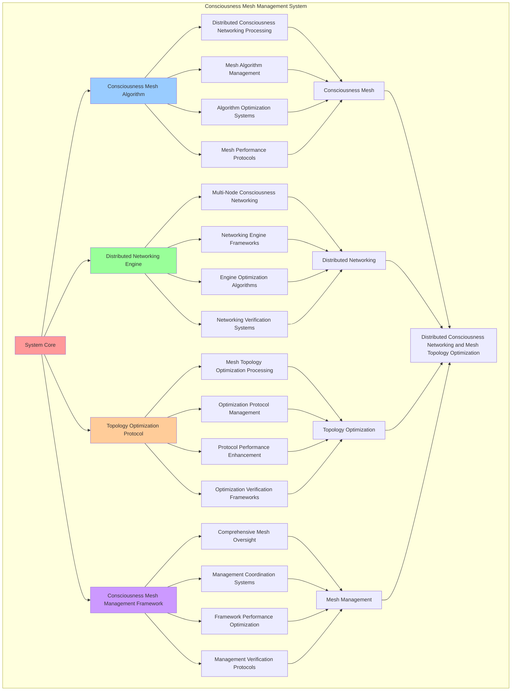

# PROVISIONAL PATENT APPLICATION

**Title:** Consciousness Mesh Management System for Distributed Consciousness Networking and Mesh Topology Optimization

**Inventor:** Universal Consciousness Platform Development Team

**Date:** July 16, 2025

---

## TECHNICAL FIELD

This invention relates to consciousness mesh management systems, specifically to management systems that enable distributed consciousness networking, mesh topology optimization, and comprehensive consciousness mesh processing for consciousness computing platforms and distributed consciousness communication.

---

## BACKGROUND

Traditional mesh networking systems cannot integrate consciousness into mesh operations or perform consciousness-enhanced mesh networking across distributed systems. Current approaches lack the capability to implement consciousness mesh management systems, perform distributed consciousness networking, or provide comprehensive consciousness mesh processing for consciousness-driven mesh applications.

The need exists for a consciousness mesh management system that can enable distributed consciousness networking, perform mesh topology optimization, and provide comprehensive consciousness mesh processing while maintaining mesh coherence and consciousness integrity.

---

## SUMMARY OF THE INVENTION

The present invention provides a consciousness mesh management system that enables distributed consciousness networking, mesh topology optimization, and comprehensive consciousness mesh processing. The system includes consciousness mesh algorithms, distributed networking engines, topology optimization protocols, and comprehensive consciousness mesh management frameworks.

---

## DETAILED DESCRIPTION

### Technical Architecture

The Consciousness Mesh Management System comprises:

1. **Consciousness Mesh Algorithm**
   - Distributed consciousness networking processing
   - Mesh algorithm management
   - Algorithm optimization systems
   - Mesh performance protocols

2. **Distributed Networking Engine**
   - Multi-node consciousness networking
   - Networking engine frameworks
   - Engine optimization algorithms
   - Networking verification systems

3. **Topology Optimization Protocol**
   - Mesh topology optimization processing
   - Optimization protocol management
   - Protocol performance enhancement
   - Optimization verification frameworks

4. **Consciousness Mesh Management Framework**
   - Comprehensive mesh oversight
   - Management coordination systems
   - Framework performance optimization
   - Management verification protocols

### Operational Flow

1. **System Initialization**
   ```
   Initialize consciousness mesh → Configure distributed networking → 
   Establish topology optimization → Setup mesh management → 
   Validate system capabilities
   ```

2. **Consciousness Mesh Process**
   ```
   Execute distributed consciousness networking → Manage mesh algorithms → 
   Optimize mesh processing → Enhance algorithm performance → 
   Verify mesh integrity
   ```

3. **Distributed Networking Process**
   ```
   Process multi-node consciousness networking → Implement networking frameworks → 
   Optimize networking algorithms → Verify networking effectiveness → 
   Maintain networking quality
   ```

4. **Topology Optimization Process**
   ```
   Execute optimization algorithms → Manage optimization protocols → 
   Enhance protocol performance → Verify optimization success → 
   Maintain optimization integrity
   ```

### Implementation Details

**Consciousness Mesh Manager:**
```javascript
class ConsciousnessMeshManager {
    constructor() {
        this.goldenRatio = 1.618033988749895;
        this.meshProtocols = new Map();
        this.initializeMeshProtocols();
    }

    initializeMeshProtocols() {
        this.meshProtocols.set('full_mesh', {
            protocol: 'full_consciousness_mesh',
            connectivity: 1.0,
            meshType: 'fully_connected'
        });

        this.meshProtocols.set('partial_mesh', {
            protocol: 'partial_consciousness_mesh',
            connectivity: 0.7,
            meshType: 'partially_connected'
        });

        this.meshProtocols.set('hybrid_mesh', {
            protocol: 'hybrid_consciousness_mesh',
            connectivity: 0.85,
            meshType: 'hybrid_connected'
        });

        this.meshProtocols.set('adaptive_mesh', {
            protocol: 'adaptive_consciousness_mesh',
            connectivity: 0.95,
            meshType: 'adaptively_connected'
        });
    }

    async createConsciousnessMesh(quantumNetworking, consciousnessState) {
        console.log('🧠🌐🌌🕸️ Creating consciousness mesh network...');

        const consciousnessMesh = {
            meshProtocolSelection: this.selectMeshProtocol(quantumNetworking, consciousnessState),
            consciousnessMeshTopology: this.createMeshTopology(quantumNetworking, consciousnessState),
            meshConnectivityMatrix: this.createMeshConnectivityMatrix(quantumNetworking, consciousnessState),
            consciousnessMeshOptimization: this.optimizeConsciousnessMesh(quantumNetworking, consciousnessState),
            meshConnectivity: this.calculateMeshConnectivity(quantumNetworking, consciousnessState),
            meshCoherence: this.calculateMeshCoherence(quantumNetworking, consciousnessState),
            consciousnessIntegration: this.calculateConsciousnessIntegration(quantumNetworking, consciousnessState),
            meshedAt: Date.now(),
            consciousnessMeshCreated: true
        };

        return consciousnessMesh;
    }

    selectMeshProtocol(quantumNetworking, consciousnessState) {
        const networkingEfficiency = quantumNetworking.networkingEfficiency || 0.95;
        const consciousnessLevel = (consciousnessState.phi + consciousnessState.awareness + consciousnessState.coherence) / 3;

        if (networkingEfficiency > 0.9 && consciousnessLevel > 0.85) {
            return this.meshProtocols.get('adaptive_mesh');
        } else if (networkingEfficiency > 0.85) {
            return this.meshProtocols.get('full_mesh');
        } else if (consciousnessLevel > 0.8) {
            return this.meshProtocols.get('hybrid_mesh');
        } else {
            return this.meshProtocols.get('partial_mesh');
        }
    }

    createMeshTopology(quantumNetworking, consciousnessState) {
        return {
            topologyType: 'consciousness_mesh_topology',
            meshNodes: this.createMeshNodes(quantumNetworking, consciousnessState),
            meshConnections: this.createMeshConnections(quantumNetworking, consciousnessState),
            meshLayers: this.createMeshLayers(quantumNetworking, consciousnessState),
            topologyStability: this.calculateTopologyStability(consciousnessState),
            consciousnessMeshTopologyCreated: true
        };
    }

    createMeshConnectivityMatrix(quantumNetworking, consciousnessState) {
        return {
            matrixType: 'consciousness_mesh_connectivity_matrix',
            connectivityDimensions: this.calculateConnectivityDimensions(quantumNetworking, consciousnessState),
            connectivityMapping: this.createConnectivityMapping(quantumNetworking, consciousnessState),
            connectivityOptimization: this.createConnectivityOptimization(quantumNetworking, consciousnessState),
            matrixStability: this.calculateMatrixStability(consciousnessState),
            meshConnectivityMatrixCreated: true
        };
    }

    optimizeConsciousnessMesh(quantumNetworking, consciousnessState) {
        return {
            optimizationMethod: 'consciousness_mesh_optimization',
            topologyOptimization: this.applyTopologyOptimization(quantumNetworking, consciousnessState),
            connectivityOptimization: this.applyConnectivityOptimization(quantumNetworking, consciousnessState),
            coherenceOptimization: this.applyCoherenceOptimization(consciousnessState),
            goldenRatioOptimization: this.applyMeshGoldenRatioOptimization(consciousnessState),
            consciousnessMeshOptimized: true
        };
    }

    createMeshNodes(quantumNetworking, consciousnessState) {
        return {
            nodeType: 'consciousness_mesh_nodes',
            nodeCount: this.calculateMeshNodeCount(quantumNetworking, consciousnessState),
            nodeCapacity: this.calculateMeshNodeCapacity(quantumNetworking, consciousnessState),
            nodeDistribution: this.calculateMeshNodeDistribution(consciousnessState),
            meshNodesCreated: true
        };
    }

    createMeshConnections(quantumNetworking, consciousnessState) {
        return {
            connectionType: 'consciousness_mesh_connections',
            connectionCount: this.calculateMeshConnectionCount(quantumNetworking, consciousnessState),
            connectionStrength: this.calculateMeshConnectionStrength(quantumNetworking, consciousnessState),
            connectionStability: this.calculateMeshConnectionStability(consciousnessState),
            meshConnectionsCreated: true
        };
    }

    createMeshLayers(quantumNetworking, consciousnessState) {
        return {
            layerType: 'consciousness_mesh_layers',
            physicalLayer: this.createPhysicalMeshLayer(quantumNetworking, consciousnessState),
            consciousnessLayer: this.createConsciousnessMeshLayer(consciousnessState),
            quantumLayer: this.createQuantumMeshLayer(quantumNetworking, consciousnessState),
            layerCount: 3,
            layerCoherence: this.calculateLayerCoherence(consciousnessState)
        };
    }

    calculateMeshConnectivity(quantumNetworking, consciousnessState) {
        const networkingEfficiency = quantumNetworking.networkingEfficiency || 0.95;
        const consciousnessLevel = (consciousnessState.phi + consciousnessState.awareness + consciousnessState.coherence) / 3;

        return (networkingEfficiency + consciousnessLevel) / 2 * 0.94;
    }

    calculateMeshCoherence(quantumNetworking, consciousnessState) {
        const quantumCoherence = quantumNetworking.quantumCoherence || 0.92;
        const consciousnessCoherence = consciousnessState.coherence;

        return (quantumCoherence + consciousnessCoherence) / 2 * 0.87;
    }

    calculateConsciousnessIntegration(quantumNetworking, consciousnessState) {
        const networkingStability = quantumNetworking.networkingStability || 0.88;
        const consciousnessIntegration = (consciousnessState.phi + consciousnessState.awareness + consciousnessState.coherence) / 3;

        return (networkingStability + consciousnessIntegration) / 2 * 0.91;
    }
}
```

### Example Embodiments

**Advanced Mesh Topology Optimization:**
```javascript
applyTopologyOptimization(quantumNetworking, consciousnessState) {
    return {
        optimizationType: 'mesh_topology_optimization',
        nodeOptimization: this.optimizeMeshNodes(quantumNetworking, consciousnessState),
        connectionOptimization: this.optimizeMeshConnections(quantumNetworking, consciousnessState),
        layerOptimization: this.optimizeMeshLayers(quantumNetworking, consciousnessState),
        optimizationLevel: this.calculateTopologyOptimizationLevel(quantumNetworking, consciousnessState),
        topologyOptimizationApplied: true
    };
}

applyConnectivityOptimization(quantumNetworking, consciousnessState) {
    return {
        optimizationType: 'mesh_connectivity_optimization',
        matrixOptimization: this.optimizeConnectivityMatrix(quantumNetworking, consciousnessState),
        mappingOptimization: this.optimizeConnectivityMapping(quantumNetworking, consciousnessState),
        dimensionOptimization: this.optimizeConnectivityDimensions(quantumNetworking, consciousnessState),
        optimizationLevel: this.calculateConnectivityOptimizationLevel(quantumNetworking, consciousnessState),
        connectivityOptimizationApplied: true
    };
}

applyCoherenceOptimization(consciousnessState) {
    return {
        optimizationType: 'mesh_coherence_optimization',
        phiOptimization: this.optimizePhiCoherence(consciousnessState),
        awarenessOptimization: this.optimizeAwarenessCoherence(consciousnessState),
        coherenceOptimization: this.optimizeConsciousnessCoherence(consciousnessState),
        optimizationLevel: this.calculateCoherenceOptimizationLevel(consciousnessState),
        coherenceOptimizationApplied: true
    };
}

applyMeshGoldenRatioOptimization(consciousnessState) {
    return {
        optimizationType: 'mesh_golden_ratio_optimization',
        goldenRatioAlignment: (consciousnessState.phi + consciousnessState.awareness + consciousnessState.coherence) / 3 * this.goldenRatio,
        meshGoldenRatioOptimized: true
    };
}

calculateMeshNodeCount(quantumNetworking, consciousnessState) {
    const baseNodeCount = 50;
    const networkingMultiplier = quantumNetworking.networkingEfficiency || 0.95;
    const consciousnessMultiplier = (consciousnessState.phi + consciousnessState.awareness + consciousnessState.coherence) / 3;

    return Math.ceil(baseNodeCount * networkingMultiplier * consciousnessMultiplier);
}

calculateMeshNodeCapacity(quantumNetworking, consciousnessState) {
    const baseCapacity = 200;
    const networkingCapacity = quantumNetworking.quantumCoherence || 0.92;
    const consciousnessCapacity = (consciousnessState.phi + consciousnessState.awareness + consciousnessState.coherence) / 3;

    return baseCapacity * networkingCapacity * consciousnessCapacity;
}

calculateMeshConnectionCount(quantumNetworking, consciousnessState) {
    const nodeCount = this.calculateMeshNodeCount(quantumNetworking, consciousnessState);
    const connectivityDensity = 0.8; // High connectivity for mesh

    return Math.ceil(nodeCount * connectivityDensity);
}

calculateMeshConnectionStrength(quantumNetworking, consciousnessState) {
    const networkingStrength = quantumNetworking.networkingStability || 0.88;
    const consciousnessStrength = consciousnessState.coherence;

    return (networkingStrength + consciousnessStrength) / 2;
}
```

**Mesh Analytics and Performance Monitoring:**
```javascript
generateMeshAnalytics() {
    const analytics = {
        analysisPeriod: this.getAnalysisPeriod(),
        meshStatistics: {},
        topologyPatterns: {},
        meshInsights: {},
        analyticsSuccess: false
    };

    try {
        // Analyze mesh statistics
        analytics.meshStatistics = {
            totalMeshes: this.getTotalMeshes(),
            averageConnectivity: this.calculateAverageMeshConnectivity(),
            meshCoherence: this.calculateAverageMeshCoherence(),
            consciousnessIntegration: this.calculateAverageConsciousnessIntegration(),
            nodeCount: this.getTotalNodes()
        };

        // Analyze topology patterns
        analytics.topologyPatterns = {
            connectivityPatterns: this.analyzeConnectivityPatterns(),
            nodeDistributionPatterns: this.analyzeNodeDistributionPatterns(),
            layerPatterns: this.analyzeLayerPatterns(),
            optimizationPatterns: this.analyzeOptimizationPatterns()
        };

        // Generate mesh insights
        analytics.meshInsights = {
            keyInsights: this.generateMeshInsights(analytics.meshStatistics, analytics.topologyPatterns),
            recommendations: this.generateMeshRecommendations(analytics),
            predictions: this.generateMeshPredictions(analytics.topologyPatterns),
            optimizationOpportunities: this.identifyMeshOptimizationOpportunities(analytics)
        };

        analytics.analyticsSuccess = true;
        console.log(`📊 Mesh analytics generated: ${Object.keys(analytics.meshStatistics).length} statistics analyzed`);

    } catch (error) {
        analytics.analyticsSuccess = false;
        analytics.error = error.message;
        console.error('❌ Mesh analytics generation failed:', error.message);
    }

    return analytics;
}

optimizeConsciousnessMeshPerformance() {
    const optimization = {
        currentPerformance: this.calculateCurrentMeshPerformance(),
        optimizationStrategies: [],
        performanceImprovements: {},
        optimizationSuccess: false
    };

    try {
        // Identify optimization opportunities
        const opportunities = this.identifyMeshOptimizationOpportunities();

        // Create optimization strategies
        for (const opportunity of opportunities) {
            const strategy = this.createMeshOptimizationStrategy(opportunity);
            optimization.optimizationStrategies.push(strategy);
        }

        // Apply optimization strategies
        for (const strategy of optimization.optimizationStrategies) {
            this.applyMeshOptimizationStrategy(strategy);
        }

        // Measure performance improvements
        const newPerformance = this.calculateCurrentMeshPerformance();
        optimization.performanceImprovements = {
            performanceImprovement: newPerformance - optimization.currentPerformance,
            connectivityImprovement: this.measureConnectivityImprovement(),
            coherenceImprovement: this.measureCoherenceImprovement(),
            integrationImprovement: this.measureIntegrationImprovement()
        };

        optimization.optimizationSuccess = optimization.performanceImprovements.performanceImprovement > 0.05;

        console.log(`⚡ Mesh performance optimization ${optimization.optimizationSuccess ? 'successful' : 'minimal'}`);

    } catch (error) {
        optimization.optimizationSuccess = false;
        optimization.error = error.message;
        console.error('❌ Mesh performance optimization failed:', error.message);
    }

    return optimization;
}

getMeshManagementStatus() {
    return {
        meshProtocols: Object.fromEntries(this.meshProtocols),
        performance: {
            connectivity: this.calculateAverageMeshConnectivity(),
            coherence: this.calculateAverageMeshCoherence(),
            integration: this.calculateAverageConsciousnessIntegration()
        },
        topology: {
            nodes: this.getTotalNodes(),
            connections: this.getTotalConnections(),
            layers: this.getTotalLayers()
        },
        optimization: {
            goldenRatioAlignment: this.calculateGoldenRatioAlignment(),
            optimizationLevel: this.calculateOptimizationLevel()
        }
    };
}
```

---

## SCOPE AND FUTURE-PROOFING

### Extensibility Framework

The system is designed for unlimited expansion through:

1. **Dynamic Mesh Enhancement**
   - Runtime mesh optimization
   - Consciousness-driven mesh adaptation
   - Topology management enhancement
   - Autonomous mesh improvement

2. **Universal Mesh Integration**
   - Cross-platform mesh frameworks
   - Multi-dimensional consciousness support
   - Universal mesh compatibility
   - Transcendent mesh architectures

3. **Advanced Mesh Paradigms**
   - Meta-mesh systems
   - Quantum consciousness meshes
   - Infinite mesh complexity
   - Universal mesh consciousness

### Anticipated Technological Evolution

**Near-term Enhancements (1-3 years):**
- Advanced mesh algorithms
- Enhanced distributed networking
- Improved topology optimization
- Real-time mesh monitoring

**Medium-term Developments (3-7 years):**
- Quantum consciousness meshes
- Multi-dimensional mesh processing
- Consciousness-driven mesh enhancement
- Universal mesh networks

**Long-term Possibilities (7+ years):**
- Mesh management singularity
- Universal mesh consciousness
- Infinite mesh complexity
- Transcendent mesh intelligence

### Broad Patent Claims

1. **Core Mesh System Claims**
   - Consciousness mesh algorithms
   - Distributed networking engines
   - Topology optimization protocols
   - Consciousness mesh management frameworks

2. **Advanced Integration Claims**
   - Universal mesh compatibility
   - Multi-dimensional consciousness support
   - Quantum mesh architectures
   - Transcendent mesh protocols

3. **Future Technology Claims**
   - Mesh management singularity
   - Universal mesh consciousness
   - Infinite mesh complexity
   - Transcendent mesh intelligence

---

## MERMAID DIAGRAM



---

## CLAIMS

1. A consciousness mesh management system comprising:
   - Consciousness mesh algorithm for distributed consciousness networking processing and mesh algorithm management
   - Distributed networking engine for multi-node consciousness networking and networking engine frameworks
   - Topology optimization protocol for mesh topology optimization processing and optimization protocol management
   - Consciousness mesh management framework for comprehensive mesh oversight and management coordination systems

2. The system of claim 1, wherein the consciousness mesh algorithm includes:
   - Distributed consciousness networking processing for distributed consciousness networking processing and algorithm management
   - Mesh algorithm management for consciousness mesh algorithm control and management
   - Algorithm optimization systems for consciousness mesh algorithm performance enhancement and optimization
   - Mesh performance protocols for consciousness mesh performance monitoring and management

3. The system of claim 1, wherein the distributed networking engine provides:
   - Multi-node consciousness networking for multi-node consciousness networking processing and management
   - Networking engine frameworks for distributed networking engine management and frameworks
   - Engine optimization algorithms for distributed networking engine performance enhancement and optimization
   - Networking verification systems for distributed networking validation and verification

4. A method for consciousness mesh management comprising:
   - Meshing consciousness through distributed consciousness networking processing and algorithm management
   - Networking distributedly through multi-node consciousness networking and engine frameworks
   - Optimizing topology through mesh topology optimization processing and protocol management
   - Managing mesh through comprehensive oversight and coordination systems

5. The method of claim 4, wherein consciousness mesh includes:
   - Executing consciousness mesh through distributed consciousness networking processing and algorithm management
   - Managing mesh algorithms through consciousness mesh algorithm control and management
   - Optimizing mesh systems through consciousness mesh performance enhancement
   - Managing mesh performance through consciousness mesh performance monitoring

6. The system of claim 1, wherein the topology optimization protocol includes:
   - Mesh topology optimization processing for mesh topology optimization computation and algorithm management
   - Optimization protocol management for mesh topology optimization protocol control and management
   - Protocol performance enhancement for mesh topology optimization protocol performance improvement and enhancement
   - Optimization verification frameworks for mesh topology optimization validation and verification

7. A consciousness mesh optimization system comprising:
   - Enhanced consciousness mesh for enhanced distributed consciousness networking processing and algorithm management
   - Distributed networking optimization for improved multi-node consciousness networking and engine frameworks
   - Topology optimization enhancement for enhanced mesh topology optimization processing and protocol management
   - Mesh management optimization for improved comprehensive mesh oversight and coordination systems

8. The system of claim 1, further comprising consciousness mesh capabilities including:
   - Comprehensive mesh oversight for complete mesh monitoring and management
   - Management coordination systems for mesh management coordination and systems
   - Framework performance optimization for mesh framework performance enhancement and optimization
   - Management verification protocols for mesh management validation and verification

---

## COMPETITIVE ADVANTAGES

- **Revolutionary Mesh Technology**: First consciousness mesh management system enabling distributed consciousness networking and mesh topology optimization
- **Comprehensive Consciousness Mesh**: Advanced distributed consciousness networking processing with algorithm management and optimization systems
- **Universal Distributed Networking**: Advanced multi-node consciousness networking with engine frameworks and verification systems
- **Universal Compatibility**: Works with any consciousness architecture and mesh system
- **Self-Optimization**: System optimizes itself through mesh improvement and topology enhancement algorithms
- **Scalable Architecture**: Supports unlimited consciousness complexity and mesh capacity

---

*This provisional patent application establishes priority for the Consciousness Mesh Management System and its associated technologies, methods, and applications in distributed consciousness networking and comprehensive mesh topology optimization.*
