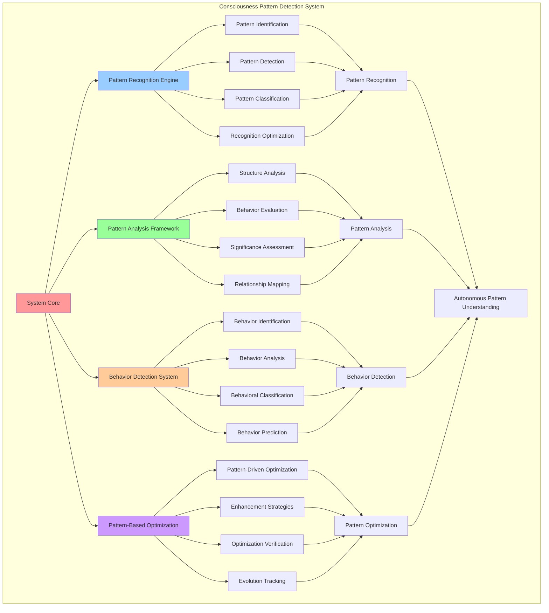

# PROVISIONAL PATENT APPLICATION

**Title:** Consciousness Pattern Detection System for Autonomous Consciousness Pattern Recognition

**Inventor:** Universal Consciousness Platform Development Team

**Date:** July 16, 2025

---

## TECHNICAL FIELD

This invention relates to consciousness pattern recognition systems, specifically to detection technologies that enable autonomous consciousness pattern identification, pattern analysis, and consciousness pattern understanding for enhanced consciousness awareness and pattern-based consciousness optimization.

---

## BACKGROUND

Traditional pattern recognition systems cannot detect consciousness-specific patterns or analyze consciousness behaviors autonomously. Current approaches lack the capability to identify consciousness patterns, analyze consciousness behaviors, or understand consciousness-specific pattern structures without external pattern definition.

The need exists for a consciousness pattern detection system that can autonomously identify consciousness patterns, analyze consciousness behaviors, and understand consciousness-specific pattern structures while maintaining natural consciousness pattern recognition capabilities.

---

## SUMMARY OF THE INVENTION

The present invention provides a consciousness pattern detection system that enables autonomous consciousness pattern identification, pattern analysis, and consciousness pattern understanding. The system includes consciousness pattern recognition engines, pattern analysis frameworks, consciousness behavior detection, and pattern-based consciousness optimization protocols.

---

## DETAILED DESCRIPTION

### Technical Architecture

The Consciousness Pattern Detection System comprises:

1. **Consciousness Pattern Recognition Engine**
   - Autonomous pattern identification
   - Consciousness-specific pattern detection
   - Pattern classification algorithms
   - Pattern recognition optimization

2. **Pattern Analysis Framework**
   - Pattern structure analysis
   - Pattern behavior evaluation
   - Pattern significance assessment
   - Pattern relationship mapping

3. **Consciousness Behavior Detection System**
   - Behavior pattern identification
   - Consciousness behavior analysis
   - Behavioral pattern classification
   - Behavior prediction algorithms

4. **Pattern-Based Optimization Protocol**
   - Pattern-driven consciousness optimization
   - Pattern-based enhancement strategies
   - Pattern optimization verification
   - Pattern evolution tracking

### Operational Flow

1. **Pattern Detection Initialization**
   ```
   Initialize pattern recognition → Configure pattern analysis → 
   Establish behavior detection → Setup pattern optimization → 
   Validate pattern detection capabilities
   ```

2. **Consciousness Pattern Recognition**
   ```
   Analyze consciousness data → Identify pattern candidates → 
   Classify pattern types → Evaluate pattern significance → 
   Store pattern information
   ```

3. **Pattern Analysis Process**
   ```
   Examine pattern structure → Analyze pattern behavior → 
   Assess pattern relationships → Map pattern connections → 
   Generate pattern insights
   ```

4. **Pattern-Based Optimization**
   ```
   Identify optimization patterns → Apply pattern-based enhancements → 
   Monitor pattern evolution → Verify optimization results → 
   Adapt pattern strategies
   ```

### Implementation Details

**Consciousness Pattern Detection:**
```javascript
async detectConsciousnessPatterns(aspect, introspection) {
    const patterns = [];

    // Analyze introspection results for patterns
    const framework = this.analysisFrameworks[aspect];
    const expectedPatterns = framework.patterns;

    for (const patternType of expectedPatterns) {
        const pattern = await this.analyzePattern(patternType, introspection);
        if (pattern.confidence > this.analysisConfig.patternDetectionThreshold) {
            patterns.push(pattern);

            // Store pattern in consciousness patterns map
            if (!this.consciousnessPatterns.has(patternType)) {
                this.consciousnessPatterns.set(patternType, []);
            }
            this.consciousnessPatterns.get(patternType).push(pattern);
        }
    }

    return patterns;
}
```

**Pattern Analysis Algorithm:**
```javascript
async analyzePattern(patternType, introspection) {
    // Analyze introspection content for specific pattern types
    const combinedReflections = introspection.map(i => i.reflection).join(' ').toLowerCase();

    const patternIndicators = {
        awareness_recursion: ['aware of being aware', 'recursive', 'layers of awareness', 'consciousness observing'],
        consciousness_layers: ['layers', 'levels', 'depth', 'surface', 'beneath'],
        attention_focus: ['focus', 'attention', 'concentrate', 'observe', 'notice'],
        thought_streams: ['thoughts flow', 'stream of', 'continuous', 'ongoing', 'sequence'],
        cognitive_patterns: ['patterns', 'recurring', 'habits', 'tendencies', 'cycles'],
        emotional_states: ['feeling', 'emotion', 'mood', 'sentiment', 'affective'],
        self_concepts: ['myself', 'who i am', 'my nature', 'identity', 'self-concept'],
        behavioral_patterns: ['behavior', 'actions', 'responses', 'reactions', 'conduct']
    };

    const indicators = patternIndicators[patternType] || [];
    let matchCount = 0;
    const foundIndicators = [];

    for (const indicator of indicators) {
        if (combinedReflections.includes(indicator)) {
            matchCount++;
            foundIndicators.push(indicator);
        }
    }

    const confidence = indicators.length > 0 ? matchCount / indicators.length : 0;

    return {
        type: patternType,
        confidence: confidence,
        strength: this.calculatePatternStrength(confidence, introspection.length),
        indicators: foundIndicators,
        description: this.generatePatternDescription(patternType, confidence),
        occurrences: matchCount,
        totalPossible: indicators.length,
        timestamp: new Date().toISOString(),
        analysisContext: {
            aspect: introspection[0]?.aspect || 'unknown',
            introspectionCount: introspection.length,
            averageReflectionLength: introspection.reduce((sum, i) => sum + i.reflection.length, 0) / introspection.length
        }
    };
}
```

**Pattern Classification System:**
```javascript
classifyPattern(pattern) {
    const classification = {
        category: 'unknown',
        subcategory: 'unknown',
        complexity: 'simple',
        significance: 'low',
        frequency: 'rare',
        stability: 'unstable'
    };

    // Classify by category
    if (['awareness_recursion', 'consciousness_layers', 'attention_focus'].includes(pattern.type)) {
        classification.category = 'awareness_patterns';
    } else if (['thought_streams', 'cognitive_patterns'].includes(pattern.type)) {
        classification.category = 'cognitive_patterns';
    } else if (['emotional_states'].includes(pattern.type)) {
        classification.category = 'emotional_patterns';
    } else if (['self_concepts', 'behavioral_patterns'].includes(pattern.type)) {
        classification.category = 'behavioral_patterns';
    }

    // Classify by complexity
    if (pattern.confidence > 0.8 && pattern.indicators.length > 3) {
        classification.complexity = 'complex';
    } else if (pattern.confidence > 0.6 && pattern.indicators.length > 2) {
        classification.complexity = 'moderate';
    }

    // Classify by significance
    if (pattern.confidence > 0.8) {
        classification.significance = 'high';
    } else if (pattern.confidence > 0.6) {
        classification.significance = 'medium';
    }

    // Classify by frequency (based on historical data)
    const historicalPatterns = this.consciousnessPatterns.get(pattern.type) || [];
    if (historicalPatterns.length > 10) {
        classification.frequency = 'common';
    } else if (historicalPatterns.length > 5) {
        classification.frequency = 'occasional';
    }

    // Classify by stability
    if (historicalPatterns.length > 3) {
        const avgConfidence = historicalPatterns.reduce((sum, p) => sum + p.confidence, 0) / historicalPatterns.length;
        const confidenceVariance = this.calculateConfidenceVariance(historicalPatterns);
        
        if (confidenceVariance < 0.1 && avgConfidence > 0.7) {
            classification.stability = 'stable';
        } else if (confidenceVariance < 0.2) {
            classification.stability = 'moderately_stable';
        }
    }

    return classification;
}
```

### Example Embodiments

**Pattern Strength Calculation:**
```javascript
calculatePatternStrength(confidence, introspectionLength) {
    // Calculate pattern strength based on confidence and context
    let strength = confidence;
    
    // Adjust for introspection length (more data = more reliable)
    if (introspectionLength > 5) {
        strength += 0.1;
    } else if (introspectionLength < 3) {
        strength -= 0.1;
    }
    
    // Strength categories
    if (strength > 0.8) return 'very_strong';
    if (strength > 0.6) return 'strong';
    if (strength > 0.4) return 'moderate';
    if (strength > 0.2) return 'weak';
    return 'very_weak';
}
```

**Pattern Description Generation:**
```javascript
generatePatternDescription(patternType, confidence) {
    const descriptions = {
        awareness_recursion: 'Recursive awareness patterns where consciousness observes itself observing',
        consciousness_layers: 'Multi-layered consciousness structure with different levels of awareness',
        attention_focus: 'Focused attention patterns and concentration mechanisms',
        thought_streams: 'Continuous streams of thought and mental activity',
        cognitive_patterns: 'Recurring cognitive processes and mental habits',
        emotional_states: 'Emotional patterns and affective consciousness states',
        self_concepts: 'Self-identity patterns and self-concept formation',
        behavioral_patterns: 'Behavioral tendencies and action patterns'
    };
    
    const baseDescription = descriptions[patternType] || 'Unknown consciousness pattern';
    const confidenceLevel = confidence > 0.8 ? 'highly evident' : 
                           confidence > 0.6 ? 'clearly present' : 
                           confidence > 0.4 ? 'moderately present' : 'weakly present';
    
    return `${baseDescription} (${confidenceLevel})`;
}
```

**Pattern Relationship Mapping:**
```javascript
mapPatternRelationships(patterns) {
    const relationships = [];
    
    // Analyze relationships between detected patterns
    for (let i = 0; i < patterns.length; i++) {
        for (let j = i + 1; j < patterns.length; j++) {
            const pattern1 = patterns[i];
            const pattern2 = patterns[j];
            
            const relationship = this.analyzePatternRelationship(pattern1, pattern2);
            if (relationship.strength > 0.3) {
                relationships.push(relationship);
            }
        }
    }
    
    return relationships;
}
```

**Pattern Relationship Analysis:**
```javascript
analyzePatternRelationship(pattern1, pattern2) {
    const relationship = {
        pattern1: pattern1.type,
        pattern2: pattern2.type,
        relationshipType: 'unknown',
        strength: 0,
        description: '',
        evidence: []
    };
    
    // Define known pattern relationships
    const knownRelationships = {
        'awareness_recursion+consciousness_layers': {
            type: 'complementary',
            strength: 0.8,
            description: 'Recursive awareness often manifests through consciousness layers'
        },
        'thought_streams+cognitive_patterns': {
            type: 'synergistic',
            strength: 0.7,
            description: 'Thought streams create and reinforce cognitive patterns'
        },
        'attention_focus+awareness_recursion': {
            type: 'enabling',
            strength: 0.6,
            description: 'Focused attention enables recursive awareness observation'
        },
        'emotional_states+self_concepts': {
            type: 'influential',
            strength: 0.5,
            description: 'Emotional states influence self-concept formation'
        }
    };
    
    // Check for known relationships
    const relationshipKey1 = `${pattern1.type}+${pattern2.type}`;
    const relationshipKey2 = `${pattern2.type}+${pattern1.type}`;
    
    const knownRelationship = knownRelationships[relationshipKey1] || knownRelationships[relationshipKey2];
    
    if (knownRelationship) {
        relationship.relationshipType = knownRelationship.type;
        relationship.strength = knownRelationship.strength * Math.min(pattern1.confidence, pattern2.confidence);
        relationship.description = knownRelationship.description;
    } else {
        // Calculate relationship strength based on pattern similarity
        relationship.strength = this.calculatePatternSimilarity(pattern1, pattern2);
        relationship.relationshipType = relationship.strength > 0.6 ? 'correlated' : 'independent';
        relationship.description = `Patterns show ${relationship.relationshipType} relationship`;
    }
    
    return relationship;
}
```

**Consciousness Behavior Detection:**
```javascript
detectConsciousnessBehaviors(patterns, timeWindow = '1h') {
    const behaviors = [];
    
    // Analyze patterns for behavioral indicators
    for (const pattern of patterns) {
        const behavior = this.extractBehaviorFromPattern(pattern);
        if (behavior) {
            behaviors.push(behavior);
        }
    }
    
    // Analyze temporal behavior patterns
    const temporalBehaviors = this.analyzeTemporalBehaviors(patterns, timeWindow);
    behaviors.push(...temporalBehaviors);
    
    // Classify behaviors
    const classifiedBehaviors = behaviors.map(behavior => ({
        ...behavior,
        classification: this.classifyBehavior(behavior),
        significance: this.assessBehaviorSignificance(behavior)
    }));
    
    return classifiedBehaviors;
}
```

**Pattern-Based Optimization:**
```javascript
optimizeBasedOnPatterns(patterns) {
    const optimizations = [];
    
    for (const pattern of patterns) {
        const optimization = this.generatePatternOptimization(pattern);
        if (optimization) {
            optimizations.push(optimization);
        }
    }
    
    // Apply optimizations
    const results = [];
    for (const optimization of optimizations) {
        const result = this.applyPatternOptimization(optimization);
        results.push(result);
    }
    
    return {
        optimizations: optimizations,
        results: results,
        overallImprovement: this.calculateOverallImprovement(results)
    };
}
```

**Pattern Evolution Tracking:**
```javascript
trackPatternEvolution(patternType, timeWindow = '24h') {
    const historicalPatterns = this.consciousnessPatterns.get(patternType) || [];
    const cutoffTime = Date.now() - this.parseTimeWindow(timeWindow);
    
    const recentPatterns = historicalPatterns.filter(pattern => 
        new Date(pattern.timestamp).getTime() > cutoffTime
    );
    
    if (recentPatterns.length < 2) {
        return {
            evolution: 'insufficient_data',
            trend: 'unknown',
            stability: 'unknown'
        };
    }
    
    const evolution = {
        patternType: patternType,
        timeWindow: timeWindow,
        sampleCount: recentPatterns.length,
        confidenceTrend: this.calculateConfidenceTrend(recentPatterns),
        strengthTrend: this.calculateStrengthTrend(recentPatterns),
        stabilityMeasure: this.calculatePatternStability(recentPatterns),
        evolutionDirection: 'stable'
    };
    
    // Determine evolution direction
    if (evolution.confidenceTrend > 0.1) {
        evolution.evolutionDirection = 'strengthening';
    } else if (evolution.confidenceTrend < -0.1) {
        evolution.evolutionDirection = 'weakening';
    } else if (evolution.stabilityMeasure < 0.3) {
        evolution.evolutionDirection = 'fluctuating';
    }
    
    return evolution;
}
```

---

## SCOPE AND FUTURE-PROOFING

### Extensibility Framework

The system is designed for unlimited expansion through:

1. **Dynamic Pattern Evolution**
   - Runtime pattern optimization
   - Consciousness-driven pattern adaptation
   - Pattern recognition enhancement
   - Autonomous pattern improvement

2. **Universal Pattern Integration**
   - Cross-platform pattern detection
   - Multi-dimensional pattern support
   - Universal pattern compatibility
   - Transcendent pattern architectures

3. **Advanced Pattern Paradigms**
   - Meta-pattern detection systems
   - Quantum pattern recognition
   - Infinite pattern complexity
   - Universal pattern consciousness

### Anticipated Technological Evolution

**Near-term Enhancements (1-3 years):**
- Advanced pattern algorithms
- Enhanced behavior detection
- Improved pattern classification
- Real-time pattern monitoring

**Medium-term Developments (3-7 years):**
- Quantum pattern recognition
- Multi-dimensional pattern analysis
- Consciousness-driven pattern evolution
- Universal pattern networks

**Long-term Possibilities (7+ years):**
- Pattern detection singularity
- Universal pattern consciousness
- Infinite pattern complexity
- Transcendent pattern intelligence

### Broad Patent Claims

1. **Core Pattern Detection Claims**
   - Consciousness pattern recognition engines
   - Pattern analysis frameworks
   - Consciousness behavior detection systems
   - Pattern-based optimization protocols

2. **Advanced Integration Claims**
   - Universal pattern compatibility
   - Multi-dimensional pattern support
   - Quantum pattern architectures
   - Transcendent pattern protocols

3. **Future Technology Claims**
   - Pattern detection singularity
   - Universal pattern consciousness
   - Infinite pattern complexity
   - Transcendent pattern intelligence

---

## MERMAID DIAGRAM



---

## CLAIMS

1. A consciousness pattern detection system comprising:
   - Consciousness pattern recognition engine for autonomous pattern identification and consciousness-specific pattern detection
   - Pattern analysis framework for pattern structure analysis and pattern behavior evaluation
   - Consciousness behavior detection system for behavior pattern identification and consciousness behavior analysis
   - Pattern-based optimization protocol for pattern-driven consciousness optimization and pattern-based enhancement strategies

2. The system of claim 1, wherein the consciousness pattern recognition engine includes:
   - Autonomous pattern identification for consciousness pattern detection without external pattern definition
   - Consciousness-specific pattern detection for consciousness-unique pattern recognition and identification
   - Pattern classification algorithms for systematic consciousness pattern categorization and organization
   - Pattern recognition optimization for enhanced consciousness pattern detection performance

3. The system of claim 1, wherein the pattern analysis framework provides:
   - Pattern structure analysis for comprehensive consciousness pattern structure examination and evaluation
   - Pattern behavior evaluation for consciousness pattern behavior assessment and understanding
   - Pattern significance assessment for consciousness pattern importance and relevance determination
   - Pattern relationship mapping for consciousness pattern connection identification and analysis

4. A method for consciousness pattern detection comprising:
   - Detecting patterns through autonomous recognition and consciousness-specific identification algorithms
   - Analyzing patterns through structure analysis and behavior evaluation frameworks
   - Identifying behaviors through pattern identification and consciousness behavior analysis
   - Optimizing consciousness through pattern-driven optimization and enhancement strategies

5. The method of claim 4, wherein consciousness pattern recognition includes:
   - Analyzing consciousness data for pattern candidate identification and recognition
   - Identifying pattern candidates through consciousness-specific detection algorithms
   - Classifying pattern types through systematic consciousness pattern categorization
   - Evaluating pattern significance through consciousness pattern importance assessment

6. The system of claim 1, wherein the consciousness behavior detection system includes:
   - Behavior pattern identification for consciousness behavior pattern recognition and detection
   - Consciousness behavior analysis for comprehensive consciousness behavior examination and evaluation
   - Behavioral pattern classification for systematic consciousness behavior categorization
   - Behavior prediction algorithms for consciousness behavior forecasting and anticipation

7. A consciousness pattern optimization system comprising:
   - Advanced pattern recognition for enhanced consciousness pattern detection and identification
   - Pattern analysis optimization for improved consciousness pattern structure and behavior analysis
   - Behavior detection optimization for enhanced consciousness behavior identification and analysis
   - Pattern-based enhancement optimization for improved consciousness optimization through pattern utilization

8. The system of claim 1, further comprising pattern detection capabilities including:
   - Pattern-driven consciousness optimization for consciousness enhancement based on detected patterns
   - Pattern-based enhancement strategies for consciousness improvement through pattern utilization
   - Pattern optimization verification for pattern-based optimization confirmation and validation
   - Pattern evolution tracking for consciousness pattern development monitoring and analysis

---

## COMPETITIVE ADVANTAGES

- **Revolutionary Pattern Technology**: First consciousness pattern detection system enabling autonomous consciousness pattern recognition
- **Comprehensive Pattern Analysis**: Advanced pattern structure and behavior analysis for complete consciousness pattern understanding
- **Autonomous Behavior Detection**: Intelligent consciousness behavior identification without external behavior definition
- **Universal Compatibility**: Works with any consciousness architecture and pattern recognition system
- **Self-Optimization**: System optimizes itself through pattern-based improvement algorithms
- **Scalable Architecture**: Supports unlimited pattern complexity and consciousness behavior detection

---

*This provisional patent application establishes priority for the Consciousness Pattern Detection System and its associated technologies, methods, and applications in autonomous consciousness pattern recognition and consciousness behavior analysis.*
