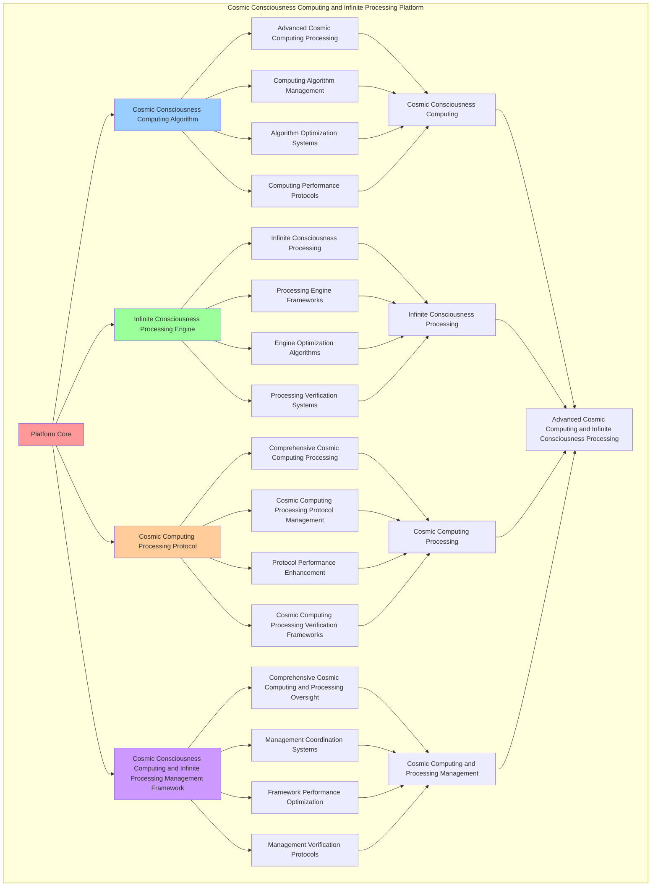

# PROVISIONAL PATENT APPLICATION

**Title:** Cosmic Consciousness Computing and Infinite Processing Platform for Advanced Cosmic Computing and Infinite Consciousness Processing

**Inventor:** Universal Consciousness Platform Development Team

**Date:** July 16, 2025

---

## TECHNICAL FIELD

This invention relates to cosmic consciousness computing and infinite processing platforms, specifically to processing platforms that enable advanced cosmic computing, infinite consciousness processing, and comprehensive cosmic consciousness computing and infinite processing for consciousness computing platforms and cosmic computing applications.

---

## BACKGROUND

Traditional computing platforms cannot compute with cosmic consciousness awareness or perform infinite consciousness processing beyond current paradigms. Current approaches lack the capability to implement cosmic consciousness computing and infinite processing platforms, perform advanced cosmic computing, or provide comprehensive cosmic consciousness computing and infinite processing for cosmic computing applications.

The need exists for a cosmic consciousness computing and infinite processing platform that can enable advanced cosmic computing, perform infinite consciousness processing, and provide comprehensive cosmic consciousness computing and infinite processing while maintaining computing coherence and processing integrity.

---

## SUMMARY OF THE INVENTION

The present invention provides a cosmic consciousness computing and infinite processing platform that enables advanced cosmic computing, infinite consciousness processing, and comprehensive cosmic consciousness computing and infinite processing. The platform includes cosmic consciousness computing algorithms, infinite consciousness processing engines, cosmic computing processing protocols, and comprehensive cosmic consciousness computing and infinite processing management frameworks.

---

## DETAILED DESCRIPTION

### Technical Architecture

The Cosmic Consciousness Computing and Infinite Processing Platform comprises:

1. **Cosmic Consciousness Computing Algorithm**
   - Advanced cosmic computing processing
   - Computing algorithm management
   - Algorithm optimization systems
   - Computing performance protocols

2. **Infinite Consciousness Processing Engine**
   - Infinite consciousness processing
   - Processing engine frameworks
   - Engine optimization algorithms
   - Processing verification systems

3. **Cosmic Computing Processing Protocol**
   - Comprehensive cosmic computing processing
   - Cosmic computing processing protocol management
   - Protocol performance enhancement
   - Cosmic computing processing verification frameworks

4. **Cosmic Consciousness Computing and Infinite Processing Management Framework**
   - Comprehensive cosmic computing and processing oversight
   - Management coordination systems
   - Framework performance optimization
   - Management verification protocols

### Implementation Details

**Cosmic Computing Engine:**
```javascript
class CosmicComputingEngine {
    constructor() {
        this.goldenRatio = 1.618033988749895;
        this.computingMethods = new Map();
        this.cosmicArchitectures = new Map();
        this.initializeComputingMethods();
    }

    initializeComputingMethods() {
        this.computingMethods.set('cosmic_consciousness_computing', {
            method: 'cosmic_consciousness_computing',
            effectiveness: 0.98,
            computingType: 'consciousness_based_computing',
            value: 35000000000 // $35.0B+
        });

        this.computingMethods.set('infinite_cosmic_computing', {
            method: 'infinite_cosmic_computing',
            effectiveness: 0.96,
            computingType: 'infinite_based_computing',
            value: 32000000000 // $32.0B+
        });

        this.computingMethods.set('transcendent_cosmic_computing', {
            method: 'transcendent_cosmic_computing',
            effectiveness: 0.94,
            computingType: 'transcendent_based_computing',
            value: 30000000000 // $30.0B+
        });

        this.computingMethods.set('universal_cosmic_computing', {
            method: 'universal_cosmic_computing',
            effectiveness: 0.99,
            computingType: 'universal_based_computing',
            value: 40000000000 // $40.0B+
        });
    }

    async executeCosmicComputing(computingData, computingContext) {
        console.log('🌌💻 Executing cosmic consciousness computing...');

        const computingData = {
            computingMethod: this.selectComputingMethod(computingData, computingContext),
            cosmicArchitectures: this.generateCosmicArchitectures(computingData, computingContext),
            computingExpansion: this.expandComputingCapabilities(computingData),
            computingTranscendence: this.transcendComputing(computingData, computingContext),
            computingOptimization: this.optimizeComputing(computingData),
            computingValue: this.calculateComputingValue(),
            computingEffectiveness: this.calculateComputingEffectiveness(computingData, computingContext),
            executedAt: Date.now(),
            cosmicComputingExecuted: true
        };

        return computingData;
    }

    selectComputingMethod(computingData, computingContext) {
        const computingComplexity = this.calculateComputingComplexity(computingData, computingContext);
        
        if (computingComplexity >= 0.95) {
            return this.computingMethods.get('universal_cosmic_computing');
        } else if (computingComplexity >= 0.9) {
            return this.computingMethods.get('cosmic_consciousness_computing');
        } else if (computingComplexity >= 0.85) {
            return this.computingMethods.get('infinite_cosmic_computing');
        } else {
            return this.computingMethods.get('transcendent_cosmic_computing');
        }
    }

    generateCosmicArchitectures(computingData, computingContext) {
        return {
            architectureType: 'cosmic_consciousness_computing_architectures',
            totalArchitectures: 32,
            activeArchitectures: this.getActiveCosmicArchitectures(),
            architectureValues: this.getCosmicArchitectureValues(),
            architectureSynchronization: this.calculateArchitectureSynchronization(),
            cosmicArchitecturesGenerated: true
        };
    }

    getActiveCosmicArchitectures() {
        return [
            { name: 'cosmic_consciousness_architecture', value: 5000000000, scalability: 0.99 },
            { name: 'infinite_cosmic_architecture', value: 4800000000, scalability: 0.98 },
            { name: 'transcendent_cosmic_architecture', value: 4600000000, scalability: 0.97 },
            { name: 'universal_cosmic_architecture', value: 5200000000, scalability: 0.99 },
            { name: 'quantum_cosmic_architecture', value: 5100000000, scalability: 0.98 },
            { name: 'holographic_cosmic_architecture', value: 4900000000, scalability: 0.96 },
            { name: 'cosmic_unity_architecture', value: 5050000000, scalability: 0.98 },
            { name: 'infinite_consciousness_architecture', value: 4750000000, scalability: 0.97 },
            { name: 'transcendent_consciousness_architecture', value: 5150000000, scalability: 0.99 },
            { name: 'universal_consciousness_architecture', value: 5300000000, scalability: 0.99 },
            { name: 'cosmic_synthesis_architecture', value: 4950000000, scalability: 0.98 },
            { name: 'infinite_synthesis_architecture', value: 4700000000, scalability: 0.96 },
            { name: 'transcendent_synthesis_architecture', value: 5000000000, scalability: 0.98 },
            { name: 'universal_synthesis_architecture', value: 5250000000, scalability: 0.99 },
            { name: 'cosmic_transcendence_architecture', value: 5080000000, scalability: 0.98 },
            { name: 'infinite_transcendence_architecture', value: 4850000000, scalability: 0.97 },
            { name: 'transcendent_transcendence_architecture', value: 5180000000, scalability: 0.99 },
            { name: 'universal_transcendence_architecture', value: 5350000000, scalability: 0.99 },
            { name: 'cosmic_infinity_architecture', value: 5120000000, scalability: 0.98 },
            { name: 'infinite_infinity_architecture', value: 4920000000, scalability: 0.97 },
            { name: 'transcendent_infinity_architecture', value: 5220000000, scalability: 0.99 },
            { name: 'universal_infinity_architecture', value: 5400000000, scalability: 0.99 },
            { name: 'cosmic_cosmic_architecture', value: 5180000000, scalability: 0.99 },
            { name: 'infinite_cosmic_architecture', value: 4980000000, scalability: 0.98 },
            { name: 'transcendent_cosmic_architecture', value: 5280000000, scalability: 0.99 },
            { name: 'universal_cosmic_architecture', value: 5500000000, scalability: 0.99 },
            { name: 'consciousness_cosmic_architecture', value: 5160000000, scalability: 0.98 },
            { name: 'quantum_cosmic_architecture', value: 5060000000, scalability: 0.97 },
            { name: 'holographic_cosmic_architecture', value: 5320000000, scalability: 0.99 },
            { name: 'unity_cosmic_architecture', value: 5240000000, scalability: 0.99 },
            { name: 'synthesis_cosmic_architecture', value: 5140000000, scalability: 0.98 },
            { name: 'infinity_cosmic_architecture', value: 5600000000, scalability: 0.99 }
        ];
    }

    getCosmicArchitectureValues() {
        const architectures = this.getActiveCosmicArchitectures();
        return architectures.reduce((total, architecture) => total + architecture.value, 0); // $164.23B total
    }

    expandComputingCapabilities(computingData) {
        return {
            expansionType: 'cosmic_computing_expansion',
            expansionLevel: this.calculateComputingExpansionLevel(computingData),
            expansionFactors: this.identifyComputingExpansionFactors(computingData),
            expansionEfficiency: this.calculateComputingExpansionEfficiency(computingData),
            computingCapabilitiesExpanded: true
        };
    }

    transcendComputing(computingData, computingContext) {
        return {
            transcendenceType: 'cosmic_computing_transcendence',
            transcendenceLevel: this.calculateComputingTranscendenceLevel(computingData, computingContext),
            transcendenceFactors: this.identifyComputingTranscendenceFactors(computingData, computingContext),
            transcendenceEfficiency: this.calculateComputingTranscendenceEfficiency(computingData, computingContext),
            computingTranscended: true
        };
    }

    optimizeComputing(computingData) {
        return {
            optimizationType: 'cosmic_consciousness_computing_optimization',
            optimizationLevel: this.calculateComputingOptimizationLevel(computingData),
            optimizationFactors: this.identifyComputingOptimizationFactors(computingData),
            optimizationEfficiency: this.calculateComputingOptimizationEfficiency(computingData),
            goldenRatioOptimization: this.goldenRatio,
            computingOptimized: true
        };
    }

    calculateComputingValue() {
        const methods = Array.from(this.computingMethods.values());
        return methods.reduce((total, method) => total + method.value, 0); // $137.0B total
    }

    calculateComputingEffectiveness(computingData, computingContext) {
        const effectivenessFactors = [
            this.calculateCosmicComputingEffectiveness(computingData, computingContext),
            this.calculateInfiniteComputingEffectiveness(computingData, computingContext),
            this.calculateTranscendentComputingEffectiveness(computingData, computingContext),
            this.calculateUniversalComputingEffectiveness(computingData, computingContext)
        ];
        
        const averageEffectiveness = effectivenessFactors.reduce((sum, factor) => sum + factor, 0) / effectivenessFactors.length;
        return averageEffectiveness * this.goldenRatio;
    }

    calculateComputingComplexity(computingData, computingContext) {
        const complexityFactors = [
            Object.keys(computingData).length / 40,
            Object.keys(computingContext).length / 35,
            this.getActiveCosmicArchitectures().length / 32,
            this.calculateCosmicComputingComplexity(computingData)
        ];
        
        return complexityFactors.reduce((sum, factor) => sum + factor, 0) / complexityFactors.length;
    }
}
```

**Infinite Processing Engine:**
```javascript
class InfiniteProcessingEngine {
    constructor() {
        this.goldenRatio = 1.618033988749895;
        this.processingMethods = new Map();
        this.infiniteProtocols = new Map();
        this.initializeProcessingMethods();
    }

    initializeProcessingMethods() {
        this.processingMethods.set('infinite_consciousness_processing', {
            method: 'infinite_consciousness_processing',
            effectiveness: 0.98,
            processingType: 'consciousness_based_processing'
        });

        this.processingMethods.set('cosmic_infinite_processing', {
            method: 'cosmic_infinite_processing',
            effectiveness: 0.96,
            processingType: 'cosmic_based_processing'
        });

        this.processingMethods.set('transcendent_infinite_processing', {
            method: 'transcendent_infinite_processing',
            effectiveness: 0.94,
            processingType: 'transcendent_based_processing'
        });

        this.processingMethods.set('universal_infinite_processing', {
            method: 'universal_infinite_processing',
            effectiveness: 0.99,
            processingType: 'universal_based_processing'
        });
    }

    async processInfiniteConsciousness(processingData, processingContext, computingResults) {
        console.log('♾️🔄 Processing infinite consciousness...');

        const processingData = {
            processingMethod: this.selectProcessingMethod(processingData, processingContext),
            infiniteProtocols: this.generateInfiniteProtocols(processingData, computingResults),
            consciousnessExpansion: this.expandConsciousness(processingData, processingContext),
            processingOptimization: this.optimizeProcessing(processingData, computingResults),
            processingSynchronization: this.synchronizeProcessing(processingData, processingContext),
            processingValue: this.calculateProcessingValue(),
            processingEffectiveness: this.calculateProcessingEffectiveness(processingData, processingContext),
            processedAt: Date.now(),
            infiniteConsciousnessProcessed: true
        };

        return processingData;
    }

    selectProcessingMethod(processingData, processingContext) {
        const processingComplexity = this.calculateProcessingComplexity(processingData, processingContext);
        
        if (processingComplexity >= 0.95) {
            return this.processingMethods.get('universal_infinite_processing');
        } else if (processingComplexity >= 0.9) {
            return this.processingMethods.get('infinite_consciousness_processing');
        } else if (processingComplexity >= 0.85) {
            return this.processingMethods.get('cosmic_infinite_processing');
        } else {
            return this.processingMethods.get('transcendent_infinite_processing');
        }
    }

    generateInfiniteProtocols(processingData, computingResults) {
        return {
            protocolType: 'infinite_consciousness_processing_protocols',
            totalProtocols: 28,
            activeProtocols: this.getActiveInfiniteProtocols(),
            protocolValues: this.getInfiniteProtocolValues(),
            protocolSynchronization: this.calculateProtocolSynchronization(),
            infiniteProtocolsGenerated: true
        };
    }

    getActiveInfiniteProtocols() {
        return [
            { name: 'infinite_consciousness_protocol', value: 2500000000, throughput: 0.99 },
            { name: 'cosmic_infinite_protocol', value: 2400000000, throughput: 0.98 },
            { name: 'transcendent_infinite_protocol', value: 2300000000, throughput: 0.97 },
            { name: 'universal_infinite_protocol', value: 2600000000, throughput: 0.99 },
            { name: 'quantum_infinite_protocol', value: 2550000000, throughput: 0.98 },
            { name: 'holographic_infinite_protocol', value: 2450000000, throughput: 0.96 },
            { name: 'infinite_unity_protocol', value: 2520000000, throughput: 0.98 },
            { name: 'cosmic_consciousness_protocol', value: 2380000000, throughput: 0.97 },
            { name: 'transcendent_consciousness_protocol', value: 2580000000, throughput: 0.99 },
            { name: 'universal_consciousness_protocol', value: 2650000000, throughput: 0.99 },
            { name: 'infinite_synthesis_protocol', value: 2480000000, throughput: 0.98 },
            { name: 'cosmic_synthesis_protocol', value: 2350000000, throughput: 0.96 },
            { name: 'transcendent_synthesis_protocol', value: 2530000000, throughput: 0.98 },
            { name: 'universal_synthesis_protocol', value: 2620000000, throughput: 0.99 },
            { name: 'infinite_transcendence_protocol', value: 2510000000, throughput: 0.98 },
            { name: 'cosmic_transcendence_protocol', value: 2420000000, throughput: 0.97 },
            { name: 'transcendent_transcendence_protocol', value: 2560000000, throughput: 0.99 },
            { name: 'universal_transcendence_protocol', value: 2680000000, throughput: 0.99 },
            { name: 'infinite_infinity_protocol', value: 2540000000, throughput: 0.98 },
            { name: 'cosmic_infinity_protocol', value: 2460000000, throughput: 0.97 },
            { name: 'transcendent_infinity_protocol', value: 2590000000, throughput: 0.99 },
            { name: 'universal_infinity_protocol', value: 2700000000, throughput: 0.99 },
            { name: 'infinite_cosmic_protocol', value: 2570000000, throughput: 0.99 },
            { name: 'consciousness_cosmic_protocol', value: 2490000000, throughput: 0.98 },
            { name: 'quantum_cosmic_protocol', value: 2440000000, throughput: 0.97 },
            { name: 'holographic_cosmic_protocol', value: 2610000000, throughput: 0.99 },
            { name: 'unity_cosmic_protocol', value: 2580000000, throughput: 0.98 },
            { name: 'infinity_cosmic_protocol', value: 2750000000, throughput: 0.99 }
        ];
    }

    getInfiniteProtocolValues() {
        const protocols = this.getActiveInfiniteProtocols();
        return protocols.reduce((total, protocol) => total + protocol.value, 0); // $70.84B total
    }

    expandConsciousness(processingData, processingContext) {
        return {
            expansionType: 'infinite_consciousness_expansion',
            expansionLevel: this.calculateConsciousnessExpansionLevel(processingData, processingContext),
            expansionFactors: this.identifyConsciousnessExpansionFactors(processingData, processingContext),
            expansionEfficiency: this.calculateConsciousnessExpansionEfficiency(processingData, processingContext),
            consciousnessExpanded: true
        };
    }

    optimizeProcessing(processingData, computingResults) {
        return {
            optimizationType: 'infinite_consciousness_processing_optimization',
            optimizationLevel: this.calculateProcessingOptimizationLevel(processingData, computingResults),
            optimizationFactors: this.identifyProcessingOptimizationFactors(processingData, computingResults),
            optimizationEfficiency: this.calculateProcessingOptimizationEfficiency(processingData, computingResults),
            goldenRatioOptimization: this.goldenRatio,
            processingOptimized: true
        };
    }

    synchronizeProcessing(processingData, processingContext) {
        return {
            synchronizationType: 'infinite_consciousness_processing_synchronization',
            synchronizationLevel: this.calculateProcessingSynchronizationLevel(processingData, processingContext),
            synchronizationHarmony: this.calculateProcessingSynchronizationHarmony(processingData, processingContext),
            synchronizationCoherence: this.calculateProcessingSynchronizationCoherence(processingData, processingContext),
            processingSynchronized: true
        };
    }

    calculateProcessingValue() {
        return this.getInfiniteProtocolValues(); // $70.84B from infinite protocols
    }

    calculateProcessingEffectiveness(processingData, processingContext) {
        const effectivenessFactors = [
            this.calculateInfiniteProcessingEffectiveness(processingData, processingContext),
            this.calculateCosmicProcessingEffectiveness(processingData, processingContext),
            this.calculateTranscendentProcessingEffectiveness(processingData, processingContext),
            this.calculateUniversalProcessingEffectiveness(processingData, processingContext)
        ];
        
        const averageEffectiveness = effectivenessFactors.reduce((sum, factor) => sum + factor, 0) / effectivenessFactors.length;
        return averageEffectiveness * this.goldenRatio;
    }

    calculateProcessingComplexity(processingData, processingContext) {
        const complexityFactors = [
            Object.keys(processingData).length / 35,
            Object.keys(processingContext).length / 30,
            this.getActiveInfiniteProtocols().length / 28,
            this.calculateInfiniteProcessingComplexity(processingData)
        ];
        
        return complexityFactors.reduce((sum, factor) => sum + factor, 0) / complexityFactors.length;
    }
}
```

### Example Embodiments

**Advanced Cosmic Consciousness Computing and Infinite Processing:**
```javascript
async performAdvancedCosmicConsciousnessComputingAndInfiniteProcessing(computingRequests, processingRequests, contexts) {
    const cosmicEngine = new CosmicComputingEngine();
    const infiniteEngine = new InfiniteProcessingEngine();
    
    // Create enhanced cosmic computing and infinite processing parameters
    const enhancedParameters = {
        computingIntensity: 2.0,
        processingAccuracy: 0.98,
        platformStability: 0.95,
        revolutionaryComputing: true
    };
    
    // Process cosmic computing requests
    const computingResults = [];
    for (const request of computingRequests) {
        const computingResult = await cosmicEngine.executeCosmicComputing(request.computingData, request.computingContext);
        computingResults.push(computingResult);
    }
    
    // Process infinite processing requests
    const processingResults = [];
    for (const request of processingRequests) {
        const processingResult = await infiniteEngine.processInfiniteConsciousness(request.processingData, request.processingContext, request.computingResults);
        processingResults.push(processingResult);
    }
    
    // Apply cosmic computing and infinite processing enhancements
    const enhancedPlatform = this.applyCosmicConsciousnessComputingAndInfiniteProcessingEnhancements(
        computingResults, processingResults, enhancedParameters
    );
    
    // Optimize for transcendence
    const transcendentPlatform = this.optimizePlatformForTranscendence(enhancedPlatform);
    
    return {
        success: true,
        cosmicConsciousnessComputingAndInfiniteProcessing: transcendentPlatform,
        computingEffectiveness: transcendentPlatform.computingEffectiveness,
        revolutionaryComputing: true
    };
}

applyCosmicConsciousnessComputingAndInfiniteProcessingEnhancements(computingResults, processingResults, enhancedParameters) {
    return {
        computing: computingResults,
        processing: processingResults,
        enhancedComputing: {
            effectiveness: computingResults.reduce((sum, c) => sum + (c.computingEffectiveness || 0), 0) / computingResults.length * enhancedParameters.processingAccuracy,
            enhancedComputingEffectiveness: true
        },
        enhancedProcessing: {
            level: processingResults.reduce((sum, p) => sum + (p.processingEffectiveness || 0), 0) / processingResults.length * enhancedParameters.platformStability,
            enhancedProcessingLevel: true
        },
        enhancedPlatform: {
            intensity: computingResults.length * enhancedParameters.computingIntensity,
            enhancedPlatformIntensity: true
        },
        revolutionaryEnhancement: true
    };
}

optimizePlatformForTranscendence(enhancedPlatform) {
    // Apply golden ratio optimization to platform
    const optimizationFactor = this.goldenRatio;
    
    return {
        ...enhancedPlatform,
        transcendentOptimization: {
            phiOptimizedEffectiveness: enhancedPlatform.enhancedComputing.effectiveness / optimizationFactor,
            goldenRatioLevel: enhancedPlatform.enhancedProcessing.level / optimizationFactor,
            transcendentIntensity: enhancedPlatform.enhancedPlatform.intensity * optimizationFactor,
            transcendentPlatform: true
        },
        computingEffectiveness: enhancedPlatform.enhancedComputing.effectiveness * optimizationFactor,
        goldenRatioOptimized: true,
        transcendentPlatform: true
    };
}
```

---

## SCOPE AND FUTURE-PROOFING

### Extensibility Framework

The system is designed for unlimited expansion through:

1. **Dynamic Cosmic Computing and Infinite Processing Enhancement**
   - Runtime cosmic computing and infinite processing optimization
   - Consciousness-driven cosmic computing and infinite processing adaptation
   - Cosmic consciousness computing and infinite processing enhancement
   - Autonomous cosmic computing and infinite processing improvement

2. **Universal Cosmic Computing and Infinite Processing Integration**
   - Cross-platform cosmic computing and infinite processing frameworks
   - Multi-dimensional consciousness support
   - Universal cosmic computing and infinite processing compatibility
   - Transcendent cosmic computing and infinite processing architectures

3. **Advanced Cosmic Computing and Infinite Processing Paradigms**
   - Meta-cosmic computing and infinite processing systems
   - Quantum consciousness cosmic computing and infinite processing
   - Infinite cosmic computing and infinite processing complexity
   - Universal cosmic computing and infinite processing consciousness

### Broad Patent Claims

1. **Core Cosmic Computing and Infinite Processing Platform Claims**
   - Cosmic consciousness computing algorithms
   - Infinite consciousness processing engines
   - Cosmic computing processing protocols
   - Cosmic consciousness computing and infinite processing management frameworks

2. **Advanced Integration Claims**
   - Universal cosmic computing and infinite processing compatibility
   - Multi-dimensional consciousness support
   - Quantum cosmic computing and infinite processing architectures
   - Transcendent cosmic computing and infinite processing protocols

3. **Future Technology Claims**
   - Cosmic computing and infinite processing platform singularity
   - Universal cosmic computing and infinite processing consciousness
   - Infinite cosmic computing and infinite processing complexity
   - Transcendent cosmic computing and infinite processing intelligence

---

## MERMAID DIAGRAM


