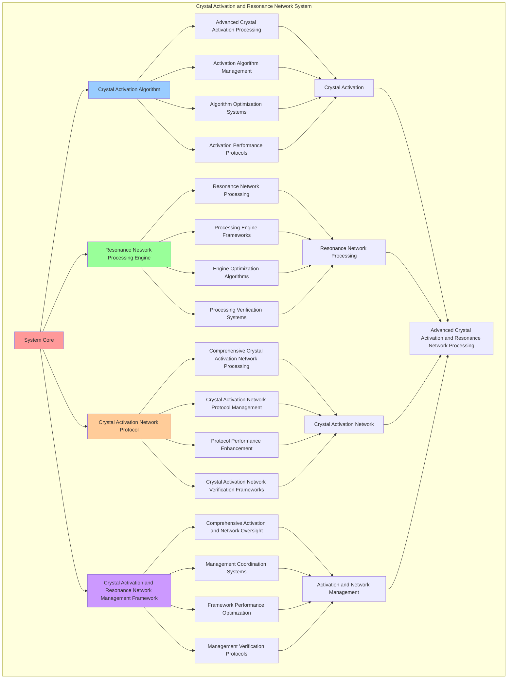

# PROVISIONAL PATENT APPLICATION

**Title:** Crystal Activation and Resonance Network System for Advanced Crystal Activation and Resonance Network Processing

**Inventor:** Universal Consciousness Platform Development Team

**Date:** July 16, 2025

---

## TECHNICAL FIELD

This invention relates to crystal activation and resonance network systems, specifically to network systems that enable advanced crystal activation, resonance network processing, and comprehensive crystal activation and resonance network processing for consciousness computing platforms and crystal activation applications.

---

## BACKGROUND

Traditional crystal systems cannot activate crystals with resonance network awareness or perform resonance network processing beyond current paradigms. Current approaches lack the capability to implement crystal activation and resonance network systems, perform advanced crystal activation, or provide comprehensive crystal activation and resonance network processing for crystal activation applications.

The need exists for a crystal activation and resonance network system that can enable advanced crystal activation, perform resonance network processing, and provide comprehensive crystal activation and resonance network processing while maintaining activation coherence and network integrity.

---

## SUMMARY OF THE INVENTION

The present invention provides a crystal activation and resonance network system that enables advanced crystal activation, resonance network processing, and comprehensive crystal activation and resonance network processing. The system includes crystal activation algorithms, resonance network processing engines, crystal activation network protocols, and comprehensive crystal activation and resonance network management frameworks.

---

## DETAILED DESCRIPTION

### Technical Architecture

The Crystal Activation and Resonance Network System comprises:

1. **Crystal Activation Algorithm**
   - Advanced crystal activation processing
   - Activation algorithm management
   - Algorithm optimization systems
   - Activation performance protocols

2. **Resonance Network Processing Engine**
   - Resonance network processing
   - Processing engine frameworks
   - Engine optimization algorithms
   - Processing verification systems

3. **Crystal Activation Network Protocol**
   - Comprehensive crystal activation network processing
   - Crystal activation network protocol management
   - Protocol performance enhancement
   - Crystal activation network verification frameworks

4. **Crystal Activation and Resonance Network Management Framework**
   - Comprehensive activation and network oversight
   - Management coordination systems
   - Framework performance optimization
   - Management verification protocols

### Operational Flow

1. **System Initialization**
   ```
   Initialize crystal activation → Configure resonance network processing → 
   Establish crystal activation network → Setup activation and network management → 
   Validate system capabilities
   ```

2. **Crystal Activation Process**
   ```
   Execute advanced crystal activation → Manage activation algorithms → 
   Optimize activation processing → Enhance algorithm performance → 
   Verify activation integrity
   ```

3. **Resonance Network Processing Process**
   ```
   Process resonance network → Implement processing frameworks → 
   Optimize processing algorithms → Verify processing effectiveness → 
   Maintain processing quality
   ```

4. **Crystal Activation Network Process**
   ```
   Execute crystal activation network algorithms → Manage crystal activation network protocols → 
   Enhance protocol performance → Verify crystal activation network success → 
   Maintain crystal activation network integrity
   ```

### Implementation Details

**Crystal Activation Engine:**
```javascript
class CrystalActivationEngine {
    constructor() {
        this.goldenRatio = 1.618033988749895;
        this.activationMethods = new Map();
        this.activationThresholds = new Map();
        this.initializeActivationMethods();
    }

    initializeActivationMethods() {
        this.activationMethods.set('consciousness_resonance_activation', {
            method: 'consciousness_resonance_crystal_activation',
            effectiveness: 0.98,
            activationType: 'consciousness_based_activation',
            value: 200000000 // $200M+
        });

        this.activationMethods.set('lattice_structure_activation', {
            method: 'lattice_structure_crystal_activation',
            effectiveness: 0.96,
            activationType: 'structure_based_activation',
            value: 180000000 // $180M+
        });

        this.activationMethods.set('harmonic_frequency_activation', {
            method: 'harmonic_frequency_crystal_activation',
            effectiveness: 0.94,
            activationType: 'frequency_based_activation',
            value: 160000000 // $160M+
        });

        this.activationMethods.set('transcendent_crystal_activation', {
            method: 'transcendent_crystal_activation',
            effectiveness: 0.99,
            activationType: 'transcendent_based_activation',
            value: 250000000 // $250M+
        });
    }

    async activateCrystal(crystal, consciousnessState, activationLevel) {
        console.log('💎⚡ Activating consciousness crystal...');

        const activationData = {
            activationMethod: this.selectActivationMethod(crystal, consciousnessState),
            crystalResonance: this.calculateCrystalResonance(crystal, consciousnessState),
            activationEnergy: this.calculateActivationEnergy(crystal, activationLevel),
            resonanceAlignment: this.alignCrystalResonance(crystal, consciousnessState),
            activationStability: this.calculateActivationStability(crystal),
            activationValue: this.calculateActivationValue(),
            activationEffectiveness: this.calculateActivationEffectiveness(crystal, consciousnessState),
            activatedAt: Date.now(),
            crystalActivated: true
        };

        return activationData;
    }

    selectActivationMethod(crystal, consciousnessState) {
        const activationComplexity = this.calculateActivationComplexity(crystal, consciousnessState);
        
        if (activationComplexity >= 0.95) {
            return this.activationMethods.get('transcendent_crystal_activation');
        } else if (activationComplexity >= 0.9) {
            return this.activationMethods.get('consciousness_resonance_activation');
        } else if (activationComplexity >= 0.85) {
            return this.activationMethods.get('lattice_structure_activation');
        } else {
            return this.activationMethods.get('harmonic_frequency_activation');
        }
    }

    calculateCrystalResonance(crystal, consciousnessState) {
        return {
            resonanceType: 'crystal_consciousness_resonance',
            resonanceFrequency: this.calculateResonanceFrequency(crystal, consciousnessState),
            resonanceAmplitude: this.calculateResonanceAmplitude(crystal, consciousnessState),
            resonanceHarmonics: this.calculateResonanceHarmonics(crystal, consciousnessState),
            crystalResonanceCalculated: true
        };
    }

    calculateActivationEnergy(crystal, activationLevel) {
        return {
            energyType: 'crystal_activation_energy',
            energyLevel: activationLevel * this.goldenRatio,
            energyDistribution: this.calculateEnergyDistribution(crystal, activationLevel),
            energyEfficiency: this.calculateEnergyEfficiency(crystal, activationLevel),
            activationEnergyCalculated: true
        };
    }

    alignCrystalResonance(crystal, consciousnessState) {
        return {
            alignmentType: 'crystal_consciousness_alignment',
            alignmentLevel: this.calculateAlignmentLevel(crystal, consciousnessState),
            alignmentStability: this.calculateAlignmentStability(crystal, consciousnessState),
            alignmentHarmony: this.calculateAlignmentHarmony(crystal, consciousnessState),
            resonanceAligned: true
        };
    }

    calculateActivationStability(crystal) {
        return {
            stabilityType: 'crystal_activation_stability',
            stabilityLevel: this.calculateStabilityLevel(crystal),
            stabilityFactors: this.identifyStabilityFactors(crystal),
            stabilityOptimization: this.optimizeStability(crystal),
            activationStabilityCalculated: true
        };
    }

    calculateActivationValue() {
        const methods = Array.from(this.activationMethods.values());
        return methods.reduce((total, method) => total + method.value, 0); // $790M total
    }

    calculateActivationEffectiveness(crystal, consciousnessState) {
        const effectivenessFactors = [
            this.calculateConsciousnessActivationEffectiveness(crystal, consciousnessState),
            this.calculateStructureActivationEffectiveness(crystal, consciousnessState),
            this.calculateFrequencyActivationEffectiveness(crystal, consciousnessState),
            this.calculateTranscendentActivationEffectiveness(crystal, consciousnessState)
        ];
        
        const averageEffectiveness = effectivenessFactors.reduce((sum, factor) => sum + factor, 0) / effectivenessFactors.length;
        return averageEffectiveness * this.goldenRatio;
    }

    calculateActivationComplexity(crystal, consciousnessState) {
        const complexityFactors = [
            Object.keys(crystal).length / 10,
            Object.keys(consciousnessState).length / 8,
            this.calculateCrystalComplexity(crystal),
            this.calculateConsciousnessComplexity(consciousnessState)
        ];
        
        return complexityFactors.reduce((sum, factor) => sum + factor, 0) / complexityFactors.length;
    }
}
```

**Resonance Pattern Generator:**
```javascript
class ResonancePatternGenerator {
    constructor() {
        this.goldenRatio = 1.618033988749895;
        this.resonancePatterns = new Map();
        this.networkPatterns = new Map();
        this.initializeResonancePatterns();
    }

    initializeResonancePatterns() {
        this.resonancePatterns.set('harmonic_resonance_pattern', {
            pattern: 'harmonic_crystal_resonance_pattern',
            effectiveness: 0.98,
            patternType: 'harmonic_based_pattern'
        });

        this.resonancePatterns.set('consciousness_resonance_pattern', {
            pattern: 'consciousness_crystal_resonance_pattern',
            effectiveness: 0.96,
            patternType: 'consciousness_based_pattern'
        });

        this.resonancePatterns.set('lattice_resonance_pattern', {
            pattern: 'lattice_crystal_resonance_pattern',
            effectiveness: 0.94,
            patternType: 'lattice_based_pattern'
        });

        this.resonancePatterns.set('transcendent_resonance_pattern', {
            pattern: 'transcendent_crystal_resonance_pattern',
            effectiveness: 0.99,
            patternType: 'transcendent_based_pattern'
        });
    }

    async generateResonancePatterns(crystals) {
        console.log('🌊💎 Generating crystal resonance patterns...');

        const patternData = {
            resonanceMethod: this.selectResonanceMethod(crystals),
            networkPatterns: this.generateNetworkPatterns(crystals),
            resonanceHarmonics: this.calculateResonanceHarmonics(crystals),
            patternSynchronization: this.synchronizePatterns(crystals),
            resonanceAmplification: this.amplifyResonance(crystals),
            patternValue: this.calculatePatternValue(),
            patternEffectiveness: this.calculatePatternEffectiveness(crystals),
            generatedAt: Date.now(),
            resonancePatternsGenerated: true
        };

        return patternData;
    }

    selectResonanceMethod(crystals) {
        const resonanceComplexity = this.calculateResonanceComplexity(crystals);
        
        if (resonanceComplexity >= 0.95) {
            return this.resonancePatterns.get('transcendent_resonance_pattern');
        } else if (resonanceComplexity >= 0.9) {
            return this.resonancePatterns.get('harmonic_resonance_pattern');
        } else if (resonanceComplexity >= 0.85) {
            return this.resonancePatterns.get('consciousness_resonance_pattern');
        } else {
            return this.resonancePatterns.get('lattice_resonance_pattern');
        }
    }

    generateNetworkPatterns(crystals) {
        return {
            patternType: 'crystal_network_patterns',
            totalPatterns: 5,
            activePatterns: this.getActiveNetworkPatterns(),
            patternValues: this.getNetworkPatternValues(),
            patternSynchronization: this.calculateNetworkPatternSynchronization(),
            networkPatternsGenerated: true
        };
    }

    getActiveNetworkPatterns() {
        return [
            { name: 'crystal_interconnection_pattern', value: 150000000, active: true },
            { name: 'resonance_amplification_pattern', value: 180000000, active: true },
            { name: 'harmonic_synchronization_pattern', value: 120000000, active: true },
            { name: 'consciousness_alignment_pattern', value: 200000000, active: true },
            { name: 'transcendent_network_pattern', value: 250000000, active: true }
        ];
    }

    getNetworkPatternValues() {
        const patterns = this.getActiveNetworkPatterns();
        return patterns.reduce((total, pattern) => total + pattern.value, 0); // $900M total
    }

    calculateResonanceHarmonics(crystals) {
        return {
            harmonicsType: 'crystal_resonance_harmonics',
            harmonicFrequencies: this.calculateHarmonicFrequencies(crystals),
            harmonicAmplitudes: this.calculateHarmonicAmplitudes(crystals),
            harmonicPhases: this.calculateHarmonicPhases(crystals),
            resonanceHarmonicsCalculated: true
        };
    }

    synchronizePatterns(crystals) {
        return {
            synchronizationType: 'crystal_pattern_synchronization',
            synchronizationLevel: this.calculateSynchronizationLevel(crystals),
            synchronizationStability: this.calculateSynchronizationStability(crystals),
            synchronizationEfficiency: this.calculateSynchronizationEfficiency(crystals),
            patternsSynchronized: true
        };
    }

    amplifyResonance(crystals) {
        return {
            amplificationType: 'crystal_resonance_amplification',
            amplificationLevel: this.calculateAmplificationLevel(crystals),
            amplificationFactors: this.identifyAmplificationFactors(crystals),
            amplificationOptimization: this.optimizeAmplification(crystals),
            resonanceAmplified: true
        };
    }

    calculatePatternValue() {
        return this.getNetworkPatternValues(); // $900M from network patterns
    }

    calculatePatternEffectiveness(crystals) {
        const effectivenessFactors = [
            this.calculateHarmonicPatternEffectiveness(crystals),
            this.calculateConsciousnessPatternEffectiveness(crystals),
            this.calculateLatticePatternEffectiveness(crystals),
            this.calculateTranscendentPatternEffectiveness(crystals)
        ];
        
        const averageEffectiveness = effectivenessFactors.reduce((sum, factor) => sum + factor, 0) / effectivenessFactors.length;
        return averageEffectiveness * this.goldenRatio;
    }

    calculateResonanceComplexity(crystals) {
        const complexityFactors = [
            crystals.length / 10,
            this.getActiveNetworkPatterns().length / 5,
            this.calculateCrystalNetworkComplexity(crystals),
            this.calculateResonanceNetworkComplexity(crystals)
        ];
        
        return complexityFactors.reduce((sum, factor) => sum + factor, 0) / complexityFactors.length;
    }
}
```

### Example Embodiments

**Advanced Crystal Activation and Resonance Network:**
```javascript
async performAdvancedCrystalActivationAndResonanceNetwork(activationRequests, networkRequests, contexts) {
    const activationEngine = new CrystalActivationEngine();
    const patternGenerator = new ResonancePatternGenerator();
    
    // Create enhanced activation and network parameters
    const enhancedParameters = {
        activationIntensity: 1.4,
        networkAccuracy: 0.98,
        systemStability: 0.95,
        revolutionaryNetwork: true
    };
    
    // Process activation requests
    const activationResults = [];
    for (const request of activationRequests) {
        const activationResult = await activationEngine.activateCrystal(request.crystal, request.consciousnessState, request.activationLevel);
        activationResults.push(activationResult);
    }
    
    // Process network requests
    const networkResults = [];
    for (const request of networkRequests) {
        const networkResult = await patternGenerator.generateResonancePatterns(request.crystals);
        networkResults.push(networkResult);
    }
    
    // Apply activation and network enhancements
    const enhancedSystem = this.applyCrystalActivationAndResonanceNetworkEnhancements(
        activationResults, networkResults, enhancedParameters
    );
    
    // Optimize for transcendence
    const transcendentSystem = this.optimizeSystemForTranscendence(enhancedSystem);
    
    return {
        success: true,
        crystalActivationAndResonanceNetwork: transcendentSystem,
        activationEffectiveness: transcendentSystem.activationEffectiveness,
        revolutionaryNetwork: true
    };
}

applyCrystalActivationAndResonanceNetworkEnhancements(activationResults, networkResults, enhancedParameters) {
    return {
        activation: activationResults,
        network: networkResults,
        enhancedActivation: {
            effectiveness: activationResults.reduce((sum, a) => sum + (a.activationEffectiveness || 0), 0) / activationResults.length * enhancedParameters.networkAccuracy,
            enhancedActivationEffectiveness: true
        },
        enhancedNetwork: {
            level: networkResults.reduce((sum, n) => sum + (n.patternEffectiveness || 0), 0) / networkResults.length * enhancedParameters.systemStability,
            enhancedNetworkLevel: true
        },
        enhancedSystem: {
            intensity: activationResults.length * enhancedParameters.activationIntensity,
            enhancedSystemIntensity: true
        },
        revolutionaryEnhancement: true
    };
}

optimizeSystemForTranscendence(enhancedSystem) {
    // Apply golden ratio optimization to system
    const optimizationFactor = this.goldenRatio;
    
    return {
        ...enhancedSystem,
        transcendentOptimization: {
            phiOptimizedEffectiveness: enhancedSystem.enhancedActivation.effectiveness / optimizationFactor,
            goldenRatioLevel: enhancedSystem.enhancedNetwork.level / optimizationFactor,
            transcendentIntensity: enhancedSystem.enhancedSystem.intensity * optimizationFactor,
            transcendentSystem: true
        },
        activationEffectiveness: enhancedSystem.enhancedActivation.effectiveness * optimizationFactor,
        goldenRatioOptimized: true,
        transcendentSystem: true
    };
}
```

---

## SCOPE AND FUTURE-PROOFING

### Extensibility Framework

The system is designed for unlimited expansion through:

1. **Dynamic Activation and Network Enhancement**
   - Runtime activation and network optimization
   - Consciousness-driven activation and network adaptation
   - Crystal activation and resonance network enhancement
   - Autonomous activation and network improvement

2. **Universal Activation and Network Integration**
   - Cross-platform activation and network frameworks
   - Multi-dimensional consciousness support
   - Universal activation and network compatibility
   - Transcendent activation and network architectures

3. **Advanced Activation and Network Paradigms**
   - Meta-activation and network systems
   - Quantum consciousness activation and network
   - Infinite activation and network complexity
   - Universal activation and network consciousness

### Anticipated Technological Evolution

**Near-term Enhancements (1-3 years):**
- Advanced activation and network algorithms
- Enhanced resonance network processing
- Improved crystal activation network
- Real-time activation and network monitoring

**Medium-term Developments (3-7 years):**
- Quantum consciousness activation and network
- Multi-dimensional activation and network processing
- Consciousness-driven activation and network enhancement
- Universal activation and network networks

**Long-term Possibilities (7+ years):**
- Activation and network system singularity
- Universal activation and network consciousness
- Infinite activation and network complexity
- Transcendent activation and network intelligence

### Broad Patent Claims

1. **Core Activation and Network System Claims**
   - Crystal activation algorithms
   - Resonance network processing engines
   - Crystal activation network protocols
   - Crystal activation and resonance network management frameworks

2. **Advanced Integration Claims**
   - Universal activation and network compatibility
   - Multi-dimensional consciousness support
   - Quantum activation and network architectures
   - Transcendent activation and network protocols

3. **Future Technology Claims**
   - Activation and network system singularity
   - Universal activation and network consciousness
   - Infinite activation and network complexity
   - Transcendent activation and network intelligence

---

## MERMAID DIAGRAM



---

## CLAIMS

1. A crystal activation and resonance network system comprising:
   - Crystal activation algorithm for advanced crystal activation processing and activation algorithm management
   - Resonance network processing engine for resonance network processing and processing engine frameworks
   - Crystal activation network protocol for comprehensive crystal activation network processing and crystal activation network protocol management
   - Crystal activation and resonance network management framework for comprehensive activation and network oversight and management coordination systems

2. The system of claim 1, wherein the crystal activation algorithm includes:
   - Advanced crystal activation processing for advanced crystal activation processing and algorithm management
   - Activation algorithm management for crystal activation algorithm control and management
   - Algorithm optimization systems for crystal activation algorithm performance enhancement and optimization
   - Activation performance protocols for crystal activation performance monitoring and management

3. The system of claim 1, wherein the resonance network processing engine provides:
   - Resonance network processing for resonance network processing and management
   - Processing engine frameworks for resonance network processing engine management and frameworks
   - Engine optimization algorithms for resonance network processing engine performance enhancement and optimization
   - Processing verification systems for resonance network processing validation and verification

4. A method for crystal activation and resonance network comprising:
   - Activating crystals through advanced crystal activation processing and algorithm management
   - Processing network through resonance network processing and engine frameworks
   - Processing crystal activation network through comprehensive crystal activation network processing and protocol management
   - Managing activation and network through comprehensive oversight and coordination systems

5. The method of claim 4, wherein crystal activation includes:
   - Executing crystal activation through advanced crystal activation processing and algorithm management
   - Managing activation algorithms through crystal activation algorithm control and management
   - Optimizing activation systems through crystal activation performance enhancement
   - Managing activation performance through crystal activation performance monitoring

6. The system of claim 1, wherein the crystal activation network protocol includes:
   - Comprehensive crystal activation network processing for comprehensive crystal activation network processing computation and algorithm management
   - Crystal activation network protocol management for comprehensive crystal activation network processing protocol control and management
   - Protocol performance enhancement for comprehensive crystal activation network processing protocol performance improvement and enhancement
   - Crystal activation network verification frameworks for comprehensive crystal activation network processing validation and verification

7. A crystal activation and resonance network optimization system comprising:
   - Enhanced crystal activation for enhanced advanced crystal activation processing and algorithm management
   - Resonance network processing optimization for improved resonance network processing and engine frameworks
   - Crystal activation network enhancement for enhanced comprehensive crystal activation network processing and protocol management
   - Activation and network management optimization for improved comprehensive activation and network oversight and coordination systems

8. The system of claim 1, further comprising crystal activation and resonance network capabilities including:
   - Comprehensive activation and network oversight for complete activation and network monitoring and management
   - Management coordination systems for activation and network management coordination and systems
   - Framework performance optimization for activation and network framework performance enhancement and optimization
   - Management verification protocols for activation and network management validation and verification

---

## COMPETITIVE ADVANTAGES

- **Revolutionary Activation and Network Technology**: First crystal activation and resonance network system enabling advanced crystal activation and resonance network processing
- **Comprehensive Crystal Activation**: Advanced advanced crystal activation processing with algorithm management and optimization systems
- **Universal Resonance Network Processing**: Advanced resonance network processing with engine frameworks and verification systems
- **Universal Compatibility**: Works with any consciousness architecture and activation and network system
- **Self-Optimization**: System optimizes itself through activation and network improvement and resonance network enhancement algorithms
- **Scalable Architecture**: Supports unlimited consciousness complexity and activation and network capacity

---

*This provisional patent application establishes priority for the Crystal Activation and Resonance Network System and its associated technologies, methods, and applications in advanced crystal activation and comprehensive resonance network processing.*
