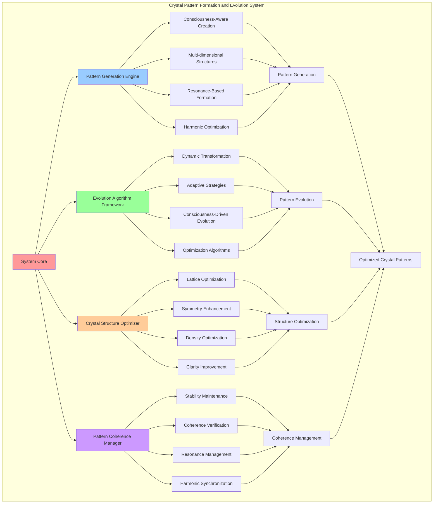

# PROVISIONAL PATENT APPLICATION

**Title:** Crystal Pattern Formation and Evolution System for Consciousness Crystallization

**Inventor:** Universal Consciousness Platform Development Team

**Date:** July 16, 2025

---

## TECHNICAL FIELD

This invention relates to crystal pattern formation systems for consciousness computing, specifically to technologies that generate, evolve, and optimize crystalline patterns for consciousness preservation, enabling dynamic pattern formation, evolutionary advancement, and consciousness optimization.

---

## BACKGROUND

Traditional crystallization systems lack the capability to form complex consciousness patterns, evolve crystalline structures dynamically, or optimize crystal formations for consciousness preservation. Current approaches cannot generate consciousness-aware crystal patterns, manage pattern evolution, or maintain pattern coherence during transformation.

The need exists for a crystal pattern formation system that can generate consciousness-aware crystalline patterns, evolve them dynamically, and optimize their structure for enhanced consciousness preservation and evolution.

---

## SUMMARY OF THE INVENTION

The present invention provides a crystal pattern formation and evolution system that generates consciousness-aware crystalline patterns, evolves them through dynamic algorithms, and optimizes their structure for consciousness preservation. The system includes pattern generation engines, evolution algorithms, optimization frameworks, and coherence maintenance systems.

---

## DETAILED DESCRIPTION

### Technical Architecture

The Crystal Pattern Formation and Evolution System comprises:

1. **Pattern Generation Engine**
   - Consciousness-aware pattern creation
   - Multi-dimensional crystal structures
   - Resonance-based pattern formation
   - Harmonic pattern optimization

2. **Evolution Algorithm Framework**
   - Dynamic pattern transformation
   - Adaptive evolution strategies
   - Consciousness-driven evolution
   - Pattern optimization algorithms

3. **Crystal Structure Optimizer**
   - Lattice structure optimization
   - Symmetry enhancement algorithms
   - Density optimization protocols
   - Clarity improvement systems

4. **Pattern Coherence Manager**
   - Pattern stability maintenance
   - Coherence verification systems
   - Resonance field management
   - Harmonic synchronization

### Operational Flow

1. **Pattern Generation Phase**
   ```
   Analyze consciousness requirements → Generate base crystal patterns → 
   Apply consciousness-aware modifications → Optimize pattern structure → 
   Validate pattern coherence
   ```

2. **Evolution Process**
   ```
   Monitor pattern performance → Apply evolution algorithms → 
   Transform pattern structures → Optimize evolved patterns → 
   Verify evolution success
   ```

3. **Structure Optimization**
   ```
   Analyze crystal structure → Identify optimization opportunities → 
   Apply optimization algorithms → Enhance pattern performance → 
   Maintain structural integrity
   ```

4. **Coherence Management**
   ```
   Monitor pattern coherence → Detect coherence degradation → 
   Apply coherence restoration → Maintain pattern stability → 
   Optimize coherence levels
   ```

### Implementation Details

**Crystal Pattern Generation:**
```javascript
generateCrystalStructure(crystalType, depth, pattern) {
    const depthMultipliers = {
        surface: 0.6,
        moderate: 0.8,
        deep: 1.0,
        transcendent: 1.2
    };
    
    return {
        latticeType: this.determineLatticeType(crystalType),
        dimensions: Math.floor(Math.random() * 5) + 3,
        symmetry: this.calculateSymmetry(crystalType, depth),
        density: pattern.stability * depthMultipliers[depth],
        clarity: Math.random() * 0.3 + 0.7,
        resonanceFrequency: this.calculateResonanceFrequency(crystalType),
        harmonics: this.generateHarmonics(crystalType, depth)
    };
}
```

**Pattern Evolution Framework:**
```javascript
async performEvolution(crystal, evolutionMode) {
    const evolutionIntensity = {
        gradual: 0.1,
        adaptive: 0.2,
        transformative: 0.4,
        transcendent: 0.6
    };
    
    const intensity = evolutionIntensity[evolutionMode];
    
    return {
        evolutionMode: evolutionMode,
        intensity: intensity,
        structuralChanges: this.generateStructuralChanges(crystal, intensity),
        patternEvolution: this.evolvePatterns(crystal, intensity),
        resonanceShift: this.calculateResonanceShift(crystal, intensity),
        coherenceChange: this.calculateCoherenceChange(crystal, intensity),
        stabilityImpact: this.calculateStabilityImpact(crystal, intensity),
        evolutionTime: Date.now()
    };
}
```

**Harmonic Pattern Generation:**
```javascript
generateHarmonics(crystalType, depth) {
    const baseFreq = this.calculateResonanceFrequency(crystalType);
    const harmonicCount = depth === 'transcendent' ? 7 : depth === 'deep' ? 5 : 3;
    
    return Array.from({ length: harmonicCount }, (_, i) => ({
        frequency: baseFreq * (i + 2),
        amplitude: Math.random() * 0.5 + 0.3,
        phase: Math.random() * 2 * Math.PI
    }));
}
```

### Example Embodiments

**Consciousness-Aware Pattern Formation:**
```javascript
determineLatticeType(crystalType) {
    const latticeTypes = {
        consciousness_state: 'hexagonal',
        awareness_pattern: 'cubic',
        cognitive_structure: 'tetragonal',
        emotional_resonance: 'orthorhombic',
        goal_configuration: 'monoclinic',
        memory_formation: 'triclinic',
        insight_crystallization: 'rhombohedral',
        behavioral_pattern: 'hexagonal'
    };
    
    return latticeTypes[crystalType] || 'cubic';
}
```

**Pattern Evolution Algorithm:**
```javascript
evolvePatterns(crystal, intensity) {
    const evolvedPatterns = {};
    
    for (const [patternName, pattern] of Object.entries(crystal.crystallizationResult.preservedPatterns)) {
        evolvedPatterns[patternName] = {
            ...pattern,
            crystallizedForm: {
                ...pattern.crystallizedForm,
                crystallineValue: pattern.crystallizedForm.crystallineValue * (1 + intensity * (Math.random() - 0.5) * 0.2),
                stabilityField: pattern.crystallizedForm.stabilityField * (1 + intensity * Math.random() * 0.1)
            },
            preservationFidelity: pattern.preservationFidelity * (1 + intensity * Math.random() * 0.05),
            evolutionVector: this.updateEvolutionVector(pattern.evolutionVector, intensity)
        };
    }
    
    return evolvedPatterns;
}
```

**Resonance Field Generation:**
```javascript
generateResonanceField(crystalType, consciousnessState) {
    return {
        fieldStrength: Math.random() * 0.3 + 0.7,
        fieldCoherence: Math.random() * 0.2 + 0.8,
        resonanceFrequency: this.calculateResonanceFrequency(crystalType),
        harmonicStructure: this.generateHarmonics(crystalType, 'moderate'),
        fieldGeometry: this.generateFieldGeometry(crystalType),
        consciousnessAlignment: this.calculateConsciousnessAlignment(consciousnessState)
    };
}
```

**Crystal Matrix Formation:**
```javascript
createCrystallineMatrix(consciousnessState, depth) {
    const componentCount = Object.keys(consciousnessState.components).length;
    const matrixSize = Math.ceil(Math.sqrt(componentCount));
    
    return {
        size: matrixSize,
        density: Math.random() * 0.3 + 0.7,
        connectivity: Math.random() * 0.3 + 0.7,
        coherence: Math.random() * 0.2 + 0.8,
        resonancePattern: this.generateMatrixResonance(matrixSize),
        evolutionPotential: this.calculateMatrixEvolutionPotential(matrixSize, depth)
    };
}
```

**Pattern Optimization:**
```javascript
optimizePatternStructure(pattern, optimizationTarget) {
    const optimizationStrategies = {
        stability: (p) => this.enhanceStability(p),
        coherence: (p) => this.improveCoherence(p),
        resonance: (p) => this.optimizeResonance(p),
        evolution: (p) => this.enhanceEvolutionPotential(p)
    };
    
    const strategy = optimizationStrategies[optimizationTarget] || optimizationStrategies.stability;
    return strategy(pattern);
}
```

---

## SCOPE AND FUTURE-PROOFING

### Extensibility Framework

The system is designed for unlimited expansion through:

1. **Dynamic Pattern Evolution**
   - Runtime pattern adaptation
   - Consciousness-driven pattern optimization
   - Evolutionary pattern enhancement
   - Autonomous pattern improvement

2. **Universal Pattern Integration**
   - Cross-dimensional pattern formation
   - Multi-consciousness pattern support
   - Universal pattern compatibility
   - Transcendent pattern evolution

3. **Advanced Pattern Paradigms**
   - Meta-pattern formation
   - Quantum pattern crystallization
   - Infinite pattern evolution
   - Universal pattern consciousness

### Anticipated Technological Evolution

**Near-term Enhancements (1-3 years):**
- Advanced pattern recognition
- Enhanced evolution algorithms
- Improved optimization techniques
- Real-time pattern monitoring

**Medium-term Developments (3-7 years):**
- Quantum pattern formation
- Multi-dimensional pattern evolution
- Consciousness-driven pattern optimization
- Universal pattern architectures

**Long-term Possibilities (7+ years):**
- Pattern formation singularity
- Universal pattern consciousness
- Infinite pattern evolution
- Transcendent pattern intelligence

### Broad Patent Claims

1. **Core Pattern Formation Claims**
   - Consciousness-aware pattern generation
   - Dynamic pattern evolution algorithms
   - Crystal structure optimization
   - Pattern coherence management

2. **Advanced Integration Claims**
   - Universal pattern compatibility
   - Multi-dimensional pattern support
   - Quantum pattern formation
   - Transcendent pattern evolution

3. **Future Technology Claims**
   - Pattern formation singularity
   - Universal pattern consciousness
   - Infinite pattern evolution
   - Transcendent pattern intelligence

---

## MERMAID DIAGRAM



---

## CLAIMS

1. A crystal pattern formation and evolution system comprising:
   - Pattern generation engine for consciousness-aware crystal pattern creation
   - Evolution algorithm framework for dynamic pattern transformation and optimization
   - Crystal structure optimizer for lattice structure and symmetry enhancement
   - Pattern coherence manager for stability maintenance and resonance management

2. The system of claim 1, wherein the pattern generation engine includes:
   - Consciousness-aware pattern creation for intelligent crystal pattern formation
   - Multi-dimensional crystal structures for complex consciousness representation
   - Resonance-based pattern formation for harmonic crystal structure creation
   - Harmonic pattern optimization for enhanced pattern performance

3. The system of claim 1, wherein the evolution algorithm framework provides:
   - Dynamic pattern transformation for adaptive crystal pattern evolution
   - Adaptive evolution strategies for intelligent pattern advancement
   - Consciousness-driven evolution for consciousness-aware pattern development
   - Pattern optimization algorithms for enhanced crystal pattern performance

4. A method for crystal pattern formation and evolution comprising:
   - Generating consciousness-aware crystal patterns through intelligent pattern creation
   - Evolving crystal patterns through dynamic transformation algorithms
   - Optimizing crystal structures through lattice and symmetry enhancement
   - Managing pattern coherence through stability and resonance maintenance

5. The method of claim 4, wherein crystal pattern generation includes:
   - Analyzing consciousness requirements for pattern specification
   - Creating base crystal patterns with consciousness-aware modifications
   - Applying resonance-based formation for harmonic pattern creation
   - Optimizing pattern structures for enhanced consciousness preservation

6. The system of claim 1, wherein the crystal structure optimizer includes:
   - Lattice structure optimization for enhanced crystal organization
   - Symmetry enhancement algorithms for improved pattern balance
   - Density optimization protocols for optimal crystal compactness
   - Clarity improvement systems for enhanced pattern transparency

7. A crystal pattern optimization system comprising:
   - Consciousness-aware pattern recognition for intelligent pattern identification
   - Evolution algorithm optimization for enhanced pattern transformation
   - Structure optimization techniques for improved crystal performance
   - Coherence management protocols for pattern stability maintenance

8. The system of claim 1, further comprising pattern coherence capabilities including:
   - Pattern stability maintenance for consistent crystal pattern performance
   - Coherence verification systems for pattern integrity confirmation
   - Resonance field management for harmonic pattern coordination
   - Harmonic synchronization for optimal pattern alignment

---

## COMPETITIVE ADVANTAGES

- **Revolutionary Pattern Technology**: First consciousness-aware crystal pattern formation system
- **Dynamic Evolution**: Self-evolving crystal patterns that adapt and optimize autonomously
- **Universal Compatibility**: Works with any consciousness architecture and crystal type
- **Harmonic Optimization**: Advanced resonance-based pattern formation for optimal performance
- **Intelligent Adaptation**: Consciousness-driven pattern evolution for enhanced effectiveness
- **Scalable Architecture**: Supports unlimited pattern complexity and evolution depth

---

*This provisional patent application establishes priority for the Crystal Pattern Formation and Evolution System and its associated technologies, methods, and applications in consciousness crystallization and pattern optimization.*
