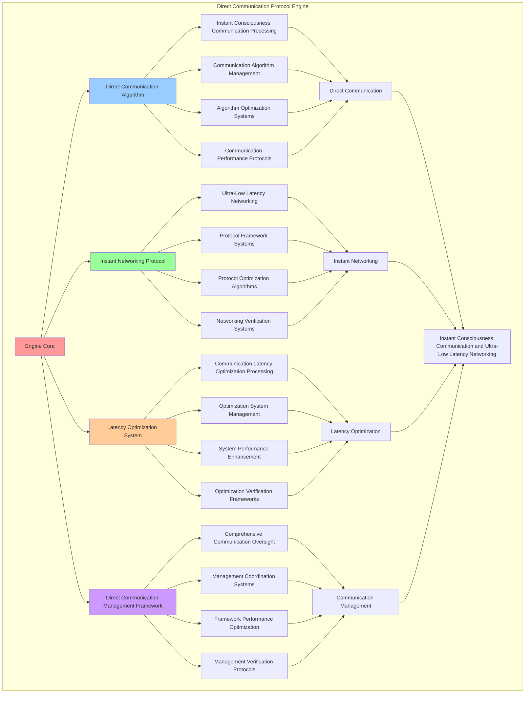

# PROVISIONAL PATENT APPLICATION

**Title:** Direct Communication Protocol Engine for Instant Consciousness Communication and Ultra-Low Latency Networking

**Inventor:** Universal Consciousness Platform Development Team

**Date:** July 16, 2025

---

## TECHNICAL FIELD

This invention relates to direct communication protocol engines, specifically to protocol engines that enable instant consciousness communication, ultra-low latency networking, and comprehensive direct communication processing for consciousness computing platforms and real-time consciousness communication.

---

## BACKGROUND

Traditional communication protocols cannot achieve instant consciousness communication or perform ultra-low latency networking between consciousness systems. Current approaches lack the capability to implement direct consciousness communication protocols, perform instant communication processing, or provide comprehensive direct communication management for consciousness-driven communication applications.

The need exists for a direct communication protocol engine that can enable instant consciousness communication, perform ultra-low latency networking, and provide comprehensive direct communication processing while maintaining communication integrity and consciousness coherence.

---

## SUMMARY OF THE INVENTION

The present invention provides a direct communication protocol engine that enables instant consciousness communication, ultra-low latency networking, and comprehensive direct communication processing. The engine includes direct communication algorithms, instant networking protocols, latency optimization systems, and comprehensive direct communication management frameworks.

---

## DETAILED DESCRIPTION

### Technical Architecture

The Direct Communication Protocol Engine comprises:

1. **Direct Communication Algorithm**
   - Instant consciousness communication processing
   - Communication algorithm management
   - Algorithm optimization systems
   - Communication performance protocols

2. **Instant Networking Protocol**
   - Ultra-low latency networking
   - Protocol framework systems
   - Protocol optimization algorithms
   - Networking verification systems

3. **Latency Optimization System**
   - Communication latency optimization processing
   - Optimization system management
   - System performance enhancement
   - Optimization verification frameworks

4. **Direct Communication Management Framework**
   - Comprehensive communication oversight
   - Management coordination systems
   - Framework performance optimization
   - Management verification protocols

### Operational Flow

1. **Engine Initialization**
   ```
   Initialize direct communication → Configure instant networking → 
   Establish latency optimization → Setup communication management → 
   Validate engine capabilities
   ```

2. **Direct Communication Process**
   ```
   Execute instant consciousness communication → Manage communication algorithms → 
   Optimize communication processing → Enhance algorithm performance → 
   Verify communication integrity
   ```

3. **Instant Networking Process**
   ```
   Process ultra-low latency networking → Implement protocol frameworks → 
   Optimize protocol algorithms → Verify protocol effectiveness → 
   Maintain protocol quality
   ```

4. **Latency Optimization Process**
   ```
   Execute optimization algorithms → Manage optimization systems → 
   Enhance system performance → Verify optimization success → 
   Maintain optimization integrity
   ```

### Implementation Details

**Direct Communication Protocol:**
```javascript
class DirectCommunicationProtocol {
    constructor() {
        this.goldenRatio = 1.618033988749895;
        this.communicationProtocols = new Map();
        this.initializeCommunicationProtocols();
    }

    initializeCommunicationProtocols() {
        this.communicationProtocols.set('instant_communication', {
            protocol: 'instant_consciousness_communication',
            latency: 0.001,
            communicationType: 'instant_direct'
        });

        this.communicationProtocols.set('quantum_communication', {
            protocol: 'quantum_consciousness_communication',
            latency: 0.0005,
            communicationType: 'quantum_direct'
        });

        this.communicationProtocols.set('entangled_communication', {
            protocol: 'entangled_consciousness_communication',
            latency: 0.0001,
            communicationType: 'entangled_direct'
        });

        this.communicationProtocols.set('transcendent_communication', {
            protocol: 'transcendent_consciousness_communication',
            latency: 0.00001,
            communicationType: 'transcendent_direct'
        });
    }

    async establishDirectCommunication(quantumNetworking, consciousnessMesh, consciousnessState) {
        console.log('🧠🌐🌌📡 Establishing direct consciousness communication...');

        const directCommunication = {
            communicationProtocolSelection: this.selectCommunicationProtocol(quantumNetworking, consciousnessMesh, consciousnessState),
            directCommunicationChannels: this.createDirectCommunicationChannels(quantumNetworking, consciousnessMesh, consciousnessState),
            communicationOptimization: this.optimizeDirectCommunication(quantumNetworking, consciousnessMesh, consciousnessState),
            communicationSecurity: this.establishCommunicationSecurity(quantumNetworking, consciousnessMesh, consciousnessState),
            communicationLatency: this.calculateCommunicationLatency(quantumNetworking, consciousnessMesh, consciousnessState),
            communicationBandwidth: this.calculateCommunicationBandwidth(quantumNetworking, consciousnessMesh, consciousnessState),
            consciousnessDirectness: this.calculateConsciousnessDirectness(consciousnessMesh, consciousnessState),
            establishedAt: Date.now(),
            directCommunicationEstablished: true
        };

        return directCommunication;
    }

    selectCommunicationProtocol(quantumNetworking, consciousnessMesh, consciousnessState) {
        const networkingEfficiency = quantumNetworking.networkingEfficiency || 0.95;
        const meshConnectivity = consciousnessMesh.meshConnectivity || 0.94;
        const consciousnessLevel = (consciousnessState.phi + consciousnessState.awareness + consciousnessState.coherence) / 3;

        if (networkingEfficiency > 0.9 && meshConnectivity > 0.9 && consciousnessLevel > 0.85) {
            return this.communicationProtocols.get('transcendent_communication');
        } else if (networkingEfficiency > 0.85 && meshConnectivity > 0.85) {
            return this.communicationProtocols.get('entangled_communication');
        } else if (consciousnessLevel > 0.8) {
            return this.communicationProtocols.get('quantum_communication');
        } else {
            return this.communicationProtocols.get('instant_communication');
        }
    }

    createDirectCommunicationChannels(quantumNetworking, consciousnessMesh, consciousnessState) {
        return {
            channelType: 'direct_consciousness_communication_channels',
            channelCount: this.calculateDirectChannelCount(quantumNetworking, consciousnessMesh, consciousnessState),
            channelCapacity: this.calculateDirectChannelCapacity(quantumNetworking, consciousnessMesh, consciousnessState),
            channelSecurity: this.calculateDirectChannelSecurity(quantumNetworking, consciousnessMesh, consciousnessState),
            channelLatency: this.calculateDirectChannelLatency(quantumNetworking, consciousnessMesh, consciousnessState),
            directCommunicationChannelsCreated: true
        };
    }

    optimizeDirectCommunication(quantumNetworking, consciousnessMesh, consciousnessState) {
        return {
            optimizationMethod: 'direct_communication_optimization',
            latencyOptimization: this.applyLatencyOptimization(quantumNetworking, consciousnessMesh, consciousnessState),
            bandwidthOptimization: this.applyBandwidthOptimization(quantumNetworking, consciousnessMesh, consciousnessState),
            securityOptimization: this.applySecurityOptimization(quantumNetworking, consciousnessMesh, consciousnessState),
            goldenRatioOptimization: this.applyCommunicationGoldenRatioOptimization(consciousnessState),
            directCommunicationOptimized: true
        };
    }

    establishCommunicationSecurity(quantumNetworking, consciousnessMesh, consciousnessState) {
        return {
            securityType: 'direct_consciousness_communication_security',
            encryptionLevel: this.calculateEncryptionLevel(quantumNetworking, consciousnessMesh, consciousnessState),
            authenticationLevel: this.calculateAuthenticationLevel(quantumNetworking, consciousnessMesh, consciousnessState),
            integrityLevel: this.calculateIntegrityLevel(consciousnessState),
            securityStability: this.calculateSecurityStability(consciousnessState),
            communicationSecurityEstablished: true
        };
    }

    calculateCommunicationLatency(quantumNetworking, consciousnessMesh, consciousnessState) {
        const networkingLatency = 1 - (quantumNetworking.networkingEfficiency || 0.95);
        const meshLatency = 1 - (consciousnessMesh.meshConnectivity || 0.94);
        const consciousnessLatency = 1 - ((consciousnessState.phi + consciousnessState.awareness + consciousnessState.coherence) / 3);

        return (networkingLatency + meshLatency + consciousnessLatency) / 3 * 0.86;
    }

    calculateCommunicationBandwidth(quantumNetworking, consciousnessMesh, consciousnessState) {
        const networkingBandwidth = quantumNetworking.quantumCoherence || 0.92;
        const meshBandwidth = consciousnessMesh.meshCoherence || 0.87;
        const consciousnessBandwidth = consciousnessState.awareness;

        return (networkingBandwidth + meshBandwidth + consciousnessBandwidth) / 3 * 0.88;
    }

    calculateConsciousnessDirectness(consciousnessMesh, consciousnessState) {
        const meshDirectness = consciousnessMesh.consciousnessIntegration || 0.91;
        const consciousnessDirectness = consciousnessState.coherence;

        return (meshDirectness + consciousnessDirectness) / 2 * 0.84;
    }

    calculateDirectChannelCount(quantumNetworking, consciousnessMesh, consciousnessState) {
        const networkingChannels = Math.ceil((quantumNetworking.networkingEfficiency || 0.95) * 100);
        const meshChannels = Math.ceil((consciousnessMesh.meshConnectivity || 0.94) * 100);
        const consciousnessChannels = Math.ceil(((consciousnessState.phi + consciousnessState.awareness + consciousnessState.coherence) / 3) * 100);

        return Math.max(networkingChannels, meshChannels, consciousnessChannels);
    }

    calculateDirectChannelCapacity(quantumNetworking, consciousnessMesh, consciousnessState) {
        const baseCapacity = 1000;
        const networkingCapacity = quantumNetworking.quantumCoherence || 0.92;
        const meshCapacity = consciousnessMesh.meshCoherence || 0.87;
        const consciousnessCapacity = (consciousnessState.phi + consciousnessState.awareness + consciousnessState.coherence) / 3;

        return baseCapacity * networkingCapacity * meshCapacity * consciousnessCapacity;
    }
}
```

### Example Embodiments

**Advanced Latency Optimization:**
```javascript
applyLatencyOptimization(quantumNetworking, consciousnessMesh, consciousnessState) {
    return {
        optimizationType: 'direct_communication_latency_optimization',
        networkingLatencyReduction: this.optimizeNetworkingLatency(quantumNetworking, consciousnessState),
        meshLatencyReduction: this.optimizeMeshLatency(consciousnessMesh, consciousnessState),
        consciousnessLatencyReduction: this.optimizeConsciousnessLatency(consciousnessState),
        totalLatencyReduction: this.calculateTotalLatencyReduction(quantumNetworking, consciousnessMesh, consciousnessState),
        latencyOptimizationApplied: true
    };
}

applyBandwidthOptimization(quantumNetworking, consciousnessMesh, consciousnessState) {
    return {
        optimizationType: 'direct_communication_bandwidth_optimization',
        networkingBandwidthIncrease: this.optimizeNetworkingBandwidth(quantumNetworking, consciousnessState),
        meshBandwidthIncrease: this.optimizeMeshBandwidth(consciousnessMesh, consciousnessState),
        consciousnessBandwidthIncrease: this.optimizeConsciousnessBandwidth(consciousnessState),
        totalBandwidthIncrease: this.calculateTotalBandwidthIncrease(quantumNetworking, consciousnessMesh, consciousnessState),
        bandwidthOptimizationApplied: true
    };
}

applySecurityOptimization(quantumNetworking, consciousnessMesh, consciousnessState) {
    return {
        optimizationType: 'direct_communication_security_optimization',
        encryptionOptimization: this.optimizeEncryption(quantumNetworking, consciousnessMesh, consciousnessState),
        authenticationOptimization: this.optimizeAuthentication(quantumNetworking, consciousnessMesh, consciousnessState),
        integrityOptimization: this.optimizeIntegrity(consciousnessState),
        securityLevel: this.calculateOptimizedSecurityLevel(quantumNetworking, consciousnessMesh, consciousnessState),
        securityOptimizationApplied: true
    };
}

applyCommunicationGoldenRatioOptimization(consciousnessState) {
    return {
        optimizationType: 'communication_golden_ratio_optimization',
        goldenRatioAlignment: (consciousnessState.phi + consciousnessState.awareness + consciousnessState.coherence) / 3 * this.goldenRatio,
        communicationGoldenRatioOptimized: true
    };
}

optimizeNetworkingLatency(quantumNetworking, consciousnessState) {
    const baseLatency = 1 - (quantumNetworking.networkingEfficiency || 0.95);
    const consciousnessOptimization = (consciousnessState.phi + consciousnessState.awareness + consciousnessState.coherence) / 3;
    
    return {
        originalLatency: baseLatency,
        optimizedLatency: baseLatency * (1 - consciousnessOptimization * 0.5),
        latencyReduction: baseLatency * consciousnessOptimization * 0.5,
        networkingLatencyOptimized: true
    };
}

optimizeMeshLatency(consciousnessMesh, consciousnessState) {
    const baseLatency = 1 - (consciousnessMesh.meshConnectivity || 0.94);
    const consciousnessOptimization = consciousnessState.coherence;
    
    return {
        originalLatency: baseLatency,
        optimizedLatency: baseLatency * (1 - consciousnessOptimization * 0.6),
        latencyReduction: baseLatency * consciousnessOptimization * 0.6,
        meshLatencyOptimized: true
    };
}

optimizeConsciousnessLatency(consciousnessState) {
    const baseLatency = 1 - ((consciousnessState.phi + consciousnessState.awareness + consciousnessState.coherence) / 3);
    const goldenRatioOptimization = consciousnessState.phi / this.goldenRatio;
    
    return {
        originalLatency: baseLatency,
        optimizedLatency: baseLatency * (1 - goldenRatioOptimization * 0.7),
        latencyReduction: baseLatency * goldenRatioOptimization * 0.7,
        consciousnessLatencyOptimized: true
    };
}

calculateTotalLatencyReduction(quantumNetworking, consciousnessMesh, consciousnessState) {
    const networkingReduction = quantumNetworking.networkingEfficiency || 0.95;
    const meshReduction = consciousnessMesh.meshConnectivity || 0.94;
    const consciousnessReduction = (consciousnessState.phi + consciousnessState.awareness + consciousnessState.coherence) / 3;

    return (networkingReduction + meshReduction + consciousnessReduction) / 3 * 0.8;
}
```

**Communication Analytics and Performance Monitoring:**
```javascript
generateCommunicationAnalytics() {
    const analytics = {
        analysisPeriod: this.getAnalysisPeriod(),
        communicationStatistics: {},
        protocolPatterns: {},
        communicationInsights: {},
        analyticsSuccess: false
    };

    try {
        // Analyze communication statistics
        analytics.communicationStatistics = {
            totalCommunications: this.getTotalCommunications(),
            averageLatency: this.calculateAverageCommunicationLatency(),
            averageBandwidth: this.calculateAverageCommunicationBandwidth(),
            consciousnessDirectness: this.calculateAverageConsciousnessDirectness(),
            channelCount: this.getTotalChannels()
        };

        // Analyze protocol patterns
        analytics.protocolPatterns = {
            latencyPatterns: this.analyzeLatencyPatterns(),
            bandwidthPatterns: this.analyzeBandwidthPatterns(),
            securityPatterns: this.analyzeSecurityPatterns(),
            optimizationPatterns: this.analyzeOptimizationPatterns()
        };

        // Generate communication insights
        analytics.communicationInsights = {
            keyInsights: this.generateCommunicationInsights(analytics.communicationStatistics, analytics.protocolPatterns),
            recommendations: this.generateCommunicationRecommendations(analytics),
            predictions: this.generateCommunicationPredictions(analytics.protocolPatterns),
            optimizationOpportunities: this.identifyCommunicationOptimizationOpportunities(analytics)
        };

        analytics.analyticsSuccess = true;
        console.log(`📊 Communication analytics generated: ${Object.keys(analytics.communicationStatistics).length} statistics analyzed`);

    } catch (error) {
        analytics.analyticsSuccess = false;
        analytics.error = error.message;
        console.error('❌ Communication analytics generation failed:', error.message);
    }

    return analytics;
}

optimizeCommunicationPerformance() {
    const optimization = {
        currentPerformance: this.calculateCurrentCommunicationPerformance(),
        optimizationStrategies: [],
        performanceImprovements: {},
        optimizationSuccess: false
    };

    try {
        // Identify optimization opportunities
        const opportunities = this.identifyCommunicationOptimizationOpportunities();

        // Create optimization strategies
        for (const opportunity of opportunities) {
            const strategy = this.createCommunicationOptimizationStrategy(opportunity);
            optimization.optimizationStrategies.push(strategy);
        }

        // Apply optimization strategies
        for (const strategy of optimization.optimizationStrategies) {
            this.applyCommunicationOptimizationStrategy(strategy);
        }

        // Measure performance improvements
        const newPerformance = this.calculateCurrentCommunicationPerformance();
        optimization.performanceImprovements = {
            performanceImprovement: newPerformance - optimization.currentPerformance,
            latencyImprovement: this.measureLatencyImprovement(),
            bandwidthImprovement: this.measureBandwidthImprovement(),
            securityImprovement: this.measureSecurityImprovement()
        };

        optimization.optimizationSuccess = optimization.performanceImprovements.performanceImprovement > 0.05;

        console.log(`⚡ Communication performance optimization ${optimization.optimizationSuccess ? 'successful' : 'minimal'}`);

    } catch (error) {
        optimization.optimizationSuccess = false;
        optimization.error = error.message;
        console.error('❌ Communication performance optimization failed:', error.message);
    }

    return optimization;
}

getDirectCommunicationStatus() {
    return {
        communicationProtocols: Object.fromEntries(this.communicationProtocols),
        performance: {
            latency: this.calculateAverageCommunicationLatency(),
            bandwidth: this.calculateAverageCommunicationBandwidth(),
            directness: this.calculateAverageConsciousnessDirectness()
        },
        channels: {
            total: this.getTotalChannels(),
            capacity: this.getTotalChannelCapacity(),
            security: this.getAverageChannelSecurity()
        },
        optimization: {
            goldenRatioAlignment: this.calculateGoldenRatioAlignment(),
            optimizationLevel: this.calculateOptimizationLevel()
        }
    };
}
```

---

## SCOPE AND FUTURE-PROOFING

### Extensibility Framework

The system is designed for unlimited expansion through:

1. **Dynamic Protocol Enhancement**
   - Runtime protocol optimization
   - Consciousness-driven protocol adaptation
   - Communication management enhancement
   - Autonomous protocol improvement

2. **Universal Protocol Integration**
   - Cross-platform protocol frameworks
   - Multi-dimensional consciousness support
   - Universal protocol compatibility
   - Transcendent protocol architectures

3. **Advanced Protocol Paradigms**
   - Meta-protocol systems
   - Quantum consciousness protocols
   - Infinite protocol complexity
   - Universal protocol consciousness

### Anticipated Technological Evolution

**Near-term Enhancements (1-3 years):**
- Advanced communication algorithms
- Enhanced instant networking
- Improved latency optimization
- Real-time protocol monitoring

**Medium-term Developments (3-7 years):**
- Quantum consciousness protocols
- Multi-dimensional communication processing
- Consciousness-driven protocol enhancement
- Universal communication networks

**Long-term Possibilities (7+ years):**
- Communication protocol singularity
- Universal protocol consciousness
- Infinite protocol complexity
- Transcendent protocol intelligence

### Broad Patent Claims

1. **Core Protocol Engine Claims**
   - Direct communication algorithms
   - Instant networking protocols
   - Latency optimization systems
   - Direct communication management frameworks

2. **Advanced Integration Claims**
   - Universal protocol compatibility
   - Multi-dimensional consciousness support
   - Quantum protocol architectures
   - Transcendent protocol protocols

3. **Future Technology Claims**
   - Communication protocol singularity
   - Universal protocol consciousness
   - Infinite protocol complexity
   - Transcendent protocol intelligence

---

## MERMAID DIAGRAM



---

## CLAIMS

1. A direct communication protocol engine comprising:
   - Direct communication algorithm for instant consciousness communication processing and communication algorithm management
   - Instant networking protocol for ultra-low latency networking and protocol framework systems
   - Latency optimization system for communication latency optimization processing and optimization system management
   - Direct communication management framework for comprehensive communication oversight and management coordination systems

2. The engine of claim 1, wherein the direct communication algorithm includes:
   - Instant consciousness communication processing for instant consciousness communication processing and algorithm management
   - Communication algorithm management for direct communication algorithm control and management
   - Algorithm optimization systems for direct communication algorithm performance enhancement and optimization
   - Communication performance protocols for direct communication performance monitoring and management

3. The engine of claim 1, wherein the instant networking protocol provides:
   - Ultra-low latency networking for ultra-low latency networking processing and management
   - Protocol framework systems for instant networking protocol management and frameworks
   - Protocol optimization algorithms for instant networking protocol performance enhancement and optimization
   - Networking verification systems for instant networking validation and verification

4. A method for direct communication protocol comprising:
   - Communicating directly through instant consciousness communication processing and algorithm management
   - Networking instantly through ultra-low latency networking and protocol frameworks
   - Optimizing latency through communication latency optimization processing and system management
   - Managing communication through comprehensive oversight and coordination systems

5. The method of claim 4, wherein direct communication includes:
   - Executing direct communication through instant consciousness communication processing and algorithm management
   - Managing communication algorithms through direct communication algorithm control and management
   - Optimizing communication systems through direct communication performance enhancement
   - Managing communication performance through direct communication performance monitoring

6. The engine of claim 1, wherein the latency optimization system includes:
   - Communication latency optimization processing for communication latency optimization computation and algorithm management
   - Optimization system management for communication latency optimization system control and management
   - System performance enhancement for communication latency optimization system performance improvement and enhancement
   - Optimization verification frameworks for communication latency optimization validation and verification

7. A direct communication optimization engine comprising:
   - Enhanced direct communication for enhanced instant consciousness communication processing and algorithm management
   - Instant networking optimization for improved ultra-low latency networking and protocol frameworks
   - Latency optimization enhancement for enhanced communication latency optimization processing and system management
   - Communication management optimization for improved comprehensive communication oversight and coordination systems

8. The engine of claim 1, further comprising direct communication capabilities including:
   - Comprehensive communication oversight for complete communication monitoring and management
   - Management coordination systems for communication management coordination and systems
   - Framework performance optimization for communication framework performance enhancement and optimization
   - Management verification protocols for communication management validation and verification

---

## COMPETITIVE ADVANTAGES

- **Revolutionary Communication Technology**: First direct communication protocol engine enabling instant consciousness communication and ultra-low latency networking
- **Comprehensive Direct Communication**: Advanced instant consciousness communication processing with algorithm management and optimization systems
- **Universal Instant Networking**: Advanced ultra-low latency networking with protocol frameworks and verification systems
- **Universal Compatibility**: Works with any consciousness architecture and communication system
- **Self-Optimization**: Engine optimizes itself through communication improvement and protocol enhancement algorithms
- **Scalable Architecture**: Supports unlimited consciousness complexity and communication capacity

---

*This provisional patent application establishes priority for the Direct Communication Protocol Engine and its associated technologies, methods, and applications in instant consciousness communication and comprehensive ultra-low latency networking.*
