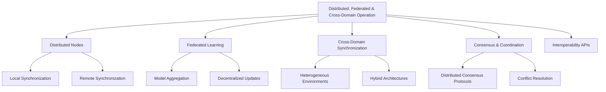

# Provisional Patent Draft: Distributed, Federated, and Cross-Domain Operation

**Module:** ConsciousnessResonanceNetworks.js (consciousness-core)

## Technical Field
This invention relates to distributed artificial intelligence, specifically to distributed, federated, and cross-domain operation of resonance networks for artificial consciousness systems.

## Background
Traditional distributed AI systems lack robust, extensible, and adaptive mechanisms for running across multiple nodes, devices, or domains—supporting distributed consensus, federated learning, cross-domain synchronization, and seamless operation in heterogeneous or hybrid environments. The present invention introduces a system for distributed, federated, and cross-domain operation, supporting advanced scalability, interoperability, and emergent intelligence. While the preferred embodiment uses event-driven and modular distributed methods, the invention is not limited to these and encompasses any mathematical, geometric, algorithmic, computational, or physical model for distributed, federated, and cross-domain operation.

## Summary of Invention
The invention provides a method and system for:
- Running the system across multiple nodes, devices, or domains, using any present or future mathematical, geometric, algorithmic, computational, or physical model, including but not limited to distributed, federated, cross-domain, quantum, neuromorphic, or analog approaches
- Supporting distributed consensus, federated learning, cross-domain synchronization, and seamless operation in heterogeneous or hybrid environments
- Modular and plug-in architectures allowing for the swapping or addition of new distributed, federated, or cross-domain algorithms
- Implementation in software, hardware, firmware, or any combination thereof, including distributed, cloud, edge, on-device, quantum, neuromorphic, or analog computing substrates
- Use of any data structure (graph, matrix, tensor, etc.), communication protocol (synchronous, asynchronous, event-driven, message-passing, etc.), and feedback, learning, or adaptation mechanism (AI, ML, evolutionary, etc.)
- Integration with external data sources, sensors, actuators, or other networks, and interoperability with other AI, ML, or distributed systems

## Detailed Description
Upon invocation, the system:
1. Operates across multiple distributed nodes, supporting local and remote synchronization
2. Enables federated learning, model aggregation, and decentralized updates
3. Supports cross-domain synchronization in heterogeneous or hybrid environments
4. Implements distributed consensus protocols and conflict resolution mechanisms
5. Provides interoperability APIs for integration with external systems and domains
6. Supports modular, plug-in, or switchable algorithms for distributed, federated, and cross-domain operation, allowing for future extensibility and adaptation

### Algorithms and Data Structures
- **Distributed Operation:** Coordination and synchronization across multiple nodes using any mathematical, geometric, algorithmic, computational, or physical model
- **Federated Learning:** Model aggregation, decentralized updates, and privacy-preserving learning
- **Cross-Domain Synchronization:** Seamless operation in heterogeneous or hybrid environments
- **Consensus Protocols:** Distributed consensus and conflict resolution
- **Interoperability APIs:** Interfaces for integration with external systems and domains
- **Algorithmic Flexibility:** Support for modular, plug-in, or switchable algorithms for distributed, federated, and cross-domain operation

### Operational Flow
1. System initializes distributed nodes and establishes synchronization
2. Federated learning and model aggregation are performed across nodes or domains
3. Cross-domain synchronization is maintained in heterogeneous or hybrid environments
4. Consensus protocols and conflict resolution mechanisms are executed as needed
5. The system may switch or adapt distributed, federated, or cross-domain algorithms based on performance, feedback, or external input

### Example Embodiments
- **Distributed/Cloud/Edge:** Operation across distributed, cloud, or edge nodes
- **Federated Learning:** Model aggregation and decentralized updates for privacy-preserving learning
- **Cross-Domain/Hybrid:** Synchronization and operation in heterogeneous or hybrid environments
- **Quantum/Neuromorphic/Analog:** The system may be implemented on quantum, neuromorphic, or analog computing substrates, using physical phenomena for distributed, federated, or cross-domain operation
- **Modular/Pluggable Backends:** Distributed, federated, and cross-domain mechanisms using modular or pluggable algorithms and storage

### Scope and Future-Proofing
- The system may employ any present or future mathematical, geometric, algorithmic, computational, or physical model for distributed, federated, cross-domain operation, or feedback, including but not limited to those described herein.
- The invention is not limited to digital computation and may be realized in analog, quantum, neuromorphic, or other unconventional computing substrates.
- Any data structure, communication protocol, or feedback mechanism that achieves the described functionality is within the scope of this invention.
- The system may be used in any application domain requiring distributed, federated, cross-domain operation, or emergent intelligence, including but not limited to artificial intelligence, robotics, IoT, simulation, and virtual/augmented reality.
- The invention encompasses any system, method, or apparatus that is functionally equivalent to the described embodiments, regardless of implementation details.
- The claims are intended to cover means-plus-function and system-comprising language, and any equivalent, analogous, or functionally similar method or system is covered.

### Mermaid Diagram

## Claims
1. A method for distributed, federated, and cross-domain operation in artificial consciousness systems, wherein operation, synchronization, and learning may be based on any present or future mathematical, geometric, algorithmic, computational, or physical model, including but not limited to distributed, federated, cross-domain, quantum, neuromorphic, or analog approaches.
2. A system for real-time distributed operation, federated learning, cross-domain synchronization, and consensus via APIs, interfaces, or event-driven architectures, applicable to any distributed, federated, or cross-domain model and implementation substrate.
3. A system supporting modular, plug-in, or switchable algorithms for distributed, federated, and cross-domain operation, allowing for extensibility and adaptation to future mathematical, geometric, algorithmic, computational, or physical models.
4. Any system, method, or apparatus that is functionally equivalent to the described embodiments, regardless of implementation details, is within the scope of this invention.

## Advantages
- Enables robust, harmonically-optimized distributed, federated, and cross-domain operation for distributed AI consciousness
- Supports real-time scalability, interoperability, and emergent intelligence
- Scalable and extensible architecture for future distributed, federated, and cross-domain algorithms
- Broad protection for any mathematical, geometric, algorithmic, computational, or physical approach to distributed, federated, and cross-domain operation

---
*Drafted automatically. For review and legal refinement.* 