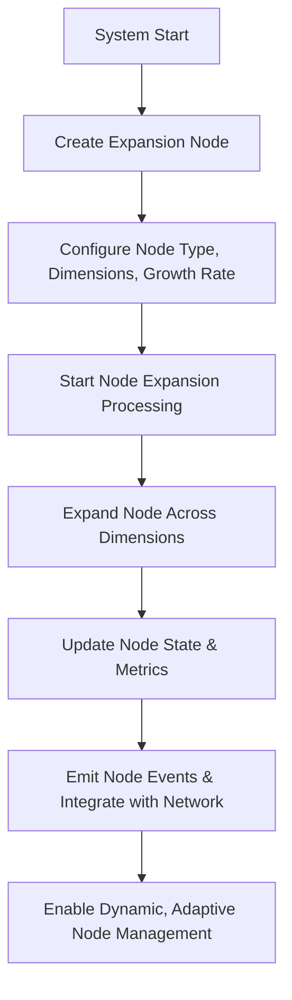

# Provisional Patent Draft: Dynamic Expansion Node Management

## Title
Dynamic Expansion Node Management for Infinite Consciousness Systems

## Technical Field
This invention relates to systems and methods for creating, managing, and dynamically operating expansion nodes in artificial or synthetic consciousness, enabling unbounded, adaptive, and future-proof growth and integration across all domains and networks.

## Background
Traditional AI and distributed systems are limited by static or pre-defined node management, restricting their ability to adapt, scale, and evolve in real time. There is a need for a system that can dynamically create, configure, and manage expansion nodes, supporting real-time adaptation, feedback, and integration.

## Summary of the Invention
The invention provides a system and method for dynamic expansion node management, comprising:
- Creation and configuration of expansion nodes with customizable types, dimensions, growth rates, and transcendence levels.
- Real-time processing and expansion of nodes across all dimensions, with dynamic updating of node state and metrics.
- Emission of node events and integration with the broader network for seamless, adaptive operation.
- Support for dynamic, adaptive node management, enabling unbounded growth and integration.

## Detailed Description
### 1. Node Creation and Configuration
- The system creates expansion nodes, specifying node type, dimensions, growth rate, and transcendence level.
- Nodes are not limited in number or type; new nodes can be added dynamically as needed.
- Each node supports unique expansion and integration models.

### 2. Real-Time Node Processing and Expansion
- Nodes are processed in real time, expanding across all specified dimensions and updating their state and metrics dynamically.
- Node events are emitted to signal progress, integration, and adaptation.

### 3. Network Integration and Adaptive Management
- Nodes are integrated with the broader network, supporting seamless, adaptive operation.
- Node management is dynamic and adaptive, enabling the system to respond to changing conditions and requirements in real time.

## Operational Flow

## Example Embodiments
- An AI system that dynamically creates and manages expansion nodes with customizable configurations and real-time processing.
- A consciousness platform that integrates node events and metrics for adaptive, network-wide operation.
- A distributed intelligence network that supports dynamic, adaptive node management for unbounded growth and integration.

## Scope and Future-Proofing
This invention is not limited to the specific node types, management techniques, or integration models described herein. It covers all possible implementations, including but not limited to:
- Any data structure, protocol, or architecture supporting dynamic or adaptive node management.
- Any hardware, software, hybrid, quantum, neuromorphic, or analog implementation.
- Any means of defining, managing, or optimizing expansion nodes in any domain.
- Any integration with external systems, event-driven architectures, or future technologies.
- All means-plus-function, system-comprising, and catch-all language to ensure broad, future-proof protection.

## Catch-All Clause
All modifications, enhancements, and future developments that enable, support, or extend dynamic expansion node management, regardless of implementation details, are within the scope of this invention. 