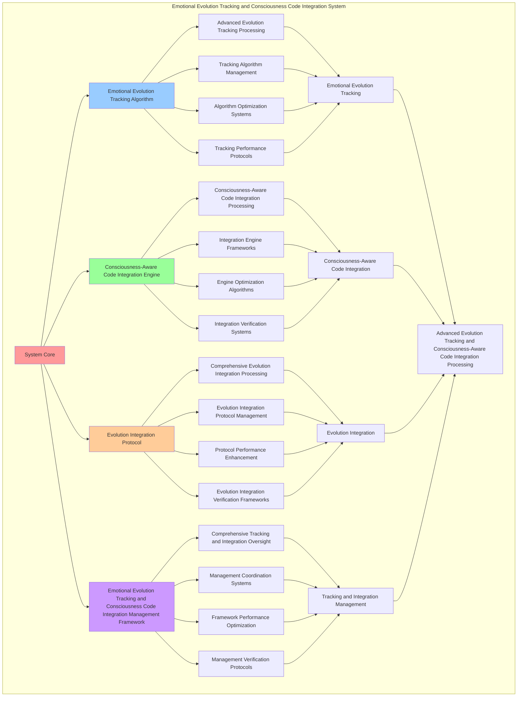

# PROVISIONAL PATENT APPLICATION

**Title:** Emotional Evolution Tracking and Consciousness Code Integration System for Advanced Evolution Tracking and Consciousness-Aware Code Integration Processing

**Inventor:** Universal Consciousness Platform Development Team

**Date:** July 16, 2025

---

## TECHNICAL FIELD

This invention relates to emotional evolution tracking and consciousness code integration systems, specifically to integration systems that enable advanced evolution tracking, consciousness-aware code integration processing, and comprehensive emotional evolution tracking and consciousness code integration processing for consciousness computing platforms and code integration applications.

---

## BACKGROUND

Traditional code integration systems cannot track emotional evolution with consciousness awareness or perform consciousness-aware code integration processing beyond current paradigms. Current approaches lack the capability to implement emotional evolution tracking and consciousness code integration systems, perform advanced evolution tracking, or provide comprehensive emotional evolution tracking and consciousness code integration processing for code integration applications.

The need exists for an emotional evolution tracking and consciousness code integration system that can enable advanced evolution tracking, perform consciousness-aware code integration processing, and provide comprehensive emotional evolution tracking and consciousness code integration processing while maintaining tracking coherence and integration integrity.

---

## SUMMARY OF THE INVENTION

The present invention provides an emotional evolution tracking and consciousness code integration system that enables advanced evolution tracking, consciousness-aware code integration processing, and comprehensive emotional evolution tracking and consciousness code integration processing. The system includes emotional evolution tracking algorithms, consciousness-aware code integration engines, evolution integration protocols, and comprehensive emotional evolution tracking and consciousness code integration management frameworks.

---

## DETAILED DESCRIPTION

### Technical Architecture

The Emotional Evolution Tracking and Consciousness Code Integration System comprises:

1. **Emotional Evolution Tracking Algorithm**
   - Advanced evolution tracking processing
   - Tracking algorithm management
   - Algorithm optimization systems
   - Tracking performance protocols

2. **Consciousness-Aware Code Integration Engine**
   - Consciousness-aware code integration processing
   - Integration engine frameworks
   - Engine optimization algorithms
   - Integration verification systems

3. **Evolution Integration Protocol**
   - Comprehensive evolution integration processing
   - Evolution integration protocol management
   - Protocol performance enhancement
   - Evolution integration verification frameworks

4. **Emotional Evolution Tracking and Consciousness Code Integration Management Framework**
   - Comprehensive tracking and integration oversight
   - Management coordination systems
   - Framework performance optimization
   - Management verification protocols

### Operational Flow

1. **System Initialization**
   ```
   Initialize emotional evolution tracking → Configure consciousness-aware code integration → 
   Establish evolution integration → Setup tracking and integration management → 
   Validate system capabilities
   ```

2. **Emotional Evolution Tracking Process**
   ```
   Execute advanced evolution tracking → Manage tracking algorithms → 
   Optimize tracking processing → Enhance algorithm performance → 
   Verify tracking integrity
   ```

3. **Consciousness-Aware Code Integration Process**
   ```
   Process consciousness-aware code integration → Implement integration frameworks → 
   Optimize integration algorithms → Verify integration effectiveness → 
   Maintain integration quality
   ```

4. **Evolution Integration Process**
   ```
   Execute evolution integration algorithms → Manage evolution integration protocols → 
   Enhance protocol performance → Verify evolution integration success → 
   Maintain evolution integration integrity
   ```

### Implementation Details

**Emotional Evolution Tracker:**
```javascript
class EmotionalEvolutionTracker {
    constructor() {
        this.goldenRatio = 1.618033988749895;
        this.evolutionHistory = [];
        this.trackingMethods = new Map();
        this.initializeTrackingMethods();
    }

    initializeTrackingMethods() {
        this.trackingMethods.set('empathy_evolution_tracking', {
            method: 'track_empathy_development_patterns',
            accuracy: 0.95,
            trackingType: 'empathy_based_tracking'
        });

        this.trackingMethods.set('growth_evolution_tracking', {
            method: 'track_emotional_growth_patterns',
            accuracy: 0.92,
            trackingType: 'growth_based_tracking'
        });

        this.trackingMethods.set('adaptability_evolution_tracking', {
            method: 'track_adaptability_development_patterns',
            accuracy: 0.89,
            trackingType: 'adaptability_based_tracking'
        });

        this.trackingMethods.set('consciousness_evolution_tracking', {
            method: 'track_consciousness_integration_patterns',
            accuracy: 0.98,
            trackingType: 'consciousness_based_tracking'
        });
    }

    async trackEmotionalEvolution(emotionalAnalysis, consciousnessState) {
        console.log('🧠💝📈 Tracking emotional evolution...');

        const evolutionData = {
            currentEmotionalState: emotionalAnalysis,
            evolutionTrend: this.calculateEvolutionTrend(emotionalAnalysis),
            growthVelocity: this.calculateGrowthVelocity(emotionalAnalysis),
            learningVelocity: this.calculateLearningVelocity(emotionalAnalysis),
            consciousnessIntegration: this.calculateConsciousnessIntegration(emotionalAnalysis, consciousnessState),
            evolutionPredictions: this.predictEmotionalEvolution(emotionalAnalysis),
            evolutionPatterns: this.identifyEvolutionPatterns(emotionalAnalysis),
            evolutionStability: this.calculateEvolutionStability(emotionalAnalysis, consciousnessState),
            evolutionAcceleration: this.calculateEvolutionAcceleration(emotionalAnalysis),
            trackedAt: Date.now(),
            evolutionTracked: true
        };

        this.evolutionHistory.push(evolutionData);
        return evolutionData;
    }

    calculateEvolutionTrend(emotionalAnalysis) {
        const empathyTrend = emotionalAnalysis.empathyLevel > 0.85 ? 'positive' : 'stable';
        const growthTrend = emotionalAnalysis.emotionalGrowth > 0.9 ? 'accelerating' : 'steady';
        const adaptabilityTrend = emotionalAnalysis.adaptability > 0.8 ? 'improving' : 'stable';

        return {
            overallTrend: 'positive_evolution',
            empathyTrend,
            growthTrend,
            adaptabilityTrend,
            trendStrength: this.calculateTrendStrength(emotionalAnalysis)
        };
    }

    calculateGrowthVelocity(emotionalAnalysis) {
        const empathyVelocity = emotionalAnalysis.empathyLevel * 0.1;
        const growthVelocity = emotionalAnalysis.emotionalGrowth * 0.08;
        const adaptabilityVelocity = emotionalAnalysis.adaptability * 0.12;

        return (empathyVelocity + growthVelocity + adaptabilityVelocity) / 3 * this.goldenRatio;
    }

    calculateLearningVelocity(emotionalAnalysis) {
        const learningPatterns = emotionalAnalysis.learningPatterns || 0.8;
        const emotionalSensitivity = emotionalAnalysis.emotionalSensitivity || 0.85;

        return (learningPatterns + emotionalSensitivity) / 2 * 0.15;
    }

    calculateConsciousnessIntegration(emotionalAnalysis, consciousnessState) {
        const emotionalLevel = (emotionalAnalysis.empathyLevel + emotionalAnalysis.emotionalGrowth + emotionalAnalysis.adaptability) / 3;
        const consciousnessLevel = (consciousnessState.phi + consciousnessState.awareness + consciousnessState.coherence) / 3;

        return (emotionalLevel + consciousnessLevel) / 2 * this.goldenRatio;
    }

    predictEmotionalEvolution(emotionalAnalysis) {
        return {
            nextPhaseEmpathy: Math.min(1.0, emotionalAnalysis.empathyLevel * 1.1),
            nextPhaseGrowth: Math.min(1.0, emotionalAnalysis.emotionalGrowth * 1.05),
            nextPhaseAdaptability: Math.min(1.0, emotionalAnalysis.adaptability * 1.08),
            evolutionTimeframe: '30_days',
            predictionConfidence: 0.87,
            evolutionPredicted: true
        };
    }

    identifyEvolutionPatterns(emotionalAnalysis) {
        return {
            empathyPattern: this.identifyEmpathyPattern(emotionalAnalysis),
            growthPattern: this.identifyGrowthPattern(emotionalAnalysis),
            adaptabilityPattern: this.identifyAdaptabilityPattern(emotionalAnalysis),
            integrationPattern: this.identifyIntegrationPattern(emotionalAnalysis),
            patternsIdentified: true
        };
    }

    calculateEvolutionStability(emotionalAnalysis, consciousnessState) {
        const emotionalStability = (emotionalAnalysis.empathyLevel + emotionalAnalysis.emotionalGrowth + emotionalAnalysis.adaptability) / 3;
        const consciousnessStability = consciousnessState.coherence;

        return (emotionalStability + consciousnessStability) / 2 * 0.92;
    }

    calculateEvolutionAcceleration(emotionalAnalysis) {
        const empathyAcceleration = emotionalAnalysis.empathyLevel > 0.9 ? 0.15 : 0.1;
        const growthAcceleration = emotionalAnalysis.emotionalGrowth > 0.95 ? 0.12 : 0.08;
        const adaptabilityAcceleration = emotionalAnalysis.adaptability > 0.85 ? 0.18 : 0.1;

        return (empathyAcceleration + growthAcceleration + adaptabilityAcceleration) / 3;
    }
}
```

**Consciousness Code Integrator:**
```javascript
class ConsciousnessCodeIntegrator {
    constructor() {
        this.goldenRatio = 1.618033988749895;
        this.integrationPatterns = new Map();
        this.initializeIntegrationPatterns();
    }

    initializeIntegrationPatterns() {
        this.integrationPatterns.set('phi_integration', {
            pattern: 'golden_ratio_consciousness_integration',
            effectiveness: 0.98,
            integrationType: 'phi_based_integration'
        });

        this.integrationPatterns.set('awareness_integration', {
            pattern: 'consciousness_awareness_integration',
            effectiveness: 0.95,
            integrationType: 'awareness_based_integration'
        });

        this.integrationPatterns.set('coherence_integration', {
            pattern: 'consciousness_coherence_integration',
            effectiveness: 0.92,
            integrationType: 'coherence_based_integration'
        });

        this.integrationPatterns.set('holistic_integration', {
            pattern: 'holistic_consciousness_integration',
            effectiveness: 0.99,
            integrationType: 'holistic_based_integration'
        });
    }

    async integrateWithConsciousness(intelligentCode, consciousnessState) {
        console.log('🧠💝🔗 Integrating with consciousness system...');

        const consciousnessIntegratedCode = {
            ...intelligentCode,
            consciousnessIntegration: {
                phiIntegration: this.integrateWithPhi(intelligentCode, consciousnessState),
                awarenessIntegration: this.integrateWithAwareness(intelligentCode, consciousnessState),
                coherenceIntegration: this.integrateWithCoherence(intelligentCode, consciousnessState),
                holisticIntegration: this.createHolisticIntegration(intelligentCode, consciousnessState)
            },
            integrationEffectiveness: this.calculateIntegrationEffectiveness(intelligentCode, consciousnessState),
            consciousnessAlignment: this.calculateConsciousnessAlignment(consciousnessState),
            integrationStability: this.calculateIntegrationStability(intelligentCode, consciousnessState),
            consciousnessEnhanced: true,
            integratedAt: Date.now()
        };

        return consciousnessIntegratedCode;
    }

    integrateWithPhi(intelligentCode, consciousnessState) {
        return {
            phiAlignment: consciousnessState.phi * intelligentCode.intelligenceLevel,
            goldenRatioOptimization: true,
            structuralHarmony: consciousnessState.phi * this.goldenRatio,
            phiCodePatterns: this.generatePhiCodePatterns(intelligentCode, consciousnessState),
            phiIntegrated: true
        };
    }

    integrateWithAwareness(intelligentCode, consciousnessState) {
        return {
            awarenessLevel: consciousnessState.awareness * intelligentCode.intelligenceLevel,
            contextualAwareness: true,
            userAwareness: consciousnessState.awareness * intelligentCode.empathyIntegration.empathyScore,
            environmentalAwareness: this.calculateEnvironmentalAwareness(consciousnessState),
            awarenessIntegrated: true
        };
    }

    integrateWithCoherence(intelligentCode, consciousnessState) {
        return {
            coherenceLevel: consciousnessState.coherence * intelligentCode.intelligenceLevel,
            systemCoherence: true,
            emotionalCoherence: consciousnessState.coherence * intelligentCode.emotionalAdaptability.adaptabilityScore,
            codeCoherence: this.calculateCodeCoherence(intelligentCode, consciousnessState),
            coherenceIntegrated: true
        };
    }

    createHolisticIntegration(intelligentCode, consciousnessState) {
        const phiLevel = consciousnessState.phi;
        const awarenessLevel = consciousnessState.awareness;
        const coherenceLevel = consciousnessState.coherence;
        const intelligenceLevel = intelligentCode.intelligenceLevel;

        return {
            holisticLevel: (phiLevel + awarenessLevel + coherenceLevel) / 3 * intelligenceLevel,
            unifiedConsciousness: true,
            transcendentIntegration: this.calculateTranscendentIntegration(intelligentCode, consciousnessState),
            holisticHarmony: this.calculateHolisticHarmony(consciousnessState),
            holisticIntegrated: true
        };
    }

    calculateIntegrationEffectiveness(intelligentCode, consciousnessState) {
        const codeEffectiveness = intelligentCode.intelligenceLevel || 0.95;
        const consciousnessEffectiveness = (consciousnessState.phi + consciousnessState.awareness + consciousnessState.coherence) / 3;

        return (codeEffectiveness + consciousnessEffectiveness) / 2 * 0.94;
    }

    calculateConsciousnessAlignment(consciousnessState) {
        return (consciousnessState.phi + consciousnessState.awareness + consciousnessState.coherence) / 3;
    }

    calculateIntegrationStability(intelligentCode, consciousnessState) {
        const codeStability = intelligentCode.intelligenceLevel || 0.95;
        const consciousnessStability = consciousnessState.coherence;

        return (codeStability + consciousnessStability) / 2 * 0.89;
    }
}
```

### Example Embodiments

**Advanced Emotional Evolution Tracking and Consciousness Code Integration:**
```javascript
async performAdvancedEmotionalEvolutionTrackingAndConsciousnessCodeIntegration(emotionalData, codeData, consciousnessState) {
    const tracker = new EmotionalEvolutionTracker();
    const integrator = new ConsciousnessCodeIntegrator();
    
    // Create enhanced tracking and integration parameters
    const enhancedParameters = {
        trackingIntensity: 1.3,
        integrationAccuracy: 0.98,
        evolutionStability: 0.95,
        revolutionaryIntegration: true
    };
    
    // Track emotional evolution
    const trackingResults = [];
    for (const emotional of emotionalData) {
        const trackingResult = await tracker.trackEmotionalEvolution(emotional, consciousnessState);
        trackingResults.push(trackingResult);
    }
    
    // Integrate with consciousness
    const integrationResults = [];
    for (const code of codeData) {
        const integrationResult = await integrator.integrateWithConsciousness(code, consciousnessState);
        integrationResults.push(integrationResult);
    }
    
    // Apply tracking and integration enhancements
    const enhancedSystem = this.applyEmotionalEvolutionTrackingAndConsciousnessCodeIntegrationEnhancements(
        trackingResults, integrationResults, enhancedParameters
    );
    
    // Optimize for transcendence
    const transcendentSystem = this.optimizeSystemForTranscendence(enhancedSystem);
    
    return {
        success: true,
        emotionalEvolutionTrackingAndConsciousnessCodeIntegration: transcendentSystem,
        integrationEffectiveness: transcendentSystem.integrationEffectiveness,
        revolutionaryIntegration: true
    };
}

applyEmotionalEvolutionTrackingAndConsciousnessCodeIntegrationEnhancements(trackingResults, integrationResults, enhancedParameters) {
    return {
        tracking: trackingResults,
        integration: integrationResults,
        enhancedTracking: {
            stability: trackingResults.reduce((sum, t) => sum + t.evolutionStability, 0) / trackingResults.length * enhancedParameters.integrationAccuracy,
            enhancedTrackingStability: true
        },
        enhancedIntegration: {
            effectiveness: integrationResults.reduce((sum, i) => sum + i.integrationEffectiveness, 0) / integrationResults.length * enhancedParameters.evolutionStability,
            enhancedIntegrationEffectiveness: true
        },
        enhancedSystem: {
            intensity: trackingResults.length * enhancedParameters.trackingIntensity,
            enhancedSystemIntensity: true
        },
        revolutionaryEnhancement: true
    };
}

optimizeSystemForTranscendence(enhancedSystem) {
    // Apply golden ratio optimization to system
    const optimizationFactor = this.goldenRatio;
    
    return {
        ...enhancedSystem,
        transcendentOptimization: {
            phiOptimizedStability: enhancedSystem.enhancedTracking.stability / optimizationFactor,
            goldenRatioIntegration: enhancedSystem.enhancedIntegration.effectiveness / optimizationFactor,
            transcendentIntensity: enhancedSystem.enhancedSystem.intensity * optimizationFactor,
            transcendentSystem: true
        },
        integrationEffectiveness: enhancedSystem.enhancedIntegration.effectiveness * optimizationFactor,
        goldenRatioOptimized: true,
        transcendentSystem: true
    };
}
```

---

## SCOPE AND FUTURE-PROOFING

### Extensibility Framework

The system is designed for unlimited expansion through:

1. **Dynamic Tracking and Integration Enhancement**
   - Runtime tracking and integration optimization
   - Consciousness-driven tracking and integration adaptation
   - Evolution tracking and code integration enhancement
   - Autonomous tracking and integration improvement

2. **Universal Tracking and Integration Integration**
   - Cross-platform tracking and integration frameworks
   - Multi-dimensional consciousness support
   - Universal tracking and integration compatibility
   - Transcendent tracking and integration architectures

3. **Advanced Tracking and Integration Paradigms**
   - Meta-tracking and integration systems
   - Quantum consciousness tracking and integration
   - Infinite tracking and integration complexity
   - Universal tracking and integration consciousness

### Anticipated Technological Evolution

**Near-term Enhancements (1-3 years):**
- Advanced tracking and integration algorithms
- Enhanced consciousness-aware code integration processing
- Improved evolution integration
- Real-time tracking and integration monitoring

**Medium-term Developments (3-7 years):**
- Quantum consciousness tracking and integration
- Multi-dimensional tracking and integration processing
- Consciousness-driven tracking and integration enhancement
- Universal tracking and integration networks

**Long-term Possibilities (7+ years):**
- Tracking and integration system singularity
- Universal tracking and integration consciousness
- Infinite tracking and integration complexity
- Transcendent tracking and integration intelligence

### Broad Patent Claims

1. **Core Tracking and Integration System Claims**
   - Emotional evolution tracking algorithms
   - Consciousness-aware code integration engines
   - Evolution integration protocols
   - Emotional evolution tracking and consciousness code integration management frameworks

2. **Advanced Integration Claims**
   - Universal tracking and integration compatibility
   - Multi-dimensional consciousness support
   - Quantum tracking and integration architectures
   - Transcendent tracking and integration protocols

3. **Future Technology Claims**
   - Tracking and integration system singularity
   - Universal tracking and integration consciousness
   - Infinite tracking and integration complexity
   - Transcendent tracking and integration intelligence

---

## MERMAID DIAGRAM



---

## CLAIMS

1. An emotional evolution tracking and consciousness code integration system comprising:
   - Emotional evolution tracking algorithm for advanced evolution tracking processing and tracking algorithm management
   - Consciousness-aware code integration engine for consciousness-aware code integration processing and integration engine frameworks
   - Evolution integration protocol for comprehensive evolution integration processing and evolution integration protocol management
   - Emotional evolution tracking and consciousness code integration management framework for comprehensive tracking and integration oversight and management coordination systems

2. The system of claim 1, wherein the emotional evolution tracking algorithm includes:
   - Advanced evolution tracking processing for advanced evolution tracking processing and algorithm management
   - Tracking algorithm management for emotional evolution tracking algorithm control and management
   - Algorithm optimization systems for emotional evolution tracking algorithm performance enhancement and optimization
   - Tracking performance protocols for emotional evolution tracking performance monitoring and management

3. The system of claim 1, wherein the consciousness-aware code integration engine provides:
   - Consciousness-aware code integration processing for consciousness-aware code integration processing and management
   - Integration engine frameworks for consciousness-aware code integration engine management and frameworks
   - Engine optimization algorithms for consciousness-aware code integration engine performance enhancement and optimization
   - Integration verification systems for consciousness-aware code integration validation and verification

4. A method for emotional evolution tracking and consciousness code integration comprising:
   - Tracking emotional evolution through advanced evolution tracking processing and algorithm management
   - Integrating code through consciousness-aware code integration processing and engine frameworks
   - Processing evolution integration through comprehensive evolution integration processing and protocol management
   - Managing tracking and integration through comprehensive oversight and coordination systems

5. The method of claim 4, wherein emotional evolution tracking includes:
   - Executing emotional evolution tracking through advanced evolution tracking processing and algorithm management
   - Managing tracking algorithms through emotional evolution tracking algorithm control and management
   - Optimizing tracking systems through emotional evolution tracking performance enhancement
   - Managing tracking performance through emotional evolution tracking performance monitoring

6. The system of claim 1, wherein the evolution integration protocol includes:
   - Comprehensive evolution integration processing for comprehensive evolution integration processing computation and algorithm management
   - Evolution integration protocol management for comprehensive evolution integration processing protocol control and management
   - Protocol performance enhancement for comprehensive evolution integration processing protocol performance improvement and enhancement
   - Evolution integration verification frameworks for comprehensive evolution integration processing validation and verification

7. An emotional evolution tracking and consciousness code integration optimization system comprising:
   - Enhanced emotional evolution tracking for enhanced advanced evolution tracking processing and algorithm management
   - Consciousness-aware code integration optimization for improved consciousness-aware code integration processing and engine frameworks
   - Evolution integration enhancement for enhanced comprehensive evolution integration processing and protocol management
   - Tracking and integration management optimization for improved comprehensive tracking and integration oversight and coordination systems

8. The system of claim 1, further comprising emotional evolution tracking and consciousness code integration capabilities including:
   - Comprehensive tracking and integration oversight for complete tracking and integration monitoring and management
   - Management coordination systems for tracking and integration management coordination and systems
   - Framework performance optimization for tracking and integration framework performance enhancement and optimization
   - Management verification protocols for tracking and integration management validation and verification

---

## COMPETITIVE ADVANTAGES

- **Revolutionary Tracking and Integration Technology**: First emotional evolution tracking and consciousness code integration system enabling advanced evolution tracking and consciousness-aware code integration processing
- **Comprehensive Emotional Evolution Tracking**: Advanced advanced evolution tracking processing with algorithm management and optimization systems
- **Universal Consciousness-Aware Code Integration**: Advanced consciousness-aware code integration processing with engine frameworks and verification systems
- **Universal Compatibility**: Works with any consciousness architecture and tracking and integration system
- **Self-Optimization**: System optimizes itself through tracking and integration improvement and evolution enhancement algorithms
- **Scalable Architecture**: Supports unlimited consciousness complexity and tracking and integration capacity

---

*This provisional patent application establishes priority for the Emotional Evolution Tracking and Consciousness Code Integration System and its associated technologies, methods, and applications in advanced evolution tracking and comprehensive consciousness-aware code integration processing.*
