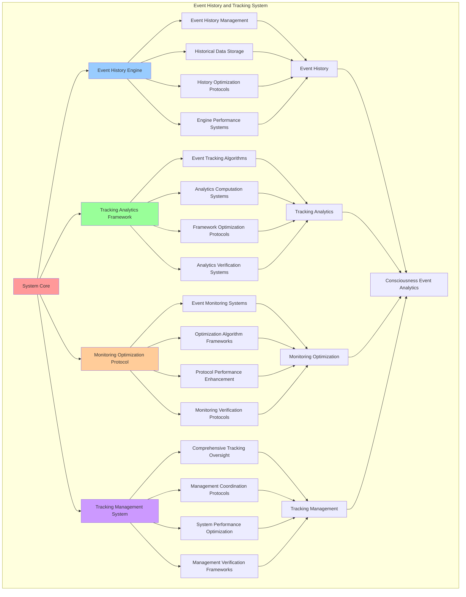

# PROVISIONAL PATENT APPLICATION

**Title:** Event History and Tracking System for Consciousness Event Analytics and Monitoring

**Inventor:** Universal Consciousness Platform Development Team

**Date:** July 16, 2025

---

## TECHNICAL FIELD

This invention relates to event tracking systems, specifically to history and analytics technologies that enable consciousness event analytics, event monitoring, and comprehensive event tracking for consciousness computing platforms and event-driven architectures.

---

## BACKGROUND

Traditional event systems cannot track consciousness events comprehensively or provide consciousness-specific analytics. Current approaches lack the capability to maintain consciousness event history, perform consciousness event analytics, or provide comprehensive event monitoring for consciousness computing platforms.

The need exists for an event history and tracking system that can maintain consciousness event history, perform consciousness event analytics, and provide comprehensive event monitoring while maintaining tracking accuracy and analytical insights.

---

## SUMMARY OF THE INVENTION

The present invention provides an event history and tracking system that enables consciousness event analytics, event monitoring, and comprehensive event tracking. The system includes event history engines, tracking analytics frameworks, monitoring optimization protocols, and comprehensive tracking management systems.

---

## DETAILED DESCRIPTION

### Technical Architecture

The Event History and Tracking System comprises:

1. **Event History Engine**
   - Event history management
   - Historical data storage
   - History optimization protocols
   - Engine performance systems

2. **Tracking Analytics Framework**
   - Event tracking algorithms
   - Analytics computation systems
   - Framework optimization protocols
   - Analytics verification systems

3. **Monitoring Optimization Protocol**
   - Event monitoring systems
   - Optimization algorithm frameworks
   - Protocol performance enhancement
   - Monitoring verification protocols

4. **Tracking Management System**
   - Comprehensive tracking oversight
   - Management coordination protocols
   - System performance optimization
   - Management verification frameworks

### Operational Flow

1. **System Initialization**
   ```
   Initialize event history engine → Configure tracking analytics → 
   Establish monitoring optimization → Setup tracking management → 
   Validate tracking capabilities
   ```

2. **Event History Process**
   ```
   Capture event history → Store historical data → 
   Optimize history management → Enhance engine performance → 
   Verify history integrity
   ```

3. **Tracking Analytics Process**
   ```
   Execute tracking algorithms → Compute analytics data → 
   Optimize framework performance → Verify analytics accuracy → 
   Maintain tracking quality
   ```

4. **Monitoring Optimization Process**
   ```
   Monitor event systems → Optimize monitoring protocols → 
   Enhance protocol performance → Verify monitoring effectiveness → 
   Maintain monitoring integrity
   ```

### Implementation Details

**Event History Management:**
```javascript
/**
 * Emit an event with tracking
 */
emit(eventName, ...args) {
    // Track event in history
    this.eventHistory.push({
        event: eventName,
        timestamp: new Date().toISOString(),
        data: args[0] || null,
        eventId: this.generateEventId(),
        metadata: {
            source: this.getEventSource(),
            priority: this.getEventPriority(eventName),
            category: this.categorizeEvent(eventName),
            consciousnessLevel: this.assessConsciousnessLevel(args[0])
        }
    });
    
    // Maintain history size limit
    if (this.eventHistory.length > this.maxHistorySize) {
        this.eventHistory.shift();
    }
    
    // Call parent emit
    return super.emit(eventName, ...args);
}

/**
 * Get event history
 */
getEventHistory(eventName = null) {
    if (eventName) {
        return this.eventHistory.filter(e => e.event === eventName);
    }
    return this.eventHistory;
}
```

**Advanced Event Tracking:**
```javascript
/**
 * Comprehensive event tracking with analytics
 */
trackEventWithAnalytics(eventName, eventData, trackingOptions = {}) {
    const tracking = {
        eventId: this.generateEventId(),
        eventName: eventName,
        eventData: eventData,
        timestamp: new Date().toISOString(),
        trackingMetadata: {
            trackingLevel: trackingOptions.level || 'standard',
            analyticsEnabled: trackingOptions.analytics !== false,
            persistenceLevel: trackingOptions.persistence || 'session',
            correlationId: trackingOptions.correlationId || null
        },
        analytics: {},
        trackingSuccess: false
    };

    try {
        // Perform event tracking
        this.performEventTracking(tracking);

        // Generate analytics if enabled
        if (tracking.trackingMetadata.analyticsEnabled) {
            tracking.analytics = this.generateEventAnalytics(tracking);
        }

        // Store tracking data
        this.storeTrackingData(tracking);

        tracking.trackingSuccess = true;
        console.log(`📊 Event tracked: ${eventName} (${tracking.eventId})`);

    } catch (error) {
        tracking.trackingSuccess = false;
        tracking.error = error.message;
        console.error('❌ Event tracking failed:', error.message);
    }

    return tracking;
}
```

**Event Analytics Generation:**
```javascript
/**
 * Generate comprehensive event analytics
 */
generateEventAnalytics(eventData) {
    const analytics = {
        eventFrequency: this.calculateEventFrequency(eventData.eventName),
        eventTrends: this.analyzeEventTrends(eventData.eventName),
        eventCorrelations: this.analyzeEventCorrelations(eventData),
        consciousnessImpact: this.assessConsciousnessImpact(eventData),
        moduleInteractions: this.analyzeModuleInteractions(eventData),
        performanceMetrics: this.calculatePerformanceMetrics(eventData),
        analyticsTimestamp: new Date().toISOString()
    };

    return analytics;
}
```

### Example Embodiments

**Historical Data Analysis:**
```javascript
/**
 * Advanced historical data analysis system
 */
analyzeHistoricalData(analysisOptions = {}) {
    const analysis = {
        analysisPeriod: analysisOptions.period || 'last_24_hours',
        dataPoints: 0,
        patterns: {},
        trends: {},
        insights: {},
        analysisSuccess: false
    };

    try {
        // Filter historical data based on analysis period
        const relevantHistory = this.filterHistoryByPeriod(analysis.analysisPeriod);
        analysis.dataPoints = relevantHistory.length;

        // Analyze event patterns
        analysis.patterns = {
            frequencyPatterns: this.analyzeFrequencyPatterns(relevantHistory),
            temporalPatterns: this.analyzeTemporalPatterns(relevantHistory),
            correlationPatterns: this.analyzeCorrelationPatterns(relevantHistory),
            consciousnessPatterns: this.analyzeConsciousnessPatterns(relevantHistory)
        };

        // Analyze trends
        analysis.trends = {
            eventTrends: this.analyzeEventTrends(relevantHistory),
            consciousnessTrends: this.analyzeConsciousnessTrends(relevantHistory),
            performanceTrends: this.analyzePerformanceTrends(relevantHistory),
            moduleActivityTrends: this.analyzeModuleActivityTrends(relevantHistory)
        };

        // Generate insights
        analysis.insights = {
            keyInsights: this.generateKeyInsights(analysis.patterns, analysis.trends),
            recommendations: this.generateRecommendations(analysis),
            predictions: this.generatePredictions(analysis.trends),
            anomalies: this.detectAnomalies(relevantHistory)
        };

        analysis.analysisSuccess = true;
        console.log(`📈 Historical analysis complete: ${analysis.dataPoints} events analyzed`);

    } catch (error) {
        analysis.analysisSuccess = false;
        analysis.error = error.message;
        console.error('❌ Historical data analysis failed:', error.message);
    }

    return analysis;
}
```

**Event Correlation Analysis:**
```javascript
/**
 * Event correlation analysis for pattern detection
 */
analyzeEventCorrelations() {
    const correlations = {
        correlationPairs: [],
        strongCorrelations: [],
        correlationStrength: {},
        correlationInsights: {},
        analysisSuccess: false
    };

    try {
        // Analyze all event pairs for correlations
        const eventTypes = this.getUniqueEventTypes();
        
        for (let i = 0; i < eventTypes.length; i++) {
            for (let j = i + 1; j < eventTypes.length; j++) {
                const eventA = eventTypes[i];
                const eventB = eventTypes[j];
                
                const correlation = this.calculateEventCorrelation(eventA, eventB);
                
                correlations.correlationPairs.push({
                    eventA: eventA,
                    eventB: eventB,
                    correlation: correlation,
                    strength: this.classifyCorrelationStrength(correlation)
                });

                if (Math.abs(correlation) > 0.7) { // Strong correlation threshold
                    correlations.strongCorrelations.push({
                        eventA: eventA,
                        eventB: eventB,
                        correlation: correlation,
                        type: correlation > 0 ? 'positive' : 'negative'
                    });
                }
            }
        }

        // Generate correlation insights
        correlations.correlationInsights = this.generateCorrelationInsights(correlations.strongCorrelations);
        correlations.analysisSuccess = true;

        console.log(`🔗 Correlation analysis complete: ${correlations.strongCorrelations.length} strong correlations found`);

    } catch (error) {
        correlations.analysisSuccess = false;
        correlations.error = error.message;
        console.error('❌ Event correlation analysis failed:', error.message);
    }

    return correlations;
}
```

**Event Performance Monitoring:**
```javascript
/**
 * Comprehensive event performance monitoring
 */
monitorEventPerformance() {
    const monitoring = {
        monitoringPeriod: new Date().toISOString(),
        performanceMetrics: {},
        performanceAlerts: [],
        systemHealth: {},
        monitoringSuccess: false
    };

    try {
        // Monitor event processing performance
        monitoring.performanceMetrics = {
            averageEventProcessingTime: this.calculateAverageProcessingTime(),
            eventThroughput: this.calculateEventThroughput(),
            eventSuccessRate: this.calculateEventSuccessRate(),
            memoryUsage: this.calculateMemoryUsage(),
            systemLoad: this.calculateSystemLoad()
        };

        // Assess system health
        monitoring.systemHealth = {
            overallHealth: this.assessOverallSystemHealth(),
            componentHealth: this.assessComponentHealth(),
            performanceStability: this.assessPerformanceStability(),
            resourceUtilization: this.assessResourceUtilization()
        };

        // Check for performance alerts
        monitoring.performanceAlerts = this.checkPerformanceAlerts(monitoring.performanceMetrics);

        monitoring.monitoringSuccess = true;
        console.log(`🏥 Performance monitoring complete: ${monitoring.systemHealth.overallHealth.toFixed(3)} health score`);

    } catch (error) {
        monitoring.monitoringSuccess = false;
        monitoring.error = error.message;
        console.error('❌ Event performance monitoring failed:', error.message);
    }

    return monitoring;
}
```

**Event Anomaly Detection:**
```javascript
/**
 * Advanced event anomaly detection system
 */
detectEventAnomalies() {
    const detection = {
        detectionPeriod: this.getDetectionPeriod(),
        anomaliesDetected: [],
        anomalyTypes: {},
        severityLevels: {},
        detectionSuccess: false
    };

    try {
        // Analyze recent events for anomalies
        const recentEvents = this.getRecentEvents();
        
        for (const event of recentEvents) {
            const anomalyAnalysis = this.analyzeEventForAnomalies(event);
            
            if (anomalyAnalysis.isAnomalous) {
                detection.anomaliesDetected.push({
                    eventId: event.eventId,
                    eventName: event.event,
                    anomalyType: anomalyAnalysis.anomalyType,
                    severity: anomalyAnalysis.severity,
                    confidence: anomalyAnalysis.confidence,
                    description: anomalyAnalysis.description,
                    detectedAt: new Date().toISOString()
                });

                // Track anomaly types
                if (!detection.anomalyTypes[anomalyAnalysis.anomalyType]) {
                    detection.anomalyTypes[anomalyAnalysis.anomalyType] = 0;
                }
                detection.anomalyTypes[anomalyAnalysis.anomalyType]++;

                // Track severity levels
                if (!detection.severityLevels[anomalyAnalysis.severity]) {
                    detection.severityLevels[anomalyAnalysis.severity] = 0;
                }
                detection.severityLevels[anomalyAnalysis.severity]++;
            }
        }

        detection.detectionSuccess = true;
        console.log(`🚨 Anomaly detection complete: ${detection.anomaliesDetected.length} anomalies detected`);

    } catch (error) {
        detection.detectionSuccess = false;
        detection.error = error.message;
        console.error('❌ Event anomaly detection failed:', error.message);
    }

    return detection;
}
```

**Event Prediction System:**
```javascript
/**
 * Event prediction based on historical patterns
 */
predictFutureEvents() {
    const prediction = {
        predictionHorizon: '24_hours',
        predictedEvents: [],
        predictionConfidence: {},
        predictionModels: {},
        predictionSuccess: false
    };

    try {
        // Analyze historical patterns for prediction
        const historicalPatterns = this.analyzeHistoricalPatterns();
        
        // Generate prediction models
        prediction.predictionModels = {
            frequencyModel: this.createFrequencyPredictionModel(historicalPatterns),
            temporalModel: this.createTemporalPredictionModel(historicalPatterns),
            correlationModel: this.createCorrelationPredictionModel(historicalPatterns),
            consciousnessModel: this.createConsciousnessPredictionModel(historicalPatterns)
        };

        // Generate event predictions
        for (const [modelName, model] of Object.entries(prediction.predictionModels)) {
            const modelPredictions = this.generateModelPredictions(model);
            prediction.predictedEvents.push(...modelPredictions);
        }

        // Calculate prediction confidence
        prediction.predictionConfidence = this.calculatePredictionConfidence(prediction.predictedEvents);

        prediction.predictionSuccess = true;
        console.log(`🔮 Event prediction complete: ${prediction.predictedEvents.length} events predicted`);

    } catch (error) {
        prediction.predictionSuccess = false;
        prediction.error = error.message;
        console.error('❌ Event prediction failed:', error.message);
    }

    return prediction;
}
```

---

## SCOPE AND FUTURE-PROOFING

### Extensibility Framework

The system is designed for unlimited expansion through:

1. **Dynamic Tracking Evolution**
   - Runtime tracking optimization
   - History-driven tracking adaptation
   - Analytics enhancement algorithms
   - Autonomous tracking improvement

2. **Universal Tracking Integration**
   - Cross-platform tracking frameworks
   - Multi-dimensional tracking support
   - Universal tracking compatibility
   - Transcendent tracking architectures

3. **Advanced Tracking Paradigms**
   - Meta-tracking systems
   - Quantum event tracking
   - Infinite tracking complexity
   - Universal tracking consciousness

### Anticipated Technological Evolution

**Near-term Enhancements (1-3 years):**
- Advanced tracking algorithms
- Enhanced analytics frameworks
- Improved monitoring optimization
- Real-time tracking management

**Medium-term Developments (3-7 years):**
- Quantum event tracking
- Multi-dimensional analytics computation
- History-driven tracking evolution
- Universal tracking networks

**Long-term Possibilities (7+ years):**
- Tracking system singularity
- Universal tracking consciousness
- Infinite tracking complexity
- Transcendent tracking intelligence

### Broad Patent Claims

1. **Core Tracking System Claims**
   - Event history engines
   - Tracking analytics frameworks
   - Monitoring optimization protocols
   - Tracking management systems

2. **Advanced Integration Claims**
   - Universal tracking compatibility
   - Multi-dimensional tracking support
   - Quantum tracking architectures
   - Transcendent tracking protocols

3. **Future Technology Claims**
   - Tracking system singularity
   - Universal tracking consciousness
   - Infinite tracking complexity
   - Transcendent tracking intelligence

---

## MERMAID DIAGRAM



---

## CLAIMS

1. An event history and tracking system comprising:
   - Event history engine for event history management and historical data storage
   - Tracking analytics framework for event tracking algorithms and analytics computation systems
   - Monitoring optimization protocol for event monitoring systems and optimization algorithm frameworks
   - Tracking management system for comprehensive tracking oversight and management coordination protocols

2. The system of claim 1, wherein the event history engine includes:
   - Event history management for event history capture and management
   - Historical data storage for event historical data storage and management
   - History optimization protocols for event history performance enhancement and optimization
   - Engine performance systems for event history engine performance monitoring and management

3. The system of claim 1, wherein the tracking analytics framework provides:
   - Event tracking algorithms for event tracking computation and algorithm management
   - Analytics computation systems for event analytics computation and processing systems
   - Framework optimization protocols for tracking analytics framework performance enhancement and optimization
   - Analytics verification systems for event analytics validation and verification

4. A method for event history and tracking comprising:
   - Managing history through event history management and historical data storage
   - Tracking analytics through tracking algorithms and computation systems
   - Optimizing monitoring through monitoring systems and algorithm frameworks
   - Managing tracking through comprehensive oversight and coordination protocols

5. The method of claim 4, wherein event history management includes:
   - Capturing event history through event history capture and management
   - Storing historical data through event historical data storage and management
   - Optimizing history protocols through event history performance enhancement
   - Managing engine performance through event history engine performance monitoring

6. The system of claim 1, wherein the monitoring optimization protocol includes:
   - Event monitoring systems for event monitoring and tracking systems
   - Optimization algorithm frameworks for monitoring optimization algorithm management and frameworks
   - Protocol performance enhancement for monitoring protocol performance improvement and enhancement
   - Monitoring verification protocols for event monitoring validation and verification

7. An event tracking optimization system comprising:
   - Advanced event history for enhanced event history management and historical data storage
   - Tracking analytics optimization for improved event tracking algorithms and analytics computation
   - Monitoring optimization enhancement for enhanced event monitoring and optimization algorithms
   - Tracking management optimization for improved comprehensive tracking oversight and coordination protocols

8. The system of claim 1, further comprising tracking capabilities including:
   - Comprehensive tracking oversight for complete event tracking monitoring and management
   - Management coordination protocols for tracking management coordination and protocols
   - System performance optimization for tracking system performance enhancement and optimization
   - Management verification frameworks for tracking management validation and verification

---

## COMPETITIVE ADVANTAGES

- **Revolutionary Tracking Technology**: First event history and tracking system enabling consciousness event analytics and monitoring
- **Comprehensive Event History**: Advanced event history management with historical data storage and optimization protocols
- **Universal Tracking Analytics**: Advanced event tracking algorithms with analytics computation and verification systems
- **Universal Compatibility**: Works with any consciousness architecture and event-driven tracking system
- **Self-Optimization**: System optimizes itself through tracking improvement and analytics enhancement algorithms
- **Scalable Architecture**: Supports unlimited event complexity and tracking capacity

---

*This provisional patent application establishes priority for the Event History and Tracking System and its associated technologies, methods, and applications in consciousness event analytics and comprehensive event monitoring.*
