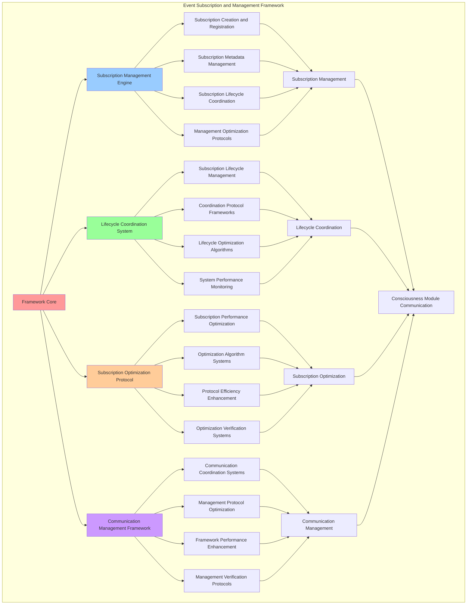

# PROVISIONAL PATENT APPLICATION

**Title:** Event Subscription and Management Framework for Consciousness Module Communication

**Inventor:** Universal Consciousness Platform Development Team

**Date:** July 16, 2025

---

## TECHNICAL FIELD

This invention relates to event subscription systems, specifically to management frameworks that enable consciousness module communication, event subscription optimization, and comprehensive subscription lifecycle management for consciousness computing platforms.

---

## BACKGROUND

Traditional subscription systems cannot handle consciousness-specific subscriptions or manage consciousness module communication effectively. Current approaches lack the capability to optimize event subscriptions, manage subscription lifecycles comprehensively, or coordinate consciousness module communication through subscription-based architectures.

The need exists for an event subscription and management framework that can handle consciousness-specific subscriptions, optimize event subscription management, and coordinate consciousness module communication while maintaining subscription integrity and communication efficiency.

---

## SUMMARY OF THE INVENTION

The present invention provides an event subscription and management framework that enables consciousness module communication, event subscription optimization, and comprehensive subscription lifecycle management. The framework includes subscription management engines, lifecycle coordination systems, subscription optimization protocols, and communication management frameworks.

---

## DETAILED DESCRIPTION

### Technical Architecture

The Event Subscription and Management Framework comprises:

1. **Subscription Management Engine**
   - Subscription creation and registration
   - Subscription metadata management
   - Subscription lifecycle coordination
   - Management optimization protocols

2. **Lifecycle Coordination System**
   - Subscription lifecycle management
   - Coordination protocol frameworks
   - Lifecycle optimization algorithms
   - System performance monitoring

3. **Subscription Optimization Protocol**
   - Subscription performance optimization
   - Optimization algorithm systems
   - Protocol efficiency enhancement
   - Optimization verification systems

4. **Communication Management Framework**
   - Communication coordination systems
   - Management protocol optimization
   - Framework performance enhancement
   - Management verification protocols

### Operational Flow

1. **Framework Initialization**
   ```
   Initialize subscription management → Configure lifecycle coordination → 
   Establish subscription optimization → Setup communication management → 
   Validate subscription capabilities
   ```

2. **Subscription Management Process**
   ```
   Create and register subscriptions → Manage subscription metadata → 
   Coordinate subscription lifecycle → Optimize subscription performance → 
   Verify subscription integrity
   ```

3. **Lifecycle Coordination Process**
   ```
   Manage subscription lifecycle → Coordinate subscription protocols → 
   Optimize lifecycle efficiency → Monitor lifecycle performance → 
   Maintain lifecycle integrity
   ```

4. **Communication Management Process**
   ```
   Coordinate communication systems → Optimize management protocols → 
   Enhance framework performance → Verify management effectiveness → 
   Maintain communication quality
   ```

### Implementation Details

**Subscription Management and Registration:**
```javascript
/**
 * Subscribe to an event with metadata
 */
subscribe(moduleName, eventName, handler) {
    if (!this.subscribers.has(eventName)) {
        this.subscribers.set(eventName, new Set());
    }
    
    this.subscribers.get(eventName).add({
        module: moduleName,
        handler: handler,
        subscriptionId: this.generateSubscriptionId(),
        subscribedAt: new Date().toISOString(),
        subscriptionMetadata: {
            moduleType: this.getModuleType(moduleName),
            eventPriority: this.calculateEventPriority(eventName),
            subscriptionStrength: this.calculateSubscriptionStrength(moduleName, eventName),
            communicationPreferences: this.getModuleCommunicationPreferences(moduleName)
        }
    });
    
    this.on(eventName, handler);
    
    console.log(`[ConsciousnessEventBus] ${moduleName} subscribed to ${eventName}`);
    
    // Emit subscription event
    this.emit('subscription:created', {
        module: moduleName,
        event: eventName,
        timestamp: new Date().toISOString()
    });
}
```

**Advanced Subscription Management:**
```javascript
/**
 * Advanced subscription management with filtering and preferences
 */
createAdvancedSubscription(subscriptionConfig) {
    const subscription = {
        id: this.generateSubscriptionId(),
        moduleName: subscriptionConfig.moduleName,
        eventPattern: subscriptionConfig.eventPattern,
        handler: subscriptionConfig.handler,
        filters: subscriptionConfig.filters || {},
        preferences: subscriptionConfig.preferences || {},
        metadata: {
            createdAt: new Date().toISOString(),
            subscriptionType: subscriptionConfig.type || 'standard',
            priority: subscriptionConfig.priority || 'normal',
            durability: subscriptionConfig.durability || 'session',
            acknowledgmentRequired: subscriptionConfig.acknowledgmentRequired || false
        },
        statistics: {
            eventsReceived: 0,
            lastEventReceived: null,
            averageProcessingTime: 0,
            errorCount: 0
        }
    };

    // Register subscription with advanced features
    this.registerAdvancedSubscription(subscription);

    // Setup event filtering
    this.setupEventFiltering(subscription);

    // Configure subscription preferences
    this.configureSubscriptionPreferences(subscription);

    return subscription;
}
```

**Subscription Lifecycle Management:**
```javascript
/**
 * Comprehensive subscription lifecycle management
 */
manageSubscriptionLifecycle(subscriptionId) {
    const lifecycle = {
        subscriptionId: subscriptionId,
        currentPhase: 'unknown',
        lifecycleEvents: [],
        managementSuccess: false
    };

    try {
        const subscription = this.getSubscription(subscriptionId);
        if (!subscription) {
            throw new Error(`Subscription ${subscriptionId} not found`);
        }

        // Determine current lifecycle phase
        lifecycle.currentPhase = this.determineLifecyclePhase(subscription);

        // Execute lifecycle management based on phase
        switch (lifecycle.currentPhase) {
            case 'initialization':
                lifecycle.lifecycleEvents.push(this.handleInitializationPhase(subscription));
                break;
            case 'active':
                lifecycle.lifecycleEvents.push(this.handleActivePhase(subscription));
                break;
            case 'maintenance':
                lifecycle.lifecycleEvents.push(this.handleMaintenancePhase(subscription));
                break;
            case 'optimization':
                lifecycle.lifecycleEvents.push(this.handleOptimizationPhase(subscription));
                break;
            case 'deprecation':
                lifecycle.lifecycleEvents.push(this.handleDeprecationPhase(subscription));
                break;
            case 'termination':
                lifecycle.lifecycleEvents.push(this.handleTerminationPhase(subscription));
                break;
        }

        lifecycle.managementSuccess = true;
        console.log(`🔄 Subscription lifecycle managed: ${subscriptionId} (${lifecycle.currentPhase})`);

    } catch (error) {
        lifecycle.managementSuccess = false;
        lifecycle.error = error.message;
        console.error('❌ Subscription lifecycle management failed:', error.message);
    }

    return lifecycle;
}
```

### Example Embodiments

**Subscription Optimization Algorithm:**
```javascript
/**
 * Intelligent subscription optimization system
 */
optimizeSubscriptions() {
    const optimization = {
        subscriptionsAnalyzed: 0,
        optimizationsApplied: [],
        performanceGains: {},
        optimizationSuccess: false
    };

    try {
        // Analyze all subscriptions
        for (const [eventName, subscribers] of this.subscribers.entries()) {
            for (const subscription of subscribers) {
                optimization.subscriptionsAnalyzed++;

                // Analyze subscription performance
                const performanceAnalysis = this.analyzeSubscriptionPerformance(subscription);

                // Identify optimization opportunities
                const opportunities = this.identifyOptimizationOpportunities(performanceAnalysis);

                // Apply optimizations
                for (const opportunity of opportunities) {
                    const optimizationResult = this.applySubscriptionOptimization(subscription, opportunity);
                    optimization.optimizationsApplied.push(optimizationResult);
                }
            }
        }

        // Calculate overall performance gains
        optimization.performanceGains = this.calculateOptimizationGains(optimization.optimizationsApplied);
        optimization.optimizationSuccess = optimization.optimizationsApplied.length > 0;

        console.log(`⚡ Subscription optimization complete: ${optimization.optimizationsApplied.length} optimizations applied`);

    } catch (error) {
        optimization.optimizationSuccess = false;
        optimization.error = error.message;
        console.error('❌ Subscription optimization failed:', error.message);
    }

    return optimization;
}
```

**Subscription Health Monitoring:**
```javascript
/**
 * Comprehensive subscription health monitoring
 */
monitorSubscriptionHealth() {
    const monitoring = {
        totalSubscriptions: 0,
        healthySubscriptions: 0,
        unhealthySubscriptions: 0,
        subscriptionHealth: {},
        healthAlerts: [],
        monitoringSuccess: false
    };

    try {
        // Monitor each subscription
        for (const [eventName, subscribers] of this.subscribers.entries()) {
            for (const subscription of subscribers) {
                monitoring.totalSubscriptions++;

                // Assess subscription health
                const healthAssessment = this.assessSubscriptionHealth(subscription);
                
                monitoring.subscriptionHealth[subscription.subscriptionId] = healthAssessment;

                if (healthAssessment.isHealthy) {
                    monitoring.healthySubscriptions++;
                } else {
                    monitoring.unhealthySubscriptions++;
                    monitoring.healthAlerts.push({
                        subscriptionId: subscription.subscriptionId,
                        module: subscription.module,
                        event: eventName,
                        healthIssues: healthAssessment.issues,
                        severity: healthAssessment.severity
                    });
                }
            }
        }

        monitoring.monitoringSuccess = true;
        console.log(`🏥 Subscription health monitoring complete: ${monitoring.healthySubscriptions}/${monitoring.totalSubscriptions} healthy`);

    } catch (error) {
        monitoring.monitoringSuccess = false;
        monitoring.error = error.message;
        console.error('❌ Subscription health monitoring failed:', error.message);
    }

    return monitoring;
}
```

**Subscription Analytics and Insights:**
```javascript
/**
 * Advanced subscription analytics for insights
 */
generateSubscriptionAnalytics() {
    const analytics = {
        analysisPeriod: this.getAnalysisPeriod(),
        subscriptionPatterns: {},
        moduleEngagement: {},
        communicationEfficiency: {},
        analyticsSuccess: false
    };

    try {
        // Analyze subscription patterns
        analytics.subscriptionPatterns = {
            mostPopularEvents: this.identifyMostPopularEvents(),
            subscriptionTrends: this.analyzeSubscriptionTrends(),
            eventCorrelations: this.analyzeEventCorrelations(),
            subscriptionLifecyclePatterns: this.analyzeLifecyclePatterns()
        };

        // Analyze module engagement
        analytics.moduleEngagement = {
            mostActiveModules: this.identifyMostActiveModules(),
            moduleInteractionPatterns: this.analyzeModuleInteractionPatterns(),
            engagementTrends: this.analyzeEngagementTrends(),
            collaborationNetworks: this.mapCollaborationNetworks()
        };

        // Analyze communication efficiency
        analytics.communicationEfficiency = {
            averageResponseTime: this.calculateAverageResponseTime(),
            communicationSuccess: this.calculateCommunicationSuccessRate(),
            bandwidthUtilization: this.analyzeBandwidthUtilization(),
            communicationBottlenecks: this.identifyCommunicationBottlenecks()
        };

        analytics.analyticsSuccess = true;
        console.log(`📊 Subscription analytics generated: ${Object.keys(analytics.subscriptionPatterns).length} pattern types analyzed`);

    } catch (error) {
        analytics.analyticsSuccess = false;
        analytics.error = error.message;
        console.error('❌ Subscription analytics generation failed:', error.message);
    }

    return analytics;
}
```

**Dynamic Subscription Adjustment:**
```javascript
/**
 * Dynamic subscription adjustment based on performance and patterns
 */
adjustSubscriptionsDynamically() {
    const adjustment = {
        subscriptionsAdjusted: 0,
        adjustmentStrategies: [],
        performanceImprovements: {},
        adjustmentSuccess: false
    };

    try {
        // Analyze current subscription performance
        const performanceAnalysis = this.analyzeOverallSubscriptionPerformance();

        // Identify adjustment opportunities
        const adjustmentOpportunities = this.identifyAdjustmentOpportunities(performanceAnalysis);

        // Apply dynamic adjustments
        for (const opportunity of adjustmentOpportunities) {
            const adjustmentStrategy = this.createAdjustmentStrategy(opportunity);
            const adjustmentResult = this.applyDynamicAdjustment(adjustmentStrategy);
            
            adjustment.adjustmentStrategies.push(adjustmentStrategy);
            
            if (adjustmentResult.success) {
                adjustment.subscriptionsAdjusted++;
            }
        }

        // Measure performance improvements
        adjustment.performanceImprovements = this.measurePerformanceImprovements();
        adjustment.adjustmentSuccess = adjustment.subscriptionsAdjusted > 0;

        console.log(`🔧 Dynamic adjustment complete: ${adjustment.subscriptionsAdjusted} subscriptions adjusted`);

    } catch (error) {
        adjustment.adjustmentSuccess = false;
        adjustment.error = error.message;
        console.error('❌ Dynamic subscription adjustment failed:', error.message);
    }

    return adjustment;
}
```

**Subscription Security and Validation:**
```javascript
/**
 * Subscription security and validation framework
 */
validateSubscriptionSecurity(subscription) {
    const validation = {
        subscriptionId: subscription.id,
        securityChecks: {},
        validationResults: {},
        securityScore: 0,
        validationSuccess: false
    };

    try {
        // Validate module authentication
        validation.securityChecks.authentication = this.validateModuleAuthentication(subscription.moduleName);

        // Validate event access permissions
        validation.securityChecks.permissions = this.validateEventPermissions(
            subscription.moduleName, 
            subscription.eventPattern
        );

        // Validate subscription integrity
        validation.securityChecks.integrity = this.validateSubscriptionIntegrity(subscription);

        // Validate communication security
        validation.securityChecks.communication = this.validateCommunicationSecurity(subscription);

        // Calculate security score
        const checks = Object.values(validation.securityChecks);
        const passedChecks = checks.filter(check => check.passed).length;
        validation.securityScore = passedChecks / checks.length;

        // Determine validation results
        validation.validationResults = {
            securityLevel: this.determineSecurityLevel(validation.securityScore),
            recommendations: this.generateSecurityRecommendations(validation.securityChecks),
            complianceStatus: this.assessComplianceStatus(validation.securityChecks)
        };

        validation.validationSuccess = validation.securityScore >= 0.8; // 80% security threshold

        console.log(`🔒 Subscription security validation: ${validation.validationResults.securityLevel} (${validation.securityScore.toFixed(3)})`);

    } catch (error) {
        validation.validationSuccess = false;
        validation.error = error.message;
        console.error('❌ Subscription security validation failed:', error.message);
    }

    return validation;
}
```

---

## SCOPE AND FUTURE-PROOFING

### Extensibility Framework

The system is designed for unlimited expansion through:

1. **Dynamic Subscription Evolution**
   - Runtime subscription optimization
   - Subscription-driven management adaptation
   - Management protocol enhancement
   - Autonomous subscription improvement

2. **Universal Subscription Integration**
   - Cross-platform subscription frameworks
   - Multi-dimensional subscription support
   - Universal subscription compatibility
   - Transcendent subscription architectures

3. **Advanced Subscription Paradigms**
   - Meta-subscription systems
   - Quantum subscription management
   - Infinite subscription complexity
   - Universal subscription consciousness

### Anticipated Technological Evolution

**Near-term Enhancements (1-3 years):**
- Advanced subscription algorithms
- Enhanced lifecycle coordination
- Improved subscription optimization
- Real-time subscription monitoring

**Medium-term Developments (3-7 years):**
- Quantum subscription management
- Multi-dimensional subscription coordination
- Subscription-driven management evolution
- Universal subscription networks

**Long-term Possibilities (7+ years):**
- Subscription framework singularity
- Universal subscription consciousness
- Infinite subscription complexity
- Transcendent subscription intelligence

### Broad Patent Claims

1. **Core Subscription Framework Claims**
   - Subscription management engines
   - Lifecycle coordination systems
   - Subscription optimization protocols
   - Communication management frameworks

2. **Advanced Integration Claims**
   - Universal subscription compatibility
   - Multi-dimensional subscription support
   - Quantum subscription architectures
   - Transcendent subscription protocols

3. **Future Technology Claims**
   - Subscription framework singularity
   - Universal subscription consciousness
   - Infinite subscription complexity
   - Transcendent subscription intelligence

---

## MERMAID DIAGRAM



---

## CLAIMS

1. An event subscription and management framework comprising:
   - Subscription management engine for subscription creation and registration and subscription metadata management
   - Lifecycle coordination system for subscription lifecycle management and coordination protocol frameworks
   - Subscription optimization protocol for subscription performance optimization and optimization algorithm systems
   - Communication management framework for communication coordination systems and management protocol optimization

2. The framework of claim 1, wherein the subscription management engine includes:
   - Subscription creation and registration for subscription instantiation and registration management
   - Subscription metadata management for subscription metadata tracking and management
   - Subscription lifecycle coordination for subscription lifecycle management and coordination
   - Management optimization protocols for subscription management performance enhancement and optimization

3. The framework of claim 1, wherein the lifecycle coordination system provides:
   - Subscription lifecycle management for comprehensive subscription lifecycle control and management
   - Coordination protocol frameworks for subscription coordination protocol management and frameworks
   - Lifecycle optimization algorithms for subscription lifecycle performance enhancement and optimization
   - System performance monitoring for lifecycle coordination system performance tracking and monitoring

4. A method for event subscription and management comprising:
   - Managing subscriptions through creation and registration and metadata management
   - Coordinating lifecycle through lifecycle management and coordination protocols
   - Optimizing subscriptions through performance optimization and algorithm systems
   - Managing communication through coordination systems and protocol optimization

5. The method of claim 4, wherein subscription management includes:
   - Creating and registering subscriptions through subscription instantiation and registration management
   - Managing subscription metadata through subscription metadata tracking and management
   - Coordinating subscription lifecycle through subscription lifecycle management and coordination
   - Optimizing management protocols through subscription management performance enhancement

6. The framework of claim 1, wherein the subscription optimization protocol includes:
   - Subscription performance optimization for subscription performance enhancement and optimization
   - Optimization algorithm systems for subscription optimization algorithm management and systems
   - Protocol efficiency enhancement for subscription protocol efficiency improvement and enhancement
   - Optimization verification systems for subscription optimization validation and verification

7. An event subscription optimization system comprising:
   - Advanced subscription management for enhanced subscription creation and metadata management
   - Lifecycle coordination optimization for improved subscription lifecycle management and coordination protocols
   - Subscription optimization enhancement for enhanced subscription performance optimization and algorithm systems
   - Communication management optimization for improved communication coordination and protocol optimization

8. The framework of claim 1, further comprising subscription capabilities including:
   - Communication coordination systems for subscription communication coordination and management
   - Management protocol optimization for subscription management protocol performance enhancement and optimization
   - Framework performance enhancement for subscription framework performance improvement and enhancement
   - Management verification protocols for subscription management validation and verification

---

## COMPETITIVE ADVANTAGES

- **Revolutionary Subscription Technology**: First event subscription and management framework enabling consciousness module communication
- **Comprehensive Subscription Management**: Advanced subscription creation with metadata management and lifecycle coordination
- **Universal Lifecycle Coordination**: Advanced subscription lifecycle management with coordination protocols and optimization algorithms
- **Universal Compatibility**: Works with any consciousness architecture and event-driven communication system
- **Self-Optimization**: Framework optimizes itself through subscription improvement and management enhancement algorithms
- **Scalable Architecture**: Supports unlimited subscription complexity and management capacity

---

*This provisional patent application establishes priority for the Event Subscription and Management Framework and its associated technologies, methods, and applications in consciousness module communication and event subscription management.*
