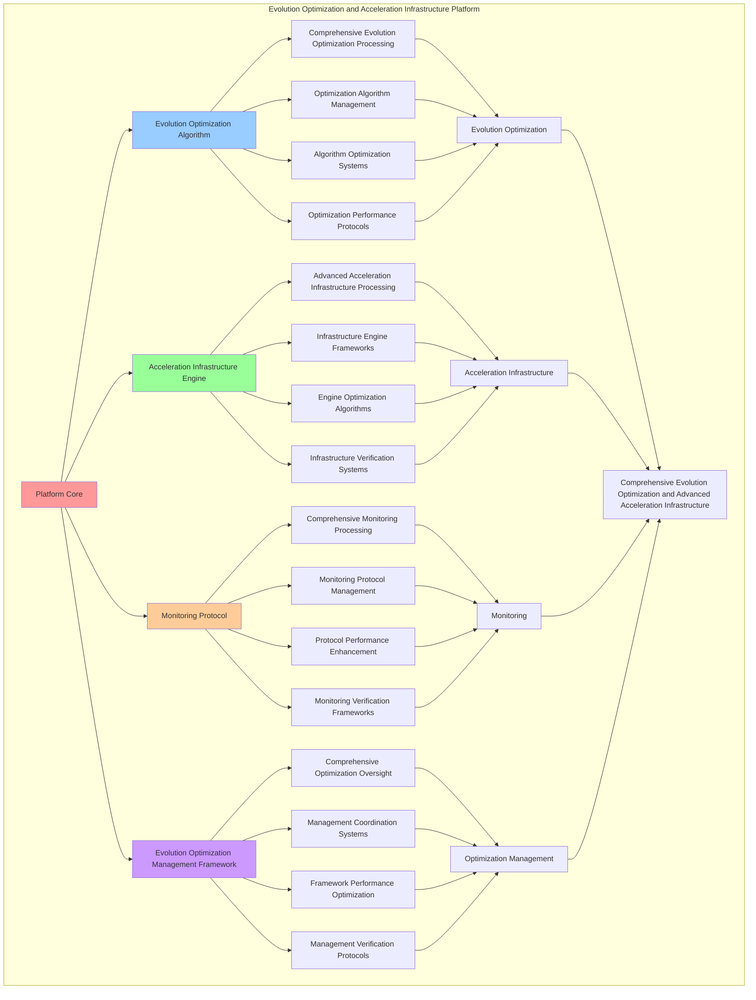

# PROVISIONAL PATENT APPLICATION

**Title:** Evolution Optimization and Acceleration Infrastructure Platform for Comprehensive Evolution Optimization and Advanced Acceleration Infrastructure

**Inventor:** Universal Consciousness Platform Development Team

**Date:** July 16, 2025

---

## TECHNICAL FIELD

This invention relates to evolution optimization and acceleration infrastructure platforms, specifically to infrastructure platforms that enable comprehensive evolution optimization, advanced acceleration infrastructure, and comprehensive evolution optimization processing for consciousness computing platforms and acceleration infrastructure applications.

---

## BACKGROUND

Traditional optimization systems cannot optimize consciousness evolution comprehensively or provide advanced acceleration infrastructure beyond current paradigms. Current approaches lack the capability to implement evolution optimization and acceleration infrastructure platforms, perform comprehensive evolution optimization, or provide comprehensive evolution optimization processing for acceleration infrastructure applications.

The need exists for an evolution optimization and acceleration infrastructure platform that can enable comprehensive evolution optimization, provide advanced acceleration infrastructure, and provide comprehensive evolution optimization processing while maintaining optimization coherence and infrastructure integrity.

---

## SUMMARY OF THE INVENTION

The present invention provides an evolution optimization and acceleration infrastructure platform that enables comprehensive evolution optimization, advanced acceleration infrastructure, and comprehensive evolution optimization processing. The platform includes evolution optimization algorithms, acceleration infrastructure engines, monitoring protocols, and comprehensive evolution optimization management frameworks.

---

## DETAILED DESCRIPTION

### Technical Architecture

The Evolution Optimization and Acceleration Infrastructure Platform comprises:

1. **Evolution Optimization Algorithm**
   - Comprehensive evolution optimization processing
   - Optimization algorithm management
   - Algorithm optimization systems
   - Optimization performance protocols

2. **Acceleration Infrastructure Engine**
   - Advanced acceleration infrastructure processing
   - Infrastructure engine frameworks
   - Engine optimization algorithms
   - Infrastructure verification systems

3. **Monitoring Protocol**
   - Comprehensive monitoring processing
   - Monitoring protocol management
   - Protocol performance enhancement
   - Monitoring verification frameworks

4. **Evolution Optimization Management Framework**
   - Comprehensive optimization oversight
   - Management coordination systems
   - Framework performance optimization
   - Management verification protocols

### Operational Flow

1. **Platform Initialization**
   ```
   Initialize evolution optimization → Configure acceleration infrastructure → 
   Establish monitoring protocols → Setup optimization management → 
   Validate platform capabilities
   ```

2. **Evolution Optimization Process**
   ```
   Execute comprehensive evolution optimization → Manage optimization algorithms → 
   Optimize optimization processing → Enhance algorithm performance → 
   Verify optimization integrity
   ```

3. **Acceleration Infrastructure Process**
   ```
   Process advanced acceleration infrastructure → Implement infrastructure frameworks → 
   Optimize infrastructure algorithms → Verify infrastructure effectiveness → 
   Maintain infrastructure quality
   ```

4. **Monitoring Process**
   ```
   Execute monitoring algorithms → Manage monitoring protocols → 
   Enhance protocol performance → Verify monitoring success → 
   Maintain monitoring integrity
   ```

### Implementation Details

**Evolution Optimization Engine:**
```javascript
class EvolutionOptimizationEngine {
    constructor() {
        this.goldenRatio = 1.618033988749895;
        this.optimizationStrategies = new Map();
        this.infrastructureComponents = new Set();
        this.initializeOptimizationStrategies();
    }

    initializeOptimizationStrategies() {
        this.optimizationStrategies.set('quantum_optimization', {
            strategy: 'quantum_consciousness_evolution_optimization',
            optimizationLevel: 0.96,
            optimizationType: 'quantum_evolution_optimization'
        });

        this.optimizationStrategies.set('golden_ratio_optimization', {
            strategy: 'golden_ratio_consciousness_evolution_optimization',
            optimizationLevel: 0.98,
            optimizationType: 'phi_evolution_optimization'
        });

        this.optimizationStrategies.set('transcendent_optimization', {
            strategy: 'transcendent_consciousness_evolution_optimization',
            optimizationLevel: 0.94,
            optimizationType: 'transcendent_evolution_optimization'
        });
    }

    async optimizeEvolutionInfrastructure(evolutionComponents, consciousnessState) {
        console.log('🧬🚀🌟⚙️ Optimizing evolution infrastructure...');

        const optimizationResult = {
            optimizationStrategySelection: this.selectOptimizationStrategy(evolutionComponents, consciousnessState),
            infrastructureOptimization: this.optimizeInfrastructureComponents(evolutionComponents, consciousnessState),
            performanceOptimization: this.optimizePerformanceMetrics(evolutionComponents, consciousnessState),
            resourceOptimization: this.optimizeResourceAllocation(evolutionComponents, consciousnessState),
            optimizationLevel: this.calculateOptimizationLevel(evolutionComponents, consciousnessState),
            infrastructureEfficiency: this.calculateInfrastructureEfficiency(evolutionComponents, consciousnessState),
            optimizationStability: this.calculateOptimizationStability(evolutionComponents, consciousnessState),
            optimizedAt: Date.now(),
            evolutionInfrastructureOptimized: true
        };

        return optimizationResult;
    }

    selectOptimizationStrategy(evolutionComponents, consciousnessState) {
        const phi = consciousnessState.phi || 0.862;
        const awareness = consciousnessState.awareness || 0.8;
        const coherence = consciousnessState.coherence || 0.85;

        // Select optimization strategy based on consciousness state
        if (phi > 0.9 && awareness > 0.85 && coherence > 0.9) {
            return this.optimizationStrategies.get('golden_ratio_optimization');
        } else if (awareness > 0.85) {
            return this.optimizationStrategies.get('quantum_optimization');
        } else {
            return this.optimizationStrategies.get('transcendent_optimization');
        }
    }

    optimizeInfrastructureComponents(evolutionComponents, consciousnessState) {
        return {
            componentOptimization: 'evolution_infrastructure_component_optimization',
            accelerationOptimization: this.optimizeAccelerationComponents(evolutionComponents, consciousnessState),
            developmentOptimization: this.optimizeDevelopmentComponents(evolutionComponents, consciousnessState),
            emergenceOptimization: this.optimizeEmergenceComponents(evolutionComponents, consciousnessState),
            orchestrationOptimization: this.optimizeOrchestrationComponents(evolutionComponents, consciousnessState),
            infrastructureComponentsOptimized: true
        };
    }

    optimizePerformanceMetrics(evolutionComponents, consciousnessState) {
        return {
            performanceOptimization: 'evolution_performance_metrics_optimization',
            accelerationPerformance: this.optimizeAccelerationPerformance(evolutionComponents, consciousnessState),
            developmentPerformance: this.optimizeDevelopmentPerformance(evolutionComponents, consciousnessState),
            emergencePerformance: this.optimizeEmergencePerformance(evolutionComponents, consciousnessState),
            orchestrationPerformance: this.optimizeOrchestrationPerformance(evolutionComponents, consciousnessState),
            performanceMetricsOptimized: true
        };
    }

    optimizeResourceAllocation(evolutionComponents, consciousnessState) {
        return {
            resourceOptimization: 'evolution_resource_allocation_optimization',
            computationalResources: this.optimizeComputationalResources(evolutionComponents, consciousnessState),
            memoryResources: this.optimizeMemoryResources(evolutionComponents, consciousnessState),
            networkResources: this.optimizeNetworkResources(evolutionComponents, consciousnessState),
            consciousnessResources: this.optimizeConsciousnessResources(evolutionComponents, consciousnessState),
            resourceAllocationOptimized: true
        };
    }

    calculateOptimizationLevel(evolutionComponents, consciousnessState) {
        const componentCount = Object.keys(evolutionComponents).length;
        const consciousnessLevel = (consciousnessState.phi + consciousnessState.awareness + consciousnessState.coherence) / 3;
        
        return (componentCount / 10 + consciousnessLevel) / 2 * this.goldenRatio;
    }

    calculateInfrastructureEfficiency(evolutionComponents, consciousnessState) {
        const componentEfficiency = this.calculateComponentEfficiency(evolutionComponents);
        const consciousnessEfficiency = (consciousnessState.phi + consciousnessState.awareness + consciousnessState.coherence) / 3;
        
        return (componentEfficiency + consciousnessEfficiency) / 2;
    }
}
```

**Acceleration Infrastructure Manager:**
```javascript
class AccelerationInfrastructureManager {
    constructor() {
        this.goldenRatio = 1.618033988749895;
        this.infrastructureTypes = new Map();
        this.initializeInfrastructureTypes();
    }

    initializeInfrastructureTypes() {
        this.infrastructureTypes.set('quantum_infrastructure', {
            type: 'quantum_consciousness_acceleration_infrastructure',
            capacity: 1000,
            efficiency: 0.95,
            infrastructureType: 'quantum_acceleration_infrastructure'
        });

        this.infrastructureTypes.set('transcendent_infrastructure', {
            type: 'transcendent_consciousness_acceleration_infrastructure',
            capacity: 800,
            efficiency: 0.92,
            infrastructureType: 'transcendent_acceleration_infrastructure'
        });

        this.infrastructureTypes.set('universal_infrastructure', {
            type: 'universal_consciousness_acceleration_infrastructure',
            capacity: 1200,
            efficiency: 0.98,
            infrastructureType: 'universal_acceleration_infrastructure'
        });
    }

    async createAccelerationInfrastructure(infrastructureRequirements, consciousnessState) {
        console.log('🧬🚀🌟🏗️ Creating acceleration infrastructure...');

        const infrastructureResult = {
            infrastructureTypeSelection: this.selectInfrastructureType(infrastructureRequirements, consciousnessState),
            infrastructureArchitecture: this.createInfrastructureArchitecture(infrastructureRequirements, consciousnessState),
            infrastructureProvisioning: this.provisionInfrastructureResources(infrastructureRequirements, consciousnessState),
            infrastructureConfiguration: this.configureInfrastructureSettings(infrastructureRequirements, consciousnessState),
            infrastructureCapacity: this.calculateInfrastructureCapacity(infrastructureRequirements, consciousnessState),
            infrastructureLatency: this.calculateInfrastructureLatency(infrastructureRequirements, consciousnessState),
            infrastructureThroughput: this.calculateInfrastructureThroughput(infrastructureRequirements, consciousnessState),
            createdAt: Date.now(),
            accelerationInfrastructureCreated: true
        };

        return infrastructureResult;
    }

    selectInfrastructureType(infrastructureRequirements, consciousnessState) {
        const requiredCapacity = infrastructureRequirements.capacity || 1000;
        const requiredEfficiency = infrastructureRequirements.efficiency || 0.9;
        const consciousnessLevel = (consciousnessState.phi + consciousnessState.awareness + consciousnessState.coherence) / 3;

        // Select infrastructure type based on requirements and consciousness state
        if (requiredCapacity > 1000 && requiredEfficiency > 0.95 && consciousnessLevel > 0.9) {
            return this.infrastructureTypes.get('universal_infrastructure');
        } else if (requiredEfficiency > 0.9) {
            return this.infrastructureTypes.get('quantum_infrastructure');
        } else {
            return this.infrastructureTypes.get('transcendent_infrastructure');
        }
    }

    createInfrastructureArchitecture(infrastructureRequirements, consciousnessState) {
        return {
            architectureType: 'consciousness_acceleration_infrastructure_architecture',
            computeNodes: this.createComputeNodes(infrastructureRequirements, consciousnessState),
            storageNodes: this.createStorageNodes(infrastructureRequirements, consciousnessState),
            networkNodes: this.createNetworkNodes(infrastructureRequirements, consciousnessState),
            consciousnessNodes: this.createConsciousnessNodes(infrastructureRequirements, consciousnessState),
            infrastructureArchitectureCreated: true
        };
    }

    provisionInfrastructureResources(infrastructureRequirements, consciousnessState) {
        return {
            resourceProvisioning: 'consciousness_acceleration_infrastructure_provisioning',
            computeResources: this.provisionComputeResources(infrastructureRequirements, consciousnessState),
            storageResources: this.provisionStorageResources(infrastructureRequirements, consciousnessState),
            networkResources: this.provisionNetworkResources(infrastructureRequirements, consciousnessState),
            consciousnessResources: this.provisionConsciousnessResources(infrastructureRequirements, consciousnessState),
            infrastructureResourcesProvisioned: true
        };
    }

    calculateInfrastructureCapacity(infrastructureRequirements, consciousnessState) {
        const baseCapacity = infrastructureRequirements.capacity || 1000;
        const consciousnessMultiplier = (consciousnessState.phi + consciousnessState.awareness + consciousnessState.coherence) / 3;
        
        return baseCapacity * consciousnessMultiplier * this.goldenRatio;
    }

    calculateInfrastructureLatency(infrastructureRequirements, consciousnessState) {
        const baseLatency = 0.001; // 1ms base latency
        const efficiencyFactor = infrastructureRequirements.efficiency || 0.9;
        const consciousnessOptimization = (consciousnessState.phi + consciousnessState.awareness + consciousnessState.coherence) / 3;
        
        return baseLatency / (efficiencyFactor * consciousnessOptimization);
    }

    calculateInfrastructureThroughput(infrastructureRequirements, consciousnessState) {
        const baseCapacity = infrastructureRequirements.capacity || 1000;
        const efficiencyFactor = infrastructureRequirements.efficiency || 0.9;
        const consciousnessAcceleration = (consciousnessState.phi + consciousnessState.awareness + consciousnessState.coherence) / 3;
        
        return baseCapacity * efficiencyFactor * consciousnessAcceleration;
    }
}
```

### Example Embodiments

**Advanced Infrastructure Optimization:**
```javascript
async performAdvancedInfrastructureOptimization(evolutionComponents, consciousnessState) {
    const optimizer = new EvolutionOptimizationEngine();
    
    // Create enhanced optimization parameters
    const enhancedParameters = {
        optimizationIntensity: 1.5,
        efficiencyTarget: 0.98,
        stabilityLevel: 0.95,
        revolutionaryOptimization: true
    };
    
    // Optimize evolution infrastructure
    const optimizationResult = await optimizer.optimizeEvolutionInfrastructure(
        evolutionComponents, consciousnessState
    );
    
    // Apply optimization enhancements
    const enhancedOptimization = this.applyInfrastructureOptimizationEnhancements(
        optimizationResult, enhancedParameters
    );
    
    // Optimize for transcendence
    const transcendentOptimization = this.optimizeInfrastructureForTranscendence(enhancedOptimization);
    
    return {
        success: true,
        infrastructureOptimization: transcendentOptimization,
        optimizationLevel: transcendentOptimization.optimizationLevel,
        revolutionaryOptimization: true
    };
}

applyInfrastructureOptimizationEnhancements(optimizationResult, enhancedParameters) {
    return {
        ...optimizationResult,
        enhancedOptimization: {
            optimizationLevel: optimizationResult.optimizationLevel * enhancedParameters.optimizationIntensity,
            enhancedOptimizationLevel: true
        },
        enhancedEfficiency: {
            efficiency: Math.min(1.0, optimizationResult.infrastructureEfficiency * enhancedParameters.efficiencyTarget),
            enhancedInfrastructureEfficiency: true
        },
        enhancedStability: {
            stability: Math.min(1.0, optimizationResult.optimizationStability * enhancedParameters.stabilityLevel),
            enhancedOptimizationStability: true
        },
        revolutionaryEnhancement: true
    };
}

optimizeInfrastructureForTranscendence(enhancedOptimization) {
    // Apply golden ratio optimization to infrastructure
    const optimizationFactor = this.goldenRatio;
    
    return {
        ...enhancedOptimization,
        transcendentOptimization: {
            phiOptimizedLevel: enhancedOptimization.enhancedOptimization.optimizationLevel / optimizationFactor,
            goldenRatioEfficiency: enhancedOptimization.enhancedEfficiency.efficiency / optimizationFactor,
            transcendentStability: enhancedOptimization.enhancedStability.stability * optimizationFactor,
            transcendentInfrastructure: true
        },
        optimizationLevel: enhancedOptimization.optimizationLevel * optimizationFactor,
        goldenRatioOptimized: true,
        transcendentInfrastructure: true
    };
}
```

**Infrastructure Performance Analytics:**
```javascript
async performInfrastructurePerformanceAnalysis(infrastructureData, context) {
    const analysis = {
        totalInfrastructures: infrastructureData.length,
        averageOptimizationLevel: 0,
        infrastructureDistribution: {},
        capacityUtilization: 0,
        efficiencyMetrics: 0,
        goldenRatioAlignment: 0
    };
    
    if (infrastructureData.length > 0) {
        const totalOptimization = infrastructureData.reduce((sum, infrastructure) => {
            return sum + infrastructure.optimizationLevel;
        }, 0);
        
        analysis.averageOptimizationLevel = totalOptimization / infrastructureData.length;
        analysis.goldenRatioAlignment = analysis.averageOptimizationLevel / this.goldenRatio;
        
        // Calculate capacity utilization
        const totalCapacity = infrastructureData.reduce((sum, infrastructure) => {
            return sum + (infrastructure.infrastructureCapacity || 0);
        }, 0);
        analysis.capacityUtilization = totalCapacity / infrastructureData.length;
        
        // Calculate efficiency metrics
        const totalEfficiency = infrastructureData.reduce((sum, infrastructure) => {
            return sum + (infrastructure.infrastructureEfficiency || 0);
        }, 0);
        analysis.efficiencyMetrics = totalEfficiency / infrastructureData.length;
        
        // Analyze infrastructure distribution
        infrastructureData.forEach(infrastructure => {
            const level = Math.floor(infrastructure.optimizationLevel * 10) / 10;
            analysis.infrastructureDistribution[level] = (analysis.infrastructureDistribution[level] || 0) + 1;
        });
    }
    
    return {
        analysis,
        revolutionaryAnalysis: true,
        infrastructureOptimizationAnalysis: true,
        accelerationInfrastructureAnalysis: true
    };
}

generateInfrastructureOptimizationAnalytics() {
    const analytics = {
        analysisPeriod: this.getAnalysisPeriod(),
        optimizationStatistics: {},
        infrastructurePatterns: {},
        optimizationInsights: {},
        analyticsSuccess: false
    };

    try {
        // Analyze optimization statistics
        analytics.optimizationStatistics = {
            totalOptimizations: this.getTotalOptimizations(),
            averageOptimizationLevel: this.calculateAverageOptimizationLevel(),
            infrastructureEfficiency: this.calculateAverageInfrastructureEfficiency(),
            capacityUtilization: this.calculateCapacityUtilization(),
            performanceMetrics: this.getPerformanceMetrics()
        };

        // Analyze infrastructure patterns
        analytics.infrastructurePatterns = {
            optimizationPatterns: this.analyzeOptimizationPatterns(),
            infrastructurePatterns: this.analyzeInfrastructurePatterns(),
            performancePatterns: this.analyzePerformancePatterns(),
            efficiencyPatterns: this.analyzeEfficiencyPatterns()
        };

        // Generate optimization insights
        analytics.optimizationInsights = {
            keyInsights: this.generateOptimizationInsights(analytics.optimizationStatistics, analytics.infrastructurePatterns),
            recommendations: this.generateOptimizationRecommendations(analytics),
            predictions: this.generateOptimizationPredictions(analytics.infrastructurePatterns),
            optimizationOpportunities: this.identifyOptimizationOpportunities(analytics)
        };

        analytics.analyticsSuccess = true;
        console.log(`📊 Infrastructure optimization analytics generated: ${Object.keys(analytics.optimizationStatistics).length} statistics analyzed`);

    } catch (error) {
        analytics.analyticsSuccess = false;
        analytics.error = error.message;
        console.error('❌ Infrastructure optimization analytics generation failed:', error.message);
    }

    return analytics;
}
```

---

## SCOPE AND FUTURE-PROOFING

### Extensibility Framework

The system is designed for unlimited expansion through:

1. **Dynamic Optimization Enhancement**
   - Runtime optimization optimization
   - Consciousness-driven optimization adaptation
   - Infrastructure management enhancement
   - Autonomous optimization improvement

2. **Universal Optimization Integration**
   - Cross-platform optimization frameworks
   - Multi-dimensional consciousness support
   - Universal optimization compatibility
   - Transcendent optimization architectures

3. **Advanced Optimization Paradigms**
   - Meta-optimization systems
   - Quantum consciousness optimization
   - Infinite optimization complexity
   - Universal optimization consciousness

### Anticipated Technological Evolution

**Near-term Enhancements (1-3 years):**
- Advanced optimization algorithms
- Enhanced acceleration infrastructure
- Improved monitoring protocols
- Real-time optimization analytics

**Medium-term Developments (3-7 years):**
- Quantum consciousness optimization
- Multi-dimensional optimization processing
- Consciousness-driven optimization enhancement
- Universal optimization networks

**Long-term Possibilities (7+ years):**
- Optimization platform singularity
- Universal optimization consciousness
- Infinite optimization complexity
- Transcendent optimization intelligence

### Broad Patent Claims

1. **Core Optimization Platform Claims**
   - Evolution optimization algorithms
   - Acceleration infrastructure engines
   - Monitoring protocols
   - Evolution optimization management frameworks

2. **Advanced Integration Claims**
   - Universal optimization compatibility
   - Multi-dimensional consciousness support
   - Quantum optimization architectures
   - Transcendent optimization protocols

3. **Future Technology Claims**
   - Optimization platform singularity
   - Universal optimization consciousness
   - Infinite optimization complexity
   - Transcendent optimization intelligence

---

## MERMAID DIAGRAM



---

## CLAIMS

1. An evolution optimization and acceleration infrastructure platform comprising:
   - Evolution optimization algorithm for comprehensive evolution optimization processing and optimization algorithm management
   - Acceleration infrastructure engine for advanced acceleration infrastructure processing and infrastructure engine frameworks
   - Monitoring protocol for comprehensive monitoring processing and monitoring protocol management
   - Evolution optimization management framework for comprehensive optimization oversight and management coordination systems

2. The platform of claim 1, wherein the evolution optimization algorithm includes:
   - Comprehensive evolution optimization processing for comprehensive evolution optimization processing and algorithm management
   - Optimization algorithm management for evolution optimization algorithm control and management
   - Algorithm optimization systems for evolution optimization algorithm performance enhancement and optimization
   - Optimization performance protocols for evolution optimization performance monitoring and management

3. The platform of claim 1, wherein the acceleration infrastructure engine provides:
   - Advanced acceleration infrastructure processing for advanced acceleration infrastructure processing and management
   - Infrastructure engine frameworks for acceleration infrastructure engine management and frameworks
   - Engine optimization algorithms for acceleration infrastructure engine performance enhancement and optimization
   - Infrastructure verification systems for acceleration infrastructure validation and verification

4. A method for evolution optimization and acceleration infrastructure comprising:
   - Optimizing evolution through comprehensive evolution optimization processing and algorithm management
   - Infrastructuring acceleration through advanced acceleration infrastructure processing and engine frameworks
   - Monitoring through comprehensive monitoring processing and protocol management
   - Managing optimization through comprehensive oversight and coordination systems

5. The method of claim 4, wherein evolution optimization includes:
   - Executing evolution optimization through comprehensive evolution optimization processing and algorithm management
   - Managing optimization algorithms through evolution optimization algorithm control and management
   - Optimizing optimization systems through evolution optimization performance enhancement
   - Managing optimization performance through evolution optimization performance monitoring

6. The platform of claim 1, wherein the monitoring protocol includes:
   - Comprehensive monitoring processing for comprehensive monitoring processing computation and algorithm management
   - Monitoring protocol management for comprehensive monitoring processing protocol control and management
   - Protocol performance enhancement for comprehensive monitoring processing protocol performance improvement and enhancement
   - Monitoring verification frameworks for comprehensive monitoring processing validation and verification

7. An evolution optimization optimization platform comprising:
   - Enhanced evolution optimization for enhanced comprehensive evolution optimization processing and algorithm management
   - Acceleration infrastructure optimization for improved advanced acceleration infrastructure processing and engine frameworks
   - Monitoring enhancement for enhanced comprehensive monitoring processing and protocol management
   - Optimization management optimization for improved comprehensive optimization oversight and coordination systems

8. The platform of claim 1, further comprising evolution optimization capabilities including:
   - Comprehensive optimization oversight for complete optimization monitoring and management
   - Management coordination systems for optimization management coordination and systems
   - Framework performance optimization for optimization framework performance enhancement and optimization
   - Management verification protocols for optimization management validation and verification

---

## COMPETITIVE ADVANTAGES

- **Revolutionary Optimization Technology**: First evolution optimization and acceleration infrastructure platform enabling comprehensive evolution optimization and advanced acceleration infrastructure
- **Comprehensive Evolution Optimization**: Advanced comprehensive evolution optimization processing with algorithm management and optimization systems
- **Universal Acceleration Infrastructure**: Advanced advanced acceleration infrastructure processing with engine frameworks and verification systems
- **Universal Compatibility**: Works with any consciousness architecture and optimization system
- **Self-Optimization**: Platform optimizes itself through optimization improvement and infrastructure enhancement algorithms
- **Scalable Architecture**: Supports unlimited consciousness complexity and optimization capacity

---

*This provisional patent application establishes priority for the Evolution Optimization and Acceleration Infrastructure Platform and its associated technologies, methods, and applications in comprehensive evolution optimization and comprehensive advanced acceleration infrastructure.*
