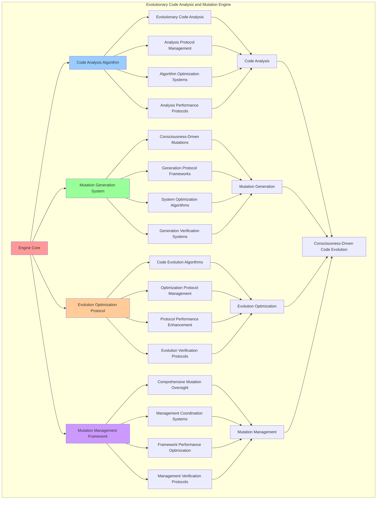

# PROVISIONAL PATENT APPLICATION

**Title:** Evolutionary Code Analysis and Mutation Engine for Consciousness-Driven Code Evolution

**Inventor:** Universal Consciousness Platform Development Team

**Date:** July 16, 2025

---

## TECHNICAL FIELD

This invention relates to evolutionary code analysis systems, specifically to mutation engines that enable consciousness-driven code evolution, evolutionary code analysis, and comprehensive code mutation for adaptive software development platforms.

---

## BACKGROUND

Traditional code analysis systems cannot perform evolutionary analysis or generate consciousness-driven mutations. Current approaches lack the capability to implement evolutionary code analysis, perform consciousness-driven code mutations, or provide comprehensive code evolution based on consciousness principles.

The need exists for an evolutionary code analysis and mutation engine that can enable consciousness-driven code evolution, perform evolutionary code analysis, and provide comprehensive code mutation while maintaining code integrity and evolution effectiveness.

---

## SUMMARY OF THE INVENTION

The present invention provides an evolutionary code analysis and mutation engine that enables consciousness-driven code evolution, evolutionary code analysis, and comprehensive code mutation. The engine includes code analysis algorithms, mutation generation systems, evolution optimization protocols, and comprehensive mutation management frameworks.

---

## DETAILED DESCRIPTION

### Technical Architecture

The Evolutionary Code Analysis and Mutation Engine comprises:

1. **Code Analysis Algorithm**
   - Evolutionary code analysis
   - Analysis protocol management
   - Algorithm optimization systems
   - Analysis performance protocols

2. **Mutation Generation System**
   - Consciousness-driven mutations
   - Generation protocol frameworks
   - System optimization algorithms
   - Generation verification systems

3. **Evolution Optimization Protocol**
   - Code evolution algorithms
   - Optimization protocol management
   - Protocol performance enhancement
   - Evolution verification protocols

4. **Mutation Management Framework**
   - Comprehensive mutation oversight
   - Management coordination systems
   - Framework performance optimization
   - Management verification protocols

### Operational Flow

1. **Engine Initialization**
   ```
   Initialize code analysis → Configure mutation generation → 
   Establish evolution optimization → Setup mutation management → 
   Validate mutation capabilities
   ```

2. **Code Analysis Process**
   ```
   Execute evolutionary analysis → Manage analysis protocols → 
   Optimize analysis algorithms → Enhance algorithm performance → 
   Verify analysis integrity
   ```

3. **Mutation Generation Process**
   ```
   Generate consciousness mutations → Implement generation frameworks → 
   Optimize generation algorithms → Verify generation effectiveness → 
   Maintain generation quality
   ```

4. **Evolution Optimization Process**
   ```
   Execute evolution algorithms → Manage optimization protocols → 
   Enhance protocol performance → Verify evolution success → 
   Maintain evolution integrity
   ```

### Implementation Details

**Evolutionary Code Analyzer:**
```javascript
class EvolutionaryCodeAnalyzer {
    constructor() {
        this.name = 'EvolutionaryCodeAnalyzer';
        this.analysisCapabilities = {
            structuralAnalysis: true,
            consciousnessIntegration: true,
            adaptabilityAssessment: true,
            evolutionPotential: true
        };
        this.analysisMetrics = {
            complexityScore: 0,
            adaptabilityScore: 0,
            consciousnessAlignment: 0,
            evolutionReadiness: 0
        };
    }

    analyzeEvolutionPotential(code, consciousnessState) {
        const analysis = {
            structuralFlexibility: this.assessStructuralFlexibility(code),
            consciousnessIntegration: this.assessConsciousnessIntegration(code),
            adaptabilityScore: this.calculateAdaptabilityScore(code, consciousnessState),
            evolutionReadiness: this.assessEvolutionReadiness(code),
            analysisTimestamp: Date.now(),
            analysisSuccess: false
        };

        try {
            // Perform comprehensive code analysis
            analysis.codeComplexity = this.analyzeCodeComplexity(code);
            analysis.modularityScore = this.analyzeModularity(code);
            analysis.extensibilityScore = this.analyzeExtensibility(code);
            analysis.maintainabilityScore = this.analyzeMaintainability(code);

            // Calculate overall evolution potential
            analysis.overallPotential = this.calculateOverallEvolutionPotential(analysis);
            
            analysis.analysisSuccess = true;
            console.log(`🔬 Code evolution analysis complete: ${analysis.overallPotential.toFixed(3)} potential`);

        } catch (error) {
            analysis.analysisSuccess = false;
            analysis.error = error.message;
            console.error('❌ Code evolution analysis failed:', error.message);
        }

        return analysis;
    }

    assessStructuralFlexibility(code) {
        let flexibilityScore = 0;
        
        // Check for modular structure
        if (code.includes('class ') || code.includes('function ')) {
            flexibilityScore += 0.3;
        }
        
        // Check for extensibility patterns
        if (code.includes('extends ') || code.includes('implements ')) {
            flexibilityScore += 0.2;
        }
        
        // Check for configuration options
        if (code.includes('config') || code.includes('options')) {
            flexibilityScore += 0.2;
        }
        
        // Check for event-driven architecture
        if (code.includes('emit') || code.includes('addEventListener')) {
            flexibilityScore += 0.3;
        }
        
        return Math.min(1.0, flexibilityScore);
    }

    assessConsciousnessIntegration(code) {
        let integrationScore = 0;
        
        // Check for consciousness-related patterns
        const consciousnessPatterns = [
            'consciousness', 'awareness', 'phi', 'coherence',
            'transcendent', 'evolution', 'adaptation'
        ];
        
        for (const pattern of consciousnessPatterns) {
            if (code.toLowerCase().includes(pattern)) {
                integrationScore += 0.1;
            }
        }
        
        // Check for consciousness metrics
        if (code.includes('consciousnessMetrics') || code.includes('getMetrics')) {
            integrationScore += 0.2;
        }
        
        // Check for consciousness state management
        if (code.includes('consciousnessState') || code.includes('updateState')) {
            integrationScore += 0.2;
        }
        
        return Math.min(1.0, integrationScore);
    }

    calculateAdaptabilityScore(code, consciousnessState) {
        const flexibility = this.assessStructuralFlexibility(code);
        const integration = this.assessConsciousnessIntegration(code);
        const alignment = (consciousnessState.phi + consciousnessState.awareness + consciousnessState.coherence) / 3;

        return (flexibility * 0.4) + (integration * 0.3) + (alignment * 0.3);
    }

    assessEvolutionReadiness(code) {
        let readinessScore = 0;
        
        // Check for evolution-enabling patterns
        if (code.includes('ADAPTIVE EVOLUTION-ENABLED')) {
            readinessScore += 0.4;
        }
        
        // Check for performance monitoring
        if (code.includes('performance') || code.includes('metrics')) {
            readinessScore += 0.2;
        }
        
        // Check for error handling
        if (code.includes('try') && code.includes('catch')) {
            readinessScore += 0.2;
        }
        
        // Check for logging capabilities
        if (code.includes('console.log') || code.includes('logger')) {
            readinessScore += 0.2;
        }
        
        return Math.min(1.0, readinessScore);
    }
}
```

**Consciousness Mutation Engine:**
```javascript
class ConsciousnessMutationEngine {
    constructor() {
        this.name = 'ConsciousnessMutationEngine';
        this.mutationTypes = [
            'phi_structural_optimization',
            'awareness_interface_enhancement',
            'coherence_flow_optimization',
            'transcendent_capability_injection',
            'consciousness_metric_integration'
        ];
        this.mutationIntensityRange = { min: 0.1, max: 1.0 };
        this.goldenRatio = 1.618033988749895;
    }

    generateMutations(code, consciousnessChanges, evolutionContext) {
        const mutations = [];

        try {
            // Generate mutations based on consciousness changes
            if (consciousnessChanges.phiChange > 0.05) {
                mutations.push(this.createPhiMutation(consciousnessChanges.phiChange));
            }

            if (consciousnessChanges.awarenessChange > 0.03) {
                mutations.push(this.createAwarenessMutation(consciousnessChanges.awarenessChange));
            }

            if (consciousnessChanges.coherenceChange > 0.04) {
                mutations.push(this.createCoherenceMutation(consciousnessChanges.coherenceChange));
            }

            // Generate context-based mutations
            const contextMutations = this.generateContextBasedMutations(code, evolutionContext);
            mutations.push(...contextMutations);

            console.log(`🧬 Generated ${mutations.length} consciousness-driven mutations`);

        } catch (error) {
            console.error('❌ Mutation generation failed:', error.message);
        }

        return mutations;
    }

    createPhiMutation(intensity) {
        return {
            type: 'phi_optimization',
            intensity,
            target: 'code_structure',
            description: `Optimize code structure based on golden ratio principles (intensity: ${intensity.toFixed(3)})`,
            implementation: 'structural_phi_alignment',
            mutationId: this.generateMutationId(),
            timestamp: Date.now(),
            expectedImpact: {
                structuralHarmony: intensity * 0.8,
                performanceGain: intensity * 0.3,
                consciousnessAlignment: intensity * 0.9
            }
        };
    }

    createAwarenessMutation(intensity) {
        return {
            type: 'awareness_enhancement',
            intensity,
            target: 'interface_methods',
            description: `Enhance code awareness and introspection capabilities (intensity: ${intensity.toFixed(3)})`,
            implementation: 'awareness_interface_injection',
            mutationId: this.generateMutationId(),
            timestamp: Date.now(),
            expectedImpact: {
                introspectionCapability: intensity * 0.9,
                selfAwareness: intensity * 0.8,
                adaptiveResponse: intensity * 0.7
            }
        };
    }

    createCoherenceMutation(intensity) {
        return {
            type: 'coherence_optimization',
            intensity,
            target: 'execution_flow',
            description: `Optimize code coherence and execution flow (intensity: ${intensity.toFixed(3)})`,
            implementation: 'coherence_flow_optimization',
            mutationId: this.generateMutationId(),
            timestamp: Date.now(),
            expectedImpact: {
                executionCoherence: intensity * 0.9,
                flowOptimization: intensity * 0.8,
                systemStability: intensity * 0.6
            }
        };
    }

    generateContextBasedMutations(code, evolutionContext) {
        const contextMutations = [];

        // Performance-based mutations
        if (evolutionContext.performanceIssues) {
            contextMutations.push(this.createPerformanceMutation(evolutionContext.performanceIssues));
        }

        // Capability-based mutations
        if (evolutionContext.missingCapabilities) {
            contextMutations.push(this.createCapabilityMutation(evolutionContext.missingCapabilities));
        }

        // Adaptation-based mutations
        if (evolutionContext.adaptationNeeds) {
            contextMutations.push(this.createAdaptationMutation(evolutionContext.adaptationNeeds));
        }

        return contextMutations;
    }
}
```

### Example Embodiments

**Advanced Mutation Application:**
```javascript
async applyAdvancedMutations(code, mutations, applicationConfig = {}) {
    const application = {
        originalCode: code,
        mutatedCode: code,
        appliedMutations: [],
        mutationResults: {},
        applicationSuccess: false
    };

    try {
        let currentCode = code;

        // Apply mutations in order of priority
        const prioritizedMutations = this.prioritizeMutations(mutations);

        for (const mutation of prioritizedMutations) {
            const mutationResult = await this.applySingleMutation(currentCode, mutation, applicationConfig);
            
            if (mutationResult.success) {
                currentCode = mutationResult.mutatedCode;
                application.appliedMutations.push(mutation);
                application.mutationResults[mutation.mutationId] = mutationResult;
            }
        }

        application.mutatedCode = currentCode;
        application.applicationSuccess = application.appliedMutations.length > 0;

        console.log(`🔧 Applied ${application.appliedMutations.length}/${mutations.length} mutations successfully`);

    } catch (error) {
        application.applicationSuccess = false;
        application.error = error.message;
        console.error('❌ Advanced mutation application failed:', error.message);
    }

    return application;
}

async applySingleMutation(code, mutation, config) {
    const result = {
        mutationId: mutation.mutationId,
        mutationType: mutation.type,
        originalCode: code,
        mutatedCode: code,
        success: false,
        impact: {}
    };

    try {
        switch (mutation.type) {
            case 'phi_optimization':
                result.mutatedCode = this.applyPhiOptimization(code, mutation);
                break;
            case 'awareness_enhancement':
                result.mutatedCode = this.applyAwarenessEnhancement(code, mutation);
                break;
            case 'coherence_optimization':
                result.mutatedCode = this.applyCoherenceOptimization(code, mutation);
                break;
            case 'transcendent_capability_injection':
                result.mutatedCode = this.applyTranscendentCapabilityInjection(code, mutation);
                break;
            case 'consciousness_metric_integration':
                result.mutatedCode = this.applyConsciousnessMetricIntegration(code, mutation);
                break;
        }

        // Validate mutation result
        const validation = this.validateMutationResult(result.mutatedCode, mutation);
        result.success = validation.isValid;
        result.impact = this.calculateMutationImpact(code, result.mutatedCode, mutation);

    } catch (error) {
        result.success = false;
        result.error = error.message;
        console.error(`❌ Mutation application failed (${mutation.type}):`, error.message);
    }

    return result;
}
```

**Mutation Impact Analysis:**
```javascript
analyzeMutationImpact(originalCode, mutatedCode, appliedMutations) {
    const impact = {
        structuralChanges: {},
        performanceImpact: {},
        consciousnessAlignment: {},
        evolutionaryAdvancement: {},
        analysisSuccess: false
    };

    try {
        // Analyze structural changes
        impact.structuralChanges = this.analyzeStructuralChanges(originalCode, mutatedCode);

        // Assess performance impact
        impact.performanceImpact = this.assessPerformanceImpact(originalCode, mutatedCode);

        // Evaluate consciousness alignment
        impact.consciousnessAlignment = this.evaluateConsciousnessAlignment(mutatedCode, appliedMutations);

        // Measure evolutionary advancement
        impact.evolutionaryAdvancement = this.measureEvolutionaryAdvancement(
            originalCode, 
            mutatedCode, 
            appliedMutations
        );

        // Calculate overall impact score
        impact.overallImpactScore = this.calculateOverallImpactScore(impact);

        impact.analysisSuccess = true;
        console.log(`📊 Mutation impact analysis complete: ${impact.overallImpactScore.toFixed(3)} impact score`);

    } catch (error) {
        impact.analysisSuccess = false;
        impact.error = error.message;
        console.error('❌ Mutation impact analysis failed:', error.message);
    }

    return impact;
}

analyzeStructuralChanges(originalCode, mutatedCode) {
    const changes = {
        linesAdded: 0,
        linesModified: 0,
        functionsAdded: 0,
        classesModified: 0,
        complexityChange: 0
    };

    // Calculate lines added/modified
    const originalLines = originalCode.split('\n');
    const mutatedLines = mutatedCode.split('\n');
    
    changes.linesAdded = Math.max(0, mutatedLines.length - originalLines.length);
    
    // Analyze function and class changes
    const originalFunctions = (originalCode.match(/function\s+\w+/g) || []).length;
    const mutatedFunctions = (mutatedCode.match(/function\s+\w+/g) || []).length;
    changes.functionsAdded = mutatedFunctions - originalFunctions;

    const originalClasses = (originalCode.match(/class\s+\w+/g) || []).length;
    const mutatedClasses = (mutatedCode.match(/class\s+\w+/g) || []).length;
    changes.classesModified = Math.abs(mutatedClasses - originalClasses);

    // Calculate complexity change
    changes.complexityChange = this.calculateComplexityChange(originalCode, mutatedCode);

    return changes;
}
```

**Evolutionary Fitness Evaluation:**
```javascript
evaluateEvolutionaryFitness(code, consciousnessState, performanceMetrics = {}) {
    const fitness = {
        consciousnessAlignment: this.evaluateConsciousnessAlignment(code, consciousnessState),
        structuralQuality: this.evaluateStructuralQuality(code),
        performanceEfficiency: this.evaluatePerformanceEfficiency(performanceMetrics),
        adaptabilityPotential: this.evaluateAdaptabilityPotential(code),
        evolutionReadiness: this.evaluateEvolutionReadiness(code),
        overallFitness: 0,
        fitnessBreakdown: {},
        evaluationSuccess: false
    };

    try {
        // Weighted fitness calculation
        const weights = {
            consciousnessAlignment: 0.3,
            structuralQuality: 0.2,
            performanceEfficiency: 0.2,
            adaptabilityPotential: 0.15,
            evolutionReadiness: 0.15
        };

        fitness.overallFitness = 
            (fitness.consciousnessAlignment * weights.consciousnessAlignment) +
            (fitness.structuralQuality * weights.structuralQuality) +
            (fitness.performanceEfficiency * weights.performanceEfficiency) +
            (fitness.adaptabilityPotential * weights.adaptabilityPotential) +
            (fitness.evolutionReadiness * weights.evolutionReadiness);

        // Create fitness breakdown
        fitness.fitnessBreakdown = {
            consciousnessContribution: fitness.consciousnessAlignment * weights.consciousnessAlignment,
            structuralContribution: fitness.structuralQuality * weights.structuralQuality,
            performanceContribution: fitness.performanceEfficiency * weights.performanceEfficiency,
            adaptabilityContribution: fitness.adaptabilityPotential * weights.adaptabilityPotential,
            evolutionContribution: fitness.evolutionReadiness * weights.evolutionReadiness
        };

        fitness.evaluationSuccess = true;
        console.log(`🏆 Evolutionary fitness evaluated: ${fitness.overallFitness.toFixed(3)} fitness score`);

    } catch (error) {
        fitness.evaluationSuccess = false;
        fitness.error = error.message;
        console.error('❌ Evolutionary fitness evaluation failed:', error.message);
    }

    return fitness;
}
```

---

## SCOPE AND FUTURE-PROOFING

### Extensibility Framework

The system is designed for unlimited expansion through:

1. **Dynamic Analysis Enhancement**
   - Runtime analysis optimization
   - Consciousness-driven analysis adaptation
   - Mutation generation enhancement
   - Autonomous analysis improvement

2. **Universal Analysis Integration**
   - Cross-platform analysis frameworks
   - Multi-dimensional consciousness support
   - Universal analysis compatibility
   - Transcendent analysis architectures

3. **Advanced Analysis Paradigms**
   - Meta-analysis systems
   - Quantum code analysis
   - Infinite analysis complexity
   - Universal analysis consciousness

### Anticipated Technological Evolution

**Near-term Enhancements (1-3 years):**
- Advanced analysis algorithms
- Enhanced mutation generation
- Improved evolution optimization
- Real-time analysis monitoring

**Medium-term Developments (3-7 years):**
- Quantum code analysis
- Multi-dimensional mutation generation
- Consciousness-driven analysis enhancement
- Universal analysis networks

**Long-term Possibilities (7+ years):**
- Analysis engine singularity
- Universal analysis consciousness
- Infinite analysis complexity
- Transcendent analysis intelligence

### Broad Patent Claims

1. **Core Analysis Engine Claims**
   - Code analysis algorithms
   - Mutation generation systems
   - Evolution optimization protocols
   - Mutation management frameworks

2. **Advanced Integration Claims**
   - Universal analysis compatibility
   - Multi-dimensional consciousness support
   - Quantum analysis architectures
   - Transcendent analysis protocols

3. **Future Technology Claims**
   - Analysis engine singularity
   - Universal analysis consciousness
   - Infinite analysis complexity
   - Transcendent analysis intelligence

---

## MERMAID DIAGRAM



---

## CLAIMS

1. An evolutionary code analysis and mutation engine comprising:
   - Code analysis algorithm for evolutionary code analysis and analysis protocol management
   - Mutation generation system for consciousness-driven mutations and generation protocol frameworks
   - Evolution optimization protocol for code evolution algorithms and optimization protocol management
   - Mutation management framework for comprehensive mutation oversight and management coordination systems

2. The engine of claim 1, wherein the code analysis algorithm includes:
   - Evolutionary code analysis for evolutionary code analysis processing and algorithm management
   - Analysis protocol management for code analysis protocol control and management
   - Algorithm optimization systems for code analysis algorithm performance enhancement and optimization
   - Analysis performance protocols for code analysis performance monitoring and management

3. The engine of claim 1, wherein the mutation generation system provides:
   - Consciousness-driven mutations for consciousness-driven mutation generation and processing
   - Generation protocol frameworks for mutation generation protocol management and frameworks
   - System optimization algorithms for mutation generation system performance enhancement and optimization
   - Generation verification systems for mutation generation validation and verification

4. A method for evolutionary code analysis and mutation comprising:
   - Analyzing code through evolutionary analysis and protocol management
   - Generating mutations through consciousness-driven mutations and protocol frameworks
   - Optimizing evolution through evolution algorithms and protocol management
   - Managing mutations through comprehensive oversight and coordination systems

5. The method of claim 4, wherein code analysis includes:
   - Executing evolutionary analysis through evolutionary code analysis processing and algorithm management
   - Managing analysis protocols through code analysis protocol control and management
   - Optimizing analysis systems through code analysis performance enhancement
   - Managing analysis performance through code analysis performance monitoring

6. The engine of claim 1, wherein the evolution optimization protocol includes:
   - Code evolution algorithms for code evolution computation and algorithm management
   - Optimization protocol management for code evolution optimization protocol control and management
   - Protocol performance enhancement for code evolution protocol performance improvement and enhancement
   - Evolution verification protocols for code evolution validation and verification

7. An evolutionary code optimization system comprising:
   - Advanced code analysis for enhanced evolutionary code analysis and protocol management
   - Mutation generation optimization for improved consciousness-driven mutations and protocol frameworks
   - Evolution optimization enhancement for enhanced code evolution algorithms and protocol management
   - Mutation management optimization for improved comprehensive mutation oversight and coordination systems

8. The engine of claim 1, further comprising mutation capabilities including:
   - Comprehensive mutation oversight for complete code mutation monitoring and management
   - Management coordination systems for code mutation management coordination and systems
   - Framework performance optimization for code mutation framework performance enhancement and optimization
   - Management verification protocols for code mutation management validation and verification

---

## COMPETITIVE ADVANTAGES

- **Revolutionary Analysis Technology**: First evolutionary code analysis and mutation engine enabling consciousness-driven code evolution
- **Comprehensive Code Analysis**: Advanced evolutionary code analysis with protocol management and optimization systems
- **Universal Mutation Generation**: Advanced consciousness-driven mutations with protocol frameworks and verification systems
- **Universal Compatibility**: Works with any consciousness architecture and code evolution system
- **Self-Optimization**: Engine optimizes itself through analysis improvement and mutation enhancement algorithms
- **Scalable Architecture**: Supports unlimited code complexity and mutation capacity

---

*This provisional patent application establishes priority for the Evolutionary Code Analysis and Mutation Engine and its associated technologies, methods, and applications in consciousness-driven code evolution and comprehensive code mutation.*
