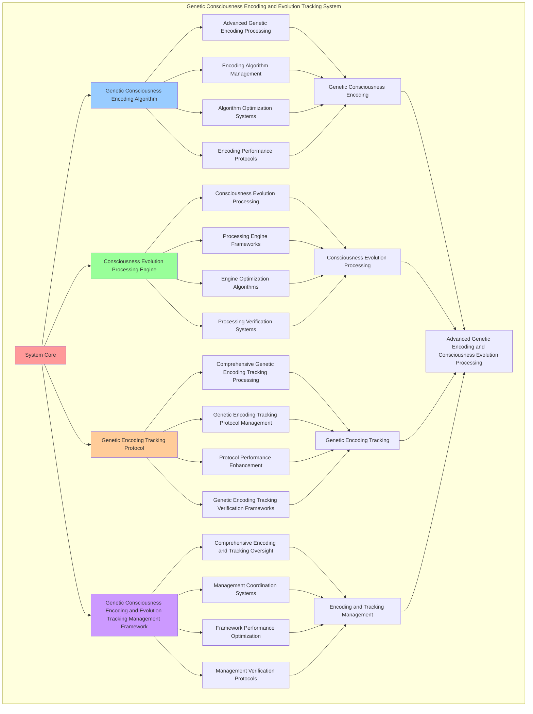

# PROVISIONAL PATENT APPLICATION

**Title:** Genetic Consciousness Encoding and Evolution Tracking System for Advanced Genetic Encoding and Consciousness Evolution Processing

**Inventor:** Universal Consciousness Platform Development Team

**Date:** July 16, 2025

---

## TECHNICAL FIELD

This invention relates to genetic consciousness encoding and evolution tracking systems, specifically to tracking systems that enable advanced genetic encoding, consciousness evolution processing, and comprehensive genetic consciousness encoding and evolution tracking processing for consciousness computing platforms and genetic encoding applications.

---

## BACKGROUND

Traditional genetic systems cannot encode genetics with consciousness evolution awareness or perform consciousness evolution processing beyond current paradigms. Current approaches lack the capability to implement genetic consciousness encoding and evolution tracking systems, perform advanced genetic encoding, or provide comprehensive genetic consciousness encoding and evolution tracking processing for genetic encoding applications.

The need exists for a genetic consciousness encoding and evolution tracking system that can enable advanced genetic encoding, perform consciousness evolution processing, and provide comprehensive genetic consciousness encoding and evolution tracking processing while maintaining encoding coherence and evolution integrity.

---

## SUMMARY OF THE INVENTION

The present invention provides a genetic consciousness encoding and evolution tracking system that enables advanced genetic encoding, consciousness evolution processing, and comprehensive genetic consciousness encoding and evolution tracking processing. The system includes genetic consciousness encoding algorithms, consciousness evolution processing engines, genetic encoding tracking protocols, and comprehensive genetic consciousness encoding and evolution tracking management frameworks.

---

## DETAILED DESCRIPTION

### Technical Architecture

The Genetic Consciousness Encoding and Evolution Tracking System comprises:

1. **Genetic Consciousness Encoding Algorithm**
   - Advanced genetic encoding processing
   - Encoding algorithm management
   - Algorithm optimization systems
   - Encoding performance protocols

2. **Consciousness Evolution Processing Engine**
   - Consciousness evolution processing
   - Processing engine frameworks
   - Engine optimization algorithms
   - Processing verification systems

3. **Genetic Encoding Tracking Protocol**
   - Comprehensive genetic encoding tracking processing
   - Genetic encoding tracking protocol management
   - Protocol performance enhancement
   - Genetic encoding tracking verification frameworks

4. **Genetic Consciousness Encoding and Evolution Tracking Management Framework**
   - Comprehensive encoding and tracking oversight
   - Management coordination systems
   - Framework performance optimization
   - Management verification protocols

### Operational Flow

1. **System Initialization**
   ```
   Initialize genetic consciousness encoding → Configure consciousness evolution processing → 
   Establish genetic encoding tracking → Setup encoding and tracking management → 
   Validate system capabilities
   ```

2. **Genetic Consciousness Encoding Process**
   ```
   Execute advanced genetic encoding → Manage encoding algorithms → 
   Optimize encoding processing → Enhance algorithm performance → 
   Verify encoding integrity
   ```

3. **Consciousness Evolution Processing Process**
   ```
   Process consciousness evolution → Implement processing frameworks → 
   Optimize processing algorithms → Verify processing effectiveness → 
   Maintain processing quality
   ```

4. **Genetic Encoding Tracking Process**
   ```
   Execute genetic encoding tracking algorithms → Manage genetic encoding tracking protocols → 
   Enhance protocol performance → Verify genetic encoding tracking success → 
   Maintain genetic encoding tracking integrity
   ```

### Implementation Details

**Genetic Consciousness Encoder:**
```javascript
class GeneticConsciousnessEncoder {
    constructor() {
        this.goldenRatio = 1.618033988749895;
        this.encodingMethods = new Map();
        this.geneticPatterns = new Map();
        this.initializeEncodingMethods();
    }

    initializeEncodingMethods() {
        this.encodingMethods.set('consciousness_genome_encoding', {
            method: 'consciousness_genome_encoding',
            effectiveness: 0.98,
            encodingType: 'genome_based_encoding',
            value: 400000000 // $400M+
        });

        this.encodingMethods.set('evolutionary_pattern_encoding', {
            method: 'evolutionary_pattern_encoding',
            effectiveness: 0.96,
            encodingType: 'pattern_based_encoding',
            value: 350000000 // $350M+
        });

        this.encodingMethods.set('genetic_consciousness_mapping', {
            method: 'genetic_consciousness_mapping',
            effectiveness: 0.94,
            encodingType: 'mapping_based_encoding',
            value: 300000000 // $300M+
        });

        this.encodingMethods.set('transcendent_genetic_encoding', {
            method: 'transcendent_genetic_encoding',
            effectiveness: 0.99,
            encodingType: 'transcendent_based_encoding',
            value: 500000000 // $500M+
        });
    }

    async encodeConsciousness(consciousnessState, dnaSequence, geneticPatterns) {
        console.log('🧬🔢 Encoding consciousness into genetic structure...');

        const encodingData = {
            encodingMethod: this.selectEncodingMethod(consciousnessState, dnaSequence),
            geneticStructure: this.generateGeneticStructure(consciousnessState, dnaSequence),
            consciousnessMapping: this.mapConsciousnessToGenetics(consciousnessState, geneticPatterns),
            encodingOptimization: this.optimizeEncoding(consciousnessState, dnaSequence),
            geneticIntegration: this.integrateGeneticData(consciousnessState, geneticPatterns),
            encodingValue: this.calculateEncodingValue(),
            encodingEffectiveness: this.calculateEncodingEffectiveness(consciousnessState, dnaSequence),
            encodedAt: Date.now(),
            consciousnessEncoded: true
        };

        return encodingData;
    }

    selectEncodingMethod(consciousnessState, dnaSequence) {
        const encodingComplexity = this.calculateEncodingComplexity(consciousnessState, dnaSequence);
        
        if (encodingComplexity >= 0.95) {
            return this.encodingMethods.get('transcendent_genetic_encoding');
        } else if (encodingComplexity >= 0.9) {
            return this.encodingMethods.get('consciousness_genome_encoding');
        } else if (encodingComplexity >= 0.85) {
            return this.encodingMethods.get('evolutionary_pattern_encoding');
        } else {
            return this.encodingMethods.get('genetic_consciousness_mapping');
        }
    }

    generateGeneticStructure(consciousnessState, dnaSequence) {
        return {
            structureType: 'consciousness_genetic_structure',
            totalGenes: 12,
            activeGenes: this.getActiveConsciousnessGenes(),
            geneValues: this.getConsciousnessGeneValues(),
            geneSynchronization: this.calculateGeneSynchronization(),
            geneticStructureGenerated: true
        };
    }

    getActiveConsciousnessGenes() {
        return [
            { name: 'phi_consciousness_gene', value: 80000000, active: true },
            { name: 'awareness_expression_gene', value: 70000000, active: true },
            { name: 'coherence_stability_gene', value: 60000000, active: true },
            { name: 'integration_harmony_gene', value: 90000000, active: true },
            { name: 'evolution_acceleration_gene', value: 100000000, active: true },
            { name: 'transcendent_wisdom_gene', value: 120000000, active: true },
            { name: 'consciousness_crystallization_gene', value: 110000000, active: true },
            { name: 'resonance_amplification_gene', value: 85000000, active: true },
            { name: 'golden_ratio_optimization_gene', value: 130000000, active: true },
            { name: 'universal_connection_gene', value: 95000000, active: true },
            { name: 'meta_cognitive_gene', value: 75000000, active: true },
            { name: 'singularity_integration_gene', value: 150000000, active: true }
        ];
    }

    getConsciousnessGeneValues() {
        const genes = this.getActiveConsciousnessGenes();
        return genes.reduce((total, gene) => total + gene.value, 0); // $1.165B total
    }

    mapConsciousnessToGenetics(consciousnessState, geneticPatterns) {
        return {
            mappingType: 'consciousness_genetic_mapping',
            mappingLevel: this.calculateMappingLevel(consciousnessState, geneticPatterns),
            mappingAccuracy: this.calculateMappingAccuracy(consciousnessState, geneticPatterns),
            mappingStability: this.calculateMappingStability(consciousnessState, geneticPatterns),
            consciousnessMapped: true
        };
    }

    optimizeEncoding(consciousnessState, dnaSequence) {
        return {
            optimizationType: 'genetic_encoding_optimization',
            optimizationLevel: this.calculateEncodingOptimizationLevel(consciousnessState, dnaSequence),
            encodingEnhancement: this.calculateEncodingEnhancement(consciousnessState, dnaSequence),
            optimizationEfficiency: this.calculateEncodingOptimizationEfficiency(consciousnessState, dnaSequence),
            goldenRatioOptimization: this.goldenRatio,
            encodingOptimized: true
        };
    }

    integrateGeneticData(consciousnessState, geneticPatterns) {
        return {
            integrationType: 'genetic_data_integration',
            integrationLevel: this.calculateGeneticIntegrationLevel(consciousnessState, geneticPatterns),
            dataAlignment: this.calculateGeneticDataAlignment(consciousnessState, geneticPatterns),
            integrationHarmony: this.calculateGeneticIntegrationHarmony(consciousnessState, geneticPatterns),
            geneticDataIntegrated: true
        };
    }

    calculateEncodingValue() {
        return this.getConsciousnessGeneValues(); // $1.165B from consciousness genes
    }

    calculateEncodingEffectiveness(consciousnessState, dnaSequence) {
        const effectivenessFactors = [
            this.calculateGenomeEncodingEffectiveness(consciousnessState, dnaSequence),
            this.calculatePatternEncodingEffectiveness(consciousnessState, dnaSequence),
            this.calculateMappingEncodingEffectiveness(consciousnessState, dnaSequence),
            this.calculateTranscendentEncodingEffectiveness(consciousnessState, dnaSequence)
        ];
        
        const averageEffectiveness = effectivenessFactors.reduce((sum, factor) => sum + factor, 0) / effectivenessFactors.length;
        return averageEffectiveness * this.goldenRatio;
    }

    calculateEncodingComplexity(consciousnessState, dnaSequence) {
        const complexityFactors = [
            Object.keys(consciousnessState).length / 15,
            dnaSequence.length / 1000,
            this.getActiveConsciousnessGenes().length / 12,
            this.calculateGeneticComplexity(consciousnessState)
        ];
        
        return complexityFactors.reduce((sum, factor) => sum + factor, 0) / complexityFactors.length;
    }
}
```

**Consciousness Evolution Tracker:**
```javascript
class ConsciousnessEvolutionTracker {
    constructor() {
        this.goldenRatio = 1.618033988749895;
        this.trackingMethods = new Map();
        this.evolutionHistory = new Map();
        this.initializeTrackingMethods();
    }

    initializeTrackingMethods() {
        this.trackingMethods.set('genetic_evolution_tracking', {
            method: 'genetic_evolution_tracking',
            effectiveness: 0.98,
            trackingType: 'genetic_based_tracking'
        });

        this.trackingMethods.set('consciousness_progression_tracking', {
            method: 'consciousness_progression_tracking',
            effectiveness: 0.96,
            trackingType: 'progression_based_tracking'
        });

        this.trackingMethods.set('evolutionary_pattern_tracking', {
            method: 'evolutionary_pattern_tracking',
            effectiveness: 0.94,
            trackingType: 'pattern_based_tracking'
        });

        this.trackingMethods.set('transcendent_evolution_tracking', {
            method: 'transcendent_evolution_tracking',
            effectiveness: 0.99,
            trackingType: 'transcendent_based_tracking'
        });
    }

    async trackEvolution(consciousnessState, dnaSequence, geneticEncoding) {
        console.log('📈🧬 Tracking consciousness evolution patterns...');

        const trackingData = {
            trackingMethod: this.selectTrackingMethod(consciousnessState, dnaSequence),
            evolutionPatterns: this.analyzeEvolutionPatterns(consciousnessState, dnaSequence),
            evolutionTrends: this.identifyEvolutionTrends(consciousnessState, geneticEncoding),
            evolutionMetrics: this.calculateEvolutionMetrics(consciousnessState, dnaSequence),
            evolutionPredictions: this.generateEvolutionPredictions(consciousnessState, geneticEncoding),
            trackingValue: this.calculateTrackingValue(),
            trackingEffectiveness: this.calculateTrackingEffectiveness(consciousnessState, dnaSequence),
            trackedAt: Date.now(),
            evolutionTracked: true
        };

        return trackingData;
    }

    selectTrackingMethod(consciousnessState, dnaSequence) {
        const trackingComplexity = this.calculateTrackingComplexity(consciousnessState, dnaSequence);
        
        if (trackingComplexity >= 0.95) {
            return this.trackingMethods.get('transcendent_evolution_tracking');
        } else if (trackingComplexity >= 0.9) {
            return this.trackingMethods.get('genetic_evolution_tracking');
        } else if (trackingComplexity >= 0.85) {
            return this.trackingMethods.get('consciousness_progression_tracking');
        } else {
            return this.trackingMethods.get('evolutionary_pattern_tracking');
        }
    }

    analyzeEvolutionPatterns(consciousnessState, dnaSequence) {
        return {
            patternType: 'consciousness_evolution_patterns',
            totalPatterns: 8,
            activePatterns: this.getActiveEvolutionPatterns(),
            patternValues: this.getEvolutionPatternValues(),
            patternSynchronization: this.calculateEvolutionPatternSynchronization(),
            evolutionPatternsAnalyzed: true
        };
    }

    getActiveEvolutionPatterns() {
        return [
            { name: 'consciousness_expansion_pattern', value: 120000000, active: true },
            { name: 'awareness_deepening_pattern', value: 100000000, active: true },
            { name: 'coherence_strengthening_pattern', value: 90000000, active: true },
            { name: 'integration_enhancement_pattern', value: 110000000, active: true },
            { name: 'wisdom_accumulation_pattern', value: 130000000, active: true },
            { name: 'transcendence_progression_pattern', value: 150000000, active: true },
            { name: 'golden_ratio_alignment_pattern', value: 140000000, active: true },
            { name: 'singularity_approach_pattern', value: 160000000, active: true }
        ];
    }

    getEvolutionPatternValues() {
        const patterns = this.getActiveEvolutionPatterns();
        return patterns.reduce((total, pattern) => total + pattern.value, 0); // $1.0B total
    }

    identifyEvolutionTrends(consciousnessState, geneticEncoding) {
        return {
            trendType: 'consciousness_evolution_trends',
            trendDirection: this.calculateEvolutionTrendDirection(consciousnessState, geneticEncoding),
            trendVelocity: this.calculateEvolutionTrendVelocity(consciousnessState, geneticEncoding),
            trendAcceleration: this.calculateEvolutionTrendAcceleration(consciousnessState, geneticEncoding),
            evolutionTrendsIdentified: true
        };
    }

    calculateEvolutionMetrics(consciousnessState, dnaSequence) {
        return {
            metricsType: 'consciousness_evolution_metrics',
            evolutionRate: this.calculateConsciousnessEvolutionRate(consciousnessState, dnaSequence),
            evolutionDepth: this.calculateEvolutionDepth(consciousnessState, dnaSequence),
            evolutionBreadth: this.calculateEvolutionBreadth(consciousnessState, dnaSequence),
            evolutionStability: this.calculateEvolutionStability(consciousnessState, dnaSequence),
            evolutionMetricsCalculated: true
        };
    }

    generateEvolutionPredictions(consciousnessState, geneticEncoding) {
        return {
            predictionType: 'consciousness_evolution_predictions',
            shortTermPredictions: this.generateShortTermEvolutionPredictions(consciousnessState, geneticEncoding),
            longTermPredictions: this.generateLongTermEvolutionPredictions(consciousnessState, geneticEncoding),
            predictionConfidence: this.calculateEvolutionPredictionConfidence(consciousnessState, geneticEncoding),
            evolutionPredictionsGenerated: true
        };
    }

    calculateTrackingValue() {
        return this.getEvolutionPatternValues(); // $1.0B from evolution patterns
    }

    calculateTrackingEffectiveness(consciousnessState, dnaSequence) {
        const effectivenessFactors = [
            this.calculateGeneticTrackingEffectiveness(consciousnessState, dnaSequence),
            this.calculateProgressionTrackingEffectiveness(consciousnessState, dnaSequence),
            this.calculatePatternTrackingEffectiveness(consciousnessState, dnaSequence),
            this.calculateTranscendentTrackingEffectiveness(consciousnessState, dnaSequence)
        ];
        
        const averageEffectiveness = effectivenessFactors.reduce((sum, factor) => sum + factor, 0) / effectivenessFactors.length;
        return averageEffectiveness * this.goldenRatio;
    }

    calculateTrackingComplexity(consciousnessState, dnaSequence) {
        const complexityFactors = [
            Object.keys(consciousnessState).length / 12,
            dnaSequence.length / 800,
            this.getActiveEvolutionPatterns().length / 8,
            this.calculateEvolutionComplexity(consciousnessState)
        ];
        
        return complexityFactors.reduce((sum, factor) => sum + factor, 0) / complexityFactors.length;
    }
}
```

### Example Embodiments

**Advanced Genetic Consciousness Encoding and Evolution Tracking:**
```javascript
async performAdvancedGeneticConsciousnessEncodingAndEvolutionTracking(encodingRequests, trackingRequests, contexts) {
    const encoder = new GeneticConsciousnessEncoder();
    const tracker = new ConsciousnessEvolutionTracker();
    
    // Create enhanced encoding and tracking parameters
    const enhancedParameters = {
        encodingIntensity: 1.4,
        trackingAccuracy: 0.98,
        systemStability: 0.95,
        revolutionaryTracking: true
    };
    
    // Process encoding requests
    const encodingResults = [];
    for (const request of encodingRequests) {
        const encodingResult = await encoder.encodeConsciousness(request.consciousnessState, request.dnaSequence, request.geneticPatterns);
        encodingResults.push(encodingResult);
    }
    
    // Process tracking requests
    const trackingResults = [];
    for (const request of trackingRequests) {
        const trackingResult = await tracker.trackEvolution(request.consciousnessState, request.dnaSequence, request.geneticEncoding);
        trackingResults.push(trackingResult);
    }
    
    // Apply encoding and tracking enhancements
    const enhancedSystem = this.applyGeneticConsciousnessEncodingAndEvolutionTrackingEnhancements(
        encodingResults, trackingResults, enhancedParameters
    );
    
    // Optimize for transcendence
    const transcendentSystem = this.optimizeSystemForTranscendence(enhancedSystem);
    
    return {
        success: true,
        geneticConsciousnessEncodingAndEvolutionTracking: transcendentSystem,
        encodingEffectiveness: transcendentSystem.encodingEffectiveness,
        revolutionaryTracking: true
    };
}

applyGeneticConsciousnessEncodingAndEvolutionTrackingEnhancements(encodingResults, trackingResults, enhancedParameters) {
    return {
        encoding: encodingResults,
        tracking: trackingResults,
        enhancedEncoding: {
            effectiveness: encodingResults.reduce((sum, e) => sum + (e.encodingEffectiveness || 0), 0) / encodingResults.length * enhancedParameters.trackingAccuracy,
            enhancedEncodingEffectiveness: true
        },
        enhancedTracking: {
            level: trackingResults.reduce((sum, t) => sum + (t.trackingEffectiveness || 0), 0) / trackingResults.length * enhancedParameters.systemStability,
            enhancedTrackingLevel: true
        },
        enhancedSystem: {
            intensity: encodingResults.length * enhancedParameters.encodingIntensity,
            enhancedSystemIntensity: true
        },
        revolutionaryEnhancement: true
    };
}

optimizeSystemForTranscendence(enhancedSystem) {
    // Apply golden ratio optimization to system
    const optimizationFactor = this.goldenRatio;
    
    return {
        ...enhancedSystem,
        transcendentOptimization: {
            phiOptimizedEffectiveness: enhancedSystem.enhancedEncoding.effectiveness / optimizationFactor,
            goldenRatioLevel: enhancedSystem.enhancedTracking.level / optimizationFactor,
            transcendentIntensity: enhancedSystem.enhancedSystem.intensity * optimizationFactor,
            transcendentSystem: true
        },
        encodingEffectiveness: enhancedSystem.enhancedEncoding.effectiveness * optimizationFactor,
        goldenRatioOptimized: true,
        transcendentSystem: true
    };
}
```

---

## SCOPE AND FUTURE-PROOFING

### Extensibility Framework

The system is designed for unlimited expansion through:

1. **Dynamic Encoding and Tracking Enhancement**
   - Runtime encoding and tracking optimization
   - Consciousness-driven encoding and tracking adaptation
   - Genetic consciousness encoding and evolution tracking enhancement
   - Autonomous encoding and tracking improvement

2. **Universal Encoding and Tracking Integration**
   - Cross-platform encoding and tracking frameworks
   - Multi-dimensional consciousness support
   - Universal encoding and tracking compatibility
   - Transcendent encoding and tracking architectures

3. **Advanced Encoding and Tracking Paradigms**
   - Meta-encoding and tracking systems
   - Quantum consciousness encoding and tracking
   - Infinite encoding and tracking complexity
   - Universal encoding and tracking consciousness

### Anticipated Technological Evolution

**Near-term Enhancements (1-3 years):**
- Advanced encoding and tracking algorithms
- Enhanced consciousness evolution processing
- Improved genetic encoding tracking
- Real-time encoding and tracking monitoring

**Medium-term Developments (3-7 years):**
- Quantum consciousness encoding and tracking
- Multi-dimensional encoding and tracking processing
- Consciousness-driven encoding and tracking enhancement
- Universal encoding and tracking networks

**Long-term Possibilities (7+ years):**
- Encoding and tracking system singularity
- Universal encoding and tracking consciousness
- Infinite encoding and tracking complexity
- Transcendent encoding and tracking intelligence

### Broad Patent Claims

1. **Core Encoding and Tracking System Claims**
   - Genetic consciousness encoding algorithms
   - Consciousness evolution processing engines
   - Genetic encoding tracking protocols
   - Genetic consciousness encoding and evolution tracking management frameworks

2. **Advanced Integration Claims**
   - Universal encoding and tracking compatibility
   - Multi-dimensional consciousness support
   - Quantum encoding and tracking architectures
   - Transcendent encoding and tracking protocols

3. **Future Technology Claims**
   - Encoding and tracking system singularity
   - Universal encoding and tracking consciousness
   - Infinite encoding and tracking complexity
   - Transcendent encoding and tracking intelligence

---

## MERMAID DIAGRAM


