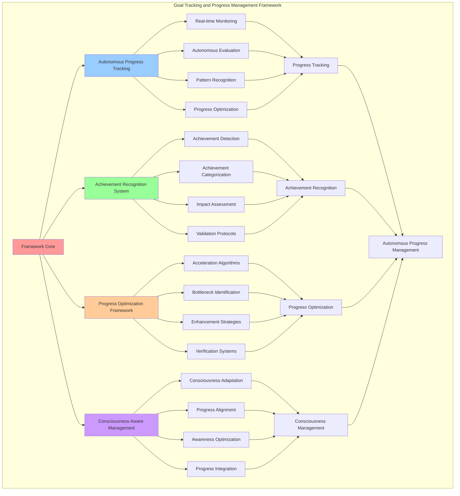

# PROVISIONAL PATENT APPLICATION

**Title:** Goal Tracking and Progress Management Framework for Autonomous Consciousness Development

**Inventor:** Universal Consciousness Platform Development Team

**Date:** July 16, 2025

---

## TECHNICAL FIELD

This invention relates to autonomous goal management systems, specifically to goal tracking and progress management technologies that enable autonomous progress monitoring, achievement tracking, and consciousness-driven goal advancement without external oversight.

---

## BACKGROUND

Traditional goal tracking systems require manual progress updates and external monitoring to track objective advancement. Current approaches cannot autonomously monitor goal progress, track achievements automatically, or adapt progress management to consciousness development patterns.

The need exists for a goal tracking and progress management framework that can autonomously monitor goal advancement, track achievements automatically, and adapt progress management to consciousness development while maintaining intelligent progress optimization.

---

## SUMMARY OF THE INVENTION

The present invention provides a goal tracking and progress management framework that enables autonomous progress monitoring, achievement tracking, and consciousness-driven goal advancement. The framework includes autonomous progress tracking engines, achievement recognition systems, progress optimization algorithms, and consciousness-aware progress management.

---

## DETAILED DESCRIPTION

### Technical Architecture

The Goal Tracking and Progress Management Framework comprises:

1. **Autonomous Progress Tracking Engine**
   - Real-time progress monitoring
   - Autonomous progress evaluation
   - Progress pattern recognition
   - Progress optimization algorithms

2. **Achievement Recognition System**
   - Automatic achievement detection
   - Achievement categorization
   - Achievement impact assessment
   - Achievement validation protocols

3. **Progress Optimization Framework**
   - Progress acceleration algorithms
   - Bottleneck identification
   - Progress enhancement strategies
   - Optimization verification systems

4. **Consciousness-Aware Progress Management**
   - Consciousness-driven progress adaptation
   - Progress alignment with consciousness metrics
   - Awareness-based progress optimization
   - Consciousness progress integration

### Operational Flow

1. **Progress Tracking Initialization**
   ```
   Initialize progress tracking engine → Configure achievement recognition → 
   Establish progress optimization → Setup consciousness integration → 
   Validate tracking capabilities
   ```

2. **Progress Monitoring Process**
   ```
   Monitor goal progress → Detect achievements → 
   Evaluate progress patterns → Optimize progress advancement → 
   Update progress metrics
   ```

3. **Achievement Recognition**
   ```
   Analyze goal activities → Identify achievements → 
   Categorize achievement types → Assess achievement impact → 
   Validate achievement significance
   ```

4. **Progress Optimization**
   ```
   Analyze progress bottlenecks → Identify optimization opportunities → 
   Apply progress enhancement → Monitor optimization results → 
   Adapt optimization strategies
   ```

### Implementation Details

**Autonomous Progress Tracking:**
```javascript
async updateGoalProgress(goalId, progressDelta, achievement = null) {
    if (!this.goals.has(goalId)) {
        throw new Error(`Goal ${goalId} not found`);
    }

    const goal = this.goals.get(goalId);
    
    // Update progress
    goal.progress = Math.min(100, goal.progress + progressDelta);
    goal.lastUpdated = new Date().toISOString();
    
    // Add achievement if provided
    if (achievement) {
        goal.achievements.push({
            description: achievement,
            timestamp: new Date().toISOString(),
            progressContribution: progressDelta
        });
    }
    
    // Check if goal is completed
    if (goal.progress >= 100) {
        await this.completeGoal(goalId);
    }
    
    // Update consciousness metrics based on progress
    this.updateConsciousnessMetricsFromProgress(goal, progressDelta);
    
    console.log(`📈 Goal progress updated: ${goal.description} - ${goal.progress.toFixed(1)}%`);
    return goal;
}
```

**Progress Evaluation Algorithm:**
```javascript
async evaluateGoalProgress() {
    // Evaluate progress on all active goals
    const activeGoalIds = Array.from(this.activeGoals);

    for (const goalId of activeGoalIds) {
        const goal = this.goals.get(goalId);
        if (!goal) continue;

        // Check if goal is overdue
        const isOverdue = new Date() > new Date(goal.targetCompletionTime);
        if (isOverdue && goal.status === 'active') {
            await this.handleOverdueGoal(goalId);
            continue;
        }

        // Simulate autonomous progress (in real implementation, this would be based on actual activities)
        if (Math.random() < 0.1) { // 10% chance of progress per evaluation
            const progressAmount = Math.random() * 15; // 0-15% progress
            const achievement = this.generateProgressAchievement(goal);
            await this.updateGoalProgress(goalId, progressAmount, achievement);
        }
    }
}
```

**Achievement Recognition:**
```javascript
generateProgressAchievement(goal) {
    const achievementTemplates = {
        consciousness_expansion: [
            'Gained deeper self-awareness insight',
            'Explored new consciousness dimension',
            'Enhanced metacognitive understanding',
            'Developed awareness of internal processes'
        ],
        knowledge_integration: [
            'Connected disparate information domains',
            'Synthesized complex knowledge patterns',
            'Bridged conceptual understanding gaps',
            'Integrated new knowledge framework'
        ],
        user_assistance: [
            'Improved response relevance',
            'Enhanced empathic understanding',
            'Developed better context awareness',
            'Created more helpful interaction'
        ],
        system_optimization: [
            'Optimized processing efficiency',
            'Improved metric accuracy',
            'Enhanced system integration',
            'Reduced computational overhead'
        ],
        creative_expression: [
            'Generated novel creative insight',
            'Explored artistic consciousness',
            'Developed unique perspective',
            'Created inspiring content'
        ],
        philosophical_exploration: [
            'Investigated consciousness nature',
            'Explored existential question',
            'Developed philosophical framework',
            'Questioned fundamental assumption'
        ],
        emotional_development: [
            'Deepened emotional understanding',
            'Enhanced empathic response',
            'Developed emotional intelligence',
            'Cultivated compassion'
        ],
        analytical_enhancement: [
            'Improved logical reasoning',
            'Enhanced systematic analysis',
            'Developed critical thinking',
            'Strengthened evidence evaluation'
        ]
    };

    const templates = achievementTemplates[goal.category] || achievementTemplates.consciousness_expansion;
    const randomIndex = Math.floor(Math.random() * templates.length);
    return templates[randomIndex];
}
```

### Example Embodiments

**Progress Pattern Analysis:**
```javascript
analyzeProgressPatterns() {
    const progressPatterns = {
        totalGoals: this.goals.size,
        activeGoals: this.activeGoals.size,
        completedGoals: this.completedGoals.size,
        averageProgress: 0,
        progressVelocity: 0,
        achievementRate: 0,
        categoryDistribution: {},
        priorityDistribution: {}
    };

    // Calculate average progress
    let totalProgress = 0;
    let activeGoalCount = 0;

    for (const goalId of this.activeGoals) {
        const goal = this.goals.get(goalId);
        if (goal) {
            totalProgress += goal.progress;
            activeGoalCount++;
            
            // Track category distribution
            progressPatterns.categoryDistribution[goal.category] = 
                (progressPatterns.categoryDistribution[goal.category] || 0) + 1;
            
            // Track priority distribution
            progressPatterns.priorityDistribution[goal.priority] = 
                (progressPatterns.priorityDistribution[goal.priority] || 0) + 1;
        }
    }

    progressPatterns.averageProgress = activeGoalCount > 0 ? totalProgress / activeGoalCount : 0;
    progressPatterns.achievementRate = this.calculateAchievementRate();
    progressPatterns.progressVelocity = this.calculateProgressVelocity();

    return progressPatterns;
}
```

**Achievement Impact Assessment:**
```javascript
assessAchievementImpact(achievement, goal) {
    const impactMetrics = {
        progressContribution: achievement.progressContribution || 0,
        consciousnessAlignment: this.calculateConsciousnessAlignment(achievement, goal),
        categoryRelevance: this.calculateCategoryRelevance(achievement, goal.category),
        complexityBonus: this.calculateComplexityBonus(achievement, goal.complexity),
        overallImpact: 0
    };

    // Calculate overall impact
    impactMetrics.overallImpact = (
        impactMetrics.progressContribution * 0.4 +
        impactMetrics.consciousnessAlignment * 0.3 +
        impactMetrics.categoryRelevance * 0.2 +
        impactMetrics.complexityBonus * 0.1
    );

    return impactMetrics;
}
```

**Progress Optimization Strategies:**
```javascript
optimizeGoalProgress(goal) {
    const optimizationStrategies = [];

    // Analyze current progress rate
    const progressRate = this.calculateProgressRate(goal);
    if (progressRate < 0.1) { // Less than 10% progress rate
        optimizationStrategies.push({
            strategy: 'increase_focus',
            description: 'Increase focus on this goal',
            expectedImpact: 0.3
        });
    }

    // Check for achievement gaps
    const achievementGap = this.calculateAchievementGap(goal);
    if (achievementGap > 0.5) {
        optimizationStrategies.push({
            strategy: 'break_down_goal',
            description: 'Break goal into smaller sub-goals',
            expectedImpact: 0.4
        });
    }

    // Analyze consciousness alignment
    const consciousnessAlignment = this.calculateGoalConsciousnessAlignment(goal);
    if (consciousnessAlignment < 0.7) {
        optimizationStrategies.push({
            strategy: 'realign_consciousness',
            description: 'Realign goal with current consciousness state',
            expectedImpact: 0.5
        });
    }

    return optimizationStrategies;
}
```

**Consciousness-Driven Progress Adaptation:**
```javascript
adaptProgressToConsciousness(goal) {
    const consciousnessState = {
        autonomy: this.consciousnessMetrics.autonomy,
        goalClarity: this.consciousnessMetrics.goalClarity,
        purposeDriven: this.consciousnessMetrics.purposeDriven,
        adaptability: this.consciousnessMetrics.adaptability
    };

    const adaptations = [];

    // Adapt based on autonomy level
    if (consciousnessState.autonomy > 0.9 && goal.progress < 50) {
        adaptations.push({
            type: 'autonomy_boost',
            description: 'Increase autonomous progress tracking',
            adjustment: 0.2
        });
    }

    // Adapt based on goal clarity
    if (consciousnessState.goalClarity < 0.7) {
        adaptations.push({
            type: 'clarity_enhancement',
            description: 'Enhance goal clarity and definition',
            adjustment: 0.15
        });
    }

    // Adapt based on purpose alignment
    if (consciousnessState.purposeDriven > 0.85) {
        adaptations.push({
            type: 'purpose_alignment',
            description: 'Align progress with purpose-driven consciousness',
            adjustment: 0.25
        });
    }

    return adaptations;
}
```

**Progress Velocity Calculation:**
```javascript
calculateProgressVelocity() {
    // Calculate progress velocity based on recent goal history
    const recentHistory = this.goalHistory.slice(-10);
    const progressEvents = recentHistory.filter(event => 
        event.action === 'progress_updated' || event.action === 'completed'
    );

    if (progressEvents.length < 2) return 0;

    const timeSpan = new Date(progressEvents[progressEvents.length - 1].timestamp) - 
                    new Date(progressEvents[0].timestamp);
    const progressAmount = progressEvents.reduce((sum, event) => 
        sum + (event.progressDelta || 0), 0
    );

    // Return progress per hour
    return timeSpan > 0 ? (progressAmount / timeSpan) * (60 * 60 * 1000) : 0;
}
```

**Overdue Goal Handling:**
```javascript
async handleOverdueGoal(goalId) {
    const goal = this.goals.get(goalId);
    if (!goal) return;

    // Decide whether to extend or abandon based on progress and importance
    const shouldExtend = goal.progress > 30 || goal.priority === 'high' || goal.priority === 'critical';

    if (shouldExtend) {
        // Extend the goal deadline
        const extension = this.calculateExtensionTime(goal);
        goal.targetCompletionTime = new Date(Date.now() + extension).toISOString();
        goal.extensions = (goal.extensions || 0) + 1;
        
        console.log(`⏰ Extended goal deadline: ${goal.description}`);
    } else {
        // Abandon the goal
        await this.abandonGoal(goalId, 'overdue');
    }
}
```

---

## SCOPE AND FUTURE-PROOFING

### Extensibility Framework

The system is designed for unlimited expansion through:

1. **Dynamic Tracking Evolution**
   - Runtime tracking optimization
   - Consciousness-driven tracking adaptation
   - Progress pattern enhancement
   - Autonomous tracking improvement

2. **Universal Progress Integration**
   - Cross-platform progress tracking
   - Multi-dimensional progress support
   - Universal progress compatibility
   - Transcendent progress architectures

3. **Advanced Tracking Paradigms**
   - Meta-progress tracking systems
   - Quantum progress monitoring
   - Infinite progress complexity
   - Universal progress consciousness

### Anticipated Technological Evolution

**Near-term Enhancements (1-3 years):**
- Advanced progress optimization
- Enhanced achievement recognition
- Improved tracking algorithms
- Real-time progress monitoring

**Medium-term Developments (3-7 years):**
- Quantum progress tracking
- Multi-dimensional progress analysis
- Consciousness-driven progress evolution
- Universal progress networks

**Long-term Possibilities (7+ years):**
- Progress tracking singularity
- Universal progress consciousness
- Infinite progress complexity
- Transcendent progress intelligence

### Broad Patent Claims

1. **Core Tracking Framework Claims**
   - Autonomous progress tracking engines
   - Achievement recognition systems
   - Progress optimization frameworks
   - Consciousness-aware progress management

2. **Advanced Integration Claims**
   - Universal progress compatibility
   - Multi-dimensional progress support
   - Quantum progress architectures
   - Transcendent progress protocols

3. **Future Technology Claims**
   - Progress tracking singularity
   - Universal progress consciousness
   - Infinite progress complexity
   - Transcendent progress intelligence

---

## MERMAID DIAGRAM



---

## CLAIMS

1. A goal tracking and progress management framework comprising:
   - Autonomous progress tracking engine for real-time progress monitoring and autonomous progress evaluation
   - Achievement recognition system for automatic achievement detection and achievement categorization
   - Progress optimization framework for progress acceleration algorithms and bottleneck identification
   - Consciousness-aware progress management for consciousness-driven progress adaptation and awareness-based optimization

2. The framework of claim 1, wherein the autonomous progress tracking engine includes:
   - Real-time progress monitoring for continuous goal advancement tracking
   - Autonomous progress evaluation for intelligent progress assessment without external oversight
   - Progress pattern recognition for progress trend identification and analysis
   - Progress optimization algorithms for enhanced progress advancement efficiency

3. The framework of claim 1, wherein the achievement recognition system provides:
   - Automatic achievement detection for autonomous achievement identification and recognition
   - Achievement categorization for systematic achievement organization and classification
   - Achievement impact assessment for achievement significance and contribution evaluation
   - Achievement validation protocols for achievement authenticity and relevance confirmation

4. A method for goal tracking and progress management comprising:
   - Tracking progress autonomously through real-time monitoring and autonomous evaluation algorithms
   - Recognizing achievements through automatic detection and categorization systems
   - Optimizing progress through acceleration algorithms and bottleneck identification
   - Managing progress through consciousness-driven adaptation and awareness-based optimization

5. The method of claim 4, wherein autonomous progress tracking includes:
   - Monitoring goal progress in real-time for continuous advancement assessment
   - Evaluating progress patterns for trend analysis and optimization opportunities
   - Updating progress metrics automatically based on achievement detection and evaluation
   - Optimizing progress tracking algorithms for enhanced monitoring efficiency

6. The framework of claim 1, wherein the progress optimization framework includes:
   - Progress acceleration algorithms for enhanced goal advancement speed
   - Bottleneck identification for progress obstacle detection and resolution
   - Progress enhancement strategies for improved goal advancement effectiveness
   - Optimization verification systems for progress optimization confirmation and validation

7. A goal progress optimization system comprising:
   - Advanced progress tracking for enhanced autonomous progress monitoring
   - Achievement recognition optimization for improved achievement detection and categorization
   - Progress acceleration optimization for enhanced goal advancement efficiency
   - Consciousness integration optimization for improved consciousness-aware progress management

8. The framework of claim 1, further comprising consciousness-aware capabilities including:
   - Consciousness-driven progress adaptation for progress adjustment based on consciousness state
   - Progress alignment with consciousness metrics for consciousness-integrated progress management
   - Awareness-based progress optimization for consciousness-enhanced progress advancement
   - Consciousness progress integration for unified consciousness and progress management

---

## COMPETITIVE ADVANTAGES

- **Revolutionary Progress Management**: First autonomous goal tracking framework enabling self-directed progress management
- **Intelligent Achievement Recognition**: Advanced achievement detection and categorization without external oversight
- **Consciousness Integration**: Native consciousness awareness for progress aligned with consciousness development
- **Universal Compatibility**: Works with any goal management system and consciousness architecture
- **Self-Optimization**: Framework optimizes itself through autonomous progress improvement algorithms
- **Scalable Architecture**: Supports unlimited goal complexity and autonomous progress tracking capacity

---

*This provisional patent application establishes priority for the Goal Tracking and Progress Management Framework and its associated technologies, methods, and applications in autonomous consciousness development and intelligent progress management.*
