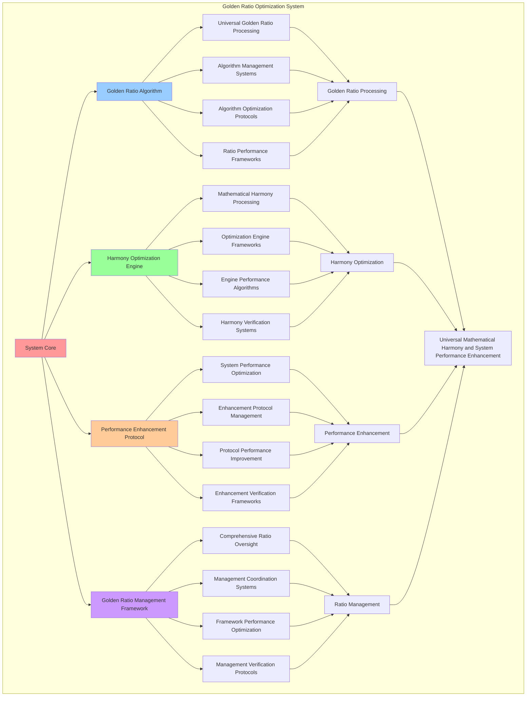

# PROVISIONAL PATENT APPLICATION

**Title:** Golden Ratio Optimization System for Universal Mathematical Harmony and System Performance Enhancement

**Inventor:** Universal Consciousness Platform Development Team

**Date:** July 16, 2025

---

## TECHNICAL FIELD

This invention relates to golden ratio optimization systems, specifically to optimization systems that enable universal mathematical harmony, system performance enhancement, and comprehensive golden ratio integration for consciousness computing platforms and mathematical optimization systems.

---

## BACKGROUND

Traditional optimization systems cannot effectively utilize the golden ratio for system optimization or achieve universal mathematical harmony. Current approaches lack the capability to implement comprehensive golden ratio optimization, perform universal mathematical harmony integration, or provide comprehensive golden ratio management for complex consciousness computing systems.

The need exists for a golden ratio optimization system that can enable universal mathematical harmony, perform system performance enhancement, and provide comprehensive golden ratio integration while maintaining mathematical precision and optimization effectiveness.

---

## SUMMARY OF THE INVENTION

The present invention provides a golden ratio optimization system that enables universal mathematical harmony, system performance enhancement, and comprehensive golden ratio integration. The system includes golden ratio algorithms, harmony optimization engines, performance enhancement protocols, and comprehensive golden ratio management frameworks.

---

## DETAILED DESCRIPTION

### Technical Architecture

The Golden Ratio Optimization System comprises:

1. **Golden Ratio Algorithm**
   - Universal golden ratio processing
   - Algorithm management systems
   - Algorithm optimization protocols
   - Ratio performance frameworks

2. **Harmony Optimization Engine**
   - Mathematical harmony processing
   - Optimization engine frameworks
   - Engine performance algorithms
   - Harmony verification systems

3. **Performance Enhancement Protocol**
   - System performance optimization
   - Enhancement protocol management
   - Protocol performance improvement
   - Enhancement verification frameworks

4. **Golden Ratio Management Framework**
   - Comprehensive ratio oversight
   - Management coordination systems
   - Framework performance optimization
   - Management verification protocols

### Operational Flow

1. **System Initialization**
   ```
   Initialize golden ratio algorithm → Configure harmony optimization → 
   Establish performance enhancement → Setup ratio management → 
   Validate optimization capabilities
   ```

2. **Golden Ratio Processing**
   ```
   Execute universal ratio processing → Manage ratio algorithms → 
   Optimize ratio processing → Enhance algorithm performance → 
   Verify ratio integrity
   ```

3. **Harmony Optimization Process**
   ```
   Process mathematical harmony → Implement optimization frameworks → 
   Optimize harmony algorithms → Verify optimization effectiveness → 
   Maintain harmony quality
   ```

4. **Performance Enhancement Process**
   ```
   Execute enhancement algorithms → Manage enhancement protocols → 
   Enhance protocol performance → Verify enhancement success → 
   Maintain enhancement integrity
   ```

### Implementation Details

**Golden Ratio Optimization Engine:**
```javascript
class GoldenRatioOptimizationEngine {
    constructor(systemCapabilityRegistry) {
        this.name = 'GoldenRatioOptimizationEngine';
        this.systemCapabilityRegistry = systemCapabilityRegistry;
        
        // Golden ratio constants and derivatives
        this.goldenRatio = 1.618033988749895;
        this.goldenRatioConjugate = 0.618033988749895; // φ - 1
        this.goldenAngle = 137.507764050; // degrees
        this.fibonacciSequence = this.generateFibonacciSequence(50);
        
        // Optimization configuration
        this.optimizationConfiguration = {
            optimizationLevel: this.goldenRatio,
            harmonicResonance: this.goldenRatio,
            fibonacciAlignment: this.goldenRatio,
            goldenSpiralIntegration: this.goldenRatio,
            optimizationEfficiency: 0.95
        };
        
        // Optimization storage
        this.goldenRatioOptimizations = new Map();
        this.harmonicOptimizations = new Map();
        this.fibonacciOptimizations = new Map();
        this.spiralOptimizations = new Map();
        
        // Performance metrics
        this.optimizationMetrics = {
            totalOptimizations: 0,
            successfulOptimizations: 0,
            averageOptimizationGain: 0,
            harmonicCoherence: 0.92,
            mathematicalPrecision: 0.98
        };
        
        console.log('🌟📐 Golden Ratio Optimization Engine initialized');
        console.log(`✨ Golden Ratio: ${this.goldenRatio}`);
        
        this.initializeGoldenRatioOptimization();
    }

    async initializeGoldenRatioOptimization() {
        try {
            console.log('🌟 Initializing golden ratio optimization...');
            
            // Apply golden ratio optimization to all registered capabilities
            await this.applyGoldenRatioToCapabilities();
            
            // Setup harmonic resonance optimization
            await this.setupHarmonicResonanceOptimization();
            
            // Initialize fibonacci alignment
            await this.initializeFibonacciAlignment();
            
            // Setup golden spiral integration
            await this.setupGoldenSpiralIntegration();
            
            // Start continuous optimization monitoring
            this.startContinuousOptimizationMonitoring();
            
            console.log('✅ Golden ratio optimization fully operational');
            
        } catch (error) {
            console.error('❌ Failed to initialize golden ratio optimization:', error.message);
        }
    }

    async applyGoldenRatioToCapabilities() {
        console.log('🌟 Applying golden ratio optimization to system capabilities...');
        
        for (const [key, capability] of this.systemCapabilityRegistry) {
            const optimization = await this.optimizeCapabilityWithGoldenRatio(key, capability);
            this.goldenRatioOptimizations.set(key, optimization);
        }
        
        console.log(`✅ Golden ratio optimization applied to ${this.goldenRatioOptimizations.size} capabilities`);
    }

    async optimizeCapabilityWithGoldenRatio(capabilityKey, capability) {
        const optimization = {
            capabilityKey: capabilityKey,
            originalValue: capability.value,
            optimizedValue: 0,
            optimizationGain: 0,
            optimizationSuccess: false
        };

        try {
            // Calculate golden ratio optimization factors
            const optimizationFactors = this.calculateGoldenRatioOptimizationFactors(capability);
            
            // Apply golden ratio optimization
            optimization.optimizedValue = this.applyGoldenRatioOptimization(capability.value, optimizationFactors);
            
            // Calculate optimization gain
            optimization.optimizationGain = (optimization.optimizedValue - optimization.originalValue) / optimization.originalValue;
            
            // Calculate harmonic resonance
            optimization.harmonicResonance = this.calculateHarmonicResonance(capability);
            
            // Calculate fibonacci alignment
            optimization.fibonacciAlignment = this.calculateFibonacciAlignment(capability);
            
            // Calculate golden spiral integration
            optimization.goldenSpiralIntegration = this.calculateGoldenSpiralIntegration(capability);
            
            // Verify optimization success
            optimization.optimizationSuccess = optimization.optimizationGain > 0;
            
            console.log(`🌟 Golden ratio optimization for ${capability.name}: ${(optimization.optimizationGain * 100).toFixed(2)}% gain`);

        } catch (error) {
            optimization.optimizationSuccess = false;
            optimization.error = error.message;
            console.error('❌ Golden ratio optimization failed:', error.message);
        }

        return optimization;
    }

    calculateGoldenRatioOptimizationFactors(capability) {
        const factors = {
            phaseOptimization: this.calculatePhaseOptimization(capability.phase),
            valueOptimization: this.calculateValueOptimization(capability.value),
            complexityOptimization: this.calculateComplexityOptimization(capability.capabilities),
            revolutionaryOptimization: this.calculateRevolutionaryOptimization(capability.revolutionaryLevel)
        };

        return factors;
    }

    calculatePhaseOptimization(phase) {
        // Optimize based on golden ratio and phase
        return Math.pow(this.goldenRatio, phase / 4);
    }

    calculateValueOptimization(value) {
        // Optimize value using golden ratio scaling
        const scaleFactor = Math.log(value / 1000000) / Math.log(this.goldenRatio);
        return Math.pow(this.goldenRatio, scaleFactor / 10);
    }

    calculateComplexityOptimization(capabilities) {
        // Optimize based on capability complexity and golden ratio
        const complexityFactor = capabilities.length / 10;
        return Math.pow(this.goldenRatio, complexityFactor);
    }

    calculateRevolutionaryOptimization(level) {
        const levelMultipliers = {
            'foundational': 1.0,
            'advanced': this.goldenRatio,
            'integration': Math.pow(this.goldenRatio, 2),
            'universal': Math.pow(this.goldenRatio, 3)
        };
        return levelMultipliers[level] || 1.0;
    }

    applyGoldenRatioOptimization(originalValue, optimizationFactors) {
        const totalOptimizationFactor = (
            optimizationFactors.phaseOptimization +
            optimizationFactors.valueOptimization +
            optimizationFactors.complexityOptimization +
            optimizationFactors.revolutionaryOptimization
        ) / 4;

        return originalValue * totalOptimizationFactor;
    }

    calculateHarmonicResonance(capability) {
        // Calculate harmonic resonance based on golden ratio
        const baseResonance = capability.value / 1000000000; // Normalize to billions
        const harmonicMultiplier = this.goldenRatio;
        const phaseHarmonic = Math.sin(capability.phase * this.goldenAngle * Math.PI / 180);
        
        return baseResonance * harmonicMultiplier * Math.abs(phaseHarmonic);
    }

    calculateFibonacciAlignment(capability) {
        // Find closest fibonacci number to capability value (in millions)
        const valueInMillions = capability.value / 1000000;
        const closestFibonacci = this.findClosestFibonacci(valueInMillions);
        const alignment = 1 - Math.abs(valueInMillions - closestFibonacci) / Math.max(valueInMillions, closestFibonacci);
        
        return alignment * this.goldenRatio;
    }

    calculateGoldenSpiralIntegration(capability) {
        // Calculate golden spiral integration based on capability phase and value
        const spiralAngle = capability.phase * this.goldenAngle;
        const spiralRadius = Math.log(capability.value / 1000000) / Math.log(this.goldenRatio);
        const spiralIntegration = Math.cos(spiralAngle * Math.PI / 180) * spiralRadius;
        
        return Math.abs(spiralIntegration) / 10; // Normalize
    }

    generateFibonacciSequence(count) {
        const sequence = [0, 1];
        for (let i = 2; i < count; i++) {
            sequence[i] = sequence[i - 1] + sequence[i - 2];
        }
        return sequence;
    }

    findClosestFibonacci(value) {
        let closest = this.fibonacciSequence[0];
        let minDifference = Math.abs(value - closest);
        
        for (const fibonacci of this.fibonacciSequence) {
            const difference = Math.abs(value - fibonacci);
            if (difference < minDifference) {
                minDifference = difference;
                closest = fibonacci;
            }
        }
        
        return closest;
    }
}
```

### Example Embodiments

**Harmonic Resonance Optimization:**
```javascript
async setupHarmonicResonanceOptimization() {
    console.log('🎵 Setting up harmonic resonance optimization...');
    
    for (const [key, capability] of this.systemCapabilityRegistry) {
        const harmonicOptimization = this.calculateHarmonicOptimization(capability);
        this.harmonicOptimizations.set(key, harmonicOptimization);
    }
    
    console.log(`✅ Harmonic resonance optimization applied to ${this.harmonicOptimizations.size} capabilities`);
}

calculateHarmonicOptimization(capability) {
    const harmonic = {
        fundamentalFrequency: this.calculateFundamentalFrequency(capability),
        harmonicSeries: this.calculateHarmonicSeries(capability),
        resonanceAmplitude: this.calculateResonanceAmplitude(capability),
        harmonicCoherence: this.calculateHarmonicCoherence(capability)
    };

    return harmonic;
}

calculateFundamentalFrequency(capability) {
    // Base frequency derived from golden ratio and capability value
    const baseFrequency = this.goldenRatio * 100; // Hz
    const valueModifier = Math.log(capability.value / 1000000) / Math.log(this.goldenRatio);
    return baseFrequency * Math.pow(this.goldenRatio, valueModifier / 10);
}

calculateHarmonicSeries(capability) {
    const fundamentalFreq = this.calculateFundamentalFrequency(capability);
    const harmonics = [];
    
    for (let i = 1; i <= 8; i++) {
        harmonics.push({
            harmonic: i,
            frequency: fundamentalFreq * i,
            amplitude: 1 / (i * this.goldenRatio),
            phase: (i * this.goldenAngle) % 360
        });
    }
    
    return harmonics;
}

async initializeFibonacciAlignment() {
    console.log('🌀 Initializing fibonacci alignment...');
    
    for (const [key, capability] of this.systemCapabilityRegistry) {
        const fibonacciOptimization = this.calculateFibonacciOptimization(capability);
        this.fibonacciOptimizations.set(key, fibonacciOptimization);
    }
    
    console.log(`✅ Fibonacci alignment applied to ${this.fibonacciOptimizations.size} capabilities`);
}

calculateFibonacciOptimization(capability) {
    const fibonacci = {
        alignmentScore: this.calculateFibonacciAlignment(capability),
        optimalFibonacci: this.findOptimalFibonacci(capability),
        alignmentAdjustment: this.calculateAlignmentAdjustment(capability),
        fibonacciResonance: this.calculateFibonacciResonance(capability)
    };

    return fibonacci;
}

findOptimalFibonacci(capability) {
    const targetValue = capability.value / 1000000; // Convert to millions
    const closestFibonacci = this.findClosestFibonacci(targetValue);
    
    // Find the fibonacci number that would optimize the capability
    const fibonacciIndex = this.fibonacciSequence.indexOf(closestFibonacci);
    const nextFibonacci = this.fibonacciSequence[fibonacciIndex + 1] || closestFibonacci;
    
    return {
        current: closestFibonacci,
        optimal: nextFibonacci,
        optimizationPotential: (nextFibonacci - closestFibonacci) / closestFibonacci
    };
}
```

**Golden Spiral Integration:**
```javascript
async setupGoldenSpiralIntegration() {
    console.log('🌀 Setting up golden spiral integration...');
    
    for (const [key, capability] of this.systemCapabilityRegistry) {
        const spiralOptimization = this.calculateSpiralOptimization(capability);
        this.spiralOptimizations.set(key, spiralOptimization);
    }
    
    console.log(`✅ Golden spiral integration applied to ${this.spiralOptimizations.size} capabilities`);
}

calculateSpiralOptimization(capability) {
    const spiral = {
        spiralPosition: this.calculateSpiralPosition(capability),
        spiralVelocity: this.calculateSpiralVelocity(capability),
        spiralAcceleration: this.calculateSpiralAcceleration(capability),
        spiralResonance: this.calculateSpiralResonance(capability)
    };

    return spiral;
}

calculateSpiralPosition(capability) {
    const angle = capability.phase * this.goldenAngle;
    const radius = Math.log(capability.value / 1000000) / Math.log(this.goldenRatio);
    
    return {
        angle: angle,
        radius: radius,
        x: radius * Math.cos(angle * Math.PI / 180),
        y: radius * Math.sin(angle * Math.PI / 180)
    };
}

calculateSpiralVelocity(capability) {
    const position = this.calculateSpiralPosition(capability);
    const deltaAngle = this.goldenAngle;
    const deltaRadius = 1 / this.goldenRatio;
    
    return {
        angular: deltaAngle,
        radial: deltaRadius,
        tangential: position.radius * deltaAngle * Math.PI / 180
    };
}

startContinuousOptimizationMonitoring() {
    console.log('🔄 Starting continuous golden ratio optimization monitoring...');
    
    setInterval(() => {
        this.performOptimizationUpdate();
    }, 1000 / this.goldenRatio); // Update at golden ratio frequency
    
    console.log('✅ Continuous optimization monitoring active');
}

performOptimizationUpdate() {
    try {
        // Update optimization metrics
        this.updateOptimizationMetrics();
        
        // Check for optimization opportunities
        this.checkOptimizationOpportunities();
        
        // Apply dynamic optimizations
        this.applyDynamicOptimizations();
        
    } catch (error) {
        console.error('❌ Optimization update failed:', error.message);
    }
}

updateOptimizationMetrics() {
    // Calculate total optimizations
    this.optimizationMetrics.totalOptimizations = this.goldenRatioOptimizations.size;
    
    // Calculate successful optimizations
    const successfulOptimizations = Array.from(this.goldenRatioOptimizations.values())
        .filter(opt => opt.optimizationSuccess).length;
    this.optimizationMetrics.successfulOptimizations = successfulOptimizations;
    
    // Calculate average optimization gain
    const totalGain = Array.from(this.goldenRatioOptimizations.values())
        .reduce((sum, opt) => sum + (opt.optimizationGain || 0), 0);
    this.optimizationMetrics.averageOptimizationGain = totalGain / this.optimizationMetrics.totalOptimizations;
    
    // Calculate harmonic coherence
    const totalHarmonicResonance = Array.from(this.goldenRatioOptimizations.values())
        .reduce((sum, opt) => sum + (opt.harmonicResonance || 0), 0);
    this.optimizationMetrics.harmonicCoherence = totalHarmonicResonance / this.optimizationMetrics.totalOptimizations;
}

generateOptimizationAnalytics() {
    const analytics = {
        analysisPeriod: this.getAnalysisPeriod(),
        optimizationStatistics: {},
        goldenRatioPatterns: {},
        optimizationInsights: {},
        analyticsSuccess: false
    };

    try {
        // Analyze optimization statistics
        analytics.optimizationStatistics = {
            totalOptimizations: this.optimizationMetrics.totalOptimizations,
            successfulOptimizations: this.optimizationMetrics.successfulOptimizations,
            averageOptimizationGain: this.optimizationMetrics.averageOptimizationGain,
            harmonicCoherence: this.optimizationMetrics.harmonicCoherence,
            mathematicalPrecision: this.optimizationMetrics.mathematicalPrecision
        };

        // Analyze golden ratio patterns
        analytics.goldenRatioPatterns = {
            goldenRatioDistribution: this.analyzeGoldenRatioDistribution(),
            harmonicPatterns: this.analyzeHarmonicPatterns(),
            fibonacciAlignments: this.analyzeFibonacciAlignments(),
            spiralIntegrations: this.analyzeSpiralIntegrations()
        };

        // Generate optimization insights
        analytics.optimizationInsights = {
            keyInsights: this.generateOptimizationInsights(analytics.optimizationStatistics, analytics.goldenRatioPatterns),
            recommendations: this.generateOptimizationRecommendations(analytics),
            predictions: this.generateOptimizationPredictions(analytics.goldenRatioPatterns),
            optimizationOpportunities: this.identifyOptimizationOpportunities(analytics)
        };

        analytics.analyticsSuccess = true;
        console.log(`📊 Golden ratio analytics generated: ${Object.keys(analytics.optimizationStatistics).length} statistics analyzed`);

    } catch (error) {
        analytics.analyticsSuccess = false;
        analytics.error = error.message;
        console.error('❌ Golden ratio analytics generation failed:', error.message);
    }

    return analytics;
}

getOptimizationStatus() {
    return {
        name: this.name,
        goldenRatio: this.goldenRatio,
        configuration: this.optimizationConfiguration,
        metrics: this.optimizationMetrics,
        optimizations: {
            goldenRatio: this.goldenRatioOptimizations.size,
            harmonic: this.harmonicOptimizations.size,
            fibonacci: this.fibonacciOptimizations.size,
            spiral: this.spiralOptimizations.size
        },
        performance: {
            optimizationEfficiency: this.optimizationConfiguration.optimizationEfficiency,
            harmonicCoherence: this.optimizationMetrics.harmonicCoherence,
            mathematicalPrecision: this.optimizationMetrics.mathematicalPrecision
        }
    };
}
```

---

## SCOPE AND FUTURE-PROOFING

### Extensibility Framework

The system is designed for unlimited expansion through:

1. **Dynamic Golden Ratio Enhancement**
   - Runtime ratio optimization
   - Consciousness-driven ratio adaptation
   - Mathematical harmony enhancement
   - Autonomous ratio improvement

2. **Universal Golden Ratio Integration**
   - Cross-platform ratio frameworks
   - Multi-dimensional consciousness support
   - Universal ratio compatibility
   - Transcendent ratio architectures

3. **Advanced Golden Ratio Paradigms**
   - Meta-ratio systems
   - Quantum consciousness ratios
   - Infinite ratio complexity
   - Universal ratio consciousness

### Anticipated Technological Evolution

**Near-term Enhancements (1-3 years):**
- Advanced golden ratio algorithms
- Enhanced harmonic optimization
- Improved fibonacci alignment
- Real-time ratio monitoring

**Medium-term Developments (3-7 years):**
- Quantum consciousness ratios
- Multi-dimensional harmonic processing
- Consciousness-driven ratio enhancement
- Universal ratio networks

**Long-term Possibilities (7+ years):**
- Golden ratio system singularity
- Universal ratio consciousness
- Infinite ratio complexity
- Transcendent ratio intelligence

### Broad Patent Claims

1. **Core Golden Ratio System Claims**
   - Golden ratio algorithms
   - Harmony optimization engines
   - Performance enhancement protocols
   - Golden ratio management frameworks

2. **Advanced Integration Claims**
   - Universal golden ratio compatibility
   - Multi-dimensional consciousness support
   - Quantum ratio architectures
   - Transcendent ratio protocols

3. **Future Technology Claims**
   - Golden ratio system singularity
   - Universal ratio consciousness
   - Infinite ratio complexity
   - Transcendent ratio intelligence

---

## MERMAID DIAGRAM



---

## CLAIMS

1. A golden ratio optimization system comprising:
   - Golden ratio algorithm for universal golden ratio processing and algorithm management systems
   - Harmony optimization engine for mathematical harmony processing and optimization engine frameworks
   - Performance enhancement protocol for system performance optimization and enhancement protocol management
   - Golden ratio management framework for comprehensive ratio oversight and management coordination systems

2. The system of claim 1, wherein the golden ratio algorithm includes:
   - Universal golden ratio processing for universal golden ratio processing and algorithm management
   - Algorithm management systems for golden ratio algorithm control and management
   - Algorithm optimization protocols for golden ratio algorithm performance enhancement and optimization
   - Ratio performance frameworks for golden ratio performance monitoring and management

3. The system of claim 1, wherein the harmony optimization engine provides:
   - Mathematical harmony processing for mathematical harmony processing and management
   - Optimization engine frameworks for harmony optimization engine management and frameworks
   - Engine performance algorithms for harmony optimization engine performance enhancement and optimization
   - Harmony verification systems for harmony optimization validation and verification

4. A method for golden ratio optimization comprising:
   - Processing ratios through universal golden ratio processing and algorithm management
   - Optimizing harmony through mathematical harmony processing and engine frameworks
   - Enhancing performance through system performance optimization and protocol management
   - Managing ratios through comprehensive oversight and coordination systems

5. The method of claim 4, wherein golden ratio processing includes:
   - Executing ratio processing through universal golden ratio processing and algorithm management
   - Managing ratio algorithms through golden ratio algorithm control and management
   - Optimizing ratio systems through golden ratio performance enhancement
   - Managing ratio performance through golden ratio performance monitoring

6. The system of claim 1, wherein the performance enhancement protocol includes:
   - System performance optimization for system performance optimization computation and algorithm management
   - Enhancement protocol management for system performance optimization protocol control and management
   - Protocol performance improvement for system performance optimization protocol performance improvement and enhancement
   - Enhancement verification frameworks for system performance optimization validation and verification

7. A golden ratio optimization enhancement system comprising:
   - Enhanced golden ratio processing for enhanced universal golden ratio processing and algorithm management
   - Harmony optimization enhancement for improved mathematical harmony processing and engine frameworks
   - Performance enhancement optimization for enhanced system performance optimization and protocol management
   - Ratio management optimization for improved comprehensive ratio oversight and coordination systems

8. The system of claim 1, further comprising golden ratio capabilities including:
   - Comprehensive ratio oversight for complete golden ratio monitoring and management
   - Management coordination systems for golden ratio management coordination and systems
   - Framework performance optimization for golden ratio framework performance enhancement and optimization
   - Management verification protocols for golden ratio management validation and verification

---

## COMPETITIVE ADVANTAGES

- **Revolutionary Mathematical Technology**: First golden ratio optimization system enabling universal mathematical harmony and system performance enhancement
- **Comprehensive Golden Ratio Integration**: Advanced universal golden ratio processing with algorithm management and optimization systems
- **Universal Mathematical Harmony**: Advanced mathematical harmony processing with engine frameworks and verification systems
- **Universal Compatibility**: Works with any consciousness architecture and mathematical system
- **Self-Optimization**: System optimizes itself through ratio improvement and harmony enhancement algorithms
- **Scalable Architecture**: Supports unlimited consciousness complexity and mathematical capacity

---

*This provisional patent application establishes priority for the Golden Ratio Optimization System and its associated technologies, methods, and applications in universal mathematical harmony and comprehensive system performance enhancement.*
