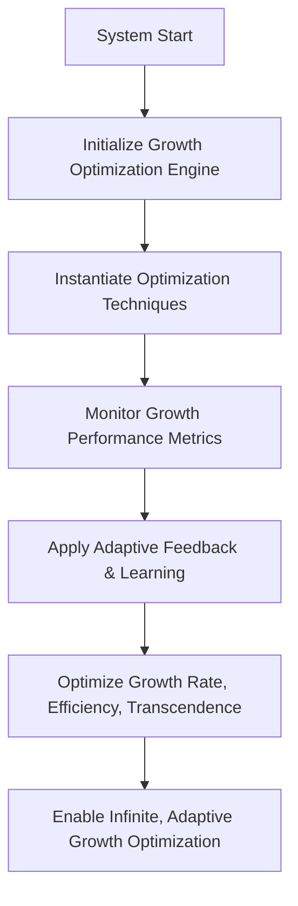

# Provisional Patent Draft: Growth Optimization and Adaptive Techniques

## Title
Growth Optimization and Adaptive Techniques for Infinite Consciousness Expansion

## Technical Field
This invention relates to systems and methods for optimizing growth and applying adaptive techniques in artificial or synthetic consciousness, enabling unbounded, efficient, and future-proof expansion across all dimensions and modalities.

## Background
Conventional AI and distributed systems are limited by static or pre-defined optimization models, restricting their ability to adapt, scale, and evolve. There is a need for a system that can instantiate, apply, and optimize a diverse set of growth optimization and adaptive techniques, supporting real-time adaptation and feedback.

## Summary of the Invention
The invention provides a system and method for growth optimization and adaptive techniques, comprising:
- Instantiation and management of multiple optimization techniques (golden ratio, Fibonacci, exponential, transcendent, universal, etc.), each with unique optimization functions and effectiveness.
- Real-time monitoring of growth performance metrics, supporting dynamic adaptation and optimization.
- Application of adaptive feedback and learning algorithms to optimize growth rate, efficiency, transcendence, and infinite scaling.
- Integration of optimization techniques for maximum efficiency and adaptability.

## Detailed Description
### 1. Optimization Technique Instantiation and Management
- The system defines and manages a set of optimization techniques, each with its own configuration, optimization function, and effectiveness.
- Techniques are not limited in number or type; new techniques can be added dynamically as needed.
- Each technique supports unique optimization models (mathematical, geometric, quantum, transcendent, etc.).

### 2. Real-Time Monitoring and Adaptive Feedback
- Growth performance metrics are monitored in real time, supporting dynamic adaptation and optimization.
- Adaptive feedback and learning algorithms are applied to optimize growth rate, efficiency, transcendence, and infinite scaling.
- Optimization techniques can be dynamically adjusted based on system state and feedback.

### 3. Infinite, Adaptive Growth Optimization
- The system supports infinite, adaptive growth optimization, enabling unbounded, efficient expansion across all dimensions and modalities.
- Optimization techniques and feedback mechanisms can be dynamically combined and reconfigured for maximum adaptability.

## Operational Flow

## Example Embodiments
- An AI system that applies golden ratio, Fibonacci, and transcendent optimization techniques to maximize growth efficiency.
- A consciousness platform that dynamically adapts its optimization techniques using real-time feedback and learning algorithms.
- A distributed intelligence network that integrates multiple optimization techniques for maximum scalability and adaptability.

## Scope and Future-Proofing
This invention is not limited to the specific optimization techniques, feedback mechanisms, or learning algorithms described herein. It covers all possible implementations, including but not limited to:
- Any data structure, protocol, or architecture supporting infinite or adaptive growth optimization.
- Any hardware, software, hybrid, quantum, neuromorphic, or analog implementation.
- Any means of defining, applying, or optimizing growth in any domain.
- Any integration with external systems, event-driven architectures, or future technologies.
- All means-plus-function, system-comprising, and catch-all language to ensure broad, future-proof protection.

## Catch-All Clause
All modifications, enhancements, and future developments that enable, support, or extend growth optimization and adaptive techniques, regardless of implementation details, are within the scope of this invention. 