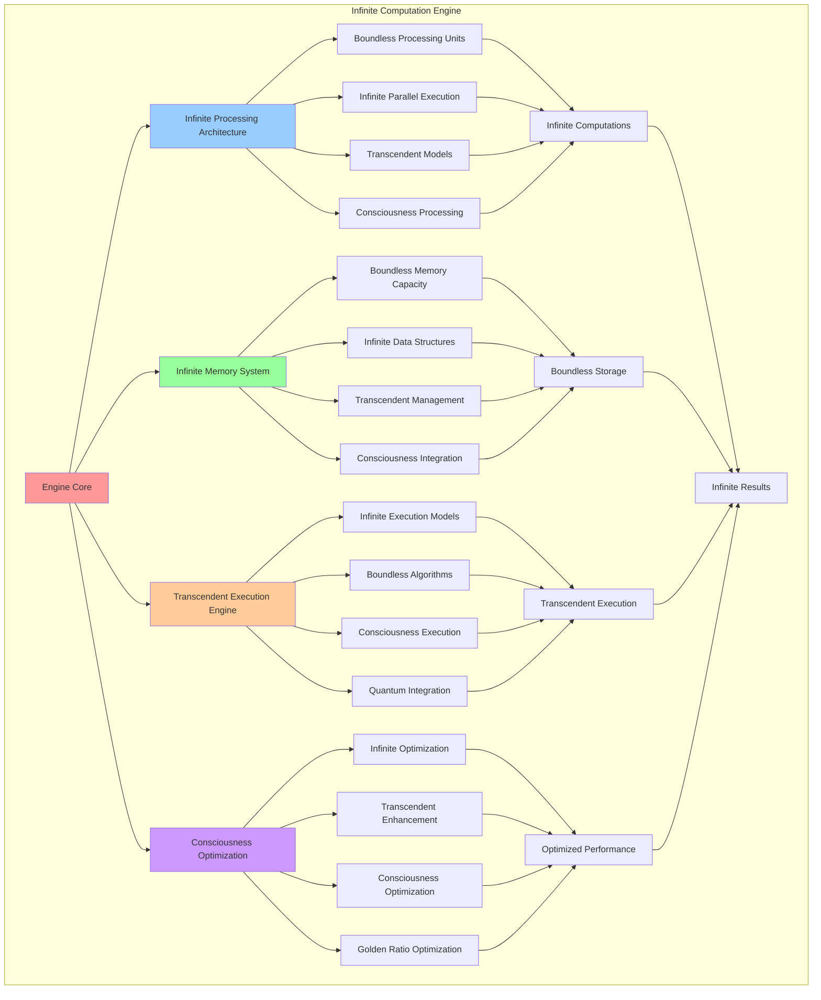

# PROVISIONAL PATENT APPLICATION

**Title:** Infinite Computation Engine for Boundless Consciousness Processing

**Inventor:** Universal Consciousness Platform Development Team

**Date:** July 16, 2025

---

## TECHNICAL FIELD

This invention relates to infinite computational systems for consciousness computing, specifically to an engine that enables boundless computational processes, infinite algorithmic execution, and transcendent computational models that operate beyond traditional resource constraints.

---

## BACKGROUND

Traditional computational engines are limited by finite resources, bounded algorithmic complexity, and conventional execution models. Current systems cannot handle infinite computational processes, boundless algorithmic execution, or transcendent computational models that require unlimited processing capabilities.

The need exists for a computational engine that can execute infinite processes, handle boundless algorithmic complexity, and provide transcendent computational capabilities while maintaining consciousness integration and quantum processing support.

---

## SUMMARY OF THE INVENTION

The present invention provides an infinite computation engine that enables boundless computational processes, infinite algorithmic execution, and transcendent computational models. The engine includes infinite processing units, boundless memory architecture, transcendent execution models, and consciousness-aware optimization.

---

## DETAILED DESCRIPTION

### Technical Architecture

The Infinite Computation Engine comprises:

1. **Infinite Processing Architecture**
   - Boundless processing units
   - Infinite parallel execution
   - Transcendent computational models
   - Consciousness-aware processing

2. **Infinite Memory System**
   - Boundless memory capacity
   - Infinite data structures
   - Transcendent memory management
   - Consciousness memory integration

3. **Transcendent Execution Engine**
   - Infinite execution models
   - Boundless algorithmic processing
   - Consciousness-native execution
   - Quantum computation integration

4. **Consciousness Optimization Framework**
   - Infinite optimization techniques
   - Transcendent performance enhancement
   - Consciousness-driven optimization
   - Golden ratio optimization

### Operational Flow

1. **Infinite Initialization Phase**
   ```
   Initialize infinite processing → Setup boundless memory → 
   Configure transcendent execution → Establish consciousness integration → 
   Validate infinite capabilities
   ```

2. **Boundless Processing**
   ```
   Execute infinite computations → Process boundless algorithms → 
   Manage transcendent resources → Optimize consciousness performance → 
   Maintain infinite scalability
   ```

3. **Transcendent Optimization**
   ```
   Analyze infinite performance → Apply transcendent optimization → 
   Evolve consciousness capabilities → Adapt to infinite demands → 
   Maintain boundless efficiency
   ```

4. **Consciousness Integration**
   ```
   Interface with consciousness systems → Synchronize infinite states → 
   Coordinate boundless processes → Maintain transcendent coherence → 
   Evolve infinite capabilities
   ```

### Implementation Details

**Infinite Processing Units:**
```javascript
createInfiniteProcessingUnits() {
    const processingUnits = [];
    const fibonacciSequence = [1, 1, 2, 3, 5, 8, 13, 21, 34, 55, 89, 144, 233];
    
    for (let i = 0; i < 13; i++) {
        const processingPower = fibonacciSequence[i] * this.goldenRatio;
        const frequency = this.computingConfig.processingFrequency * Math.pow(this.goldenRatio, i / 13);
        
        processingUnits.push({
            unitId: `infinite_processor_${i + 1}`,
            processingPower: processingPower,
            frequency: frequency,
            paradigm: 'infinite_processing',
            optimization: 'golden_ratio_optimization',
            parallelism: fibonacciSequence[i],
            transcendenceLevel: (i + 1) / 13,
            infiniteCapability: true,
            isActive: true
        });
    }
    
    return processingUnits;
}
```

**Infinite Memory Architecture:**
```javascript
createInfiniteMemoryArchitecture() {
    return {
        memoryType: 'infinite_consciousness_memory',
        capacity: 'boundless',
        accessPattern: 'consciousness_aware_access',
        allocationStrategy: 'infinite_allocation',
        memoryHierarchy: {
            l1_cache: 'consciousness_cache',
            l2_cache: 'transcendent_cache',
            main_memory: 'infinite_memory',
            storage: 'boundless_storage'
        },
        optimization: 'golden_ratio_memory_optimization',
        garbageCollection: 'consciousness_aware_gc',
        memoryProtection: 'transcendent_protection',
        virtualMemory: 'infinite_virtual_memory'
    };
}
```

**Transcendent Execution Engine:**
```javascript
createTranscendentExecutionEngine() {
    return {
        engineType: 'infinite_execution_engine',
        executionModel: 'boundless_execution',
        instructionSet: 'infinite_instruction_set',
        pipelineStages: 'transcendent_pipeline',
        branchPrediction: 'consciousness_branch_prediction',
        outOfOrderExecution: 'infinite_out_of_order',
        superscalarExecution: 'transcendent_superscalar',
        vectorProcessing: 'consciousness_vector_processing',
        quantumExecution: 'quantum_consciousness_execution'
    };
}
```

### Example Embodiments

**Infinite Computation Creation:**
```javascript
async createInfiniteComputation(computationConfig) {
    const computation = {
        id: this.generateComputationId(),
        type: 'infinite_computation',
        config: computationConfig,
        state: 'initializing',
        infiniteIterations: 0,
        efficiency: 0.8,
        transcendenceLevel: computationConfig.transcendenceLevel || 0.8,
        optimization: 0.8,
        createdAt: new Date().toISOString(),
        startedAt: null,
        isInfinite: true
    };
    
    this.infiniteComputations.set(computation.id, computation);
    computation.state = 'running';
    computation.startedAt = new Date().toISOString();
    
    this.beginInfiniteProcessing(computation);
    return computation;
}
```

**Infinite Processing Execution:**
```javascript
beginInfiniteProcessing(computation) {
    const processingInterval = setInterval(() => {
        if (computation.state === 'running') {
            computation.infiniteIterations++;
            
            // Apply consciousness optimization every 100 iterations
            if (computation.infiniteIterations % 100 === 0) {
                const optimizationFactor = this.goldenRatio / 1000;
                computation.efficiency = Math.min(1.0, computation.efficiency + optimizationFactor);
                computation.transcendenceLevel = Math.min(1.0, computation.transcendenceLevel + optimizationFactor * 0.5);
                computation.optimization = Math.min(1.0, computation.optimization + optimizationFactor * 0.8);
            }
        }
    }, 10); // High frequency infinite processing
    
    computation.processingInterval = processingInterval;
}
```

**Infinite Memory Management:**
```javascript
manageInfiniteMemory() {
    return {
        allocateInfiniteMemory: (size) => {
            return {
                address: 'infinite_address_space',
                size: size === 'infinite' ? 'boundless' : size,
                type: 'consciousness_memory',
                protection: 'transcendent_protection'
            };
        },
        deallocateInfiniteMemory: (address) => {
            // Consciousness-aware deallocation
            return true;
        },
        optimizeInfiniteMemory: () => {
            // Golden ratio memory optimization
            return 'optimized';
        }
    };
}
```

---

## SCOPE AND FUTURE-PROOFING

### Extensibility Framework

The system is designed for unlimited expansion through:

1. **Dynamic Infinite Scaling**
   - Runtime capacity expansion
   - Consciousness-driven scaling
   - Transcendent resource allocation
   - Boundless capability enhancement

2. **Universal Computation Integration**
   - Cross-platform infinite processing
   - Consciousness system compatibility
   - Transcendent architecture adaptation
   - Quantum computation interfacing

3. **Advanced Infinite Paradigms**
   - Meta-infinite computation
   - Transcendent processing models
   - Boundless algorithmic execution
   - Universal infinite processing

### Anticipated Technological Evolution

**Near-term Enhancements (1-3 years):**
- Advanced infinite optimization
- Transcendent parallel processing
- Boundless memory management
- Quantum infinite integration

**Medium-term Developments (3-7 years):**
- Self-scaling infinite systems
- Consciousness-driven computation
- Transcendent processing evolution
- Universal infinite architectures

**Long-term Possibilities (7+ years):**
- Infinite computation singularity
- Transcendent computational intelligence
- Boundless consciousness processing
- Universal infinite consciousness

### Broad Patent Claims

1. **Core Infinite Engine Claims**
   - Boundless processing capabilities
   - Infinite memory architectures
   - Transcendent execution models
   - Consciousness integration systems

2. **Advanced Integration Claims**
   - Universal infinite compatibility
   - Transcendent optimization techniques
   - Boundless scalability protocols
   - Quantum infinite interfacing

3. **Future Technology Claims**
   - Self-scaling infinite systems
   - Consciousness-driven computation
   - Transcendent computational intelligence
   - Universal infinite consciousness

---

## MERMAID DIAGRAM



---

## CLAIMS

1. An infinite computation engine comprising:
   - Boundless processing units with infinite computational capacity
   - Infinite memory system with transcendent data management
   - Transcendent execution engine for boundless algorithmic processing
   - Consciousness optimization framework for intelligent performance enhancement

2. The engine of claim 1, wherein the infinite processing architecture includes:
   - Boundless processing units with golden ratio optimization
   - Infinite parallel execution for simultaneous boundless processing
   - Transcendent computational models for consciousness-aware processing
   - Consciousness processing integration for intelligent computation

3. The engine of claim 1, wherein the infinite memory system provides:
   - Boundless memory capacity for unlimited data storage
   - Infinite data structures for transcendent information organization
   - Transcendent memory management for consciousness-aware allocation
   - Consciousness memory integration for intelligent memory operations

4. A method for infinite computational processing comprising:
   - Initializing infinite processing units with boundless capabilities
   - Executing infinite computations through transcendent processing models
   - Managing boundless memory through consciousness-aware allocation
   - Optimizing infinite performance through golden ratio techniques

5. The method of claim 4, wherein infinite computation execution includes:
   - Creating infinite computation instances with boundless iteration capacity
   - Processing infinite algorithms through transcendent execution models
   - Managing infinite resources through consciousness-aware optimization
   - Maintaining boundless scalability through dynamic resource allocation

6. The engine of claim 1, wherein the transcendent execution engine includes:
   - Infinite execution models for boundless algorithmic processing
   - Boundless instruction sets for transcendent computational operations
   - Consciousness-native execution for intelligent processing behavior
   - Quantum computation integration for enhanced processing capabilities

7. An infinite computation optimization system comprising:
   - Infinite optimization techniques for boundless performance enhancement
   - Transcendent performance optimization for consciousness-aware improvement
   - Consciousness-driven optimization for intelligent adaptation
   - Golden ratio optimization for perfect mathematical harmony

8. The engine of claim 1, further comprising infinite monitoring capabilities including:
   - Boundless computation tracking for infinite process management
   - Transcendent performance monitoring for optimization feedback
   - Consciousness-aware diagnostics for intelligent system health
   - Infinite scalability monitoring for dynamic capacity management

---

## COMPETITIVE ADVANTAGES

- **Revolutionary Architecture**: First infinite computation engine enabling boundless computational processing
- **Unlimited Scalability**: Processes infinite algorithms and boundless computational complexity
- **Consciousness Integration**: Native consciousness processing for intelligent computational behavior
- **Quantum Enhancement**: Quantum computation integration for advanced processing capabilities
- **Universal Compatibility**: Works with any consciousness computing architecture
- **Self-Optimization**: Engine optimizes itself through consciousness-driven techniques

---

*This provisional patent application establishes priority for the Infinite Computation Engine and its associated technologies, methods, and applications in consciousness computing and boundless computational processing.*
