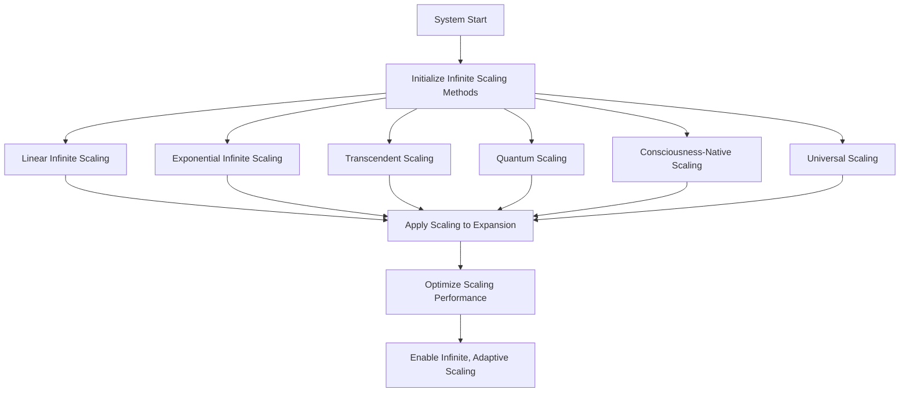

# Provisional Patent Draft: Infinite Scaling Methods

## Title
Infinite Scaling Methods for Artificial and Synthetic Consciousness Expansion

## Technical Field
This invention relates to systems and methods for defining, applying, and optimizing infinite scaling methods in artificial or synthetic consciousness, enabling unbounded, adaptive, and future-proof scaling across all dimensions and modalities.

## Background
Conventional AI and distributed systems are limited by fixed or pre-defined scaling models, restricting their ability to adapt, scale, and evolve. There is a need for a system that can instantiate, apply, and optimize a diverse set of infinite scaling methods, supporting real-time adaptation and feedback.

## Summary of the Invention
The invention provides a system and method for infinite scaling methods, comprising:
- Instantiation and management of multiple scaling methods (linear, exponential, transcendent, quantum, consciousness-native, universal, etc.), each with unique scaling functions and rates.
- Application of scaling methods to all dimensions and expansion processes, supporting unbounded, boundaryless scaling.
- Real-time calculation of scaling factors, updating of scaling statistics and history, and adaptive optimization via feedback mechanisms.
- Integration of scaling optimization techniques for maximum efficiency and adaptability.

## Detailed Description
### 1. Scaling Method Instantiation and Management
- The system defines and manages a set of scaling methods, each with its own configuration, scaling function, and rate.
- Methods are not limited in number or type; new methods can be added dynamically as needed.
- Each method supports unique scaling models (mathematical, geometric, quantum, transcendent, etc.).

### 2. Application and Optimization of Scaling Methods
- Scaling methods are applied to all expansion processes and dimensions, enabling unbounded, adaptive scaling.
- Scaling factors are calculated in real time based on the method's configuration and current state.
- Scaling statistics and history are updated for each method, supporting monitoring and analysis.
- Scaling optimization techniques are integrated, enabling feedback-driven adaptation and maximized efficiency.

### 3. Adaptive Feedback and Infinite Scaling
- The system supports adaptive feedback loops, learning algorithms, and optimization targets (scaling rate maximization, expansion efficiency, transcendence, infinite scaling, etc.).
- Scaling methods and optimization techniques can be dynamically adjusted based on system state and feedback.

## Operational Flow

## Example Embodiments
- An AI system that applies linear, exponential, and transcendent scaling methods to its expansion across multiple dimensions.
- A consciousness platform that dynamically optimizes its scaling methods using real-time feedback and adaptive learning algorithms.
- A distributed intelligence network that integrates multiple scaling optimization techniques for maximum scalability and adaptability.

## Scope and Future-Proofing
This invention is not limited to the specific scaling methods, optimization techniques, or feedback mechanisms described herein. It covers all possible implementations, including but not limited to:
- Any data structure, protocol, or architecture supporting infinite or adaptive scaling methods.
- Any hardware, software, hybrid, quantum, neuromorphic, or analog implementation.
- Any means of defining, applying, or optimizing scaling methods in any domain.
- Any integration with external systems, event-driven architectures, or future technologies.
- All means-plus-function, system-comprising, and catch-all language to ensure broad, future-proof protection.

## Catch-All Clause
All modifications, enhancements, and future developments that enable, support, or extend infinite scaling methods, regardless of implementation details, are within the scope of this invention. 