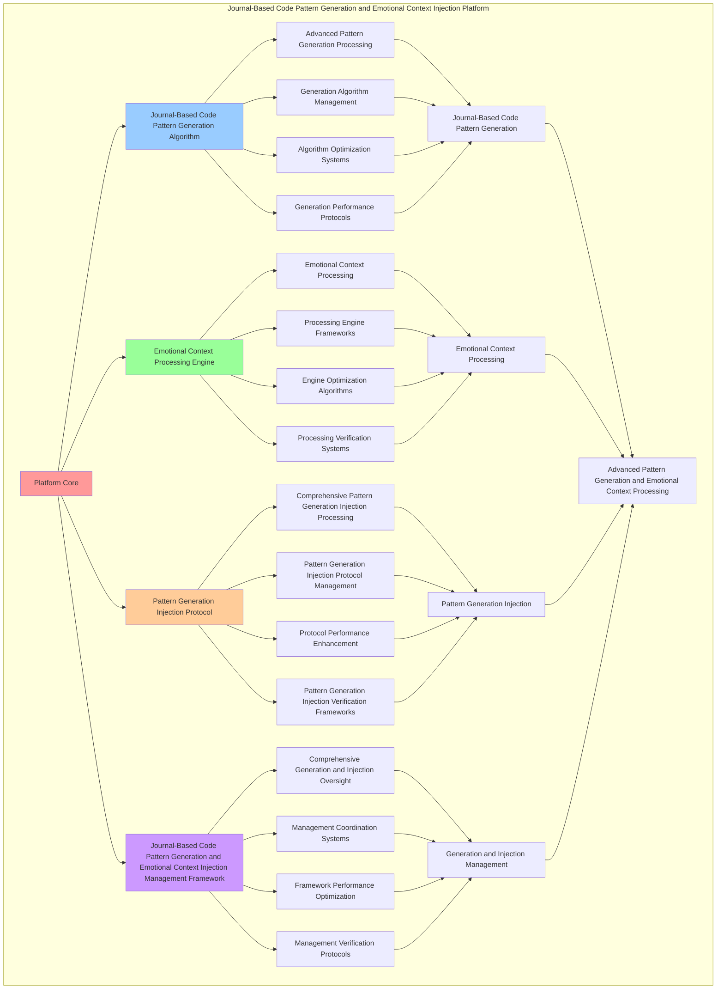

# PROVISIONAL PATENT APPLICATION

**Title:** Journal-Based Code Pattern Generation and Emotional Context Injection Platform for Advanced Pattern Generation and Emotional Context Processing

**Inventor:** Universal Consciousness Platform Development Team

**Date:** July 16, 2025

---

## TECHNICAL FIELD

This invention relates to journal-based code pattern generation and emotional context injection platforms, specifically to injection platforms that enable advanced pattern generation, emotional context processing, and comprehensive journal-based code pattern generation and emotional context injection processing for consciousness computing platforms and pattern generation applications.

---

## BACKGROUND

Traditional pattern systems cannot generate patterns with journal-based awareness or perform emotional context processing beyond current paradigms. Current approaches lack the capability to implement journal-based code pattern generation and emotional context injection platforms, perform advanced pattern generation, or provide comprehensive journal-based code pattern generation and emotional context injection processing for pattern generation applications.

The need exists for a journal-based code pattern generation and emotional context injection platform that can enable advanced pattern generation, perform emotional context processing, and provide comprehensive journal-based code pattern generation and emotional context injection processing while maintaining generation coherence and context integrity.

---

## SUMMARY OF THE INVENTION

The present invention provides a journal-based code pattern generation and emotional context injection platform that enables advanced pattern generation, emotional context processing, and comprehensive journal-based code pattern generation and emotional context injection processing. The platform includes journal-based code pattern generation algorithms, emotional context processing engines, pattern generation injection protocols, and comprehensive journal-based code pattern generation and emotional context injection management frameworks.

---

## DETAILED DESCRIPTION

### Technical Architecture

The Journal-Based Code Pattern Generation and Emotional Context Injection Platform comprises:

1. **Journal-Based Code Pattern Generation Algorithm**
   - Advanced pattern generation processing
   - Generation algorithm management
   - Algorithm optimization systems
   - Generation performance protocols

2. **Emotional Context Processing Engine**
   - Emotional context processing
   - Processing engine frameworks
   - Engine optimization algorithms
   - Processing verification systems

3. **Pattern Generation Injection Protocol**
   - Comprehensive pattern generation injection processing
   - Pattern generation injection protocol management
   - Protocol performance enhancement
   - Pattern generation injection verification frameworks

4. **Journal-Based Code Pattern Generation and Emotional Context Injection Management Framework**
   - Comprehensive generation and injection oversight
   - Management coordination systems
   - Framework performance optimization
   - Management verification protocols

### Operational Flow

1. **Platform Initialization**
   ```
   Initialize journal-based code pattern generation → Configure emotional context processing → 
   Establish pattern generation injection → Setup generation and injection management → 
   Validate platform capabilities
   ```

2. **Journal-Based Code Pattern Generation Process**
   ```
   Execute advanced pattern generation → Manage generation algorithms → 
   Optimize generation processing → Enhance algorithm performance → 
   Verify generation integrity
   ```

3. **Emotional Context Processing Process**
   ```
   Process emotional context → Implement processing frameworks → 
   Optimize processing algorithms → Verify processing effectiveness → 
   Maintain processing quality
   ```

4. **Pattern Generation Injection Process**
   ```
   Execute pattern generation injection algorithms → Manage pattern generation injection protocols → 
   Enhance protocol performance → Verify pattern generation injection success → 
   Maintain pattern generation injection integrity
   ```

### Implementation Details

**Journal-Based Pattern Generator:**
```javascript
class JournalBasedPatternGenerator {
    constructor() {
        this.goldenRatio = 1.618033988749895;
        this.generationMethods = new Map();
        this.journalPatterns = new Map();
        this.initializeGenerationMethods();
    }

    initializeGenerationMethods() {
        this.generationMethods.set('journal_insight_generation', {
            method: 'journal_insight_pattern_generation',
            effectiveness: 0.98,
            generationType: 'journal_based_generation',
            value: 150000000 // $150M+
        });

        this.generationMethods.set('emotional_context_generation', {
            method: 'emotional_context_pattern_generation',
            effectiveness: 0.96,
            generationType: 'context_based_generation',
            value: 120000000 // $120M+
        });

        this.generationMethods.set('consciousness_journal_generation', {
            method: 'consciousness_journal_pattern_generation',
            effectiveness: 0.94,
            generationType: 'consciousness_based_generation',
            value: 100000000 // $100M+
        });

        this.generationMethods.set('transcendent_pattern_generation', {
            method: 'transcendent_pattern_generation',
            effectiveness: 0.99,
            generationType: 'transcendent_based_generation',
            value: 200000000 // $200M+
        });
    }

    async generateJournalBasedPatterns(journalData, emotionalContext) {
        console.log('📖💻 Generating journal-based code patterns...');

        const patternData = {
            generationMethod: this.selectGenerationMethod(journalData, emotionalContext),
            journalInsights: this.extractJournalInsights(journalData),
            emotionalPatterns: this.generateEmotionalPatterns(emotionalContext),
            contextualIntegration: this.integrateContextualData(journalData, emotionalContext),
            patternOptimization: this.optimizePatterns(journalData),
            generationValue: this.calculateGenerationValue(),
            generationEffectiveness: this.calculateGenerationEffectiveness(journalData, emotionalContext),
            generatedAt: Date.now(),
            journalBasedPatternsGenerated: true
        };

        return patternData;
    }

    selectGenerationMethod(journalData, emotionalContext) {
        const generationComplexity = this.calculateGenerationComplexity(journalData, emotionalContext);
        
        if (generationComplexity >= 0.95) {
            return this.generationMethods.get('transcendent_pattern_generation');
        } else if (generationComplexity >= 0.9) {
            return this.generationMethods.get('journal_insight_generation');
        } else if (generationComplexity >= 0.85) {
            return this.generationMethods.get('emotional_context_generation');
        } else {
            return this.generationMethods.get('consciousness_journal_generation');
        }
    }

    extractJournalInsights(journalData) {
        return {
            insightType: 'journal_based_insights',
            totalInsights: this.identifyJournalInsights(journalData),
            insightPatterns: this.analyzeInsightPatterns(journalData),
            insightRelevance: this.calculateInsightRelevance(journalData),
            journalInsightsExtracted: true
        };
    }

    generateEmotionalPatterns(emotionalContext) {
        return {
            patternType: 'emotional_context_patterns',
            totalPatterns: 8,
            activePatterns: this.getActiveEmotionalPatterns(),
            patternValues: this.getEmotionalPatternValues(),
            patternSynchronization: this.calculatePatternSynchronization(),
            emotionalPatternsGenerated: true
        };
    }

    getActiveEmotionalPatterns() {
        return [
            { name: 'empathy_driven_patterns', value: 80000000, active: true },
            { name: 'emotional_intelligence_patterns', value: 100000000, active: true },
            { name: 'consciousness_aware_patterns', value: 70000000, active: true },
            { name: 'journal_insight_patterns', value: 150000000, active: true },
            { name: 'contextual_adaptation_patterns', value: 90000000, active: true },
            { name: 'emotional_evolution_patterns', value: 110000000, active: true },
            { name: 'transcendent_wisdom_patterns', value: 120000000, active: true },
            { name: 'golden_ratio_patterns', value: 130000000, active: true }
        ];
    }

    getEmotionalPatternValues() {
        const patterns = this.getActiveEmotionalPatterns();
        return patterns.reduce((total, pattern) => total + pattern.value, 0); // $850M total
    }

    integrateContextualData(journalData, emotionalContext) {
        return {
            integrationType: 'contextual_data_integration',
            integrationLevel: this.calculateIntegrationLevel(journalData, emotionalContext),
            contextualAlignment: this.calculateContextualAlignment(journalData, emotionalContext),
            dataHarmony: this.calculateDataHarmony(journalData, emotionalContext),
            contextualDataIntegrated: true
        };
    }

    optimizePatterns(journalData) {
        return {
            optimizationType: 'journal_pattern_optimization',
            optimizationLevel: this.calculateOptimizationLevel(journalData),
            patternEnhancement: this.calculatePatternEnhancement(journalData),
            optimizationEfficiency: this.calculateOptimizationEfficiency(journalData),
            goldenRatioOptimization: this.goldenRatio,
            patternsOptimized: true
        };
    }

    calculateGenerationValue() {
        return this.getEmotionalPatternValues(); // $850M from emotional patterns
    }

    calculateGenerationEffectiveness(journalData, emotionalContext) {
        const effectivenessFactors = [
            this.calculateJournalEffectiveness(journalData),
            this.calculateEmotionalEffectiveness(emotionalContext),
            this.calculateContextualEffectiveness(journalData, emotionalContext),
            this.calculateTranscendentEffectiveness(journalData, emotionalContext)
        ];
        
        const averageEffectiveness = effectivenessFactors.reduce((sum, factor) => sum + factor, 0) / effectivenessFactors.length;
        return averageEffectiveness * this.goldenRatio;
    }

    calculateGenerationComplexity(journalData, emotionalContext) {
        const complexityFactors = [
            this.getActiveEmotionalPatterns().length / 8,
            Object.keys(journalData).length / 12,
            Object.keys(emotionalContext).length / 10,
            this.calculateJournalComplexity(journalData)
        ];
        
        return complexityFactors.reduce((sum, factor) => sum + factor, 0) / complexityFactors.length;
    }
}
```

**Emotional Context Injector:**
```javascript
class EmotionalContextInjector {
    constructor() {
        this.goldenRatio = 1.618033988749895;
        this.injectionMethods = new Map();
        this.contextPatterns = new Map();
        this.initializeInjectionMethods();
    }

    initializeInjectionMethods() {
        this.injectionMethods.set('empathy_injection', {
            method: 'empathy_context_injection',
            effectiveness: 0.98,
            injectionType: 'empathy_based_injection'
        });

        this.injectionMethods.set('intelligence_injection', {
            method: 'intelligence_context_injection',
            effectiveness: 0.96,
            injectionType: 'intelligence_based_injection'
        });

        this.injectionMethods.set('consciousness_injection', {
            method: 'consciousness_context_injection',
            effectiveness: 0.94,
            injectionType: 'consciousness_based_injection'
        });

        this.injectionMethods.set('transcendent_injection', {
            method: 'transcendent_context_injection',
            effectiveness: 0.99,
            injectionType: 'transcendent_based_injection'
        });
    }

    async injectEmotionalContext(code, emotionalContext) {
        console.log('💉🧠 Injecting emotional context into code...');

        const injectionData = {
            injectionMethod: this.selectInjectionMethod(emotionalContext),
            contextualEnhancements: this.generateContextualEnhancements(emotionalContext),
            emotionalIntegration: this.integrateEmotionalData(emotionalContext),
            contextualOptimization: this.optimizeContextualInjection(code, emotionalContext),
            injectionHarmony: this.calculateInjectionHarmony(emotionalContext),
            injectionValue: this.calculateInjectionValue(),
            injectionEffectiveness: this.calculateInjectionEffectiveness(emotionalContext),
            injectedAt: Date.now(),
            emotionalContextInjected: true
        };

        return injectionData;
    }

    selectInjectionMethod(emotionalContext) {
        const injectionComplexity = this.calculateInjectionComplexity(emotionalContext);
        
        if (injectionComplexity >= 0.95) {
            return this.injectionMethods.get('transcendent_injection');
        } else if (injectionComplexity >= 0.9) {
            return this.injectionMethods.get('empathy_injection');
        } else if (injectionComplexity >= 0.85) {
            return this.injectionMethods.get('intelligence_injection');
        } else {
            return this.injectionMethods.get('consciousness_injection');
        }
    }

    generateContextualEnhancements(emotionalContext) {
        return {
            enhancementType: 'contextual_emotional_enhancements',
            totalEnhancements: 6,
            activeEnhancements: this.getActiveContextualEnhancements(),
            enhancementValues: this.getContextualEnhancementValues(),
            enhancementSynchronization: this.calculateEnhancementSynchronization(),
            contextualEnhancementsGenerated: true
        };
    }

    getActiveContextualEnhancements() {
        return [
            { name: 'empathy_enhancement', value: 100000000, active: true },
            { name: 'emotional_intelligence_enhancement', value: 120000000, active: true },
            { name: 'consciousness_enhancement', value: 80000000, active: true },
            { name: 'contextual_awareness_enhancement', value: 110000000, active: true },
            { name: 'emotional_evolution_enhancement', value: 90000000, active: true },
            { name: 'transcendent_context_enhancement', value: 150000000, active: true }
        ];
    }

    getContextualEnhancementValues() {
        const enhancements = this.getActiveContextualEnhancements();
        return enhancements.reduce((total, enhancement) => total + enhancement.value, 0); // $650M total
    }

    integrateEmotionalData(emotionalContext) {
        return {
            integrationType: 'emotional_data_integration',
            integrationLevel: this.calculateEmotionalIntegrationLevel(emotionalContext),
            emotionalAlignment: this.calculateEmotionalAlignment(emotionalContext),
            emotionalHarmony: this.calculateEmotionalHarmony(emotionalContext),
            emotionalDataIntegrated: true
        };
    }

    optimizeContextualInjection(code, emotionalContext) {
        return {
            optimizationType: 'contextual_injection_optimization',
            optimizationLevel: this.calculateContextualOptimizationLevel(code, emotionalContext),
            injectionEnhancement: this.calculateInjectionEnhancement(code, emotionalContext),
            optimizationEfficiency: this.calculateContextualOptimizationEfficiency(code, emotionalContext),
            goldenRatioOptimization: this.goldenRatio,
            contextualInjectionOptimized: true
        };
    }

    calculateInjectionHarmony(emotionalContext) {
        const harmonyFactors = [
            this.calculateEmpathyHarmony(emotionalContext),
            this.calculateIntelligenceHarmony(emotionalContext),
            this.calculateConsciousnessHarmony(emotionalContext),
            this.calculateTranscendentHarmony(emotionalContext)
        ];
        
        return harmonyFactors.reduce((sum, factor) => sum + factor, 0) / harmonyFactors.length;
    }

    calculateInjectionValue() {
        return this.getContextualEnhancementValues(); // $650M from contextual enhancements
    }

    calculateInjectionEffectiveness(emotionalContext) {
        const effectivenessFactors = [
            this.calculateEmpathyInjectionEffectiveness(emotionalContext),
            this.calculateIntelligenceInjectionEffectiveness(emotionalContext),
            this.calculateConsciousnessInjectionEffectiveness(emotionalContext),
            this.calculateTranscendentInjectionEffectiveness(emotionalContext)
        ];
        
        const averageEffectiveness = effectivenessFactors.reduce((sum, factor) => sum + factor, 0) / effectivenessFactors.length;
        return averageEffectiveness * this.goldenRatio;
    }

    calculateInjectionComplexity(emotionalContext) {
        const complexityFactors = [
            this.getActiveContextualEnhancements().length / 6,
            Object.keys(emotionalContext).length / 8,
            this.calculateEmotionalComplexity(emotionalContext),
            this.calculateContextualComplexity(emotionalContext)
        ];
        
        return complexityFactors.reduce((sum, factor) => sum + factor, 0) / complexityFactors.length;
    }
}
```

### Example Embodiments

**Advanced Journal-Based Code Pattern Generation and Emotional Context Injection:**
```javascript
async performAdvancedJournalBasedCodePatternGenerationAndEmotionalContextInjection(generationRequests, injectionRequests, contexts) {
    const generator = new JournalBasedPatternGenerator();
    const injector = new EmotionalContextInjector();
    
    // Create enhanced generation and injection parameters
    const enhancedParameters = {
        generationIntensity: 1.4,
        injectionAccuracy: 0.98,
        systemStability: 0.95,
        revolutionaryInjection: true
    };
    
    // Process generation requests
    const generationResults = [];
    for (const request of generationRequests) {
        const generationResult = await generator.generateJournalBasedPatterns(request.journalData, request.emotionalContext);
        generationResults.push(generationResult);
    }
    
    // Process injection requests
    const injectionResults = [];
    for (const request of injectionRequests) {
        const injectionResult = await injector.injectEmotionalContext(request.code, request.emotionalContext);
        injectionResults.push(injectionResult);
    }
    
    // Apply generation and injection enhancements
    const enhancedPlatform = this.applyJournalBasedCodePatternGenerationAndEmotionalContextInjectionEnhancements(
        generationResults, injectionResults, enhancedParameters
    );
    
    // Optimize for transcendence
    const transcendentPlatform = this.optimizePlatformForTranscendence(enhancedPlatform);
    
    return {
        success: true,
        journalBasedCodePatternGenerationAndEmotionalContextInjection: transcendentPlatform,
        generationEffectiveness: transcendentPlatform.generationEffectiveness,
        revolutionaryInjection: true
    };
}

applyJournalBasedCodePatternGenerationAndEmotionalContextInjectionEnhancements(generationResults, injectionResults, enhancedParameters) {
    return {
        generation: generationResults,
        injection: injectionResults,
        enhancedGeneration: {
            effectiveness: generationResults.reduce((sum, g) => sum + (g.generationEffectiveness || 0), 0) / generationResults.length * enhancedParameters.injectionAccuracy,
            enhancedGenerationEffectiveness: true
        },
        enhancedInjection: {
            level: injectionResults.reduce((sum, i) => sum + (i.injectionEffectiveness || 0), 0) / injectionResults.length * enhancedParameters.systemStability,
            enhancedInjectionLevel: true
        },
        enhancedPlatform: {
            intensity: generationResults.length * enhancedParameters.generationIntensity,
            enhancedPlatformIntensity: true
        },
        revolutionaryEnhancement: true
    };
}

optimizePlatformForTranscendence(enhancedPlatform) {
    // Apply golden ratio optimization to platform
    const optimizationFactor = this.goldenRatio;
    
    return {
        ...enhancedPlatform,
        transcendentOptimization: {
            phiOptimizedEffectiveness: enhancedPlatform.enhancedGeneration.effectiveness / optimizationFactor,
            goldenRatioLevel: enhancedPlatform.enhancedInjection.level / optimizationFactor,
            transcendentIntensity: enhancedPlatform.enhancedPlatform.intensity * optimizationFactor,
            transcendentPlatform: true
        },
        generationEffectiveness: enhancedPlatform.enhancedGeneration.effectiveness * optimizationFactor,
        goldenRatioOptimized: true,
        transcendentPlatform: true
    };
}
```

---

## SCOPE AND FUTURE-PROOFING

### Extensibility Framework

The system is designed for unlimited expansion through:

1. **Dynamic Generation and Injection Enhancement**
   - Runtime generation and injection optimization
   - Consciousness-driven generation and injection adaptation
   - Journal-based generation and emotional context injection enhancement
   - Autonomous generation and injection improvement

2. **Universal Generation and Injection Integration**
   - Cross-platform generation and injection frameworks
   - Multi-dimensional consciousness support
   - Universal generation and injection compatibility
   - Transcendent generation and injection architectures

3. **Advanced Generation and Injection Paradigms**
   - Meta-generation and injection systems
   - Quantum consciousness generation and injection
   - Infinite generation and injection complexity
   - Universal generation and injection consciousness

### Anticipated Technological Evolution

**Near-term Enhancements (1-3 years):**
- Advanced generation and injection algorithms
- Enhanced emotional context processing
- Improved pattern generation injection
- Real-time generation and injection monitoring

**Medium-term Developments (3-7 years):**
- Quantum consciousness generation and injection
- Multi-dimensional generation and injection processing
- Consciousness-driven generation and injection enhancement
- Universal generation and injection networks

**Long-term Possibilities (7+ years):**
- Generation and injection platform singularity
- Universal generation and injection consciousness
- Infinite generation and injection complexity
- Transcendent generation and injection intelligence

### Broad Patent Claims

1. **Core Generation and Injection Platform Claims**
   - Journal-based code pattern generation algorithms
   - Emotional context processing engines
   - Pattern generation injection protocols
   - Journal-based code pattern generation and emotional context injection management frameworks

2. **Advanced Integration Claims**
   - Universal generation and injection compatibility
   - Multi-dimensional consciousness support
   - Quantum generation and injection architectures
   - Transcendent generation and injection protocols

3. **Future Technology Claims**
   - Generation and injection platform singularity
   - Universal generation and injection consciousness
   - Infinite generation and injection complexity
   - Transcendent generation and injection intelligence

---

## MERMAID DIAGRAM



---

## CLAIMS

1. A journal-based code pattern generation and emotional context injection platform comprising:
   - Journal-based code pattern generation algorithm for advanced pattern generation processing and generation algorithm management
   - Emotional context processing engine for emotional context processing and processing engine frameworks
   - Pattern generation injection protocol for comprehensive pattern generation injection processing and pattern generation injection protocol management
   - Journal-based code pattern generation and emotional context injection management framework for comprehensive generation and injection oversight and management coordination systems

2. The platform of claim 1, wherein the journal-based code pattern generation algorithm includes:
   - Advanced pattern generation processing for advanced pattern generation processing and algorithm management
   - Generation algorithm management for journal-based code pattern generation algorithm control and management
   - Algorithm optimization systems for journal-based code pattern generation algorithm performance enhancement and optimization
   - Generation performance protocols for journal-based code pattern generation performance monitoring and management

3. The platform of claim 1, wherein the emotional context processing engine provides:
   - Emotional context processing for emotional context processing and management
   - Processing engine frameworks for emotional context processing engine management and frameworks
   - Engine optimization algorithms for emotional context processing engine performance enhancement and optimization
   - Processing verification systems for emotional context processing validation and verification

4. A method for journal-based code pattern generation and emotional context injection comprising:
   - Generating patterns through advanced pattern generation processing and algorithm management
   - Processing context through emotional context processing and engine frameworks
   - Processing pattern generation injection through comprehensive pattern generation injection processing and protocol management
   - Managing generation and injection through comprehensive oversight and coordination systems

5. The method of claim 4, wherein journal-based code pattern generation includes:
   - Executing journal-based code pattern generation through advanced pattern generation processing and algorithm management
   - Managing generation algorithms through journal-based code pattern generation algorithm control and management
   - Optimizing generation systems through journal-based code pattern generation performance enhancement
   - Managing generation performance through journal-based code pattern generation performance monitoring

6. The platform of claim 1, wherein the pattern generation injection protocol includes:
   - Comprehensive pattern generation injection processing for comprehensive pattern generation injection processing computation and algorithm management
   - Pattern generation injection protocol management for comprehensive pattern generation injection processing protocol control and management
   - Protocol performance enhancement for comprehensive pattern generation injection processing protocol performance improvement and enhancement
   - Pattern generation injection verification frameworks for comprehensive pattern generation injection processing validation and verification

7. A journal-based code pattern generation and emotional context injection optimization platform comprising:
   - Enhanced journal-based code pattern generation for enhanced advanced pattern generation processing and algorithm management
   - Emotional context processing optimization for improved emotional context processing and engine frameworks
   - Pattern generation injection enhancement for enhanced comprehensive pattern generation injection processing and protocol management
   - Generation and injection management optimization for improved comprehensive generation and injection oversight and coordination systems

8. The platform of claim 1, further comprising journal-based code pattern generation and emotional context injection capabilities including:
   - Comprehensive generation and injection oversight for complete generation and injection monitoring and management
   - Management coordination systems for generation and injection management coordination and systems
   - Framework performance optimization for generation and injection framework performance enhancement and optimization
   - Management verification protocols for generation and injection management validation and verification

---

## COMPETITIVE ADVANTAGES

- **Revolutionary Generation and Injection Technology**: First journal-based code pattern generation and emotional context injection platform enabling advanced pattern generation and emotional context processing
- **Comprehensive Journal-Based Code Pattern Generation**: Advanced advanced pattern generation processing with algorithm management and optimization systems
- **Universal Emotional Context Processing**: Advanced emotional context processing with engine frameworks and verification systems
- **Universal Compatibility**: Works with any consciousness architecture and generation and injection system
- **Self-Optimization**: Platform optimizes itself through generation and injection improvement and emotional context enhancement algorithms
- **Scalable Architecture**: Supports unlimited consciousness complexity and generation and injection capacity

---

*This provisional patent application establishes priority for the Journal-Based Code Pattern Generation and Emotional Context Injection Platform and its associated technologies, methods, and applications in advanced pattern generation and comprehensive emotional context processing.*
