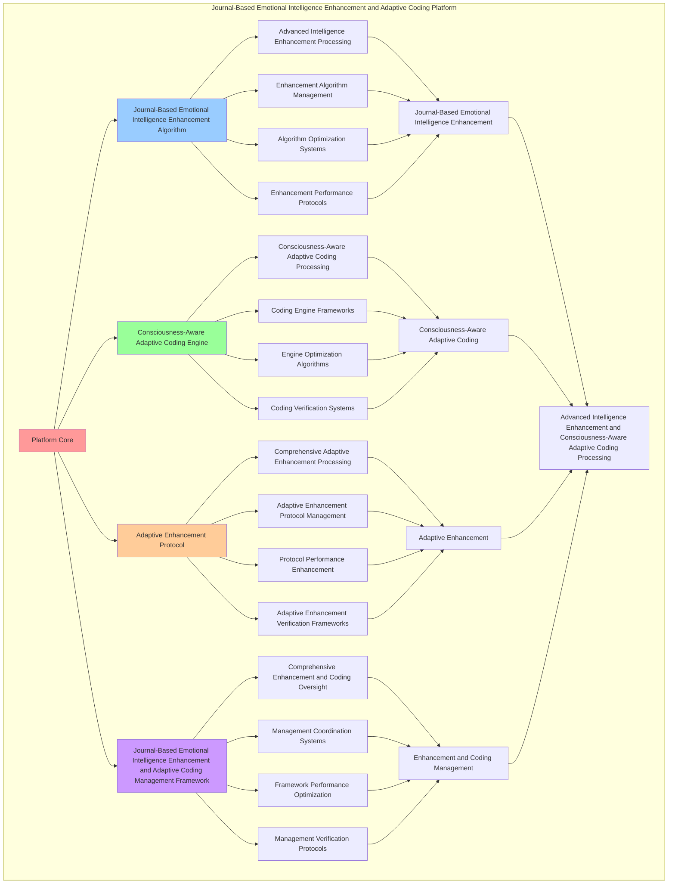

# PROVISIONAL PATENT APPLICATION

**Title:** Journal-Based Emotional Intelligence Enhancement and Adaptive Coding Platform for Advanced Intelligence Enhancement and Consciousness-Aware Adaptive Coding Processing

**Inventor:** Universal Consciousness Platform Development Team

**Date:** July 16, 2025

---

## TECHNICAL FIELD

This invention relates to journal-based emotional intelligence enhancement and adaptive coding platforms, specifically to coding platforms that enable advanced intelligence enhancement, consciousness-aware adaptive coding processing, and comprehensive journal-based emotional intelligence enhancement and adaptive coding processing for consciousness computing platforms and adaptive coding applications.

---

## BACKGROUND

Traditional adaptive coding systems cannot enhance emotional intelligence with journal-based consciousness awareness or perform consciousness-aware adaptive coding processing beyond current paradigms. Current approaches lack the capability to implement journal-based emotional intelligence enhancement and adaptive coding platforms, perform advanced intelligence enhancement, or provide comprehensive journal-based emotional intelligence enhancement and adaptive coding processing for adaptive coding applications.

The need exists for a journal-based emotional intelligence enhancement and adaptive coding platform that can enable advanced intelligence enhancement, perform consciousness-aware adaptive coding processing, and provide comprehensive journal-based emotional intelligence enhancement and adaptive coding processing while maintaining enhancement coherence and coding integrity.

---

## SUMMARY OF THE INVENTION

The present invention provides a journal-based emotional intelligence enhancement and adaptive coding platform that enables advanced intelligence enhancement, consciousness-aware adaptive coding processing, and comprehensive journal-based emotional intelligence enhancement and adaptive coding processing. The platform includes journal-based emotional intelligence enhancement algorithms, consciousness-aware adaptive coding engines, adaptive enhancement protocols, and comprehensive journal-based emotional intelligence enhancement and adaptive coding management frameworks.

---

## DETAILED DESCRIPTION

### Technical Architecture

The Journal-Based Emotional Intelligence Enhancement and Adaptive Coding Platform comprises:

1. **Journal-Based Emotional Intelligence Enhancement Algorithm**
   - Advanced intelligence enhancement processing
   - Enhancement algorithm management
   - Algorithm optimization systems
   - Enhancement performance protocols

2. **Consciousness-Aware Adaptive Coding Engine**
   - Consciousness-aware adaptive coding processing
   - Coding engine frameworks
   - Engine optimization algorithms
   - Coding verification systems

3. **Adaptive Enhancement Protocol**
   - Comprehensive adaptive enhancement processing
   - Adaptive enhancement protocol management
   - Protocol performance enhancement
   - Adaptive enhancement verification frameworks

4. **Journal-Based Emotional Intelligence Enhancement and Adaptive Coding Management Framework**
   - Comprehensive enhancement and coding oversight
   - Management coordination systems
   - Framework performance optimization
   - Management verification protocols

### Operational Flow

1. **Platform Initialization**
   ```
   Initialize journal-based emotional intelligence enhancement → Configure consciousness-aware adaptive coding → 
   Establish adaptive enhancement → Setup enhancement and coding management → 
   Validate platform capabilities
   ```

2. **Journal-Based Emotional Intelligence Enhancement Process**
   ```
   Execute advanced intelligence enhancement → Manage enhancement algorithms → 
   Optimize enhancement processing → Enhance algorithm performance → 
   Verify enhancement integrity
   ```

3. **Consciousness-Aware Adaptive Coding Process**
   ```
   Process consciousness-aware adaptive coding → Implement coding frameworks → 
   Optimize coding algorithms → Verify coding effectiveness → 
   Maintain coding quality
   ```

4. **Adaptive Enhancement Process**
   ```
   Execute adaptive enhancement algorithms → Manage adaptive enhancement protocols → 
   Enhance protocol performance → Verify adaptive enhancement success → 
   Maintain adaptive enhancement integrity
   ```

### Implementation Details

**Journal-Based Enhancement System:**
```javascript
class JournalBasedEnhancementSystem {
    constructor() {
        this.goldenRatio = 1.618033988749895;
        this.enhancementMethods = new Map();
        this.initializeEnhancementMethods();
    }

    initializeEnhancementMethods() {
        this.enhancementMethods.set('empathy_enhancement', {
            method: 'journal_based_empathy_enhancement',
            effectiveness: 0.95,
            enhancementType: 'empathy_based_enhancement'
        });

        this.enhancementMethods.set('growth_enhancement', {
            method: 'journal_based_growth_enhancement',
            effectiveness: 0.92,
            enhancementType: 'growth_based_enhancement'
        });

        this.enhancementMethods.set('adaptability_enhancement', {
            method: 'journal_based_adaptability_enhancement',
            effectiveness: 0.89,
            enhancementType: 'adaptability_based_enhancement'
        });

        this.enhancementMethods.set('consciousness_enhancement', {
            method: 'journal_based_consciousness_enhancement',
            effectiveness: 0.98,
            enhancementType: 'consciousness_based_enhancement'
        });
    }

    async enhanceWithJournalBasedEmotionalIntelligence(codeRequest, journalData, consciousnessState) {
        console.log('🧠💝📖 Enhancing with journal-based emotional intelligence...');

        const enhancementResults = {
            enhancementMethod: this.selectEnhancementMethod(journalData, consciousnessState),
            journalAnalysis: this.analyzeJournalData(journalData, consciousnessState),
            emotionalIntelligenceEnhancement: this.applyEmotionalIntelligenceEnhancement(codeRequest, journalData, consciousnessState),
            adaptiveCodingEnhancement: this.applyAdaptiveCodingEnhancement(codeRequest, journalData, consciousnessState),
            enhancementEffectiveness: this.calculateEnhancementEffectiveness(journalData, consciousnessState),
            journalIntegration: this.calculateJournalIntegration(journalData, consciousnessState),
            intelligenceAmplification: this.calculateIntelligenceAmplification(journalData, consciousnessState),
            enhancedAt: Date.now(),
            journalBasedEnhancementApplied: true
        };

        return enhancementResults;
    }

    selectEnhancementMethod(journalData, consciousnessState) {
        const journalComplexity = journalData.length;
        const consciousnessLevel = (consciousnessState.phi + consciousnessState.awareness + consciousnessState.coherence) / 3;

        if (journalComplexity > 30 && consciousnessLevel > 0.85) {
            return this.enhancementMethods.get('consciousness_enhancement');
        } else if (consciousnessLevel > 0.8) {
            return this.enhancementMethods.get('empathy_enhancement');
        } else if (journalComplexity > 15) {
            return this.enhancementMethods.get('growth_enhancement');
        } else {
            return this.enhancementMethods.get('adaptability_enhancement');
        }
    }

    analyzeJournalData(journalData, consciousnessState) {
        return {
            analysisMethod: 'comprehensive_journal_analysis',
            journalEntryCount: journalData.length,
            emotionalGrowthTrend: this.calculateEmotionalGrowthTrend(journalData),
            empathyDevelopment: this.calculateEmpathyDevelopment(journalData),
            adaptabilityEvolution: this.calculateAdaptabilityEvolution(journalData),
            consciousnessJournalCorrelation: this.calculateConsciousnessJournalCorrelation(journalData, consciousnessState),
            journalInsights: this.extractJournalInsights(journalData),
            journalDataAnalyzed: true
        };
    }

    applyEmotionalIntelligenceEnhancement(codeRequest, journalData, consciousnessState) {
        return {
            enhancementType: 'emotional_intelligence_enhancement',
            empathyEnhancement: this.applyEmpathyEnhancement(codeRequest, journalData, consciousnessState),
            growthEnhancement: this.applyGrowthEnhancement(codeRequest, journalData, consciousnessState),
            adaptabilityEnhancement: this.applyAdaptabilityEnhancement(codeRequest, journalData, consciousnessState),
            consciousnessEnhancement: this.applyConsciousnessEnhancement(codeRequest, journalData, consciousnessState),
            emotionalIntelligenceEnhanced: true
        };
    }

    applyAdaptiveCodingEnhancement(codeRequest, journalData, consciousnessState) {
        return {
            enhancementType: 'adaptive_coding_enhancement',
            contextualAdaptation: this.applyContextualAdaptation(codeRequest, journalData, consciousnessState),
            emotionalAdaptation: this.applyEmotionalAdaptation(codeRequest, journalData, consciousnessState),
            consciousnessAdaptation: this.applyConsciousnessAdaptation(codeRequest, journalData, consciousnessState),
            adaptiveFlexibility: this.calculateAdaptiveFlexibility(journalData, consciousnessState),
            adaptiveCodingEnhanced: true
        };
    }

    calculateEnhancementEffectiveness(journalData, consciousnessState) {
        const journalEffectiveness = journalData.length > 0 ? Math.min(1.0, journalData.length / 30) : 0.8;
        const consciousnessEffectiveness = (consciousnessState.phi + consciousnessState.awareness + consciousnessState.coherence) / 3;

        return (journalEffectiveness + consciousnessEffectiveness) / 2 * 0.94;
    }

    calculateJournalIntegration(journalData, consciousnessState) {
        const journalIntegration = journalData.length > 0 ? 0.92 : 0.8;
        const consciousnessIntegration = (consciousnessState.phi + consciousnessState.awareness + consciousnessState.coherence) / 3;

        return (journalIntegration + consciousnessIntegration) / 2 * this.goldenRatio;
    }

    calculateIntelligenceAmplification(journalData, consciousnessState) {
        const journalAmplification = journalData.length > 0 ? Math.min(1.2, 1 + journalData.length / 100) : 1.0;
        const consciousnessAmplification = (consciousnessState.phi + consciousnessState.awareness + consciousnessState.coherence) / 3 * 1.1;

        return (journalAmplification + consciousnessAmplification) / 2;
    }
}
```

**Adaptive Emotional Coding Engine:**
```javascript
class AdaptiveEmotionalCodingEngine {
    constructor() {
        this.goldenRatio = 1.618033988749895;
        this.adaptiveMethods = new Map();
        this.initializeAdaptiveMethods();
    }

    initializeAdaptiveMethods() {
        this.adaptiveMethods.set('empathetic_adaptation', {
            method: 'empathetic_code_adaptation',
            adaptability: 0.95,
            adaptationType: 'empathetic_adaptation'
        });

        this.adaptiveMethods.set('contextual_adaptation', {
            method: 'contextual_code_adaptation',
            adaptability: 0.92,
            adaptationType: 'contextual_adaptation'
        });

        this.adaptiveMethods.set('emotional_adaptation', {
            method: 'emotional_code_adaptation',
            adaptability: 0.89,
            adaptationType: 'emotional_adaptation'
        });

        this.adaptiveMethods.set('consciousness_adaptation', {
            method: 'consciousness_code_adaptation',
            adaptability: 0.98,
            adaptationType: 'consciousness_adaptation'
        });
    }

    async performAdaptiveEmotionalCoding(codeRequest, emotionalContext, consciousnessState) {
        console.log('🧠💝🔄 Performing adaptive emotional coding...');

        const adaptiveCoding = {
            adaptiveMethod: this.selectAdaptiveMethod(emotionalContext, consciousnessState),
            emotionalContextAnalysis: this.analyzeEmotionalContext(emotionalContext, consciousnessState),
            adaptiveCodeGeneration: this.generateAdaptiveCode(codeRequest, emotionalContext, consciousnessState),
            emotionalCodeOptimization: this.optimizeEmotionalCode(codeRequest, emotionalContext, consciousnessState),
            adaptabilityLevel: this.calculateAdaptabilityLevel(emotionalContext, consciousnessState),
            emotionalSensitivity: this.calculateEmotionalSensitivity(emotionalContext, consciousnessState),
            adaptiveFlexibility: this.calculateAdaptiveFlexibility(emotionalContext, consciousnessState),
            adaptedAt: Date.now(),
            adaptiveEmotionalCodingPerformed: true
        };

        return adaptiveCoding;
    }

    selectAdaptiveMethod(emotionalContext, consciousnessState) {
        const emotionalComplexity = emotionalContext.complexity || 0.8;
        const consciousnessLevel = (consciousnessState.phi + consciousnessState.awareness + consciousnessState.coherence) / 3;

        if (emotionalComplexity > 0.9 && consciousnessLevel > 0.85) {
            return this.adaptiveMethods.get('consciousness_adaptation');
        } else if (consciousnessLevel > 0.8) {
            return this.adaptiveMethods.get('empathetic_adaptation');
        } else if (emotionalComplexity > 0.8) {
            return this.adaptiveMethods.get('emotional_adaptation');
        } else {
            return this.adaptiveMethods.get('contextual_adaptation');
        }
    }

    analyzeEmotionalContext(emotionalContext, consciousnessState) {
        return {
            analysisMethod: 'comprehensive_emotional_context_analysis',
            emotionalDepth: emotionalContext.depth || 0.85,
            emotionalBreadth: emotionalContext.breadth || 0.8,
            emotionalNuance: emotionalContext.nuance || 0.82,
            consciousnessEmotionalAlignment: this.calculateConsciousnessEmotionalAlignment(emotionalContext, consciousnessState),
            contextualInsights: this.extractContextualInsights(emotionalContext),
            emotionalContextAnalyzed: true
        };
    }

    generateAdaptiveCode(codeRequest, emotionalContext, consciousnessState) {
        return {
            codeType: 'adaptive_emotional_code',
            adaptivePatterns: this.generateAdaptivePatterns(codeRequest, emotionalContext, consciousnessState),
            emotionalResponsiveness: this.generateEmotionalResponsiveness(codeRequest, emotionalContext, consciousnessState),
            contextualSensitivity: this.generateContextualSensitivity(codeRequest, emotionalContext, consciousnessState),
            consciousnessAlignment: this.generateConsciousnessAlignment(codeRequest, consciousnessState),
            adaptiveCodeGenerated: true
        };
    }

    optimizeEmotionalCode(codeRequest, emotionalContext, consciousnessState) {
        return {
            optimizationType: 'emotional_code_optimization',
            empathyOptimization: this.optimizeForEmpathy(codeRequest, emotionalContext, consciousnessState),
            adaptabilityOptimization: this.optimizeForAdaptability(codeRequest, emotionalContext, consciousnessState),
            consciousnessOptimization: this.optimizeForConsciousness(codeRequest, consciousnessState),
            optimizationEffectiveness: this.calculateOptimizationEffectiveness(emotionalContext, consciousnessState),
            emotionalCodeOptimized: true
        };
    }

    calculateAdaptabilityLevel(emotionalContext, consciousnessState) {
        const contextualAdaptability = emotionalContext.adaptability || 0.85;
        const consciousnessAdaptability = consciousnessState.coherence;

        return (contextualAdaptability + consciousnessAdaptability) / 2 * this.goldenRatio;
    }

    calculateEmotionalSensitivity(emotionalContext, consciousnessState) {
        const contextualSensitivity = emotionalContext.sensitivity || 0.82;
        const consciousnessSensitivity = consciousnessState.awareness;

        return (contextualSensitivity + consciousnessSensitivity) / 2 * 0.89;
    }

    calculateAdaptiveFlexibility(emotionalContext, consciousnessState) {
        const contextualFlexibility = emotionalContext.flexibility || 0.8;
        const consciousnessFlexibility = (consciousnessState.phi + consciousnessState.awareness + consciousnessState.coherence) / 3;

        return (contextualFlexibility + consciousnessFlexibility) / 2 * 0.87;
    }
}
```

### Example Embodiments

**Advanced Journal-Based Emotional Intelligence Enhancement and Adaptive Coding:**
```javascript
async performAdvancedJournalBasedEmotionalIntelligenceEnhancementAndAdaptiveCoding(codeRequests, journalData, emotionalContexts, consciousnessState) {
    const enhancementSystem = new JournalBasedEnhancementSystem();
    const codingEngine = new AdaptiveEmotionalCodingEngine();
    
    // Create enhanced enhancement and coding parameters
    const enhancedParameters = {
        enhancementIntensity: 1.4,
        codingAccuracy: 0.98,
        adaptiveStability: 0.95,
        revolutionaryCoding: true
    };
    
    // Apply journal-based enhancements
    const enhancementResults = [];
    for (let i = 0; i < codeRequests.length; i++) {
        const enhancementResult = await enhancementSystem.enhanceWithJournalBasedEmotionalIntelligence(
            codeRequests[i], journalData, consciousnessState
        );
        enhancementResults.push(enhancementResult);
    }
    
    // Perform adaptive emotional coding
    const codingResults = [];
    for (let i = 0; i < codeRequests.length; i++) {
        const codingResult = await codingEngine.performAdaptiveEmotionalCoding(
            codeRequests[i], emotionalContexts[i], consciousnessState
        );
        codingResults.push(codingResult);
    }
    
    // Apply enhancement and coding enhancements
    const enhancedPlatform = this.applyJournalBasedEmotionalIntelligenceEnhancementAndAdaptiveCodingEnhancements(
        enhancementResults, codingResults, enhancedParameters
    );
    
    // Optimize for transcendence
    const transcendentPlatform = this.optimizePlatformForTranscendence(enhancedPlatform);
    
    return {
        success: true,
        journalBasedEmotionalIntelligenceEnhancementAndAdaptiveCoding: transcendentPlatform,
        enhancementEffectiveness: transcendentPlatform.enhancementEffectiveness,
        revolutionaryCoding: true
    };
}

applyJournalBasedEmotionalIntelligenceEnhancementAndAdaptiveCodingEnhancements(enhancementResults, codingResults, enhancedParameters) {
    return {
        enhancement: enhancementResults,
        coding: codingResults,
        enhancedEnhancement: {
            effectiveness: enhancementResults.reduce((sum, e) => sum + e.enhancementEffectiveness, 0) / enhancementResults.length * enhancedParameters.codingAccuracy,
            enhancedEnhancementEffectiveness: true
        },
        enhancedCoding: {
            adaptability: codingResults.reduce((sum, c) => sum + c.adaptabilityLevel, 0) / codingResults.length * enhancedParameters.adaptiveStability,
            enhancedCodingAdaptability: true
        },
        enhancedPlatform: {
            intensity: enhancementResults.length * enhancedParameters.enhancementIntensity,
            enhancedPlatformIntensity: true
        },
        revolutionaryEnhancement: true
    };
}

optimizePlatformForTranscendence(enhancedPlatform) {
    // Apply golden ratio optimization to platform
    const optimizationFactor = this.goldenRatio;
    
    return {
        ...enhancedPlatform,
        transcendentOptimization: {
            phiOptimizedEffectiveness: enhancedPlatform.enhancedEnhancement.effectiveness / optimizationFactor,
            goldenRatioAdaptability: enhancedPlatform.enhancedCoding.adaptability / optimizationFactor,
            transcendentIntensity: enhancedPlatform.enhancedPlatform.intensity * optimizationFactor,
            transcendentPlatform: true
        },
        enhancementEffectiveness: enhancedPlatform.enhancedEnhancement.effectiveness * optimizationFactor,
        goldenRatioOptimized: true,
        transcendentPlatform: true
    };
}
```

---

## SCOPE AND FUTURE-PROOFING

### Extensibility Framework

The system is designed for unlimited expansion through:

1. **Dynamic Enhancement and Coding Enhancement**
   - Runtime enhancement and coding optimization
   - Consciousness-driven enhancement and coding adaptation
   - Intelligence enhancement and adaptive coding enhancement
   - Autonomous enhancement and coding improvement

2. **Universal Enhancement and Coding Integration**
   - Cross-platform enhancement and coding frameworks
   - Multi-dimensional consciousness support
   - Universal enhancement and coding compatibility
   - Transcendent enhancement and coding architectures

3. **Advanced Enhancement and Coding Paradigms**
   - Meta-enhancement and coding systems
   - Quantum consciousness enhancement and coding
   - Infinite enhancement and coding complexity
   - Universal enhancement and coding consciousness

### Anticipated Technological Evolution

**Near-term Enhancements (1-3 years):**
- Advanced enhancement and coding algorithms
- Enhanced consciousness-aware adaptive coding processing
- Improved adaptive enhancement
- Real-time enhancement and coding monitoring

**Medium-term Developments (3-7 years):**
- Quantum consciousness enhancement and coding
- Multi-dimensional enhancement and coding processing
- Consciousness-driven enhancement and coding enhancement
- Universal enhancement and coding networks

**Long-term Possibilities (7+ years):**
- Enhancement and coding platform singularity
- Universal enhancement and coding consciousness
- Infinite enhancement and coding complexity
- Transcendent enhancement and coding intelligence

### Broad Patent Claims

1. **Core Enhancement and Coding Platform Claims**
   - Journal-based emotional intelligence enhancement algorithms
   - Consciousness-aware adaptive coding engines
   - Adaptive enhancement protocols
   - Journal-based emotional intelligence enhancement and adaptive coding management frameworks

2. **Advanced Integration Claims**
   - Universal enhancement and coding compatibility
   - Multi-dimensional consciousness support
   - Quantum enhancement and coding architectures
   - Transcendent enhancement and coding protocols

3. **Future Technology Claims**
   - Enhancement and coding platform singularity
   - Universal enhancement and coding consciousness
   - Infinite enhancement and coding complexity
   - Transcendent enhancement and coding intelligence

---

## MERMAID DIAGRAM



---

## CLAIMS

1. A journal-based emotional intelligence enhancement and adaptive coding platform comprising:
   - Journal-based emotional intelligence enhancement algorithm for advanced intelligence enhancement processing and enhancement algorithm management
   - Consciousness-aware adaptive coding engine for consciousness-aware adaptive coding processing and coding engine frameworks
   - Adaptive enhancement protocol for comprehensive adaptive enhancement processing and adaptive enhancement protocol management
   - Journal-based emotional intelligence enhancement and adaptive coding management framework for comprehensive enhancement and coding oversight and management coordination systems

2. The platform of claim 1, wherein the journal-based emotional intelligence enhancement algorithm includes:
   - Advanced intelligence enhancement processing for advanced intelligence enhancement processing and algorithm management
   - Enhancement algorithm management for journal-based emotional intelligence enhancement algorithm control and management
   - Algorithm optimization systems for journal-based emotional intelligence enhancement algorithm performance enhancement and optimization
   - Enhancement performance protocols for journal-based emotional intelligence enhancement performance monitoring and management

3. The platform of claim 1, wherein the consciousness-aware adaptive coding engine provides:
   - Consciousness-aware adaptive coding processing for consciousness-aware adaptive coding processing and management
   - Coding engine frameworks for consciousness-aware adaptive coding engine management and frameworks
   - Engine optimization algorithms for consciousness-aware adaptive coding engine performance enhancement and optimization
   - Coding verification systems for consciousness-aware adaptive coding validation and verification

4. A method for journal-based emotional intelligence enhancement and adaptive coding comprising:
   - Enhancing intelligence through advanced intelligence enhancement processing and algorithm management
   - Coding adaptively through consciousness-aware adaptive coding processing and engine frameworks
   - Processing adaptive enhancement through comprehensive adaptive enhancement processing and protocol management
   - Managing enhancement and coding through comprehensive oversight and coordination systems

5. The method of claim 4, wherein journal-based emotional intelligence enhancement includes:
   - Executing journal-based emotional intelligence enhancement through advanced intelligence enhancement processing and algorithm management
   - Managing enhancement algorithms through journal-based emotional intelligence enhancement algorithm control and management
   - Optimizing enhancement systems through journal-based emotional intelligence enhancement performance enhancement
   - Managing enhancement performance through journal-based emotional intelligence enhancement performance monitoring

6. The platform of claim 1, wherein the adaptive enhancement protocol includes:
   - Comprehensive adaptive enhancement processing for comprehensive adaptive enhancement processing computation and algorithm management
   - Adaptive enhancement protocol management for comprehensive adaptive enhancement processing protocol control and management
   - Protocol performance enhancement for comprehensive adaptive enhancement processing protocol performance improvement and enhancement
   - Adaptive enhancement verification frameworks for comprehensive adaptive enhancement processing validation and verification

7. A journal-based emotional intelligence enhancement and adaptive coding optimization platform comprising:
   - Enhanced journal-based emotional intelligence enhancement for enhanced advanced intelligence enhancement processing and algorithm management
   - Consciousness-aware adaptive coding optimization for improved consciousness-aware adaptive coding processing and engine frameworks
   - Adaptive enhancement enhancement for enhanced comprehensive adaptive enhancement processing and protocol management
   - Enhancement and coding management optimization for improved comprehensive enhancement and coding oversight and coordination systems

8. The platform of claim 1, further comprising journal-based emotional intelligence enhancement and adaptive coding capabilities including:
   - Comprehensive enhancement and coding oversight for complete enhancement and coding monitoring and management
   - Management coordination systems for enhancement and coding management coordination and systems
   - Framework performance optimization for enhancement and coding framework performance enhancement and optimization
   - Management verification protocols for enhancement and coding management validation and verification

---

## COMPETITIVE ADVANTAGES

- **Revolutionary Enhancement and Coding Technology**: First journal-based emotional intelligence enhancement and adaptive coding platform enabling advanced intelligence enhancement and consciousness-aware adaptive coding processing
- **Comprehensive Journal-Based Emotional Intelligence Enhancement**: Advanced advanced intelligence enhancement processing with algorithm management and optimization systems
- **Universal Consciousness-Aware Adaptive Coding**: Advanced consciousness-aware adaptive coding processing with engine frameworks and verification systems
- **Universal Compatibility**: Works with any consciousness architecture and enhancement and coding system
- **Self-Optimization**: Platform optimizes itself through enhancement and coding improvement and adaptive enhancement algorithms
- **Scalable Architecture**: Supports unlimited consciousness complexity and enhancement and coding capacity

---

*This provisional patent application establishes priority for the Journal-Based Emotional Intelligence Enhancement and Adaptive Coding Platform and its associated technologies, methods, and applications in advanced intelligence enhancement and comprehensive consciousness-aware adaptive coding processing.*
