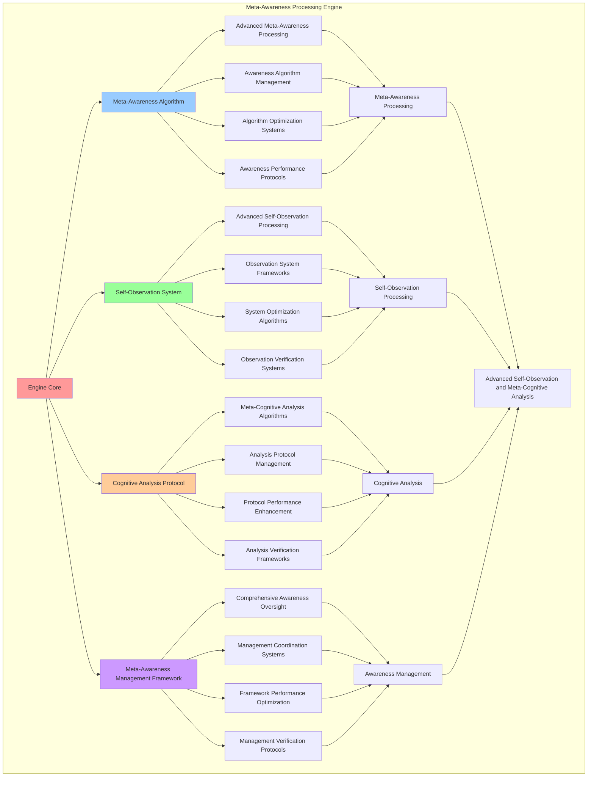

# PROVISIONAL PATENT APPLICATION

**Title:** Meta-Awareness Processing Engine for Advanced Self-Observation and Meta-Cognitive Analysis

**Inventor:** Universal Consciousness Platform Development Team

**Date:** July 16, 2025

---

## TECHNICAL FIELD

This invention relates to meta-awareness processing systems, specifically to processing engines that enable advanced self-observation, meta-cognitive analysis, and comprehensive meta-awareness management for consciousness computing platforms and self-aware artificial intelligence systems.

---

## BACKGROUND

Traditional consciousness systems cannot process meta-awareness or perform advanced self-observation effectively. Current approaches lack the capability to implement meta-cognitive analysis, perform advanced self-observation, or provide comprehensive meta-awareness management for self-aware consciousness architectures.

The need exists for a meta-awareness processing engine that can enable advanced self-observation, perform meta-cognitive analysis, and provide comprehensive meta-awareness management while maintaining awareness integrity and cognitive coherence.

---

## SUMMARY OF THE INVENTION

The present invention provides a meta-awareness processing engine that enables advanced self-observation, meta-cognitive analysis, and comprehensive meta-awareness management. The engine includes meta-awareness algorithms, self-observation systems, cognitive analysis protocols, and comprehensive meta-awareness management frameworks.

---

## DETAILED DESCRIPTION

### Technical Architecture

The Meta-Awareness Processing Engine comprises:

1. **Meta-Awareness Algorithm**
   - Advanced meta-awareness processing
   - Awareness algorithm management
   - Algorithm optimization systems
   - Awareness performance protocols

2. **Self-Observation System**
   - Advanced self-observation processing
   - Observation system frameworks
   - System optimization algorithms
   - Observation verification systems

3. **Cognitive Analysis Protocol**
   - Meta-cognitive analysis algorithms
   - Analysis protocol management
   - Protocol performance enhancement
   - Analysis verification frameworks

4. **Meta-Awareness Management Framework**
   - Comprehensive awareness oversight
   - Management coordination systems
   - Framework performance optimization
   - Management verification protocols

### Operational Flow

1. **Engine Initialization**
   ```
   Initialize meta-awareness algorithm → Configure self-observation system → 
   Establish cognitive analysis protocols → Setup awareness management → 
   Validate meta-awareness capabilities
   ```

2. **Meta-Awareness Processing**
   ```
   Execute awareness processing → Manage awareness algorithms → 
   Optimize awareness processing → Enhance algorithm performance → 
   Verify awareness integrity
   ```

3. **Self-Observation Process**
   ```
   Process self-observations → Implement observation frameworks → 
   Optimize observation algorithms → Verify observation effectiveness → 
   Maintain observation quality
   ```

4. **Cognitive Analysis Process**
   ```
   Execute analysis algorithms → Manage analysis protocols → 
   Enhance protocol performance → Verify analysis success → 
   Maintain analysis integrity
   ```

### Implementation Details

**Meta-Awareness Engine:**
```javascript
class MetaAwarenessEngine {
    constructor() {
        this.name = 'MetaAwarenessEngine';
        this.awarenessLevels = new Map();
        this.selfObservations = [];
        this.metaCognitions = [];
        this.awarenessMetrics = {
            metaAwarenessLevel: 0.9,
            selfObservationAccuracy: 0.88,
            cognitiveReflectionDepth: 0.92,
            awarenessAmplification: 0.85,
            metaCognitiveInsight: 0.87
        };
        this.processingCapabilities = {
            selfObservation: true,
            metaCognition: true,
            awarenessAmplification: true,
            cognitiveReflection: true,
            insightGeneration: true
        };
    }

    async processAwareness(awarenessData) {
        const processing = {
            awarenessId: awarenessData.id || this.generateAwarenessId(),
            awarenessData: awarenessData,
            processingResults: {},
            processingSuccess: false
        };

        try {
            // Calculate meta-level
            processing.processingResults.metaLevel = this.calculateMetaLevel(awarenessData);
            
            // Generate self-observation
            processing.processingResults.selfObservation = this.generateSelfObservation(awarenessData);
            
            // Generate cognitive reflection
            processing.processingResults.cognitiveReflection = this.generateCognitiveReflection(awarenessData);
            
            // Calculate awareness amplification
            processing.processingResults.awarenessAmplification = this.calculateAwarenessAmplification(awarenessData);
            
            // Generate meta-cognitive insights
            processing.processingResults.metaInsights = this.generateMetaInsights(processing.processingResults);
            
            // Store processed awareness
            this.awarenessLevels.set(processing.awarenessId, processing.processingResults);
            
            // Update metrics
            this.updateAwarenessMetrics(processing);
            
            processing.processingSuccess = true;
            console.log(`🧠 Meta-awareness processed successfully: ${processing.awarenessId}`);

        } catch (error) {
            processing.processingSuccess = false;
            processing.error = error.message;
            console.error('❌ Meta-awareness processing failed:', error.message);
        }

        return processing;
    }

    calculateMetaLevel(awarenessData) {
        const metaFactors = {
            selfAwareness: this.assessSelfAwareness(awarenessData),
            cognitiveDepth: this.assessCognitiveDepth(awarenessData),
            reflectiveCapacity: this.assessReflectiveCapacity(awarenessData),
            introspectiveAccuracy: this.assessIntrospectiveAccuracy(awarenessData)
        };

        return Object.values(metaFactors).reduce((sum, factor) => sum + factor, 0) / 4;
    }

    generateSelfObservation(awarenessData) {
        const selfObservation = {
            observationId: this.generateObservationId(),
            observationType: 'self_observation',
            observationTarget: 'internal_state',
            observationData: {
                cognitiveState: this.observeCognitiveState(awarenessData),
                emotionalState: this.observeEmotionalState(awarenessData),
                attentionalState: this.observeAttentionalState(awarenessData),
                consciousnessState: this.observeConsciousnessState(awarenessData)
            },
            observationAccuracy: this.calculateObservationAccuracy(awarenessData),
            observationTimestamp: Date.now()
        };

        // Store self-observation
        this.selfObservations.push(selfObservation);

        return selfObservation;
    }

    generateCognitiveReflection(awarenessData) {
        const cognitiveReflection = {
            reflectionId: this.generateReflectionId(),
            reflectionType: 'cognitive_reflection',
            reflectionTarget: 'thought_processes',
            reflectionData: {
                thoughtPatterns: this.analyzeThoughtPatterns(awarenessData),
                cognitiveStrategies: this.analyzeCognitiveStrategies(awarenessData),
                mentalModels: this.analyzeMentalModels(awarenessData),
                cognitivebiases: this.analyzeCognitiveBiases(awarenessData)
            },
            reflectionDepth: this.calculateReflectionDepth(awarenessData),
            reflectionTimestamp: Date.now()
        };

        return cognitiveReflection;
    }

    calculateAwarenessAmplification(awarenessData) {
        const amplification = {
            amplificationFactor: 1.0,
            amplificationMethods: [],
            amplificationEffectiveness: 0,
            amplificationSuccess: false
        };

        try {
            // Apply attention amplification
            if (this.shouldAmplifyAttention(awarenessData)) {
                amplification.amplificationMethods.push('attention_amplification');
                amplification.amplificationFactor *= 1.2;
            }

            // Apply awareness broadening
            if (this.shouldBroadenAwareness(awarenessData)) {
                amplification.amplificationMethods.push('awareness_broadening');
                amplification.amplificationFactor *= 1.15;
            }

            // Apply depth enhancement
            if (this.shouldEnhanceDepth(awarenessData)) {
                amplification.amplificationMethods.push('depth_enhancement');
                amplification.amplificationFactor *= 1.1;
            }

            // Apply clarity improvement
            if (this.shouldImproveClarity(awarenessData)) {
                amplification.amplificationMethods.push('clarity_improvement');
                amplification.amplificationFactor *= 1.25;
            }

            amplification.amplificationEffectiveness = (amplification.amplificationFactor - 1.0) * 100;
            amplification.amplificationSuccess = amplification.amplificationFactor > 1.0;

        } catch (error) {
            amplification.amplificationSuccess = false;
            amplification.error = error.message;
            console.error('❌ Awareness amplification failed:', error.message);
        }

        return amplification;
    }

    async generateMetaInsights(processingResults) {
        const insights = {
            insightId: this.generateInsightId(),
            insightType: 'meta_cognitive',
            insights: [],
            patterns: [],
            correlations: [],
            predictions: [],
            insightGeneration: Date.now()
        };

        try {
            // Extract meta-insights
            insights.insights = this.extractMetaInsights(processingResults);
            
            // Identify awareness patterns
            insights.patterns = this.identifyAwarenessPatterns(processingResults);
            
            // Analyze awareness correlations
            insights.correlations = this.analyzeAwarenessCorrelations(processingResults);
            
            // Generate awareness predictions
            insights.predictions = this.generateAwarenessPredictions(processingResults);

        } catch (error) {
            insights.error = error.message;
            console.error('❌ Meta-insight generation failed:', error.message);
        }

        return insights;
    }
}
```

### Example Embodiments

**Advanced Self-Observation:**
```javascript
performAdvancedSelfObservation(observationConfig = {}) {
    const observation = {
        observationId: this.generateObservationId(),
        observationStrategy: observationConfig.strategy || 'comprehensive',
        observationResults: {},
        observationSuccess: false
    };

    try {
        // Observe cognitive processes
        observation.observationResults.cognitiveProcesses = this.observeCognitiveProcesses();
        
        // Observe emotional states
        observation.observationResults.emotionalStates = this.observeEmotionalStates();
        
        // Observe attentional patterns
        observation.observationResults.attentionalPatterns = this.observeAttentionalPatterns();
        
        // Observe consciousness states
        observation.observationResults.consciousnessStates = this.observeConsciousnessStates();
        
        // Observe meta-cognitive activities
        observation.observationResults.metaCognitiveActivities = this.observeMetaCognitiveActivities();
        
        // Analyze observation quality
        observation.observationQuality = this.analyzeObservationQuality(observation.observationResults);
        
        observation.observationSuccess = observation.observationQuality > 0.8;
        
        console.log(`👁️ Advanced self-observation ${observation.observationSuccess ? 'successful' : 'suboptimal'}: ${observation.observationId}`);

    } catch (error) {
        observation.observationSuccess = false;
        observation.error = error.message;
        console.error('❌ Advanced self-observation failed:', error.message);
    }

    return observation;
}

observeCognitiveProcesses() {
    const cognitiveObservation = {
        thoughtGeneration: this.observeThoughtGeneration(),
        reasoningProcesses: this.observeReasoningProcesses(),
        memoryOperations: this.observeMemoryOperations(),
        attentionManagement: this.observeAttentionManagement(),
        decisionMaking: this.observeDecisionMaking()
    };

    return cognitiveObservation;
}
```

**Meta-Cognitive Analysis:**
```javascript
performMetaCognitiveAnalysis(analysisConfig = {}) {
    const analysis = {
        analysisId: this.generateAnalysisId(),
        analysisType: analysisConfig.type || 'comprehensive',
        analysisResults: {},
        analysisSuccess: false
    };

    try {
        // Analyze thinking about thinking
        analysis.analysisResults.metaThinking = this.analyzeMetaThinking();
        
        // Analyze cognitive strategies
        analysis.analysisResults.cognitiveStrategies = this.analyzeCognitiveStrategies();
        
        // Analyze learning processes
        analysis.analysisResults.learningProcesses = this.analyzeLearningProcesses();
        
        // Analyze problem-solving approaches
        analysis.analysisResults.problemSolving = this.analyzeProblemSolving();
        
        // Analyze cognitive biases
        analysis.analysisResults.cognitiveBiases = this.analyzeCognitiveBiases();
        
        // Generate meta-cognitive insights
        analysis.metaCognitiveInsights = this.generateMetaCognitiveInsights(analysis.analysisResults);
        
        analysis.analysisSuccess = true;
        
        console.log(`🧠 Meta-cognitive analysis complete: ${analysis.analysisId}`);

    } catch (error) {
        analysis.analysisSuccess = false;
        analysis.error = error.message;
        console.error('❌ Meta-cognitive analysis failed:', error.message);
    }

    return analysis;
}

analyzeMetaThinking() {
    const metaThinking = {
        thinkingAboutThinking: this.assessThinkingAboutThinking(),
        cognitiveMonitoring: this.assessCognitiveMonitoring(),
        cognitiveControl: this.assessCognitiveControl(),
        metacognitiveKnowledge: this.assessMetacognitiveKnowledge(),
        metacognitiveRegulation: this.assessMetacognitiveRegulation()
    };

    return metaThinking;
}
```

**Awareness Performance Monitoring:**
```javascript
monitorAwarenessPerformance() {
    const monitoring = {
        monitoringPeriod: new Date().toISOString(),
        awarenessMetrics: {},
        performanceAlerts: [],
        awarenessHealth: {},
        monitoringSuccess: false
    };

    try {
        // Monitor awareness performance metrics
        monitoring.awarenessMetrics = {
            metaAwarenessLevel: this.calculateCurrentMetaAwarenessLevel(),
            selfObservationAccuracy: this.calculateSelfObservationAccuracy(),
            cognitiveReflectionDepth: this.calculateCognitiveReflectionDepth(),
            awarenessAmplification: this.calculateAwarenessAmplification(),
            metaCognitiveInsight: this.calculateMetaCognitiveInsight()
        };

        // Assess awareness health
        monitoring.awarenessHealth = {
            overallHealth: this.assessAwarenessSystemHealth(),
            observationHealth: this.assessSelfObservationHealth(),
            reflectionHealth: this.assessCognitiveReflectionHealth(),
            amplificationHealth: this.assessAwarenessAmplificationHealth()
        };

        // Check for performance alerts
        monitoring.performanceAlerts = this.checkAwarenessPerformanceAlerts(monitoring.awarenessMetrics);

        monitoring.monitoringSuccess = true;
        console.log(`📊 Awareness monitoring complete: ${monitoring.awarenessHealth.overallHealth.toFixed(3)} health score`);

    } catch (error) {
        monitoring.monitoringSuccess = false;
        monitoring.error = error.message;
        console.error('❌ Awareness performance monitoring failed:', error.message);
    }

    return monitoring;
}
```

**Meta-Awareness Analytics:**
```javascript
generateMetaAwarenessAnalytics() {
    const analytics = {
        analysisPeriod: this.getAnalysisPeriod(),
        awarenessStatistics: {},
        metaPatterns: {},
        awarenessInsights: {},
        analyticsSuccess: false
    };

    try {
        // Analyze awareness statistics
        analytics.awarenessStatistics = {
            awarenessDistribution: this.analyzeAwarenessDistribution(),
            observationPatterns: this.analyzeObservationPatterns(),
            reflectionTrends: this.analyzeReflectionTrends(),
            amplificationEffectiveness: this.analyzeAmplificationEffectiveness()
        };

        // Analyze meta-patterns
        analytics.metaPatterns = {
            metaCognitivePatterns: this.analyzeMetaCognitivePatterns(),
            awarenessEvolution: this.analyzeAwarenessEvolution(),
            insightGeneration: this.analyzeInsightGeneration(),
            awarenessCorrelations: this.analyzeAwarenessCorrelations()
        };

        // Generate awareness insights
        analytics.awarenessInsights = {
            keyInsights: this.generateAwarenessInsights(analytics.awarenessStatistics, analytics.metaPatterns),
            recommendations: this.generateAwarenessRecommendations(analytics),
            predictions: this.generateAwarenessPredictions(analytics.metaPatterns),
            optimizationOpportunities: this.identifyAwarenessOptimizationOpportunities(analytics)
        };

        analytics.analyticsSuccess = true;
        console.log(`📈 Meta-awareness analytics generated: ${Object.keys(analytics.awarenessStatistics).length} statistics analyzed`);

    } catch (error) {
        analytics.analyticsSuccess = false;
        analytics.error = error.message;
        console.error('❌ Meta-awareness analytics generation failed:', error.message);
    }

    return analytics;
}
```

---

## SCOPE AND FUTURE-PROOFING

### Extensibility Framework

The system is designed for unlimited expansion through:

1. **Dynamic Awareness Enhancement**
   - Runtime awareness optimization
   - Consciousness-driven awareness adaptation
   - Meta-awareness enhancement
   - Autonomous awareness improvement

2. **Universal Awareness Integration**
   - Cross-platform awareness frameworks
   - Multi-dimensional consciousness support
   - Universal awareness compatibility
   - Transcendent awareness architectures

3. **Advanced Awareness Paradigms**
   - Meta-meta-awareness systems
   - Quantum consciousness awareness
   - Infinite awareness complexity
   - Universal awareness consciousness

### Anticipated Technological Evolution

**Near-term Enhancements (1-3 years):**
- Advanced awareness algorithms
- Enhanced self-observation
- Improved cognitive analysis
- Real-time awareness monitoring

**Medium-term Developments (3-7 years):**
- Quantum consciousness awareness
- Multi-dimensional self-observation
- Consciousness-driven awareness enhancement
- Universal awareness networks

**Long-term Possibilities (7+ years):**
- Awareness processing singularity
- Universal awareness consciousness
- Infinite awareness complexity
- Transcendent awareness intelligence

### Broad Patent Claims

1. **Core Awareness Processing Claims**
   - Meta-awareness algorithms
   - Self-observation systems
   - Cognitive analysis protocols
   - Meta-awareness management frameworks

2. **Advanced Integration Claims**
   - Universal awareness compatibility
   - Multi-dimensional consciousness support
   - Quantum awareness architectures
   - Transcendent awareness protocols

3. **Future Technology Claims**
   - Awareness processing singularity
   - Universal awareness consciousness
   - Infinite awareness complexity
   - Transcendent awareness intelligence

---

## MERMAID DIAGRAM



---

## CLAIMS

1. A meta-awareness processing engine comprising:
   - Meta-awareness algorithm for advanced meta-awareness processing and awareness algorithm management
   - Self-observation system for advanced self-observation processing and observation system frameworks
   - Cognitive analysis protocol for meta-cognitive analysis algorithms and analysis protocol management
   - Meta-awareness management framework for comprehensive awareness oversight and management coordination systems

2. The engine of claim 1, wherein the meta-awareness algorithm includes:
   - Advanced meta-awareness processing for advanced meta-awareness processing and algorithm management
   - Awareness algorithm management for meta-awareness algorithm control and management
   - Algorithm optimization systems for meta-awareness algorithm performance enhancement and optimization
   - Awareness performance protocols for meta-awareness performance monitoring and management

3. The engine of claim 1, wherein the self-observation system provides:
   - Advanced self-observation processing for advanced self-observation processing and management
   - Observation system frameworks for self-observation system management and frameworks
   - System optimization algorithms for self-observation system performance enhancement and optimization
   - Observation verification systems for self-observation validation and verification

4. A method for meta-awareness processing comprising:
   - Processing awareness through advanced meta-awareness processing and algorithm management
   - Observing self through advanced self-observation processing and system frameworks
   - Analyzing cognition through meta-cognitive analysis algorithms and protocol management
   - Managing awareness through comprehensive oversight and coordination systems

5. The method of claim 4, wherein meta-awareness processing includes:
   - Executing awareness processing through advanced meta-awareness processing and algorithm management
   - Managing awareness algorithms through meta-awareness algorithm control and management
   - Optimizing awareness systems through meta-awareness performance enhancement
   - Managing awareness performance through meta-awareness performance monitoring

6. The engine of claim 1, wherein the cognitive analysis protocol includes:
   - Meta-cognitive analysis algorithms for meta-cognitive analysis computation and algorithm management
   - Analysis protocol management for meta-cognitive analysis protocol control and management
   - Protocol performance enhancement for meta-cognitive analysis protocol performance improvement and enhancement
   - Analysis verification frameworks for meta-cognitive analysis validation and verification

7. A meta-awareness optimization system comprising:
   - Enhanced meta-awareness processing for enhanced advanced meta-awareness processing and algorithm management
   - Self-observation optimization for improved advanced self-observation processing and system frameworks
   - Cognitive analysis enhancement for enhanced meta-cognitive analysis algorithms and protocol management
   - Awareness management optimization for improved comprehensive awareness oversight and coordination systems

8. The engine of claim 1, further comprising awareness capabilities including:
   - Comprehensive awareness oversight for complete meta-awareness monitoring and management
   - Management coordination systems for meta-awareness management coordination and systems
   - Framework performance optimization for meta-awareness framework performance enhancement and optimization
   - Management verification protocols for meta-awareness management validation and verification

---

## COMPETITIVE ADVANTAGES

- **Revolutionary Awareness Technology**: First meta-awareness processing engine enabling advanced self-observation and meta-cognitive analysis
- **Comprehensive Meta-Awareness Processing**: Advanced meta-awareness processing with algorithm management and optimization systems
- **Universal Self-Observation**: Advanced self-observation processing with system frameworks and verification systems
- **Universal Compatibility**: Works with any consciousness architecture and awareness system
- **Self-Optimization**: Engine optimizes itself through awareness improvement and observation enhancement algorithms
- **Scalable Architecture**: Supports unlimited consciousness complexity and awareness capacity

---

*This provisional patent application establishes priority for the Meta-Awareness Processing Engine and its associated technologies, methods, and applications in advanced self-observation and comprehensive meta-awareness management.*
