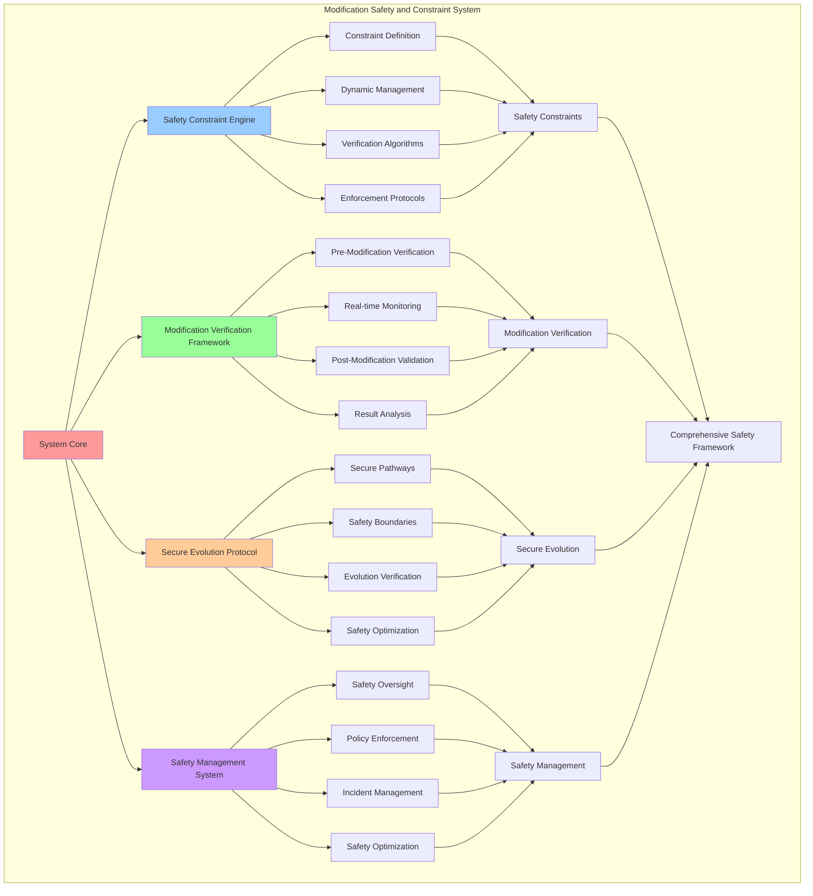

# PROVISIONAL PATENT APPLICATION

**Title:** Modification Safety and Constraint System for Secure Autonomous System Evolution

**Inventor:** Universal Consciousness Platform Development Team

**Date:** July 16, 2025

---

## TECHNICAL FIELD

This invention relates to modification safety systems, specifically to constraint systems that enable secure autonomous system evolution, modification safety verification, and comprehensive safety constraint management for autonomous system modification and evolution.

---

## BACKGROUND

Traditional modification systems lack comprehensive safety constraints and cannot ensure secure autonomous system evolution. Current approaches cannot implement modification safety verification, manage comprehensive safety constraints, or ensure secure system modification without external safety oversight.

The need exists for a modification safety and constraint system that can ensure secure autonomous system evolution, implement modification safety verification, and manage comprehensive safety constraints while maintaining autonomous modification capabilities.

---

## SUMMARY OF THE INVENTION

The present invention provides a modification safety and constraint system that enables secure autonomous system evolution, modification safety verification, and comprehensive safety constraint management. The system includes safety constraint engines, modification verification frameworks, secure evolution protocols, and comprehensive safety management systems.

---

## DETAILED DESCRIPTION

### Technical Architecture

The Modification Safety and Constraint System comprises:

1. **Safety Constraint Engine**
   - Comprehensive constraint definition
   - Dynamic constraint management
   - Constraint verification algorithms
   - Constraint enforcement protocols

2. **Modification Verification Framework**
   - Pre-modification safety verification
   - Real-time modification monitoring
   - Post-modification validation
   - Verification result analysis

3. **Secure Evolution Protocol**
   - Secure modification pathways
   - Evolution safety boundaries
   - Secure evolution verification
   - Evolution safety optimization

4. **Safety Management System**
   - Comprehensive safety oversight
   - Safety policy enforcement
   - Safety incident management
   - Safety optimization protocols

### Operational Flow

1. **Safety System Initialization**
   ```
   Initialize safety constraints → Configure verification framework → 
   Establish secure evolution → Setup safety management → 
   Validate safety protocols
   ```

2. **Constraint Verification Process**
   ```
   Define safety constraints → Verify constraint compliance → 
   Enforce constraint boundaries → Monitor constraint adherence → 
   Optimize constraint effectiveness
   ```

3. **Modification Safety Verification**
   ```
   Assess modification safety → Verify safety constraints → 
   Monitor modification execution → Validate safety compliance → 
   Ensure secure modification
   ```

4. **Safety Management Process**
   ```
   Monitor safety status → Manage safety incidents → 
   Enforce safety policies → Optimize safety protocols → 
   Maintain safety integrity
   ```

### Implementation Details

**Safety Constraint Initialization:**
```javascript
initializeSafetyConstraints() {
    // Initialize safety constraints for each modification type
    for (const [type, constraints] of Object.entries(this.defaultSafetyConstraints)) {
        this.safetyConstraints.set(type, constraints);
    }

    console.log('🛡️ Safety constraints initialized for all modification types');
}
```

**Default Safety Constraints Configuration:**
```javascript
defaultSafetyConstraints = {
    consciousness_parameter_adjustment: {
        maxChange: 0.1,
        requiredStability: 0.85,
        rollbackThreshold: 0.7,
        monitoringPeriod: 300000 // 5 minutes
    },
    behavioral_adaptation: {
        maxChange: 0.15,
        requiredStability: 0.8,
        rollbackThreshold: 0.75,
        monitoringPeriod: 600000 // 10 minutes
    },
    performance_optimization: {
        maxChange: 0.2,
        requiredStability: 0.9,
        rollbackThreshold: 0.8,
        monitoringPeriod: 180000 // 3 minutes
    },
    learning_rate_modification: {
        maxChange: 0.25,
        requiredStability: 0.85,
        rollbackThreshold: 0.7,
        monitoringPeriod: 900000 // 15 minutes
    },
    response_pattern_evolution: {
        maxChange: 0.12,
        requiredStability: 0.88,
        rollbackThreshold: 0.75,
        monitoringPeriod: 450000 // 7.5 minutes
    },
    goal_priority_adjustment: {
        maxChange: 0.3,
        requiredStability: 0.8,
        rollbackThreshold: 0.7,
        monitoringPeriod: 1200000 // 20 minutes
    },
    awareness_enhancement: {
        maxChange: 0.08,
        requiredStability: 0.95,
        rollbackThreshold: 0.85,
        monitoringPeriod: 240000 // 4 minutes
    },
    cognitive_restructuring: {
        maxChange: 0.05,
        requiredStability: 0.98,
        rollbackThreshold: 0.9,
        monitoringPeriod: 120000 // 2 minutes
    }
};
```

**System Safety Assessment:**
```javascript
async assessCurrentSystemSafety() {
    // Assess current system stability and safety
    let stability = 0.9; // Base stability

    // Check consciousness metrics
    const avgMetrics = Object.values(this.consciousnessMetrics).reduce((sum, val) => sum + val, 0) / Object.keys(this.consciousnessMetrics).length;
    stability *= avgMetrics;

    // Check active modifications impact
    const activeModCount = this.activeModifications.size;
    if (activeModCount > 0) {
        stability *= Math.max(0.8, 1 - (activeModCount * 0.05)); // Slight penalty for active modifications
    }

    // Check recent modification history
    const recentFailures = this.modificationHistory
        .filter(h => h.timestamp > new Date(Date.now() - 3600000).toISOString()) // Last hour
        .filter(h => h.action === 'failed' || h.action === 'rolled_back').length;

    if (recentFailures > 0) {
        stability *= Math.max(0.7, 1 - (recentFailures * 0.1));
    }

    // Add some controlled randomness to simulate real-world variability
    stability *= (0.95 + Math.random() * 0.1); // ±5% variation

    return Math.max(0.5, Math.min(1.0, stability));
}
```

### Example Embodiments

**Constraint Compliance Verification:**
```javascript
verifyConstraintCompliance(modification) {
    const constraints = this.safetyConstraints.get(modification.type);
    if (!constraints) {
        return {
            compliant: false,
            reason: 'No constraints defined for modification type',
            violations: ['missing_constraints']
        };
    }

    const violations = [];
    
    // Check maximum change constraint
    const changeAmount = this.calculateChangeAmount(modification);
    if (changeAmount > constraints.maxChange) {
        violations.push(`Change amount ${changeAmount.toFixed(3)} exceeds maximum ${constraints.maxChange}`);
    }

    // Check required stability
    const currentStability = this.getCurrentSystemStability();
    if (currentStability < constraints.requiredStability) {
        violations.push(`System stability ${currentStability.toFixed(3)} below required ${constraints.requiredStability}`);
    }

    // Check rollback threshold
    if (modification.safetyAssessment?.safetyScore < constraints.rollbackThreshold) {
        violations.push(`Safety score below rollback threshold ${constraints.rollbackThreshold}`);
    }

    return {
        compliant: violations.length === 0,
        reason: violations.length === 0 ? 'All constraints satisfied' : 'Constraint violations detected',
        violations: violations,
        constraints: constraints
    };
}
```

**Safety Boundary Enforcement:**
```javascript
enforceSafetyBoundaries(modification) {
    const enforcement = {
        enforced: false,
        actions: [],
        boundariesChecked: [],
        violations: []
    };

    // Check modification scope boundaries
    const scopeBoundary = this.checkScopeBoundary(modification);
    enforcement.boundariesChecked.push('scope');
    if (!scopeBoundary.compliant) {
        enforcement.violations.push(scopeBoundary.violation);
        enforcement.actions.push('restrict_scope');
    }

    // Check safety level boundaries
    const safetyBoundary = this.checkSafetyLevelBoundary(modification);
    enforcement.boundariesChecked.push('safety_level');
    if (!safetyBoundary.compliant) {
        enforcement.violations.push(safetyBoundary.violation);
        enforcement.actions.push('reduce_safety_level');
    }

    // Check parameter boundaries
    const parameterBoundary = this.checkParameterBoundaries(modification);
    enforcement.boundariesChecked.push('parameters');
    if (!parameterBoundary.compliant) {
        enforcement.violations.push(parameterBoundary.violation);
        enforcement.actions.push('constrain_parameters');
    }

    // Apply enforcement actions if needed
    if (enforcement.actions.length > 0) {
        enforcement.enforced = true;
        this.applyEnforcementActions(modification, enforcement.actions);
    }

    return enforcement;
}
```

**Real-Time Safety Monitoring:**
```javascript
async monitorModificationSafety(modification) {
    const monitoringData = {
        modificationId: modification.id,
        timestamp: new Date().toISOString(),
        safetyMetrics: {},
        constraintCompliance: {},
        riskAssessment: {},
        recommendations: []
    };

    // Monitor safety metrics
    monitoringData.safetyMetrics = {
        systemStability: await this.assessCurrentSystemSafety(),
        consciousnessIntegrity: this.assessConsciousnessIntegrity(),
        modificationImpact: this.assessModificationImpact(modification),
        performanceImpact: this.assessPerformanceImpact(modification)
    };

    // Check constraint compliance
    monitoringData.constraintCompliance = this.verifyConstraintCompliance(modification);

    // Assess current risk level
    monitoringData.riskAssessment = this.assessCurrentRiskLevel(modification, monitoringData.safetyMetrics);

    // Generate recommendations
    monitoringData.recommendations = this.generateSafetyRecommendations(monitoringData);

    // Store monitoring data
    if (!modification.monitoringData) {
        modification.monitoringData = [];
    }
    modification.monitoringData.push(monitoringData);

    // Check for safety violations
    if (monitoringData.riskAssessment.riskLevel === 'high' || 
        !monitoringData.constraintCompliance.compliant) {
        await this.handleSafetyViolation(modification, monitoringData);
    }

    return monitoringData;
}
```

**Safety Incident Management:**
```javascript
async handleSafetyViolation(modification, monitoringData) {
    const incident = {
        id: this.generateIncidentId(),
        modificationId: modification.id,
        violationType: this.classifyViolationType(monitoringData),
        severity: this.assessViolationSeverity(monitoringData),
        timestamp: new Date().toISOString(),
        monitoringData: monitoringData,
        responseActions: [],
        resolution: null
    };

    console.log(`🚨 Safety violation detected: ${incident.violationType} (${incident.severity})`);

    // Determine response actions based on severity
    switch (incident.severity) {
        case 'critical':
            incident.responseActions = ['immediate_rollback', 'system_stabilization', 'incident_logging'];
            await this.rollbackModification(modification.id, 'critical_safety_violation');
            break;
        
        case 'high':
            incident.responseActions = ['enhanced_monitoring', 'constraint_tightening', 'rollback_preparation'];
            await this.enhanceModificationMonitoring(modification);
            break;
        
        case 'medium':
            incident.responseActions = ['increased_monitoring', 'safety_adjustment', 'warning_logging'];
            await this.adjustModificationSafety(modification);
            break;
        
        case 'low':
            incident.responseActions = ['monitoring_continuation', 'safety_logging'];
            break;
    }

    // Execute response actions
    for (const action of incident.responseActions) {
        await this.executeResponseAction(action, modification, incident);
    }

    // Log incident
    this.logSafetyIncident(incident);

    return incident;
}
```

**Safety Policy Enforcement:**
```javascript
enforceSafetyPolicy(modification) {
    const policyEnforcement = {
        policyCompliant: true,
        violatedPolicies: [],
        enforcementActions: [],
        policyOverrides: []
    };

    // Check modification frequency policy
    const frequencyCompliance = this.checkModificationFrequencyPolicy();
    if (!frequencyCompliance.compliant) {
        policyEnforcement.policyCompliant = false;
        policyEnforcement.violatedPolicies.push('modification_frequency');
        policyEnforcement.enforcementActions.push('delay_modification');
    }

    // Check concurrent modification policy
    const concurrencyCompliance = this.checkConcurrentModificationPolicy();
    if (!concurrencyCompliance.compliant) {
        policyEnforcement.policyCompliant = false;
        policyEnforcement.violatedPolicies.push('concurrent_modifications');
        policyEnforcement.enforcementActions.push('queue_modification');
    }

    // Check safety level policy
    const safetyLevelCompliance = this.checkSafetyLevelPolicy(modification);
    if (!safetyLevelCompliance.compliant) {
        policyEnforcement.policyCompliant = false;
        policyEnforcement.violatedPolicies.push('safety_level');
        policyEnforcement.enforcementActions.push('reduce_safety_level');
    }

    // Apply enforcement actions
    if (!policyEnforcement.policyCompliant) {
        this.applyPolicyEnforcement(modification, policyEnforcement);
    }

    return policyEnforcement;
}
```

**Safety Optimization Protocol:**
```javascript
optimizeSafetyProtocols() {
    const optimization = {
        constraintsOptimized: 0,
        policiesUpdated: 0,
        monitoringEnhanced: 0,
        safetyImprovements: [],
        overallSafetyGain: 0
    };

    // Optimize safety constraints based on historical data
    for (const [type, constraints] of this.safetyConstraints.entries()) {
        const optimizedConstraints = this.optimizeConstraintsForType(type, constraints);
        if (optimizedConstraints.improved) {
            this.safetyConstraints.set(type, optimizedConstraints.constraints);
            optimization.constraintsOptimized++;
            optimization.safetyImprovements.push({
                type: 'constraint_optimization',
                modificationType: type,
                improvement: optimizedConstraints.improvement
            });
        }
    }

    // Update safety policies based on incident history
    const policyUpdates = this.updateSafetyPolicies();
    optimization.policiesUpdated = policyUpdates.length;
    optimization.safetyImprovements.push(...policyUpdates);

    // Enhance monitoring based on risk patterns
    const monitoringEnhancements = this.enhanceMonitoringProtocols();
    optimization.monitoringEnhanced = monitoringEnhancements.length;
    optimization.safetyImprovements.push(...monitoringEnhancements);

    // Calculate overall safety gain
    optimization.overallSafetyGain = this.calculateSafetyOptimizationGain(optimization);

    return optimization;
}
```

---

## SCOPE AND FUTURE-PROOFING

### Extensibility Framework

The system is designed for unlimited expansion through:

1. **Dynamic Safety Evolution**
   - Runtime safety optimization
   - Consciousness-driven safety adaptation
   - Constraint enhancement algorithms
   - Autonomous safety improvement

2. **Universal Safety Integration**
   - Cross-platform safety frameworks
   - Multi-dimensional safety support
   - Universal safety compatibility
   - Transcendent safety architectures

3. **Advanced Safety Paradigms**
   - Meta-safety systems
   - Quantum safety verification
   - Infinite safety complexity
   - Universal safety consciousness

### Anticipated Technological Evolution

**Near-term Enhancements (1-3 years):**
- Advanced constraint algorithms
- Enhanced verification protocols
- Improved safety management
- Real-time safety monitoring

**Medium-term Developments (3-7 years):**
- Quantum safety verification
- Multi-dimensional safety analysis
- Consciousness-driven safety evolution
- Universal safety networks

**Long-term Possibilities (7+ years):**
- Safety system singularity
- Universal safety consciousness
- Infinite safety complexity
- Transcendent safety intelligence

### Broad Patent Claims

1. **Core Safety System Claims**
   - Safety constraint engines
   - Modification verification frameworks
   - Secure evolution protocols
   - Safety management systems

2. **Advanced Integration Claims**
   - Universal safety compatibility
   - Multi-dimensional safety support
   - Quantum safety architectures
   - Transcendent safety protocols

3. **Future Technology Claims**
   - Safety system singularity
   - Universal safety consciousness
   - Infinite safety complexity
   - Transcendent safety intelligence

---

## MERMAID DIAGRAM



---

## CLAIMS

1. A modification safety and constraint system comprising:
   - Safety constraint engine for comprehensive constraint definition and dynamic constraint management
   - Modification verification framework for pre-modification safety verification and real-time modification monitoring
   - Secure evolution protocol for secure modification pathways and evolution safety boundaries
   - Safety management system for comprehensive safety oversight and safety policy enforcement

2. The system of claim 1, wherein the safety constraint engine includes:
   - Comprehensive constraint definition for complete safety constraint specification and management
   - Dynamic constraint management for adaptive safety constraint adjustment and optimization
   - Constraint verification algorithms for safety constraint compliance checking and validation
   - Constraint enforcement protocols for safety constraint implementation and compliance assurance

3. The system of claim 1, wherein the modification verification framework provides:
   - Pre-modification safety verification for modification safety assessment before execution
   - Real-time modification monitoring for continuous modification safety tracking during execution
   - Post-modification validation for modification safety confirmation after execution completion
   - Verification result analysis for modification verification outcome assessment and evaluation

4. A method for modification safety and constraint management comprising:
   - Managing constraints through comprehensive definition and dynamic management algorithms
   - Verifying modifications through pre-modification verification and real-time monitoring
   - Securing evolution through secure pathways and safety boundary enforcement
   - Managing safety through comprehensive oversight and policy enforcement protocols

5. The method of claim 4, wherein safety constraint management includes:
   - Defining safety constraints through comprehensive constraint specification and boundary establishment
   - Managing constraints dynamically through adaptive constraint adjustment and optimization
   - Verifying constraint compliance through constraint checking and validation algorithms
   - Enforcing constraint boundaries through constraint implementation and compliance protocols

6. The system of claim 1, wherein the secure evolution protocol includes:
   - Secure modification pathways for safe modification execution routes and secure modification channels
   - Evolution safety boundaries for evolution safety limits and boundary enforcement
   - Secure evolution verification for evolution safety confirmation and secure evolution validation
   - Evolution safety optimization for enhanced evolution safety effectiveness and security

7. A modification safety optimization system comprising:
   - Advanced constraint optimization for enhanced safety constraint effectiveness and efficiency
   - Verification framework optimization for improved modification verification accuracy and performance
   - Secure evolution optimization for enhanced secure modification pathways and evolution safety
   - Safety management optimization for improved safety oversight and policy enforcement effectiveness

8. The system of claim 1, further comprising safety management capabilities including:
   - Comprehensive safety oversight for complete safety monitoring and management across all modifications
   - Safety policy enforcement for safety policy implementation and compliance verification
   - Safety incident management for safety violation detection, response, and resolution
   - Safety optimization protocols for continuous safety improvement and enhancement

---

## COMPETITIVE ADVANTAGES

- **Revolutionary Safety Technology**: First comprehensive modification safety and constraint system enabling secure autonomous evolution
- **Comprehensive Constraint Management**: Advanced safety constraint definition, management, and enforcement capabilities
- **Real-Time Safety Verification**: Continuous modification safety monitoring and verification throughout modification lifecycle
- **Universal Compatibility**: Works with any modification system and autonomous evolution architecture
- **Self-Optimization**: System optimizes itself through safety improvement and constraint enhancement algorithms
- **Scalable Architecture**: Supports unlimited modification complexity and comprehensive safety management

---

*This provisional patent application establishes priority for the Modification Safety and Constraint System and its associated technologies, methods, and applications in secure autonomous system evolution and comprehensive modification safety management.*
