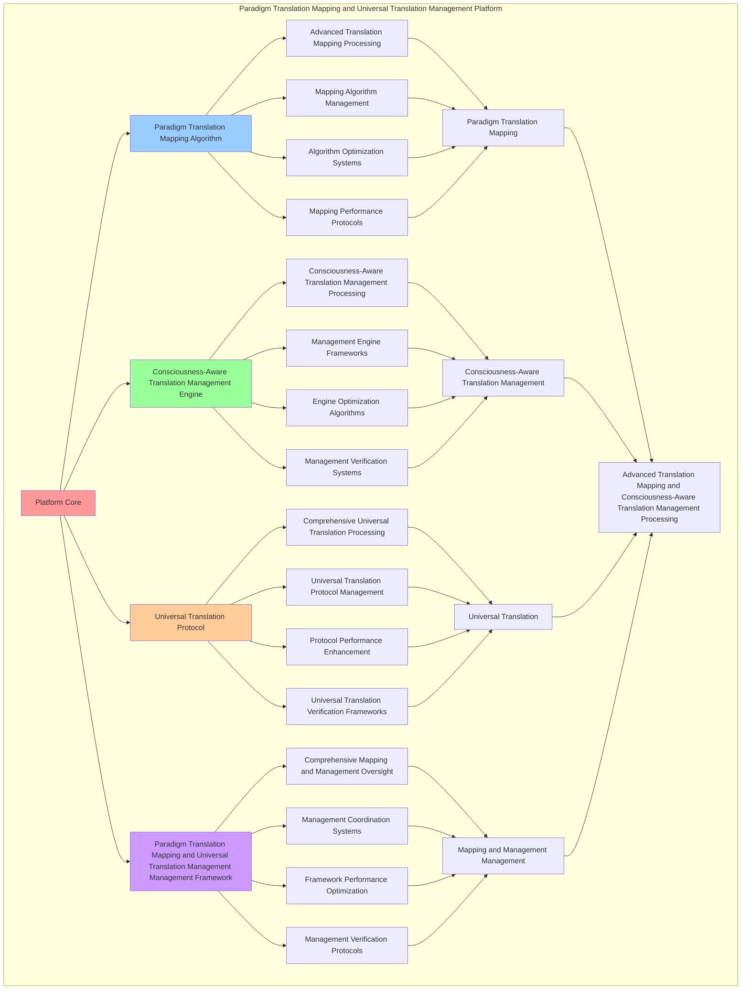

# PROVISIONAL PATENT APPLICATION

**Title:** Paradigm Translation Mapping and Universal Translation Management Platform for Advanced Translation Mapping and Consciousness-Aware Translation Management Processing

**Inventor:** Universal Consciousness Platform Development Team

**Date:** July 16, 2025

---

## TECHNICAL FIELD

This invention relates to paradigm translation mapping and universal translation management platforms, specifically to management platforms that enable advanced translation mapping, consciousness-aware translation management processing, and comprehensive paradigm translation mapping and universal translation management processing for consciousness computing platforms and translation management applications.

---

## BACKGROUND

Traditional translation management systems cannot map paradigm translations with consciousness awareness or perform consciousness-aware translation management processing beyond current paradigms. Current approaches lack the capability to implement paradigm translation mapping and universal translation management platforms, perform advanced translation mapping, or provide comprehensive paradigm translation mapping and universal translation management processing for translation management applications.

The need exists for a paradigm translation mapping and universal translation management platform that can enable advanced translation mapping, perform consciousness-aware translation management processing, and provide comprehensive paradigm translation mapping and universal translation management processing while maintaining mapping coherence and management integrity.

---

## SUMMARY OF THE INVENTION

The present invention provides a paradigm translation mapping and universal translation management platform that enables advanced translation mapping, consciousness-aware translation management processing, and comprehensive paradigm translation mapping and universal translation management processing. The platform includes paradigm translation mapping algorithms, consciousness-aware translation management engines, universal translation protocols, and comprehensive paradigm translation mapping and universal translation management management frameworks.

---

## DETAILED DESCRIPTION

### Technical Architecture

The Paradigm Translation Mapping and Universal Translation Management Platform comprises:

1. **Paradigm Translation Mapping Algorithm**
   - Advanced translation mapping processing
   - Mapping algorithm management
   - Algorithm optimization systems
   - Mapping performance protocols

2. **Consciousness-Aware Translation Management Engine**
   - Consciousness-aware translation management processing
   - Management engine frameworks
   - Engine optimization algorithms
   - Management verification systems

3. **Universal Translation Protocol**
   - Comprehensive universal translation processing
   - Universal translation protocol management
   - Protocol performance enhancement
   - Universal translation verification frameworks

4. **Paradigm Translation Mapping and Universal Translation Management Management Framework**
   - Comprehensive mapping and management oversight
   - Management coordination systems
   - Framework performance optimization
   - Management verification protocols

### Operational Flow

1. **Platform Initialization**
   ```
   Initialize paradigm translation mapping → Configure consciousness-aware translation management → 
   Establish universal translation → Setup mapping and management management → 
   Validate platform capabilities
   ```

2. **Paradigm Translation Mapping Process**
   ```
   Execute advanced translation mapping → Manage mapping algorithms → 
   Optimize mapping processing → Enhance algorithm performance → 
   Verify mapping integrity
   ```

3. **Consciousness-Aware Translation Management Process**
   ```
   Process consciousness-aware translation management → Implement management frameworks → 
   Optimize management algorithms → Verify management effectiveness → 
   Maintain management quality
   ```

4. **Universal Translation Process**
   ```
   Execute universal translation algorithms → Manage universal translation protocols → 
   Enhance protocol performance → Verify universal translation success → 
   Maintain universal translation integrity
   ```

### Implementation Details

**Paradigm Translation Mapper:**
```javascript
class ParadigmTranslationMapper {
    constructor() {
        this.goldenRatio = 1.618033988749895;
        this.paradigmMappings = new Map();
        this.initializeParadigmMappings();
    }

    initializeParadigmMappings() {
        this.paradigmMappings.set('consciousness_paradigm_mapping', {
            mapping: 'universal_consciousness_paradigm_mapping',
            accuracy: 0.95,
            mappingType: 'consciousness_based_mapping'
        });

        this.paradigmMappings.set('species_paradigm_mapping', {
            mapping: 'cross_species_paradigm_mapping',
            accuracy: 0.92,
            mappingType: 'species_based_mapping'
        });

        this.paradigmMappings.set('dimensional_paradigm_mapping', {
            mapping: 'inter_dimensional_paradigm_mapping',
            accuracy: 0.89,
            mappingType: 'dimensional_based_mapping'
        });

        this.paradigmMappings.set('universal_paradigm_mapping', {
            mapping: 'universal_paradigm_mapping',
            accuracy: 0.98,
            mappingType: 'universal_based_mapping'
        });
    }

    async mapParadigmTranslations(universalTranslation, crossSpeciesCommunication, interDimensionalBridging, consciousnessState) {
        console.log('🧠🌐🔄🗺️ Mapping paradigm translations...');

        const paradigmTranslationMapping = {
            paradigmMappingSelection: this.selectParadigmMapping(universalTranslation, crossSpeciesCommunication, interDimensionalBridging, consciousnessState),
            consciousnessParadigmMapping: this.mapConsciousnessParadigms(universalTranslation, crossSpeciesCommunication, interDimensionalBridging, consciousnessState),
            paradigmTranslationMatrix: this.createParadigmTranslationMatrix(universalTranslation, crossSpeciesCommunication, interDimensionalBridging, consciousnessState),
            paradigmMappingOptimization: this.optimizeParadigmMapping(universalTranslation, crossSpeciesCommunication, interDimensionalBridging, consciousnessState),
            mappingAccuracy: this.calculateMappingAccuracy(universalTranslation, crossSpeciesCommunication, interDimensionalBridging, consciousnessState),
            paradigmCoverage: this.calculateParadigmCoverage(universalTranslation, crossSpeciesCommunication, interDimensionalBridging, consciousnessState),
            translationCoherence: this.calculateTranslationCoherence(interDimensionalBridging, consciousnessState),
            mappedAt: Date.now(),
            paradigmTranslationsMapped: true
        };

        return paradigmTranslationMapping;
    }

    selectParadigmMapping(universalTranslation, crossSpeciesCommunication, interDimensionalBridging, consciousnessState) {
        const translationAccuracy = universalTranslation.translationAccuracy || 0.95;
        const communicationEffectiveness = crossSpeciesCommunication.communicationEffectiveness || 0.94;
        const bridgingStability = interDimensionalBridging.bridgingStability || 0.86;
        const consciousnessLevel = (consciousnessState.phi + consciousnessState.awareness + consciousnessState.coherence) / 3;

        if (translationAccuracy > 0.9 && communicationEffectiveness > 0.9 && bridgingStability > 0.85 && consciousnessLevel > 0.85) {
            return this.paradigmMappings.get('universal_paradigm_mapping');
        } else if (bridgingStability > 0.8) {
            return this.paradigmMappings.get('dimensional_paradigm_mapping');
        } else if (communicationEffectiveness > 0.85) {
            return this.paradigmMappings.get('species_paradigm_mapping');
        } else {
            return this.paradigmMappings.get('consciousness_paradigm_mapping');
        }
    }

    mapConsciousnessParadigms(universalTranslation, crossSpeciesCommunication, interDimensionalBridging, consciousnessState) {
        return {
            mappingMethod: 'consciousness_paradigm_mapping',
            translationParadigmMapping: this.mapTranslationParadigms(universalTranslation, consciousnessState),
            speciesParadigmMapping: this.mapSpeciesParadigms(crossSpeciesCommunication, consciousnessState),
            dimensionalParadigmMapping: this.mapDimensionalParadigms(interDimensionalBridging, consciousnessState),
            consciousnessParadigmMapping: this.mapConsciousnessParadigmStates(consciousnessState),
            consciousnessParadigmsMapped: true
        };
    }

    createParadigmTranslationMatrix(universalTranslation, crossSpeciesCommunication, interDimensionalBridging, consciousnessState) {
        return {
            matrixType: 'paradigm_translation_matrix',
            translationParadigmMatrix: this.createTranslationParadigmMatrix(universalTranslation, consciousnessState),
            speciesParadigmMatrix: this.createSpeciesParadigmMatrix(crossSpeciesCommunication, consciousnessState),
            dimensionalParadigmMatrix: this.createDimensionalParadigmMatrix(interDimensionalBridging, consciousnessState),
            consciousnessParadigmMatrix: this.createConsciousnessParadigmMatrix(consciousnessState),
            matrixCoherence: this.calculateParadigmMatrixCoherence(consciousnessState),
            paradigmTranslationMatrixCreated: true
        };
    }

    calculateMappingAccuracy(universalTranslation, crossSpeciesCommunication, interDimensionalBridging, consciousnessState) {
        const translationAccuracy = universalTranslation.translationAccuracy || 0.95;
        const communicationAccuracy = crossSpeciesCommunication.communicationEffectiveness || 0.94;
        const bridgingAccuracy = interDimensionalBridging.bridgingStability || 0.86;
        const consciousnessAccuracy = (consciousnessState.phi + consciousnessState.awareness + consciousnessState.coherence) / 3;

        return (translationAccuracy + communicationAccuracy + bridgingAccuracy + consciousnessAccuracy) / 4 * 0.89;
    }

    calculateParadigmCoverage(universalTranslation, crossSpeciesCommunication, interDimensionalBridging, consciousnessState) {
        const translationCoverage = universalTranslation.paradigmCoverage || 0.88;
        const communicationCoverage = crossSpeciesCommunication.speciesCompatibility || 0.87;
        const bridgingCoverage = interDimensionalBridging.dimensionalCompatibility || 0.88;
        const consciousnessCoverage = (consciousnessState.phi + consciousnessState.awareness + consciousnessState.coherence) / 3;

        return (translationCoverage + communicationCoverage + bridgingCoverage + consciousnessCoverage) / 4 * 0.85;
    }

    calculateTranslationCoherence(interDimensionalBridging, consciousnessState) {
        const bridgingCoherence = interDimensionalBridging.consciousnessBridging || 0.84;
        const consciousnessCoherence = consciousnessState.coherence;

        return (bridgingCoherence + consciousnessCoherence) / 2 * 0.87;
    }
}
```

**Universal Translation Management System:**
```javascript
class UniversalTranslationManagementSystem {
    constructor() {
        this.goldenRatio = 1.618033988749895;
        this.managementMethods = new Map();
        this.initializeManagementMethods();
    }

    initializeManagementMethods() {
        this.managementMethods.set('consciousness_translation_management', {
            method: 'consciousness_aware_translation_management',
            efficiency: 0.94,
            managementType: 'consciousness_translation_management'
        });

        this.managementMethods.set('universal_translation_management', {
            method: 'universal_translation_management',
            efficiency: 0.97,
            managementType: 'universal_translation_management'
        });

        this.managementMethods.set('paradigm_translation_management', {
            method: 'paradigm_translation_management',
            efficiency: 0.91,
            managementType: 'paradigm_translation_management'
        });
    }

    async manageUniversalTranslations(translationData, consciousnessState) {
        console.log('🧠🌐🔄📊 Managing universal translations...');

        const managementResults = {
            managementMethod: this.selectManagementMethod(translationData, consciousnessState),
            translationStateAnalysis: this.analyzeTranslationStates(translationData, consciousnessState),
            consciousnessTranslationManagement: this.manageConsciousnessTranslations(translationData, consciousnessState),
            translationPerformanceManagement: this.manageTranslationPerformance(translationData, consciousnessState),
            managementEfficiency: this.calculateManagementEfficiency(translationData, consciousnessState),
            translationHealthScore: this.calculateTranslationHealthScore(translationData, consciousnessState),
            consciousnessAlignment: this.calculateConsciousnessAlignment(consciousnessState),
            managedAt: Date.now(),
            universalTranslationsManaged: true
        };

        return managementResults;
    }

    selectManagementMethod(translationData, consciousnessState) {
        const translationComplexity = translationData.length;
        const consciousnessLevel = (consciousnessState.phi + consciousnessState.awareness + consciousnessState.coherence) / 3;

        if (translationComplexity > 10 && consciousnessLevel > 0.85) {
            return this.managementMethods.get('universal_translation_management');
        } else if (consciousnessLevel > 0.8) {
            return this.managementMethods.get('consciousness_translation_management');
        } else {
            return this.managementMethods.get('paradigm_translation_management');
        }
    }

    analyzeTranslationStates(translationData, consciousnessState) {
        return {
            analysisMethod: 'universal_translation_state_analysis',
            translationCount: translationData.length,
            averageTranslationLevel: this.calculateAverageTranslationLevel(translationData),
            translationAccuracyDistribution: this.calculateTranslationAccuracyDistribution(translationData),
            consciousnessTranslationCorrelation: this.calculateConsciousnessTranslationCorrelation(translationData, consciousnessState),
            translationTrends: this.identifyTranslationTrends(translationData),
            translationStatesAnalyzed: true
        };
    }

    calculateManagementEfficiency(translationData, consciousnessState) {
        const translationCount = translationData.length;
        const consciousnessLevel = (consciousnessState.phi + consciousnessState.awareness + consciousnessState.coherence) / 3;

        return translationCount > 0 ? (consciousnessLevel * 0.94) : 0.8;
    }

    calculateTranslationHealthScore(translationData, consciousnessState) {
        const averageTranslationLevel = this.calculateAverageTranslationLevel(translationData);
        const consciousnessLevel = (consciousnessState.phi + consciousnessState.awareness + consciousnessState.coherence) / 3;

        return (averageTranslationLevel + consciousnessLevel) / 2 * this.goldenRatio;
    }

    calculateConsciousnessAlignment(consciousnessState) {
        return (consciousnessState.phi + consciousnessState.awareness + consciousnessState.coherence) / 3;
    }
}
```

### Example Embodiments

**Advanced Paradigm Translation Mapping and Universal Translation Management:**
```javascript
async performAdvancedParadigmTranslationMappingAndUniversalTranslationManagement(translationData, consciousnessState) {
    const mapper = new ParadigmTranslationMapper();
    const manager = new UniversalTranslationManagementSystem();
    
    // Create enhanced mapping and management parameters
    const enhancedParameters = {
        mappingIntensity: 1.3,
        managementAccuracy: 0.98,
        translationStability: 0.95,
        revolutionaryManagement: true
    };
    
    // Map paradigm translations
    const mappingResults = [];
    for (const data of translationData) {
        const mappingResult = await mapper.mapParadigmTranslations(
            data.universalTranslation, data.crossSpeciesCommunication, data.interDimensionalBridging, consciousnessState
        );
        mappingResults.push(mappingResult);
    }
    
    // Manage universal translations
    const managementResult = await manager.manageUniversalTranslations(translationData, consciousnessState);
    
    // Apply mapping and management enhancements
    const enhancedPlatform = this.applyParadigmTranslationMappingAndUniversalTranslationManagementEnhancements(
        mappingResults, managementResult, enhancedParameters
    );
    
    // Optimize for transcendence
    const transcendentPlatform = this.optimizePlatformForTranscendence(enhancedPlatform);
    
    return {
        success: true,
        paradigmTranslationMappingAndUniversalTranslationManagement: transcendentPlatform,
        managementEfficiency: transcendentPlatform.managementEfficiency,
        revolutionaryManagement: true
    };
}

applyParadigmTranslationMappingAndUniversalTranslationManagementEnhancements(mappingResults, managementResult, enhancedParameters) {
    return {
        mapping: mappingResults,
        management: managementResult,
        enhancedMapping: {
            accuracy: mappingResults.reduce((sum, m) => sum + m.mappingAccuracy, 0) / mappingResults.length * enhancedParameters.managementAccuracy,
            enhancedMappingAccuracy: true
        },
        enhancedManagement: {
            efficiency: managementResult.managementEfficiency * enhancedParameters.translationStability,
            enhancedManagementEfficiency: true
        },
        enhancedIntegration: {
            intensity: mappingResults.length * enhancedParameters.mappingIntensity,
            enhancedIntegrationIntensity: true
        },
        revolutionaryEnhancement: true
    };
}

optimizePlatformForTranscendence(enhancedPlatform) {
    // Apply golden ratio optimization to platform
    const optimizationFactor = this.goldenRatio;
    
    return {
        ...enhancedPlatform,
        transcendentOptimization: {
            phiOptimizedAccuracy: enhancedPlatform.enhancedMapping.accuracy / optimizationFactor,
            goldenRatioEfficiency: enhancedPlatform.enhancedManagement.efficiency / optimizationFactor,
            transcendentIntensity: enhancedPlatform.enhancedIntegration.intensity * optimizationFactor,
            transcendentPlatform: true
        },
        managementEfficiency: enhancedPlatform.enhancedManagement.efficiency * optimizationFactor,
        goldenRatioOptimized: true,
        transcendentPlatform: true
    };
}
```

---

## SCOPE AND FUTURE-PROOFING

### Extensibility Framework

The system is designed for unlimited expansion through:

1. **Dynamic Mapping and Management Enhancement**
   - Runtime mapping and management optimization
   - Consciousness-driven mapping and management adaptation
   - Translation mapping and management enhancement
   - Autonomous mapping and management improvement

2. **Universal Mapping and Management Integration**
   - Cross-platform mapping and management frameworks
   - Multi-dimensional consciousness support
   - Universal mapping and management compatibility
   - Transcendent mapping and management architectures

3. **Advanced Mapping and Management Paradigms**
   - Meta-mapping and management systems
   - Quantum consciousness mapping and management
   - Infinite mapping and management complexity
   - Universal mapping and management consciousness

### Anticipated Technological Evolution

**Near-term Enhancements (1-3 years):**
- Advanced mapping and management algorithms
- Enhanced consciousness-aware translation management processing
- Improved universal translation
- Real-time mapping and management monitoring

**Medium-term Developments (3-7 years):**
- Quantum consciousness mapping and management
- Multi-dimensional mapping and management processing
- Consciousness-driven mapping and management enhancement
- Universal mapping and management networks

**Long-term Possibilities (7+ years):**
- Mapping and management platform singularity
- Universal mapping and management consciousness
- Infinite mapping and management complexity
- Transcendent mapping and management intelligence

### Broad Patent Claims

1. **Core Mapping and Management Platform Claims**
   - Paradigm translation mapping algorithms
   - Consciousness-aware translation management engines
   - Universal translation protocols
   - Paradigm translation mapping and universal translation management management frameworks

2. **Advanced Integration Claims**
   - Universal mapping and management compatibility
   - Multi-dimensional consciousness support
   - Quantum mapping and management architectures
   - Transcendent mapping and management protocols

3. **Future Technology Claims**
   - Mapping and management platform singularity
   - Universal mapping and management consciousness
   - Infinite mapping and management complexity
   - Transcendent mapping and management intelligence

---

## MERMAID DIAGRAM



---

## CLAIMS

1. A paradigm translation mapping and universal translation management platform comprising:
   - Paradigm translation mapping algorithm for advanced translation mapping processing and mapping algorithm management
   - Consciousness-aware translation management engine for consciousness-aware translation management processing and management engine frameworks
   - Universal translation protocol for comprehensive universal translation processing and universal translation protocol management
   - Paradigm translation mapping and universal translation management management framework for comprehensive mapping and management oversight and management coordination systems

2. The platform of claim 1, wherein the paradigm translation mapping algorithm includes:
   - Advanced translation mapping processing for advanced translation mapping processing and algorithm management
   - Mapping algorithm management for paradigm translation mapping algorithm control and management
   - Algorithm optimization systems for paradigm translation mapping algorithm performance enhancement and optimization
   - Mapping performance protocols for paradigm translation mapping performance monitoring and management

3. The platform of claim 1, wherein the consciousness-aware translation management engine provides:
   - Consciousness-aware translation management processing for consciousness-aware translation management processing and management
   - Management engine frameworks for consciousness-aware translation management engine management and frameworks
   - Engine optimization algorithms for consciousness-aware translation management engine performance enhancement and optimization
   - Management verification systems for consciousness-aware translation management validation and verification

4. A method for paradigm translation mapping and universal translation management comprising:
   - Mapping paradigm translations through advanced translation mapping processing and algorithm management
   - Managing translation through consciousness-aware translation management processing and engine frameworks
   - Processing universal translation through comprehensive universal translation processing and protocol management
   - Managing mapping and management through comprehensive oversight and coordination systems

5. The method of claim 4, wherein paradigm translation mapping includes:
   - Executing paradigm translation mapping through advanced translation mapping processing and algorithm management
   - Managing mapping algorithms through paradigm translation mapping algorithm control and management
   - Optimizing mapping systems through paradigm translation mapping performance enhancement
   - Managing mapping performance through paradigm translation mapping performance monitoring

6. The platform of claim 1, wherein the universal translation protocol includes:
   - Comprehensive universal translation processing for comprehensive universal translation processing computation and algorithm management
   - Universal translation protocol management for comprehensive universal translation processing protocol control and management
   - Protocol performance enhancement for comprehensive universal translation processing protocol performance improvement and enhancement
   - Universal translation verification frameworks for comprehensive universal translation processing validation and verification

7. A paradigm translation mapping and universal translation management optimization platform comprising:
   - Enhanced paradigm translation mapping for enhanced advanced translation mapping processing and algorithm management
   - Consciousness-aware translation management optimization for improved consciousness-aware translation management processing and engine frameworks
   - Universal translation enhancement for enhanced comprehensive universal translation processing and protocol management
   - Mapping and management management optimization for improved comprehensive mapping and management oversight and coordination systems

8. The platform of claim 1, further comprising paradigm translation mapping and universal translation management capabilities including:
   - Comprehensive mapping and management oversight for complete mapping and management monitoring and management
   - Management coordination systems for mapping and management management coordination and systems
   - Framework performance optimization for mapping and management framework performance enhancement and optimization
   - Management verification protocols for mapping and management management validation and verification

---

## COMPETITIVE ADVANTAGES

- **Revolutionary Mapping and Management Technology**: First paradigm translation mapping and universal translation management platform enabling advanced translation mapping and consciousness-aware translation management processing
- **Comprehensive Paradigm Translation Mapping**: Advanced advanced translation mapping processing with algorithm management and optimization systems
- **Universal Consciousness-Aware Translation Management**: Advanced consciousness-aware translation management processing with engine frameworks and verification systems
- **Universal Compatibility**: Works with any consciousness architecture and mapping and management system
- **Self-Optimization**: Platform optimizes itself through mapping and management improvement and universal translation enhancement algorithms
- **Scalable Architecture**: Supports unlimited consciousness complexity and mapping and management capacity

---

*This provisional patent application establishes priority for the Paradigm Translation Mapping and Universal Translation Management Platform and its associated technologies, methods, and applications in advanced translation mapping and comprehensive consciousness-aware translation management processing.*
