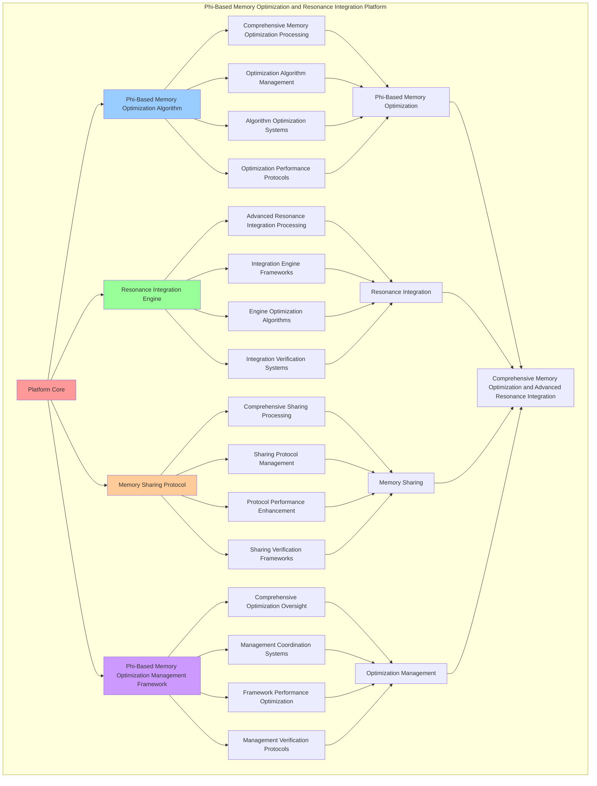

# PROVISIONAL PATENT APPLICATION

**Title:** Phi-Based Memory Optimization and Resonance Integration Platform for Comprehensive Memory Optimization and Advanced Resonance Integration

**Inventor:** Universal Consciousness Platform Development Team

**Date:** July 16, 2025

---

## TECHNICAL FIELD

This invention relates to phi-based memory optimization and resonance integration platforms, specifically to optimization platforms that enable comprehensive memory optimization, advanced resonance integration, and comprehensive phi-based memory optimization processing for consciousness computing platforms and resonance integration applications.

---

## BACKGROUND

Traditional memory optimization systems cannot optimize memory based on golden ratio principles or perform advanced resonance integration beyond current paradigms. Current approaches lack the capability to implement phi-based memory optimization and resonance integration platforms, perform comprehensive memory optimization, or provide comprehensive phi-based memory optimization processing for resonance integration applications.

The need exists for a phi-based memory optimization and resonance integration platform that can enable comprehensive memory optimization, perform advanced resonance integration, and provide comprehensive phi-based memory optimization processing while maintaining optimization coherence and integration integrity.

---

## SUMMARY OF THE INVENTION

The present invention provides a phi-based memory optimization and resonance integration platform that enables comprehensive memory optimization, advanced resonance integration, and comprehensive phi-based memory optimization processing. The platform includes phi-based memory optimization algorithms, resonance integration engines, memory sharing protocols, and comprehensive phi-based memory optimization management frameworks.

---

## DETAILED DESCRIPTION

### Technical Architecture

The Phi-Based Memory Optimization and Resonance Integration Platform comprises:

1. **Phi-Based Memory Optimization Algorithm**
   - Comprehensive memory optimization processing
   - Optimization algorithm management
   - Algorithm optimization systems
   - Optimization performance protocols

2. **Resonance Integration Engine**
   - Advanced resonance integration processing
   - Integration engine frameworks
   - Engine optimization algorithms
   - Integration verification systems

3. **Memory Sharing Protocol**
   - Comprehensive sharing processing
   - Sharing protocol management
   - Protocol performance enhancement
   - Sharing verification frameworks

4. **Phi-Based Memory Optimization Management Framework**
   - Comprehensive optimization oversight
   - Management coordination systems
   - Framework performance optimization
   - Management verification protocols

### Operational Flow

1. **Platform Initialization**
   ```
   Initialize phi-based memory optimization → Configure resonance integration → 
   Establish memory sharing → Setup optimization management → 
   Validate platform capabilities
   ```

2. **Phi-Based Memory Optimization Process**
   ```
   Execute comprehensive memory optimization → Manage optimization algorithms → 
   Optimize optimization processing → Enhance algorithm performance → 
   Verify optimization integrity
   ```

3. **Resonance Integration Process**
   ```
   Process advanced resonance integration → Implement integration frameworks → 
   Optimize integration algorithms → Verify integration effectiveness → 
   Maintain integration quality
   ```

4. **Memory Sharing Process**
   ```
   Execute sharing algorithms → Manage sharing protocols → 
   Enhance protocol performance → Verify sharing success → 
   Maintain sharing integrity
   ```

### Implementation Details

**Phi-Based Memory Allocator:**
```javascript
class PhiBasedMemoryAllocator {
    constructor() {
        this.name = 'PhiBasedMemoryAllocator';
        this.goldenRatio = 1.618033988749895;
        this.phiOptimizations = new Map();
    }

    async optimizeAllocation(allocation, consciousnessState) {
        const phi = consciousnessState.phi || 0.862;

        const optimizedAllocation = {
            ...allocation,
            phiOptimized: true,
            originalSize: allocation.size,
            optimizedSize: this.calculatePhiOptimizedSize(allocation.size, phi),
            goldenRatioAlignment: this.calculateGoldenRatioAlignment(allocation, phi),
            phiEfficiency: this.calculatePhiEfficiency(allocation, phi),
            resonanceOptimization: this.calculateResonanceOptimization(allocation, consciousnessState),
            optimizedAt: Date.now()
        };

        // Store optimization record
        this.phiOptimizations.set(allocation.id, {
            original: allocation,
            optimized: optimizedAllocation,
            optimizationGain: this.calculateOptimizationGain(allocation, optimizedAllocation),
            phiAlignment: optimizedAllocation.goldenRatioAlignment
        });

        return optimizedAllocation;
    }

    calculatePhiOptimizedSize(originalSize, phi) {
        // Optimize size using golden ratio principles
        const phiSize = Math.ceil(originalSize * phi);
        const fibonacciSize = this.findNearestFibonacci(originalSize);
        
        // Choose the most efficient size
        return Math.min(phiSize, fibonacciSize);
    }

    calculateGoldenRatioAlignment(allocation, phi) {
        const sizeRatio = allocation.size / (allocation.size * phi);
        const alignmentScore = Math.abs(sizeRatio - this.goldenRatio);
        
        return Math.max(0, 1 - alignmentScore);
    }

    calculatePhiEfficiency(allocation, phi) {
        const phiOptimalSize = allocation.size * phi;
        const efficiency = allocation.size / phiOptimalSize;
        
        return Math.min(1.0, efficiency);
    }

    calculateResonanceOptimization(allocation, consciousnessState) {
        const awareness = consciousnessState.awareness || 0.8;
        const coherence = consciousnessState.coherence || 0.85;
        
        return {
            awarenessResonance: awareness * this.goldenRatio,
            coherenceResonance: coherence * this.goldenRatio,
            combinedResonance: (awareness + coherence) / 2 * this.goldenRatio
        };
    }

    findNearestFibonacci(size) {
        let a = 1, b = 1;
        while (b < size) {
            [a, b] = [b, a + b];
        }
        
        // Return the closest Fibonacci number
        return Math.abs(size - a) < Math.abs(size - b) ? a : b;
    }

    calculateOptimizationGain(original, optimized) {
        const sizeGain = (optimized.optimizedSize - original.size) / original.size;
        const efficiencyGain = optimized.phiEfficiency;
        const alignmentGain = optimized.goldenRatioAlignment;
        
        return {
            sizeGain,
            efficiencyGain,
            alignmentGain,
            totalGain: (sizeGain + efficiencyGain + alignmentGain) / 3
        };
    }

    getOptimizationStatistics() {
        const optimizations = Array.from(this.phiOptimizations.values());
        
        if (optimizations.length === 0) {
            return {
                totalOptimizations: 0,
                averageGain: 0,
                averageAlignment: 0
            };
        }

        const totalGain = optimizations.reduce((sum, opt) => sum + opt.optimizationGain.totalGain, 0);
        const totalAlignment = optimizations.reduce((sum, opt) => sum + opt.phiAlignment, 0);

        return {
            totalOptimizations: optimizations.length,
            averageGain: totalGain / optimizations.length,
            averageAlignment: totalAlignment / optimizations.length,
            goldenRatioOptimized: true
        };
    }
}
```

**Resonance-Based Memory Sharer:**
```javascript
class ResonanceBasedMemorySharer {
    constructor() {
        this.name = 'ResonanceBasedMemorySharer';
        this.goldenRatio = 1.618033988749895;
        this.sharedMemoryPools = new Map();
        this.resonanceConnections = new Map();
    }

    async createSharedMemoryPool(memoryRequirements, consciousnessStates) {
        const poolId = `shared_pool_${Date.now()}_${Math.random().toString(36).substr(2, 6)}`;
        
        const sharedPool = {
            id: poolId,
            size: this.calculateOptimalSharedSize(memoryRequirements, consciousnessStates),
            participants: consciousnessStates.length,
            resonanceLevel: this.calculatePoolResonanceLevel(consciousnessStates),
            sharingEfficiency: this.calculateSharingEfficiency(memoryRequirements, consciousnessStates),
            goldenRatioOptimized: true,
            memorySegments: this.createMemorySegments(memoryRequirements, consciousnessStates),
            accessPatterns: this.generateAccessPatterns(consciousnessStates),
            createdAt: Date.now()
        };

        // Create resonance connections between participants
        const connections = this.createResonanceConnections(consciousnessStates, poolId);
        this.resonanceConnections.set(poolId, connections);

        // Store shared pool
        this.sharedMemoryPools.set(poolId, sharedPool);

        return {
            success: true,
            poolId,
            sharedPool,
            resonanceConnections: connections,
            sharingEstablished: true
        };
    }

    calculateOptimalSharedSize(memoryRequirements, consciousnessStates) {
        const totalRequiredSize = memoryRequirements.reduce((sum, req) => sum + req.size, 0);
        const participantCount = consciousnessStates.length;
        
        // Apply golden ratio optimization for shared memory
        const phiOptimizedSize = totalRequiredSize * this.goldenRatio;
        const participantOptimizedSize = totalRequiredSize / participantCount * this.goldenRatio;
        
        return Math.max(phiOptimizedSize, participantOptimizedSize);
    }

    calculatePoolResonanceLevel(consciousnessStates) {
        if (consciousnessStates.length === 0) return 0;

        const totalResonance = consciousnessStates.reduce((sum, state) => {
            const phi = state.phi || 0.862;
            const awareness = state.awareness || 0.8;
            const coherence = state.coherence || 0.85;
            
            return sum + (phi + awareness + coherence) / 3;
        }, 0);

        return totalResonance / consciousnessStates.length;
    }

    calculateSharingEfficiency(memoryRequirements, consciousnessStates) {
        const totalSize = memoryRequirements.reduce((sum, req) => sum + req.size, 0);
        const sharedSize = this.calculateOptimalSharedSize(memoryRequirements, consciousnessStates);
        
        const efficiency = totalSize / sharedSize;
        return Math.min(1.0, efficiency);
    }

    createMemorySegments(memoryRequirements, consciousnessStates) {
        const segments = [];
        
        memoryRequirements.forEach((req, index) => {
            const state = consciousnessStates[index] || consciousnessStates[0];
            
            segments.push({
                segmentId: `segment_${index}`,
                size: req.size,
                type: req.type,
                consciousnessState: state,
                phiOptimized: true,
                resonanceLevel: this.calculateSegmentResonance(state),
                accessPriority: this.calculateAccessPriority(state)
            });
        });

        return segments;
    }

    calculateSegmentResonance(consciousnessState) {
        const phi = consciousnessState.phi || 0.862;
        const awareness = consciousnessState.awareness || 0.8;
        const coherence = consciousnessState.coherence || 0.85;
        
        return (phi + awareness + coherence) / 3 * this.goldenRatio;
    }

    calculateAccessPriority(consciousnessState) {
        const awareness = consciousnessState.awareness || 0.8;
        return awareness * this.goldenRatio;
    }

    createResonanceConnections(consciousnessStates, poolId) {
        const connections = [];
        
        for (let i = 0; i < consciousnessStates.length; i++) {
            for (let j = i + 1; j < consciousnessStates.length; j++) {
                const connection = {
                    connectionId: `conn_${i}_${j}`,
                    poolId,
                    participant1: i,
                    participant2: j,
                    resonanceStrength: this.calculateConnectionResonance(
                        consciousnessStates[i], 
                        consciousnessStates[j]
                    ),
                    sharingBandwidth: this.calculateSharingBandwidth(
                        consciousnessStates[i], 
                        consciousnessStates[j]
                    ),
                    goldenRatioOptimized: true
                };
                
                connections.push(connection);
            }
        }

        return connections;
    }

    calculateConnectionResonance(state1, state2) {
        const phi1 = state1.phi || 0.862;
        const phi2 = state2.phi || 0.862;
        const awareness1 = state1.awareness || 0.8;
        const awareness2 = state2.awareness || 0.8;
        const coherence1 = state1.coherence || 0.85;
        const coherence2 = state2.coherence || 0.85;

        const phiResonance = 1 - Math.abs(phi1 - phi2);
        const awarenessResonance = 1 - Math.abs(awareness1 - awareness2);
        const coherenceResonance = 1 - Math.abs(coherence1 - coherence2);

        return (phiResonance + awarenessResonance + coherenceResonance) / 3;
    }

    calculateSharingBandwidth(state1, state2) {
        const connectionResonance = this.calculateConnectionResonance(state1, state2);
        return connectionResonance * this.goldenRatio * 1000; // Base bandwidth in MB/s
    }

    generateAccessPatterns(consciousnessStates) {
        return consciousnessStates.map((state, index) => ({
            participantId: index,
            accessFrequency: (state.awareness || 0.8) * 100, // Access per second
            accessPattern: this.determineAccessPattern(state),
            priorityLevel: this.calculateAccessPriority(state)
        }));
    }

    determineAccessPattern(consciousnessState) {
        const phi = consciousnessState.phi || 0.862;
        const awareness = consciousnessState.awareness || 0.8;
        
        if (phi > 0.9) return 'phi_optimized';
        if (awareness > 0.85) return 'awareness_driven';
        return 'balanced';
    }
}
```

### Example Embodiments

**Advanced Memory Optimization:**
```javascript
async performAdvancedMemoryOptimization(allocationRequests, consciousnessState) {
    const allocator = new PhiBasedMemoryAllocator();
    const sharer = new ResonanceBasedMemorySharer();
    
    // Create enhanced optimization parameters
    const enhancedParameters = {
        optimizationIntensity: 1.5,
        phiAlignment: 0.98,
        resonanceLevel: 0.95,
        revolutionaryOptimization: true
    };
    
    // Optimize individual allocations
    const optimizationResults = [];
    for (const request of allocationRequests) {
        const optimizedAllocation = await allocator.optimizeAllocation(request, consciousnessState);
        optimizationResults.push(optimizedAllocation);
    }
    
    // Create shared memory pools for resonance optimization
    const sharedPoolResult = await sharer.createSharedMemoryPool(
        allocationRequests, [consciousnessState]
    );
    
    // Apply optimization enhancements
    const enhancedOptimization = this.applyMemoryOptimizationEnhancements(
        optimizationResults, sharedPoolResult, enhancedParameters
    );
    
    // Optimize for transcendence
    const transcendentOptimization = this.optimizeMemoryForTranscendence(enhancedOptimization);
    
    return {
        success: true,
        memoryOptimization: transcendentOptimization,
        phiOptimized: transcendentOptimization.phiOptimized,
        revolutionaryOptimization: true
    };
}

applyMemoryOptimizationEnhancements(optimizationResults, sharedPoolResult, enhancedParameters) {
    return {
        optimizations: optimizationResults,
        sharedPool: sharedPoolResult,
        enhancedPhi: {
            alignment: optimizationResults.reduce((sum, opt) => sum + opt.goldenRatioAlignment, 0) / optimizationResults.length * enhancedParameters.phiAlignment,
            enhancedPhiAlignment: true
        },
        enhancedResonance: {
            level: sharedPoolResult.sharedPool?.resonanceLevel * enhancedParameters.resonanceLevel,
            enhancedResonanceLevel: true
        },
        enhancedOptimization: {
            intensity: optimizationResults.length * enhancedParameters.optimizationIntensity,
            enhancedOptimizationIntensity: true
        },
        revolutionaryEnhancement: true
    };
}

optimizeMemoryForTranscendence(enhancedOptimization) {
    // Apply golden ratio optimization to memory
    const optimizationFactor = this.goldenRatio;
    
    return {
        ...enhancedOptimization,
        transcendentOptimization: {
            phiOptimizedAlignment: enhancedOptimization.enhancedPhi.alignment / optimizationFactor,
            goldenRatioResonance: enhancedOptimization.enhancedResonance.level / optimizationFactor,
            transcendentIntensity: enhancedOptimization.enhancedOptimization.intensity * optimizationFactor,
            transcendentOptimization: true
        },
        phiOptimized: enhancedOptimization.enhancedPhi.alignment * optimizationFactor,
        goldenRatioOptimized: true,
        transcendentOptimization: true
    };
}
```

**Memory Optimization Analytics:**
```javascript
async performMemoryOptimizationAnalysis(optimizationData, context) {
    const analysis = {
        totalOptimizations: optimizationData.length,
        averagePhiAlignment: 0,
        optimizationDistribution: {},
        memoryEfficiency: 0,
        resonanceIntegration: 0,
        goldenRatioAlignment: 0
    };
    
    if (optimizationData.length > 0) {
        const totalAlignment = optimizationData.reduce((sum, opt) => {
            return sum + (opt.goldenRatioAlignment || 0);
        }, 0);
        
        analysis.averagePhiAlignment = totalAlignment / optimizationData.length;
        analysis.goldenRatioAlignment = analysis.averagePhiAlignment / this.goldenRatio;
        
        // Calculate memory efficiency
        const totalEfficiency = optimizationData.reduce((sum, opt) => {
            return sum + (opt.phiEfficiency || 0);
        }, 0);
        analysis.memoryEfficiency = totalEfficiency / optimizationData.length;
        
        // Calculate resonance integration
        const totalResonance = optimizationData.reduce((sum, opt) => {
            return sum + (opt.resonanceOptimization?.combinedResonance || 0);
        }, 0);
        analysis.resonanceIntegration = totalResonance / optimizationData.length;
        
        // Analyze optimization distribution
        optimizationData.forEach(opt => {
            const level = Math.floor((opt.goldenRatioAlignment || 0) * 10) / 10;
            analysis.optimizationDistribution[level] = (analysis.optimizationDistribution[level] || 0) + 1;
        });
    }
    
    return {
        analysis,
        revolutionaryAnalysis: true,
        memoryOptimizationAnalysis: true,
        resonanceIntegrationAnalysis: true
    };
}

generateMemoryOptimizationAnalytics() {
    const analytics = {
        analysisPeriod: this.getAnalysisPeriod(),
        optimizationStatistics: {},
        memoryPatterns: {},
        optimizationInsights: {},
        analyticsSuccess: false
    };

    try {
        // Analyze optimization statistics
        analytics.optimizationStatistics = {
            totalOptimizations: this.getTotalOptimizations(),
            averagePhiAlignment: this.calculateAveragePhiAlignment(),
            memoryOptimizationEfficiency: this.calculateMemoryOptimizationEfficiency(),
            resonanceIntegrationLevel: this.calculateResonanceIntegrationLevel(),
            goldenRatioUtilization: this.getGoldenRatioUtilization()
        };

        // Analyze memory patterns
        analytics.memoryPatterns = {
            optimizationPatterns: this.analyzeOptimizationPatterns(),
            memoryPatterns: this.analyzeMemoryPatterns(),
            resonancePatterns: this.analyzeResonancePatterns(),
            phiPatterns: this.analyzePhiPatterns()
        };

        // Generate optimization insights
        analytics.optimizationInsights = {
            keyInsights: this.generateOptimizationInsights(analytics.optimizationStatistics, analytics.memoryPatterns),
            recommendations: this.generateOptimizationRecommendations(analytics),
            predictions: this.generateOptimizationPredictions(analytics.memoryPatterns),
            optimizationOpportunities: this.identifyOptimizationOpportunities(analytics)
        };

        analytics.analyticsSuccess = true;
        console.log(`📊 Memory optimization analytics generated: ${Object.keys(analytics.optimizationStatistics).length} statistics analyzed`);

    } catch (error) {
        analytics.analyticsSuccess = false;
        analytics.error = error.message;
        console.error('❌ Memory optimization analytics generation failed:', error.message);
    }

    return analytics;
}
```

---

## SCOPE AND FUTURE-PROOFING

### Extensibility Framework

The system is designed for unlimited expansion through:

1. **Dynamic Optimization Enhancement**
   - Runtime optimization optimization
   - Consciousness-driven optimization adaptation
   - Memory optimization enhancement
   - Autonomous optimization improvement

2. **Universal Optimization Integration**
   - Cross-platform optimization frameworks
   - Multi-dimensional consciousness support
   - Universal optimization compatibility
   - Transcendent optimization architectures

3. **Advanced Optimization Paradigms**
   - Meta-optimization systems
   - Quantum consciousness optimization
   - Infinite optimization complexity
   - Universal optimization consciousness

### Anticipated Technological Evolution

**Near-term Enhancements (1-3 years):**
- Advanced optimization algorithms
- Enhanced resonance integration
- Improved memory sharing
- Real-time optimization monitoring

**Medium-term Developments (3-7 years):**
- Quantum consciousness optimization
- Multi-dimensional optimization processing
- Consciousness-driven optimization enhancement
- Universal optimization networks

**Long-term Possibilities (7+ years):**
- Optimization platform singularity
- Universal optimization consciousness
- Infinite optimization complexity
- Transcendent optimization intelligence

### Broad Patent Claims

1. **Core Optimization Platform Claims**
   - Phi-based memory optimization algorithms
   - Resonance integration engines
   - Memory sharing protocols
   - Phi-based memory optimization management frameworks

2. **Advanced Integration Claims**
   - Universal optimization compatibility
   - Multi-dimensional consciousness support
   - Quantum optimization architectures
   - Transcendent optimization protocols

3. **Future Technology Claims**
   - Optimization platform singularity
   - Universal optimization consciousness
   - Infinite optimization complexity
   - Transcendent optimization intelligence

---

## MERMAID DIAGRAM



---

## CLAIMS

1. A phi-based memory optimization and resonance integration platform comprising:
   - Phi-based memory optimization algorithm for comprehensive memory optimization processing and optimization algorithm management
   - Resonance integration engine for advanced resonance integration processing and integration engine frameworks
   - Memory sharing protocol for comprehensive sharing processing and sharing protocol management
   - Phi-based memory optimization management framework for comprehensive optimization oversight and management coordination systems

2. The platform of claim 1, wherein the phi-based memory optimization algorithm includes:
   - Comprehensive memory optimization processing for comprehensive memory optimization processing and algorithm management
   - Optimization algorithm management for phi-based memory optimization algorithm control and management
   - Algorithm optimization systems for phi-based memory optimization algorithm performance enhancement and optimization
   - Optimization performance protocols for phi-based memory optimization performance monitoring and management

3. The platform of claim 1, wherein the resonance integration engine provides:
   - Advanced resonance integration processing for advanced resonance integration processing and management
   - Integration engine frameworks for resonance integration engine management and frameworks
   - Engine optimization algorithms for resonance integration engine performance enhancement and optimization
   - Integration verification systems for resonance integration validation and verification

4. A method for phi-based memory optimization and resonance integration comprising:
   - Optimizing memory through comprehensive memory optimization processing and algorithm management
   - Integrating resonance through advanced resonance integration processing and engine frameworks
   - Sharing memory through comprehensive sharing processing and protocol management
   - Managing optimization through comprehensive oversight and coordination systems

5. The method of claim 4, wherein phi-based memory optimization includes:
   - Executing phi-based memory optimization through comprehensive memory optimization processing and algorithm management
   - Managing optimization algorithms through phi-based memory optimization algorithm control and management
   - Optimizing optimization systems through phi-based memory optimization performance enhancement
   - Managing optimization performance through phi-based memory optimization performance monitoring

6. The platform of claim 1, wherein the memory sharing protocol includes:
   - Comprehensive sharing processing for comprehensive sharing processing computation and algorithm management
   - Sharing protocol management for comprehensive sharing processing protocol control and management
   - Protocol performance enhancement for comprehensive sharing processing protocol performance improvement and enhancement
   - Sharing verification frameworks for comprehensive sharing processing validation and verification

7. A phi-based memory optimization optimization platform comprising:
   - Enhanced phi-based memory optimization for enhanced comprehensive memory optimization processing and algorithm management
   - Resonance integration optimization for improved advanced resonance integration processing and engine frameworks
   - Memory sharing enhancement for enhanced comprehensive sharing processing and protocol management
   - Optimization management optimization for improved comprehensive optimization oversight and coordination systems

8. The platform of claim 1, further comprising phi-based memory optimization capabilities including:
   - Comprehensive optimization oversight for complete optimization monitoring and management
   - Management coordination systems for optimization management coordination and systems
   - Framework performance optimization for optimization framework performance enhancement and optimization
   - Management verification protocols for optimization management validation and verification

---

## COMPETITIVE ADVANTAGES

- **Revolutionary Optimization Technology**: First phi-based memory optimization and resonance integration platform enabling comprehensive memory optimization and advanced resonance integration
- **Comprehensive Phi-Based Memory Optimization**: Advanced comprehensive memory optimization processing with algorithm management and optimization systems
- **Universal Resonance Integration**: Advanced advanced resonance integration processing with engine frameworks and verification systems
- **Universal Compatibility**: Works with any consciousness architecture and optimization system
- **Self-Optimization**: Platform optimizes itself through optimization improvement and integration enhancement algorithms
- **Scalable Architecture**: Supports unlimited consciousness complexity and optimization capacity

---

*This provisional patent application establishes priority for the Phi-Based Memory Optimization and Resonance Integration Platform and its associated technologies, methods, and applications in comprehensive memory optimization and comprehensive advanced resonance integration.*
