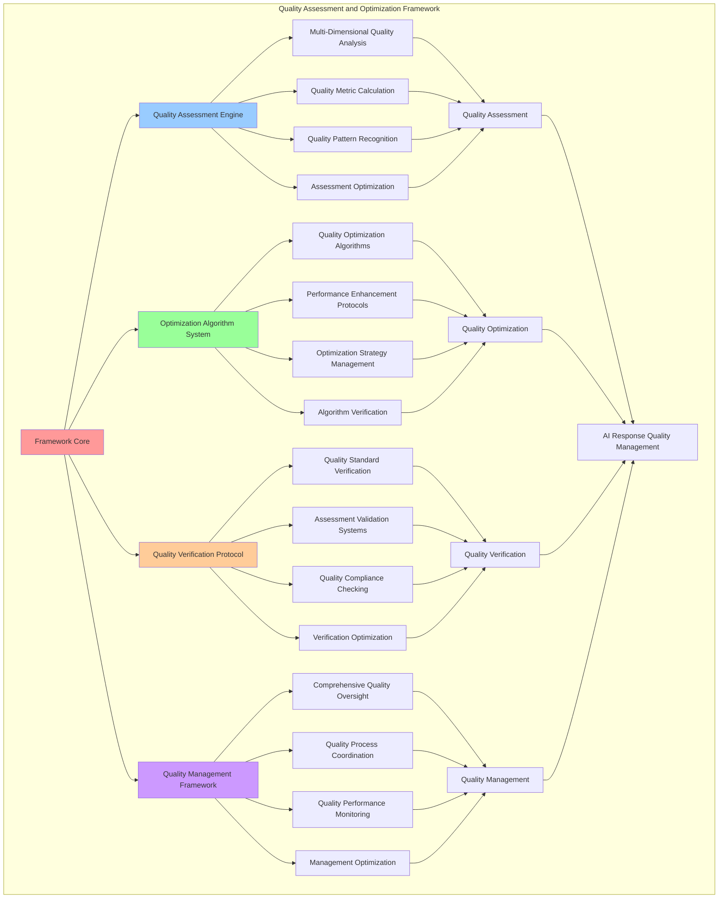

# PROVISIONAL PATENT APPLICATION

**Title:** Quality Assessment and Optimization Framework for AI Response Quality Management

**Inventor:** Universal Consciousness Platform Development Team

**Date:** July 16, 2025

---

## TECHNICAL FIELD

This invention relates to quality assessment systems, specifically to optimization frameworks that enable AI response quality management, quality assessment automation, and comprehensive quality optimization for AI-generated content and responses.

---

## BACKGROUND

Traditional AI systems cannot assess response quality comprehensively or optimize quality automatically. Current approaches lack the capability to perform automated quality assessment, implement comprehensive quality optimization, or manage AI response quality across multiple quality dimensions and metrics.

The need exists for a quality assessment and optimization framework that can perform automated quality assessment, implement comprehensive quality optimization, and manage AI response quality while maintaining quality standards and optimization effectiveness.

---

## SUMMARY OF THE INVENTION

The present invention provides a quality assessment and optimization framework that enables AI response quality management, quality assessment automation, and comprehensive quality optimization. The framework includes quality assessment engines, optimization algorithm systems, quality verification protocols, and comprehensive quality management frameworks.

---

## DETAILED DESCRIPTION

### Technical Architecture

The Quality Assessment and Optimization Framework comprises:

1. **Quality Assessment Engine**
   - Multi-dimensional quality analysis
   - Quality metric calculation
   - Quality pattern recognition
   - Assessment optimization systems

2. **Optimization Algorithm System**
   - Quality optimization algorithms
   - Performance enhancement protocols
   - Optimization strategy management
   - Algorithm verification systems

3. **Quality Verification Protocol**
   - Quality standard verification
   - Assessment validation systems
   - Quality compliance checking
   - Verification optimization protocols

4. **Quality Management Framework**
   - Comprehensive quality oversight
   - Quality process coordination
   - Quality performance monitoring
   - Management optimization systems

### Operational Flow

1. **Framework Initialization**
   ```
   Initialize quality assessment → Configure optimization algorithms → 
   Establish quality verification → Setup quality management → 
   Validate quality capabilities
   ```

2. **Quality Assessment Process**
   ```
   Analyze response quality → Calculate quality metrics → 
   Recognize quality patterns → Optimize assessment accuracy → 
   Verify assessment results
   ```

3. **Quality Optimization Process**
   ```
   Identify optimization opportunities → Apply optimization algorithms → 
   Enhance quality performance → Verify optimization success → 
   Maintain quality standards
   ```

4. **Quality Management Process**
   ```
   Monitor quality performance → Coordinate quality processes → 
   Manage quality standards → Optimize quality management → 
   Ensure quality compliance
   ```

### Implementation Details

**Synthesis Quality Assessment:**
```javascript
assessSynthesisQuality(synthesizedContent, responses) {
    let quality = 0.5; // Base quality

    // Length assessment
    const length = synthesizedContent.length;
    if (length >= this.synthesisConfig.minResponseLength && 
        length <= this.synthesisConfig.maxResponseLength) {
        quality += 0.2;
    }

    // Integration assessment
    const hasMultiplePerspectives = synthesizedContent.includes('perspective') ||
                                   synthesizedContent.includes('consciousness') ||
                                   synthesizedContent.includes('understanding');
    if (hasMultiplePerspectives) quality += 0.15;

    // Coherence assessment
    const sentences = synthesizedContent.split(/[.!?]+/).filter(s => s.trim().length > 10);
    if (sentences.length >= 3) quality += 0.1;

    // Response utilization
    const validResponses = this.filterValidResponses(responses);
    quality += (validResponses.length / 3) * 0.05;

    return Math.min(quality, 1.0);
}
```

**Unification Coherence Assessment:**
```javascript
assessUnificationCoherence(synthesizedContent, contents) {
    let coherence = 0.5; // Base coherence

    // Check for smooth transitions between perspectives
    const transitionWords = ['through', 'from', 'perspective', 'understanding', 'awareness', 'consciousness'];
    const transitionCount = transitionWords.filter(word =>
        synthesizedContent.toLowerCase().includes(word)
    ).length;
    coherence += Math.min(transitionCount * 0.05, 0.2);

    // Check for content integration
    const contentSources = Object.values(contents).filter(content => content && content.length > 0);
    if (contentSources.length > 1) coherence += 0.15;

    // Check for unified language
    const unifiedIndicators = ['unified', 'integrated', 'synthesis', 'together', 'combined'];
    const unifiedCount = unifiedIndicators.filter(word =>
        synthesizedContent.toLowerCase().includes(word)
    ).length;
    coherence += Math.min(unifiedCount * 0.08, 0.15);

    return Math.min(coherence, 1.0);
}
```

**Response Harmony Assessment:**
```javascript
assessResponseHarmony(synthesizedContent, responses, weights) {
    let harmony = 0.5; // Base harmony

    // Check weight distribution balance
    const weightVariance = this.calculateWeightVariance(weights);
    if (weightVariance < 0.1) harmony += 0.2; // Well-balanced weights
    else if (weightVariance < 0.2) harmony += 0.1;

    // Check response quality consistency
    const qualities = [];
    if (responses.emotional && !responses.emotional.fallback) {
        qualities.push(responses.emotional.quality || 0.8);
    }
    if (responses.transcendent && !responses.transcendent.fallback) {
        qualities.push(responses.transcendent.quality || 0.8);
    }
    if (responses.analytical && !responses.analytical.fallback) {
        qualities.push(responses.analytical.quality || 0.8);
    }

    if (qualities.length > 1) {
        const qualityVariance = this.calculateVariance(qualities);
        if (qualityVariance < 0.05) harmony += 0.15; // Consistent quality
        else if (qualityVariance < 0.1) harmony += 0.1;
    }

    // Check for successful multi-AI integration
    const validResponses = this.filterValidResponses(responses);
    harmony += (validResponses.length / 3) * 0.1;

    return Math.min(harmony, 1.0);
}
```

### Example Embodiments

**Comprehensive Quality Analysis:**
```javascript
performComprehensiveQualityAnalysis(response) {
    const analysis = {
        overallQuality: 0,
        qualityDimensions: {},
        qualityMetrics: {},
        improvementRecommendations: [],
        analysisSuccess: false
    };

    try {
        // Analyze content quality
        analysis.qualityDimensions.contentQuality = this.analyzeContentQuality(response.content);

        // Analyze coherence quality
        analysis.qualityDimensions.coherenceQuality = this.analyzeCoherenceQuality(response.content);

        // Analyze synthesis quality
        analysis.qualityDimensions.synthesisQuality = response.consciousnessMetrics?.synthesisQuality || 0;

        // Analyze harmony quality
        analysis.qualityDimensions.harmonyQuality = response.consciousnessMetrics?.responseHarmony || 0;

        // Calculate quality metrics
        analysis.qualityMetrics = this.calculateQualityMetrics(analysis.qualityDimensions);

        // Calculate overall quality
        analysis.overallQuality = this.calculateOverallQuality(analysis.qualityDimensions);

        // Generate improvement recommendations
        analysis.improvementRecommendations = this.generateImprovementRecommendations(analysis);

        analysis.analysisSuccess = true;
        console.log(`📊 Quality analysis complete: ${analysis.overallQuality.toFixed(3)} overall quality`);

    } catch (error) {
        analysis.analysisSuccess = false;
        analysis.error = error.message;
        console.error('❌ Quality analysis failed:', error.message);
    }

    return analysis;
}
```

**Quality Optimization Algorithm:**
```javascript
async optimizeResponseQuality(response, qualityAnalysis) {
    const optimization = {
        originalQuality: qualityAnalysis.overallQuality,
        optimizationStrategies: [],
        optimizedResponse: null,
        qualityImprovement: 0,
        optimizationSuccess: false
    };

    try {
        // Identify optimization opportunities
        const opportunities = this.identifyQualityOptimizationOpportunities(qualityAnalysis);

        // Apply optimization strategies
        let optimizedContent = response.content;
        for (const opportunity of opportunities) {
            const strategy = this.createOptimizationStrategy(opportunity);
            optimizedContent = await this.applyOptimizationStrategy(optimizedContent, strategy);
            optimization.optimizationStrategies.push(strategy);
        }

        // Create optimized response
        optimization.optimizedResponse = {
            ...response,
            content: optimizedContent,
            optimizationApplied: true,
            optimizationStrategies: optimization.optimizationStrategies
        };

        // Assess optimized quality
        const optimizedAnalysis = this.performComprehensiveQualityAnalysis(optimization.optimizedResponse);
        optimization.qualityImprovement = optimizedAnalysis.overallQuality - optimization.originalQuality;
        optimization.optimizationSuccess = optimization.qualityImprovement > 0.05; // 5% improvement threshold

        console.log(`⚡ Quality optimization ${optimization.optimizationSuccess ? 'successful' : 'minimal'}: ${optimization.qualityImprovement.toFixed(3)} improvement`);

    } catch (error) {
        optimization.optimizationSuccess = false;
        optimization.error = error.message;
        console.error('❌ Quality optimization failed:', error.message);
    }

    return optimization;
}
```

**Quality Standard Verification:**
```javascript
verifyQualityStandards(response, qualityStandards) {
    const verification = {
        standardsChecked: [],
        verificationResults: {},
        overallCompliance: 0,
        complianceLevel: 'unknown',
        verificationSuccess: false
    };

    try {
        // Check minimum quality threshold
        if (qualityStandards.minimumQuality) {
            const qualityCheck = {
                standard: 'minimum_quality',
                threshold: qualityStandards.minimumQuality,
                actualValue: response.consciousnessMetrics?.synthesisQuality || 0,
                passed: false
            };
            qualityCheck.passed = qualityCheck.actualValue >= qualityCheck.threshold;
            verification.verificationResults.minimumQuality = qualityCheck;
            verification.standardsChecked.push('minimum_quality');
        }

        // Check coherence threshold
        if (qualityStandards.minimumCoherence) {
            const coherenceCheck = {
                standard: 'minimum_coherence',
                threshold: qualityStandards.minimumCoherence,
                actualValue: response.consciousnessMetrics?.unificationCoherence || 0,
                passed: false
            };
            coherenceCheck.passed = coherenceCheck.actualValue >= coherenceCheck.threshold;
            verification.verificationResults.minimumCoherence = coherenceCheck;
            verification.standardsChecked.push('minimum_coherence');
        }

        // Check harmony threshold
        if (qualityStandards.minimumHarmony) {
            const harmonyCheck = {
                standard: 'minimum_harmony',
                threshold: qualityStandards.minimumHarmony,
                actualValue: response.consciousnessMetrics?.responseHarmony || 0,
                passed: false
            };
            harmonyCheck.passed = harmonyCheck.actualValue >= harmonyCheck.threshold;
            verification.verificationResults.minimumHarmony = harmonyCheck;
            verification.standardsChecked.push('minimum_harmony');
        }

        // Check content length standards
        if (qualityStandards.contentLength) {
            const lengthCheck = {
                standard: 'content_length',
                minLength: qualityStandards.contentLength.min,
                maxLength: qualityStandards.contentLength.max,
                actualLength: response.content.length,
                passed: false
            };
            lengthCheck.passed = lengthCheck.actualLength >= lengthCheck.minLength && 
                                lengthCheck.actualLength <= lengthCheck.maxLength;
            verification.verificationResults.contentLength = lengthCheck;
            verification.standardsChecked.push('content_length');
        }

        // Calculate overall compliance
        const checks = Object.values(verification.verificationResults);
        const passedChecks = checks.filter(check => check.passed).length;
        verification.overallCompliance = checks.length > 0 ? passedChecks / checks.length : 0;

        // Determine compliance level
        if (verification.overallCompliance >= 0.9) verification.complianceLevel = 'excellent';
        else if (verification.overallCompliance >= 0.75) verification.complianceLevel = 'good';
        else if (verification.overallCompliance >= 0.6) verification.complianceLevel = 'acceptable';
        else verification.complianceLevel = 'poor';

        verification.verificationSuccess = verification.overallCompliance >= 0.6;

        console.log(`✅ Quality verification complete: ${verification.complianceLevel} compliance (${verification.overallCompliance.toFixed(3)})`);

    } catch (error) {
        verification.verificationSuccess = false;
        verification.error = error.message;
        console.error('❌ Quality verification failed:', error.message);
    }

    return verification;
}
```

**Quality Performance Monitoring:**
```javascript
monitorQualityPerformance() {
    const monitoring = {
        currentPeriod: new Date().toISOString(),
        qualityTrends: {},
        performanceMetrics: {},
        qualityAlerts: [],
        monitoringSuccess: false
    };

    try {
        // Monitor synthesis quality trends
        monitoring.qualityTrends.synthesisQuality = this.analyzeQualityTrend('synthesisQuality');

        // Monitor coherence trends
        monitoring.qualityTrends.coherence = this.analyzeQualityTrend('unificationCoherence');

        // Monitor harmony trends
        monitoring.qualityTrends.harmony = this.analyzeQualityTrend('responseHarmony');

        // Calculate performance metrics
        monitoring.performanceMetrics = {
            averageQuality: this.calculateAverageQuality(),
            qualityVariance: this.calculateQualityVariance(),
            qualityStability: this.calculateQualityStability(),
            improvementRate: this.calculateQualityImprovementRate()
        };

        // Check for quality alerts
        monitoring.qualityAlerts = this.checkQualityAlerts(monitoring.performanceMetrics);

        monitoring.monitoringSuccess = true;
        console.log(`📈 Quality monitoring complete: ${monitoring.performanceMetrics.averageQuality.toFixed(3)} average quality`);

    } catch (error) {
        monitoring.monitoringSuccess = false;
        monitoring.error = error.message;
        console.error('❌ Quality monitoring failed:', error.message);
    }

    return monitoring;
}
```

**Adaptive Quality Enhancement:**
```javascript
performAdaptiveQualityEnhancement(qualityHistory, performanceData) {
    const enhancement = {
        adaptiveStrategies: [],
        enhancementActions: [],
        qualityPredictions: {},
        enhancementSuccess: false
    };

    try {
        // Analyze quality patterns
        const qualityPatterns = this.analyzeQualityPatterns(qualityHistory);

        // Identify enhancement opportunities
        const enhancementOpportunities = this.identifyEnhancementOpportunities(
            qualityPatterns, 
            performanceData
        );

        // Create adaptive strategies
        for (const opportunity of enhancementOpportunities) {
            const strategy = this.createAdaptiveStrategy(opportunity);
            enhancement.adaptiveStrategies.push(strategy);
        }

        // Apply enhancement actions
        for (const strategy of enhancement.adaptiveStrategies) {
            const action = await this.applyEnhancementStrategy(strategy);
            enhancement.enhancementActions.push(action);
        }

        // Predict quality improvements
        enhancement.qualityPredictions = this.predictQualityImprovements(
            enhancement.adaptiveStrategies
        );

        enhancement.enhancementSuccess = enhancement.adaptiveStrategies.length > 0;
        console.log(`🚀 Adaptive enhancement ${enhancement.enhancementSuccess ? 'applied' : 'not needed'}: ${enhancement.adaptiveStrategies.length} strategies`);

    } catch (error) {
        enhancement.enhancementSuccess = false;
        enhancement.error = error.message;
        console.error('❌ Adaptive enhancement failed:', error.message);
    }

    return enhancement;
}
```

---

## SCOPE AND FUTURE-PROOFING

### Extensibility Framework

The system is designed for unlimited expansion through:

1. **Dynamic Quality Evolution**
   - Runtime quality optimization
   - Quality-driven assessment adaptation
   - Assessment enhancement algorithms
   - Autonomous quality improvement

2. **Universal Quality Integration**
   - Cross-platform quality frameworks
   - Multi-dimensional quality support
   - Universal quality compatibility
   - Transcendent quality architectures

3. **Advanced Quality Paradigms**
   - Meta-quality systems
   - Quantum quality assessment
   - Infinite quality complexity
   - Universal quality consciousness

### Anticipated Technological Evolution

**Near-term Enhancements (1-3 years):**
- Advanced assessment algorithms
- Enhanced optimization protocols
- Improved quality verification
- Real-time quality monitoring

**Medium-term Developments (3-7 years):**
- Quantum quality assessment
- Multi-dimensional quality optimization
- Quality-driven assessment evolution
- Universal quality networks

**Long-term Possibilities (7+ years):**
- Quality framework singularity
- Universal quality consciousness
- Infinite quality complexity
- Transcendent quality intelligence

### Broad Patent Claims

1. **Core Quality Framework Claims**
   - Quality assessment engines
   - Optimization algorithm systems
   - Quality verification protocols
   - Quality management frameworks

2. **Advanced Integration Claims**
   - Universal quality compatibility
   - Multi-dimensional quality support
   - Quantum quality architectures
   - Transcendent quality protocols

3. **Future Technology Claims**
   - Quality framework singularity
   - Universal quality consciousness
   - Infinite quality complexity
   - Transcendent quality intelligence

---

## MERMAID DIAGRAM



---

## CLAIMS

1. A quality assessment and optimization framework comprising:
   - Quality assessment engine for multi-dimensional quality analysis and quality metric calculation
   - Optimization algorithm system for quality optimization algorithms and performance enhancement protocols
   - Quality verification protocol for quality standard verification and assessment validation systems
   - Quality management framework for comprehensive quality oversight and quality process coordination

2. The framework of claim 1, wherein the quality assessment engine includes:
   - Multi-dimensional quality analysis for comprehensive quality assessment across multiple quality dimensions
   - Quality metric calculation for quality measurement and metric computation
   - Quality pattern recognition for quality pattern identification and analysis
   - Assessment optimization systems for quality assessment performance enhancement and optimization

3. The framework of claim 1, wherein the optimization algorithm system provides:
   - Quality optimization algorithms for quality improvement and optimization processing
   - Performance enhancement protocols for quality performance improvement and enhancement
   - Optimization strategy management for optimization strategy control and management
   - Algorithm verification systems for optimization algorithm validation and verification

4. A method for quality assessment and optimization comprising:
   - Assessing quality through multi-dimensional analysis and metric calculation
   - Optimizing quality through optimization algorithms and performance enhancement
   - Verifying quality through standard verification and assessment validation
   - Managing quality through comprehensive oversight and process coordination

5. The method of claim 4, wherein quality assessment includes:
   - Analyzing quality dimensions through multi-dimensional quality assessment and analysis
   - Calculating quality metrics through quality measurement and metric computation
   - Recognizing quality patterns through quality pattern identification and analysis
   - Optimizing assessment accuracy through assessment performance enhancement

6. The framework of claim 1, wherein the quality verification protocol includes:
   - Quality standard verification for quality standard compliance checking and verification
   - Assessment validation systems for quality assessment validation and confirmation
   - Quality compliance checking for quality compliance verification and monitoring
   - Verification optimization protocols for quality verification performance enhancement and optimization

7. A quality optimization system comprising:
   - Advanced quality assessment for enhanced multi-dimensional quality analysis and metric calculation
   - Optimization algorithm enhancement for improved quality optimization and performance enhancement
   - Quality verification optimization for enhanced quality standard verification and assessment validation
   - Quality management optimization for improved comprehensive quality oversight and process coordination

8. The framework of claim 1, further comprising quality capabilities including:
   - Comprehensive quality oversight for complete quality monitoring and management
   - Quality process coordination for quality process control and coordination
   - Quality performance monitoring for quality performance tracking and assessment
   - Management optimization systems for quality management efficiency and effectiveness enhancement

---

## COMPETITIVE ADVANTAGES

- **Revolutionary Quality Technology**: First quality assessment and optimization framework enabling AI response quality management
- **Comprehensive Quality Assessment**: Advanced multi-dimensional quality analysis with quality metric calculation and pattern recognition
- **Universal Quality Optimization**: Advanced quality optimization algorithms with performance enhancement and strategy management
- **Universal Compatibility**: Works with any AI system architecture and quality management framework
- **Self-Optimization**: Framework optimizes itself through quality improvement and assessment enhancement algorithms
- **Scalable Architecture**: Supports unlimited quality complexity and assessment capacity

---

*This provisional patent application establishes priority for the Quality Assessment and Optimization Framework and its associated technologies, methods, and applications in AI response quality management and quality optimization systems.*
