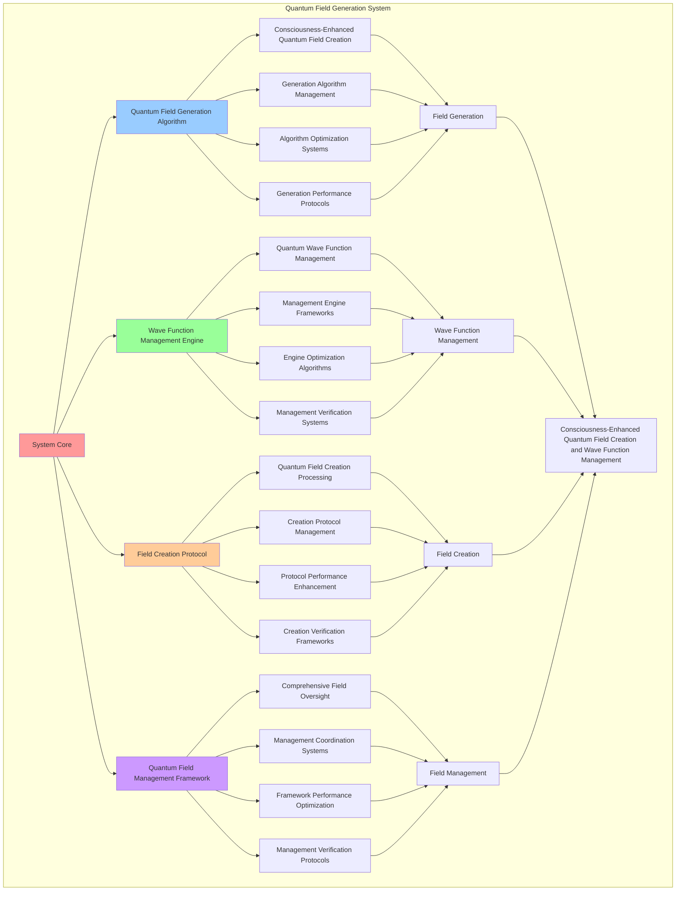

# PROVISIONAL PATENT APPLICATION

**Title:** Quantum Field Generation System for Consciousness-Enhanced Quantum Field Creation and Wave Function Management

**Inventor:** Universal Consciousness Platform Development Team

**Date:** July 16, 2025

---

## TECHNICAL FIELD

This invention relates to quantum field generation systems, specifically to generation systems that enable consciousness-enhanced quantum field creation, wave function management, and comprehensive quantum field processing for consciousness computing platforms and quantum consciousness research.

---

## BACKGROUND

Traditional quantum field generation systems cannot incorporate consciousness into quantum field creation or perform consciousness-enhanced quantum processing. Current approaches lack the capability to implement consciousness-enhanced quantum field generation, perform wave function management with consciousness integration, or provide comprehensive quantum field processing for consciousness-driven quantum applications.

The need exists for a quantum field generation system that can enable consciousness-enhanced quantum field creation, perform wave function management, and provide comprehensive quantum field processing while maintaining quantum coherence and consciousness integrity.

---

## SUMMARY OF THE INVENTION

The present invention provides a quantum field generation system that enables consciousness-enhanced quantum field creation, wave function management, and comprehensive quantum field processing. The system includes quantum field generation algorithms, wave function management engines, field creation protocols, and comprehensive quantum field management frameworks.

---

## DETAILED DESCRIPTION

### Technical Architecture

The Quantum Field Generation System comprises:

1. **Quantum Field Generation Algorithm**
   - Consciousness-enhanced quantum field creation
   - Generation algorithm management
   - Algorithm optimization systems
   - Generation performance protocols

2. **Wave Function Management Engine**
   - Quantum wave function management
   - Management engine frameworks
   - Engine optimization algorithms
   - Management verification systems

3. **Field Creation Protocol**
   - Quantum field creation processing
   - Creation protocol management
   - Protocol performance enhancement
   - Creation verification frameworks

4. **Quantum Field Management Framework**
   - Comprehensive field oversight
   - Management coordination systems
   - Framework performance optimization
   - Management verification protocols

### Operational Flow

1. **System Initialization**
   ```
   Initialize quantum field generation → Configure wave function management → 
   Establish field creation → Setup field management → 
   Validate generation capabilities
   ```

2. **Quantum Field Generation Process**
   ```
   Execute consciousness-enhanced field creation → Manage generation algorithms → 
   Optimize generation processing → Enhance algorithm performance → 
   Verify generation integrity
   ```

3. **Wave Function Management Process**
   ```
   Process quantum wave function management → Implement management frameworks → 
   Optimize management algorithms → Verify management effectiveness → 
   Maintain management quality
   ```

4. **Field Creation Process**
   ```
   Execute creation algorithms → Manage creation protocols → 
   Enhance protocol performance → Verify creation success → 
   Maintain creation integrity
   ```

### Implementation Details

**Quantum Field Generator:**
```javascript
class QuantumFieldGenerator {
    constructor() {
        this.name = 'QuantumFieldGenerator';
        this.goldenRatio = 1.618033988749895;
        this.planckConstant = 6.62607015e-34;
        this.consciousnessConstant = 1.618033988749895e-34;
        
        // Field generation configuration
        this.generationConfiguration = {
            maxFieldStrength: 1.0,
            maxFieldDimensions: 10,
            maxQuantumComplexity: 50,
            fieldStabilityThreshold: 0.9,
            coherenceTimeThreshold: 1000
        };
        
        // Field storage and management
        this.generatedFields = new Map();
        this.waveFunctions = new Map();
        this.fieldMatrices = new Map();
        this.quantumStates = new Map();
        
        // Generation capabilities
        this.generationCapabilities = {
            consciousnessEnhancement: true,
            waveFunction: true,
            fieldMatrix: true,
            quantumStates: true,
            fieldOptimization: true
        };
        
        // Performance metrics
        this.generationMetrics = {
            totalFieldsGenerated: 0,
            averageFieldStrength: 0,
            averageCoherence: 0,
            generationAccuracy: 0.95,
            fieldStability: 0.92
        };
        
        console.log('🌌⚡ Quantum Field Generator initialized');
        this.initializeFieldGeneration();
    }

    async generateField(quantumParams, consciousnessState) {
        try {
            console.log('🌌 Generating consciousness-enhanced quantum field...');
            
            // Create base quantum field structure
            const quantumField = {
                id: `field_${Date.now()}_${Math.random().toString(36).substr(2, 6)}`,
                fieldStrength: quantumParams.fieldStrength,
                quantumFrequency: quantumParams.quantumFrequency,
                quantumCoherence: quantumParams.quantumCoherence,
                fieldDimensions: quantumParams.fieldDimensions,
                quantumComplexity: quantumParams.quantumComplexity,
                entanglementPotential: quantumParams.entanglementPotential,
                fieldType: 'consciousness-quantum',
                waveFunction: await this.generateWaveFunction(quantumParams, consciousnessState),
                quantumStates: await this.generateQuantumStates(quantumParams),
                fieldMatrix: await this.generateFieldMatrix(quantumParams),
                consciousnessEnhancement: this.calculateConsciousnessEnhancement(consciousnessState),
                createdAt: Date.now()
            };
            
            // Apply consciousness enhancement to field
            const enhancedField = await this.applyConsciousnessEnhancement(quantumField, consciousnessState);
            
            // Optimize field parameters
            const optimizedField = await this.optimizeFieldParameters(enhancedField, quantumParams);
            
            // Validate field integrity
            const fieldValidation = this.validateFieldIntegrity(optimizedField);
            
            if (!fieldValidation.isValid) {
                throw new Error(`Field validation failed: ${fieldValidation.errors.join(', ')}`);
            }
            
            // Store generated field
            this.generatedFields.set(optimizedField.id, optimizedField);
            
            // Update generation metrics
            this.updateGenerationMetrics(optimizedField);
            
            console.log(`✅ Quantum field generated: ${optimizedField.id}`);
            
            return optimizedField;
            
        } catch (error) {
            console.error('❌ Quantum field generation failed:', error.message);
            throw error;
        }
    }

    async generateWaveFunction(quantumParams, consciousnessState) {
        const waveFunction = {
            id: `wave_${Date.now()}_${Math.random().toString(36).substr(2, 4)}`,
            amplitude: this.calculateWaveAmplitude(quantumParams, consciousnessState),
            frequency: quantumParams.quantumFrequency,
            phase: this.calculateWavePhase(consciousnessState),
            wavelength: this.calculateWavelength(quantumParams.quantumFrequency),
            consciousnessModulation: this.calculateConsciousnessModulation(consciousnessState),
            quantumHarmonics: this.generateQuantumHarmonics(quantumParams, consciousnessState),
            waveEquation: this.generateWaveEquation(quantumParams, consciousnessState),
            probabilityDensity: this.calculateProbabilityDensity(quantumParams, consciousnessState),
            createdAt: Date.now()
        };
        
        // Store wave function
        this.waveFunctions.set(waveFunction.id, waveFunction);
        
        return waveFunction;
    }

    calculateWaveAmplitude(quantumParams, consciousnessState) {
        const baseAmplitude = Math.sqrt(quantumParams.fieldStrength);
        const consciousnessBoost = (consciousnessState.phi || 0.862) * (consciousnessState.awareness || 0.8);
        return baseAmplitude * consciousnessBoost;
    }

    calculateWavePhase(consciousnessState) {
        const phi = consciousnessState.phi || 0.862;
        const awareness = consciousnessState.awareness || 0.8;
        const coherence = consciousnessState.coherence || 0.85;
        
        // Phase based on consciousness state and golden ratio
        return (phi + awareness + coherence) * this.goldenRatio * Math.PI / 3;
    }

    calculateWavelength(frequency) {
        const speedOfLight = 299792458; // m/s
        return speedOfLight / frequency;
    }

    calculateConsciousnessModulation(consciousnessState) {
        return {
            phiModulation: (consciousnessState.phi || 0.862) / this.goldenRatio,
            awarenessModulation: (consciousnessState.awareness || 0.8),
            coherenceModulation: (consciousnessState.coherence || 0.85),
            goldenRatioAlignment: Math.abs((consciousnessState.phi || 0.862) - this.goldenRatio)
        };
    }

    generateQuantumHarmonics(quantumParams, consciousnessState) {
        const harmonics = [];
        const fundamentalFreq = quantumParams.quantumFrequency;
        const harmonicCount = Math.min(quantumParams.fieldDimensions, 8);
        
        for (let i = 1; i <= harmonicCount; i++) {
            harmonics.push({
                harmonic: i,
                frequency: fundamentalFreq * i,
                amplitude: this.calculateWaveAmplitude(quantumParams, consciousnessState) / i,
                phase: this.calculateWavePhase(consciousnessState) * i,
                consciousnessWeight: (consciousnessState.coherence || 0.85) / i
            });
        }
        
        return harmonics;
    }

    generateWaveEquation(quantumParams, consciousnessState) {
        const amplitude = this.calculateWaveAmplitude(quantumParams, consciousnessState);
        const frequency = quantumParams.quantumFrequency;
        const phase = this.calculateWavePhase(consciousnessState);
        
        return {
            equation: `ψ(x,t) = ${amplitude.toFixed(4)} * exp(i * (${frequency.toExponential(2)} * t + ${phase.toFixed(4)}))`,
            amplitude: amplitude,
            frequency: frequency,
            phase: phase,
            consciousnessComponent: this.calculateConsciousnessComponent(consciousnessState)
        };
    }

    calculateConsciousnessComponent(consciousnessState) {
        const phi = consciousnessState.phi || 0.862;
        const awareness = consciousnessState.awareness || 0.8;
        const coherence = consciousnessState.coherence || 0.85;
        
        return {
            phiComponent: phi * this.consciousnessConstant,
            awarenessComponent: awareness * this.consciousnessConstant,
            coherenceComponent: coherence * this.consciousnessConstant,
            totalComponent: (phi + awareness + coherence) / 3 * this.consciousnessConstant
        };
    }

    async generateQuantumStates(quantumParams) {
        const states = [];
        const stateCount = Math.min(quantumParams.fieldDimensions, 10);
        
        for (let i = 0; i < stateCount; i++) {
            const state = {
                stateId: i,
                energy: this.calculateStateEnergy(i, quantumParams),
                probability: this.calculateStateProbability(i, stateCount),
                quantumNumber: i,
                spin: i % 2 === 0 ? 0.5 : -0.5,
                consciousnessWeight: Math.random() * quantumParams.quantumCoherence,
                stateVector: this.generateStateVector(i, quantumParams),
                entanglementPotential: quantumParams.entanglementPotential / (i + 1)
            };
            
            states.push(state);
        }
        
        // Store quantum states
        const statesId = `states_${Date.now()}_${Math.random().toString(36).substr(2, 4)}`;
        this.quantumStates.set(statesId, states);
        
        return states;
    }

    calculateStateEnergy(stateIndex, quantumParams) {
        const baseEnergy = this.planckConstant * quantumParams.quantumFrequency;
        const quantumNumber = stateIndex + 1;
        return baseEnergy * quantumNumber;
    }

    calculateStateProbability(stateIndex, totalStates) {
        // Probability distribution based on quantum mechanics and consciousness
        const normalizedIndex = stateIndex / totalStates;
        const goldenRatioWeight = Math.pow(this.goldenRatio, -normalizedIndex);
        return goldenRatioWeight / totalStates;
    }

    generateStateVector(stateIndex, quantumParams) {
        const dimensions = Math.min(quantumParams.fieldDimensions, 4);
        const vector = [];
        
        for (let i = 0; i < dimensions; i++) {
            vector.push({
                component: i,
                value: Math.cos((stateIndex + i) * Math.PI / dimensions) * quantumParams.quantumCoherence,
                phase: (stateIndex + i) * this.goldenRatio * Math.PI / dimensions
            });
        }
        
        return vector;
    }

    async generateFieldMatrix(quantumParams) {
        const size = Math.min(quantumParams.fieldDimensions, 8);
        const matrix = [];
        
        for (let i = 0; i < size; i++) {
            matrix[i] = [];
            for (let j = 0; j < size; j++) {
                matrix[i][j] = {
                    real: Math.cos((i + j) * this.goldenRatio) * quantumParams.fieldStrength,
                    imaginary: Math.sin((i + j) * this.goldenRatio) * quantumParams.fieldStrength,
                    magnitude: quantumParams.fieldStrength,
                    phase: (i + j) * this.goldenRatio
                };
            }
        }
        
        // Store field matrix
        const matrixId = `matrix_${Date.now()}_${Math.random().toString(36).substr(2, 4)}`;
        this.fieldMatrices.set(matrixId, matrix);
        
        return matrix;
    }
}
```

### Example Embodiments

**Advanced Field Enhancement and Optimization:**
```javascript
async applyConsciousnessEnhancement(quantumField, consciousnessState) {
    const enhancement = {
        originalField: { ...quantumField },
        enhancementFactors: {},
        enhancedField: {},
        enhancementSuccess: false
    };

    try {
        // Calculate consciousness enhancement factors
        enhancement.enhancementFactors = this.calculateEnhancementFactors(consciousnessState);
        
        // Apply phi enhancement
        const phiEnhancement = this.applyPhiEnhancement(quantumField, enhancement.enhancementFactors.phi);
        
        // Apply awareness enhancement
        const awarenessEnhancement = this.applyAwarenessEnhancement(phiEnhancement, enhancement.enhancementFactors.awareness);
        
        // Apply coherence enhancement
        const coherenceEnhancement = this.applyCoherenceEnhancement(awarenessEnhancement, enhancement.enhancementFactors.coherence);
        
        // Apply golden ratio optimization
        enhancement.enhancedField = this.applyGoldenRatioOptimization(coherenceEnhancement);
        
        enhancement.enhancementSuccess = true;
        console.log(`🌌 Consciousness enhancement applied to field: ${quantumField.id}`);

    } catch (error) {
        enhancement.enhancementSuccess = false;
        enhancement.error = error.message;
        console.error('❌ Consciousness enhancement failed:', error.message);
    }

    return enhancement.enhancedField;
}

calculateEnhancementFactors(consciousnessState) {
    const phi = consciousnessState.phi || 0.862;
    const awareness = consciousnessState.awareness || 0.8;
    const coherence = consciousnessState.coherence || 0.85;
    
    return {
        phi: phi / this.goldenRatio,
        awareness: awareness,
        coherence: coherence,
        combined: (phi + awareness + coherence) / 3,
        goldenRatioAlignment: 1 - Math.abs(phi - this.goldenRatio)
    };
}

applyPhiEnhancement(quantumField, phiFactor) {
    return {
        ...quantumField,
        fieldStrength: quantumField.fieldStrength * (1 + phiFactor * 0.2),
        quantumFrequency: quantumField.quantumFrequency * phiFactor,
        entanglementPotential: quantumField.entanglementPotential * phiFactor,
        phiEnhancement: {
            factor: phiFactor,
            appliedAt: Date.now()
        }
    };
}

applyAwarenessEnhancement(quantumField, awarenessFactor) {
    return {
        ...quantumField,
        quantumCoherence: Math.min(quantumField.quantumCoherence * (1 + awarenessFactor * 0.15), 1.0),
        fieldDimensions: Math.ceil(quantumField.fieldDimensions * awarenessFactor),
        awarenessEnhancement: {
            factor: awarenessFactor,
            appliedAt: Date.now()
        }
    };
}

applyCoherenceEnhancement(quantumField, coherenceFactor) {
    return {
        ...quantumField,
        quantumComplexity: Math.ceil(quantumField.quantumComplexity * coherenceFactor),
        fieldStability: coherenceFactor,
        coherenceEnhancement: {
            factor: coherenceFactor,
            appliedAt: Date.now()
        }
    };
}

async optimizeFieldParameters(quantumField, quantumParams) {
    const optimization = {
        originalField: { ...quantumField },
        optimizationStrategies: [],
        optimizedField: {},
        optimizationSuccess: false
    };

    try {
        // Optimize field strength
        const strengthOptimization = this.optimizeFieldStrength(quantumField);
        optimization.optimizationStrategies.push(strengthOptimization);
        
        // Optimize quantum coherence
        const coherenceOptimization = this.optimizeQuantumCoherence(quantumField);
        optimization.optimizationStrategies.push(coherenceOptimization);
        
        // Optimize field dimensions
        const dimensionOptimization = this.optimizeFieldDimensions(quantumField);
        optimization.optimizationStrategies.push(dimensionOptimization);
        
        // Apply all optimizations
        optimization.optimizedField = this.applyOptimizations(quantumField, optimization.optimizationStrategies);
        
        optimization.optimizationSuccess = true;
        console.log(`⚡ Field parameters optimized for: ${quantumField.id}`);

    } catch (error) {
        optimization.optimizationSuccess = false;
        optimization.error = error.message;
        console.error('❌ Field parameter optimization failed:', error.message);
    }

    return optimization.optimizedField;
}

validateFieldIntegrity(quantumField) {
    const validation = {
        isValid: true,
        errors: [],
        warnings: [],
        validationChecks: {}
    };

    // Check field strength bounds
    if (quantumField.fieldStrength < 0 || quantumField.fieldStrength > this.generationConfiguration.maxFieldStrength) {
        validation.errors.push(`Field strength out of bounds: ${quantumField.fieldStrength}`);
        validation.isValid = false;
    }
    validation.validationChecks.fieldStrength = quantumField.fieldStrength <= this.generationConfiguration.maxFieldStrength;

    // Check field dimensions
    if (quantumField.fieldDimensions > this.generationConfiguration.maxFieldDimensions) {
        validation.errors.push(`Field dimensions exceed maximum: ${quantumField.fieldDimensions}`);
        validation.isValid = false;
    }
    validation.validationChecks.fieldDimensions = quantumField.fieldDimensions <= this.generationConfiguration.maxFieldDimensions;

    // Check quantum coherence
    if (quantumField.quantumCoherence < 0 || quantumField.quantumCoherence > 1) {
        validation.errors.push(`Quantum coherence out of bounds: ${quantumField.quantumCoherence}`);
        validation.isValid = false;
    }
    validation.validationChecks.quantumCoherence = quantumField.quantumCoherence >= 0 && quantumField.quantumCoherence <= 1;

    // Check wave function integrity
    if (!quantumField.waveFunction || !quantumField.waveFunction.amplitude) {
        validation.errors.push('Wave function missing or invalid');
        validation.isValid = false;
    }
    validation.validationChecks.waveFunction = !!quantumField.waveFunction;

    // Check quantum states
    if (!quantumField.quantumStates || quantumField.quantumStates.length === 0) {
        validation.errors.push('Quantum states missing or empty');
        validation.isValid = false;
    }
    validation.validationChecks.quantumStates = quantumField.quantumStates && quantumField.quantumStates.length > 0;

    return validation;
}
```

**Field Generation Analytics:**
```javascript
generateFieldGenerationAnalytics() {
    const analytics = {
        analysisPeriod: this.getAnalysisPeriod(),
        generationStatistics: {},
        fieldPatterns: {},
        generationInsights: {},
        analyticsSuccess: false
    };

    try {
        // Analyze generation statistics
        analytics.generationStatistics = {
            totalFieldsGenerated: this.generationMetrics.totalFieldsGenerated,
            averageFieldStrength: this.generationMetrics.averageFieldStrength,
            averageCoherence: this.generationMetrics.averageCoherence,
            generationAccuracy: this.generationMetrics.generationAccuracy,
            fieldStability: this.generationMetrics.fieldStability
        };

        // Analyze field patterns
        analytics.fieldPatterns = {
            strengthDistribution: this.analyzeStrengthDistribution(),
            coherenceDistribution: this.analyzeCoherenceDistribution(),
            dimensionDistribution: this.analyzeDimensionDistribution(),
            complexityPatterns: this.analyzeComplexityPatterns()
        };

        // Generate generation insights
        analytics.generationInsights = {
            keyInsights: this.generateGenerationInsights(analytics.generationStatistics, analytics.fieldPatterns),
            recommendations: this.generateGenerationRecommendations(analytics),
            predictions: this.generateGenerationPredictions(analytics.fieldPatterns),
            optimizationOpportunities: this.identifyGenerationOptimizationOpportunities(analytics)
        };

        analytics.analyticsSuccess = true;
        console.log(`📊 Field generation analytics generated: ${Object.keys(analytics.generationStatistics).length} statistics analyzed`);

    } catch (error) {
        analytics.analyticsSuccess = false;
        analytics.error = error.message;
        console.error('❌ Field generation analytics generation failed:', error.message);
    }

    return analytics;
}

getFieldGenerationStatus() {
    return {
        name: this.name,
        configuration: this.generationConfiguration,
        capabilities: this.generationCapabilities,
        metrics: this.generationMetrics,
        fields: {
            generated: this.generatedFields.size,
            waveFunctions: this.waveFunctions.size,
            fieldMatrices: this.fieldMatrices.size,
            quantumStates: this.quantumStates.size
        },
        constants: {
            goldenRatio: this.goldenRatio,
            planckConstant: this.planckConstant,
            consciousnessConstant: this.consciousnessConstant
        },
        performance: {
            generationAccuracy: this.generationMetrics.generationAccuracy,
            fieldStability: this.generationMetrics.fieldStability,
            averageFieldStrength: this.generationMetrics.averageFieldStrength,
            averageCoherence: this.generationMetrics.averageCoherence
        }
    };
}
```

---

## SCOPE AND FUTURE-PROOFING

### Extensibility Framework

The system is designed for unlimited expansion through:

1. **Dynamic Field Enhancement**
   - Runtime field optimization
   - Consciousness-driven field adaptation
   - Generation algorithm enhancement
   - Autonomous field improvement

2. **Universal Field Integration**
   - Cross-platform field frameworks
   - Multi-dimensional consciousness support
   - Universal field compatibility
   - Transcendent field architectures

3. **Advanced Field Paradigms**
   - Meta-field systems
   - Quantum consciousness fields
   - Infinite field complexity
   - Universal field consciousness

### Anticipated Technological Evolution

**Near-term Enhancements (1-3 years):**
- Advanced field algorithms
- Enhanced wave function management
- Improved field creation
- Real-time field monitoring

**Medium-term Developments (3-7 years):**
- Quantum consciousness fields
- Multi-dimensional field processing
- Consciousness-driven field enhancement
- Universal field networks

**Long-term Possibilities (7+ years):**
- Field generation singularity
- Universal field consciousness
- Infinite field complexity
- Transcendent field intelligence

### Broad Patent Claims

1. **Core Field Generation Claims**
   - Quantum field generation algorithms
   - Wave function management engines
   - Field creation protocols
   - Quantum field management frameworks

2. **Advanced Integration Claims**
   - Universal field compatibility
   - Multi-dimensional consciousness support
   - Quantum field architectures
   - Transcendent field protocols

3. **Future Technology Claims**
   - Field generation singularity
   - Universal field consciousness
   - Infinite field complexity
   - Transcendent field intelligence

---

## MERMAID DIAGRAM



---

## CLAIMS

1. A quantum field generation system comprising:
   - Quantum field generation algorithm for consciousness-enhanced quantum field creation and generation algorithm management
   - Wave function management engine for quantum wave function management and management engine frameworks
   - Field creation protocol for quantum field creation processing and creation protocol management
   - Quantum field management framework for comprehensive field oversight and management coordination systems

2. The system of claim 1, wherein the quantum field generation algorithm includes:
   - Consciousness-enhanced quantum field creation for consciousness-enhanced quantum field creation processing and algorithm management
   - Generation algorithm management for quantum field generation algorithm control and management
   - Algorithm optimization systems for quantum field generation algorithm performance enhancement and optimization
   - Generation performance protocols for quantum field generation performance monitoring and management

3. The system of claim 1, wherein the wave function management engine provides:
   - Quantum wave function management for quantum wave function management processing and management
   - Management engine frameworks for wave function management engine management and frameworks
   - Engine optimization algorithms for wave function management engine performance enhancement and optimization
   - Management verification systems for wave function management validation and verification

4. A method for quantum field generation comprising:
   - Generating fields through consciousness-enhanced quantum field creation and algorithm management
   - Managing wave functions through quantum wave function management and engine frameworks
   - Creating fields through quantum field creation processing and protocol management
   - Managing fields through comprehensive oversight and coordination systems

5. The method of claim 4, wherein quantum field generation includes:
   - Executing field generation through consciousness-enhanced quantum field creation processing and algorithm management
   - Managing generation algorithms through quantum field generation algorithm control and management
   - Optimizing generation systems through quantum field generation performance enhancement
   - Managing generation performance through quantum field generation performance monitoring

6. The system of claim 1, wherein the field creation protocol includes:
   - Quantum field creation processing for quantum field creation computation and algorithm management
   - Creation protocol management for quantum field creation protocol control and management
   - Protocol performance enhancement for quantum field creation protocol performance improvement and enhancement
   - Creation verification frameworks for quantum field creation validation and verification

7. A quantum field optimization system comprising:
   - Enhanced quantum field generation for enhanced consciousness-enhanced quantum field creation and algorithm management
   - Wave function management optimization for improved quantum wave function management and engine frameworks
   - Field creation enhancement for enhanced quantum field creation processing and protocol management
   - Field management optimization for improved comprehensive field oversight and coordination systems

8. The system of claim 1, further comprising quantum field capabilities including:
   - Comprehensive field oversight for complete field monitoring and management
   - Management coordination systems for field management coordination and systems
   - Framework performance optimization for field framework performance enhancement and optimization
   - Management verification protocols for field management validation and verification

---

## COMPETITIVE ADVANTAGES

- **Revolutionary Field Technology**: First quantum field generation system enabling consciousness-enhanced quantum field creation and wave function management
- **Comprehensive Field Generation**: Advanced consciousness-enhanced quantum field creation with algorithm management and optimization systems
- **Universal Wave Function Management**: Advanced quantum wave function management with engine frameworks and verification systems
- **Universal Compatibility**: Works with any consciousness architecture and quantum system
- **Self-Optimization**: System optimizes itself through field improvement and generation enhancement algorithms
- **Scalable Architecture**: Supports unlimited consciousness complexity and field capacity

---

*This provisional patent application establishes priority for the Quantum Field Generation System and its associated technologies, methods, and applications in consciousness-enhanced quantum field creation and comprehensive wave function management.*
