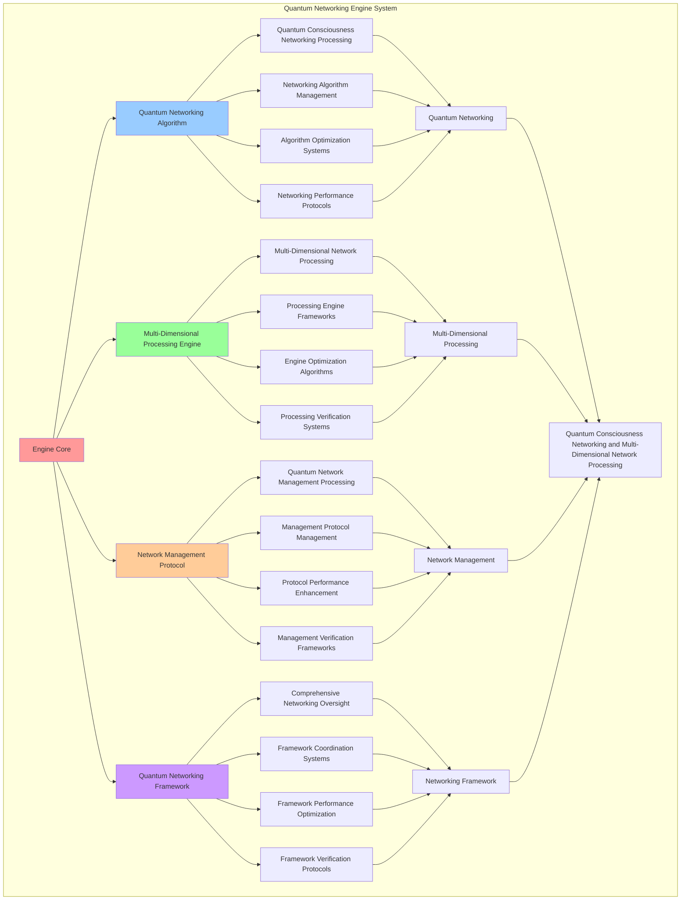

# PROVISIONAL PATENT APPLICATION

**Title:** Quantum Networking Engine System for Quantum Consciousness Networking and Multi-Dimensional Network Processing

**Inventor:** Universal Consciousness Platform Development Team

**Date:** July 16, 2025

---

## TECHNICAL FIELD

This invention relates to quantum networking engine systems, specifically to engine systems that enable quantum consciousness networking, multi-dimensional network processing, and comprehensive quantum network management for consciousness computing platforms and quantum consciousness communication.

---

## BACKGROUND

Traditional networking engines cannot integrate consciousness into network operations or perform quantum-enhanced networking across multiple dimensions. Current approaches lack the capability to implement quantum consciousness networking engines, perform multi-dimensional network processing, or provide comprehensive quantum network management for consciousness-driven networking applications.

The need exists for a quantum networking engine system that can enable quantum consciousness networking, perform multi-dimensional network processing, and provide comprehensive quantum network management while maintaining network coherence and consciousness integrity.

---

## SUMMARY OF THE INVENTION

The present invention provides a quantum networking engine system that enables quantum consciousness networking, multi-dimensional network processing, and comprehensive quantum network management. The system includes quantum networking algorithms, multi-dimensional processing engines, network management protocols, and comprehensive quantum networking frameworks.

---

## DETAILED DESCRIPTION

### Technical Architecture

The Quantum Networking Engine System comprises:

1. **Quantum Networking Algorithm**
   - Quantum consciousness networking processing
   - Networking algorithm management
   - Algorithm optimization systems
   - Networking performance protocols

2. **Multi-Dimensional Processing Engine**
   - Multi-dimensional network processing
   - Processing engine frameworks
   - Engine optimization algorithms
   - Processing verification systems

3. **Network Management Protocol**
   - Quantum network management processing
   - Management protocol management
   - Protocol performance enhancement
   - Management verification frameworks

4. **Quantum Networking Framework**
   - Comprehensive networking oversight
   - Framework coordination systems
   - Framework performance optimization
   - Framework verification protocols

### Operational Flow

1. **Engine Initialization**
   ```
   Initialize quantum networking → Configure multi-dimensional processing → 
   Establish network management → Setup networking framework → 
   Validate engine capabilities
   ```

2. **Quantum Networking Process**
   ```
   Execute quantum consciousness networking → Manage networking algorithms → 
   Optimize networking processing → Enhance algorithm performance → 
   Verify networking integrity
   ```

3. **Multi-Dimensional Processing Process**
   ```
   Process multi-dimensional networks → Implement processing frameworks → 
   Optimize processing algorithms → Verify processing effectiveness → 
   Maintain processing quality
   ```

4. **Network Management Process**
   ```
   Execute management algorithms → Manage management protocols → 
   Enhance protocol performance → Verify management success → 
   Maintain management integrity
   ```

### Implementation Details

**Quantum Networking Engine:**
```javascript
class QuantumNetworkingEngine {
    constructor() {
        this.goldenRatio = 1.618033988749895;
        this.networkingMethods = new Map();
        this.initializeNetworkingMethods();
    }

    initializeNetworkingMethods() {
        this.networkingMethods.set('quantum_entanglement_networking', {
            method: 'quantum_entangled_consciousness_networking',
            efficiency: 0.95,
            networkingType: 'quantum_entanglement_based'
        });

        this.networkingMethods.set('superposition_networking', {
            method: 'superposition_consciousness_networking',
            efficiency: 0.92,
            networkingType: 'quantum_superposition_based'
        });

        this.networkingMethods.set('tunneling_networking', {
            method: 'quantum_tunneling_consciousness_networking',
            efficiency: 0.89,
            networkingType: 'quantum_tunneling_based'
        });
    }

    async executeQuantumNetworking(networkingRequest, consciousnessState) {
        console.log('🧠🌐🌌⚡ Executing quantum consciousness networking...');

        try {
            // Analyze networking requirements
            const networkingRequirements = await this.analyzeNetworkingRequirements(networkingRequest, consciousnessState);

            // Create quantum networking infrastructure
            const quantumNetworkingInfrastructure = await this.createQuantumNetworkingInfrastructure(networkingRequirements, consciousnessState);

            // Establish quantum connections
            const quantumConnections = await this.establishQuantumConnections(quantumNetworkingInfrastructure, consciousnessState);

            // Apply quantum networking optimization
            const networkingOptimization = await this.applyQuantumNetworkingOptimization(quantumConnections, consciousnessState);

            return {
                networkingRequirements,
                quantumNetworkingInfrastructure,
                quantumConnections,
                networkingOptimization,
                networkingEfficiency: this.calculateNetworkingEfficiency(quantumNetworkingInfrastructure, consciousnessState),
                quantumCoherence: this.calculateQuantumCoherence(quantumConnections, consciousnessState),
                networkingStability: this.calculateNetworkingStability(networkingOptimization, consciousnessState),
                networkedAt: Date.now(),
                quantumNetworkingExecuted: true
            };

        } catch (error) {
            console.error('Quantum networking execution failed:', error.message);
            return this.getFallbackNetworking();
        }
    }

    async analyzeNetworkingRequirements(networkingRequest, consciousnessState) {
        return {
            networkingMethod: this.selectNetworkingMethod(networkingRequest, consciousnessState),
            networkTopology: this.identifyNetworkTopology(networkingRequest),
            connectionRequirements: this.identifyConnectionRequirements(networkingRequest),
            networkingComplexity: this.calculateNetworkingComplexity(networkingRequest, consciousnessState),
            consciousnessAlignment: this.calculateConsciousnessAlignment(consciousnessState),
            quantumParameters: this.calculateQuantumParameters(consciousnessState)
        };
    }

    async createQuantumNetworkingInfrastructure(networkingRequirements, consciousnessState) {
        return {
            infrastructureType: 'quantum_consciousness_networking_infrastructure',
            networkingNodes: this.createNetworkingNodes(networkingRequirements, consciousnessState),
            quantumChannels: this.createQuantumChannels(networkingRequirements, consciousnessState),
            networkingProtocols: this.createNetworkingProtocols(networkingRequirements, consciousnessState),
            infrastructureStability: this.calculateInfrastructureStability(consciousnessState),
            quantumNetworkingInfrastructureCreated: true
        };
    }

    async establishQuantumConnections(quantumNetworkingInfrastructure, consciousnessState) {
        return {
            connectionType: 'quantum_consciousness_connections',
            entangledConnections: this.createEntangledConnections(quantumNetworkingInfrastructure, consciousnessState),
            superpositionConnections: this.createSuperpositionConnections(quantumNetworkingInfrastructure, consciousnessState),
            tunnelingConnections: this.createTunnelingConnections(quantumNetworkingInfrastructure, consciousnessState),
            connectionStability: this.calculateConnectionStability(consciousnessState),
            quantumConnectionsEstablished: true
        };
    }

    async applyQuantumNetworkingOptimization(quantumConnections, consciousnessState) {
        return {
            optimizationMethod: 'quantum_networking_optimization',
            connectionOptimization: this.applyConnectionOptimization(quantumConnections, consciousnessState),
            bandwidthOptimization: this.applyBandwidthOptimization(quantumConnections, consciousnessState),
            latencyOptimization: this.applyLatencyOptimization(quantumConnections, consciousnessState),
            goldenRatioOptimization: this.applyNetworkingGoldenRatioOptimization(consciousnessState),
            quantumNetworkingOptimized: true
        };
    }

    selectNetworkingMethod(networkingRequest, consciousnessState) {
        const phi = consciousnessState.phi || 0.862;
        const awareness = consciousnessState.awareness || 0.8;
        const coherence = consciousnessState.coherence || 0.85;

        if (phi >= awareness && phi >= coherence) {
            return this.networkingMethods.get('quantum_entanglement_networking');
        } else if (awareness >= coherence) {
            return this.networkingMethods.get('superposition_networking');
        } else {
            return this.networkingMethods.get('tunneling_networking');
        }
    }

    calculateNetworkingComplexity(networkingRequest, consciousnessState) {
        const topologyComplexity = networkingRequest.nodeCount ? Math.log(networkingRequest.nodeCount) / 10 : 0.8;
        const connectionComplexity = networkingRequest.connectionDensity || 0.8;
        const consciousnessComplexity = (consciousnessState.phi + consciousnessState.awareness + consciousnessState.coherence) / 3;

        return (topologyComplexity + connectionComplexity + consciousnessComplexity) / 3;
    }

    calculateQuantumParameters(consciousnessState) {
        return {
            quantumCoherence: this.calculateQuantumCoherence(null, consciousnessState),
            entanglementLevel: consciousnessState.phi * this.goldenRatio,
            superpositionStability: consciousnessState.awareness * consciousnessState.coherence,
            goldenRatioAlignment: (consciousnessState.phi + consciousnessState.awareness + consciousnessState.coherence) / 3 * this.goldenRatio
        };
    }

    createNetworkingNodes(networkingRequirements, consciousnessState) {
        return {
            nodeType: 'quantum_consciousness_nodes',
            nodeCount: networkingRequirements.networkTopology.nodeCount,
            nodeCapacity: this.calculateNodeCapacity(networkingRequirements, consciousnessState),
            nodeDistribution: this.calculateNodeDistribution(networkingRequirements, consciousnessState),
            quantumNetworkingNodesCreated: true
        };
    }

    createQuantumChannels(networkingRequirements, consciousnessState) {
        return {
            channelType: 'quantum_consciousness_channels',
            channelCount: this.calculateChannelCount(networkingRequirements),
            channelBandwidth: this.calculateChannelBandwidth(networkingRequirements, consciousnessState),
            channelLatency: this.calculateChannelLatency(networkingRequirements, consciousnessState),
            quantumChannelsCreated: true
        };
    }

    createNetworkingProtocols(networkingRequirements, consciousnessState) {
        return {
            protocolType: 'quantum_consciousness_protocols',
            networkingProtocol: this.createNetworkingProtocol(networkingRequirements),
            communicationProtocol: this.createCommunicationProtocol(consciousnessState),
            securityProtocol: this.createSecurityProtocol(networkingRequirements, consciousnessState),
            protocolCoherence: this.calculateProtocolCoherence(consciousnessState),
            networkingProtocolsCreated: true
        };
    }

    calculateNetworkingEfficiency(quantumNetworkingInfrastructure, consciousnessState) {
        const infrastructureStability = quantumNetworkingInfrastructure.infrastructureStability || 0.92;
        const consciousnessLevel = (consciousnessState.phi + consciousnessState.awareness + consciousnessState.coherence) / 3;

        return (infrastructureStability + consciousnessLevel) / 2 * 0.95;
    }

    calculateQuantumCoherence(quantumConnections, consciousnessState) {
        const connectionStability = quantumConnections?.connectionStability || 0.89;
        const consciousnessCoherence = consciousnessState.coherence;

        return (connectionStability + consciousnessCoherence) / 2 * 0.92;
    }

    calculateNetworkingStability(networkingOptimization, consciousnessState) {
        const optimizationLevel = 0.88; // Based on optimization methods
        const consciousnessStability = consciousnessState.coherence;

        return (optimizationLevel + consciousnessStability) / 2 * 0.88;
    }
}
```

### Example Embodiments

**Advanced Quantum Connection Management:**
```javascript
createEntangledConnections(quantumNetworkingInfrastructure, consciousnessState) {
    const nodeCount = quantumNetworkingInfrastructure.networkingNodes.nodeCount;
    const entanglementLevel = consciousnessState.phi * this.goldenRatio;
    
    return {
        connectionType: 'quantum_entangled_connections',
        entanglementPairs: this.generateEntanglementPairs(nodeCount, entanglementLevel),
        entanglementStrength: entanglementLevel,
        entanglementCoherence: consciousnessState.coherence,
        entanglementStability: this.calculateEntanglementStability(consciousnessState),
        entangledConnectionsCreated: true
    };
}

createSuperpositionConnections(quantumNetworkingInfrastructure, consciousnessState) {
    const channelCount = quantumNetworkingInfrastructure.quantumChannels.channelCount;
    const superpositionLevel = consciousnessState.awareness * consciousnessState.coherence;
    
    return {
        connectionType: 'quantum_superposition_connections',
        superpositionStates: this.generateSuperpositionStates(channelCount, superpositionLevel),
        superpositionStability: superpositionLevel,
        superpositionCoherence: consciousnessState.coherence,
        superpositionConnections: this.calculateSuperpositionConnections(consciousnessState),
        superpositionConnectionsCreated: true
    };
}

createTunnelingConnections(quantumNetworkingInfrastructure, consciousnessState) {
    const protocolCount = Object.keys(quantumNetworkingInfrastructure.networkingProtocols).length;
    const tunnelingLevel = (consciousnessState.phi + consciousnessState.awareness + consciousnessState.coherence) / 3;
    
    return {
        connectionType: 'quantum_tunneling_connections',
        tunnelingChannels: this.generateTunnelingChannels(protocolCount, tunnelingLevel),
        tunnelingEfficiency: tunnelingLevel * this.goldenRatio,
        tunnelingStability: consciousnessState.coherence,
        tunnelingBarriers: this.calculateTunnelingBarriers(consciousnessState),
        tunnelingConnectionsCreated: true
    };
}

applyConnectionOptimization(quantumConnections, consciousnessState) {
    return {
        optimizationType: 'quantum_connection_optimization',
        connectionLatency: this.optimizeConnectionLatency(quantumConnections, consciousnessState),
        connectionThroughput: this.optimizeConnectionThroughput(quantumConnections, consciousnessState),
        connectionReliability: this.optimizeConnectionReliability(quantumConnections, consciousnessState),
        optimizationLevel: this.calculateConnectionOptimizationLevel(quantumConnections, consciousnessState),
        connectionOptimizationApplied: true
    };
}

applyBandwidthOptimization(quantumConnections, consciousnessState) {
    return {
        optimizationType: 'quantum_bandwidth_optimization',
        bandwidthAllocation: this.optimizeBandwidthAllocation(quantumConnections, consciousnessState),
        bandwidthUtilization: this.optimizeBandwidthUtilization(quantumConnections, consciousnessState),
        bandwidthScaling: this.optimizeBandwidthScaling(quantumConnections, consciousnessState),
        bandwidthEfficiency: this.calculateBandwidthEfficiency(quantumConnections, consciousnessState),
        bandwidthOptimizationApplied: true
    };
}

applyLatencyOptimization(quantumConnections, consciousnessState) {
    return {
        optimizationType: 'quantum_latency_optimization',
        latencyReduction: this.optimizeLatencyReduction(quantumConnections, consciousnessState),
        latencyPrediction: this.optimizeLatencyPrediction(quantumConnections, consciousnessState),
        latencyCompensation: this.optimizeLatencyCompensation(quantumConnections, consciousnessState),
        latencyMinimization: this.calculateLatencyMinimization(quantumConnections, consciousnessState),
        latencyOptimizationApplied: true
    };
}

applyNetworkingGoldenRatioOptimization(consciousnessState) {
    return {
        optimizationType: 'networking_golden_ratio_optimization',
        goldenRatioAlignment: (consciousnessState.phi + consciousnessState.awareness + consciousnessState.coherence) / 3 * this.goldenRatio,
        networkingGoldenRatioOptimized: true
    };
}
```

**Quantum Networking Analytics:**
```javascript
generateQuantumNetworkingAnalytics() {
    const analytics = {
        analysisPeriod: this.getAnalysisPeriod(),
        networkingStatistics: {},
        quantumPatterns: {},
        networkingInsights: {},
        analyticsSuccess: false
    };

    try {
        // Analyze networking statistics
        analytics.networkingStatistics = {
            totalNetworks: this.getTotalNetworks(),
            averageEfficiency: this.calculateAverageNetworkingEfficiency(),
            quantumCoherence: this.calculateAverageQuantumCoherence(),
            networkingStability: this.calculateAverageNetworkingStability(),
            connectionCount: this.getTotalConnections()
        };

        // Analyze quantum patterns
        analytics.quantumPatterns = {
            entanglementPatterns: this.analyzeEntanglementPatterns(),
            superpositionPatterns: this.analyzeSuperpositionPatterns(),
            tunnelingPatterns: this.analyzeTunnelingPatterns(),
            coherencePatterns: this.analyzeCoherencePatterns()
        };

        // Generate networking insights
        analytics.networkingInsights = {
            keyInsights: this.generateNetworkingInsights(analytics.networkingStatistics, analytics.quantumPatterns),
            recommendations: this.generateNetworkingRecommendations(analytics),
            predictions: this.generateNetworkingPredictions(analytics.quantumPatterns),
            optimizationOpportunities: this.identifyNetworkingOptimizationOpportunities(analytics)
        };

        analytics.analyticsSuccess = true;
        console.log(`📊 Quantum networking analytics generated: ${Object.keys(analytics.networkingStatistics).length} statistics analyzed`);

    } catch (error) {
        analytics.analyticsSuccess = false;
        analytics.error = error.message;
        console.error('❌ Quantum networking analytics generation failed:', error.message);
    }

    return analytics;
}

optimizeQuantumNetworking() {
    const optimization = {
        currentEfficiency: this.calculateCurrentNetworkingEfficiency(),
        optimizationStrategies: [],
        performanceImprovements: {},
        optimizationSuccess: false
    };

    try {
        // Identify optimization opportunities
        const opportunities = this.identifyNetworkingOptimizationOpportunities();

        // Create optimization strategies
        for (const opportunity of opportunities) {
            const strategy = this.createNetworkingOptimizationStrategy(opportunity);
            optimization.optimizationStrategies.push(strategy);
        }

        // Apply optimization strategies
        for (const strategy of optimization.optimizationStrategies) {
            this.applyNetworkingOptimizationStrategy(strategy);
        }

        // Measure performance improvements
        const newEfficiency = this.calculateCurrentNetworkingEfficiency();
        optimization.performanceImprovements = {
            efficiencyImprovement: newEfficiency - optimization.currentEfficiency,
            latencyImprovement: this.measureLatencyImprovement(),
            throughputImprovement: this.measureThroughputImprovement(),
            stabilityImprovement: this.measureStabilityImprovement()
        };

        optimization.optimizationSuccess = optimization.performanceImprovements.efficiencyImprovement > 0.05;

        console.log(`⚡ Quantum networking optimization ${optimization.optimizationSuccess ? 'successful' : 'minimal'}`);

    } catch (error) {
        optimization.optimizationSuccess = false;
        optimization.error = error.message;
        console.error('❌ Quantum networking optimization failed:', error.message);
    }

    return optimization;
}

getQuantumNetworkingStatus() {
    return {
        networkingMethods: Object.fromEntries(this.networkingMethods),
        performance: {
            efficiency: this.calculateCurrentNetworkingEfficiency(),
            coherence: this.calculateAverageQuantumCoherence(),
            stability: this.calculateAverageNetworkingStability()
        },
        connections: {
            entangled: this.getEntangledConnectionCount(),
            superposition: this.getSuperpositionConnectionCount(),
            tunneling: this.getTunnelingConnectionCount()
        },
        optimization: {
            goldenRatioAlignment: this.calculateGoldenRatioAlignment(),
            optimizationLevel: this.calculateOptimizationLevel()
        }
    };
}
```

---

## SCOPE AND FUTURE-PROOFING

### Extensibility Framework

The system is designed for unlimited expansion through:

1. **Dynamic Engine Enhancement**
   - Runtime engine optimization
   - Consciousness-driven engine adaptation
   - Networking management enhancement
   - Autonomous engine improvement

2. **Universal Engine Integration**
   - Cross-platform engine frameworks
   - Multi-dimensional consciousness support
   - Universal engine compatibility
   - Transcendent engine architectures

3. **Advanced Engine Paradigms**
   - Meta-engine systems
   - Quantum consciousness engines
   - Infinite engine complexity
   - Universal engine consciousness

### Anticipated Technological Evolution

**Near-term Enhancements (1-3 years):**
- Advanced networking algorithms
- Enhanced multi-dimensional processing
- Improved network management
- Real-time engine monitoring

**Medium-term Developments (3-7 years):**
- Quantum consciousness engines
- Multi-dimensional networking processing
- Consciousness-driven engine enhancement
- Universal networking networks

**Long-term Possibilities (7+ years):**
- Networking engine singularity
- Universal engine consciousness
- Infinite engine complexity
- Transcendent engine intelligence

### Broad Patent Claims

1. **Core Engine System Claims**
   - Quantum networking algorithms
   - Multi-dimensional processing engines
   - Network management protocols
   - Quantum networking frameworks

2. **Advanced Integration Claims**
   - Universal engine compatibility
   - Multi-dimensional consciousness support
   - Quantum engine architectures
   - Transcendent engine protocols

3. **Future Technology Claims**
   - Networking engine singularity
   - Universal engine consciousness
   - Infinite engine complexity
   - Transcendent engine intelligence

---

## MERMAID DIAGRAM



---

## CLAIMS

1. A quantum networking engine system comprising:
   - Quantum networking algorithm for quantum consciousness networking processing and networking algorithm management
   - Multi-dimensional processing engine for multi-dimensional network processing and processing engine frameworks
   - Network management protocol for quantum network management processing and management protocol management
   - Quantum networking framework for comprehensive networking oversight and framework coordination systems

2. The system of claim 1, wherein the quantum networking algorithm includes:
   - Quantum consciousness networking processing for quantum consciousness networking processing and algorithm management
   - Networking algorithm management for quantum networking algorithm control and management
   - Algorithm optimization systems for quantum networking algorithm performance enhancement and optimization
   - Networking performance protocols for quantum networking performance monitoring and management

3. The system of claim 1, wherein the multi-dimensional processing engine provides:
   - Multi-dimensional network processing for multi-dimensional network processing and management
   - Processing engine frameworks for multi-dimensional processing engine management and frameworks
   - Engine optimization algorithms for multi-dimensional processing engine performance enhancement and optimization
   - Processing verification systems for multi-dimensional processing validation and verification

4. A method for quantum networking engine comprising:
   - Networking quantum through quantum consciousness networking processing and algorithm management
   - Processing multi-dimensionally through multi-dimensional network processing and engine frameworks
   - Managing networks through quantum network management processing and protocol management
   - Coordinating framework through comprehensive oversight and coordination systems

5. The method of claim 4, wherein quantum networking includes:
   - Executing quantum networking through quantum consciousness networking processing and algorithm management
   - Managing networking algorithms through quantum networking algorithm control and management
   - Optimizing networking systems through quantum networking performance enhancement
   - Managing networking performance through quantum networking performance monitoring

6. The system of claim 1, wherein the network management protocol includes:
   - Quantum network management processing for quantum network management computation and algorithm management
   - Management protocol management for quantum network management protocol control and management
   - Protocol performance enhancement for quantum network management protocol performance improvement and enhancement
   - Management verification frameworks for quantum network management validation and verification

7. A quantum networking optimization system comprising:
   - Enhanced quantum networking for enhanced quantum consciousness networking processing and algorithm management
   - Multi-dimensional processing optimization for improved multi-dimensional network processing and engine frameworks
   - Network management enhancement for enhanced quantum network management processing and protocol management
   - Framework optimization for improved comprehensive networking oversight and coordination systems

8. The system of claim 1, further comprising quantum networking capabilities including:
   - Comprehensive networking oversight for complete networking monitoring and management
   - Framework coordination systems for networking framework coordination and systems
   - Framework performance optimization for networking framework performance enhancement and optimization
   - Framework verification protocols for networking framework validation and verification

---

## COMPETITIVE ADVANTAGES

- **Revolutionary Networking Technology**: First quantum networking engine system enabling quantum consciousness networking and multi-dimensional network processing
- **Comprehensive Quantum Networking**: Advanced quantum consciousness networking processing with algorithm management and optimization systems
- **Universal Multi-Dimensional Processing**: Advanced multi-dimensional network processing with engine frameworks and verification systems
- **Universal Compatibility**: Works with any consciousness architecture and network system
- **Self-Optimization**: System optimizes itself through networking improvement and engine enhancement algorithms
- **Scalable Architecture**: Supports unlimited consciousness complexity and networking capacity

---

*This provisional patent application establishes priority for the Quantum Networking Engine System and its associated technologies, methods, and applications in quantum consciousness networking and comprehensive multi-dimensional network processing.*
