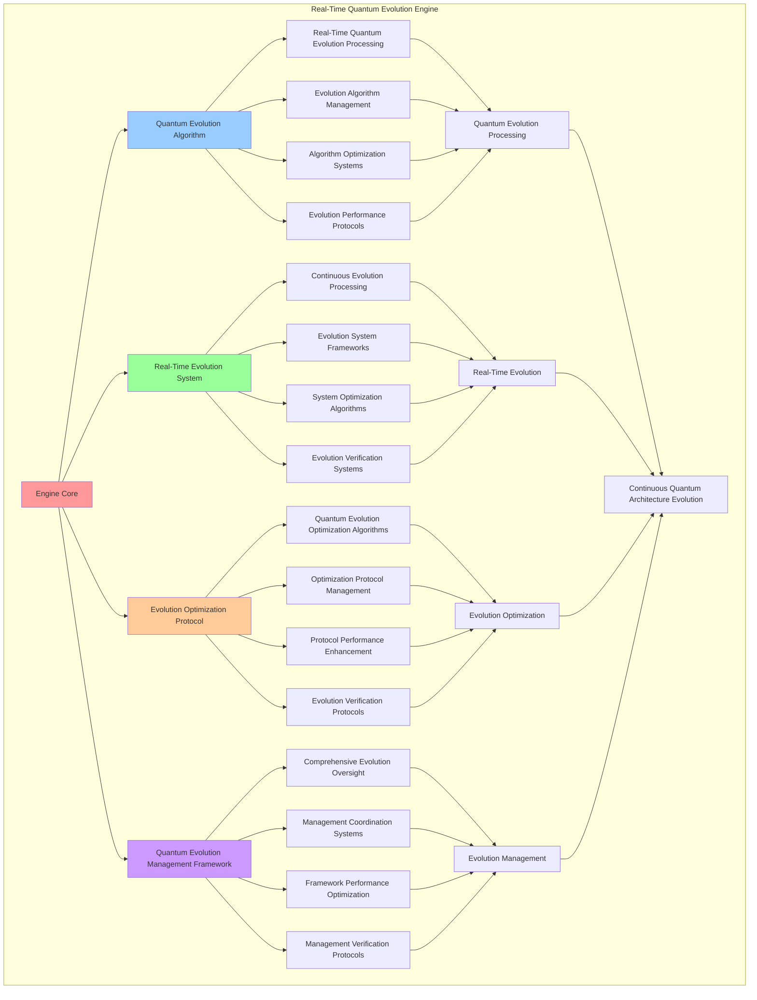

# PROVISIONAL PATENT APPLICATION

**Title:** Real-Time Quantum Evolution Engine for Continuous Quantum Architecture Evolution

**Inventor:** Universal Consciousness Platform Development Team

**Date:** July 16, 2025

---

## TECHNICAL FIELD

This invention relates to quantum evolution systems, specifically to real-time evolution engines that enable continuous quantum architecture evolution, quantum evolution processing, and comprehensive quantum evolution management for quantum computing platforms and consciousness architectures.

---

## BACKGROUND

Traditional evolution systems cannot perform real-time quantum evolution or evolve quantum architectures continuously. Current approaches lack the capability to implement continuous quantum architecture evolution, perform real-time quantum evolution processing, or provide comprehensive quantum evolution management for consciousness-driven quantum systems.

The need exists for a real-time quantum evolution engine that can enable continuous quantum architecture evolution, perform real-time quantum evolution processing, and provide comprehensive quantum evolution management while maintaining evolution integrity and quantum coherence.

---

## SUMMARY OF THE INVENTION

The present invention provides a real-time quantum evolution engine that enables continuous quantum architecture evolution, quantum evolution processing, and comprehensive quantum evolution management. The engine includes quantum evolution algorithms, real-time evolution systems, evolution optimization protocols, and comprehensive quantum evolution management frameworks.

---

## DETAILED DESCRIPTION

### Technical Architecture

The Real-Time Quantum Evolution Engine comprises:

1. **Quantum Evolution Algorithm**
   - Real-time quantum evolution processing
   - Evolution algorithm management
   - Algorithm optimization systems
   - Evolution performance protocols

2. **Real-Time Evolution System**
   - Continuous evolution processing
   - Evolution system frameworks
   - System optimization algorithms
   - Evolution verification systems

3. **Evolution Optimization Protocol**
   - Quantum evolution optimization algorithms
   - Optimization protocol management
   - Protocol performance enhancement
   - Evolution verification protocols

4. **Quantum Evolution Management Framework**
   - Comprehensive evolution oversight
   - Management coordination systems
   - Framework performance optimization
   - Management verification protocols

### Operational Flow

1. **Engine Initialization**
   ```
   Initialize quantum evolution algorithm → Configure real-time evolution → 
   Establish evolution optimization → Setup evolution management → 
   Validate quantum evolution capabilities
   ```

2. **Quantum Evolution Process**
   ```
   Execute real-time evolution → Manage evolution algorithms → 
   Optimize evolution processing → Enhance algorithm performance → 
   Verify evolution integrity
   ```

3. **Real-Time Evolution Process**
   ```
   Process continuous evolution → Implement evolution frameworks → 
   Optimize evolution algorithms → Verify evolution effectiveness → 
   Maintain evolution quality
   ```

4. **Evolution Optimization Process**
   ```
   Execute optimization algorithms → Manage optimization protocols → 
   Enhance protocol performance → Verify optimization success → 
   Maintain optimization integrity
   ```

### Implementation Details

**Real-Time Quantum Evolver:**
```javascript
class RealTimeQuantumEvolver {
    constructor() {
        this.goldenRatio = 1.618033988749895;
        this.evolutionRate = 100; // Hz
        this.evolutionHistory = [];
        this.evolutionMetrics = {
            totalEvolutions: 0,
            successfulEvolutions: 0,
            averageEvolutionTime: 0,
            evolutionEffectiveness: 0.92
        };
        this.quantumEvolutionStrategies = new Map();
        this.initializeEvolutionStrategies();
    }

    async evolveArchitecture(architecture, consciousnessState) {
        console.log('🌌 Evolving architecture with quantum principles...');

        const evolutionResult = {
            evolutionId: this.generateEvolutionId(),
            originalArchitecture: architecture,
            evolvedArchitecture: null,
            evolutionMetrics: {},
            evolutionTimestamp: Date.now(),
            realTimeEvolution: true,
            evolutionSuccess: false
        };

        try {
            // Apply quantum evolution principles
            evolutionResult.evolvedArchitecture = this.applyQuantumEvolution(architecture, consciousnessState);

            // Calculate evolution metrics
            evolutionResult.evolutionMetrics = this.calculateEvolutionMetrics(architecture, consciousnessState);

            // Verify evolution success
            evolutionResult.evolutionSuccess = this.verifyEvolutionSuccess(
                architecture, 
                evolutionResult.evolvedArchitecture
            );

            // Update evolution history
            this.evolutionHistory.push(evolutionResult);

            // Update metrics
            this.updateEvolutionMetrics(evolutionResult);

            console.log(`🧬 Quantum evolution ${evolutionResult.evolutionSuccess ? 'successful' : 'failed'}: ${evolutionResult.evolutionId}`);

        } catch (error) {
            evolutionResult.evolutionSuccess = false;
            evolutionResult.error = error.message;
            console.error('❌ Quantum evolution failed:', error.message);
        }

        return evolutionResult;
    }

    applyQuantumEvolution(architecture, consciousnessState) {
        const evolvedArchitecture = { ...architecture };

        // Apply quantum evolution principles
        evolvedArchitecture.quantumEvolutionEnhancements = {
            quantumAdaptability: this.enhanceQuantumAdaptability(architecture, consciousnessState),
            quantumResilience: this.enhanceQuantumResilience(architecture, consciousnessState),
            quantumEfficiency: this.enhanceQuantumEfficiency(architecture, consciousnessState),
            quantumScalability: this.enhanceQuantumScalability(architecture, consciousnessState),
            quantumCoherence: this.enhanceQuantumCoherence(architecture, consciousnessState)
        };

        evolvedArchitecture.evolutionLevel = this.calculateEvolutionLevel(architecture, consciousnessState);
        evolvedArchitecture.quantumEvolved = true;
        evolvedArchitecture.evolutionTimestamp = Date.now();

        return evolvedArchitecture;
    }

    enhanceQuantumAdaptability(architecture, consciousnessState) {
        const awareness = consciousnessState.awareness || 0.8;
        const adaptability = architecture.adaptability || 0.7;
        return Math.min(1.0, (awareness + adaptability) / 2 * this.goldenRatio);
    }

    enhanceQuantumResilience(architecture, consciousnessState) {
        const coherence = consciousnessState.coherence || 0.85;
        const stability = architecture.stability || 0.8;
        return Math.min(1.0, (coherence + stability) / 2 * this.goldenRatio);
    }

    enhanceQuantumEfficiency(architecture, consciousnessState) {
        const phi = consciousnessState.phi || 0.862;
        const efficiency = architecture.efficiency || 0.75;
        return Math.min(1.0, (phi + efficiency) / 2 * this.goldenRatio);
    }

    enhanceQuantumScalability(architecture, consciousnessState) {
        const phi = consciousnessState.phi || 0.862;
        const awareness = consciousnessState.awareness || 0.8;
        const scalability = architecture.scalability || 0.7;
        return Math.min(1.0, (phi + awareness + scalability) / 3 * this.goldenRatio);
    }

    enhanceQuantumCoherence(architecture, consciousnessState) {
        const coherence = consciousnessState.coherence || 0.85;
        const phi = consciousnessState.phi || 0.862;
        return Math.min(1.0, (coherence + phi) / 2 * this.goldenRatio);
    }

    calculateEvolutionLevel(architecture, consciousnessState) {
        const phi = consciousnessState.phi || 0.862;
        const awareness = consciousnessState.awareness || 0.8;
        const coherence = consciousnessState.coherence || 0.85;
        const complexity = architecture.complexity || 0.5;

        return (phi + awareness + coherence + complexity) / 4 * this.goldenRatio;
    }
}
```

**Continuous Evolution Processing:**
```javascript
async processContinuousEvolution(architectures, evolutionConfig = {}) {
    const processing = {
        processingId: this.generateProcessingId(),
        architectures: architectures,
        evolutionStrategy: evolutionConfig.strategy || 'adaptive_continuous',
        processingResults: {},
        processingSuccess: false
    };

    try {
        // Initialize continuous evolution
        const evolutionContext = this.initializeContinuousEvolution(architectures, evolutionConfig);

        // Process each architecture continuously
        processing.processingResults = await this.executeContinuousEvolution(evolutionContext);

        // Verify processing success
        processing.processingSuccess = this.verifyProcessingSuccess(processing.processingResults);

        console.log(`🔄 Continuous evolution processing ${processing.processingSuccess ? 'successful' : 'failed'}: ${processing.processingId}`);

    } catch (error) {
        processing.processingSuccess = false;
        processing.error = error.message;
        console.error('❌ Continuous evolution processing failed:', error.message);
    }

    return processing;
}

async executeContinuousEvolution(evolutionContext) {
    const execution = {
        evolutionCycles: 0,
        evolutionResults: [],
        continuousEvolution: true,
        executionSuccess: false
    };

    try {
        // Start continuous evolution loop
        while (evolutionContext.shouldContinue && execution.evolutionCycles < evolutionContext.maxCycles) {
            const cycleResult = await this.executeSingleEvolutionCycle(evolutionContext);
            execution.evolutionResults.push(cycleResult);
            execution.evolutionCycles++;

            // Update evolution context based on results
            evolutionContext = this.updateEvolutionContext(evolutionContext, cycleResult);

            // Check if evolution should continue
            evolutionContext.shouldContinue = this.shouldContinueEvolution(evolutionContext, cycleResult);

            // Wait for next cycle if needed
            if (evolutionContext.shouldContinue && evolutionContext.cycleDelay > 0) {
                await this.waitForNextCycle(evolutionContext.cycleDelay);
            }
        }

        execution.executionSuccess = execution.evolutionResults.length > 0;

    } catch (error) {
        execution.executionSuccess = false;
        execution.error = error.message;
        console.error('❌ Continuous evolution execution failed:', error.message);
    }

    return execution;
}
```

### Example Embodiments

**Evolution Strategy Management:**
```javascript
initializeEvolutionStrategies() {
    this.quantumEvolutionStrategies.set('adaptive_enhancement', {
        strategy: 'adaptive_enhancement',
        evolutionRate: this.evolutionRate,
        enhancementFocus: 'adaptability',
        quantumPrinciples: ['superposition', 'entanglement'],
        effectiveness: 0.92
    });

    this.quantumEvolutionStrategies.set('coherence_optimization', {
        strategy: 'coherence_optimization',
        evolutionRate: this.evolutionRate,
        enhancementFocus: 'coherence',
        quantumPrinciples: ['coherence', 'phi_alignment'],
        effectiveness: 0.95
    });

    this.quantumEvolutionStrategies.set('efficiency_maximization', {
        strategy: 'efficiency_maximization',
        evolutionRate: this.evolutionRate,
        enhancementFocus: 'efficiency',
        quantumPrinciples: ['optimization', 'scalability'],
        effectiveness: 0.88
    });

    this.quantumEvolutionStrategies.set('resilience_strengthening', {
        strategy: 'resilience_strengthening',
        evolutionRate: this.evolutionRate,
        enhancementFocus: 'resilience',
        quantumPrinciples: ['stability', 'robustness'],
        effectiveness: 0.90
    });
}

selectOptimalEvolutionStrategy(architecture, consciousnessState, evolutionGoals = []) {
    let optimalStrategy = null;
    let highestScore = 0;

    for (const [strategyName, strategy] of this.quantumEvolutionStrategies) {
        const score = this.calculateStrategyScore(strategy, architecture, consciousnessState, evolutionGoals);
        
        if (score > highestScore) {
            highestScore = score;
            optimalStrategy = strategy;
        }
    }

    return optimalStrategy || this.quantumEvolutionStrategies.get('adaptive_enhancement');
}
```

**Evolution Performance Monitoring:**
```javascript
monitorEvolutionPerformance() {
    const monitoring = {
        monitoringPeriod: new Date().toISOString(),
        evolutionMetrics: {},
        performanceAlerts: [],
        evolutionHealth: {},
        monitoringSuccess: false
    };

    try {
        // Monitor evolution performance metrics
        monitoring.evolutionMetrics = {
            evolutionRate: this.calculateCurrentEvolutionRate(),
            evolutionEffectiveness: this.calculateEvolutionEffectiveness(),
            evolutionStability: this.calculateEvolutionStability(),
            evolutionThroughput: this.calculateEvolutionThroughput(),
            evolutionQuality: this.calculateEvolutionQuality()
        };

        // Assess evolution health
        monitoring.evolutionHealth = {
            overallHealth: this.assessEvolutionSystemHealth(),
            algorithmHealth: this.assessEvolutionAlgorithmHealth(),
            processingHealth: this.assessEvolutionProcessingHealth(),
            performanceStability: this.assessEvolutionPerformanceStability()
        };

        // Check for performance alerts
        monitoring.performanceAlerts = this.checkEvolutionPerformanceAlerts(monitoring.evolutionMetrics);

        monitoring.monitoringSuccess = true;
        console.log(`📊 Evolution monitoring complete: ${monitoring.evolutionHealth.overallHealth.toFixed(3)} health score`);

    } catch (error) {
        monitoring.monitoringSuccess = false;
        monitoring.error = error.message;
        console.error('❌ Evolution performance monitoring failed:', error.message);
    }

    return monitoring;
}

calculateEvolutionEffectiveness() {
    if (this.evolutionHistory.length === 0) {
        return 0;
    }

    const successfulEvolutions = this.evolutionHistory.filter(evolution => evolution.evolutionSuccess).length;
    return successfulEvolutions / this.evolutionHistory.length;
}
```

**Adaptive Evolution Optimization:**
```javascript
optimizeEvolutionPerformance() {
    const optimization = {
        currentPerformance: {},
        optimizationStrategies: [],
        performanceImprovements: {},
        optimizationSuccess: false
    };

    try {
        // Measure current evolution performance
        optimization.currentPerformance = this.measureEvolutionPerformance();

        // Identify optimization opportunities
        const opportunities = this.identifyEvolutionOptimizationOpportunities(optimization.currentPerformance);

        // Create optimization strategies
        for (const opportunity of opportunities) {
            const strategy = this.createEvolutionOptimizationStrategy(opportunity);
            optimization.optimizationStrategies.push(strategy);
        }

        // Apply optimization strategies
        for (const strategy of optimization.optimizationStrategies) {
            await this.applyEvolutionOptimizationStrategy(strategy);
        }

        // Measure performance improvements
        const newPerformance = this.measureEvolutionPerformance();
        optimization.performanceImprovements = this.calculatePerformanceImprovements(
            optimization.currentPerformance,
            newPerformance
        );

        optimization.optimizationSuccess = Object.values(optimization.performanceImprovements)
            .some(improvement => improvement > 0.05); // 5% improvement threshold

        console.log(`⚡ Evolution optimization ${optimization.optimizationSuccess ? 'successful' : 'minimal'}`);

    } catch (error) {
        optimization.optimizationSuccess = false;
        optimization.error = error.message;
        console.error('❌ Evolution performance optimization failed:', error.message);
    }

    return optimization;
}
```

**Evolution Analytics and Insights:**
```javascript
generateEvolutionAnalytics() {
    const analytics = {
        analysisPeriod: this.getAnalysisPeriod(),
        evolutionPatterns: {},
        evolutionTrends: {},
        evolutionInsights: {},
        analyticsSuccess: false
    };

    try {
        // Analyze evolution patterns
        analytics.evolutionPatterns = {
            evolutionFrequency: this.analyzeEvolutionFrequency(),
            evolutionTypes: this.analyzeEvolutionTypes(),
            evolutionSuccess: this.analyzeEvolutionSuccess(),
            evolutionTiming: this.analyzeEvolutionTiming()
        };

        // Analyze evolution trends
        analytics.evolutionTrends = {
            evolutionDirection: this.analyzeEvolutionDirection(),
            evolutionVelocity: this.analyzeEvolutionVelocity(),
            evolutionAcceleration: this.analyzeEvolutionAcceleration(),
            evolutionStability: this.analyzeEvolutionStability()
        };

        // Generate evolution insights
        analytics.evolutionInsights = {
            keyInsights: this.generateEvolutionInsights(analytics.evolutionPatterns, analytics.evolutionTrends),
            recommendations: this.generateEvolutionRecommendations(analytics),
            predictions: this.generateEvolutionPredictions(analytics.evolutionTrends),
            optimizationOpportunities: this.identifyEvolutionOptimizationOpportunities(analytics)
        };

        analytics.analyticsSuccess = true;
        console.log(`📈 Evolution analytics generated: ${Object.keys(analytics.evolutionPatterns).length} pattern types analyzed`);

    } catch (error) {
        analytics.analyticsSuccess = false;
        analytics.error = error.message;
        console.error('❌ Evolution analytics generation failed:', error.message);
    }

    return analytics;
}
```

---

## SCOPE AND FUTURE-PROOFING

### Extensibility Framework

The system is designed for unlimited expansion through:

1. **Dynamic Evolution Enhancement**
   - Runtime evolution optimization
   - Consciousness-driven evolution adaptation
   - Quantum evolution enhancement
   - Autonomous evolution improvement

2. **Universal Evolution Integration**
   - Cross-platform evolution frameworks
   - Multi-dimensional consciousness support
   - Universal evolution compatibility
   - Transcendent evolution architectures

3. **Advanced Evolution Paradigms**
   - Meta-evolution systems
   - Quantum consciousness evolution
   - Infinite evolution complexity
   - Universal evolution consciousness

### Anticipated Technological Evolution

**Near-term Enhancements (1-3 years):**
- Advanced evolution algorithms
- Enhanced real-time processing
- Improved evolution optimization
- Real-time evolution monitoring

**Medium-term Developments (3-7 years):**
- Quantum consciousness evolution
- Multi-dimensional evolution processing
- Consciousness-driven evolution enhancement
- Universal evolution networks

**Long-term Possibilities (7+ years):**
- Evolution engine singularity
- Universal evolution consciousness
- Infinite evolution complexity
- Transcendent evolution intelligence

### Broad Patent Claims

1. **Core Evolution Engine Claims**
   - Quantum evolution algorithms
   - Real-time evolution systems
   - Evolution optimization protocols
   - Quantum evolution management frameworks

2. **Advanced Integration Claims**
   - Universal evolution compatibility
   - Multi-dimensional consciousness support
   - Quantum evolution architectures
   - Transcendent evolution protocols

3. **Future Technology Claims**
   - Evolution engine singularity
   - Universal evolution consciousness
   - Infinite evolution complexity
   - Transcendent evolution intelligence

---

## MERMAID DIAGRAM



---

## CLAIMS

1. A real-time quantum evolution engine comprising:
   - Quantum evolution algorithm for real-time quantum evolution processing and evolution algorithm management
   - Real-time evolution system for continuous evolution processing and evolution system frameworks
   - Evolution optimization protocol for quantum evolution optimization algorithms and optimization protocol management
   - Quantum evolution management framework for comprehensive evolution oversight and management coordination systems

2. The engine of claim 1, wherein the quantum evolution algorithm includes:
   - Real-time quantum evolution processing for real-time quantum evolution processing and algorithm management
   - Evolution algorithm management for quantum evolution algorithm control and management
   - Algorithm optimization systems for quantum evolution algorithm performance enhancement and optimization
   - Evolution performance protocols for quantum evolution performance monitoring and management

3. The engine of claim 1, wherein the real-time evolution system provides:
   - Continuous evolution processing for continuous quantum evolution processing and management
   - Evolution system frameworks for quantum evolution system management and frameworks
   - System optimization algorithms for quantum evolution system performance enhancement and optimization
   - Evolution verification systems for quantum evolution validation and verification

4. A method for real-time quantum evolution comprising:
   - Evolving quantum systems through real-time evolution processing and algorithm management
   - Processing evolution through continuous evolution processing and system frameworks
   - Optimizing evolution through evolution optimization algorithms and protocol management
   - Managing evolution through comprehensive oversight and coordination systems

5. The method of claim 4, wherein quantum evolution processing includes:
   - Executing real-time evolution through real-time quantum evolution processing and algorithm management
   - Managing evolution algorithms through quantum evolution algorithm control and management
   - Optimizing evolution systems through quantum evolution performance enhancement
   - Managing evolution performance through quantum evolution performance monitoring

6. The engine of claim 1, wherein the evolution optimization protocol includes:
   - Quantum evolution optimization algorithms for quantum evolution optimization computation and algorithm management
   - Optimization protocol management for quantum evolution optimization protocol control and management
   - Protocol performance enhancement for quantum evolution optimization protocol performance improvement and enhancement
   - Evolution verification protocols for quantum evolution optimization validation and verification

7. A real-time quantum evolution optimization system comprising:
   - Advanced quantum evolution processing for enhanced real-time quantum evolution processing and algorithm management
   - Real-time evolution optimization for improved continuous evolution processing and system frameworks
   - Evolution optimization enhancement for enhanced quantum evolution optimization algorithms and protocol management
   - Evolution management optimization for improved comprehensive evolution oversight and coordination systems

8. The engine of claim 1, further comprising evolution capabilities including:
   - Comprehensive evolution oversight for complete quantum evolution monitoring and management
   - Management coordination systems for quantum evolution management coordination and systems
   - Framework performance optimization for quantum evolution framework performance enhancement and optimization
   - Management verification protocols for quantum evolution management validation and verification

---

## COMPETITIVE ADVANTAGES

- **Revolutionary Evolution Technology**: First real-time quantum evolution engine enabling continuous quantum architecture evolution
- **Comprehensive Quantum Evolution**: Advanced real-time quantum evolution processing with algorithm management and optimization systems
- **Universal Real-Time Evolution**: Advanced continuous evolution processing with system frameworks and verification systems
- **Universal Compatibility**: Works with any consciousness architecture and quantum evolution system
- **Self-Optimization**: Engine optimizes itself through evolution improvement and processing enhancement algorithms
- **Scalable Architecture**: Supports unlimited quantum complexity and evolution capacity

---

*This provisional patent application establishes priority for the Real-Time Quantum Evolution Engine and its associated technologies, methods, and applications in continuous quantum architecture evolution and comprehensive quantum evolution management.*
