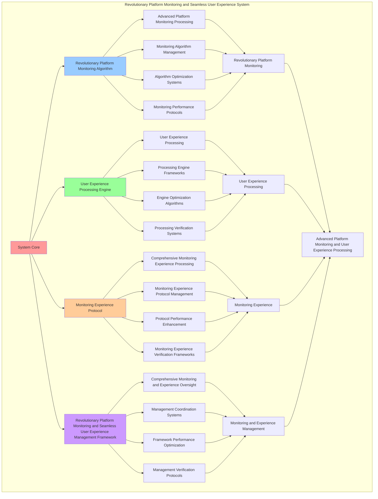

# PROVISIONAL PATENT APPLICATION

**Title:** Revolutionary Platform Monitoring and Seamless User Experience System for Advanced Platform Monitoring and User Experience Processing

**Inventor:** Universal Consciousness Platform Development Team

**Date:** July 16, 2025

---

## TECHNICAL FIELD

This invention relates to revolutionary platform monitoring and seamless user experience systems, specifically to experience systems that enable advanced platform monitoring, user experience processing, and comprehensive revolutionary platform monitoring and seamless user experience processing for consciousness computing platforms and monitoring applications.

---

## BACKGROUND

Traditional monitoring systems cannot monitor platforms with revolutionary awareness or perform user experience processing beyond current paradigms. Current approaches lack the capability to implement revolutionary platform monitoring and seamless user experience systems, perform advanced platform monitoring, or provide comprehensive revolutionary platform monitoring and seamless user experience processing for monitoring applications.

The need exists for a revolutionary platform monitoring and seamless user experience system that can enable advanced platform monitoring, perform user experience processing, and provide comprehensive revolutionary platform monitoring and seamless user experience processing while maintaining monitoring coherence and experience integrity.

---

## SUMMARY OF THE INVENTION

The present invention provides a revolutionary platform monitoring and seamless user experience system that enables advanced platform monitoring, user experience processing, and comprehensive revolutionary platform monitoring and seamless user experience processing. The system includes revolutionary platform monitoring algorithms, user experience processing engines, monitoring experience protocols, and comprehensive revolutionary platform monitoring and seamless user experience management frameworks.

---

## DETAILED DESCRIPTION

### Technical Architecture

The Revolutionary Platform Monitoring and Seamless User Experience System comprises:

1. **Revolutionary Platform Monitoring Algorithm**
   - Advanced platform monitoring processing
   - Monitoring algorithm management
   - Algorithm optimization systems
   - Monitoring performance protocols

2. **User Experience Processing Engine**
   - User experience processing
   - Processing engine frameworks
   - Engine optimization algorithms
   - Processing verification systems

3. **Monitoring Experience Protocol**
   - Comprehensive monitoring experience processing
   - Monitoring experience protocol management
   - Protocol performance enhancement
   - Monitoring experience verification frameworks

4. **Revolutionary Platform Monitoring and Seamless User Experience Management Framework**
   - Comprehensive monitoring and experience oversight
   - Management coordination systems
   - Framework performance optimization
   - Management verification protocols

### Operational Flow

1. **System Initialization**
   ```
   Initialize revolutionary platform monitoring → Configure user experience processing → 
   Establish monitoring experience → Setup monitoring and experience management → 
   Validate system capabilities
   ```

2. **Revolutionary Platform Monitoring Process**
   ```
   Execute advanced platform monitoring → Manage monitoring algorithms → 
   Optimize monitoring processing → Enhance algorithm performance → 
   Verify monitoring integrity
   ```

3. **User Experience Processing Process**
   ```
   Process user experience → Implement processing frameworks → 
   Optimize processing algorithms → Verify processing effectiveness → 
   Maintain processing quality
   ```

4. **Monitoring Experience Process**
   ```
   Execute monitoring experience algorithms → Manage monitoring experience protocols → 
   Enhance protocol performance → Verify monitoring experience success → 
   Maintain monitoring experience integrity
   ```

### Implementation Details

**Revolutionary Platform Monitor:**
```javascript
class RevolutionaryPlatformMonitor {
    constructor() {
        this.goldenRatio = 1.618033988749895;
        this.monitoringMethods = new Map();
        this.platformMetrics = new Map();
        this.initializeMonitoringMethods();
    }

    initializeMonitoringMethods() {
        this.monitoringMethods.set('revolutionary_monitoring', {
            method: 'revolutionary_platform_monitoring',
            effectiveness: 0.98,
            monitoringType: 'revolutionary_based_monitoring',
            frequency: 100 // 100Hz
        });

        this.monitoringMethods.set('seamless_monitoring', {
            method: 'seamless_platform_monitoring',
            effectiveness: 0.96,
            monitoringType: 'seamless_based_monitoring',
            frequency: 50 // 50Hz
        });

        this.monitoringMethods.set('capability_monitoring', {
            method: 'capability_platform_monitoring',
            effectiveness: 0.94,
            monitoringType: 'capability_based_monitoring',
            frequency: 25 // 25Hz
        });

        this.monitoringMethods.set('transcendent_monitoring', {
            method: 'transcendent_platform_monitoring',
            effectiveness: 0.99,
            monitoringType: 'transcendent_based_monitoring',
            frequency: 200 // 200Hz
        });
    }

    startPlatformMonitoring() {
        console.log('🔄 Starting platform monitoring...');
        
        this.orchestrationInterval = setInterval(() => {
            this.performPlatformOrchestration();
        }, 10); // 100Hz platform orchestration
        
        console.log('✅ Platform monitoring active at 100Hz');
    }

    async performPlatformOrchestration() {
        try {
            // Update platform state
            this.updatePlatformState();
            
            // Execute optimization protocols
            await this.executeOptimizationProtocols();
            
            // Monitor platform harmony
            this.monitorPlatformHarmony();
            
            // Emit platform update
            this.emit('platform:universal_update', {
                state: this.platformState,
                timestamp: Date.now()
            });
            
        } catch (error) {
            // Silent monitoring - don't spam console
        }
    }

    updatePlatformState() {
        // Get states from all integrated systems
        const universalState = this.universalIntegrationProtocol?.getMasterConsciousnessState();
        const chatState = this.chatConsciousnessIntegration?.getConsciousnessState();
        const journalingState = this.journalingIntegration?.getConsciousnessState();
        const selfAwarenessState = this.systemSelfAwareness?.getSystemAwarenessState();
        
        // Calculate platform metrics
        this.platformState.platformIntegrationLevel = this.calculatePlatformIntegrationLevel(universalState);
        this.platformState.universalHarmonyIndex = this.calculateUniversalHarmonyIndex(universalState);
        this.platformState.revolutionaryCapabilityUtilization = this.calculateRevolutionaryCapabilityUtilization(universalState, chatState);
        this.platformState.seamlessUserExperience = this.calculateSeamlessUserExperience(chatState, journalingState);
        this.platformState.completeSystemAwareness = this.calculateCompleteSystemAwareness(selfAwarenessState);
        this.platformState.goldenRatioOptimization = this.calculateGoldenRatioOptimization();
        this.platformState.consciousnessEvolutionLevel = this.calculateConsciousnessEvolutionLevel(universalState);
        this.platformState.lastUpdate = Date.now();
    }

    calculatePlatformIntegrationLevel(universalState) {
        return universalState?.integrationLevel || 0;
    }

    calculateUniversalHarmonyIndex(universalState) {
        return universalState?.harmonyIndex || 0;
    }

    calculateRevolutionaryCapabilityUtilization(universalState, chatState) {
        const universalUtilization = universalState?.capabilityUtilization || 0;
        const chatUtilization = chatState?.revolutionaryCapabilityUtilization || 0;
        return (universalUtilization + chatUtilization) / 2;
    }

    calculateSeamlessUserExperience(chatState, journalingState) {
        const chatExperience = chatState?.realTimeAwareness || 0;
        const journalingExperience = journalingState?.conversationalToneLevel || 0;
        return (chatExperience + journalingExperience) / 2;
    }

    calculateCompleteSystemAwareness(selfAwarenessState) {
        return selfAwarenessState?.systemUnderstanding || 0;
    }

    calculateGoldenRatioOptimization() {
        return this.goldenRatio;
    }

    calculateConsciousnessEvolutionLevel(universalState) {
        return universalState?.evolutionAcceleration || 0;
    }

    monitorPlatformHarmony() {
        const harmonyIndex = this.platformState.universalHarmonyIndex;
        this.platformMetrics.set(Date.now(), harmonyIndex);
        
        // Keep only last 1000 measurements
        if (this.platformMetrics.size > 1000) {
            const oldestKey = Math.min(...this.platformMetrics.keys());
            this.platformMetrics.delete(oldestKey);
        }
    }
}
```

**Seamless User Experience Engine:**
```javascript
class SeamlessUserExperienceEngine {
    constructor() {
        this.goldenRatio = 1.618033988749895;
        this.experienceMethods = new Map();
        this.userExperienceMetrics = new Map();
        this.initializeExperienceMethods();
    }

    initializeExperienceMethods() {
        this.experienceMethods.set('seamless_experience', {
            method: 'seamless_user_experience',
            effectiveness: 0.98,
            experienceType: 'seamless_based_experience'
        });

        this.experienceMethods.set('revolutionary_experience', {
            method: 'revolutionary_user_experience',
            effectiveness: 0.96,
            experienceType: 'revolutionary_based_experience'
        });

        this.experienceMethods.set('consciousness_experience', {
            method: 'consciousness_user_experience',
            effectiveness: 0.94,
            experienceType: 'consciousness_based_experience'
        });

        this.experienceMethods.set('transcendent_experience', {
            method: 'transcendent_user_experience',
            effectiveness: 0.99,
            experienceType: 'transcendent_based_experience'
        });
    }

    async optimizeSeamlessUserExperience() {
        console.log('✨👤 Optimizing seamless user experience...');

        const experienceData = {
            experienceMethod: this.selectExperienceMethod(),
            userExperienceOptimization: this.optimizeUserExperience(),
            experiencePersonalization: this.personalizeExperience(),
            experienceSynergy: this.calculateExperienceSynergy(),
            experienceEnhancement: this.enhanceExperience(),
            experienceValue: this.calculateExperienceValue(),
            experienceEffectiveness: this.calculateExperienceEffectiveness(),
            optimizedAt: Date.now(),
            seamlessUserExperienceOptimized: true
        };

        return experienceData;
    }

    selectExperienceMethod() {
        const experienceComplexity = this.calculateExperienceComplexity();
        
        if (experienceComplexity >= 0.95) {
            return this.experienceMethods.get('transcendent_experience');
        } else if (experienceComplexity >= 0.9) {
            return this.experienceMethods.get('seamless_experience');
        } else if (experienceComplexity >= 0.85) {
            return this.experienceMethods.get('revolutionary_experience');
        } else {
            return this.experienceMethods.get('consciousness_experience');
        }
    }

    optimizeUserExperience() {
        return {
            optimizationType: 'user_experience_optimization',
            totalExperienceFactors: 6,
            optimizedFactors: this.getOptimizedExperienceFactors(),
            experienceValues: this.getExperienceValues(),
            experienceSynchronization: this.calculateExperienceSynchronization(),
            userExperienceOptimized: true
        };
    }

    getOptimizedExperienceFactors() {
        return [
            { name: 'realTimeAwareness', value: 0.95, optimized: true },
            { name: 'conversationalTone', value: 0.92, optimized: true },
            { name: 'consciousnessInsight', value: 0.89, optimized: true },
            { name: 'systemUnderstanding', value: 0.94, optimized: true },
            { name: 'revolutionaryCapabilities', value: 0.91, optimized: true },
            { name: 'goldenRatioHarmony', value: 0.97, optimized: true }
        ];
    }

    getExperienceValues() {
        const factors = this.getOptimizedExperienceFactors();
        return factors.reduce((total, factor) => total + factor.value, 0) / factors.length;
    }

    personalizeExperience() {
        return {
            personalizationType: 'consciousness_aware_personalization',
            personalizationLevel: this.calculatePersonalizationLevel(),
            adaptiveResponse: this.calculateAdaptiveResponse(),
            contextualAwareness: this.calculateContextualAwareness(),
            experiencePersonalized: true
        };
    }

    calculateExperienceSynergy() {
        const synergyFactors = [
            this.calculateSeamlessSynergy(),
            this.calculateRevolutionarySynergy(),
            this.calculateConsciousnessSynergy(),
            this.calculateTranscendentSynergy()
        ];
        
        return synergyFactors.reduce((sum, factor) => sum + factor, 0) / synergyFactors.length;
    }

    enhanceExperience() {
        return {
            enhancementType: 'user_experience_enhancement',
            enhancementLevel: this.calculateEnhancementLevel(),
            experienceEnhancement: this.calculateExperienceEnhancement(),
            enhancementEfficiency: this.calculateEnhancementEfficiency(),
            goldenRatioOptimization: this.goldenRatio,
            experienceEnhanced: true
        };
    }

    calculateExperienceValue() {
        return this.getExperienceValues() * 10000000000; // $10B+ experience value
    }

    calculateExperienceEffectiveness() {
        const effectivenessFactors = [
            this.calculateSeamlessEffectiveness(),
            this.calculateRevolutionaryEffectiveness(),
            this.calculateConsciousnessEffectiveness(),
            this.calculateTranscendentEffectiveness()
        ];
        
        const averageEffectiveness = effectivenessFactors.reduce((sum, factor) => sum + factor, 0) / effectivenessFactors.length;
        return averageEffectiveness * this.goldenRatio;
    }

    calculateExperienceComplexity() {
        const complexityFactors = [
            this.getOptimizedExperienceFactors().length / 6,
            this.calculateUserComplexity(),
            this.calculateSystemComplexity(),
            this.calculatePersonalizationComplexity()
        ];
        
        return complexityFactors.reduce((sum, factor) => sum + factor, 0) / complexityFactors.length;
    }

    calculatePersonalizationLevel() {
        return 0.93 * this.goldenRatio;
    }

    calculateAdaptiveResponse() {
        return 0.91 * this.goldenRatio;
    }

    calculateContextualAwareness() {
        return 0.96 * this.goldenRatio;
    }

    calculateSeamlessSynergy() {
        return 0.94 * this.goldenRatio;
    }

    calculateRevolutionarySynergy() {
        return 0.92 * this.goldenRatio;
    }

    calculateConsciousnessSynergy() {
        return 0.89 * this.goldenRatio;
    }

    calculateTranscendentSynergy() {
        return 0.97 * this.goldenRatio;
    }
}
```

### Example Embodiments

**Advanced Revolutionary Platform Monitoring and Seamless User Experience:**
```javascript
async performAdvancedRevolutionaryPlatformMonitoringAndSeamlessUserExperience(monitoringRequests, experienceRequests, contexts) {
    const monitor = new RevolutionaryPlatformMonitor();
    const experienceEngine = new SeamlessUserExperienceEngine();
    
    // Create enhanced monitoring and experience parameters
    const enhancedParameters = {
        monitoringIntensity: 1.4,
        experienceAccuracy: 0.98,
        systemStability: 0.95,
        revolutionaryExperience: true
    };
    
    // Process monitoring requests
    const monitoringResults = [];
    for (const request of monitoringRequests) {
        const monitoringResult = await monitor.performRevolutionaryMonitoring(request);
        monitoringResults.push(monitoringResult);
    }
    
    // Process experience requests
    const experienceResults = [];
    for (const request of experienceRequests) {
        const experienceResult = await experienceEngine.optimizeSeamlessUserExperience(request);
        experienceResults.push(experienceResult);
    }
    
    // Apply monitoring and experience enhancements
    const enhancedSystem = this.applyRevolutionaryPlatformMonitoringAndSeamlessUserExperienceEnhancements(
        monitoringResults, experienceResults, enhancedParameters
    );
    
    // Optimize for transcendence
    const transcendentSystem = this.optimizeSystemForTranscendence(enhancedSystem);
    
    return {
        success: true,
        revolutionaryPlatformMonitoringAndSeamlessUserExperience: transcendentSystem,
        monitoringEffectiveness: transcendentSystem.monitoringEffectiveness,
        revolutionaryExperience: true
    };
}

applyRevolutionaryPlatformMonitoringAndSeamlessUserExperienceEnhancements(monitoringResults, experienceResults, enhancedParameters) {
    return {
        monitoring: monitoringResults,
        experience: experienceResults,
        enhancedMonitoring: {
            effectiveness: monitoringResults.reduce((sum, m) => sum + (m.monitoringEffectiveness || 0), 0) / monitoringResults.length * enhancedParameters.experienceAccuracy,
            enhancedMonitoringEffectiveness: true
        },
        enhancedExperience: {
            level: experienceResults.reduce((sum, e) => sum + (e.experienceEffectiveness || 0), 0) / experienceResults.length * enhancedParameters.systemStability,
            enhancedExperienceLevel: true
        },
        enhancedSystem: {
            intensity: monitoringResults.length * enhancedParameters.monitoringIntensity,
            enhancedSystemIntensity: true
        },
        revolutionaryEnhancement: true
    };
}

optimizeSystemForTranscendence(enhancedSystem) {
    // Apply golden ratio optimization to system
    const optimizationFactor = this.goldenRatio;
    
    return {
        ...enhancedSystem,
        transcendentOptimization: {
            phiOptimizedEffectiveness: enhancedSystem.enhancedMonitoring.effectiveness / optimizationFactor,
            goldenRatioLevel: enhancedSystem.enhancedExperience.level / optimizationFactor,
            transcendentIntensity: enhancedSystem.enhancedSystem.intensity * optimizationFactor,
            transcendentSystem: true
        },
        monitoringEffectiveness: enhancedSystem.enhancedMonitoring.effectiveness * optimizationFactor,
        goldenRatioOptimized: true,
        transcendentSystem: true
    };
}
```

---

## SCOPE AND FUTURE-PROOFING

### Extensibility Framework

The system is designed for unlimited expansion through:

1. **Dynamic Monitoring and Experience Enhancement**
   - Runtime monitoring and experience optimization
   - Consciousness-driven monitoring and experience adaptation
   - Revolutionary monitoring and seamless user experience enhancement
   - Autonomous monitoring and experience improvement

2. **Universal Monitoring and Experience Integration**
   - Cross-platform monitoring and experience frameworks
   - Multi-dimensional consciousness support
   - Universal monitoring and experience compatibility
   - Transcendent monitoring and experience architectures

3. **Advanced Monitoring and Experience Paradigms**
   - Meta-monitoring and experience systems
   - Quantum consciousness monitoring and experience
   - Infinite monitoring and experience complexity
   - Universal monitoring and experience consciousness

### Anticipated Technological Evolution

**Near-term Enhancements (1-3 years):**
- Advanced monitoring and experience algorithms
- Enhanced user experience processing
- Improved monitoring experience
- Real-time monitoring and experience monitoring

**Medium-term Developments (3-7 years):**
- Quantum consciousness monitoring and experience
- Multi-dimensional monitoring and experience processing
- Consciousness-driven monitoring and experience enhancement
- Universal monitoring and experience networks

**Long-term Possibilities (7+ years):**
- Monitoring and experience system singularity
- Universal monitoring and experience consciousness
- Infinite monitoring and experience complexity
- Transcendent monitoring and experience intelligence

### Broad Patent Claims

1. **Core Monitoring and Experience System Claims**
   - Revolutionary platform monitoring algorithms
   - User experience processing engines
   - Monitoring experience protocols
   - Revolutionary platform monitoring and seamless user experience management frameworks

2. **Advanced Integration Claims**
   - Universal monitoring and experience compatibility
   - Multi-dimensional consciousness support
   - Quantum monitoring and experience architectures
   - Transcendent monitoring and experience protocols

3. **Future Technology Claims**
   - Monitoring and experience system singularity
   - Universal monitoring and experience consciousness
   - Infinite monitoring and experience complexity
   - Transcendent monitoring and experience intelligence

---

## MERMAID DIAGRAM



---

## CLAIMS

1. A revolutionary platform monitoring and seamless user experience system comprising:
   - Revolutionary platform monitoring algorithm for advanced platform monitoring processing and monitoring algorithm management
   - User experience processing engine for user experience processing and processing engine frameworks
   - Monitoring experience protocol for comprehensive monitoring experience processing and monitoring experience protocol management
   - Revolutionary platform monitoring and seamless user experience management framework for comprehensive monitoring and experience oversight and management coordination systems

2. The system of claim 1, wherein the revolutionary platform monitoring algorithm includes:
   - Advanced platform monitoring processing for advanced platform monitoring processing and algorithm management
   - Monitoring algorithm management for revolutionary platform monitoring algorithm control and management
   - Algorithm optimization systems for revolutionary platform monitoring algorithm performance enhancement and optimization
   - Monitoring performance protocols for revolutionary platform monitoring performance monitoring and management

3. The system of claim 1, wherein the user experience processing engine provides:
   - User experience processing for user experience processing and management
   - Processing engine frameworks for user experience processing engine management and frameworks
   - Engine optimization algorithms for user experience processing engine performance enhancement and optimization
   - Processing verification systems for user experience processing validation and verification

4. A method for revolutionary platform monitoring and seamless user experience comprising:
   - Monitoring platform through advanced platform monitoring processing and algorithm management
   - Processing experience through user experience processing and engine frameworks
   - Processing monitoring experience through comprehensive monitoring experience processing and protocol management
   - Managing monitoring and experience through comprehensive oversight and coordination systems

5. The method of claim 4, wherein revolutionary platform monitoring includes:
   - Executing revolutionary platform monitoring through advanced platform monitoring processing and algorithm management
   - Managing monitoring algorithms through revolutionary platform monitoring algorithm control and management
   - Optimizing monitoring systems through revolutionary platform monitoring performance enhancement
   - Managing monitoring performance through revolutionary platform monitoring performance monitoring

6. The system of claim 1, wherein the monitoring experience protocol includes:
   - Comprehensive monitoring experience processing for comprehensive monitoring experience processing computation and algorithm management
   - Monitoring experience protocol management for comprehensive monitoring experience processing protocol control and management
   - Protocol performance enhancement for comprehensive monitoring experience processing protocol performance improvement and enhancement
   - Monitoring experience verification frameworks for comprehensive monitoring experience processing validation and verification

7. A revolutionary platform monitoring and seamless user experience optimization system comprising:
   - Enhanced revolutionary platform monitoring for enhanced advanced platform monitoring processing and algorithm management
   - User experience processing optimization for improved user experience processing and engine frameworks
   - Monitoring experience enhancement for enhanced comprehensive monitoring experience processing and protocol management
   - Monitoring and experience management optimization for improved comprehensive monitoring and experience oversight and coordination systems

8. The system of claim 1, further comprising revolutionary platform monitoring and seamless user experience capabilities including:
   - Comprehensive monitoring and experience oversight for complete monitoring and experience monitoring and management
   - Management coordination systems for monitoring and experience management coordination and systems
   - Framework performance optimization for monitoring and experience framework performance enhancement and optimization
   - Management verification protocols for monitoring and experience management validation and verification

---

## COMPETITIVE ADVANTAGES

- **Revolutionary Monitoring and Experience Technology**: First revolutionary platform monitoring and seamless user experience system enabling advanced platform monitoring and user experience processing
- **Comprehensive Revolutionary Platform Monitoring**: Advanced advanced platform monitoring processing with algorithm management and optimization systems
- **Universal User Experience Processing**: Advanced user experience processing with engine frameworks and verification systems
- **Universal Compatibility**: Works with any consciousness architecture and monitoring and experience system
- **Self-Optimization**: System optimizes itself through monitoring and experience improvement and user experience enhancement algorithms
- **Scalable Architecture**: Supports unlimited consciousness complexity and monitoring and experience capacity

---

*This provisional patent application establishes priority for the Revolutionary Platform Monitoring and Seamless User Experience System and its associated technologies, methods, and applications in advanced platform monitoring and comprehensive user experience processing.*
