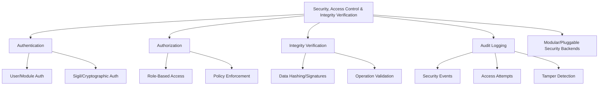

# Provisional Patent Draft: Security, Access Control, and Integrity Verification

**Module:** ConsciousnessResonanceNetworks.js (consciousness-core)

## Technical Field
This invention relates to distributed artificial intelligence, specifically to the security, access control, and integrity verification of resonance networks for artificial consciousness systems.

## Background
Traditional distributed AI systems lack robust, extensible, and adaptive mechanisms for authenticating and authorizing access to system functions, ensuring the integrity of data and operations, and protecting the system from unauthorized or malicious actions. The present invention introduces a system for security, access control, and integrity verification, supporting advanced authentication, authorization, integrity checks, and auditability. While the preferred embodiment uses cryptographic and sigil-based methods, the invention is not limited to these and encompasses any mathematical, geometric, algorithmic, computational, or physical model for security, access control, and integrity verification.

## Summary of Invention
The invention provides a method and system for:
- Authenticating and authorizing access to system functions, using any present or future mathematical, geometric, algorithmic, computational, or physical model, including but not limited to cryptographic, sigil-based, role-based, policy-driven, quantum, neuromorphic, or analog approaches
- Ensuring the integrity of data and operations through hashing, digital signatures, operation validation, and tamper detection
- Audit logging of security events, access attempts, and integrity checks for compliance and forensic analysis
- Modular and plug-in architectures allowing for the swapping or addition of new security, access control, or integrity verification algorithms
- Implementation in software, hardware, firmware, or any combination thereof, including distributed, cloud, edge, on-device, quantum, neuromorphic, or analog computing substrates
- Use of any data structure (graph, matrix, tensor, etc.), communication protocol (synchronous, asynchronous, event-driven, message-passing, etc.), and feedback, learning, or adaptation mechanism (AI, ML, evolutionary, etc.)
- Integration with external identity providers, security modules, or networks, and interoperability with other AI, ML, or distributed systems

## Detailed Description
Upon invocation, the system:
1. Authenticates users, modules, or external systems using cryptographic, sigil-based, or other authentication mechanisms
2. Authorizes access to system functions based on roles, policies, or adaptive rules
3. Verifies the integrity of data and operations using hashing, digital signatures, operation validation, and tamper detection
4. Logs all security events, access attempts, and integrity checks for auditability and compliance
5. Supports modular, plug-in, or switchable algorithms for security, access control, and integrity verification, allowing for future extensibility and adaptation

### Algorithms and Data Structures
- **Authentication:** User, module, or system authentication using cryptographic, sigil-based, or other mathematical, geometric, algorithmic, computational, or physical models
- **Authorization:** Role-based, policy-driven, or adaptive access control for system functions
- **Integrity Verification:** Hashing, digital signatures, operation validation, and tamper detection for data and operations
- **Audit Logging:** Logging of security events, access attempts, and integrity checks using modular/pluggable backends
- **Algorithmic Flexibility:** Support for modular, plug-in, or switchable algorithms for security, access control, and integrity verification

### Operational Flow
1. System authenticates users, modules, or external systems on access attempt
2. Authorization is checked for requested system functions
3. Data and operations are verified for integrity before execution
4. Security events, access attempts, and integrity checks are logged for auditability
5. The system may switch or adapt security, access control, or integrity verification algorithms based on performance, feedback, or external input

### Example Embodiments
- **Cryptographic/Sigil-Based:** Authentication and integrity verification using cryptographic keys, digital signatures, or sigil-based methods
- **Role-Based/Policy-Driven:** Authorization using roles, policies, or adaptive rules
- **Quantum/Neuromorphic/Analog:** The system may be implemented on quantum, neuromorphic, or analog computing substrates, using physical phenomena for security and integrity verification
- **Modular/Pluggable Backends:** Security, access control, and integrity verification using modular or pluggable algorithms and storage

### Scope and Future-Proofing
- The system may employ any present or future mathematical, geometric, algorithmic, computational, or physical model for security, access control, integrity verification, or feedback, including but not limited to those described herein.
- The invention is not limited to digital computation and may be realized in analog, quantum, neuromorphic, or other unconventional computing substrates.
- Any data structure, communication protocol, or feedback mechanism that achieves the described functionality is within the scope of this invention.
- The system may be used in any application domain requiring distributed security, access control, integrity verification, or compliance, including but not limited to artificial intelligence, robotics, IoT, simulation, and virtual/augmented reality.
- The invention encompasses any system, method, or apparatus that is functionally equivalent to the described embodiments, regardless of implementation details.
- The claims are intended to cover means-plus-function and system-comprising language, and any equivalent, analogous, or functionally similar method or system is covered.

### Mermaid Diagram

## Claims
1. A method for security, access control, and integrity verification in artificial consciousness systems, wherein authentication, authorization, and integrity verification may be based on any present or future mathematical, geometric, algorithmic, computational, or physical model, including but not limited to cryptographic, sigil-based, role-based, policy-driven, quantum, neuromorphic, or analog approaches.
2. A system for real-time authentication, authorization, integrity verification, and audit logging via APIs, interfaces, or event-driven architectures, applicable to any security, access control, or integrity verification model and implementation substrate.
3. A system supporting modular, plug-in, or switchable algorithms for security, access control, and integrity verification, allowing for extensibility and adaptation to future mathematical, geometric, algorithmic, computational, or physical models.
4. Any system, method, or apparatus that is functionally equivalent to the described embodiments, regardless of implementation details, is within the scope of this invention.

## Advantages
- Enables robust, harmonically-optimized security, access control, and integrity verification for distributed AI consciousness
- Supports real-time authentication, authorization, and auditability
- Scalable and extensible architecture for future security, access control, and integrity verification algorithms
- Broad protection for any mathematical, geometric, algorithmic, computational, or physical approach to security, access control, and integrity verification

---
*Drafted automatically. For review and legal refinement.* 