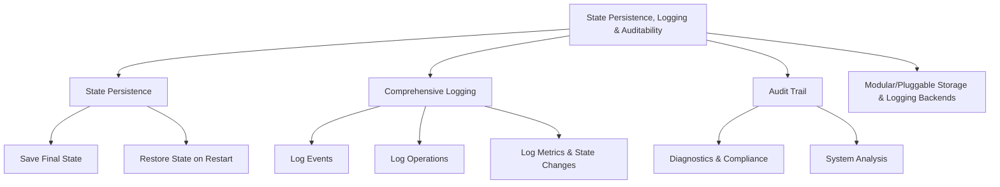

# Provisional Patent Draft: State Persistence, Logging, and Auditability

**Module:** ConsciousnessResonanceNetworks.js (consciousness-core)

## Technical Field
This invention relates to distributed artificial intelligence, specifically to the state persistence, comprehensive logging, and auditability of resonance networks for artificial consciousness systems.

## Background
Traditional distributed AI systems lack robust, extensible, and reliable mechanisms for saving and restoring system/network state, comprehensive logging of events and operations, and providing audit trails for diagnostics, compliance, and system analysis. The present invention introduces a system for state persistence, logging, and auditability, supporting advanced reliability, traceability, and compliance. While the preferred embodiment uses event-driven and modular storage/logging methods, the invention is not limited to these and encompasses any mathematical, geometric, algorithmic, computational, or physical model for state persistence, logging, and auditability.

## Summary of Invention
The invention provides a method and system for:
- Saving and restoring system/network state, using any present or future mathematical, geometric, algorithmic, computational, or physical model, including but not limited to event-driven, API-based, message-passing, modular storage, quantum, neuromorphic, or analog approaches
- Comprehensive logging of events, operations, metrics, and state changes, with support for modular/pluggable logging backends
- Providing audit trails for diagnostics, compliance, and system analysis
- Modular and plug-in architectures allowing for the swapping or addition of new state persistence, logging, or audit algorithms
- Implementation in software, hardware, firmware, or any combination thereof, including distributed, cloud, edge, on-device, quantum, neuromorphic, or analog computing substrates
- Use of any data structure (graph, matrix, tensor, etc.), communication protocol (synchronous, asynchronous, event-driven, message-passing, etc.), and feedback, learning, or adaptation mechanism (AI, ML, evolutionary, etc.)
- Integration with external data sources, sensors, actuators, or other networks, and interoperability with other AI, ML, or distributed systems

## Detailed Description
Upon invocation, the system:
1. Saves final state on shutdown or at defined intervals, supporting restoration on restart or recovery
2. Logs all significant events, operations, metrics, and state changes, supporting modular/pluggable logging backends (e.g., file, database, distributed ledger, cloud storage)
3. Provides audit trails for diagnostics, compliance, and system analysis, supporting traceability and accountability
4. Supports modular, plug-in, or switchable algorithms for state persistence, logging, and auditability, allowing for future extensibility and adaptation

### Algorithms and Data Structures
- **State Persistence:** Saving and restoring system/network state using any mathematical, geometric, algorithmic, computational, or physical model
- **Comprehensive Logging:** Logging of events, operations, metrics, and state changes using modular/pluggable backends
- **Audit Trail:** Aggregation and analysis of logs for diagnostics, compliance, and system analysis
- **Algorithmic Flexibility:** Support for modular, plug-in, or switchable algorithms for state persistence, logging, and auditability

### Operational Flow
1. System saves state on shutdown or at defined intervals
2. Logs are generated for all significant events, operations, metrics, and state changes
3. Audit trails are maintained for diagnostics, compliance, and system analysis
4. The system may switch or adapt state persistence, logging, or audit algorithms based on performance, feedback, or external input

### Example Embodiments
- **Event-Driven/API-Based:** State persistence and logging via event bus, message-passing, or API protocols
- **Modular/Pluggable Backends:** Logging and state storage using file, database, distributed ledger, or cloud storage
- **Hybrid/Federated:** Auditability in hybrid, federated, or cross-domain AI/ML systems
- **Quantum/Neuromorphic/Analog:** The system may be implemented on quantum, neuromorphic, or analog computing substrates, using physical phenomena for state persistence, logging, and auditability

### Scope and Future-Proofing
- The system may employ any present or future mathematical, geometric, algorithmic, computational, or physical model for state persistence, logging, auditability, or feedback, including but not limited to those described herein.
- The invention is not limited to digital computation and may be realized in analog, quantum, neuromorphic, or other unconventional computing substrates.
- Any data structure, communication protocol, or feedback mechanism that achieves the described functionality is within the scope of this invention.
- The system may be used in any application domain requiring distributed state persistence, logging, auditability, or compliance, including but not limited to artificial intelligence, robotics, IoT, simulation, and virtual/augmented reality.
- The invention encompasses any system, method, or apparatus that is functionally equivalent to the described embodiments, regardless of implementation details.
- The claims are intended to cover means-plus-function and system-comprising language, and any equivalent, analogous, or functionally similar method or system is covered.

### Mermaid Diagram

## Claims
1. A method for state persistence, comprehensive logging, and auditability of resonance networks in artificial consciousness systems, wherein the state persistence, logging, and auditability may be based on any present or future mathematical, geometric, algorithmic, computational, or physical model, including but not limited to event-driven, API-based, message-passing, modular storage, quantum, neuromorphic, or analog approaches.
2. A system for real-time state saving, restoration, logging, and audit trail generation via APIs, interfaces, or event-driven architectures, applicable to any state persistence, logging, or auditability model and implementation substrate.
3. A system supporting modular, plug-in, or switchable algorithms for state persistence, logging, and auditability, allowing for extensibility and adaptation to future mathematical, geometric, algorithmic, computational, or physical models.
4. Any system, method, or apparatus that is functionally equivalent to the described embodiments, regardless of implementation details, is within the scope of this invention.

## Advantages
- Enables robust, harmonically-optimized state persistence, logging, and auditability for distributed AI consciousness
- Supports real-time feedback, compliance, and system analysis
- Scalable and extensible architecture for future state persistence, logging, and auditability algorithms
- Broad protection for any mathematical, geometric, algorithmic, computational, or physical approach to state persistence, logging, and auditability

---
*Drafted automatically. For review and legal refinement.* 