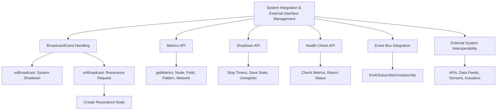

# Provisional Patent Draft: System Integration, Interoperability, and External Interface Management

**Module:** ConsciousnessResonanceNetworks.js (consciousness-core)

## Technical Field
This invention relates to distributed artificial intelligence, specifically to the integration, interoperability, and external interface management of resonance networks for artificial consciousness systems.

## Background
Traditional distributed AI systems lack robust, flexible, and extensible mechanisms for integrating with external systems, handling broadcast and event messages, exposing APIs or interfaces for external control, and supporting interoperability with other AI, ML, or distributed systems. The present invention introduces a system for system integration, interoperability, and external interface management, supporting advanced control, monitoring, and emergent behavior. While the preferred embodiment uses event-driven and API-based methods, the invention is not limited to these and encompasses any mathematical, geometric, algorithmic, computational, or physical model for integration and interface management.

## Summary of Invention
The invention provides a method and system for:
- Integrating with external systems, event buses, and distributed architectures, using any present or future mathematical, geometric, algorithmic, computational, or physical model, including but not limited to event-driven, API-based, message-passing, data feed, sensor/actuator, quantum, neuromorphic, or analog approaches
- Handling broadcast and event messages for system control, node creation, shutdown, and other operations
- Exposing APIs or interfaces for external control, monitoring, and data retrieval (e.g., metrics, health checks, shutdown)
- Supporting interoperability with other AI, ML, or distributed systems, including hybrid, federated, or cross-domain architectures
- Modular and plug-in architectures allowing for the swapping or addition of new integration, event-handling, or interface algorithms
- Implementation in software, hardware, firmware, or any combination thereof, including distributed, cloud, edge, on-device, quantum, neuromorphic, or analog computing substrates
- Use of any data structure (graph, matrix, tensor, etc.), communication protocol (synchronous, asynchronous, event-driven, message-passing, etc.), and feedback, learning, or adaptation mechanism (AI, ML, evolutionary, etc.)
- Integration with external data sources, sensors, actuators, or other networks, and interoperability with other AI, ML, or distributed systems

## Detailed Description
Upon invocation, the system:
1. Integrates with an event bus or event-driven architecture, subscribing to and handling broadcast and event messages (e.g., system shutdown, resonance requests)
2. Exposes APIs or interfaces for external control, monitoring, and data retrieval (e.g., getMetrics, shutdown, healthCheck)
3. Emits and handles events for node creation, resonance progress, connection management, and system state changes
4. Supports modular, plug-in, or switchable algorithms for integration, event handling, and interface management, allowing for future extensibility and adaptation

### Algorithms and Data Structures
- **Event Handling:** Subscribing to, emitting, and handling broadcast and event messages using any event-driven, message-passing, or API-based model
- **API/Interface Management:** Exposing and managing APIs or interfaces for external control, monitoring, and data retrieval
- **Interoperability:** Supporting integration with other AI, ML, or distributed systems, including hybrid, federated, or cross-domain architectures
- **Algorithmic Flexibility:** Support for modular, plug-in, or switchable algorithms for integration, event handling, and interface management

### Operational Flow
1. System subscribes to event bus and external interfaces
2. Broadcast and event messages are handled for system control and node management
3. APIs or interfaces are exposed for external control, monitoring, and data retrieval
4. Events are emitted and handled for system state changes and external integration
5. The system may switch or adapt integration, event-handling, or interface algorithms based on performance, feedback, or external input

### Example Embodiments
- **Event-Driven:** Integration and control via event bus, message-passing, or broadcast systems
- **API-Based:** External control and monitoring via REST, GraphQL, gRPC, or other API protocols
- **Hybrid/Federated:** Interoperability with hybrid, federated, or cross-domain AI/ML systems
- **Sensor/Actuator/Data Feed:** Integration with external sensors, actuators, or data feeds for real-time control and feedback
- **Quantum/Neuromorphic/Analog:** The system may be implemented on quantum, neuromorphic, or analog computing substrates, using physical phenomena for integration and interface management

### Scope and Future-Proofing
- The system may employ any present or future mathematical, geometric, algorithmic, computational, or physical model for integration, event handling, interface management, or feedback, including but not limited to those described herein.
- The invention is not limited to digital computation and may be realized in analog, quantum, neuromorphic, or other unconventional computing substrates.
- Any data structure, communication protocol, or feedback mechanism that achieves the described functionality is within the scope of this invention.
- The system may be used in any application domain requiring distributed integration, interoperability, or external interface management, including but not limited to artificial intelligence, robotics, IoT, simulation, and virtual/augmented reality.
- The invention encompasses any system, method, or apparatus that is functionally equivalent to the described embodiments, regardless of implementation details.
- The claims are intended to cover means-plus-function and system-comprising language, and any equivalent, analogous, or functionally similar method or system is covered.

### Mermaid Diagram

## Claims
1. A method for integrating, interoperating, and managing external interfaces in artificial consciousness systems, wherein the integration, event handling, and interface management may be based on any present or future mathematical, geometric, algorithmic, computational, or physical model, including but not limited to event-driven, API-based, message-passing, data feed, sensor/actuator, quantum, neuromorphic, or analog approaches.
2. A system for real-time monitoring, control, and data retrieval via APIs, interfaces, or event-driven architectures, applicable to any integration, event-handling, or interface management model and implementation substrate.
3. A system supporting modular, plug-in, or switchable algorithms for integration, event handling, and interface management, allowing for extensibility and adaptation to future mathematical, geometric, algorithmic, computational, or physical models.
4. Any system, method, or apparatus that is functionally equivalent to the described embodiments, regardless of implementation details, is within the scope of this invention.

## Advantages
- Enables robust, harmonically-optimized integration and interoperability for distributed AI consciousness
- Supports real-time feedback, control, and external monitoring
- Scalable and extensible architecture for future integration, event-handling, and interface management algorithms
- Broad protection for any mathematical, geometric, algorithmic, computational, or physical approach to system integration and external interface management

---
*Drafted automatically. For review and legal refinement.* 