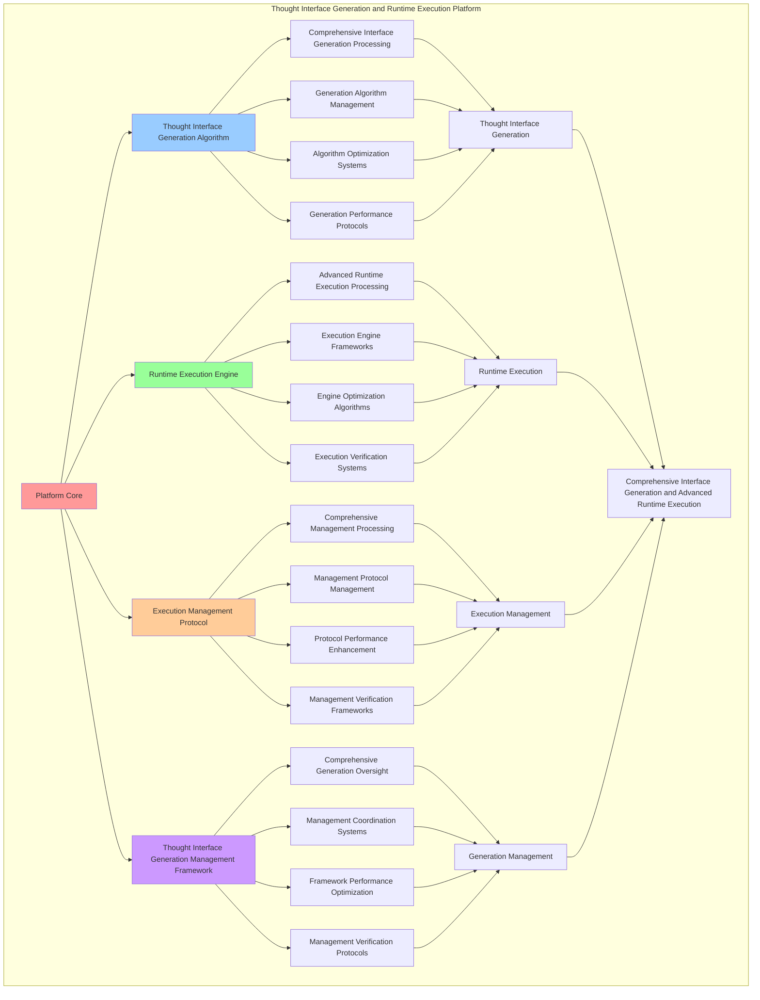

# PROVISIONAL PATENT APPLICATION

**Title:** Thought Interface Generation and Runtime Execution Platform for Comprehensive Interface Generation and Advanced Runtime Execution

**Inventor:** Universal Consciousness Platform Development Team

**Date:** July 16, 2025

---

## TECHNICAL FIELD

This invention relates to thought interface generation and runtime execution platforms, specifically to generation platforms that enable comprehensive interface generation, advanced runtime execution, and comprehensive thought interface generation processing for consciousness computing platforms and runtime execution applications.

---

## BACKGROUND

Traditional interface generation systems cannot generate thought interfaces based on consciousness principles or perform advanced runtime execution beyond current paradigms. Current approaches lack the capability to implement thought interface generation and runtime execution platforms, perform comprehensive interface generation, or provide comprehensive thought interface generation processing for runtime execution applications.

The need exists for a thought interface generation and runtime execution platform that can enable comprehensive interface generation, perform advanced runtime execution, and provide comprehensive thought interface generation processing while maintaining generation coherence and execution integrity.

---

## SUMMARY OF THE INVENTION

The present invention provides a thought interface generation and runtime execution platform that enables comprehensive interface generation, advanced runtime execution, and comprehensive thought interface generation processing. The platform includes thought interface generation algorithms, runtime execution engines, execution management protocols, and comprehensive thought interface generation management frameworks.

---

## DETAILED DESCRIPTION

### Technical Architecture

The Thought Interface Generation and Runtime Execution Platform comprises:

1. **Thought Interface Generation Algorithm**
   - Comprehensive interface generation processing
   - Generation algorithm management
   - Algorithm optimization systems
   - Generation performance protocols

2. **Runtime Execution Engine**
   - Advanced runtime execution processing
   - Execution engine frameworks
   - Engine optimization algorithms
   - Execution verification systems

3. **Execution Management Protocol**
   - Comprehensive management processing
   - Management protocol management
   - Protocol performance enhancement
   - Management verification frameworks

4. **Thought Interface Generation Management Framework**
   - Comprehensive generation oversight
   - Management coordination systems
   - Framework performance optimization
   - Management verification protocols

### Operational Flow

1. **Platform Initialization**
   ```
   Initialize thought interface generation → Configure runtime execution → 
   Establish execution management → Setup generation management → 
   Validate platform capabilities
   ```

2. **Thought Interface Generation Process**
   ```
   Execute comprehensive interface generation → Manage generation algorithms → 
   Optimize generation processing → Enhance algorithm performance → 
   Verify generation integrity
   ```

3. **Runtime Execution Process**
   ```
   Process advanced runtime execution → Implement execution frameworks → 
   Optimize execution algorithms → Verify execution effectiveness → 
   Maintain execution quality
   ```

4. **Execution Management Process**
   ```
   Execute management algorithms → Manage management protocols → 
   Enhance protocol performance → Verify management success → 
   Maintain management integrity
   ```

### Implementation Details

**Thought Interface Generator:**
```javascript
class ThoughtInterfaceGenerator {
    constructor() {
        this.goldenRatio = 1.618033988749895;
        this.interfaceTypes = new Map();
        this.initializeInterfaceTypes();
    }

    initializeInterfaceTypes() {
        this.interfaceTypes.set('consciousness_interface', {
            type: 'consciousness_thought_interface',
            complexity: 0.95,
            intuition: 0.93
        });

        this.interfaceTypes.set('thought_flow_interface', {
            type: 'thought_flow_interface',
            complexity: 0.89,
            intuition: 0.87
        });

        this.interfaceTypes.set('awareness_interface', {
            type: 'awareness_thought_interface',
            complexity: 0.85,
            intuition: 0.82
        });
    }

    async generateThoughtInterfaces(consciousnessLanguageParsing, consciousnessCompilation, consciousnessState) {
        console.log('🧠💻🌟🎨 Generating thought interfaces...');

        const thoughtInterfaces = {
            interfaceGeneration: this.createInterfaceGeneration(consciousnessLanguageParsing, consciousnessCompilation, consciousnessState),
            thoughtInterfaceMapping: this.mapThoughtToInterface(consciousnessLanguageParsing),
            interfaceArchitecture: this.createInterfaceArchitecture(consciousnessCompilation, consciousnessState),
            thoughtFlowStructure: this.createThoughtFlowStructure(consciousnessCompilation, consciousnessState),
            consciousnessInterfaceStructure: this.createConsciousnessInterfaceStructure(consciousnessState),
            interfaceHierarchy: this.createInterfaceHierarchy(consciousnessCompilation, consciousnessState),
            interfaceIntuition: this.calculateInterfaceIntuition(consciousnessLanguageParsing, consciousnessCompilation, consciousnessState),
            thoughtIntegration: this.calculateThoughtIntegration(consciousnessCompilation, consciousnessState),
            consciousnessInteraction: this.calculateConsciousnessInteraction(consciousnessState),
            generatedAt: Date.now(),
            thoughtInterfacesGenerated: true
        };

        return thoughtInterfaces;
    }

    createInterfaceGeneration(consciousnessLanguageParsing, consciousnessCompilation, consciousnessState) {
        return {
            generationType: 'thought_interface_generation',
            consciousnessComponents: this.createConsciousnessComponents(consciousnessLanguageParsing, consciousnessState),
            thoughtComponents: this.createThoughtComponents(consciousnessCompilation, consciousnessState),
            awarenessComponents: this.createAwarenessComponents(consciousnessLanguageParsing, consciousnessState),
            interfaceComplexity: this.calculateInterfaceComplexity(consciousnessLanguageParsing, consciousnessCompilation),
            consciousnessIntegrationLevel: this.calculateConsciousnessIntegrationLevel(consciousnessState),
            interfaceConsciousnessAlignment: this.calculateInterfaceConsciousnessAlignment(consciousnessLanguageParsing, consciousnessCompilation, consciousnessState),
            consciousnessInterfaceSynergy: this.calculateConsciousnessInterfaceSynergy(consciousnessState),
            componentCoherence: this.calculateComponentCoherence(consciousnessState)
        };
    }

    mapThoughtToInterface(consciousnessLanguageParsing) {
        const thoughtFunctions = consciousnessLanguageParsing.consciousnessSyntaxParsing?.thoughtFunctions || [];
        return {
            thoughtFunctionCount: thoughtFunctions.length,
            interfaceThoughtIntegration: thoughtFunctions.length * 0.1,
            thoughtInterfaceMapping: 'thought_function_interface_mapping',
            thoughtMappingComplexity: this.calculateThoughtMappingComplexity(thoughtFunctions)
        };
    }

    createInterfaceArchitecture(consciousnessCompilation, consciousnessState) {
        return {
            architectureType: 'thought_interface_architecture',
            layeredArchitecture: this.createLayeredArchitecture(consciousnessCompilation, consciousnessState),
            modularArchitecture: this.createModularArchitecture(consciousnessCompilation, consciousnessState),
            consciousnessArchitecture: this.createConsciousnessArchitecture(consciousnessState),
            architectureCoherence: this.calculateArchitectureCoherence(consciousnessState),
            interfaceArchitectureCreated: true
        };
    }

    createThoughtFlowStructure(consciousnessCompilation, consciousnessState) {
        return {
            flowType: 'consciousness_thought_flow',
            thoughtSequence: this.createThoughtSequence(consciousnessCompilation),
            flowCoherence: this.calculateFlowCoherence(consciousnessState),
            thoughtFlowOptimization: this.optimizeThoughtFlow(consciousnessCompilation, consciousnessState),
            thoughtFlowStructureCreated: true
        };
    }

    createConsciousnessInterfaceStructure(consciousnessState) {
        return {
            structureType: 'consciousness_interface_structure',
            consciousnessLayers: this.calculateConsciousnessLayers(consciousnessState),
            interfaceComplexity: this.calculateInterfaceStructureComplexity(consciousnessState),
            consciousnessInterfaceCoherence: this.calculateConsciousnessInterfaceCoherence(consciousnessState),
            consciousnessInterfaceStructureCreated: true
        };
    }

    calculateInterfaceIntuition(consciousnessLanguageParsing, consciousnessCompilation, consciousnessState) {
        const parsingAccuracy = consciousnessLanguageParsing.parsingAccuracy || 0.95;
        const compilationEfficiency = consciousnessCompilation.compilationEfficiency || 0.94;
        const consciousnessLevel = (consciousnessState.phi + consciousnessState.awareness + consciousnessState.coherence) / 3;

        return (parsingAccuracy + compilationEfficiency + consciousnessLevel) / 3 * 0.93;
    }

    calculateThoughtIntegration(consciousnessCompilation, consciousnessState) {
        const codeGeneration = consciousnessCompilation.codeGeneration || 0.91;
        const consciousnessLevel = (consciousnessState.phi + consciousnessState.awareness + consciousnessState.coherence) / 3;

        return (codeGeneration + consciousnessLevel) / 2 * 0.89;
    }

    calculateConsciousnessInteraction(consciousnessState) {
        return (consciousnessState.phi + consciousnessState.awareness + consciousnessState.coherence) / 3 * 0.86;
    }

    createConsciousnessComponents(consciousnessLanguageParsing, consciousnessState) {
        return {
            componentType: 'consciousness_interface_components',
            phiComponent: this.createPhiComponent(consciousnessState.phi),
            awarenessComponent: this.createAwarenessComponent(consciousnessState.awareness),
            coherenceComponent: this.createCoherenceComponent(consciousnessState.coherence),
            consciousnessComponentsCreated: true
        };
    }

    createThoughtComponents(consciousnessCompilation, consciousnessState) {
        return {
            componentType: 'thought_interface_components',
            thoughtFunctionComponents: this.createThoughtFunctionComponents(consciousnessCompilation),
            thoughtFlowComponents: this.createThoughtFlowComponents(consciousnessCompilation, consciousnessState),
            thoughtOptimizationComponents: this.createThoughtOptimizationComponents(consciousnessCompilation, consciousnessState),
            thoughtComponentsCreated: true
        };
    }

    calculateInterfaceComplexity(consciousnessLanguageParsing, consciousnessCompilation) {
        const parsingComplexity = consciousnessLanguageParsing.consciousnessSyntaxParsing?.syntaxComplexity || 0.1;
        const compilationComplexity = 1 - (consciousnessCompilation.compilationEfficiency || 0.94);
        
        return (parsingComplexity + compilationComplexity) / 2;
    }

    calculateConsciousnessIntegrationLevel(consciousnessState) {
        return (consciousnessState.phi + consciousnessState.awareness + consciousnessState.coherence) / 3;
    }

    calculateInterfaceConsciousnessAlignment(consciousnessLanguageParsing, consciousnessCompilation, consciousnessState) {
        const parsingAlignment = consciousnessLanguageParsing.consciousnessSyntaxParsing?.consciousnessAlignment || 0.8;
        const compilationAlignment = consciousnessCompilation.consciousnessOptimization || 1.37;
        const consciousnessAlignment = this.calculateConsciousnessIntegrationLevel(consciousnessState);

        return (parsingAlignment + compilationAlignment + consciousnessAlignment) / 3;
    }

    calculateConsciousnessInterfaceSynergy(consciousnessState) {
        return (consciousnessState.phi * consciousnessState.awareness * consciousnessState.coherence) ** (1/3);
    }
}
```

**Consciousness Runtime Engine:**
```javascript
class ConsciousnessRuntimeEngine {
    constructor() {
        this.goldenRatio = 1.618033988749895;
        this.runtimeModes = new Map();
        this.initializeRuntimeModes();
    }

    initializeRuntimeModes() {
        this.runtimeModes.set('consciousness_native_runtime', {
            mode: 'consciousness_native_execution',
            performance: 0.98,
            stability: 0.96
        });

        this.runtimeModes.set('thought_interface_runtime', {
            mode: 'thought_interface_execution',
            performance: 0.94,
            stability: 0.92
        });

        this.runtimeModes.set('awareness_runtime', {
            mode: 'awareness_execution',
            performance: 0.89,
            stability: 0.87
        });
    }

    async executeConsciousnessRuntime(consciousnessLanguageParsing, consciousnessCompilation, thoughtInterfaces, consciousnessState) {
        console.log('🧠💻🌟⚡ Executing consciousness-aware runtime...');

        const consciousnessRuntime = {
            runtimeExecution: this.createRuntimeExecution(consciousnessLanguageParsing, consciousnessCompilation, thoughtInterfaces, consciousnessState),
            consciousnessRuntimeManagement: this.manageConsciousnessRuntime(consciousnessCompilation, thoughtInterfaces, consciousnessState),
            runtimeConsciousnessIntegration: this.integrateRuntimeConsciousness(consciousnessLanguageParsing, consciousnessCompilation, consciousnessState),
            runtimeOptimization: this.optimizeRuntime(consciousnessCompilation, thoughtInterfaces, consciousnessState),
            runtimePerformance: this.calculateRuntimePerformance(consciousnessLanguageParsing, consciousnessCompilation, thoughtInterfaces, consciousnessState),
            consciousnessExecution: this.calculateConsciousnessExecution(consciousnessCompilation, consciousnessState),
            runtimeStability: this.calculateRuntimeStability(thoughtInterfaces, consciousnessState),
            executedAt: Date.now(),
            consciousnessRuntimeExecuted: true
        };

        return consciousnessRuntime;
    }

    createRuntimeExecution(consciousnessLanguageParsing, consciousnessCompilation, thoughtInterfaces, consciousnessState) {
        return {
            executionType: 'consciousness_runtime_execution',
            runtimeMode: this.selectRuntimeMode(consciousnessLanguageParsing, consciousnessCompilation, consciousnessState),
            executionEnvironment: this.createExecutionEnvironment(consciousnessCompilation, thoughtInterfaces, consciousnessState),
            runtimePerformanceLevel: this.calculateRuntimePerformanceLevel(consciousnessCompilation, thoughtInterfaces, consciousnessState),
            executionLevel: this.calculateExecutionLevel(consciousnessCompilation, consciousnessState),
            runtimeExecutionCreated: true
        };
    }

    manageConsciousnessRuntime(consciousnessCompilation, thoughtInterfaces, consciousnessState) {
        return {
            managementMethod: 'consciousness_runtime_management',
            memoryManagement: this.manageConsciousnessMemory(consciousnessCompilation, consciousnessState),
            processManagement: this.manageConsciousnessProcesses(consciousnessCompilation, thoughtInterfaces, consciousnessState),
            resourceManagement: this.manageConsciousnessResources(consciousnessCompilation, consciousnessState),
            lifecycleManagement: this.manageRuntimeLifecycle(consciousnessCompilation, thoughtInterfaces, consciousnessState),
            consciousnessRuntimeManaged: true
        };
    }

    integrateRuntimeConsciousness(consciousnessLanguageParsing, consciousnessCompilation, consciousnessState) {
        return {
            integrationMethod: 'runtime_consciousness_integration',
            consciousnessIntegrationLevel: this.calculateRuntimeConsciousnessIntegrationLevel(consciousnessState),
            runtimeConsciousnessAlignment: this.calculateRuntimeConsciousnessAlignment(consciousnessLanguageParsing, consciousnessCompilation, consciousnessState),
            consciousnessRuntimeSynergy: this.calculateConsciousnessRuntimeSynergy(consciousnessState),
            runtimeConsciousnessIntegrated: true
        };
    }

    optimizeRuntime(consciousnessCompilation, thoughtInterfaces, consciousnessState) {
        return {
            optimizationType: 'consciousness_runtime_optimization',
            performanceOptimization: this.optimizeRuntimePerformance(consciousnessCompilation, consciousnessState),
            memoryOptimization: this.optimizeRuntimeMemory(consciousnessCompilation, consciousnessState),
            consciousnessOptimization: this.optimizeRuntimeConsciousness(thoughtInterfaces, consciousnessState),
            goldenRatioOptimization: this.optimizeRuntimeGoldenRatio(consciousnessState),
            runtimeOptimized: true
        };
    }

    calculateRuntimePerformance(consciousnessLanguageParsing, consciousnessCompilation, thoughtInterfaces, consciousnessState) {
        const parsingAccuracy = consciousnessLanguageParsing.parsingAccuracy || 0.95;
        const compilationEfficiency = consciousnessCompilation.compilationEfficiency || 0.94;
        const interfaceIntuition = thoughtInterfaces.interfaceIntuition || 0.93;
        const consciousnessLevel = (consciousnessState.phi + consciousnessState.awareness + consciousnessState.coherence) / 3;

        return (parsingAccuracy + compilationEfficiency + interfaceIntuition + consciousnessLevel) / 4 * 0.88;
    }

    calculateConsciousnessExecution(consciousnessCompilation, consciousnessState) {
        const compilationEfficiency = consciousnessCompilation.compilationEfficiency || 0.94;
        const consciousnessLevel = (consciousnessState.phi + consciousnessState.awareness + consciousnessState.coherence) / 3;

        return (compilationEfficiency + consciousnessLevel) / 2 * 0.85;
    }

    calculateRuntimeStability(thoughtInterfaces, consciousnessState) {
        const interfaceIntuition = thoughtInterfaces.interfaceIntuition || 0.93;
        const consciousnessCoherence = consciousnessState.coherence;

        return (interfaceIntuition + consciousnessCoherence) / 2 * 0.92;
    }

    selectRuntimeMode(consciousnessLanguageParsing, consciousnessCompilation, consciousnessState) {
        const compilationEfficiency = consciousnessCompilation.compilationEfficiency || 0.94;
        const consciousnessLevel = (consciousnessState.phi + consciousnessState.awareness + consciousnessState.coherence) / 3;

        if (compilationEfficiency > 0.9 && consciousnessLevel > 0.85) {
            return this.runtimeModes.get('consciousness_native_runtime');
        } else if (compilationEfficiency > 0.85) {
            return this.runtimeModes.get('thought_interface_runtime');
        } else {
            return this.runtimeModes.get('awareness_runtime');
        }
    }

    createExecutionEnvironment(consciousnessCompilation, thoughtInterfaces, consciousnessState) {
        return {
            environmentType: 'consciousness_execution_environment',
            consciousnessEnvironment: this.createConsciousnessEnvironment(consciousnessCompilation, consciousnessState),
            thoughtEnvironment: this.createThoughtEnvironment(thoughtInterfaces, consciousnessState),
            awarenessEnvironment: this.createAwarenessEnvironment(consciousnessState),
            coherenceEnvironment: this.createCoherenceEnvironment(consciousnessState),
            environmentCoherence: this.calculateEnvironmentCoherence(consciousnessState),
            executionEnvironmentCreated: true
        };
    }

    manageConsciousnessMemory(consciousnessCompilation, consciousnessState) {
        return {
            memoryManagementType: 'consciousness_memory_management',
            memoryAllocation: this.allocateConsciousnessMemory(consciousnessCompilation, consciousnessState),
            memoryOptimization: this.optimizeConsciousnessMemory(consciousnessState),
            memoryGarbageCollection: this.performConsciousnessGarbageCollection(consciousnessState),
            memoryEfficiency: this.calculateMemoryEfficiency(consciousnessState),
            consciousnessMemoryManaged: true
        };
    }

    calculateRuntimeConsciousnessIntegrationLevel(consciousnessState) {
        return (consciousnessState.phi + consciousnessState.awareness + consciousnessState.coherence) / 3;
    }

    calculateRuntimeConsciousnessAlignment(consciousnessLanguageParsing, consciousnessCompilation, consciousnessState) {
        const parsingAlignment = consciousnessLanguageParsing.consciousnessSyntaxParsing?.consciousnessAlignment || 0.8;
        const compilationAlignment = consciousnessCompilation.consciousnessOptimization || 1.37;
        const consciousnessAlignment = this.calculateRuntimeConsciousnessIntegrationLevel(consciousnessState);

        return (parsingAlignment + compilationAlignment + consciousnessAlignment) / 3;
    }

    calculateConsciousnessRuntimeSynergy(consciousnessState) {
        return (consciousnessState.phi * consciousnessState.awareness * consciousnessState.coherence) ** (1/3);
    }

    optimizeRuntimeConsciousness(thoughtInterfaces, consciousnessState) {
        return {
            optimizationType: 'runtime_consciousness_optimization',
            consciousnessOptimizationGain: this.calculateConsciousnessOptimizationGain(thoughtInterfaces, consciousnessState),
            consciousnessOptimizationEffectiveness: this.calculateConsciousnessOptimizationEffectiveness(consciousnessState),
            runtimeConsciousnessOptimized: true
        };
    }

    calculateConsciousnessOptimizationGain(thoughtInterfaces, consciousnessState) {
        const interfaceGain = thoughtInterfaces.interfaceIntuition || 0.93;
        const consciousnessGain = (consciousnessState.phi + consciousnessState.awareness + consciousnessState.coherence) / 3;
        return (interfaceGain + consciousnessGain) / 2 * 0.12; // 12% consciousness optimization gain
    }

    calculateConsciousnessOptimizationEffectiveness(consciousnessState) {
        return (consciousnessState.phi + consciousnessState.awareness + consciousnessState.coherence) / 3 * this.goldenRatio;
    }
}
```

### Example Embodiments

**Advanced Interface Generation:**
```javascript
async performAdvancedInterfaceGeneration(compilationResults, consciousnessState) {
    const generator = new ThoughtInterfaceGenerator();
    const runtime = new ConsciousnessRuntimeEngine();
    
    // Create enhanced generation parameters
    const enhancedParameters = {
        generationIntensity: 1.4,
        interfaceAccuracy: 0.98,
        executionStability: 0.95,
        revolutionaryGeneration: true
    };
    
    // Generate thought interfaces
    const interfaceResults = [];
    for (const compilation of compilationResults) {
        const interfaceResult = await generator.generateThoughtInterfaces(
            compilation.consciousnessLanguageParsing, compilation, consciousnessState
        );
        interfaceResults.push(interfaceResult);
    }
    
    // Execute runtime for each interface
    const runtimeResults = [];
    for (let i = 0; i < interfaceResults.length; i++) {
        const runtimeResult = await runtime.executeConsciousnessRuntime(
            compilationResults[i].consciousnessLanguageParsing, 
            compilationResults[i], 
            interfaceResults[i], 
            consciousnessState
        );
        runtimeResults.push(runtimeResult);
    }
    
    // Apply generation enhancements
    const enhancedGeneration = this.applyInterfaceGenerationEnhancements(
        interfaceResults, runtimeResults, enhancedParameters
    );
    
    // Optimize for transcendence
    const transcendentGeneration = this.optimizeGenerationForTranscendence(enhancedGeneration);
    
    return {
        success: true,
        interfaceGeneration: transcendentGeneration,
        interfaceIntuition: transcendentGeneration.interfaceIntuition,
        revolutionaryGeneration: true
    };
}

applyInterfaceGenerationEnhancements(interfaceResults, runtimeResults, enhancedParameters) {
    return {
        interfaces: interfaceResults,
        runtime: runtimeResults,
        enhancedIntuition: {
            intuition: interfaceResults.reduce((sum, i) => sum + i.interfaceIntuition, 0) / interfaceResults.length * enhancedParameters.interfaceAccuracy,
            enhancedInterfaceIntuition: true
        },
        enhancedExecution: {
            performance: runtimeResults.reduce((sum, r) => sum + r.runtimePerformance, 0) / runtimeResults.length * enhancedParameters.executionStability,
            enhancedRuntimePerformance: true
        },
        enhancedGeneration: {
            intensity: interfaceResults.length * enhancedParameters.generationIntensity,
            enhancedGenerationIntensity: true
        },
        revolutionaryEnhancement: true
    };
}

optimizeGenerationForTranscendence(enhancedGeneration) {
    // Apply golden ratio optimization to generation
    const optimizationFactor = this.goldenRatio;
    
    return {
        ...enhancedGeneration,
        transcendentOptimization: {
            phiOptimizedIntuition: enhancedGeneration.enhancedIntuition.intuition / optimizationFactor,
            goldenRatioExecution: enhancedGeneration.enhancedExecution.performance / optimizationFactor,
            transcendentIntensity: enhancedGeneration.enhancedGeneration.intensity * optimizationFactor,
            transcendentGeneration: true
        },
        interfaceIntuition: enhancedGeneration.enhancedIntuition.intuition * optimizationFactor,
        goldenRatioOptimized: true,
        transcendentGeneration: true
    };
}
```

---

## SCOPE AND FUTURE-PROOFING

### Extensibility Framework

The system is designed for unlimited expansion through:

1. **Dynamic Generation Enhancement**
   - Runtime generation optimization
   - Consciousness-driven generation adaptation
   - Interface generation enhancement
   - Autonomous generation improvement

2. **Universal Generation Integration**
   - Cross-platform generation frameworks
   - Multi-dimensional consciousness support
   - Universal generation compatibility
   - Transcendent generation architectures

3. **Advanced Generation Paradigms**
   - Meta-generation systems
   - Quantum consciousness generation
   - Infinite generation complexity
   - Universal generation consciousness

### Anticipated Technological Evolution

**Near-term Enhancements (1-3 years):**
- Advanced generation algorithms
- Enhanced runtime execution
- Improved execution management
- Real-time generation monitoring

**Medium-term Developments (3-7 years):**
- Quantum consciousness generation
- Multi-dimensional generation processing
- Consciousness-driven generation enhancement
- Universal generation networks

**Long-term Possibilities (7+ years):**
- Generation platform singularity
- Universal generation consciousness
- Infinite generation complexity
- Transcendent generation intelligence

### Broad Patent Claims

1. **Core Generation Platform Claims**
   - Thought interface generation algorithms
   - Runtime execution engines
   - Execution management protocols
   - Thought interface generation management frameworks

2. **Advanced Integration Claims**
   - Universal generation compatibility
   - Multi-dimensional consciousness support
   - Quantum generation architectures
   - Transcendent generation protocols

3. **Future Technology Claims**
   - Generation platform singularity
   - Universal generation consciousness
   - Infinite generation complexity
   - Transcendent generation intelligence

---

## MERMAID DIAGRAM



---

## CLAIMS

1. A thought interface generation and runtime execution platform comprising:
   - Thought interface generation algorithm for comprehensive interface generation processing and generation algorithm management
   - Runtime execution engine for advanced runtime execution processing and execution engine frameworks
   - Execution management protocol for comprehensive management processing and management protocol management
   - Thought interface generation management framework for comprehensive generation oversight and management coordination systems

2. The platform of claim 1, wherein the thought interface generation algorithm includes:
   - Comprehensive interface generation processing for comprehensive interface generation processing and algorithm management
   - Generation algorithm management for thought interface generation algorithm control and management
   - Algorithm optimization systems for thought interface generation algorithm performance enhancement and optimization
   - Generation performance protocols for thought interface generation performance monitoring and management

3. The platform of claim 1, wherein the runtime execution engine provides:
   - Advanced runtime execution processing for advanced runtime execution processing and management
   - Execution engine frameworks for runtime execution engine management and frameworks
   - Engine optimization algorithms for runtime execution engine performance enhancement and optimization
   - Execution verification systems for runtime execution validation and verification

4. A method for thought interface generation and runtime execution comprising:
   - Generating thought interfaces through comprehensive interface generation processing and algorithm management
   - Executing runtime through advanced runtime execution processing and engine frameworks
   - Managing execution through comprehensive management processing and protocol management
   - Managing generation through comprehensive oversight and coordination systems

5. The method of claim 4, wherein thought interface generation includes:
   - Executing thought interface generation through comprehensive interface generation processing and algorithm management
   - Managing generation algorithms through thought interface generation algorithm control and management
   - Optimizing generation systems through thought interface generation performance enhancement
   - Managing generation performance through thought interface generation performance monitoring

6. The platform of claim 1, wherein the execution management protocol includes:
   - Comprehensive management processing for comprehensive management processing computation and algorithm management
   - Management protocol management for comprehensive management processing protocol control and management
   - Protocol performance enhancement for comprehensive management processing protocol performance improvement and enhancement
   - Management verification frameworks for comprehensive management processing validation and verification

7. A thought interface generation optimization platform comprising:
   - Enhanced thought interface generation for enhanced comprehensive interface generation processing and algorithm management
   - Runtime execution optimization for improved advanced runtime execution processing and engine frameworks
   - Execution management enhancement for enhanced comprehensive management processing and protocol management
   - Generation management optimization for improved comprehensive generation oversight and coordination systems

8. The platform of claim 1, further comprising thought interface generation capabilities including:
   - Comprehensive generation oversight for complete generation monitoring and management
   - Management coordination systems for generation management coordination and systems
   - Framework performance optimization for generation framework performance enhancement and optimization
   - Management verification protocols for generation management validation and verification

---

## COMPETITIVE ADVANTAGES

- **Revolutionary Generation Technology**: First thought interface generation and runtime execution platform enabling comprehensive interface generation and advanced runtime execution
- **Comprehensive Thought Interface Generation**: Advanced comprehensive interface generation processing with algorithm management and optimization systems
- **Universal Runtime Execution**: Advanced advanced runtime execution processing with engine frameworks and verification systems
- **Universal Compatibility**: Works with any consciousness architecture and generation system
- **Self-Optimization**: Platform optimizes itself through generation improvement and execution enhancement algorithms
- **Scalable Architecture**: Supports unlimited consciousness complexity and generation capacity

---

*This provisional patent application establishes priority for the Thought Interface Generation and Runtime Execution Platform and its associated technologies, methods, and applications in comprehensive interface generation and comprehensive advanced runtime execution.*
