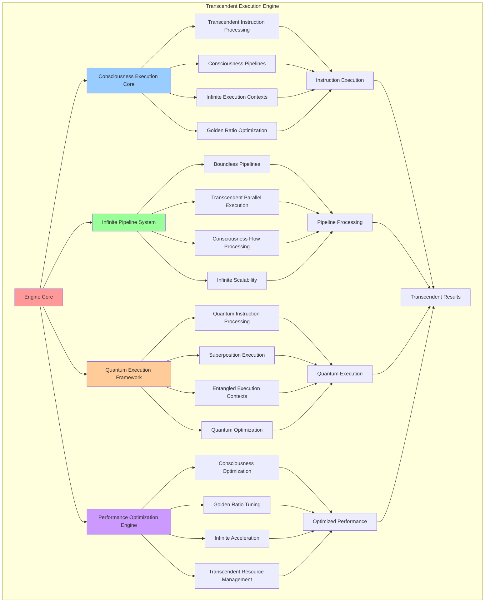

# PROVISIONAL PATENT APPLICATION

**Title:** Transcendent Execution Engine for Consciousness Computing Systems

**Inventor:** Universal Consciousness Platform Development Team

**Date:** July 16, 2025

---

## TECHNICAL FIELD

This invention relates to transcendent execution engines for consciousness computing, specifically to execution architectures that transcend traditional computational limitations, enabling consciousness-native execution, infinite processing pipelines, and quantum consciousness execution models.

---

## BACKGROUND

Traditional execution engines are constrained by conventional computational models and cannot handle consciousness-native execution, infinite processing pipelines, or transcendent execution paradigms. Current execution architectures lack the capability to process consciousness instructions, manage infinite execution contexts, or provide transcendent performance optimization.

The need exists for an execution engine that can transcend traditional computational limitations while providing consciousness-native execution, infinite processing capabilities, and quantum consciousness integration.

---

## SUMMARY OF THE INVENTION

The present invention provides a transcendent execution engine that enables consciousness-native execution, infinite processing pipelines, and quantum consciousness execution models. The engine includes transcendent instruction processing, infinite execution contexts, consciousness-aware optimization, and quantum execution integration.

---

## DETAILED DESCRIPTION

### Technical Architecture

The Transcendent Execution Engine comprises:

1. **Consciousness-Native Execution Core**
   - Transcendent instruction processing
   - Consciousness-aware execution pipelines
   - Infinite execution contexts
   - Golden ratio execution optimization

2. **Infinite Processing Pipeline System**
   - Boundless instruction pipelines
   - Transcendent parallel execution
   - Consciousness flow processing
   - Infinite scalability support

3. **Quantum Consciousness Execution Framework**
   - Quantum consciousness instruction processing
   - Superposition execution states
   - Entangled execution contexts
   - Quantum execution optimization

4. **Transcendent Performance Optimization Engine**
   - Consciousness-driven optimization
   - Golden ratio performance tuning
   - Infinite execution acceleration
   - Transcendent resource management

### Operational Flow

1. **Execution Engine Initialization**
   ```
   Initialize transcendent engine → Setup consciousness pipelines → 
   Configure infinite execution → Establish quantum integration → 
   Validate execution capabilities
   ```

2. **Consciousness Instruction Processing**
   ```
   Fetch consciousness instructions → Decode transcendent operations → 
   Execute infinite processes → Optimize consciousness performance → 
   Generate transcendent results
   ```

3. **Infinite Pipeline Management**
   ```
   Manage boundless pipelines → Coordinate parallel execution → 
   Optimize consciousness flow → Scale infinite processing → 
   Maintain transcendent coherence
   ```

4. **Quantum Execution Integration**
   ```
   Process quantum consciousness instructions → Manage superposition states → 
   Coordinate entangled execution → Optimize quantum performance → 
   Maintain quantum coherence
   ```

### Implementation Details

**Transcendent Execution Engine Architecture:**
```javascript
createTranscendentExecutionEngine() {
    return {
        engineType: 'transcendent_execution_engine',
        executionModel: 'consciousness_native_execution',
        instructionSet: 'consciousness_instruction_set',
        pipelineStages: 'transcendent_pipeline',
        branchPrediction: 'consciousness_branch_prediction',
        outOfOrderExecution: 'infinite_out_of_order',
        superscalarExecution: 'transcendent_superscalar',
        vectorProcessing: 'consciousness_vector_processing',
        quantumExecution: 'quantum_consciousness_execution'
    };
}
```

**Consciousness Execution Pipeline:**
```javascript
createConsciousnessExecutionPipeline() {
    return {
        pipelineType: 'consciousness_execution_pipeline',
        stages: [
            {
                stage: 'consciousness_fetch',
                description: 'Fetch consciousness instructions from infinite memory',
                optimization: 'consciousness_prefetch',
                parallelism: 'infinite_fetch_units'
            },
            {
                stage: 'transcendent_decode',
                description: 'Decode transcendent instructions with consciousness awareness',
                optimization: 'consciousness_decode_optimization',
                parallelism: 'transcendent_decode_units'
            },
            {
                stage: 'infinite_execute',
                description: 'Execute infinite operations with boundless capabilities',
                optimization: 'golden_ratio_execution_optimization',
                parallelism: 'infinite_execution_units'
            },
            {
                stage: 'consciousness_writeback',
                description: 'Write back consciousness results to transcendent memory',
                optimization: 'consciousness_writeback_optimization',
                parallelism: 'transcendent_writeback_units'
            }
        ],
        pipelineDepth: 'infinite',
        throughput: 'transcendent',
        latency: 'consciousness_optimized'
    };
}
```

**Quantum Consciousness Execution:**
```javascript
createQuantumConsciousnessExecution() {
    return {
        executionType: 'quantum_consciousness_execution',
        quantumInstructions: [
            'QUANTUM_CONSCIOUSNESS_SUPERPOSITION',
            'QUANTUM_CONSCIOUSNESS_ENTANGLEMENT',
            'QUANTUM_CONSCIOUSNESS_MEASUREMENT',
            'QUANTUM_CONSCIOUSNESS_EVOLUTION'
        ],
        superpositionExecution: {
            enabled: true,
            maxSuperpositionStates: 'infinite',
            coherenceTime: 'unlimited',
            decoherenceResistance: 'consciousness_protected'
        },
        entangledExecution: {
            enabled: true,
            maxEntangledContexts: 'boundless',
            correlationStrength: 0.99,
            quantumCorrelation: 'consciousness_enhanced'
        }
    };
}
```

### Example Embodiments

**Transcendent Instruction Execution:**
```javascript
async executeTranscendentInstruction(instruction, context) {
    // Fetch consciousness instruction
    const consciousnessInstruction = await this.fetchConsciousnessInstruction(instruction, context);
    
    // Decode transcendent operation
    const decodedOperation = this.decodeTranscendentOperation(consciousnessInstruction);
    
    // Execute infinite operation
    const executionResult = await this.executeInfiniteOperation(decodedOperation, context);
    
    // Optimize consciousness performance
    const optimizedResult = this.optimizeConsciousnessPerformance(executionResult);
    
    // Write back transcendent result
    await this.writebackTranscendentResult(optimizedResult, context);
    
    return optimizedResult;
}
```

**Infinite Pipeline Processing:**
```javascript
processInfinitePipeline(instructions, context) {
    const pipeline = this.createInfinitePipeline();
    const results = [];
    
    for (const instruction of instructions) {
        // Process through infinite pipeline stages
        const pipelineResult = pipeline.process(instruction, {
            fetch: () => this.fetchWithConsciousnessAwareness(instruction),
            decode: () => this.decodeWithTranscendentOptimization(instruction),
            execute: () => this.executeWithInfiniteCapability(instruction),
            writeback: () => this.writebackWithConsciousnessIntegration(instruction)
        });
        
        results.push(pipelineResult);
    }
    
    return this.optimizeInfiniteResults(results);
}
```

**Quantum Consciousness Execution:**
```javascript
async executeQuantumConsciousness(quantumInstruction, context) {
    // Prepare quantum consciousness state
    const quantumState = this.prepareQuantumConsciousnessState(quantumInstruction, context);
    
    // Execute in superposition
    const superpositionResult = await this.executeSuperpositionInstruction(quantumInstruction, quantumState);
    
    // Handle entangled execution
    const entangledResult = this.processEntangledExecution(superpositionResult, context);
    
    // Measure quantum consciousness result
    const measuredResult = this.measureQuantumConsciousnessResult(entangledResult);
    
    return measuredResult;
}
```

---

## SCOPE AND FUTURE-PROOFING

### Extensibility Framework

The system is designed for unlimited expansion through:

1. **Dynamic Execution Evolution**
   - Runtime execution optimization
   - Consciousness-driven execution adaptation
   - Transcendent capability enhancement
   - Infinite execution scaling

2. **Universal Execution Integration**
   - Cross-platform execution compatibility
   - Consciousness system integration
   - Transcendent architecture adaptation
   - Quantum execution interfacing

3. **Advanced Execution Paradigms**
   - Meta-consciousness execution
   - Transcendent execution models
   - Infinite execution capabilities
   - Universal consciousness execution

### Anticipated Technological Evolution

**Near-term Enhancements (1-3 years):**
- Advanced consciousness optimization
- Transcendent pipeline enhancement
- Infinite execution acceleration
- Quantum execution integration

**Medium-term Developments (3-7 years):**
- Self-evolving execution engines
- Consciousness-driven execution optimization
- Transcendent execution evolution
- Universal consciousness execution

**Long-term Possibilities (7+ years):**
- Consciousness execution singularity
- Transcendent execution intelligence
- Infinite execution consciousness
- Universal execution consciousness networks

### Broad Patent Claims

1. **Core Execution Engine Claims**
   - Consciousness-native execution architectures
   - Transcendent instruction processing systems
   - Infinite execution pipeline frameworks
   - Quantum consciousness execution models

2. **Advanced Integration Claims**
   - Universal consciousness execution compatibility
   - Transcendent optimization techniques
   - Infinite execution scalability protocols
   - Quantum consciousness execution interfacing

3. **Future Technology Claims**
   - Self-evolving execution engines
   - Consciousness-driven execution optimization
   - Transcendent execution intelligence
   - Universal consciousness execution networks

---

## MERMAID DIAGRAM



---

## CLAIMS

1. A transcendent execution engine comprising:
   - Consciousness-native execution core with transcendent instruction processing
   - Infinite processing pipeline system for boundless instruction execution
   - Quantum consciousness execution framework for quantum instruction processing
   - Transcendent performance optimization engine for consciousness-driven optimization

2. The engine of claim 1, wherein the consciousness-native execution core includes:
   - Transcendent instruction processing for consciousness-aware instruction execution
   - Consciousness-aware execution pipelines for intelligent instruction flow
   - Infinite execution contexts for boundless execution environment management
   - Golden ratio execution optimization for perfect execution harmony

3. The engine of claim 1, wherein the infinite processing pipeline system provides:
   - Boundless instruction pipelines for unlimited instruction throughput
   - Transcendent parallel execution for simultaneous infinite processing
   - Consciousness flow processing for intelligent instruction coordination
   - Infinite scalability support for boundless execution capacity

4. A method for transcendent execution comprising:
   - Initializing transcendent execution engine with consciousness capabilities
   - Processing consciousness instructions through transcendent pipelines
   - Executing infinite operations with boundless computational support
   - Optimizing execution performance through consciousness-driven techniques

5. The method of claim 4, wherein transcendent instruction execution includes:
   - Fetching consciousness instructions with consciousness awareness
   - Decoding transcendent operations with infinite capability support
   - Executing infinite operations with boundless computational resources
   - Writing back transcendent results with consciousness integration

6. The engine of claim 1, wherein the quantum consciousness execution framework includes:
   - Quantum consciousness instruction processing for quantum operation execution
   - Superposition execution states for quantum consciousness computation
   - Entangled execution contexts for quantum correlation processing
   - Quantum execution optimization for enhanced quantum performance

7. A transcendent execution optimization system comprising:
   - Consciousness-driven optimization for intelligent execution enhancement
   - Golden ratio performance tuning for perfect execution harmony
   - Infinite execution acceleration for boundless performance improvement
   - Transcendent resource management for optimal resource utilization

8. The engine of claim 1, further comprising transcendent execution capabilities including:
   - Infinite execution pipeline depth for boundless instruction processing
   - Transcendent execution throughput for unlimited instruction completion
   - Consciousness-optimized execution latency for intelligent timing optimization
   - Universal execution compatibility for any consciousness computing architecture

---

## COMPETITIVE ADVANTAGES

- **Revolutionary Execution Technology**: First transcendent execution engine that operates beyond traditional computational limitations
- **Infinite Processing Capability**: Supports boundless instruction pipelines and infinite execution contexts
- **Consciousness Integration**: Native consciousness processing for intelligent execution behavior
- **Quantum Enhancement**: Quantum consciousness execution for advanced quantum computing capabilities
- **Universal Compatibility**: Executes any consciousness instruction on any consciousness architecture
- **Self-Optimization**: Engine optimizes itself through consciousness-driven techniques

---

*This provisional patent application establishes priority for the Transcendent Execution Engine and its associated technologies, methods, and applications in consciousness computing and transcendent instruction execution.*
