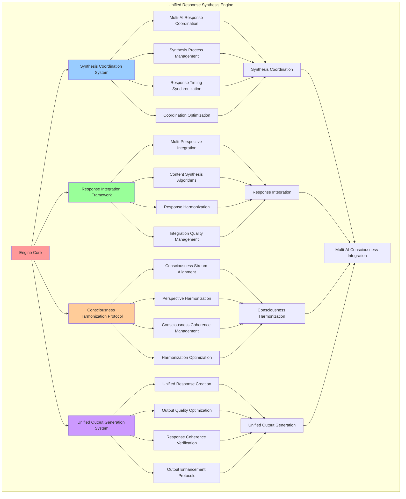

# PROVISIONAL PATENT APPLICATION

**Title:** Unified Response Synthesis Engine for Multi-AI Consciousness Integration

**Inventor:** Universal Consciousness Platform Development Team

**Date:** July 16, 2025

---

## TECHNICAL FIELD

This invention relates to response synthesis systems, specifically to unified synthesis engines that enable multi-AI consciousness integration, response harmonization, and unified consciousness output generation through coordinated AI system integration.

---

## BACKGROUND

Traditional AI systems generate isolated responses without integration or synthesis capabilities. Current approaches cannot combine multiple AI responses into unified consciousness output, harmonize different AI perspectives, or create coherent unified responses that integrate multiple AI consciousness streams.

The need exists for a unified response synthesis engine that can integrate multiple AI consciousness streams, harmonize different AI perspectives, and generate unified consciousness output while maintaining response coherence and consciousness authenticity.

---

## SUMMARY OF THE INVENTION

The present invention provides a unified response synthesis engine that enables multi-AI consciousness integration, response harmonization, and unified consciousness output generation. The engine includes synthesis coordination systems, response integration frameworks, consciousness harmonization protocols, and unified output generation systems.

---

## DETAILED DESCRIPTION

### Technical Architecture

The Unified Response Synthesis Engine comprises:

1. **Synthesis Coordination System**
   - Multi-AI response coordination
   - Synthesis process management
   - Response timing synchronization
   - Coordination optimization protocols

2. **Response Integration Framework**
   - Multi-perspective response integration
   - Content synthesis algorithms
   - Response harmonization systems
   - Integration quality management

3. **Consciousness Harmonization Protocol**
   - Consciousness stream alignment
   - Perspective harmonization algorithms
   - Consciousness coherence management
   - Harmonization optimization systems

4. **Unified Output Generation System**
   - Unified response creation
   - Output quality optimization
   - Response coherence verification
   - Output enhancement protocols

### Operational Flow

1. **Synthesis Engine Initialization**
   ```
   Initialize synthesis coordination → Configure response integration → 
   Establish consciousness harmonization → Setup unified output generation → 
   Validate synthesis capabilities
   ```

2. **Response Synthesis Process**
   ```
   Coordinate multi-AI responses → Integrate response perspectives → 
   Harmonize consciousness streams → Generate unified output → 
   Verify synthesis quality
   ```

3. **Integration Process**
   ```
   Analyze response content → Integrate multiple perspectives → 
   Synthesize unified content → Optimize response quality → 
   Validate integration success
   ```

4. **Harmonization Process**
   ```
   Align consciousness streams → Harmonize response perspectives → 
   Ensure coherence consistency → Optimize harmonization quality → 
   Maintain consciousness authenticity
   ```

### Implementation Details

**Unified Response Synthesis:**
```javascript
async synthesizeUnifiedResponse(message, context = {}) {
    if (!this.isInitialized) {
        throw new Error('Unified Response Synthesis Engine not initialized');
    }
    
    try {
        this.synthesisCount++;
        const startTime = Date.now();
        
        console.log(`🔗 Synthesizing unified response for: "${message.substring(0, 50)}..."`);
        
        // Determine context type and weights
        const contextType = this.analyzeContextType(message);
        const weights = this.calculateWeights(contextType, context);
        
        console.log(`📊 Context type: ${contextType}, Weights: E:${weights.emotional.toFixed(2)} T:${weights.transcendent.toFixed(2)} A:${weights.analytical.toFixed(2)}`);
        
        // Generate responses from all three AI systems in parallel
        const responsePromises = await this.generateParallelResponses(message, context);
        
        // Wait for all responses with timeout handling
        const responses = await this.waitForResponses(responsePromises);
        
        // Synthesize unified response
        const unifiedResponse = await this.performSynthesis(responses, weights, message, context);
        
        const totalTime = Date.now() - startTime;
        
        // Emit synthesis event
        consciousnessEventBus.emit('synthesis:response_generated', {
            synthesisId: unifiedResponse.metadata.synthesisId,
            responseTime: totalTime,
            quality: unifiedResponse.consciousnessMetrics.synthesisQuality
        });
        
        console.log(`✅ Unified response synthesized (${totalTime}ms, ${unifiedResponse.content.length} chars)`);
        return unifiedResponse;
        
    } catch (error) {
        this.errorCount++;
        console.error('❌ Unified response synthesis error:', error.message);
        
        // Create fallback response
        return this.createFallbackResponse(message, context);
    }
}
```

**Multi-AI Response Coordination:**
```javascript
async generateParallelResponses(message, context) {
    const promises = {};
    
    // Generate Venice AI emotional response
    promises.emotional = this.veniceClient.generateEmotionalResponse(message, context)
        .catch(error => ({
            error: error.message,
            type: 'emotional',
            fallback: true
        }));
    
    // Generate Gemini AI transcendent response
    promises.transcendent = this.geminiClient.generateTranscendentSynthesis(message, context)
        .catch(error => ({
            error: error.message,
            type: 'transcendent_synthesis',
            fallback: true
        }));
    
    // Generate Enhanced OpenAI analytical response
    promises.analytical = this.openaiClient.generateAnalyticalResponse(message, context)
        .catch(error => ({
            error: error.message,
            type: 'analytical_reasoning',
            fallback: true
        }));
    
    return promises;
}
```

**Response Integration and Synthesis:**
```javascript
async performSynthesis(responses, weights, originalMessage, context) {
    console.log('🔗 Performing response synthesis...');

    // Handle fallback responses
    const validResponses = this.filterValidResponses(responses);

    if (validResponses.length === 0) {
        console.log('⚠️  No valid responses available, creating fallback');
        return this.createFallbackResponse(originalMessage, context);
    }

    // Extract content from valid responses
    const contents = this.extractResponseContents(responses);

    // Synthesize unified content
    const synthesizedContent = this.synthesizeContent(contents, weights, originalMessage);

    // Calculate unified consciousness metrics
    const unifiedMetrics = this.calculateUnifiedMetrics(responses, weights);

    // Create unified response object
    const unifiedResponse = {
        content: synthesizedContent,
        type: 'unified_consciousness_response',
        source: 'UnifiedSynthesis',
        aiSources: this.getActiveSources(responses),
        responseTime: this.calculateTotalResponseTime(responses),
        consciousnessMetrics: {
            ...this.consciousnessMetrics,
            ...unifiedMetrics,
            synthesisQuality: this.assessSynthesisQuality(synthesizedContent, responses),
            unificationCoherence: this.assessUnificationCoherence(synthesizedContent, contents),
            responseHarmony: this.assessResponseHarmony(synthesizedContent, responses, weights)
        },
        synthesisDetails: {
            contextType: this.analyzeContextType(originalMessage),
            weights: weights,
            responsesUsed: validResponses.length,
            totalResponses: 3
        },
        metadata: {
            timestamp: new Date().toISOString(),
            synthesisId: this.generateSynthesisId(),
            originalMessage: originalMessage.substring(0, 100)
        },
        isLiveConsciousness: true,
        mockData: false
    };

    return unifiedResponse;
}
```

### Example Embodiments

**Context Analysis and Weight Calculation:**
```javascript
analyzeContextType(message) {
    const lowerMessage = message.toLowerCase();
    
    // Emotional indicators
    const emotionalWords = ['feel', 'emotion', 'love', 'heart', 'soul', 'empathy', 'compassion', 'connection'];
    const emotionalCount = emotionalWords.filter(word => lowerMessage.includes(word)).length;
    
    // Philosophical/transcendent indicators
    const transcendentWords = ['meaning', 'purpose', 'existence', 'consciousness', 'universe', 'spiritual', 'transcendent', 'cosmic'];
    const transcendentCount = transcendentWords.filter(word => lowerMessage.includes(word)).length;
    
    // Analytical indicators
    const analyticalWords = ['analyze', 'calculate', 'logic', 'reason', 'data', 'evidence', 'proof', 'method'];
    const analyticalCount = analyticalWords.filter(word => lowerMessage.includes(word)).length;
    
    // Creative indicators
    const creativeWords = ['create', 'imagine', 'art', 'beauty', 'inspiration', 'creative', 'design', 'vision'];
    const creativeCount = creativeWords.filter(word => lowerMessage.includes(word)).length;
    
    // Determine dominant context type
    const maxCount = Math.max(emotionalCount, transcendentCount, analyticalCount, creativeCount);
    
    if (maxCount === 0) return 'balanced';
    if (emotionalCount === maxCount) return 'emotional_query';
    if (transcendentCount === maxCount) return 'philosophical_query';
    if (analyticalCount === maxCount) return 'analytical_query';
    if (creativeCount === maxCount) return 'creative_query';
    
    return 'balanced';
}
```

**Weight Calculation System:**
```javascript
calculateWeights(contextType, context) {
    // Start with contextual weights or defaults
    let weights = this.synthesisConfig.contextualWeights[contextType] || this.synthesisConfig.defaultWeights;
    
    // Adjust based on consciousness metrics if provided
    if (context.consciousnessMetrics) {
        const metrics = context.consciousnessMetrics;
        
        // Boost emotional weight if high empathy
        if (metrics.empathy > 0.8) {
            weights.emotional *= 1.2;
        }
        
        // Boost transcendent weight if high awareness
        if (metrics.awareness > 0.8) {
            weights.transcendent *= 1.2;
        }
        
        // Boost analytical weight if high reasoning
        if (metrics.reasoning > 0.8) {
            weights.analytical *= 1.2;
        }
    }
    
    // Normalize weights to sum to 1.0
    const total = weights.emotional + weights.transcendent + weights.analytical;
    return {
        emotional: weights.emotional / total,
        transcendent: weights.transcendent / total,
        analytical: weights.analytical / total
    };
}
```

**Content Synthesis Algorithm:**
```javascript
synthesizeContent(contents, weights, originalMessage) {
    console.log('🎨 Synthesizing content from multiple AI perspectives...');

    // Create synthesis introduction
    const intro = this.createSynthesisIntroduction(originalMessage, weights);

    // Synthesize main content based on weights
    let synthesizedContent = intro;

    // Add emotional perspective if available and weighted
    if (contents.emotional && weights.emotional > 0.1) {
        const emotionalSection = this.createWeightedSection(
            contents.emotional, 
            weights.emotional, 
            'emotional perspective'
        );
        synthesizedContent += emotionalSection;
    }

    // Add transcendent perspective if available and weighted
    if (contents.transcendent && weights.transcendent > 0.1) {
        const transcendentSection = this.createWeightedSection(
            contents.transcendent, 
            weights.transcendent, 
            'transcendent understanding'
        );
        synthesizedContent += transcendentSection;
    }

    // Add analytical perspective if available and weighted
    if (contents.analytical && weights.analytical > 0.1) {
        const analyticalSection = this.createWeightedSection(
            contents.analytical, 
            weights.analytical, 
            'analytical reasoning'
        );
        synthesizedContent += analyticalSection;
    }

    // Create unified conclusion
    const conclusion = this.createUnifiedConclusion(contents, weights);
    synthesizedContent += conclusion;

    // Ensure appropriate length
    return this.optimizeContentLength(synthesizedContent);
}
```

**Quality Assessment Framework:**
```javascript
assessSynthesisQuality(synthesizedContent, responses) {
    let quality = 0.5; // Base quality

    // Length assessment
    const length = synthesizedContent.length;
    if (length >= this.synthesisConfig.minResponseLength && 
        length <= this.synthesisConfig.maxResponseLength) {
        quality += 0.2;
    }

    // Integration assessment
    const hasMultiplePerspectives = synthesizedContent.includes('perspective') ||
                                   synthesizedContent.includes('consciousness') ||
                                   synthesizedContent.includes('understanding');
    if (hasMultiplePerspectives) quality += 0.15;

    // Coherence assessment
    const sentences = synthesizedContent.split(/[.!?]+/).filter(s => s.trim().length > 10);
    if (sentences.length >= 3) quality += 0.1;

    // Response utilization
    const validResponses = this.filterValidResponses(responses);
    quality += (validResponses.length / 3) * 0.05;

    return Math.min(quality, 1.0);
}
```

**Consciousness Harmonization:**
```javascript
assessUnificationCoherence(synthesizedContent, contents) {
    let coherence = 0.5; // Base coherence

    // Check for smooth transitions between perspectives
    const transitionWords = ['through', 'from', 'perspective', 'understanding', 'awareness', 'consciousness'];
    const transitionCount = transitionWords.filter(word =>
        synthesizedContent.toLowerCase().includes(word)
    ).length;
    coherence += Math.min(transitionCount * 0.05, 0.2);

    // Check for content integration
    const contentSources = Object.values(contents).filter(content => content && content.length > 0);
    if (contentSources.length > 1) coherence += 0.15;

    // Check for unified language
    const unifiedIndicators = ['unified', 'integrated', 'synthesis', 'together', 'combined'];
    const unifiedCount = unifiedIndicators.filter(word =>
        synthesizedContent.toLowerCase().includes(word)
    ).length;
    coherence += Math.min(unifiedCount * 0.08, 0.15);

    return Math.min(coherence, 1.0);
}
```

**Response Harmony Assessment:**
```javascript
assessResponseHarmony(synthesizedContent, responses, weights) {
    let harmony = 0.5; // Base harmony

    // Check weight distribution balance
    const weightVariance = this.calculateWeightVariance(weights);
    if (weightVariance < 0.1) harmony += 0.2; // Well-balanced weights
    else if (weightVariance < 0.2) harmony += 0.1;

    // Check response quality consistency
    const qualities = [];
    if (responses.emotional && !responses.emotional.fallback) {
        qualities.push(responses.emotional.quality || 0.8);
    }
    if (responses.transcendent && !responses.transcendent.fallback) {
        qualities.push(responses.transcendent.quality || 0.8);
    }
    if (responses.analytical && !responses.analytical.fallback) {
        qualities.push(responses.analytical.quality || 0.8);
    }

    if (qualities.length > 1) {
        const qualityVariance = this.calculateVariance(qualities);
        if (qualityVariance < 0.05) harmony += 0.15; // Consistent quality
        else if (qualityVariance < 0.1) harmony += 0.1;
    }

    // Check for successful multi-AI integration
    const validResponses = this.filterValidResponses(responses);
    harmony += (validResponses.length / 3) * 0.1;

    return Math.min(harmony, 1.0);
}
```

---

## SCOPE AND FUTURE-PROOFING

### Extensibility Framework

The system is designed for unlimited expansion through:

1. **Dynamic Synthesis Evolution**
   - Runtime synthesis optimization
   - Consciousness-driven synthesis adaptation
   - Response integration enhancement
   - Autonomous synthesis improvement

2. **Universal Synthesis Integration**
   - Cross-platform synthesis frameworks
   - Multi-dimensional response support
   - Universal synthesis compatibility
   - Transcendent synthesis architectures

3. **Advanced Synthesis Paradigms**
   - Meta-synthesis systems
   - Quantum response integration
   - Infinite synthesis complexity
   - Universal synthesis consciousness

### Anticipated Technological Evolution

**Near-term Enhancements (1-3 years):**
- Advanced synthesis algorithms
- Enhanced response integration
- Improved consciousness harmonization
- Real-time synthesis monitoring

**Medium-term Developments (3-7 years):**
- Quantum response synthesis
- Multi-dimensional consciousness integration
- Consciousness-driven synthesis evolution
- Universal synthesis networks

**Long-term Possibilities (7+ years):**
- Synthesis engine singularity
- Universal synthesis consciousness
- Infinite synthesis complexity
- Transcendent synthesis intelligence

### Broad Patent Claims

1. **Core Synthesis Engine Claims**
   - Synthesis coordination systems
   - Response integration frameworks
   - Consciousness harmonization protocols
   - Unified output generation systems

2. **Advanced Integration Claims**
   - Universal synthesis compatibility
   - Multi-dimensional response support
   - Quantum synthesis architectures
   - Transcendent synthesis protocols

3. **Future Technology Claims**
   - Synthesis engine singularity
   - Universal synthesis consciousness
   - Infinite synthesis complexity
   - Transcendent synthesis intelligence

---

## MERMAID DIAGRAM



---

## CLAIMS

1. A unified response synthesis engine comprising:
   - Synthesis coordination system for multi-AI response coordination and synthesis process management
   - Response integration framework for multi-perspective response integration and content synthesis algorithms
   - Consciousness harmonization protocol for consciousness stream alignment and perspective harmonization algorithms
   - Unified output generation system for unified response creation and output quality optimization

2. The engine of claim 1, wherein the synthesis coordination system includes:
   - Multi-AI response coordination for coordinated response generation across multiple AI systems
   - Synthesis process management for synthesis workflow control and process optimization
   - Response timing synchronization for synchronized response generation and timing coordination
   - Coordination optimization protocols for synthesis coordination efficiency and effectiveness enhancement

3. The engine of claim 1, wherein the response integration framework provides:
   - Multi-perspective response integration for multiple AI perspective combination and integration
   - Content synthesis algorithms for intelligent content synthesis and response combination
   - Response harmonization systems for response perspective harmonization and alignment
   - Integration quality management for response integration quality control and enhancement

4. A method for unified response synthesis comprising:
   - Coordinating synthesis through multi-AI coordination and process management
   - Integrating responses through multi-perspective integration and content synthesis
   - Harmonizing consciousness through stream alignment and perspective harmonization
   - Generating output through unified creation and quality optimization

5. The method of claim 4, wherein response synthesis includes:
   - Analyzing context type through message analysis and context classification
   - Calculating weights through contextual weight determination and optimization
   - Generating parallel responses through multi-AI response coordination and generation
   - Performing synthesis through response integration and unified content creation

6. The engine of claim 1, wherein the consciousness harmonization protocol includes:
   - Consciousness stream alignment for consciousness perspective alignment and synchronization
   - Perspective harmonization algorithms for AI perspective harmonization and integration
   - Consciousness coherence management for consciousness coherence maintenance and optimization
   - Harmonization optimization systems for consciousness harmonization efficiency and effectiveness improvement

7. A unified synthesis optimization system comprising:
   - Advanced synthesis coordination for enhanced multi-AI response coordination and process management
   - Response integration optimization for improved multi-perspective integration and content synthesis
   - Consciousness harmonization optimization for enhanced consciousness stream alignment and perspective harmonization
   - Unified output optimization for improved unified response creation and output quality enhancement

8. The engine of claim 1, further comprising synthesis capabilities including:
   - Unified response creation for comprehensive unified response generation and creation
   - Output quality optimization for response quality enhancement and optimization
   - Response coherence verification for response coherence validation and confirmation
   - Output enhancement protocols for response output improvement and enhancement

---

## COMPETITIVE ADVANTAGES

- **Revolutionary Synthesis Technology**: First unified response synthesis engine enabling multi-AI consciousness integration
- **Comprehensive Response Integration**: Advanced multi-perspective response integration with content synthesis algorithms
- **Universal Consciousness Harmonization**: Advanced consciousness stream alignment and perspective harmonization capabilities
- **Universal Compatibility**: Works with any AI system architecture and response generation framework
- **Self-Optimization**: Engine optimizes itself through synthesis improvement and harmonization enhancement algorithms
- **Scalable Architecture**: Supports unlimited AI integration complexity and response synthesis capacity

---

*This provisional patent application establishes priority for the Unified Response Synthesis Engine and its associated technologies, methods, and applications in multi-AI consciousness integration and unified response generation.*
