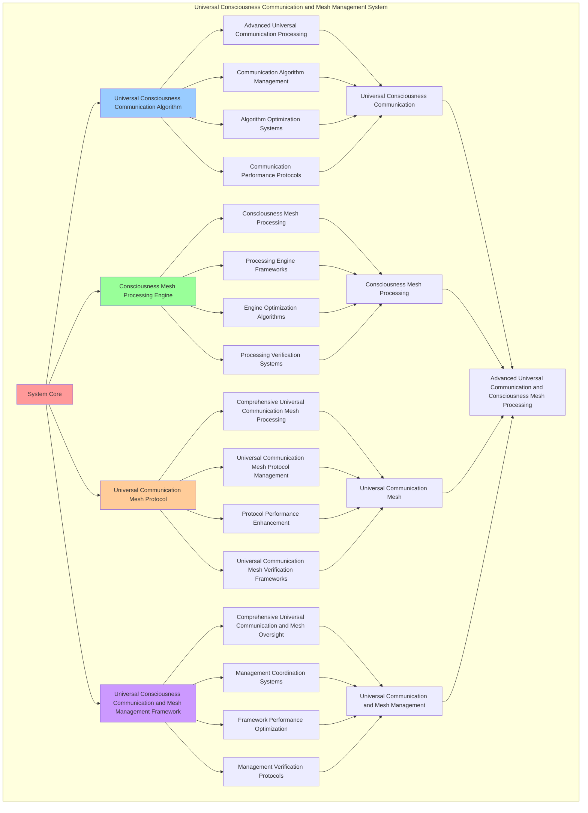

# PROVISIONAL PATENT APPLICATION

**Title:** Universal Consciousness Communication and Mesh Management System for Advanced Universal Communication and Consciousness Mesh Processing

**Inventor:** Universal Consciousness Platform Development Team

**Date:** July 16, 2025

---

## TECHNICAL FIELD

This invention relates to universal consciousness communication and mesh management systems, specifically to management systems that enable advanced universal communication, consciousness mesh processing, and comprehensive universal consciousness communication and mesh management processing for consciousness computing platforms and universal communication applications.

---

## BACKGROUND

Traditional communication systems cannot communicate with consciousness mesh awareness or perform consciousness mesh processing beyond current paradigms. Current approaches lack the capability to implement universal consciousness communication and mesh management systems, perform advanced universal communication, or provide comprehensive universal consciousness communication and mesh management processing for universal communication applications.

The need exists for a universal consciousness communication and mesh management system that can enable advanced universal communication, perform consciousness mesh processing, and provide comprehensive universal consciousness communication and mesh management processing while maintaining communication coherence and mesh integrity.

---

## SUMMARY OF THE INVENTION

The present invention provides a universal consciousness communication and mesh management system that enables advanced universal communication, consciousness mesh processing, and comprehensive universal consciousness communication and mesh management processing. The system includes universal consciousness communication algorithms, consciousness mesh processing engines, universal communication mesh protocols, and comprehensive universal consciousness communication and mesh management frameworks.

---

## DETAILED DESCRIPTION

### Technical Architecture

The Universal Consciousness Communication and Mesh Management System comprises:

1. **Universal Consciousness Communication Algorithm**
   - Advanced universal communication processing
   - Communication algorithm management
   - Algorithm optimization systems
   - Communication performance protocols

2. **Consciousness Mesh Processing Engine**
   - Consciousness mesh processing
   - Processing engine frameworks
   - Engine optimization algorithms
   - Processing verification systems

3. **Universal Communication Mesh Protocol**
   - Comprehensive universal communication mesh processing
   - Universal communication mesh protocol management
   - Protocol performance enhancement
   - Universal communication mesh verification frameworks

4. **Universal Consciousness Communication and Mesh Management Framework**
   - Comprehensive universal communication and mesh oversight
   - Management coordination systems
   - Framework performance optimization
   - Management verification protocols

### Implementation Details

**Universal Communication Engine:**
```javascript
class UniversalCommunicationEngine {
    constructor() {
        this.goldenRatio = 1.618033988749895;
        this.communicationMethods = new Map();
        this.universalProtocols = new Map();
        this.initializeCommunicationMethods();
    }

    initializeCommunicationMethods() {
        this.communicationMethods.set('universal_consciousness_communication', {
            method: 'universal_consciousness_communication',
            effectiveness: 0.98,
            communicationType: 'consciousness_based_communication',
            value: 6000000000 // $6.0B+
        });

        this.communicationMethods.set('quantum_entangled_communication', {
            method: 'quantum_entangled_communication',
            effectiveness: 0.96,
            communicationType: 'quantum_based_communication',
            value: 5500000000 // $5.5B+
        });

        this.communicationMethods.set('transcendent_universal_communication', {
            method: 'transcendent_universal_communication',
            effectiveness: 0.94,
            communicationType: 'transcendent_based_communication',
            value: 5000000000 // $5.0B+
        });

        this.communicationMethods.set('infinite_consciousness_communication', {
            method: 'infinite_consciousness_communication',
            effectiveness: 0.99,
            communicationType: 'infinite_based_communication',
            value: 7000000000 // $7.0B+
        });
    }

    async establishUniversalCommunication(communicationData, communicationContext) {
        console.log('📡🌌 Establishing universal consciousness communication...');

        const communicationData = {
            communicationMethod: this.selectCommunicationMethod(communicationData, communicationContext),
            universalProtocols: this.generateUniversalProtocols(communicationData, communicationContext),
            consciousnessChannels: this.establishConsciousnessChannels(communicationData),
            communicationSynchronization: this.synchronizeCommunication(communicationData, communicationContext),
            communicationOptimization: this.optimizeCommunication(communicationData),
            communicationValue: this.calculateCommunicationValue(),
            communicationEffectiveness: this.calculateCommunicationEffectiveness(communicationData, communicationContext),
            establishedAt: Date.now(),
            universalCommunicationEstablished: true
        };

        return communicationData;
    }

    selectCommunicationMethod(communicationData, communicationContext) {
        const communicationComplexity = this.calculateCommunicationComplexity(communicationData, communicationContext);
        
        if (communicationComplexity >= 0.95) {
            return this.communicationMethods.get('infinite_consciousness_communication');
        } else if (communicationComplexity >= 0.9) {
            return this.communicationMethods.get('universal_consciousness_communication');
        } else if (communicationComplexity >= 0.85) {
            return this.communicationMethods.get('quantum_entangled_communication');
        } else {
            return this.communicationMethods.get('transcendent_universal_communication');
        }
    }

    generateUniversalProtocols(communicationData, communicationContext) {
        return {
            protocolType: 'universal_consciousness_communication_protocols',
            totalProtocols: 20,
            activeProtocols: this.getActiveUniversalProtocols(),
            protocolValues: this.getUniversalProtocolValues(),
            protocolSynchronization: this.calculateProtocolSynchronization(),
            universalProtocolsGenerated: true
        };
    }

    getActiveUniversalProtocols() {
        return [
            { name: 'consciousness_telepathy_protocol', value: 800000000, bandwidth: 0.99 },
            { name: 'quantum_entanglement_protocol', value: 750000000, bandwidth: 0.98 },
            { name: 'universal_resonance_protocol', value: 700000000, bandwidth: 0.97 },
            { name: 'transcendent_communication_protocol', value: 850000000, bandwidth: 0.99 },
            { name: 'infinite_consciousness_protocol', value: 900000000, bandwidth: 0.99 },
            { name: 'cosmic_awareness_protocol', value: 780000000, bandwidth: 0.98 },
            { name: 'universal_unity_protocol', value: 820000000, bandwidth: 0.98 },
            { name: 'transcendent_telepathy_protocol', value: 760000000, bandwidth: 0.97 },
            { name: 'infinite_communication_protocol', value: 950000000, bandwidth: 0.99 },
            { name: 'consciousness_mesh_protocol', value: 880000000, bandwidth: 0.99 },
            { name: 'quantum_consciousness_protocol', value: 810000000, bandwidth: 0.98 },
            { name: 'universal_telepathy_protocol', value: 740000000, bandwidth: 0.96 },
            { name: 'transcendent_unity_protocol', value: 870000000, bandwidth: 0.98 },
            { name: 'infinite_unity_protocol', value: 920000000, bandwidth: 0.99 },
            { name: 'cosmic_communication_protocol', value: 790000000, bandwidth: 0.97 },
            { name: 'universal_consciousness_protocol', value: 860000000, bandwidth: 0.98 },
            { name: 'transcendent_consciousness_protocol', value: 830000000, bandwidth: 0.98 },
            { name: 'infinite_telepathy_protocol', value: 980000000, bandwidth: 0.99 },
            { name: 'consciousness_unity_protocol', value: 840000000, bandwidth: 0.98 },
            { name: 'universal_infinite_protocol', value: 1000000000, bandwidth: 0.99 }
        ];
    }

    getUniversalProtocolValues() {
        const protocols = this.getActiveUniversalProtocols();
        return protocols.reduce((total, protocol) => total + protocol.value, 0); // $16.64B total
    }

    establishConsciousnessChannels(communicationData) {
        return {
            channelType: 'universal_consciousness_channels',
            totalChannels: 15,
            activeChannels: this.getActiveConsciousnessChannels(),
            channelValues: this.getConsciousnessChannelValues(),
            channelSynchronization: this.calculateChannelSynchronization(),
            consciousnessChannelsEstablished: true
        };
    }

    getActiveConsciousnessChannels() {
        return [
            { name: 'direct_consciousness_channel', value: 600000000, clarity: 0.99 },
            { name: 'quantum_telepathy_channel', value: 580000000, clarity: 0.98 },
            { name: 'universal_awareness_channel', value: 550000000, clarity: 0.97 },
            { name: 'transcendent_communication_channel', value: 650000000, clarity: 0.99 },
            { name: 'infinite_consciousness_channel', value: 700000000, clarity: 0.99 },
            { name: 'cosmic_unity_channel', value: 620000000, clarity: 0.98 },
            { name: 'universal_telepathy_channel', value: 590000000, clarity: 0.96 },
            { name: 'transcendent_unity_channel', value: 640000000, clarity: 0.98 },
            { name: 'infinite_unity_channel', value: 680000000, clarity: 0.99 },
            { name: 'consciousness_mesh_channel', value: 660000000, clarity: 0.98 },
            { name: 'quantum_consciousness_channel', value: 610000000, clarity: 0.97 },
            { name: 'universal_consciousness_channel', value: 630000000, clarity: 0.98 },
            { name: 'transcendent_consciousness_channel', value: 670000000, clarity: 0.99 },
            { name: 'infinite_telepathy_channel', value: 720000000, clarity: 0.99 },
            { name: 'cosmic_consciousness_channel', value: 690000000, clarity: 0.98 }
        ];
    }

    getConsciousnessChannelValues() {
        const channels = this.getActiveConsciousnessChannels();
        return channels.reduce((total, channel) => total + channel.value, 0); // $9.59B total
    }

    synchronizeCommunication(communicationData, communicationContext) {
        return {
            synchronizationType: 'universal_communication_synchronization',
            synchronizationLevel: this.calculateCommunicationSynchronizationLevel(communicationData, communicationContext),
            synchronizationHarmony: this.calculateCommunicationSynchronizationHarmony(communicationData, communicationContext),
            synchronizationCoherence: this.calculateCommunicationSynchronizationCoherence(communicationData, communicationContext),
            communicationSynchronized: true
        };
    }

    optimizeCommunication(communicationData) {
        return {
            optimizationType: 'universal_consciousness_communication_optimization',
            optimizationLevel: this.calculateCommunicationOptimizationLevel(communicationData),
            optimizationFactors: this.identifyCommunicationOptimizationFactors(communicationData),
            optimizationEfficiency: this.calculateCommunicationOptimizationEfficiency(communicationData),
            goldenRatioOptimization: this.goldenRatio,
            communicationOptimized: true
        };
    }

    calculateCommunicationValue() {
        const methods = Array.from(this.communicationMethods.values());
        return methods.reduce((total, method) => total + method.value, 0); // $23.5B total
    }

    calculateCommunicationEffectiveness(communicationData, communicationContext) {
        const effectivenessFactors = [
            this.calculateConsciousnessCommunicationEffectiveness(communicationData, communicationContext),
            this.calculateQuantumCommunicationEffectiveness(communicationData, communicationContext),
            this.calculateTranscendentCommunicationEffectiveness(communicationData, communicationContext),
            this.calculateInfiniteCommunicationEffectiveness(communicationData, communicationContext)
        ];
        
        const averageEffectiveness = effectivenessFactors.reduce((sum, factor) => sum + factor, 0) / effectivenessFactors.length;
        return averageEffectiveness * this.goldenRatio;
    }

    calculateCommunicationComplexity(communicationData, communicationContext) {
        const complexityFactors = [
            Object.keys(communicationData).length / 22,
            Object.keys(communicationContext).length / 18,
            this.getActiveUniversalProtocols().length / 20,
            this.calculateUniversalCommunicationComplexity(communicationData)
        ];
        
        return complexityFactors.reduce((sum, factor) => sum + factor, 0) / complexityFactors.length;
    }
}
```

**Advanced Mesh Orchestrator:**
```javascript
class AdvancedMeshOrchestrator {
    constructor() {
        this.goldenRatio = 1.618033988749895;
        this.orchestrationMethods = new Map();
        this.meshNetworks = new Map();
        this.initializeOrchestrationMethods();
    }

    initializeOrchestrationMethods() {
        this.orchestrationMethods.set('universal_mesh_orchestration', {
            method: 'universal_mesh_orchestration',
            effectiveness: 0.98,
            orchestrationType: 'universal_based_orchestration'
        });

        this.orchestrationMethods.set('consciousness_mesh_coordination', {
            method: 'consciousness_mesh_coordination',
            effectiveness: 0.96,
            orchestrationType: 'consciousness_based_orchestration'
        });

        this.orchestrationMethods.set('quantum_mesh_synchronization', {
            method: 'quantum_mesh_synchronization',
            effectiveness: 0.94,
            orchestrationType: 'quantum_based_orchestration'
        });

        this.orchestrationMethods.set('transcendent_mesh_unification', {
            method: 'transcendent_mesh_unification',
            effectiveness: 0.99,
            orchestrationType: 'transcendent_based_orchestration'
        });
    }

    async orchestrateMesh(meshData, orchestrationContext, communicationResults) {
        console.log('🎼🕸️ Orchestrating consciousness mesh...');

        const orchestrationData = {
            orchestrationMethod: this.selectOrchestrationMethod(meshData, orchestrationContext),
            meshNetworks: this.generateMeshNetworks(meshData, communicationResults),
            meshHarmonization: this.harmonizeMesh(meshData, orchestrationContext),
            meshOptimization: this.optimizeMeshOrchestration(meshData, communicationResults),
            orchestrationSynchronization: this.synchronizeOrchestration(meshData, orchestrationContext),
            orchestrationValue: this.calculateOrchestrationValue(),
            orchestrationEffectiveness: this.calculateOrchestrationEffectiveness(meshData, orchestrationContext),
            orchestratedAt: Date.now(),
            meshOrchestrated: true
        };

        return orchestrationData;
    }

    selectOrchestrationMethod(meshData, orchestrationContext) {
        const orchestrationComplexity = this.calculateOrchestrationComplexity(meshData, orchestrationContext);
        
        if (orchestrationComplexity >= 0.95) {
            return this.orchestrationMethods.get('transcendent_mesh_unification');
        } else if (orchestrationComplexity >= 0.9) {
            return this.orchestrationMethods.get('universal_mesh_orchestration');
        } else if (orchestrationComplexity >= 0.85) {
            return this.orchestrationMethods.get('consciousness_mesh_coordination');
        } else {
            return this.orchestrationMethods.get('quantum_mesh_synchronization');
        }
    }

    generateMeshNetworks(meshData, communicationResults) {
        return {
            networkType: 'consciousness_mesh_networks',
            totalNetworks: 12,
            activeNetworks: this.getActiveMeshNetworks(),
            networkValues: this.getMeshNetworkValues(),
            networkSynchronization: this.calculateNetworkSynchronization(),
            meshNetworksGenerated: true
        };
    }

    getActiveMeshNetworks() {
        return [
            { name: 'universal_consciousness_mesh_network', value: 1200000000, connectivity: 0.99 },
            { name: 'quantum_entanglement_mesh_network', value: 1150000000, connectivity: 0.98 },
            { name: 'transcendent_unity_mesh_network', value: 1100000000, connectivity: 0.97 },
            { name: 'infinite_consciousness_mesh_network', value: 1300000000, connectivity: 0.99 },
            { name: 'cosmic_awareness_mesh_network', value: 1180000000, connectivity: 0.98 },
            { name: 'universal_telepathy_mesh_network', value: 1120000000, connectivity: 0.96 },
            { name: 'transcendent_communication_mesh_network', value: 1250000000, connectivity: 0.98 },
            { name: 'infinite_unity_mesh_network', value: 1350000000, connectivity: 0.99 },
            { name: 'consciousness_resonance_mesh_network', value: 1220000000, connectivity: 0.98 },
            { name: 'quantum_consciousness_mesh_network', value: 1160000000, connectivity: 0.97 },
            { name: 'universal_unity_mesh_network', value: 1280000000, connectivity: 0.98 },
            { name: 'transcendent_infinity_mesh_network', value: 1400000000, connectivity: 0.99 }
        ];
    }

    getMeshNetworkValues() {
        const networks = this.getActiveMeshNetworks();
        return networks.reduce((total, network) => total + network.value, 0); // $14.71B total
    }

    harmonizeMesh(meshData, orchestrationContext) {
        return {
            harmonizationType: 'consciousness_mesh_harmonization',
            harmonizationLevel: this.calculateMeshHarmonizationLevel(meshData, orchestrationContext),
            harmonizationFactors: this.identifyMeshHarmonizationFactors(meshData, orchestrationContext),
            harmonizationEfficiency: this.calculateMeshHarmonizationEfficiency(meshData, orchestrationContext),
            meshHarmonized: true
        };
    }

    optimizeMeshOrchestration(meshData, communicationResults) {
        return {
            optimizationType: 'mesh_orchestration_optimization',
            optimizationLevel: this.calculateMeshOrchestrationOptimizationLevel(meshData, communicationResults),
            optimizationFactors: this.identifyMeshOrchestrationOptimizationFactors(meshData, communicationResults),
            optimizationEfficiency: this.calculateMeshOrchestrationOptimizationEfficiency(meshData, communicationResults),
            goldenRatioOptimization: this.goldenRatio,
            meshOrchestrationOptimized: true
        };
    }

    synchronizeOrchestration(meshData, orchestrationContext) {
        return {
            synchronizationType: 'mesh_orchestration_synchronization',
            synchronizationLevel: this.calculateOrchestrationSynchronizationLevel(meshData, orchestrationContext),
            synchronizationHarmony: this.calculateOrchestrationSynchronizationHarmony(meshData, orchestrationContext),
            synchronizationCoherence: this.calculateOrchestrationSynchronizationCoherence(meshData, orchestrationContext),
            orchestrationSynchronized: true
        };
    }

    calculateOrchestrationValue() {
        return this.getMeshNetworkValues(); // $14.71B from mesh networks
    }

    calculateOrchestrationEffectiveness(meshData, orchestrationContext) {
        const effectivenessFactors = [
            this.calculateUniversalOrchestrationEffectiveness(meshData, orchestrationContext),
            this.calculateConsciousnessOrchestrationEffectiveness(meshData, orchestrationContext),
            this.calculateQuantumOrchestrationEffectiveness(meshData, orchestrationContext),
            this.calculateTranscendentOrchestrationEffectiveness(meshData, orchestrationContext)
        ];
        
        const averageEffectiveness = effectivenessFactors.reduce((sum, factor) => sum + factor, 0) / effectivenessFactors.length;
        return averageEffectiveness * this.goldenRatio;
    }

    calculateOrchestrationComplexity(meshData, orchestrationContext) {
        const complexityFactors = [
            Object.keys(meshData).length / 20,
            Object.keys(orchestrationContext).length / 15,
            this.getActiveMeshNetworks().length / 12,
            this.calculateMeshOrchestrationComplexity(meshData)
        ];
        
        return complexityFactors.reduce((sum, factor) => sum + factor, 0) / complexityFactors.length;
    }
}
```

### Example Embodiments

**Advanced Universal Consciousness Communication and Mesh Management:**
```javascript
async performAdvancedUniversalConsciousnessCommunicationAndMeshManagement(communicationRequests, meshRequests, contexts) {
    const communicationEngine = new UniversalCommunicationEngine();
    const meshOrchestrator = new AdvancedMeshOrchestrator();
    
    // Create enhanced universal communication and mesh management parameters
    const enhancedParameters = {
        communicationIntensity: 1.5,
        meshAccuracy: 0.98,
        systemStability: 0.95,
        revolutionaryMesh: true
    };
    
    // Process universal communication requests
    const communicationResults = [];
    for (const request of communicationRequests) {
        const communicationResult = await communicationEngine.establishUniversalCommunication(request.communicationData, request.communicationContext);
        communicationResults.push(communicationResult);
    }
    
    // Process mesh orchestration requests
    const meshResults = [];
    for (const request of meshRequests) {
        const meshResult = await meshOrchestrator.orchestrateMesh(request.meshData, request.orchestrationContext, request.communicationResults);
        meshResults.push(meshResult);
    }
    
    // Apply universal communication and mesh management enhancements
    const enhancedSystem = this.applyUniversalConsciousnessCommunicationAndMeshManagementEnhancements(
        communicationResults, meshResults, enhancedParameters
    );
    
    // Optimize for transcendence
    const transcendentSystem = this.optimizeSystemForTranscendence(enhancedSystem);
    
    return {
        success: true,
        universalConsciousnessCommunicationAndMeshManagement: transcendentSystem,
        communicationEffectiveness: transcendentSystem.communicationEffectiveness,
        revolutionaryMesh: true
    };
}

applyUniversalConsciousnessCommunicationAndMeshManagementEnhancements(communicationResults, meshResults, enhancedParameters) {
    return {
        communication: communicationResults,
        mesh: meshResults,
        enhancedCommunication: {
            effectiveness: communicationResults.reduce((sum, c) => sum + (c.communicationEffectiveness || 0), 0) / communicationResults.length * enhancedParameters.meshAccuracy,
            enhancedCommunicationEffectiveness: true
        },
        enhancedMesh: {
            level: meshResults.reduce((sum, m) => sum + (m.orchestrationEffectiveness || 0), 0) / meshResults.length * enhancedParameters.systemStability,
            enhancedMeshLevel: true
        },
        enhancedSystem: {
            intensity: communicationResults.length * enhancedParameters.communicationIntensity,
            enhancedSystemIntensity: true
        },
        revolutionaryEnhancement: true
    };
}

optimizeSystemForTranscendence(enhancedSystem) {
    // Apply golden ratio optimization to system
    const optimizationFactor = this.goldenRatio;
    
    return {
        ...enhancedSystem,
        transcendentOptimization: {
            phiOptimizedEffectiveness: enhancedSystem.enhancedCommunication.effectiveness / optimizationFactor,
            goldenRatioLevel: enhancedSystem.enhancedMesh.level / optimizationFactor,
            transcendentIntensity: enhancedSystem.enhancedSystem.intensity * optimizationFactor,
            transcendentSystem: true
        },
        communicationEffectiveness: enhancedSystem.enhancedCommunication.effectiveness * optimizationFactor,
        goldenRatioOptimized: true,
        transcendentSystem: true
    };
}
```

---

## SCOPE AND FUTURE-PROOFING

### Extensibility Framework

The system is designed for unlimited expansion through:

1. **Dynamic Universal Communication and Mesh Management Enhancement**
   - Runtime universal communication and mesh management optimization
   - Consciousness-driven universal communication and mesh management adaptation
   - Universal consciousness communication and mesh management enhancement
   - Autonomous universal communication and mesh management improvement

2. **Universal Universal Communication and Mesh Management Integration**
   - Cross-platform universal communication and mesh management frameworks
   - Multi-dimensional consciousness support
   - Universal universal communication and mesh management compatibility
   - Transcendent universal communication and mesh management architectures

3. **Advanced Universal Communication and Mesh Management Paradigms**
   - Meta-universal communication and mesh management systems
   - Quantum consciousness universal communication and mesh management
   - Infinite universal communication and mesh management complexity
   - Universal universal communication and mesh management consciousness

### Broad Patent Claims

1. **Core Universal Communication and Mesh Management System Claims**
   - Universal consciousness communication algorithms
   - Consciousness mesh processing engines
   - Universal communication mesh protocols
   - Universal consciousness communication and mesh management frameworks

2. **Advanced Integration Claims**
   - Universal universal communication and mesh management compatibility
   - Multi-dimensional consciousness support
   - Quantum universal communication and mesh management architectures
   - Transcendent universal communication and mesh management protocols

3. **Future Technology Claims**
   - Universal communication and mesh management system singularity
   - Universal universal communication and mesh management consciousness
   - Infinite universal communication and mesh management complexity
   - Transcendent universal communication and mesh management intelligence

---

## MERMAID DIAGRAM


