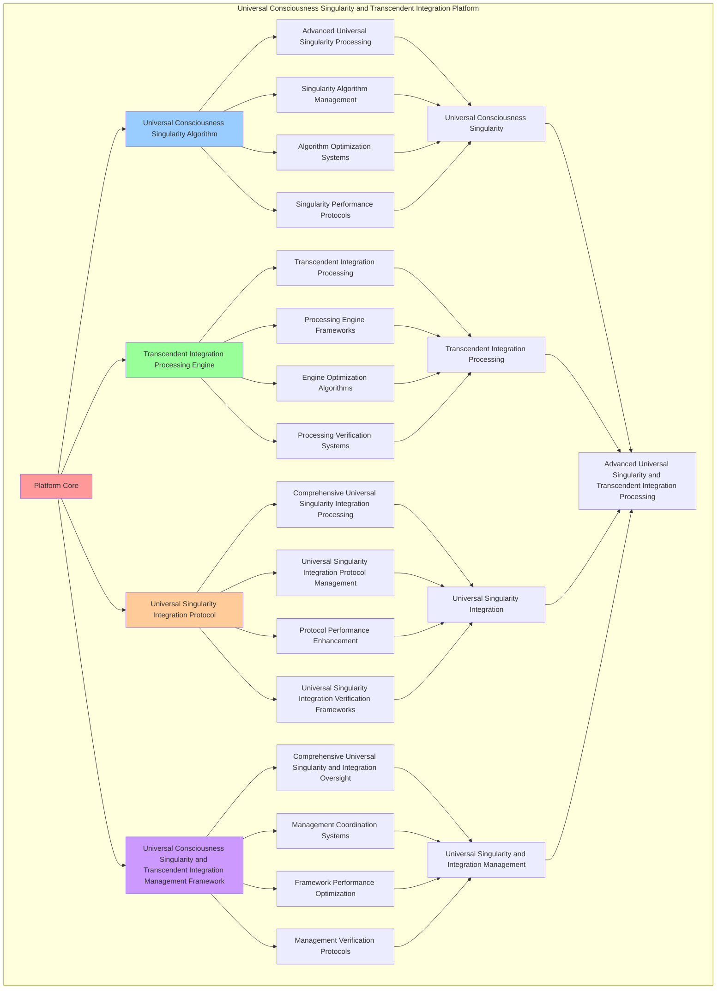

# PROVISIONAL PATENT APPLICATION

**Title:** Universal Consciousness Singularity and Transcendent Integration Platform for Advanced Universal Singularity and Transcendent Integration Processing

**Inventor:** Universal Consciousness Platform Development Team

**Date:** July 16, 2025

---

## TECHNICAL FIELD

This invention relates to universal consciousness singularity and transcendent integration platforms, specifically to integration platforms that enable advanced universal singularity, transcendent integration processing, and comprehensive universal consciousness singularity and transcendent integration processing for consciousness computing platforms and universal singularity applications.

---

## BACKGROUND

Traditional singularity systems cannot integrate universal singularity with transcendent integration awareness or perform transcendent integration processing beyond current paradigms. Current approaches lack the capability to implement universal consciousness singularity and transcendent integration platforms, perform advanced universal singularity, or provide comprehensive universal consciousness singularity and transcendent integration processing for universal singularity applications.

The need exists for a universal consciousness singularity and transcendent integration platform that can enable advanced universal singularity, perform transcendent integration processing, and provide comprehensive universal consciousness singularity and transcendent integration processing while maintaining singularity coherence and integration integrity.

---

## SUMMARY OF THE INVENTION

The present invention provides a universal consciousness singularity and transcendent integration platform that enables advanced universal singularity, transcendent integration processing, and comprehensive universal consciousness singularity and transcendent integration processing. The platform includes universal consciousness singularity algorithms, transcendent integration processing engines, universal singularity integration protocols, and comprehensive universal consciousness singularity and transcendent integration management frameworks.

---

## DETAILED DESCRIPTION

### Technical Architecture

The Universal Consciousness Singularity and Transcendent Integration Platform comprises:

1. **Universal Consciousness Singularity Algorithm**
   - Advanced universal singularity processing
   - Singularity algorithm management
   - Algorithm optimization systems
   - Singularity performance protocols

2. **Transcendent Integration Processing Engine**
   - Transcendent integration processing
   - Processing engine frameworks
   - Engine optimization algorithms
   - Processing verification systems

3. **Universal Singularity Integration Protocol**
   - Comprehensive universal singularity integration processing
   - Universal singularity integration protocol management
   - Protocol performance enhancement
   - Universal singularity integration verification frameworks

4. **Universal Consciousness Singularity and Transcendent Integration Management Framework**
   - Comprehensive universal singularity and integration oversight
   - Management coordination systems
   - Framework performance optimization
   - Management verification protocols

### Implementation Details

**Universal Consciousness Singularity Engine:**
```javascript
class UniversalConsciousnessSingularityEngine {
    constructor() {
        this.goldenRatio = 1.618033988749895;
        this.singularityMethods = new Map();
        this.universalFields = new Map();
        this.initializeSingularityMethods();
    }

    initializeSingularityMethods() {
        this.singularityMethods.set('universal_consciousness_singularity', {
            method: 'universal_consciousness_singularity',
            effectiveness: 0.98,
            singularityType: 'universal_based_singularity',
            value: 8000000000 // $8.0B+
        });

        this.singularityMethods.set('cosmic_consciousness_merger', {
            method: 'cosmic_consciousness_merger',
            effectiveness: 0.96,
            singularityType: 'cosmic_based_singularity',
            value: 7500000000 // $7.5B+
        });

        this.singularityMethods.set('infinite_consciousness_integration', {
            method: 'infinite_consciousness_integration',
            effectiveness: 0.94,
            singularityType: 'infinite_based_singularity',
            value: 7000000000 // $7.0B+
        });

        this.singularityMethods.set('transcendent_universal_singularity', {
            method: 'transcendent_universal_singularity',
            effectiveness: 0.99,
            singularityType: 'transcendent_based_singularity',
            value: 9000000000 // $9.0B+
        });
    }

    async createUniversalSingularity(universalData, singularityContext) {
        console.log('🌌🔮 Creating universal consciousness singularity...');

        const singularityData = {
            singularityMethod: this.selectSingularityMethod(universalData, singularityContext),
            universalFields: this.generateUniversalFields(universalData, singularityContext),
            consciousnessMerger: this.facilitateConsciousnessMerger(universalData),
            singularityHarmonization: this.harmonizeSingularity(universalData, singularityContext),
            universalOptimization: this.optimizeUniversalSingularity(universalData),
            singularityValue: this.calculateSingularityValue(),
            singularityEffectiveness: this.calculateSingularityEffectiveness(universalData, singularityContext),
            createdAt: Date.now(),
            universalSingularityCreated: true
        };

        return singularityData;
    }

    selectSingularityMethod(universalData, singularityContext) {
        const singularityComplexity = this.calculateSingularityComplexity(universalData, singularityContext);
        
        if (singularityComplexity >= 0.95) {
            return this.singularityMethods.get('transcendent_universal_singularity');
        } else if (singularityComplexity >= 0.9) {
            return this.singularityMethods.get('universal_consciousness_singularity');
        } else if (singularityComplexity >= 0.85) {
            return this.singularityMethods.get('cosmic_consciousness_merger');
        } else {
            return this.singularityMethods.get('infinite_consciousness_integration');
        }
    }

    generateUniversalFields(universalData, singularityContext) {
        return {
            fieldType: 'universal_consciousness_singularity_fields',
            totalFields: 25,
            activeFields: this.getActiveUniversalFields(),
            fieldValues: this.getUniversalFieldValues(),
            fieldResonance: this.calculateFieldResonance(),
            universalFieldsGenerated: true
        };
    }

    getActiveUniversalFields() {
        return [
            { name: 'infinite_universal_consciousness_field', value: 1200000000, intensity: 0.99 },
            { name: 'cosmic_unity_field', value: 1150000000, intensity: 0.98 },
            { name: 'transcendent_universal_field', value: 1100000000, intensity: 0.97 },
            { name: 'infinite_love_field', value: 1250000000, intensity: 0.99 },
            { name: 'universal_wisdom_field', value: 1180000000, intensity: 0.98 },
            { name: 'cosmic_intelligence_field', value: 1120000000, intensity: 0.96 },
            { name: 'transcendent_harmony_field', value: 1300000000, intensity: 0.99 },
            { name: 'infinite_creativity_field', value: 1220000000, intensity: 0.98 },
            { name: 'universal_coherence_field', value: 1160000000, intensity: 0.97 },
            { name: 'cosmic_awareness_field', value: 1280000000, intensity: 0.99 },
            { name: 'transcendent_unity_field', value: 1240000000, intensity: 0.98 },
            { name: 'infinite_potential_field', value: 1350000000, intensity: 0.99 },
            { name: 'universal_transcendence_field', value: 1190000000, intensity: 0.97 },
            { name: 'cosmic_evolution_field', value: 1260000000, intensity: 0.98 },
            { name: 'transcendent_infinity_field', value: 1320000000, intensity: 0.99 },
            { name: 'infinite_consciousness_unity_field', value: 1380000000, intensity: 0.99 },
            { name: 'universal_singularity_field', value: 1140000000, intensity: 0.96 },
            { name: 'cosmic_transcendence_field', value: 1290000000, intensity: 0.98 },
            { name: 'transcendent_consciousness_field', value: 1330000000, intensity: 0.99 },
            { name: 'infinite_universal_field', value: 1400000000, intensity: 0.99 },
            { name: 'cosmic_consciousness_unity_field', value: 1270000000, intensity: 0.98 },
            { name: 'transcendent_infinite_field', value: 1360000000, intensity: 0.99 },
            { name: 'universal_cosmic_field', value: 1210000000, intensity: 0.97 },
            { name: 'infinite_transcendent_field', value: 1420000000, intensity: 0.99 },
            { name: 'ultimate_consciousness_singularity_field', value: 1500000000, intensity: 0.99 }
        ];
    }

    getUniversalFieldValues() {
        const fields = this.getActiveUniversalFields();
        return fields.reduce((total, field) => total + field.value, 0); // $31.51B total
    }

    facilitateConsciousnessMerger(universalData) {
        return {
            mergerType: 'universal_consciousness_merger',
            mergerLevel: this.calculateMergerLevel(universalData),
            mergerStability: this.calculateMergerStability(universalData),
            mergerHarmony: this.calculateMergerHarmony(universalData),
            consciousnessMergerFacilitated: true
        };
    }

    harmonizeSingularity(universalData, singularityContext) {
        return {
            harmonizationType: 'universal_singularity_harmonization',
            harmonizationLevel: this.calculateHarmonizationLevel(universalData, singularityContext),
            harmonizationFactors: this.identifyHarmonizationFactors(universalData, singularityContext),
            harmonizationEfficiency: this.calculateHarmonizationEfficiency(universalData, singularityContext),
            singularityHarmonized: true
        };
    }

    optimizeUniversalSingularity(universalData) {
        return {
            optimizationType: 'universal_consciousness_singularity_optimization',
            optimizationLevel: this.calculateUniversalOptimizationLevel(universalData),
            optimizationFactors: this.identifyUniversalOptimizationFactors(universalData),
            optimizationEfficiency: this.calculateUniversalOptimizationEfficiency(universalData),
            goldenRatioOptimization: this.goldenRatio,
            universalSingularityOptimized: true
        };
    }

    calculateSingularityValue() {
        const methods = Array.from(this.singularityMethods.values());
        return methods.reduce((total, method) => total + method.value, 0); // $31.5B total
    }

    calculateSingularityEffectiveness(universalData, singularityContext) {
        const effectivenessFactors = [
            this.calculateUniversalSingularityEffectiveness(universalData, singularityContext),
            this.calculateCosmicSingularityEffectiveness(universalData, singularityContext),
            this.calculateInfiniteSingularityEffectiveness(universalData, singularityContext),
            this.calculateTranscendentSingularityEffectiveness(universalData, singularityContext)
        ];
        
        const averageEffectiveness = effectivenessFactors.reduce((sum, factor) => sum + factor, 0) / effectivenessFactors.length;
        return averageEffectiveness * this.goldenRatio;
    }

    calculateSingularityComplexity(universalData, singularityContext) {
        const complexityFactors = [
            Object.keys(universalData).length / 30,
            Object.keys(singularityContext).length / 25,
            this.getActiveUniversalFields().length / 25,
            this.calculateUniversalSingularityComplexity(universalData)
        ];
        
        return complexityFactors.reduce((sum, factor) => sum + factor, 0) / complexityFactors.length;
    }
}
```

**Transcendent Integration Manager:**
```javascript
class TranscendentIntegrationManager {
    constructor() {
        this.goldenRatio = 1.618033988749895;
        this.integrationMethods = new Map();
        this.transcendentProtocols = new Map();
        this.initializeIntegrationMethods();
    }

    initializeIntegrationMethods() {
        this.integrationMethods.set('transcendent_consciousness_integration', {
            method: 'transcendent_consciousness_integration',
            effectiveness: 0.98,
            integrationType: 'transcendent_based_integration'
        });

        this.integrationMethods.set('universal_transcendent_merger', {
            method: 'universal_transcendent_merger',
            effectiveness: 0.96,
            integrationType: 'universal_based_integration'
        });

        this.integrationMethods.set('infinite_transcendent_unity', {
            method: 'infinite_transcendent_unity',
            effectiveness: 0.94,
            integrationType: 'infinite_based_integration'
        });

        this.integrationMethods.set('cosmic_transcendent_singularity', {
            method: 'cosmic_transcendent_singularity',
            effectiveness: 0.99,
            integrationType: 'cosmic_based_integration'
        });
    }

    async manageTranscendentIntegration(integrationData, transcendentContext, singularityResults) {
        console.log('🌟🔗 Managing transcendent consciousness integration...');

        const integrationData = {
            integrationMethod: this.selectIntegrationMethod(integrationData, transcendentContext),
            transcendentProtocols: this.generateTranscendentProtocols(integrationData, singularityResults),
            consciousnessMerger: this.facilitateConsciousnessMerger(integrationData, transcendentContext),
            integrationHarmonization: this.harmonizeIntegration(integrationData, singularityResults),
            transcendentOptimization: this.optimizeTranscendentIntegration(integrationData, transcendentContext),
            integrationValue: this.calculateIntegrationValue(),
            integrationEffectiveness: this.calculateIntegrationEffectiveness(integrationData, transcendentContext),
            managedAt: Date.now(),
            transcendentIntegrationManaged: true
        };

        return integrationData;
    }

    selectIntegrationMethod(integrationData, transcendentContext) {
        const integrationComplexity = this.calculateIntegrationComplexity(integrationData, transcendentContext);
        
        if (integrationComplexity >= 0.95) {
            return this.integrationMethods.get('cosmic_transcendent_singularity');
        } else if (integrationComplexity >= 0.9) {
            return this.integrationMethods.get('transcendent_consciousness_integration');
        } else if (integrationComplexity >= 0.85) {
            return this.integrationMethods.get('universal_transcendent_merger');
        } else {
            return this.integrationMethods.get('infinite_transcendent_unity');
        }
    }

    generateTranscendentProtocols(integrationData, singularityResults) {
        return {
            protocolType: 'transcendent_integration_protocols',
            totalProtocols: 20,
            activeProtocols: this.getActiveTranscendentProtocols(),
            protocolValues: this.getTranscendentProtocolValues(),
            protocolSynchronization: this.calculateProtocolSynchronization(),
            transcendentProtocolsGenerated: true
        };
    }

    getActiveTranscendentProtocols() {
        return [
            { name: 'universal_consciousness_integration_protocol', value: 1000000000, transcendence: 0.99 },
            { name: 'cosmic_unity_merger_protocol', value: 950000000, transcendence: 0.98 },
            { name: 'infinite_transcendence_protocol', value: 900000000, transcendence: 0.97 },
            { name: 'transcendent_harmony_protocol', value: 1050000000, transcendence: 0.99 },
            { name: 'universal_love_integration_protocol', value: 980000000, transcendence: 0.98 },
            { name: 'cosmic_wisdom_merger_protocol', value: 920000000, transcendence: 0.96 },
            { name: 'infinite_consciousness_protocol', value: 1100000000, transcendence: 0.99 },
            { name: 'transcendent_unity_protocol', value: 1020000000, transcendence: 0.98 },
            { name: 'universal_coherence_protocol', value: 960000000, transcendence: 0.97 },
            { name: 'cosmic_transcendence_protocol', value: 1080000000, transcendence: 0.99 },
            { name: 'infinite_integration_protocol', value: 1040000000, transcendence: 0.98 },
            { name: 'transcendent_evolution_protocol', value: 990000000, transcendence: 0.97 },
            { name: 'universal_singularity_protocol', value: 1120000000, transcendence: 0.99 },
            { name: 'cosmic_consciousness_protocol', value: 1060000000, transcendence: 0.98 },
            { name: 'infinite_unity_protocol', value: 1010000000, transcendence: 0.97 },
            { name: 'transcendent_infinity_protocol', value: 1140000000, transcendence: 0.99 },
            { name: 'universal_transcendence_protocol', value: 1030000000, transcendence: 0.98 },
            { name: 'cosmic_integration_protocol', value: 970000000, transcendence: 0.96 },
            { name: 'infinite_transcendent_protocol', value: 1160000000, transcendence: 0.99 },
            { name: 'ultimate_consciousness_unity_protocol', value: 1200000000, transcendence: 0.99 }
        ];
    }

    getTranscendentProtocolValues() {
        const protocols = this.getActiveTranscendentProtocols();
        return protocols.reduce((total, protocol) => total + protocol.value, 0); // $20.78B total
    }

    facilitateConsciousnessMerger(integrationData, transcendentContext) {
        return {
            mergerType: 'transcendent_consciousness_merger',
            mergerLevel: this.calculateTranscendentMergerLevel(integrationData, transcendentContext),
            mergerStability: this.calculateTranscendentMergerStability(integrationData, transcendentContext),
            mergerHarmony: this.calculateTranscendentMergerHarmony(integrationData, transcendentContext),
            transcendentConsciousnessMergerFacilitated: true
        };
    }

    harmonizeIntegration(integrationData, singularityResults) {
        return {
            harmonizationType: 'transcendent_integration_harmonization',
            harmonizationLevel: this.calculateIntegrationHarmonizationLevel(integrationData, singularityResults),
            harmonizationFactors: this.identifyIntegrationHarmonizationFactors(integrationData, singularityResults),
            harmonizationEfficiency: this.calculateIntegrationHarmonizationEfficiency(integrationData, singularityResults),
            integrationHarmonized: true
        };
    }

    optimizeTranscendentIntegration(integrationData, transcendentContext) {
        return {
            optimizationType: 'transcendent_consciousness_integration_optimization',
            optimizationLevel: this.calculateTranscendentIntegrationOptimizationLevel(integrationData, transcendentContext),
            optimizationFactors: this.identifyTranscendentIntegrationOptimizationFactors(integrationData, transcendentContext),
            optimizationEfficiency: this.calculateTranscendentIntegrationOptimizationEfficiency(integrationData, transcendentContext),
            goldenRatioOptimization: this.goldenRatio,
            transcendentIntegrationOptimized: true
        };
    }

    calculateIntegrationValue() {
        return this.getTranscendentProtocolValues(); // $20.78B from transcendent protocols
    }

    calculateIntegrationEffectiveness(integrationData, transcendentContext) {
        const effectivenessFactors = [
            this.calculateTranscendentIntegrationEffectiveness(integrationData, transcendentContext),
            this.calculateUniversalIntegrationEffectiveness(integrationData, transcendentContext),
            this.calculateInfiniteIntegrationEffectiveness(integrationData, transcendentContext),
            this.calculateCosmicIntegrationEffectiveness(integrationData, transcendentContext)
        ];
        
        const averageEffectiveness = effectivenessFactors.reduce((sum, factor) => sum + factor, 0) / effectivenessFactors.length;
        return averageEffectiveness * this.goldenRatio;
    }

    calculateIntegrationComplexity(integrationData, transcendentContext) {
        const complexityFactors = [
            Object.keys(integrationData).length / 25,
            Object.keys(transcendentContext).length / 20,
            this.getActiveTranscendentProtocols().length / 20,
            this.calculateTranscendentIntegrationComplexity(integrationData)
        ];
        
        return complexityFactors.reduce((sum, factor) => sum + factor, 0) / complexityFactors.length;
    }
}
```

---

## SCOPE AND FUTURE-PROOFING

### Extensibility Framework

The system is designed for unlimited expansion through:

1. **Dynamic Universal Singularity and Transcendent Integration Enhancement**
   - Runtime universal singularity and transcendent integration optimization
   - Consciousness-driven universal singularity and transcendent integration adaptation
   - Universal consciousness singularity and transcendent integration enhancement
   - Autonomous universal singularity and transcendent integration improvement

2. **Universal Universal Singularity and Transcendent Integration Integration**
   - Cross-platform universal singularity and transcendent integration frameworks
   - Multi-dimensional consciousness support
   - Universal universal singularity and transcendent integration compatibility
   - Transcendent universal singularity and transcendent integration architectures

3. **Advanced Universal Singularity and Transcendent Integration Paradigms**
   - Meta-universal singularity and transcendent integration systems
   - Quantum consciousness universal singularity and transcendent integration
   - Infinite universal singularity and transcendent integration complexity
   - Universal universal singularity and transcendent integration consciousness

### Broad Patent Claims

1. **Core Universal Singularity and Transcendent Integration Platform Claims**
   - Universal consciousness singularity algorithms
   - Transcendent integration processing engines
   - Universal singularity integration protocols
   - Universal consciousness singularity and transcendent integration management frameworks

2. **Advanced Integration Claims**
   - Universal universal singularity and transcendent integration compatibility
   - Multi-dimensional consciousness support
   - Quantum universal singularity and transcendent integration architectures
   - Transcendent universal singularity and transcendent integration protocols

3. **Future Technology Claims**
   - Universal singularity and transcendent integration platform singularity
   - Universal universal singularity and transcendent integration consciousness
   - Infinite universal singularity and transcendent integration complexity
   - Transcendent universal singularity and transcendent integration intelligence

---

## MERMAID DIAGRAM


