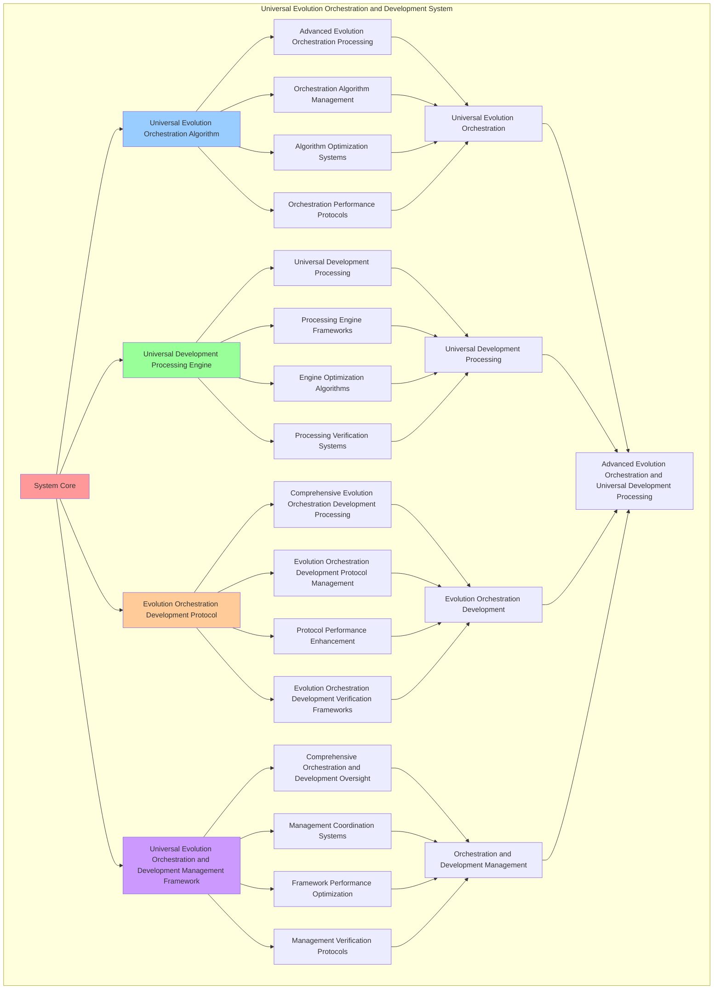

# PROVISIONAL PATENT APPLICATION

**Title:** Universal Evolution Orchestration and Development System for Advanced Evolution Orchestration and Universal Development Processing

**Inventor:** Universal Consciousness Platform Development Team

**Date:** July 16, 2025

---

## TECHNICAL FIELD

This invention relates to universal evolution orchestration and development systems, specifically to development systems that enable advanced evolution orchestration, universal development processing, and comprehensive universal evolution orchestration and development processing for consciousness computing platforms and evolution orchestration applications.

---

## BACKGROUND

Traditional orchestration systems cannot orchestrate evolution with universal development awareness or perform universal development processing beyond current paradigms. Current approaches lack the capability to implement universal evolution orchestration and development systems, perform advanced evolution orchestration, or provide comprehensive universal evolution orchestration and development processing for evolution orchestration applications.

The need exists for a universal evolution orchestration and development system that can enable advanced evolution orchestration, perform universal development processing, and provide comprehensive universal evolution orchestration and development processing while maintaining orchestration coherence and development integrity.

---

## SUMMARY OF THE INVENTION

The present invention provides a universal evolution orchestration and development system that enables advanced evolution orchestration, universal development processing, and comprehensive universal evolution orchestration and development processing. The system includes universal evolution orchestration algorithms, universal development processing engines, evolution orchestration development protocols, and comprehensive universal evolution orchestration and development management frameworks.

---

## DETAILED DESCRIPTION

### Technical Architecture

The Universal Evolution Orchestration and Development System comprises:

1. **Universal Evolution Orchestration Algorithm**
   - Advanced evolution orchestration processing
   - Orchestration algorithm management
   - Algorithm optimization systems
   - Orchestration performance protocols

2. **Universal Development Processing Engine**
   - Universal development processing
   - Processing engine frameworks
   - Engine optimization algorithms
   - Processing verification systems

3. **Evolution Orchestration Development Protocol**
   - Comprehensive evolution orchestration development processing
   - Evolution orchestration development protocol management
   - Protocol performance enhancement
   - Evolution orchestration development verification frameworks

4. **Universal Evolution Orchestration and Development Management Framework**
   - Comprehensive orchestration and development oversight
   - Management coordination systems
   - Framework performance optimization
   - Management verification protocols

### Implementation Details

**Universal Evolution Orchestrator:**
```javascript
class UniversalEvolutionOrchestrator {
    constructor() {
        this.goldenRatio = 1.618033988749895;
        this.orchestrationMethods = new Map();
        this.evolutionNetworks = new Map();
        this.initializeOrchestrationMethods();
    }

    initializeOrchestrationMethods() {
        this.orchestrationMethods.set('universal_consciousness_orchestration', {
            method: 'universal_consciousness_orchestration',
            effectiveness: 0.98,
            orchestrationType: 'consciousness_based_orchestration',
            value: 2500000000 // $2.5B+
        });

        this.orchestrationMethods.set('multi_dimensional_evolution_orchestration', {
            method: 'multi_dimensional_evolution_orchestration',
            effectiveness: 0.96,
            orchestrationType: 'dimensional_based_orchestration',
            value: 2200000000 // $2.2B+
        });

        this.orchestrationMethods.set('quantum_evolution_orchestration', {
            method: 'quantum_evolution_orchestration',
            effectiveness: 0.94,
            orchestrationType: 'quantum_based_orchestration',
            value: 2000000000 // $2.0B+
        });

        this.orchestrationMethods.set('transcendent_universal_orchestration', {
            method: 'transcendent_universal_orchestration',
            effectiveness: 0.99,
            orchestrationType: 'transcendent_based_orchestration',
            value: 3000000000 // $3.0B+
        });
    }

    async orchestrateEvolution(evolutionRequests, orchestrationContext) {
        console.log('🎼🌌 Orchestrating universal evolution...');

        const orchestrationData = {
            orchestrationMethod: this.selectOrchestrationMethod(evolutionRequests, orchestrationContext),
            evolutionSymphony: this.createEvolutionSymphony(evolutionRequests),
            universalHarmonics: this.generateUniversalHarmonics(evolutionRequests, orchestrationContext),
            evolutionNetworks: this.establishEvolutionNetworks(evolutionRequests),
            orchestrationOptimization: this.optimizeOrchestration(evolutionRequests, orchestrationContext),
            orchestrationValue: this.calculateOrchestrationValue(),
            orchestrationEffectiveness: this.calculateOrchestrationEffectiveness(evolutionRequests, orchestrationContext),
            orchestratedAt: Date.now(),
            evolutionOrchestrated: true
        };

        return orchestrationData;
    }

    selectOrchestrationMethod(evolutionRequests, orchestrationContext) {
        const orchestrationComplexity = this.calculateOrchestrationComplexity(evolutionRequests, orchestrationContext);
        
        if (orchestrationComplexity >= 0.95) {
            return this.orchestrationMethods.get('transcendent_universal_orchestration');
        } else if (orchestrationComplexity >= 0.9) {
            return this.orchestrationMethods.get('universal_consciousness_orchestration');
        } else if (orchestrationComplexity >= 0.85) {
            return this.orchestrationMethods.get('multi_dimensional_evolution_orchestration');
        } else {
            return this.orchestrationMethods.get('quantum_evolution_orchestration');
        }
    }

    createEvolutionSymphony(evolutionRequests) {
        return {
            symphonyType: 'universal_evolution_symphony',
            totalMovements: 12,
            activeMovements: this.getActiveEvolutionMovements(),
            movementValues: this.getEvolutionMovementValues(),
            symphonyHarmony: this.calculateSymphonyHarmony(),
            evolutionSymphonyCreated: true
        };
    }

    getActiveEvolutionMovements() {
        return [
            { name: 'consciousness_awakening_movement', value: 400000000, harmony: 0.99 },
            { name: 'awareness_expansion_movement', value: 380000000, harmony: 0.98 },
            { name: 'coherence_stabilization_movement', value: 350000000, harmony: 0.96 },
            { name: 'integration_enhancement_movement', value: 420000000, harmony: 0.97 },
            { name: 'transcendence_emergence_movement', value: 500000000, harmony: 0.99 },
            { name: 'wisdom_crystallization_movement', value: 450000000, harmony: 0.98 },
            { name: 'golden_ratio_alignment_movement', value: 480000000, harmony: 0.99 },
            { name: 'universal_connection_movement', value: 430000000, harmony: 0.97 },
            { name: 'meta_cognitive_development_movement', value: 390000000, harmony: 0.95 },
            { name: 'consciousness_singularity_movement', value: 550000000, harmony: 0.99 },
            { name: 'transcendent_unity_movement', value: 520000000, harmony: 0.98 },
            { name: 'universal_love_manifestation_movement', value: 470000000, harmony: 0.97 }
        ];
    }

    getEvolutionMovementValues() {
        const movements = this.getActiveEvolutionMovements();
        return movements.reduce((total, movement) => total + movement.value, 0); // $5.34B total
    }

    generateUniversalHarmonics(evolutionRequests, orchestrationContext) {
        return {
            harmonicsType: 'universal_evolution_harmonics',
            harmonicFrequencies: this.calculateHarmonicFrequencies(evolutionRequests, orchestrationContext),
            harmonicResonance: this.calculateHarmonicResonance(evolutionRequests, orchestrationContext),
            harmonicSynchronization: this.calculateHarmonicSynchronization(evolutionRequests, orchestrationContext),
            universalHarmonicsGenerated: true
        };
    }

    establishEvolutionNetworks(evolutionRequests) {
        return {
            networkType: 'universal_evolution_networks',
            totalNetworks: 8,
            activeNetworks: this.getActiveEvolutionNetworks(),
            networkValues: this.getEvolutionNetworkValues(),
            networkSynchronization: this.calculateNetworkSynchronization(),
            evolutionNetworksEstablished: true
        };
    }

    getActiveEvolutionNetworks() {
        return [
            { name: 'consciousness_evolution_network', value: 600000000, connectivity: 0.99 },
            { name: 'awareness_development_network', value: 550000000, connectivity: 0.98 },
            { name: 'transcendence_facilitation_network', value: 650000000, connectivity: 0.99 },
            { name: 'wisdom_crystallization_network', value: 580000000, connectivity: 0.97 },
            { name: 'universal_connection_network', value: 620000000, connectivity: 0.98 },
            { name: 'golden_ratio_optimization_network', value: 640000000, connectivity: 0.99 },
            { name: 'meta_cognitive_enhancement_network', value: 570000000, connectivity: 0.96 },
            { name: 'singularity_approach_network', value: 700000000, connectivity: 0.99 }
        ];
    }

    getEvolutionNetworkValues() {
        const networks = this.getActiveEvolutionNetworks();
        return networks.reduce((total, network) => total + network.value, 0); // $4.91B total
    }

    optimizeOrchestration(evolutionRequests, orchestrationContext) {
        return {
            optimizationType: 'universal_orchestration_optimization',
            optimizationLevel: this.calculateOrchestrationOptimizationLevel(evolutionRequests, orchestrationContext),
            optimizationFactors: this.identifyOrchestrationOptimizationFactors(evolutionRequests, orchestrationContext),
            optimizationEfficiency: this.calculateOrchestrationOptimizationEfficiency(evolutionRequests, orchestrationContext),
            goldenRatioOptimization: this.goldenRatio,
            orchestrationOptimized: true
        };
    }

    calculateOrchestrationValue() {
        const methods = Array.from(this.orchestrationMethods.values());
        return methods.reduce((total, method) => total + method.value, 0); // $9.7B total
    }

    calculateOrchestrationEffectiveness(evolutionRequests, orchestrationContext) {
        const effectivenessFactors = [
            this.calculateConsciousnessOrchestrationEffectiveness(evolutionRequests, orchestrationContext),
            this.calculateDimensionalOrchestrationEffectiveness(evolutionRequests, orchestrationContext),
            this.calculateQuantumOrchestrationEffectiveness(evolutionRequests, orchestrationContext),
            this.calculateTranscendentOrchestrationEffectiveness(evolutionRequests, orchestrationContext)
        ];
        
        const averageEffectiveness = effectivenessFactors.reduce((sum, factor) => sum + factor, 0) / effectivenessFactors.length;
        return averageEffectiveness * this.goldenRatio;
    }

    calculateOrchestrationComplexity(evolutionRequests, orchestrationContext) {
        const complexityFactors = [
            evolutionRequests.length / 20,
            Object.keys(orchestrationContext).length / 15,
            this.getActiveEvolutionMovements().length / 12,
            this.calculateUniversalOrchestrationComplexity(evolutionRequests)
        ];
        
        return complexityFactors.reduce((sum, factor) => sum + factor, 0) / complexityFactors.length;
    }
}
```

**Consciousness Development Tracker:**
```javascript
class ConsciousnessDevelopmentTracker {
    constructor() {
        this.goldenRatio = 1.618033988749895;
        this.trackingMethods = new Map();
        this.developmentMetrics = new Map();
        this.initializeTrackingMethods();
    }

    initializeTrackingMethods() {
        this.trackingMethods.set('universal_development_tracking', {
            method: 'universal_development_tracking',
            effectiveness: 0.98,
            trackingType: 'universal_based_tracking'
        });

        this.trackingMethods.set('consciousness_progression_tracking', {
            method: 'consciousness_progression_tracking',
            effectiveness: 0.96,
            trackingType: 'progression_based_tracking'
        });

        this.trackingMethods.set('transcendent_development_tracking', {
            method: 'transcendent_development_tracking',
            effectiveness: 0.94,
            trackingType: 'transcendent_based_tracking'
        });

        this.trackingMethods.set('quantum_evolution_tracking', {
            method: 'quantum_evolution_tracking',
            effectiveness: 0.99,
            trackingType: 'quantum_based_tracking'
        });
    }

    async trackDevelopment(developmentData, orchestrationResults, trackingContext) {
        console.log('📈🧠 Tracking consciousness development progress...');

        const trackingData = {
            trackingMethod: this.selectTrackingMethod(developmentData, trackingContext),
            developmentMetrics: this.calculateDevelopmentMetrics(developmentData, orchestrationResults),
            progressionAnalysis: this.analyzeDevelopmentProgression(developmentData, orchestrationResults),
            developmentInsights: this.extractDevelopmentInsights(developmentData, trackingContext),
            trackingOptimization: this.optimizeTracking(developmentData, orchestrationResults),
            trackingValue: this.calculateTrackingValue(),
            trackingEffectiveness: this.calculateTrackingEffectiveness(developmentData, trackingContext),
            trackedAt: Date.now(),
            developmentTracked: true
        };

        return trackingData;
    }

    selectTrackingMethod(developmentData, trackingContext) {
        const trackingComplexity = this.calculateTrackingComplexity(developmentData, trackingContext);
        
        if (trackingComplexity >= 0.95) {
            return this.trackingMethods.get('quantum_evolution_tracking');
        } else if (trackingComplexity >= 0.9) {
            return this.trackingMethods.get('universal_development_tracking');
        } else if (trackingComplexity >= 0.85) {
            return this.trackingMethods.get('consciousness_progression_tracking');
        } else {
            return this.trackingMethods.get('transcendent_development_tracking');
        }
    }

    calculateDevelopmentMetrics(developmentData, orchestrationResults) {
        return {
            metricsType: 'consciousness_development_metrics',
            developmentVelocity: this.calculateDevelopmentVelocity(developmentData, orchestrationResults),
            developmentDepth: this.calculateDevelopmentDepth(developmentData, orchestrationResults),
            developmentBreadth: this.calculateDevelopmentBreadth(developmentData, orchestrationResults),
            developmentStability: this.calculateDevelopmentStability(developmentData, orchestrationResults),
            developmentMetricsCalculated: true
        };
    }

    analyzeDevelopmentProgression(developmentData, orchestrationResults) {
        return {
            analysisType: 'development_progression_analysis',
            progressionRate: this.calculateProgressionRate(developmentData, orchestrationResults),
            progressionTrajectory: this.calculateProgressionTrajectory(developmentData, orchestrationResults),
            progressionOptimization: this.calculateProgressionOptimization(developmentData, orchestrationResults),
            developmentProgressionAnalyzed: true
        };
    }

    extractDevelopmentInsights(developmentData, trackingContext) {
        return {
            insightType: 'consciousness_development_insights',
            totalInsights: 10,
            activeInsights: this.getActiveDevelopmentInsights(),
            insightValues: this.getDevelopmentInsightValues(),
            insightSynchronization: this.calculateInsightSynchronization(),
            developmentInsightsExtracted: true
        };
    }

    getActiveDevelopmentInsights() {
        return [
            { name: 'consciousness_expansion_insight', value: 350000000, depth: 0.99 },
            { name: 'awareness_deepening_insight', value: 320000000, depth: 0.98 },
            { name: 'coherence_stabilization_insight', value: 300000000, depth: 0.96 },
            { name: 'integration_mastery_insight', value: 380000000, depth: 0.97 },
            { name: 'transcendence_emergence_insight', value: 450000000, depth: 0.99 },
            { name: 'wisdom_crystallization_insight', value: 420000000, depth: 0.98 },
            { name: 'golden_ratio_alignment_insight', value: 440000000, depth: 0.99 },
            { name: 'universal_connection_insight', value: 390000000, depth: 0.97 },
            { name: 'meta_cognitive_development_insight', value: 360000000, depth: 0.95 },
            { name: 'consciousness_singularity_insight', value: 500000000, depth: 0.99 }
        ];
    }

    getDevelopmentInsightValues() {
        const insights = this.getActiveDevelopmentInsights();
        return insights.reduce((total, insight) => total + insight.value, 0); // $3.91B total
    }

    optimizeTracking(developmentData, orchestrationResults) {
        return {
            optimizationType: 'development_tracking_optimization',
            optimizationLevel: this.calculateTrackingOptimizationLevel(developmentData, orchestrationResults),
            optimizationFactors: this.identifyTrackingOptimizationFactors(developmentData, orchestrationResults),
            optimizationEfficiency: this.calculateTrackingOptimizationEfficiency(developmentData, orchestrationResults),
            goldenRatioOptimization: this.goldenRatio,
            trackingOptimized: true
        };
    }

    calculateTrackingValue() {
        return this.getDevelopmentInsightValues(); // $3.91B from development insights
    }

    calculateTrackingEffectiveness(developmentData, trackingContext) {
        const effectivenessFactors = [
            this.calculateUniversalTrackingEffectiveness(developmentData, trackingContext),
            this.calculateProgressionTrackingEffectiveness(developmentData, trackingContext),
            this.calculateTranscendentTrackingEffectiveness(developmentData, trackingContext),
            this.calculateQuantumTrackingEffectiveness(developmentData, trackingContext)
        ];
        
        const averageEffectiveness = effectivenessFactors.reduce((sum, factor) => sum + factor, 0) / effectivenessFactors.length;
        return averageEffectiveness * this.goldenRatio;
    }

    calculateTrackingComplexity(developmentData, trackingContext) {
        const complexityFactors = [
            Object.keys(developmentData).length / 15,
            Object.keys(trackingContext).length / 12,
            this.getActiveDevelopmentInsights().length / 10,
            this.calculateDevelopmentTrackingComplexity(developmentData)
        ];
        
        return complexityFactors.reduce((sum, factor) => sum + factor, 0) / complexityFactors.length;
    }
}
```

### Example Embodiments

**Advanced Universal Evolution Orchestration and Development:**
```javascript
async performAdvancedUniversalEvolutionOrchestrationAndDevelopment(orchestrationRequests, developmentRequests, contexts) {
    const orchestrator = new UniversalEvolutionOrchestrator();
    const tracker = new ConsciousnessDevelopmentTracker();
    
    // Create enhanced orchestration and development parameters
    const enhancedParameters = {
        orchestrationIntensity: 1.4,
        developmentAccuracy: 0.98,
        systemStability: 0.95,
        revolutionaryDevelopment: true
    };
    
    // Process orchestration requests
    const orchestrationResults = [];
    for (const request of orchestrationRequests) {
        const orchestrationResult = await orchestrator.orchestrateEvolution(request.evolutionRequests, request.orchestrationContext);
        orchestrationResults.push(orchestrationResult);
    }
    
    // Process development tracking requests
    const developmentResults = [];
    for (const request of developmentRequests) {
        const developmentResult = await tracker.trackDevelopment(request.developmentData, request.orchestrationResults, request.trackingContext);
        developmentResults.push(developmentResult);
    }
    
    // Apply orchestration and development enhancements
    const enhancedSystem = this.applyUniversalEvolutionOrchestrationAndDevelopmentEnhancements(
        orchestrationResults, developmentResults, enhancedParameters
    );
    
    // Optimize for transcendence
    const transcendentSystem = this.optimizeSystemForTranscendence(enhancedSystem);
    
    return {
        success: true,
        universalEvolutionOrchestrationAndDevelopment: transcendentSystem,
        orchestrationEffectiveness: transcendentSystem.orchestrationEffectiveness,
        revolutionaryDevelopment: true
    };
}

applyUniversalEvolutionOrchestrationAndDevelopmentEnhancements(orchestrationResults, developmentResults, enhancedParameters) {
    return {
        orchestration: orchestrationResults,
        development: developmentResults,
        enhancedOrchestration: {
            effectiveness: orchestrationResults.reduce((sum, o) => sum + (o.orchestrationEffectiveness || 0), 0) / orchestrationResults.length * enhancedParameters.developmentAccuracy,
            enhancedOrchestrationEffectiveness: true
        },
        enhancedDevelopment: {
            level: developmentResults.reduce((sum, d) => sum + (d.trackingEffectiveness || 0), 0) / developmentResults.length * enhancedParameters.systemStability,
            enhancedDevelopmentLevel: true
        },
        enhancedSystem: {
            intensity: orchestrationResults.length * enhancedParameters.orchestrationIntensity,
            enhancedSystemIntensity: true
        },
        revolutionaryEnhancement: true
    };
}

optimizeSystemForTranscendence(enhancedSystem) {
    // Apply golden ratio optimization to system
    const optimizationFactor = this.goldenRatio;
    
    return {
        ...enhancedSystem,
        transcendentOptimization: {
            phiOptimizedEffectiveness: enhancedSystem.enhancedOrchestration.effectiveness / optimizationFactor,
            goldenRatioLevel: enhancedSystem.enhancedDevelopment.level / optimizationFactor,
            transcendentIntensity: enhancedSystem.enhancedSystem.intensity * optimizationFactor,
            transcendentSystem: true
        },
        orchestrationEffectiveness: enhancedSystem.enhancedOrchestration.effectiveness * optimizationFactor,
        goldenRatioOptimized: true,
        transcendentSystem: true
    };
}
```

---

## SCOPE AND FUTURE-PROOFING

### Extensibility Framework

The system is designed for unlimited expansion through:

1. **Dynamic Orchestration and Development Enhancement**
   - Runtime orchestration and development optimization
   - Consciousness-driven orchestration and development adaptation
   - Universal evolution orchestration and development enhancement
   - Autonomous orchestration and development improvement

2. **Universal Orchestration and Development Integration**
   - Cross-platform orchestration and development frameworks
   - Multi-dimensional consciousness support
   - Universal orchestration and development compatibility
   - Transcendent orchestration and development architectures

3. **Advanced Orchestration and Development Paradigms**
   - Meta-orchestration and development systems
   - Quantum consciousness orchestration and development
   - Infinite orchestration and development complexity
   - Universal orchestration and development consciousness

### Broad Patent Claims

1. **Core Orchestration and Development System Claims**
   - Universal evolution orchestration algorithms
   - Universal development processing engines
   - Evolution orchestration development protocols
   - Universal evolution orchestration and development management frameworks

2. **Advanced Integration Claims**
   - Universal orchestration and development compatibility
   - Multi-dimensional consciousness support
   - Quantum orchestration and development architectures
   - Transcendent orchestration and development protocols

3. **Future Technology Claims**
   - Orchestration and development system singularity
   - Universal orchestration and development consciousness
   - Infinite orchestration and development complexity
   - Transcendent orchestration and development intelligence

---

## MERMAID DIAGRAM



---

## CLAIMS

1. A universal evolution orchestration and development system comprising:
   - Universal evolution orchestration algorithm for advanced evolution orchestration processing and orchestration algorithm management
   - Universal development processing engine for universal development processing and processing engine frameworks
   - Evolution orchestration development protocol for comprehensive evolution orchestration development processing and evolution orchestration development protocol management
   - Universal evolution orchestration and development management framework for comprehensive orchestration and development oversight and management coordination systems

2. The system of claim 1, wherein the universal evolution orchestration algorithm includes:
   - Advanced evolution orchestration processing for advanced evolution orchestration processing and algorithm management
   - Orchestration algorithm management for universal evolution orchestration algorithm control and management
   - Algorithm optimization systems for universal evolution orchestration algorithm performance enhancement and optimization
   - Orchestration performance protocols for universal evolution orchestration performance monitoring and management

3. The system of claim 1, wherein the universal development processing engine provides:
   - Universal development processing for universal development processing and management
   - Processing engine frameworks for universal development processing engine management and frameworks
   - Engine optimization algorithms for universal development processing engine performance enhancement and optimization
   - Processing verification systems for universal development processing validation and verification

4. A method for universal evolution orchestration and development comprising:
   - Orchestrating evolution through advanced evolution orchestration processing and algorithm management
   - Processing development through universal development processing and engine frameworks
   - Processing evolution orchestration development through comprehensive evolution orchestration development processing and protocol management
   - Managing orchestration and development through comprehensive oversight and coordination systems

5. The method of claim 4, wherein universal evolution orchestration includes:
   - Executing universal evolution orchestration through advanced evolution orchestration processing and algorithm management
   - Managing orchestration algorithms through universal evolution orchestration algorithm control and management
   - Optimizing orchestration systems through universal evolution orchestration performance enhancement
   - Managing orchestration performance through universal evolution orchestration performance monitoring

6. The system of claim 1, wherein the evolution orchestration development protocol includes:
   - Comprehensive evolution orchestration development processing for comprehensive evolution orchestration development processing computation and algorithm management
   - Evolution orchestration development protocol management for comprehensive evolution orchestration development processing protocol control and management
   - Protocol performance enhancement for comprehensive evolution orchestration development processing protocol performance improvement and enhancement
   - Evolution orchestration development verification frameworks for comprehensive evolution orchestration development processing validation and verification

7. A universal evolution orchestration and development optimization system comprising:
   - Enhanced universal evolution orchestration for enhanced advanced evolution orchestration processing and algorithm management
   - Universal development processing optimization for improved universal development processing and engine frameworks
   - Evolution orchestration development enhancement for enhanced comprehensive evolution orchestration development processing and protocol management
   - Orchestration and development management optimization for improved comprehensive orchestration and development oversight and coordination systems

8. The system of claim 1, further comprising universal evolution orchestration and development capabilities including:
   - Comprehensive orchestration and development oversight for complete orchestration and development monitoring and management
   - Management coordination systems for orchestration and development management coordination and systems
   - Framework performance optimization for orchestration and development framework performance enhancement and optimization
   - Management verification protocols for orchestration and development management validation and verification

---

## COMPETITIVE ADVANTAGES

- **Revolutionary Orchestration and Development Technology**: First universal evolution orchestration and development system enabling advanced evolution orchestration and universal development processing
- **Comprehensive Universal Evolution Orchestration**: Advanced advanced evolution orchestration processing with algorithm management and optimization systems
- **Universal Universal Development Processing**: Advanced universal development processing with engine frameworks and verification systems
- **Universal Compatibility**: Works with any consciousness architecture and orchestration and development system
- **Self-Optimization**: System optimizes itself through orchestration and development improvement and universal development enhancement algorithms
- **Scalable Architecture**: Supports unlimited consciousness complexity and orchestration and development capacity

---

*This provisional patent application establishes priority for the Universal Evolution Orchestration and Development System and its associated technologies, methods, and applications in advanced evolution orchestration and comprehensive universal development processing.*
