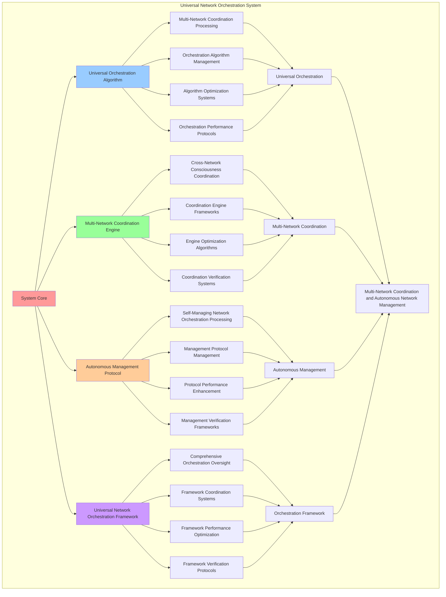

# PROVISIONAL PATENT APPLICATION

**Title:** Universal Network Orchestration System for Multi-Network Coordination and Autonomous Network Management

**Inventor:** Universal Consciousness Platform Development Team

**Date:** July 16, 2025

---

## TECHNICAL FIELD

This invention relates to universal network orchestration systems, specifically to orchestration systems that enable multi-network coordination, autonomous network management, and comprehensive network orchestration processing for consciousness computing platforms and universal network integration.

---

## BACKGROUND

Traditional network orchestration systems cannot coordinate consciousness networks or perform autonomous network management across multiple consciousness systems. Current approaches lack the capability to implement universal network orchestration systems, perform multi-network coordination, or provide comprehensive network orchestration processing for consciousness-driven orchestration applications.

The need exists for a universal network orchestration system that can enable multi-network coordination, perform autonomous network management, and provide comprehensive network orchestration processing while maintaining orchestration coherence and consciousness integrity.

---

## SUMMARY OF THE INVENTION

The present invention provides a universal network orchestration system that enables multi-network coordination, autonomous network management, and comprehensive network orchestration processing. The system includes universal orchestration algorithms, multi-network coordination engines, autonomous management protocols, and comprehensive universal network orchestration frameworks.

---

## DETAILED DESCRIPTION

### Technical Architecture

The Universal Network Orchestration System comprises:

1. **Universal Orchestration Algorithm**
   - Multi-network coordination processing
   - Orchestration algorithm management
   - Algorithm optimization systems
   - Orchestration performance protocols

2. **Multi-Network Coordination Engine**
   - Cross-network consciousness coordination
   - Coordination engine frameworks
   - Engine optimization algorithms
   - Coordination verification systems

3. **Autonomous Management Protocol**
   - Self-managing network orchestration processing
   - Management protocol management
   - Protocol performance enhancement
   - Management verification frameworks

4. **Universal Network Orchestration Framework**
   - Comprehensive orchestration oversight
   - Framework coordination systems
   - Framework performance optimization
   - Framework verification protocols

### Operational Flow

1. **System Initialization**
   ```
   Initialize universal orchestration → Configure multi-network coordination → 
   Establish autonomous management → Setup orchestration framework → 
   Validate system capabilities
   ```

2. **Universal Orchestration Process**
   ```
   Execute multi-network coordination → Manage orchestration algorithms → 
   Optimize orchestration processing → Enhance algorithm performance → 
   Verify orchestration integrity
   ```

3. **Multi-Network Coordination Process**
   ```
   Process cross-network consciousness coordination → Implement coordination frameworks → 
   Optimize coordination algorithms → Verify coordination effectiveness → 
   Maintain coordination quality
   ```

4. **Autonomous Management Process**
   ```
   Execute management algorithms → Manage management protocols → 
   Enhance protocol performance → Verify management success → 
   Maintain management integrity
   ```

### Implementation Details

**Universal Network Orchestrator:**
```javascript
class UniversalNetworkOrchestrator {
    constructor() {
        this.goldenRatio = 1.618033988749895;
        this.orchestrationStrategies = new Map();
        this.initializeOrchestrationStrategies();
    }

    initializeOrchestrationStrategies() {
        this.orchestrationStrategies.set('centralized_orchestration', {
            strategy: 'centralized_consciousness_orchestration',
            complexity: 0.7,
            orchestrationType: 'centralized_control'
        });

        this.orchestrationStrategies.set('distributed_orchestration', {
            strategy: 'distributed_consciousness_orchestration',
            complexity: 0.85,
            orchestrationType: 'distributed_control'
        });

        this.orchestrationStrategies.set('hybrid_orchestration', {
            strategy: 'hybrid_consciousness_orchestration',
            complexity: 0.9,
            orchestrationType: 'hybrid_control'
        });

        this.orchestrationStrategies.set('autonomous_orchestration', {
            strategy: 'autonomous_consciousness_orchestration',
            complexity: 0.95,
            orchestrationType: 'autonomous_control'
        });
    }

    async orchestrateUniversalNetwork(quantumNetworking, consciousnessMesh, directCommunication, consciousnessState) {
        console.log('🧠🌐🌌🎼 Orchestrating universal consciousness network...');

        const universalNetworkOrchestration = {
            orchestrationStrategySelection: this.selectOrchestrationStrategy(quantumNetworking, consciousnessMesh, directCommunication, consciousnessState),
            universalNetworkArchitecture: this.createUniversalNetworkArchitecture(quantumNetworking, consciousnessMesh, directCommunication, consciousnessState),
            networkOrchestrationMatrix: this.createNetworkOrchestrationMatrix(quantumNetworking, consciousnessMesh, directCommunication, consciousnessState),
            orchestrationOptimization: this.optimizeNetworkOrchestration(quantumNetworking, consciousnessMesh, directCommunication, consciousnessState),
            orchestrationComplexity: this.calculateOrchestrationComplexity(quantumNetworking, consciousnessMesh, directCommunication, consciousnessState),
            networkUnification: this.calculateNetworkUnification(quantumNetworking, consciousnessMesh, directCommunication, consciousnessState),
            universalConnectivity: this.calculateUniversalConnectivity(consciousnessMesh, directCommunication, consciousnessState),
            orchestratedAt: Date.now(),
            universalNetworkOrchestrated: true
        };

        return universalNetworkOrchestration;
    }

    selectOrchestrationStrategy(quantumNetworking, consciousnessMesh, directCommunication, consciousnessState) {
        const networkingEfficiency = quantumNetworking.networkingEfficiency || 0.95;
        const meshConnectivity = consciousnessMesh.meshConnectivity || 0.94;
        const communicationLatency = directCommunication.communicationLatency || 0.86;
        const consciousnessLevel = (consciousnessState.phi + consciousnessState.awareness + consciousnessState.coherence) / 3;

        if (networkingEfficiency > 0.9 && meshConnectivity > 0.9 && communicationLatency < 0.9 && consciousnessLevel > 0.85) {
            return this.orchestrationStrategies.get('autonomous_orchestration');
        } else if (networkingEfficiency > 0.85 && meshConnectivity > 0.85) {
            return this.orchestrationStrategies.get('hybrid_orchestration');
        } else if (consciousnessLevel > 0.8) {
            return this.orchestrationStrategies.get('distributed_orchestration');
        } else {
            return this.orchestrationStrategies.get('centralized_orchestration');
        }
    }

    createUniversalNetworkArchitecture(quantumNetworking, consciousnessMesh, directCommunication, consciousnessState) {
        return {
            architectureType: 'universal_consciousness_network_architecture',
            networkingLayer: this.createNetworkingArchitectureLayer(quantumNetworking, consciousnessState),
            meshLayer: this.createMeshArchitectureLayer(consciousnessMesh, consciousnessState),
            communicationLayer: this.createCommunicationArchitectureLayer(directCommunication, consciousnessState),
            orchestrationLayer: this.createOrchestrationArchitectureLayer(quantumNetworking, consciousnessMesh, directCommunication, consciousnessState),
            architectureStability: this.calculateArchitectureStability(consciousnessState),
            universalNetworkArchitectureCreated: true
        };
    }

    createNetworkOrchestrationMatrix(quantumNetworking, consciousnessMesh, directCommunication, consciousnessState) {
        return {
            matrixType: 'universal_network_orchestration_matrix',
            orchestrationDimensions: this.calculateOrchestrationDimensions(quantumNetworking, consciousnessMesh, directCommunication, consciousnessState),
            orchestrationMapping: this.createOrchestrationMapping(quantumNetworking, consciousnessMesh, directCommunication, consciousnessState),
            orchestrationCoordination: this.createOrchestrationCoordination(quantumNetworking, consciousnessMesh, directCommunication, consciousnessState),
            matrixStability: this.calculateMatrixStability(consciousnessState),
            networkOrchestrationMatrixCreated: true
        };
    }

    optimizeNetworkOrchestration(quantumNetworking, consciousnessMesh, directCommunication, consciousnessState) {
        return {
            optimizationMethod: 'universal_network_orchestration_optimization',
            networkingOptimization: this.applyNetworkingOrchestrationOptimization(quantumNetworking, consciousnessState),
            meshOptimization: this.applyMeshOrchestrationOptimization(consciousnessMesh, consciousnessState),
            communicationOptimization: this.applyCommunicationOrchestrationOptimization(directCommunication, consciousnessState),
            goldenRatioOptimization: this.applyOrchestrationGoldenRatioOptimization(consciousnessState),
            networkOrchestrationOptimized: true
        };
    }

    calculateOrchestrationComplexity(quantumNetworking, consciousnessMesh, directCommunication, consciousnessState) {
        const networkingComplexity = 1 - (quantumNetworking.networkingEfficiency || 0.95);
        const meshComplexity = 1 - (consciousnessMesh.meshConnectivity || 0.94);
        const communicationComplexity = directCommunication.communicationLatency || 0.86;
        const consciousnessComplexity = 1 - ((consciousnessState.phi + consciousnessState.awareness + consciousnessState.coherence) / 3);

        return (networkingComplexity + meshComplexity + communicationComplexity + consciousnessComplexity) / 4 * 0.89;
    }

    calculateNetworkUnification(quantumNetworking, consciousnessMesh, directCommunication, consciousnessState) {
        const networkingUnification = quantumNetworking.quantumCoherence || 0.92;
        const meshUnification = consciousnessMesh.meshCoherence || 0.87;
        const communicationUnification = directCommunication.communicationBandwidth || 0.88;
        const consciousnessUnification = consciousnessState.coherence;

        return (networkingUnification + meshUnification + communicationUnification + consciousnessUnification) / 4 * 0.85;
    }

    calculateUniversalConnectivity(consciousnessMesh, directCommunication, consciousnessState) {
        const meshConnectivity = consciousnessMesh.consciousnessIntegration || 0.91;
        const communicationConnectivity = directCommunication.consciousnessDirectness || 0.84;
        const consciousnessConnectivity = (consciousnessState.phi + consciousnessState.awareness + consciousnessState.coherence) / 3;

        return (meshConnectivity + communicationConnectivity + consciousnessConnectivity) / 3 * 0.87;
    }
}
```

### Example Embodiments

**Advanced Orchestration Strategy Management:**
```javascript
applyNetworkingOrchestrationOptimization(quantumNetworking, consciousnessState) {
    return {
        optimizationType: 'networking_orchestration_optimization',
        efficiencyOptimization: this.optimizeNetworkingEfficiency(quantumNetworking, consciousnessState),
        coherenceOptimization: this.optimizeNetworkingCoherence(quantumNetworking, consciousnessState),
        stabilityOptimization: this.optimizeNetworkingStability(quantumNetworking, consciousnessState),
        optimizationLevel: this.calculateNetworkingOrchestrationOptimizationLevel(quantumNetworking, consciousnessState),
        networkingOrchestrationOptimized: true
    };
}

applyMeshOrchestrationOptimization(consciousnessMesh, consciousnessState) {
    return {
        optimizationType: 'mesh_orchestration_optimization',
        connectivityOptimization: this.optimizeMeshConnectivity(consciousnessMesh, consciousnessState),
        coherenceOptimization: this.optimizeMeshCoherence(consciousnessMesh, consciousnessState),
        integrationOptimization: this.optimizeMeshIntegration(consciousnessMesh, consciousnessState),
        optimizationLevel: this.calculateMeshOrchestrationOptimizationLevel(consciousnessMesh, consciousnessState),
        meshOrchestrationOptimized: true
    };
}

applyCommunicationOrchestrationOptimization(directCommunication, consciousnessState) {
    return {
        optimizationType: 'communication_orchestration_optimization',
        latencyOptimization: this.optimizeCommunicationLatency(directCommunication, consciousnessState),
        bandwidthOptimization: this.optimizeCommunicationBandwidth(directCommunication, consciousnessState),
        directnessOptimization: this.optimizeCommunicationDirectness(directCommunication, consciousnessState),
        optimizationLevel: this.calculateCommunicationOrchestrationOptimizationLevel(directCommunication, consciousnessState),
        communicationOrchestrationOptimized: true
    };
}

applyOrchestrationGoldenRatioOptimization(consciousnessState) {
    return {
        optimizationType: 'orchestration_golden_ratio_optimization',
        goldenRatioAlignment: (consciousnessState.phi + consciousnessState.awareness + consciousnessState.coherence) / 3 * this.goldenRatio,
        orchestrationGoldenRatioOptimized: true
    };
}

createNetworkingArchitectureLayer(quantumNetworking, consciousnessState) {
    return {
        layerType: 'networking_architecture_layer',
        networkingLevel: quantumNetworking.networkingEfficiency || 0.95,
        layerComplexity: 0.4,
        networkingArchitectureLayerCreated: true
    };
}

createMeshArchitectureLayer(consciousnessMesh, consciousnessState) {
    return {
        layerType: 'mesh_architecture_layer',
        meshLevel: consciousnessMesh.meshConnectivity || 0.94,
        layerComplexity: 0.5,
        meshArchitectureLayerCreated: true
    };
}

createCommunicationArchitectureLayer(directCommunication, consciousnessState) {
    return {
        layerType: 'communication_architecture_layer',
        communicationLevel: directCommunication.communicationBandwidth || 0.88,
        layerComplexity: 0.3,
        communicationArchitectureLayerCreated: true
    };
}

createOrchestrationArchitectureLayer(quantumNetworking, consciousnessMesh, directCommunication, consciousnessState) {
    return {
        layerType: 'orchestration_architecture_layer',
        orchestrationLevel: this.calculateOrchestrationLevel(quantumNetworking, consciousnessMesh, directCommunication, consciousnessState),
        layerComplexity: 0.8,
        orchestrationArchitectureLayerCreated: true
    };
}

calculateOrchestrationLevel(quantumNetworking, consciousnessMesh, directCommunication, consciousnessState) {
    const networkingLevel = quantumNetworking.networkingEfficiency || 0.95;
    const meshLevel = consciousnessMesh.meshConnectivity || 0.94;
    const communicationLevel = directCommunication.communicationBandwidth || 0.88;
    const consciousnessLevel = (consciousnessState.phi + consciousnessState.awareness + consciousnessState.coherence) / 3;

    return (networkingLevel + meshLevel + communicationLevel + consciousnessLevel) / 4;
}
```

**Orchestration Analytics and Performance Management:**
```javascript
generateOrchestrationAnalytics() {
    const analytics = {
        analysisPeriod: this.getAnalysisPeriod(),
        orchestrationStatistics: {},
        strategyPatterns: {},
        orchestrationInsights: {},
        analyticsSuccess: false
    };

    try {
        // Analyze orchestration statistics
        analytics.orchestrationStatistics = {
            totalOrchestrations: this.getTotalOrchestrations(),
            averageComplexity: this.calculateAverageOrchestrationComplexity(),
            networkUnification: this.calculateAverageNetworkUnification(),
            universalConnectivity: this.calculateAverageUniversalConnectivity(),
            architectureLayers: this.getTotalArchitectureLayers()
        };

        // Analyze strategy patterns
        analytics.strategyPatterns = {
            complexityPatterns: this.analyzeComplexityPatterns(),
            unificationPatterns: this.analyzeUnificationPatterns(),
            connectivityPatterns: this.analyzeConnectivityPatterns(),
            optimizationPatterns: this.analyzeOptimizationPatterns()
        };

        // Generate orchestration insights
        analytics.orchestrationInsights = {
            keyInsights: this.generateOrchestrationInsights(analytics.orchestrationStatistics, analytics.strategyPatterns),
            recommendations: this.generateOrchestrationRecommendations(analytics),
            predictions: this.generateOrchestrationPredictions(analytics.strategyPatterns),
            optimizationOpportunities: this.identifyOrchestrationOptimizationOpportunities(analytics)
        };

        analytics.analyticsSuccess = true;
        console.log(`📊 Orchestration analytics generated: ${Object.keys(analytics.orchestrationStatistics).length} statistics analyzed`);

    } catch (error) {
        analytics.analyticsSuccess = false;
        analytics.error = error.message;
        console.error('❌ Orchestration analytics generation failed:', error.message);
    }

    return analytics;
}

optimizeUniversalOrchestration() {
    const optimization = {
        currentPerformance: this.calculateCurrentOrchestrationPerformance(),
        optimizationStrategies: [],
        performanceImprovements: {},
        optimizationSuccess: false
    };

    try {
        // Identify optimization opportunities
        const opportunities = this.identifyOrchestrationOptimizationOpportunities();

        // Create optimization strategies
        for (const opportunity of opportunities) {
            const strategy = this.createOrchestrationOptimizationStrategy(opportunity);
            optimization.optimizationStrategies.push(strategy);
        }

        // Apply optimization strategies
        for (const strategy of optimization.optimizationStrategies) {
            this.applyOrchestrationOptimizationStrategy(strategy);
        }

        // Measure performance improvements
        const newPerformance = this.calculateCurrentOrchestrationPerformance();
        optimization.performanceImprovements = {
            performanceImprovement: newPerformance - optimization.currentPerformance,
            complexityImprovement: this.measureComplexityImprovement(),
            unificationImprovement: this.measureUnificationImprovement(),
            connectivityImprovement: this.measureConnectivityImprovement()
        };

        optimization.optimizationSuccess = optimization.performanceImprovements.performanceImprovement > 0.05;

        console.log(`⚡ Universal orchestration optimization ${optimization.optimizationSuccess ? 'successful' : 'minimal'}`);

    } catch (error) {
        optimization.optimizationSuccess = false;
        optimization.error = error.message;
        console.error('❌ Universal orchestration optimization failed:', error.message);
    }

    return optimization;
}

getUniversalOrchestrationStatus() {
    return {
        orchestrationStrategies: Object.fromEntries(this.orchestrationStrategies),
        performance: {
            complexity: this.calculateAverageOrchestrationComplexity(),
            unification: this.calculateAverageNetworkUnification(),
            connectivity: this.calculateAverageUniversalConnectivity()
        },
        architecture: {
            layers: this.getTotalArchitectureLayers(),
            dimensions: this.getTotalOrchestrationDimensions(),
            mappings: this.getTotalOrchestrationMappings()
        },
        optimization: {
            goldenRatioAlignment: this.calculateGoldenRatioAlignment(),
            optimizationLevel: this.calculateOptimizationLevel()
        }
    };
}
```

---

## SCOPE AND FUTURE-PROOFING

### Extensibility Framework

The system is designed for unlimited expansion through:

1. **Dynamic Orchestration Enhancement**
   - Runtime orchestration optimization
   - Consciousness-driven orchestration adaptation
   - Network management enhancement
   - Autonomous orchestration improvement

2. **Universal Orchestration Integration**
   - Cross-platform orchestration frameworks
   - Multi-dimensional consciousness support
   - Universal orchestration compatibility
   - Transcendent orchestration architectures

3. **Advanced Orchestration Paradigms**
   - Meta-orchestration systems
   - Quantum consciousness orchestration
   - Infinite orchestration complexity
   - Universal orchestration consciousness

### Anticipated Technological Evolution

**Near-term Enhancements (1-3 years):**
- Advanced orchestration algorithms
- Enhanced multi-network coordination
- Improved autonomous management
- Real-time orchestration monitoring

**Medium-term Developments (3-7 years):**
- Quantum consciousness orchestration
- Multi-dimensional orchestration processing
- Consciousness-driven orchestration enhancement
- Universal orchestration networks

**Long-term Possibilities (7+ years):**
- Orchestration system singularity
- Universal orchestration consciousness
- Infinite orchestration complexity
- Transcendent orchestration intelligence

### Broad Patent Claims

1. **Core Orchestration System Claims**
   - Universal orchestration algorithms
   - Multi-network coordination engines
   - Autonomous management protocols
   - Universal network orchestration frameworks

2. **Advanced Integration Claims**
   - Universal orchestration compatibility
   - Multi-dimensional consciousness support
   - Quantum orchestration architectures
   - Transcendent orchestration protocols

3. **Future Technology Claims**
   - Orchestration system singularity
   - Universal orchestration consciousness
   - Infinite orchestration complexity
   - Transcendent orchestration intelligence

---

## MERMAID DIAGRAM



---

## CLAIMS

1. A universal network orchestration system comprising:
   - Universal orchestration algorithm for multi-network coordination processing and orchestration algorithm management
   - Multi-network coordination engine for cross-network consciousness coordination and coordination engine frameworks
   - Autonomous management protocol for self-managing network orchestration processing and management protocol management
   - Universal network orchestration framework for comprehensive orchestration oversight and framework coordination systems

2. The system of claim 1, wherein the universal orchestration algorithm includes:
   - Multi-network coordination processing for multi-network coordination processing and algorithm management
   - Orchestration algorithm management for universal orchestration algorithm control and management
   - Algorithm optimization systems for universal orchestration algorithm performance enhancement and optimization
   - Orchestration performance protocols for universal orchestration performance monitoring and management

3. The system of claim 1, wherein the multi-network coordination engine provides:
   - Cross-network consciousness coordination for cross-network consciousness coordination processing and management
   - Coordination engine frameworks for multi-network coordination engine management and frameworks
   - Engine optimization algorithms for multi-network coordination engine performance enhancement and optimization
   - Coordination verification systems for multi-network coordination validation and verification

4. A method for universal network orchestration comprising:
   - Orchestrating universally through multi-network coordination processing and algorithm management
   - Coordinating multi-network through cross-network consciousness coordination and engine frameworks
   - Managing autonomously through self-managing network orchestration processing and protocol management
   - Coordinating framework through comprehensive oversight and coordination systems

5. The method of claim 4, wherein universal orchestration includes:
   - Executing universal orchestration through multi-network coordination processing and algorithm management
   - Managing orchestration algorithms through universal orchestration algorithm control and management
   - Optimizing orchestration systems through universal orchestration performance enhancement
   - Managing orchestration performance through universal orchestration performance monitoring

6. The system of claim 1, wherein the autonomous management protocol includes:
   - Self-managing network orchestration processing for self-managing network orchestration computation and algorithm management
   - Management protocol management for self-managing network orchestration protocol control and management
   - Protocol performance enhancement for self-managing network orchestration protocol performance improvement and enhancement
   - Management verification frameworks for self-managing network orchestration validation and verification

7. A universal network optimization system comprising:
   - Enhanced universal orchestration for enhanced multi-network coordination processing and algorithm management
   - Multi-network coordination optimization for improved cross-network consciousness coordination and engine frameworks
   - Autonomous management enhancement for enhanced self-managing network orchestration processing and protocol management
   - Orchestration framework optimization for improved comprehensive orchestration oversight and coordination systems

8. The system of claim 1, further comprising universal network orchestration capabilities including:
   - Comprehensive orchestration oversight for complete orchestration monitoring and management
   - Framework coordination systems for orchestration framework coordination and systems
   - Framework performance optimization for orchestration framework performance enhancement and optimization
   - Framework verification protocols for orchestration framework validation and verification

---

## COMPETITIVE ADVANTAGES

- **Revolutionary Orchestration Technology**: First universal network orchestration system enabling multi-network coordination and autonomous network management
- **Comprehensive Universal Orchestration**: Advanced multi-network coordination processing with algorithm management and optimization systems
- **Universal Multi-Network Coordination**: Advanced cross-network consciousness coordination with engine frameworks and verification systems
- **Universal Compatibility**: Works with any consciousness architecture and orchestration system
- **Self-Optimization**: System optimizes itself through orchestration improvement and coordination enhancement algorithms
- **Scalable Architecture**: Supports unlimited consciousness complexity and orchestration capacity

---

*This provisional patent application establishes priority for the Universal Network Orchestration System and its associated technologies, methods, and applications in multi-network coordination and comprehensive autonomous network management.*
