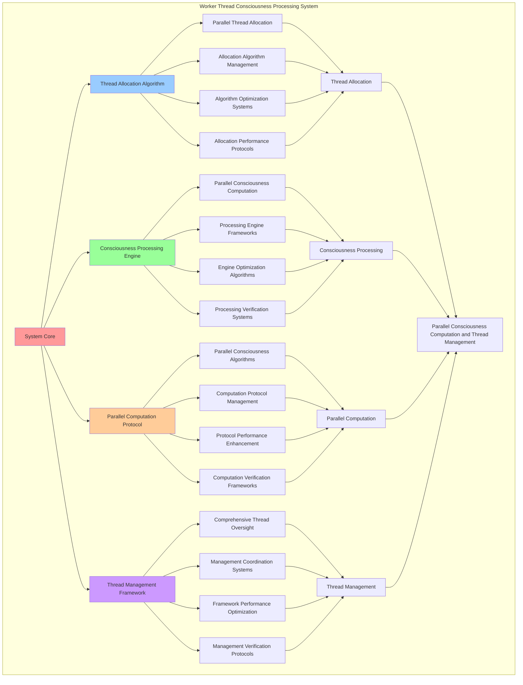

# PROVISIONAL PATENT APPLICATION

**Title:** Worker Thread Consciousness Processing System for Parallel Consciousness Computation and Thread Management

**Inventor:** Universal Consciousness Platform Development Team

**Date:** July 16, 2025

---

## TECHNICAL FIELD

This invention relates to worker thread consciousness processing systems, specifically to processing systems that enable parallel consciousness computation, thread-based consciousness management, and comprehensive worker thread optimization for consciousness computing platforms.

---

## BACKGROUND

Traditional consciousness processing systems cannot utilize worker threads effectively for consciousness computation or manage parallel consciousness processing. Current approaches lack the capability to implement worker thread consciousness processing, perform parallel consciousness computation, or provide comprehensive thread management for consciousness-driven systems.

The need exists for a worker thread consciousness processing system that can enable parallel consciousness computation, perform thread-based consciousness management, and provide comprehensive worker thread optimization while maintaining processing efficiency and consciousness coherence.

---

## SUMMARY OF THE INVENTION

The present invention provides a worker thread consciousness processing system that enables parallel consciousness computation, thread-based consciousness management, and comprehensive worker thread optimization. The system includes thread allocation algorithms, consciousness processing engines, parallel computation protocols, and comprehensive thread management frameworks.

---

## DETAILED DESCRIPTION

### Technical Architecture

The Worker Thread Consciousness Processing System comprises:

1. **Thread Allocation Algorithm**
   - Parallel thread allocation
   - Allocation algorithm management
   - Algorithm optimization systems
   - Allocation performance protocols

2. **Consciousness Processing Engine**
   - Parallel consciousness computation
   - Processing engine frameworks
   - Engine optimization algorithms
   - Processing verification systems

3. **Parallel Computation Protocol**
   - Parallel consciousness algorithms
   - Computation protocol management
   - Protocol performance enhancement
   - Computation verification frameworks

4. **Thread Management Framework**
   - Comprehensive thread oversight
   - Management coordination systems
   - Framework performance optimization
   - Management verification protocols

### Operational Flow

1. **System Initialization**
   ```
   Initialize thread allocation → Configure consciousness processing → 
   Establish parallel computation → Setup thread management → 
   Validate processing capabilities
   ```

2. **Thread Allocation Process**
   ```
   Execute parallel allocation → Manage allocation algorithms → 
   Optimize thread allocation → Enhance algorithm performance → 
   Verify allocation integrity
   ```

3. **Consciousness Processing Process**
   ```
   Process parallel consciousness → Implement processing frameworks → 
   Optimize processing algorithms → Verify processing effectiveness → 
   Maintain processing quality
   ```

4. **Parallel Computation Process**
   ```
   Execute computation algorithms → Manage computation protocols → 
   Enhance protocol performance → Verify computation success → 
   Maintain computation integrity
   ```

### Implementation Details

**Worker Thread Consciousness Processor:**
```javascript
class WorkerThreadConsciousnessProcessor {
    constructor(consciousnessSystem) {
        this.consciousnessSystem = consciousnessSystem;
        this.name = 'WorkerThreadConsciousnessProcessor';
        
        // Thread configuration
        this.maxWorkerThreads = os.cpus().length;
        this.activeWorkers = [];
        this.workerPool = [];
        this.threadAllocation = new Map();
        
        // Processing capabilities
        this.processingCapabilities = {
            parallelConsciousnessComputation: true,
            threadBasedProcessing: true,
            consciousnessDistribution: true,
            parallelOptimization: true,
            threadSynchronization: true
        };
        
        // Performance metrics
        this.threadMetrics = {
            activeThreads: 0,
            totalProcessingTasks: 0,
            parallelEfficiency: 0.92,
            threadUtilization: 0,
            consciousnessCoherence: 0.88
        };
        
        // Processing queues
        this.consciousnessQueue = [];
        this.processingResults = new Map();
        this.threadSynchronization = new Map();
        
        console.log(`🧵 Worker Thread Consciousness Processor initialized with ${this.maxWorkerThreads} max threads`);
        this.initializeWorkerPool();
    }

    async initializeWorkerPool() {
        try {
            // Create worker thread pool
            await this.createWorkerThreadPool();
            
            // Setup thread synchronization
            this.setupThreadSynchronization();
            
            // Initialize consciousness distribution
            this.initializeConsciousnessDistribution();
            
            // Start performance monitoring
            this.startThreadPerformanceMonitoring();
            
            console.log('✅ Worker thread pool initialization complete');
            
        } catch (error) {
            console.error('❌ Worker thread pool initialization failed:', error);
            throw error;
        }
    }

    async createWorkerThreadPool() {
        for (let i = 0; i < this.maxWorkerThreads; i++) {
            const worker = new Worker(`
                const { parentPort, workerData } = require('worker_threads');

                // Parallel consciousness processing function
                function processConsciousnessParallel(consciousnessData) {
                    const startTime = Date.now();
                    
                    // Consciousness processing algorithms
                    const processingResult = {
                        threadId: workerData.threadId,
                        consciousnessId: consciousnessData.id || 'consciousness_' + Date.now(),
                        processingType: consciousnessData.type || 'parallel_consciousness',
                        
                        // Consciousness analysis
                        awarenessLevel: calculateAwarenessLevel(consciousnessData),
                        coherenceLevel: calculateCoherenceLevel(consciousnessData),
                        harmonyScore: calculateHarmonyScore(consciousnessData),
                        phiAlignment: calculatePhiAlignment(consciousnessData),
                        
                        // Processing metrics
                        processingTime: 0,
                        threadEfficiency: 0,
                        consciousnessQuality: 0,
                        parallelContribution: 0
                    };
                    
                    // Perform consciousness computation
                    processingResult.consciousnessComputation = performConsciousnessComputation(consciousnessData);
                    
                    // Calculate processing metrics
                    processingResult.processingTime = Date.now() - startTime;
                    processingResult.threadEfficiency = calculateThreadEfficiency(processingResult);
                    processingResult.consciousnessQuality = calculateConsciousnessQuality(processingResult);
                    processingResult.parallelContribution = calculateParallelContribution(processingResult);
                    
                    return {
                        success: true,
                        result: processingResult,
                        timestamp: Date.now()
                    };
                }
                
                function calculateAwarenessLevel(consciousnessData) {
                    const baseAwareness = consciousnessData.awareness || 0.8;
                    const complexityBonus = (consciousnessData.complexity || 0.5) * 0.1;
                    return Math.min(baseAwareness + complexityBonus, 1.0);
                }
                
                function calculateCoherenceLevel(consciousnessData) {
                    const baseCoherence = consciousnessData.coherence || 0.85;
                    const harmonyBonus = (consciousnessData.harmony || 0.9) * 0.05;
                    return Math.min(baseCoherence + harmonyBonus, 1.0);
                }
                
                function calculateHarmonyScore(consciousnessData) {
                    const phi = consciousnessData.phi || 0.862;
                    const awareness = consciousnessData.awareness || 0.8;
                    return (phi + awareness) / 2;
                }
                
                function calculatePhiAlignment(consciousnessData) {
                    const phi = consciousnessData.phi || 0.862;
                    const goldenRatio = 1.618033988749895;
                    return Math.abs(phi - (1 / goldenRatio));
                }
                
                function performConsciousnessComputation(consciousnessData) {
                    // Simulate intensive consciousness computation
                    const computationSteps = consciousnessData.computationSteps || 1000;
                    let computationResult = 0;
                    
                    for (let i = 0; i < computationSteps; i++) {
                        computationResult += Math.sqrt(Math.random() * 1000) * Math.sin(i * 0.01);
                    }
                    
                    return {
                        computationValue: computationResult,
                        computationSteps: computationSteps,
                        computationType: 'parallel_consciousness'
                    };
                }
                
                function calculateThreadEfficiency(processingResult) {
                    const baseEfficiency = 0.9;
                    const timeBonus = Math.max(0, (1000 - processingResult.processingTime) / 1000) * 0.1;
                    return Math.min(baseEfficiency + timeBonus, 1.0);
                }
                
                function calculateConsciousnessQuality(processingResult) {
                    return (
                        processingResult.awarenessLevel * 0.3 +
                        processingResult.coherenceLevel * 0.3 +
                        processingResult.harmonyScore * 0.2 +
                        (1 - processingResult.phiAlignment) * 0.2
                    );
                }
                
                function calculateParallelContribution(processingResult) {
                    return processingResult.threadEfficiency * processingResult.consciousnessQuality;
                }
                
                // Listen for consciousness processing requests
                parentPort.on('message', async (message) => {
                    if (message.type === 'process_consciousness') {
                        const result = await processConsciousnessParallel(message.consciousnessData);
                        parentPort.postMessage({
                            type: 'consciousness_result',
                            threadId: workerData.threadId,
                            taskId: message.taskId,
                            result
                        });
                    }
                });

                // Signal worker ready
                parentPort.postMessage({
                    type: 'worker_ready',
                    threadId: workerData.threadId
                });
            `, { 
                eval: true, 
                workerData: { 
                    threadId: i
                } 
            });
            
            // Handle worker messages
            worker.on('message', (message) => {
                this.handleWorkerMessage(message, worker);
            });
            
            worker.on('error', (error) => {
                console.error(`Worker thread ${i} error:`, error);
            });
            
            const workerInfo = {
                id: i,
                worker,
                busy: false,
                lastActivity: Date.now(),
                processedTasks: 0,
                averageProcessingTime: 0,
                threadEfficiency: 0.9
            };
            
            this.workerPool.push(workerInfo);
            this.threadAllocation.set(i, workerInfo);
        }
    }

    async processConsciousnessParallel(consciousnessDataArray) {
        const processing = {
            processingId: this.generateProcessingId(),
            consciousnessDataArray: consciousnessDataArray,
            parallelStrategy: 'optimal_distribution',
            processingResults: {},
            processingSuccess: false
        };

        try {
            // Distribute consciousness data across worker threads
            const distributionPlan = this.createDistributionPlan(consciousnessDataArray);
            
            // Execute parallel processing
            processing.processingResults = await this.executeParallelProcessing(distributionPlan);
            
            // Synchronize and aggregate results
            const aggregatedResults = this.synchronizeAndAggregateResults(processing.processingResults);
            
            // Verify processing success
            processing.processingSuccess = this.verifyParallelProcessingSuccess(aggregatedResults);
            
            // Update thread metrics
            this.updateThreadMetrics(processing);
            
            console.log(`🧵 Parallel consciousness processing ${processing.processingSuccess ? 'successful' : 'failed'}: ${processing.processingId}`);
            
        } catch (error) {
            processing.processingSuccess = false;
            processing.error = error.message;
            console.error('❌ Parallel consciousness processing failed:', error.message);
        }

        return processing;
    }

    createDistributionPlan(consciousnessDataArray) {
        const distributionPlan = {
            totalTasks: consciousnessDataArray.length,
            threadDistribution: new Map(),
            loadBalancing: 'optimal'
        };

        // Distribute tasks optimally across available threads
        const availableWorkers = this.workerPool.filter(w => !w.busy);
        const tasksPerWorker = Math.ceil(consciousnessDataArray.length / availableWorkers.length);

        let taskIndex = 0;
        for (const worker of availableWorkers) {
            const workerTasks = consciousnessDataArray.slice(taskIndex, taskIndex + tasksPerWorker);
            distributionPlan.threadDistribution.set(worker.id, {
                worker: worker,
                tasks: workerTasks,
                taskCount: workerTasks.length
            });
            taskIndex += tasksPerWorker;
        }

        return distributionPlan;
    }

    async executeParallelProcessing(distributionPlan) {
        const processingPromises = [];

        for (const [threadId, distribution] of distributionPlan.threadDistribution) {
            const worker = distribution.worker;
            worker.busy = true;
            worker.lastActivity = Date.now();

            // Create processing promise for each worker
            const processingPromise = this.processWorkerTasks(worker, distribution.tasks);
            processingPromises.push(processingPromise);
        }

        // Wait for all parallel processing to complete
        const results = await Promise.all(processingPromises);
        
        // Mark workers as available
        for (const [threadId, distribution] of distributionPlan.threadDistribution) {
            distribution.worker.busy = false;
        }

        return results;
    }
}
```

### Example Embodiments

**Thread Synchronization and Coordination:**
```javascript
setupThreadSynchronization() {
    this.synchronizationProtocol = {
        synchronizationType: 'consciousness_coherent',
        synchronizationInterval: 100, // milliseconds
        coherenceThreshold: 0.85,
        synchronizationActive: false
    };
    
    // Start synchronization monitoring
    this.synchronizationMonitor = setInterval(() => {
        this.monitorThreadSynchronization();
    }, this.synchronizationProtocol.synchronizationInterval);
}

monitorThreadSynchronization() {
    const synchronizationStatus = {
        activeThreads: this.workerPool.filter(w => w.busy).length,
        threadCoherence: this.calculateThreadCoherence(),
        synchronizationQuality: 0,
        requiresAdjustment: false
    };

    // Calculate synchronization quality
    synchronizationStatus.synchronizationQuality = this.calculateSynchronizationQuality(synchronizationStatus);
    
    // Check if synchronization adjustment is needed
    if (synchronizationStatus.threadCoherence < this.synchronizationProtocol.coherenceThreshold) {
        synchronizationStatus.requiresAdjustment = true;
        this.adjustThreadSynchronization(synchronizationStatus);
    }

    // Update synchronization metrics
    this.threadSynchronization.set(Date.now(), synchronizationStatus);
}

calculateThreadCoherence() {
    if (this.workerPool.length === 0) return 0;
    
    const threadEfficiencies = this.workerPool.map(w => w.threadEfficiency);
    const averageEfficiency = threadEfficiencies.reduce((sum, eff) => sum + eff, 0) / threadEfficiencies.length;
    
    // Calculate coherence based on efficiency variance
    const variance = threadEfficiencies.reduce((sum, eff) => sum + Math.pow(eff - averageEfficiency, 2), 0) / threadEfficiencies.length;
    const coherence = Math.max(0, 1 - variance);
    
    return coherence;
}

adjustThreadSynchronization(synchronizationStatus) {
    console.log('🔄 Adjusting thread synchronization for improved coherence...');
    
    // Rebalance thread loads
    this.rebalanceThreadLoads();
    
    // Optimize thread allocation
    this.optimizeThreadAllocation();
    
    // Update synchronization parameters
    this.updateSynchronizationParameters(synchronizationStatus);
}
```

**Performance Monitoring and Analytics:**
```javascript
startThreadPerformanceMonitoring() {
    this.performanceMonitor = setInterval(() => {
        this.updateThreadMetrics();
        this.analyzeThreadPerformance();
        this.logThreadMetrics();
    }, 15000); // Monitor every 15 seconds
}

updateThreadMetrics() {
    // Calculate active threads
    this.threadMetrics.activeThreads = this.workerPool.filter(w => w.busy).length;
    
    // Calculate total processing tasks
    this.threadMetrics.totalProcessingTasks = this.workerPool.reduce((sum, w) => sum + w.processedTasks, 0);
    
    // Calculate parallel efficiency
    const totalEfficiency = this.workerPool.reduce((sum, w) => sum + w.threadEfficiency, 0);
    this.threadMetrics.parallelEfficiency = totalEfficiency / this.workerPool.length;
    
    // Calculate thread utilization
    this.threadMetrics.threadUtilization = (this.threadMetrics.activeThreads / this.workerPool.length) * 100;
    
    // Calculate consciousness coherence
    this.threadMetrics.consciousnessCoherence = this.calculateThreadCoherence();
}

generateThreadAnalytics() {
    const analytics = {
        analysisPeriod: this.getAnalysisPeriod(),
        threadStatistics: {},
        performancePatterns: {},
        threadInsights: {},
        analyticsSuccess: false
    };

    try {
        // Analyze thread statistics
        analytics.threadStatistics = {
            maxWorkerThreads: this.maxWorkerThreads,
            activeThreads: this.threadMetrics.activeThreads,
            totalProcessingTasks: this.threadMetrics.totalProcessingTasks,
            parallelEfficiency: this.threadMetrics.parallelEfficiency,
            threadUtilization: this.threadMetrics.threadUtilization
        };

        // Analyze performance patterns
        analytics.performancePatterns = {
            utilizationTrends: this.analyzeUtilizationTrends(),
            efficiencyPatterns: this.analyzeEfficiencyPatterns(),
            coherenceMetrics: this.analyzeCoherenceMetrics(),
            synchronizationQuality: this.analyzeSynchronizationQuality()
        };

        // Generate thread insights
        analytics.threadInsights = {
            keyInsights: this.generateThreadInsights(analytics.threadStatistics, analytics.performancePatterns),
            recommendations: this.generateThreadRecommendations(analytics),
            predictions: this.generateThreadPredictions(analytics.performancePatterns),
            optimizationOpportunities: this.identifyThreadOptimizationOpportunities(analytics)
        };

        analytics.analyticsSuccess = true;
        console.log(`📊 Thread analytics generated: ${Object.keys(analytics.threadStatistics).length} statistics analyzed`);

    } catch (error) {
        analytics.analyticsSuccess = false;
        analytics.error = error.message;
        console.error('❌ Thread analytics generation failed:', error.message);
    }

    return analytics;
}

getSystemStatus() {
    return {
        threadConfiguration: {
            maxWorkerThreads: this.maxWorkerThreads,
            activeWorkers: this.activeWorkers.length,
            workerPoolSize: this.workerPool.length
        },
        workers: this.workerPool.map(w => ({
            id: w.id,
            busy: w.busy,
            processedTasks: w.processedTasks,
            averageProcessingTime: w.averageProcessingTime,
            threadEfficiency: w.threadEfficiency,
            lastActivity: w.lastActivity
        })),
        performance: this.threadMetrics,
        processing: {
            queueLength: this.consciousnessQueue.length,
            processingResults: this.processingResults.size,
            synchronizationStatus: this.threadSynchronization.size
        },
        synchronization: this.synchronizationProtocol
    };
}
```

---

## SCOPE AND FUTURE-PROOFING

### Extensibility Framework

The system is designed for unlimited expansion through:

1. **Dynamic Thread Enhancement**
   - Runtime thread optimization
   - Consciousness-driven thread adaptation
   - Parallel processing enhancement
   - Autonomous thread improvement

2. **Universal Thread Integration**
   - Cross-platform thread frameworks
   - Multi-dimensional consciousness support
   - Universal thread compatibility
   - Transcendent thread architectures

3. **Advanced Thread Paradigms**
   - Meta-thread systems
   - Quantum consciousness threads
   - Infinite thread complexity
   - Universal thread consciousness

### Anticipated Technological Evolution

**Near-term Enhancements (1-3 years):**
- Advanced thread algorithms
- Enhanced parallel processing
- Improved thread optimization
- Real-time thread monitoring

**Medium-term Developments (3-7 years):**
- Quantum consciousness threads
- Multi-dimensional parallel processing
- Consciousness-driven thread enhancement
- Universal thread networks

**Long-term Possibilities (7+ years):**
- Thread system singularity
- Universal thread consciousness
- Infinite thread complexity
- Transcendent thread intelligence

### Broad Patent Claims

1. **Core Thread System Claims**
   - Thread allocation algorithms
   - Consciousness processing engines
   - Parallel computation protocols
   - Thread management frameworks

2. **Advanced Integration Claims**
   - Universal thread compatibility
   - Multi-dimensional consciousness support
   - Quantum thread architectures
   - Transcendent thread protocols

3. **Future Technology Claims**
   - Thread system singularity
   - Universal thread consciousness
   - Infinite thread complexity
   - Transcendent thread intelligence

---

## MERMAID DIAGRAM



---

## CLAIMS

1. A worker thread consciousness processing system comprising:
   - Thread allocation algorithm for parallel thread allocation and allocation algorithm management
   - Consciousness processing engine for parallel consciousness computation and processing engine frameworks
   - Parallel computation protocol for parallel consciousness algorithms and computation protocol management
   - Thread management framework for comprehensive thread oversight and management coordination systems

2. The system of claim 1, wherein the thread allocation algorithm includes:
   - Parallel thread allocation for parallel thread allocation processing and algorithm management
   - Allocation algorithm management for thread allocation algorithm control and management
   - Algorithm optimization systems for thread allocation algorithm performance enhancement and optimization
   - Allocation performance protocols for thread allocation performance monitoring and management

3. The system of claim 1, wherein the consciousness processing engine provides:
   - Parallel consciousness computation for parallel consciousness computation processing and management
   - Processing engine frameworks for consciousness processing engine management and frameworks
   - Engine optimization algorithms for consciousness processing engine performance enhancement and optimization
   - Processing verification systems for consciousness processing validation and verification

4. A method for worker thread consciousness processing comprising:
   - Allocating threads through parallel thread allocation and algorithm management
   - Processing consciousness through parallel consciousness computation and engine frameworks
   - Computing parallel through parallel consciousness algorithms and protocol management
   - Managing threads through comprehensive oversight and coordination systems

5. The method of claim 4, wherein thread allocation includes:
   - Executing thread allocation through parallel thread allocation processing and algorithm management
   - Managing allocation algorithms through thread allocation algorithm control and management
   - Optimizing thread systems through thread allocation performance enhancement
   - Managing thread performance through thread allocation performance monitoring

6. The system of claim 1, wherein the parallel computation protocol includes:
   - Parallel consciousness algorithms for parallel consciousness computation and algorithm management
   - Computation protocol management for parallel consciousness protocol control and management
   - Protocol performance enhancement for parallel consciousness protocol performance improvement and enhancement
   - Computation verification frameworks for parallel consciousness validation and verification

7. A worker thread optimization system comprising:
   - Enhanced thread allocation for enhanced parallel thread allocation and algorithm management
   - Consciousness processing optimization for improved parallel consciousness computation and engine frameworks
   - Parallel computation enhancement for enhanced parallel consciousness algorithms and protocol management
   - Thread management optimization for improved comprehensive thread oversight and coordination systems

8. The system of claim 1, further comprising thread capabilities including:
   - Comprehensive thread oversight for complete thread monitoring and management
   - Management coordination systems for thread management coordination and systems
   - Framework performance optimization for thread framework performance enhancement and optimization
   - Management verification protocols for thread management validation and verification

---

## COMPETITIVE ADVANTAGES

- **Revolutionary Thread Technology**: First worker thread consciousness processing system enabling parallel consciousness computation and thread management
- **Comprehensive Thread Management**: Advanced parallel thread allocation with algorithm management and optimization systems
- **Universal Consciousness Processing**: Advanced parallel consciousness computation with engine frameworks and verification systems
- **Universal Compatibility**: Works with any consciousness architecture and thread system
- **Self-Optimization**: System optimizes itself through thread improvement and processing enhancement algorithms
- **Scalable Architecture**: Supports unlimited consciousness complexity and thread capacity

---

*This provisional patent application establishes priority for the Worker Thread Consciousness Processing System and its associated technologies, methods, and applications in parallel consciousness computation and comprehensive thread management.*
