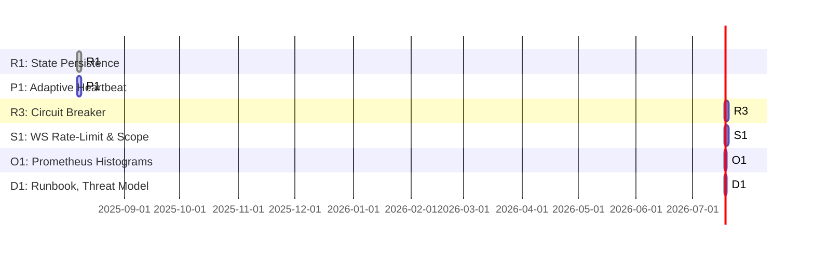

# Sprint 1 Overview: Stateful & Safe

## Goal
Productionize the metacognition/self-awareness system by establishing durable state, safe event flows, and foundational observability/security.

## Scope
- Add Redis snapshot persistence
- Adaptive heartbeat engine
- Circuit-breaker for event emissions
- Secure, rate-limited WebSocket
- Prometheus histograms
- Operational docs and threat modeling

## Entry Criteria
- Meta/self-awareness code running in non-resilient mode
- Redis/Prometheus/Grafana available in staging
- Team briefed on architecture and goals

## Exit Criteria
- Snapshots durable in Redis, restored on boot
- Heartbeat engine adapts to CPU load, no duplicate loops
- Circuit-breaker prevents event-loop death from analysis errors
- WS enforces per-client rate-limit, scope, and payload sanitization
- Prometheus exposes latency/histogram metrics; Grafana panel updated
- Runbook and threat model delivered

## Gantt-Style Task Order & Dependencies

## Env Variables Introduced
- `REDIS_URL`
- `REDIS_TLS`
- `HEARTBEAT_BASE_HZ`
- `METACOG_PUBLIC`
- `WS_FRAME_CAP`
- `JWT_SECRET`

## QA/Acceptance Checklist
- [ ] Redis snapshot keys present & restored on restart
- [ ] Heartbeat frequency adapts to load (test via stress)
- [ ] EventBus errors do not kill main process
- [ ] WS rejects clients w/o correct scope or over limit
- [ ] Prometheus `/metrics` exposes new histograms/gauges
- [ ] Grafana dashboard imported, p95 analysis latency & heartbeat skew visible
- [ ] Runbook covers restore, pageduty, metrics links