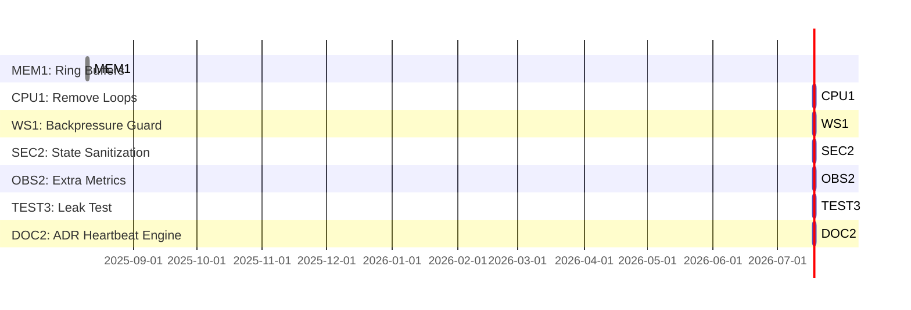

# Sprint 2 Overview: Performance & Protection

## Goal
Finalize hardening of the metacognition platform for high-load, memory safety, and full observability.

## Scope
- Memory guardrails (ring buffers)
- Remove legacy loops
- Backpressure safe WebSocket
- State sanitization
- Extended metrics
- Leak/GC tests
- Architecture docs

## Entry Criteria
- Sprint 1 tasks merged
- Redis, Prometheus, Grafana, Keycloak live
- Load/flood test baseline captured

## Exit Criteria
- No unbounded memory growth
- No duplicate heartbeat timers
- All outbound data rate-limited and sanitized
- Prometheus exposes all target metrics
- Leak test passes in CI
- Architecture doc delivered

## Gantt-Style Task Order & Dependencies

## QA/Acceptance Checklist
- [ ] Heap/GC profile flat after 30 min at 10Hz
- [ ] No duplicate heartbeat events in logs
- [ ] Backpressure drops counted, no OOM
- [ ] All secrets/PII sanitized in payloads
- [ ] All metrics present in `/metrics`
- [ ] Leak test passes in CI
- [ ] ADR doc published